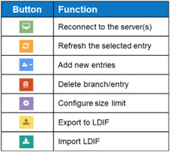
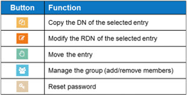
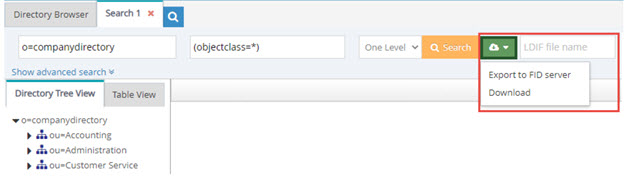
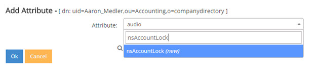
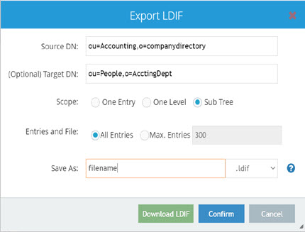

# Directory Browser Tab

The Directory Browser tab is a client to RadiantOne that leverages its RESTful Web Service API. Entries in all root naming contexts can be managed from here. All operations on the Directory Browser tab are performed as the user currently logged into the Main Control Panel.

Functions offered in the Directory Browser are broken into operations applicable to the server and directory tree entries and operations applicable to attributes of entries.

The tables below describe the buttons.


 
Figure 1: Options Applicable to the Server and Directory Tree/Entries


 
Figure 2: Options for Attributes of a Selected Entry

Each function is described in more detail below.

## Reconnect

To re-establish the connections to the RadiantOne service, click .

## Refresh

To refresh the selected entry/sub-tree branch, click .

## Search

To issue a search, select a branch in the virtual namespace and click . Condition the search with the options described below.

**Search Base DN** – starting point in the RadiantOne namespace to start looking for entries.

**Filter** – valid LDAP filter to condition the entries returned by the search.

**Return Attributes** – comma separated list of attributes to return for the matching entries.

**Maximum Entries** – maximum number of entries that match the criteria to be returned by the search.
**Timeout (in seconds)** – the maximum amount of time the search request is expected to take.

**Scope** - the depth of the virtual tree the search should span. Options are: base (only search the exact entry indicated in the search base DN), one (one level below the entry indicated in the search base DN), or sub (all entries below the indicated search base DN).

The search results display on the Directory Tree View tab by default. To view the results in a table format instead, click the Table View tab.

Multiple search windows can be opened at a time. To launch a new search, go back to the Directory Browser tab, select a branch in the virtual tree and click . An example of three searches is shown below.


 
Figure 3: Search Function on the Directory Browser Tab

**Exporting Search Results** – To support exporting search results, enable the Proxy Authorization Control. This can be enabled from the Main Control Panel -> Settings -> Server Front End -> Support Controls. Also ensure you have proper access controls defined for the delegated admin user/group from Main Control Panel > Settings > Security > Access Control.

After performing a search on the Directory Browser tab, you can export the search results to an LDIF file. Use  to specify a file name for the LDIF (if not specified, it defaults to Search) and the drop-down list to indicate the destination. The destination of the LDIF file can be either the RadiantOne Server or the local client. Choose one of these options from the drop-down menu. If “Export to FID Server” is selected, the location of the exported file is: <RLI_HOME>\vds_server\ldif\. If the specified file name already exists at the destination, the new file name is appended with a timestamp.

If “Download” is selected from the drop-down menu, the client machine downloads the LDIF according to your web browser’s configuration.


 
Figure 4: Search and Export Functions on the Directory Browser Tab

## Create Entries

To create new entries, select the parent location in the tree above where you want the entry created and click . Select New Entry, New inetOrgPerson, New Active Directory User New OrganizationalUnit, New Group, or New Active Directory Group. If the entry is not created in a RadiantOne Universal Directory store, the create request is sent to the authoritative backend and processed accordingly. If this operation fails, the error code from the backend is returned to the Directory Browser tab. If the parent entry is in a Universal Directory store, RadiantOne processes the create request directly.

The sections below describe these default new entry options including the object classes that are used. If you want to create entries using different types of object classes than the ones mentioned here, then choose the New Entry option and select the desired object class from the drop-down list. Only object classes available in the RadiantOne LDAP schema are shown here. If the desired object class is not shown, extend the schema first and then come back to this screen to add your entry. See [RadiantOne Schema](radiantone-ldap-schema) for details on extending the LDAP schema.

## New Entry

To create entries based on an object class other than group, organizationalUnit, inetOrgPerson, or user, choose the New Entry option. When you select the “New Entry” option, you are shown a drop-down list with all object classes available in the RadiantOne LDAP schema. Select the object class that the entry should belong to. After the object class is selected, enter the RDN in the space provided, and then enter values for the attributes below (all required attributes must have values – required attributes are noted with a “yes” in the “Required?” column). Type the value after clicking in the Value column. 

## New Group

When creating a new group, you can select from the following list of object classes: group, groupOfNames, groupOfUniqueNames, groupOfUrls. More than one object class may be selected. 

>**Note – if you want the group to be a dynamic group, you must choose the groupOfUrls object class.**


Figure 5: Creating a New Group Entry

## New OrganizationalUnit

If you choose to create a new organizationalUnit, the entry is associated with the organizationalUnit object class.

## New Active Directory User

This is only relevant if the underlying source is Active Directory. This is a special template for Active Directory due to the specific attributes that are required to be set during the creation of an account. When creating a new Active Directory user, an SSL connection is required if a password is entered for the account. If you do not want to set a password during the account creation, check the Account is Disabled option.

## New inetOrgPerson

If you choose to create a new user, the entry is associated with the inetOrgPerson object class.
## New Active Directory Group

If you choose to create a new Active Directory group, it is associated with the group object class. After entering a group name and description, select one of the following group types. 
-	Global group – this option allows user objects from its own domain and global groups from its own domain as members. Global Groups are displayed in the Main Control Panel > Directory Browser tab with  next to the entry.
-	Domain local group – this option allows user objects, global groups, and universal groups from any domain as members. Domain local groups can also include, and be a member of, other domain local groups from within its domain. Domain Local Groups are displayed in the Main Control Panel > Directory Browser tab with  next to the entry.
-	Universal group – this option allows user objects, global groups, and universal groups from anywhere in the forest as members. Universal Groups are displayed in the Main Control Panel -> Directory Browser tab with  next to the entry.

By default, the Security Group option is selected. To make this group a distribution group, uncheck the Security Group box.

## Managing Entries

### Managing Group Entries
Groups stored in a Universal Directory store may contain members from any branch in the RadiantOne namespace (not just limited to the local store where the group is defined). Groups virtualized from existing backends might not have this same flexibility. Select the desired group and click .

#### Adding Members

Members can be either “static/explicit” or “dynamic”. Each option is described in this section. RadiantOne Universal Directory stores support both static and dynamic members, but other LDAP backends may not.

##### Explicit Members

To add explicit members, follow the steps below.
1.	From the Directory Browser tab, select the group entry in the tree and click .

2.	If group members can be other groups, click the checkbox next to the “Search Groups” option in the upper left. 

>**Note – if RadiantOne needs to [support nested groups](access-control#enable-nested-groups), you must enable that feature.**

3.	Click **Add More** and then click **Browse Tree** to select a starting point in the virtual namespace to look for users.

4.	To limit the search criteria, enter a value before clicking Search. The value must match either a uid, sn, or cn value.

The object class for the user must be inetOrgPerson, user, person, or organizationalPerson (for the search to return them as a user entry). If you selected the option to search for groups, the group must be associated with an object class of group, groupofnames or groupOfUniqueNames. 

5.	Once you find the user (or group) account you want to add to the group, select the account and click the down arrow and click Confirm.

### Dynamic Members

Dynamic group members are different than explicit group members because instead of specifying a user DN in the group membership attributes (either the member or uniqueMember attributes), you need to specify the LDAP URL containing the filter to find the group members in an attribute named memberURL. The syntax for the memberURL value is as follows:

```
<base_dn>?[attrs]?[sub|one|base]?<filter>
```

-	base_dn is the location in the virtual tree to start searching from to find the user entries you want to be a member of the group.
-	attrs is optional and here you can provide certain attributes to return about the user entries.
-	the next value is for the scope of the search. This can be either sub (for sub tree search scope), one (for one level search scope), or base (for base level search scope).
-	the final parameter is the filter that should be used to return all members for the group. 

To add dynamic members with the assistance of a wizard, follow the steps below.

1.	Select a group associated with the groupOfURLs object class and click .

2.	Click **Edit Dynamic Members**. 

3.	If group members can be other groups, click on the checkbox next to the “Search Groups” option in the upper left.

>**Note – if RadiantOne needs to [support nested groups](access-control#enable-nested-groups), you must enable that feature.**

4.	Click **Add**.

5.	Enter a base DN (starting point in the virtual namespace) or click **Browse** to navigate to the location of the users. 

6.	Select the scope of search needed to find the users. 

7.	Finally, enter the filter that qualifies the users as members of the specific group. 

8.	Click **OK**. 

9.	Click **Confirm**. 

An alternative to using a wizard to manage dynamic group members is to manually add the groupOfUrls object class (although, not all LDAP backends allow the object class attribute to be modified) and memberURL to the group entry. Follow the steps below.

1.	Navigate to the group in the Main Control Panel > Directory Browser Tab.

2.	Select the group entry and on the right side, select the objectclass attribute.

3.	Choose Modify Attribute > Add Value.
4.	Enter groupOfURLs for the new object class and click **OK**.

5.	To add members, with the group selected in the tree, click **Add Attribute** on the right side.

6.	In the attribute drop-down list, select memberURL.

7.	Enter the memberURL using the syntax mentioned above. Click **OK** and the group entry is updated accordingly.

For more details on managing groups stored in a Universal Directory store, please see the RadiantOne Namespace Configuration Guide.

### Removing Members

To remove group members, from the Main Control Panel > Directory Browser Tab, select the group entry and click . If the group is a dynamic group, there is an option to edit “explicit” members and one to edit “dynamic” members.

To remove explicit members:

1.	Select the group entry and click . 

2.	Click **Edit Explicit Members**. 

3.	Click **Remove Members**.

4.	Select the DNs of the members to remove.

5.	Click **Confirm Remove Members**. 

6.	Click **Close**.

To remove dynamic members:

1.	Select the group entry and click . 

2.	Click **Edit Dynamic Members**. 

3.	Click **Remove Members**.

4.	Select the queries representing the members to remove.

5.	Click **Confirm Remove Members**. 

6.	Click **Close**. 

### Modifying Group Attributes

All group attributes that allow modifications can be changed from the Main Control Panel > Directory Browser tab. 

1.	Select the group entry in the tree and then on the right side, click the attribute you want to update.

2.	Click Modify Attribute -> Edit. 

3.	Enter the new value.

4.	Click **OK**.

To add a value to a multi-valued attribute, select the attribute and choose Modify Attribute > Add Value.

To delete a value from a multi-valued attribute, select the attribute and value you want to remove and choose Modify Attribute > Delete Value. Click **Yes** to confirm the deletion.

## Managing User Entries**

User entries can be managed from the Main Control Panel > Directory Browser tab.

### Disabling User Accounts

When an account is disabled, the user is not able to authenticate (bind) to the directory anymore. To disable an account located in a RadiantOne Universal Directory store (or a backend that supports nsAccountLock), add an attribute named nsAccountLock with a value of true to the user entry. Any user that has proper permissions to write the nsAccountLock attribute can set this value. To enable the account, set nsAccountLock to false.

1.	Administrators can disable an account from the Main Control Panel > Directory Browser tab. Navigate to the user entry. On the right side, click **Add Attribute**.

2.	Type in nsAccountLock and press Enter on your keyboard.


 
Figure 6: Adding nsAccountLock to a User Entry

3.	Enter a value of true and click **OK**. 


 
Figure 7: Locking a User Account

The account is now disabled. If this user tries to authenticate to the directory, the server responds with: [LDAP: error code 53 - Account inactivated. Contact system administrator to activate this account].

### Modifying Attributes

Attributes can be updated, added or deleted.

#### Updating Attributes

To update attributes, select the entry in the tree and on the right side, select the attribute you want to change. Click the Modify Attribute > Edit option and provide the new value. To add a value to a multi-valued attribute, select the attribute and choose Modify Attribute > Add Value. To delete a value from a multi-valued attribute, select the attribute value you want to remove and choose Modify Attribute > Delete Value.

#### Adding Attributes

To add attributes, select the user in the tree and on the right side, click **Add Attribute**. Enter an attribute name or select the attribute from the drop-down list and provide a value. Click **OK**.

#### Deleting Attributes

To delete attributes, select the user in the tree and on the right side, select the attribute you want to remove then click **Delete Attribute**.

#### Editing Photo Attributes

If an attribute is of binary type, select the attribute and choose Modify Attribute -> Edit. This brings up the binary editor. Browse to the new file and click **OK**.


 
Figure 8: Binary Attribute Editor

#### Resetting Passwords

To reset a user’s password, select the user entry in the tree and on the right, select the userPassword attribute. Click Modify Attribute > Edit. Change the value and click **OK**.

>**Note – If the account is in a proxy virtual view to an Active Directory backend, you can reset the password using  on the Main Control Panel > Directory Browser. The account must be associated with the “user” object class and the data source connection to the backend Active Directory requires SSL.**

## Modify RDN

To modify the RDN value of the selected entry, click . If the entry is not located in a RadiantOne Universal Directory store, the modify RDN request is sent to the authoritative backend and processed accordingly. If this operation fails, the error code from the backend is returned to the Directory Browser tab. If the entry is in a Universal Directory store, RadiantOne processes the modify RDN request directly.

## Delete Entry

To delete the selected entry, click . If the entry is not located in RadiantOne Universal Directory store, the delete request is sent to the authoritative backend and processed accordingly. If this operation fails, the error code from the backend is returned to the Directory Browser tab. If the entry is in a Universal Directory store, RadiantOne processes the delete request directly.

## Copy DN

To copy the DN of the selected entry, click . This is useful if you need to paste this value somewhere else (e.g. into a uniquemember attribute of a group entry, or in an LDAP connection as the Bind DN).

## Number of Entries (Size Limit) 

To change the number of entries displayed below each branch in the directory tree, click . The default is 20 entries. Enter a new value for the size limit and click OK. Then click .

><span style="color:red">**IMPORTANT NOTE – if you set the size limit to more than 100, you should make sure the Paged Results Control is enabled for RadiantOne. This setting can be found on the Main Control Panel -> Settings tab -> Server Front End -> Supported Controls.**

## Export LDIF

To export entries to an LDIF file, click . The possible properties are described below.

Exporting entries to an LDIF file requires enabling [Proxy Authorization](settings-tab#proxied-authorization-control) for users other than the [RadiantOne super user](administration-and-configuration#delegated-administration-roles). The exported entries contain only the attributes that applicable ACIs allow the user to read. Refer to [Security and Access Controls](security-and-access-controls) for more information.

**Location** – select “To a Local File” to download to the local client. The destination of the LDIF file is dictated by the client’s browser settings. Select “To a File on the Server” to download to <RLI_HOME>/vds_server/ldif/export.

>**Note – the LDIFZ format is not available for local downloads because the client does not have access to the encryption key.**

**Source DN** – starting location from where to export entries.

**Target DN** – the suffix associated with the target DNs. The entries in the LDIF file have their source DN suffix translated into the target DN. If there is no value here, the entries in the LDIF file have keep the source DN.

**Scope – select the One Entry option to export only the entry indicated by the Source DN. Select One Level to export entries one level below the Source DN. Select Sub Tree to export all entries below the Source DN.**

**Entries and File** – Choose to either export all entries, or enter a max number to export. Also, enter a file name in the Save As property.

**File Type Drop-down Menu** – The file extension can be either LDIF or LDIFZ. The LDIF format is available only if the [secureldifexport]() property in ZooKeeper is set to False. The LDIF format is available for both local and server-side exports. The location of the local downloads depends on the web browser’s configuration.

The LDIFZ format (zipped and encrypted) is available for server-side exports only because the client does not have access to the encryption key. This format requires an [LDIF encryption key](). The location of the exported file is: <RLI_HOME>/vds_server/ldif/export.


 
Figure 9: Export to LDIF

><span style="color:red">**IMPORTANT NOTE – If an LDIFZ encryption key is not defined and secureldifexport is set to true, the Export LDIF window displays the following message: <br>
“For security purposes, only encrypted LDIF exports are allowed (using LDIFZ). Please contact your RadiantOne Administrator to configure LDIFZ encryption.”**

## Import LDIF

Make sure the LDIF file you want to import is located on the RadiantOne server under <RLI_HOME>/vds_server/ldif/. To import entries from an LDIF file, click . Navigate to the location of the LDIF file. Select the option to Add or Override Entries (this option adds new entries and updates entries that already exist) or Add Entries (This option adds entries only and does not try to update the entry if it already exists).


 
Figure 10: Import LDIF

## Test Authentication

You can test authentication for any entry in the RadiantOne namespace. To test authentication:

1.	In the RadiantOne Main Control Panel, go to the Directory Browser tab.

2.	Expand a root naming context and select an entry.

3.	Click . The Test Authentication window opens.

4.	Enter the password and click **Test Bind**. If the password is correct, the Test Authentication window returns the message “Binding Successful”. If the password is incorrect, a message similar to the following is returned.
<br>Connection failed:javax.naming.AuthenticationException: [LDAP: error code 49 – Reason: 52e – Invalid credentials.
