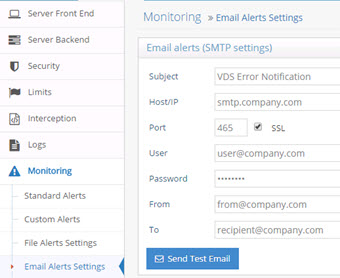

# Monitoring and Alerts

When monitoring RadiantOne, you can configure alerts. These alerts may be in the form an email and/or logging to a file. These options are described in this section and can be configured from the Main Control Panel > Settings Tab > Monitoring section.

## Standard Alerts

Standard alerts come pre-configured for some of the most monitored aspects of RadiantOne which are: RadiantOne memory, connections, disk usage, disk latency, processing activity and data source availability. Some standard alerts are enabled (for File output) by default and the others can be enabled from Monitoring > Standard Alerts. 

For details on the standard alert options, please see the RadiantOne Monitoring and Reporting Guide.

## File Alert Settings

File alerts are enabled by default for some standard alerts which are associated with: RadiantOne memory, disk usage, and disk latency. These settings are in the Monitoring > Standard Alerts section.

File alerts can be enabled for custom alerts also. These settings are in the Monitoring > Custom Alerts section.

File alerts are logged in a CSV formatted file alerts.log.

In the File Alerts Settings section, indicate a rollover file size and how many files to keep in the archive.

Figure 1: File Alert Settings

## Email Alert Settings

If you would like to receive email alerts for certain monitored activities, enter your SMTP settings (host, port, user, password, from email and to email) in the Email Alerts (SMTP Settings) section. Click Save when finished. If you would like to test your settings, click on Send Test Email. 

Figure 2: Email Alert Settings

>[!note] For security and audit purposes, it is not advised to connect to your mail server anonymously (leaving user and password properties blank in the Email Alert Settings).**

## Custom Alerts

Standard Alerts are configured by default and are described in the one of the sections above. All other aspects of RadiantOne that you want to monitor can be configured as custom alerts in the Monitoring > Custom Alerts section. For details on custom alerts, please see the Monitoring and Reporting Guide.

>[!note] This section is accessible only in [Expert Mode](introduction#expert-mode). 

