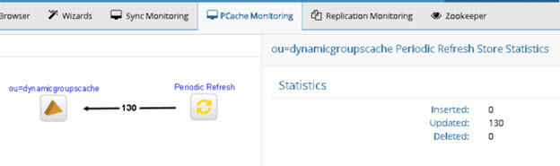

# PCache Monitoring Tab

The PCache Monitoring Tab can be used to monitor periodic and real-time persistent cache refresh.
On the PCache Monitoring Tab, a list of cache refresh topologies appears on the left. 

 is the symbol for a real-time refresh.

 is the symbol for a periodic refresh.
When you select a real-time refresh topology, the persistent cache refresh components are shown on the right where you can see the number of messages processed by each component. Clicking on a component allows you to see the status and access the properties. 

 
Figure 1: PCache Monitoring Tab – Real-time Refresh

When you select a periodic refresh topology, the persistent cache refresh components are shown on the right. The arrow between the periodic refresh process and the target cache indicates the numbers of insert, update, and delete operations that were processed. By clicking on the line, you can see the total numbers processed per operation type.

 
Figure 2: PCache Monitoring Tab – Periodic Refresh

From the Tools menu, you can start and stop the persistent cache refresh process.

Click the Logs menu to display the logs section at the bottom of the topology. From here you can view the logs associated with the components in the topology.

To enlarge the displayed topology, click  in the upper-right.

To reduce the size of the displayed topology, click  in the upper-right.

To automatically organize the display for all objects associated with the topology, click  in the upper-right.

For details about configuring persistent cache with periodic and real-time refresh, see the RadiantOne Deployment and Tuning Guide.
