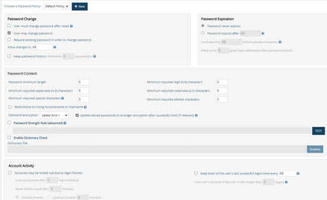
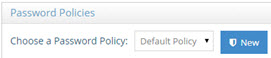
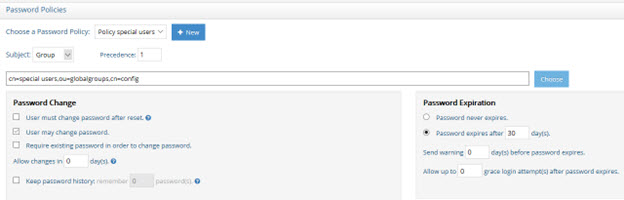
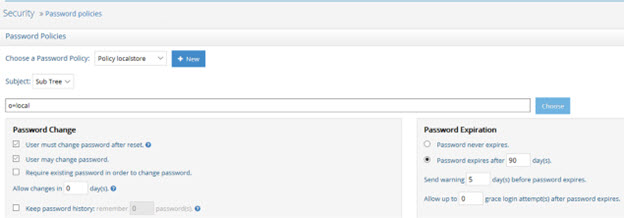
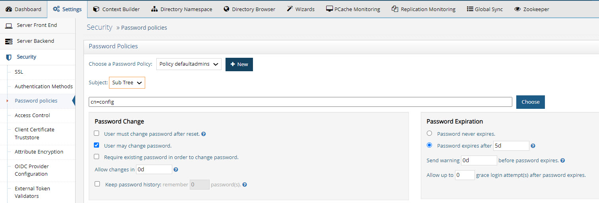
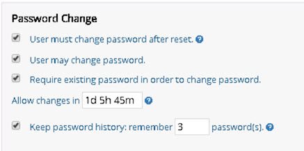
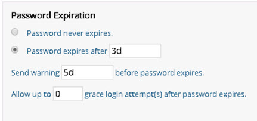
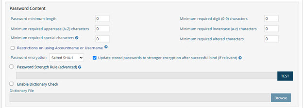
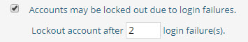

## Password policies overview

Password policies let you control password requirements, expiration, resets, password history, and account lockout for RadiantOne Universal Directory stores and persistent caches (p-caches).

Password policies apply only to Universal Directory stores and p-caches that contain user passwords and have password policy enforcement enabled. They do not apply to other backend configurations, such as proxies or databases.

>[!warning]
> Password strength rules are enforced only when the password value in the modify request is not hashed. If a client sends a hashed password, RadiantOne cannot reverse the hash to validate it against password content strength rules. By default, RadiantOne bypasses the password policy check and accepts the hashed value as provided. This supports legacy LDAP replacement use cases in which entries with existing hashed passwords are imported directly into a RadiantOne directory.

To configure password policies, go to **Main Control Panel** > **Settings** > **Security** > **Password Policies**.



Figure 47: Password Policies

## Privileged password policy group

Users in the `PrivilegedPasswordPolicyGroup` can bypass password policies. For example, you can add helpdesk users to this group so they can reset a user's password even when the new password does not meet password content criteria or is in the password history.

>[!warning]
> Password policies also do not apply to the RadiantOne super user account, such as `cn=directory manager`, or to members of `cn=directory administrators,ou=globalgroups,cn=config`. They also do not apply to members of the Directory Administrators group configured in **Main Control Panel** > **Settings** > **Server Front End** > **Administration**.

To add users to the Privileged Password Policy Group:

1. In the Main Control Panel, select the **Directory Browser** tab.
2. Expand `cn=config` and `ou=globalgroups`.
3. Select `cn=PrivilegedPasswordPolicyGroup`.
4. Select **Manage Group**.
5. Add the privileged accounts to the group.

## Password policy scope

The default password policy applies globally to all RadiantOne Universal Directory stores and persistent caches where password policy enforcement is enabled, regardless of the user's location. You can create custom policies for a subset of users based on their group membership or location in the virtual namespace.

>[!note]
> If both a global and local policy apply to a user, the local policy takes precedence. For more information, see [Password policy precedence](#password-policy-precedence). To enforce password policies for a persistent cache branch, select **Enable Password Policy Enforcement** in the cache settings. For more information about persistent cache, see the [RadiantOne Deployment and Tuning Guide](/deployment-and-tuning-guide/00-preface).

### Cross-store password policy for persistent cache

For a p-cache branch backed by an HDAP store, you can keep password policy state consistent between the cache and backend storage tiers.

In the **Persistent Cache** configuration panel:

- **Enable Password Policy Enforcement** enables password policy checks on the p-cache branch.
- **Cross-Store Password Policy** enables bidirectional synchronization of password policy operational attributes between the p-cache and its underlying HDAP backend stores, as well as across replicated cluster topologies.

>[!note]
> When **Cross-Store Password Policy** is used with inter-cluster replication and sync-refresh, password failure counts, account lockouts, and administrative password resets are tracked regardless of the cache node or HDAP store to which the client connects.

### Default password policy

In the **Choose a Password Policy** list, select **Default Policy** to edit the global default policy.



Figure 48: Password Policy Scope

### Custom password policy

To create a custom policy, select **New** next to the **Choose a Password Policy** list. Enter a name for the policy and select **OK**.

Set the custom policy **Subject** to either **Sub-tree** or **Group**, then select **CHOOSE** to select a base DN.

- A **Sub-tree** policy applies to all user entries below the selected base DN. The base DN must be a RadiantOne Universal Directory store or persistent cache.
- A **Group** policy applies to all users who belong to the group specified by the base DN. The group DN can represent a static group, with unique members listed in the group entry, or a dynamic group that uses the `groupOfURLs` object class and a `memberURL` attribute to define membership. RadiantOne automatically evaluates dynamic membership when enforcing password policies.

If both a sub-tree policy and group policy apply to a user, the group policy takes precedence.

>[!note]
> Custom policy properties override the default policy. The exception is password content properties: you can choose to enforce the custom policy's content settings or use the default policy's settings. In a custom policy, a password content value of `0` means the setting is unlimited; it does not mean the setting is undefined.

The following example shows a custom policy for users in a Universal Directory store who are members of the Special Users group: `cn=special users,ou=globalgroups,cn=config`.

>[!note]
> If multiple group-based custom policies share members, do not assign them the same precedence. For a user affected by multiple group-based policies, the policy with the highest precedence—represented by the lowest numeric value—is enforced.



Figure 49: Example Custom Password Policy Applicable to a Group

The following example shows a custom policy for all users below a specific container. The policy applies to users in a Universal Directory store below `o=local`.

>[!note]
> You cannot configure a precedence level for sub-tree policies. Do not configure multiple sub-tree policies for the same location. If multiple sub-tree policies affect the same branch, the policy defined at the lowest point in the directory tree is enforced.



Figure 50: Example Custom Password Policy Applicable to a Sub Tree

### Password Policy Associated with Control Panel Delegated Administrator Roles

Default delegated administrator roles and users for the RadiantOne Control Panel are located in the `cn=config` naming context. To define a custom password policy for users in these roles, select **Sub-tree** as the subject and enter `cn=config` as the location, or enter another location where the users are stored.

The following example sets delegated administrator passwords to expire after five days.



>[!note]
> To apply a custom password policy to a specific delegated administrator role, select **Group** as the password policy subject and use **Choose** to select the group entry associated with that role.

## Password policy precedence

If a user entry has a [`pwdPolicySubentry`](#pwdpolicysubentry) attribute containing a DN for a password policy below `cn=Password Policy,cn=config`, RadiantOne enforces that policy. If the attribute is missing or points to a policy that does not exist below `cn=Password Policy,cn=config`, RadiantOne evaluates the other configured policies that apply to the user.

RadiantOne applies policies in this order:

1. A policy referenced by the user's `pwdPolicySubentry` attribute is enforced. No other policies are considered.
2. If both global and local policies apply, the local policy is enforced.
3. If both group-based and sub-tree policies apply, the group-based policy is enforced.
4. If multiple group-based policies apply, the policy with the highest precedence—the lowest numeric precedence value—is enforced.
5. If multiple sub-tree policies apply, the policy with the deepest DN is enforced.

Keep the following in mind:

- Precedence is a number from `1` through `1000`, where `1` is the highest precedence and `1000` is the lowest. The value is stored in the `policyPrecedence` attribute of the password policy entry.
- The default password policy always has the lowest precedence value: `1000`.
- Each group-based custom policy has a precedence level. When a user belongs to multiple groups with different password policies, this number determines which policy RadiantOne enforces.
- Do not configure multiple sub-tree policies for the same location. If multiple policies affect the same branch, RadiantOne enforces the policy at the lowest point, or deepest DN.
- Do not assign the same precedence to group-based custom policies that share members.

## Password changes



Figure 51: Password Changes Options

### User must change password after reset

The `pwdMustChange` attribute on the `cn=Password Policy` entry controls this setting and can be `True` or `False`.

When it is `True`, users can bind with a password that has been reset, but they must change it before they can perform any other directory operation. Until they do, RadiantOne returns the following error for other requests:

`You must change your password before submitting any other requests`

>[!warning]
> The applicable password policy must enable both **User must change password after reset** and **User may change password**.

The following actions are treated as a password reset and trigger this requirement:

- A new user account is created by someone other than `cn=directory manager` or a member of the `cn=directory administrators` group.
- An existing user's password is changed by someone other than the user, `cn=directory manager`, or a member of `cn=directory administrators,ou=globalgroups,cn=config`.

If `pwdMustChange` is missing or set to `False`, users are not required to change their password after an administrator resets it.

### Password reset and required password change

When **User must change password after reset** is enabled (`pwdMustChange: TRUE`), users whose passwords are reset by an administrator or service can still bind with the reset password, but must change it before they can perform other directory operations.

When an administrator or service changes a password instead of the user, the account is marked with the `pwdReset` operational attribute set to `TRUE`. This state replicates to all HDAP stores and p-cache branches. The user can still bind successfully with the reset password. Until the user changes their password, subsequent directory operations, such as searches, reads, and writes, return **result code** `53 (Unwilling to Perform)` with diagnostic reason `773 - User must reset password`.

The user must perform a self-service password change to clear the requirement. After the change succeeds, `pwdReset` is removed from all stores and caches, and normal access is immediately restored.

>[!warning]
> Configure an ACI that grants self-update permission for `userPassword` to `userdn = "ldap:///self"` in both the HDAP backend namespace and the p-cache namespace. This permission lets users change their own expired or reset passwords.

### User may change password

The `pwdAllowUserChange` attribute on the `cn=Password Policy` entry controls whether users can change their own passwords. The value is `True` when enabled and `False` when disabled.

### Require existing password to change password

The `pwdSafeModify` attribute on the `cn=Password Policy` entry controls whether users must provide their existing password with the new password. The value is `True` when enabled and `False` when disabled.

### Allow password changes after a specified time

The `pwdMinAge` attribute on the `cn=Password Policy` entry specifies the number of seconds that must pass between password changes. If the attribute is missing, RadiantOne assumes `0` seconds.

In the Main Control Panel, enter a duration using any combination of days (`d`), hours (`h`), and minutes (`m`). For example, `1d 5h 45m` allows a password change after 1 day, 5 hours, and 45 minutes.

>[!note]
> Your password policy must meet this requirement: `pwdMinAge + pwdExpireWarning < pwdMaxAge`.

### Keep password history

The `pwdInHistory` attribute on the `cn=Password Policy` entry specifies the maximum number of previous passwords to store in the `pwdHistory` attribute. If the attribute is missing or set to `0`, RadiantOne does not store previous passwords in `pwdHistory`, and users can reuse passwords.

## Password expiration



Figure 52: Password Expiration Options

### Password never expires

The `pwdMaxAge` attribute on the `cn=Password Policy` entry controls this setting. When **Password never expires** is enabled, the value is `0d`.

### Password expires after a specified time

The `pwdMaxAge` attribute on the `cn=Password Policy` entry specifies how long a changed password remains valid. If the attribute is missing or set to `0d`, the password does not expire. Otherwise, the value must be greater than or equal to `pwdMinAge`, which is the **Allow password changes after a specified time** setting.

In the Main Control Panel, enter a duration using days (`d`), hours (`h`), and minutes (`m`). For example, `1d 5h 45m` causes a password to expire after 1 day, 5 hours, and 45 minutes.

>[!note]
> Your password policy must meet this requirement: `pwdMinAge + pwdExpireWarning < pwdMaxAge`.

When a user's password has expired, the next client connection to RadiantOne on the user's behalf fails to bind. The additional information in the response indicates that the password has expired. For example:

```text
ldapsearch -h 10.11.12.164 -p 2389 -D "uid=tuser,ou=people,o=global" -w password -b "o=global" "(uid=tuser)"
ldap_simple_bind: Invalid credentials
ldap_simple_bind: additional info: Password has expired.
```

During the bind, RadiantOne determines whether the password has expired and returns the bind response and additional information to the client. The client is responsible for prompting the user to reset the password, if needed.

The user entry does not contain an attribute that indicates the password has expired. It can, however, contain `passwordExpWarned`, which records when the password-expiration warning was sent in the bind response.

```text
dn: uid=tuser,ou=people,o=global
passwordExpWarned: 20170622194148.238Z
```

### Send a warning before password expiration

The `pwdExpireWarning` attribute on the `cn=Password Policy` entry specifies how long before expiration RadiantOne sends a password expiration warning to an authenticating user.

In the Main Control Panel, enter a duration using days (`d`), hours (`h`), and minutes (`m`). For example, `1d` sends the warning 1 day before the password expires.

If this attribute is missing or set to `0d`, RadiantOne does not return expiration warnings. Otherwise, its value must be less than the value of `pwdMaxAge`.

>[!note]
> Your password policy must meet this requirement: `pwdMinAge + pwdExpireWarning < pwdMaxAge`.

When this setting is enabled, RadiantOne returns a control with the `BindResponse`, even if the client did not request it. The control indicates the time remaining before the password expires. For example:

```text
PasswordExpiringControl {2.16.840.1.113730.3.4.5 false secondsUntilExpiration=432000}
```

### Allow logins after password expiration

These logins are known as grace logins. The `pwdGraceAuthNLimit` attribute on the `cn=Password Policy` entry specifies how many times an expired password can still be used to authenticate. If the attribute is missing or set to `0`, authentication fails after the password expires.

During a grace login, RadiantOne processes the bind request. The next operation must be a `modifyRequest` that changes the password. Otherwise, RadiantOne returns this error:

`You must change your password before submitting any other requests`

## Password content

Password content settings include:

- Password minimum length
- Minimum required digit characters (`0-9`)
- Minimum required uppercase characters (`A-Z`)
- Minimum required lowercase characters (`a-z`)
- Minimum required special characters
- Password encryption

For more complex password content requirements, use **Password Strength Rule**.



Figure 53: Password Content and Account Lockout Options

### Enable password content settings

This setting applies only to custom password policies.

A custom policy can enforce its own password content criteria or inherit the criteria from the default policy. When enabled, the custom policy's password content settings override the default policy settings. A value of `0` means unlimited, not undefined.

When disabled, the default policy defines the password content criteria.

### Password minimum length

The `pwdMinLength` attribute on the `cn=Password Policy` entry specifies the minimum number of characters in a password. If the attribute is missing, RadiantOne does not enforce a minimum password length.

### Minimum required digit characters

This setting specifies the number of numeric characters required in a password.

### Minimum required uppercase characters

This setting specifies the number of uppercase characters required in a password.

### Minimum required lowercase characters

This setting specifies the number of lowercase characters required in a password.

### Minimum required special characters

This setting specifies the number of special characters required in a password.

### Minimum required altered characters

This setting specifies how many characters must differ between the old and new passwords. It requires both **User must change password after reset** and **Require existing password to change password** to be enabled in the password policy's **Password Changes** section.

>[!note]
> RadiantOne uses the Damerau-Levenshtein algorithm to calculate the character differences between the old and new passwords.

### Restrict account name and user name use

The `pwdEnableNotContainNames` attribute on the `cn=Password Policy` entry can be `true` or `false`. When it is `true`, a user's password cannot contain the user's account name or more than two consecutive characters from the user's full name.

For the account name, RadiantOne checks `sAMAccountname` first, then `uid`, and then the RDN value. For the full name, RadiantOne checks `displayName`, then `cn`, and then the computed full name (`givenName+sn`). These checks are not case-sensitive.

### Password encryption

Passwords stored in a RadiantOne Universal Directory store can be hashed with these methods: `CRYPT`, `MD5`, `PBKDF2AD`, Salted SHA-1, Salted SHA-256, Salted SHA-384, Salted SHA-512, and `SHA-1`. The less secure `CRYPT`, `MD5`, and `SHA-1` methods are hidden in the Main Control Panel.

>[!warning]
> Azure AD expects the `PBKDF2AD` password encryption method. If an HDAP store or persistent cache synchronizes passwords to Azure AD, use `PBKDF2AD` to store passwords in the RadiantOne Universal Directory.

### Automatically upgrade password hashes

When **Update stored passwords to stronger encryption after successful bind** is enabled, RadiantOne automatically updates a user's password to a stronger hash after a successful bind if the current hash is less secure than the hash allowed by the current password policy.

The exception is a password currently hashed with `PKCS5S2`, `PBKDF2`, `PBKDF2AD`, `SCRYPT`, `BCRYPT`, `SMD4`, or `MD4`; RadiantOne does not change these hashes. The setting is stored in the `pwdEnableAlgorithmUpgrade` attribute of the `cn=Password Policy` entry and can be `True` or `False`.

The hash strength order is:

```text
CLEAR -> CRYPT -> MD5 -> SHA1 -> SSHA1 -> SHA256 -> SSHA256 -> SHA384 -> SSHA384 -> SHA512 -> SSHA512 -> (PKCS5S2 | PBKDF2 | PBKDF2AD | SCRYPT | BCRYPT | SMD4 | MD4)
```

>[!note]
> `PKCS5S2`, `PBKDF2`, `PBKDF2AD`, `SCRYPT`, `BCRYPT`, `SMD4`, and `MD4` are special hashes with the highest ranking.

### Password strength rule

The standard password content settings use an AND operation. For example, a policy that defines a minimum password length, a minimum number of digits, and a minimum number of uppercase letters is evaluated as:

```text
<min password length> AND <min # of digits> AND <min # uppercase letters>
```

Use **Password Strength Rule** to create and test more complex requirements with OR conditions. For example, you can require either a specified number of special characters or a specified number of uppercase characters.

The following rule requires at least six characters, at least one lowercase letter, at least one uppercase letter, and at least one digit or symbol:

```text
^(?=.{6,})(?=.*[a-z])(?=.*[A-Z])(?=.*[\d\W]).*$
```

The following rule allows only alphanumeric characters and prevents special characters:

```text
^[a-zA-Z0-9]+$
```

>[!note]
> Enabling **Password Strength Rule** disables and overrides all other password content options except **Password minimum length** and **Password encryption**.

Enter the rule using regular expression syntax, then select **Test** to compile the expression.

### Enable dictionary check

**Enable Dictionary Check** is comparable to the Strong Password Check plug-in in legacy LDAP directories. It lets RadiantOne verify that a user's password does not contain disallowed strings from a specified dictionary file.

>[!warning]
> By default, RadiantOne uses an exact-match comparison between the password and dictionary values. To use a contains-match comparison, go to **Main Control Panel** > **Zookeeper**, navigate to `/radiantone/<version>/<clusterName>/config/vds_server.conf`, and select **EDIT MODE**. Set the following property:
>
> ```text
> "enablePwdPolicyDictionarySubstringCheck" : true
> ```
>
> The value `true` must be lowercase. You can also set this property with the `vdsconfig` command-line utility and its `set-property` command. For more information, see the [RadiantOne Command Line Configuration Guide](/command-line-configuration-guide/01-introduction).

To enable dictionary checking:

1. Go to **Main Control Panel** > **Settings** > **Security** > **Password Policies**.
2. In the **Password Content** section, select **Enable Dictionary Check**. This value is stored in the `pwdEnableDictionary` attribute of the `cn=Password Policy` entry and can be `True` or `False`.
3. Select **Browse** and select the dictionary file. The file location is stored in the `pwdDictionaryFile` attribute of the `cn=Password Policy` entry.
4. Select **Save**.

>[!note]
> The dictionary file must be a text file with one dictionary word per line.

## Account activity and lockout

Accounts can be locked automatically in either of these situations:

1. The user has not successfully authenticated to RadiantOne for longer than a specified period.
2. The user reaches the configured failed-login threshold.

### Track the last successful login time

To track a user's last successful login time, enable **Keep track of the user's last successful logon time** in the password policy's **Account Activity** section.

>[!warning]
> You can exclude `pwdLastLogonTime` changes from the RadiantOne changelog by setting the following property in ZooKeeper at `/radiantone/<Config_Version>/<RadiantOne_ClusterName>/config/vds_server.conf`:
>
> ```text
> "skipLoggingIntoChangelogForPwdLastLogonTime" : "true"
> ```
>
> This reduces excessive changelog writes in environments with high volumes of user logins. The property is global and affects all password policies.

You can set how often RadiantOne records the time of the last successful authentication. The default is `0s`, which updates the time after every successful authentication. To use a different interval, enter a duration using days (`d`), hours (`h`), and minutes (`m`). For example, `1d` updates the last login time only when at least one day has passed since the previous successful authentication. Successful authentications within that interval do not update the last login time.

>[!warning]
> Tracking successful logins affects performance because every successful bind performs a write operation. Set an update frequency and test the feature in your environment to determine whether the performance impact is acceptable.

To lock accounts automatically after a period of inactivity, set the threshold in the **Account Activity** section: **Lock user's account if the user is idle longer than <X> days**. Resetting the user's password unlocks the account. If the account remains unused longer than the configured threshold after it is unlocked, it is locked again. A value of zero days means users are never locked for inactivity.

### Lock accounts after failed logins

To lock accounts after a specified number of failed logins, select **Accounts may be locked out** in the password policy and configure the criteria.

**Lockout account after X login failures** sets the number of allowed failed login attempts. This setting is stored in the `pwdMaxFailure` attribute of the `cn=Password Policy` entry. The related `pwdFailureTime` operational attribute on the user entry stores the time of each failed login.

**Reset failure count after X minutes** sets the interval during which RadiantOne tracks failed login attempts. This setting is stored in the `pwdFailureCountInterval` attribute of the `cn=Password Policy` entry. For example, if the maximum failures is `2` and the reset interval is 5 minutes, the account is locked after two failures within 5 minutes. If one login fails and the next failure occurs after the 5-minute interval, the count resets and that later failure is treated as the first failure. RadiantOne uses the number of values in the `pwdFailureTime` attribute to determine the failure count.

>[!note]
> After an account is locked, the failure-count reset interval does not affect how many failed login attempts have occurred.

**Lockout forever** or **Lockout duration X minutes** controls how long the account remains locked. This setting is stored in the `pwdLockoutDuration` attribute of the `cn=Password Policy` entry. It corresponds to the [`pwdAccountLockedTime`](#pwdaccountlockedtime) operational attribute, which records when the account was locked. The account is unlocked after the lockout duration passes or an administrator resets the user's password. Any user other than the locked user who has the required ACIs can reset the password.

### Cross-store and multi-cluster lockout enforcement

When **Cross-Store Password Policy** is enabled, failed bind attempts are tracked across all HDAP stores and p-cache nodes. Each failed attempt adds an entry to the `pwdFailureTime` operational attribute, and failures across cluster nodes and p-cache instances count toward the configured limit (`pwdMaxFailure`).

When the failure count reaches `pwdMaxFailure`, the target entry receives the `pwdAccountLockedTime` operational attribute. This lockout status replicates to peer HDAP stores and synchronizes to downstream p-caches through sync-refresh.

After the account is locked, authentication attempts through any HDAP store or p-cache node return **result code** `19 (Constraint Violation)` with diagnostic reason `775 - Account locked`.

### Unlock accounts

A locked account can be unlocked by resetting the user's password. Any user other than the locked user who has the required ACIs can reset the password. If the lockout policy has a duration, the account is automatically unlocked when that duration ends.

### Unlock accounts across nodes

An authorized administrator can unlock an account that is locked because of excessive failed binds by changing the user's password through any connected HDAP store or p-cache endpoint.

Changing the user's password automatically clears `pwdFailureTime` and `pwdAccountLockedTime`. The cleared state replicates to all HDAP stores and sync-refreshes to all connected p-caches, immediately unlocking the account throughout the environment.

#### Required access control instructions (ACIs)

To let administrators or service accounts modify passwords and unlock accounts on both tiers, configure ACIs that grant `write` permission for the `userPassword` attribute in both locations:

1. The HDAP backend store namespace.
2. The persistent cache (p-cache) namespace.

## Password policy operational attributes

>[!warning]
> These attributes are operational attributes. They do not appear in user entries unless the client specifically requests them in a search.

### Cross-store behavior

The following table describes how key password policy operational attributes behave when **Cross-Store Password Policy** is enabled.

| Attribute | Description | Replication and cross-store behavior |
| :--- | :--- | :--- |
| `pwdFailureTime` | Timestamps of consecutive failed bind attempts. | Replicates across HDAP nodes and synchronizes to p-caches. Failures across nodes aggregate toward `pwdMaxFailure`. |
| `pwdAccountLockedTime` | Timestamp when the account was locked after it exceeded the maximum number of allowed failures. | Replicates across HDAP clusters and p-caches. Bind attempts return result code `19 (Constraint Violation: 775)`. |
| `pwdReset` | Set to `TRUE` when an administrator resets the password under a `pwdMustChange` policy. | Propagates across HDAP stores and p-caches. Standard operations return result code `53 (Unwilling to Perform: 773)` until the user completes a self-service password update. |

### pwdHistory

Stores previous password values to prevent password reuse. The `pwdInHistory` setting in the password policy determines how many passwords are stored.

### pwdChangedTime

A Generalized Time attribute that records when the password was last changed.

### pwdLastLogonTime

Stores the user's last successful login time (bind) when **Keep track of the user's last successful logon time** is enabled.

### pwdAccountLockedTime

A Generalized Time attribute that records when the account was locked. It is not present when the account is not locked.

If the maximum consecutive login failures (`pwdMaxFailure`) is reached during the configured interval (`pwdFailureCountInterval`), the user entry receives `pwdAccountLockedTime`, containing the time the account was locked.

### passwordExpWarned

A Generalized Time attribute that records when the password expiration warning was first sent to the client.

### pwdFailureTime

A multi-valued Generalized Time attribute that records the times of previous consecutive login failures. It is not present after a successful login. The number of values does not exceed the value configured for **Number of Login Failures** in the password policy.



Figure 54: Number of Login Failures

>[!note]
> After the reset-failure interval passes, RadiantOne updates `pwdFailureTime` during the next unsuccessful login. It removes the values after the next successful login.

### pwdGraceUseTime

A multi-valued Generalized Time attribute that records the times of previous grace logins.

### pwdPolicySubentry

Contains the DN of the password policy associated with the user. RadiantOne does not write this attribute or allow you to define password policies for individual users from the Main Control Panel.

If an entry was imported from another directory, it might contain a value for this attribute. When the value matches a policy defined in RadiantOne, RadiantOne enforces that policy for the user. When it does not match a policy defined in RadiantOne, RadiantOne ignores it and evaluates the configured policies below `cn=Password Policy,cn=config`. If multiple policies apply, RadiantOne enforces the policy with the highest priority based on precedence.

### pwdReset

A Boolean attribute set to `TRUE` when a password has been reset and must be changed by the user.

RadiantOne does not set `pwdReset` to `TRUE` when a user's password is set or reset by the RadiantOne super user, such as `cn=directory manager`, by a member of `cn=directory administrators,ou=globalgroups,cn=config`, or by the user. It sets `pwdReset` to `TRUE` only when another user, such as a helpdesk user, sets or resets the password.

When the affected user first logs in with the new password, they cannot perform operations until they change the password. For example, if the user attempts a search, RadiantOne returns error code `53` and a message indicating: `You must change your password before submitting any other requests`. After the user changes the password, RadiantOne removes `pwdReset` from the entry.

When a user resets a password, RadiantOne applies the following password policy checks:

- Whether the user is allowed to change the password.
- The minimum password age.
- Whether the old password is provided with the new password when **Require existing password to change password** is enabled.
- Password length.
- Password quality, including the required number of uppercase, lowercase, and numeric characters.
- Password history.
- Disallowed strings from a dictionary file.

After returning the bind response, the client is responsible for prompting the user as appropriate for the password policy response or control it receives.

RadiantOne can return the following modify response codes to the client application:

| Modify response code | Meaning |
| :--- | :--- |
| `53` | Password changes are not allowed because **User may change password** is disabled; the password cannot yet be changed because the minimum time since the last change has not passed; or the bound user's entry has `pwdReset=TRUE` and the user must change the password. In the last case, RadiantOne returns: `LDAP error code 53 – Reason 773 – User must reset password: You must change your password before submitting any other requests`. |
| `19` | A constraint is violated. This can mean that the minimum time since the last password change has not passed; the existing password is required but was not supplied; the new password is too short; the new password does not meet required special-character, uppercase-character, numeric-character, or lowercase-character counts; the new password appears in password history; or the password value is not allowed by the configured dictionary. |

