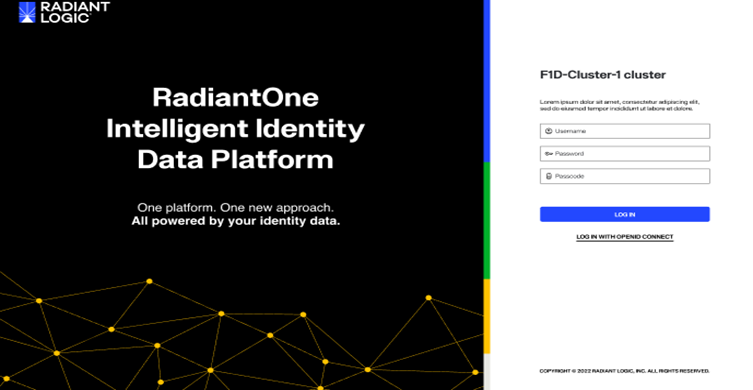
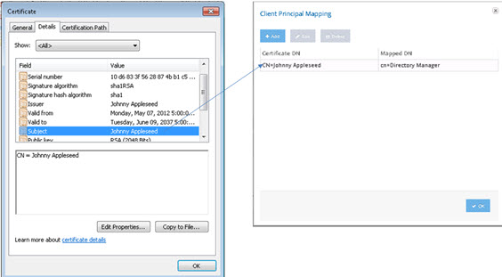
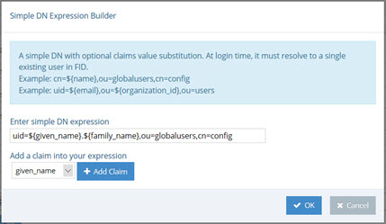
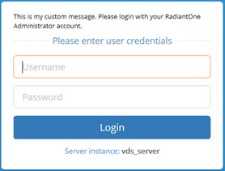
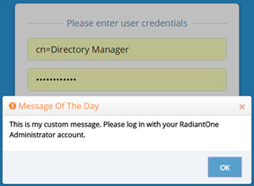

# RadiantOne Control Panels

The RadiantOne Control Panels are web-based interfaces to provide remote access to the most commonly used tools and wizards. The control panels are used by administrators to configure and maintain the service. In addition, the control panels offer monitoring, access to server statistics, reports, task management, and other administration options. It can be accessed from mobile or non-mobile devices including smartphones and tablets.

>[!note] To access the control panels, JavaScript must be enabled in the Internet browser you are using.

For cluster deployments, each RadiantOne node includes a Control Panel and administrators can log into any of them.

## Accessing the Control Panels

The Control Panels utilize a web server that is installed with RadiantOne. The endpoint to access the Control Panel is defined when you create an environment in the Environment Operations Center. For details on creating environments and locating the Control Panel endpoint, see the Environment Operations Center Guide.



Figure 1: Main Control Panel Login Page

>[!warning] You are unable to log in to the Control Panel if [mutual authentication](server-backend#mutual-authentication) is set to REQUIRED.

The background color of the login screen can be customized after you log into the Main Control Panel. Click  and enter a value for the Color Theme.

### Logging in with Username and Password

You can log in using directory administrator (default cn=directory manager) as the user with the password you set for the directory administrator during the install of RadiantOne. The Control Panel also supports [delegated administration](administration-and-configuration#delegated-administration-of-radiantone) accounts if you prefer not to use the directory administrator account. When a user logs in, the control panel application passes the credentials to RadiantOne for authentication. A user can either use their full DN (if known), or their user ID. However, to login with just a user ID, you must configure a [user ID to DN Mapping](interception#user-to-dn-mapping).

The Main Control Panel displays a message when authentication fails. The table below lists the possible error messages. 

Message	 | Cause | Solution
-|-|-
“Authentication failed. Reason: Access is denied.” | Incorrect login ID or incorrect password. | Verify the login ID and password and try again.
"Authentication failed. Reason [LDAP: error code 49 - Password has expired.]" [A Reset Password link is displayed.] | Password expiry.	 | Click the Reset Password link.
“Authentication failed. Reason: [LDAP: error code 19 - The password failure limit has been reached and the account is locked. Please retry later or contact the system administrator to reset the password.]” | The account is locked. | Retry later or contact the system administrator to reset the password.

### Logging in with PIV Card/Smart Card/Certificate

You can log in using a PIV Card/Smart Card/Certificate as an alternative to using username and password. To support this functionality, login with the default super user account and configure the following.

1.	If the client certificate is signed by a Certificate Authority (CA) known/trusted by RadiantOne, you can skip steps 1-5. Otherwise, go to the Main Control Panel, Settings tab, Security, Client Certificate Truststore.

2.	In the Client Certificate Truststore section, click **IMPORT**.

3.	Enter a name in the Certificate Alias property.

4.	Choose the option to import file on the server or import a local file and browse to the public key certificate corresponding to the certificate on the PIV card of the user that should be allowed to login. Certificates imported into the Cluster Level Truststore are appended to the certificates contained in the cacerts store installed with the default JDK (<RLI_HOME>/jdk/jre/lib/security/cacerts). Therefore, all certificates not known/trusted by default should be imported into the Cluster Level Truststore.

5.	Click **OK**.

6.	On the Settings tab, Security section, SSL, click CHANGE next to Client Certificate DN Mapping.

>[!warning] the Client Certificate DN Mapping is only accessible by a member of the [Directory Administrator role/group](administration-and-configuration#delegated-administration-roles).

7.	Click **ADD** and set the Certificate DN to the subject in the user’s certificate. If the subject in the SSL certificate is blank, you can specify that a Subject Alternative Name (SAN) should be used. You can use an alternative name in the mapping by specifying {alt} before the regular expression. For example: {alt}^(.+)$ uses the first alternative name found. You can be more specific to specify which alternative name you want to match by specifying the type [0-8]. For example: {alt:0}^(.+)$ uses the otherName alternative name. The type number associated with each is shown below.

Alternative Name | Type Number
-|-
otherName | [0] 
rfc822Name | [1]
dNSName | [2]
x400Address | [3]
directoryName | [4]
ediPartyName  | [5]
uniformResourceIdentifier | [6]
iPAddress | [7]
registeredID | [8]

>[!note] If the certificate subject/SAN fails to match a Client Certificate DN Mapping rule, the login to the Control Panel fails.

8.	Set the mapped DN to any [delegated admin user](administration-and-configuration#delegated-administration-roles) configured in RadiantOne. An example is shown below where the certificate subject is mapped to cn=directory manager.

>[!note] If the RadiantOne service is not running, you are only able to log into the Main Control Panel with the directory super user account (e.g. cn=directory manager). If your Client Certificate DN mapping results in a user that is not the directory super user, and the RadiantOne service is not running, you will not be able to log into the Main Control Panel.


 
Figure 2: Client Certificate DN Mapping

9.	Click **OK** to exit the Client Principal Mapping window.

10.	Click **Save**.

11.	Open a Chrome Internet browser and use Ctrl+Shift+n to enter incognito mode (you can use other browsers, and it is also recommended to use Incognito/InPrivate mode to ensure no cache affects the behavior).

12.	Access the Control Panel on the HTTPS endpoint. E.g. https://cp-rliqa.dc.federated-identity.com/main/login
<br>By default, the Control Panel leverages the same SSL server certificate as the RadiantOne service. Make sure this certificate is trusted by your computer/browser, otherwise the browser displays security warnings when you access the Control Panel over HTTPS. An example is shown below.


Figure 3: Security Message in Browser Due to Untrusted Certificate of the Control Panel

13.	The Control Panel will request a certificate from the browser, so the browser will prompt the user with a list of loaded/trusted certificates. The user selects/confirms their certificate. An example is shown below.


Figure 4: User Selects Certificate Associated with PIV Card

14.	[CRL checking](security#certificate-revocation-list) (if enabled) is applied and if the certificate is valid and trusted, the user is logged into the Control Panel and has the permissions associated with the user defined in the Client Certificate DN Mapping configured in steps 7&8 above.

15.	Once logged into the Main Control Panel, the user is prompted to select the certificate again. This second prompt is to indicate the credentials to be used for the Directory Browser tab (as a REST client to the RadiantOne service). 

>[!warning] If you log out of the Control Panel, you are redirected to the main login form. If you want to be prompted to select your certificate again, you must close and re-open your web browser.

### OpenID Connect Token Authentication 

The RadiantOne Main Control Panel also supports OpenID Connect (OIDC) token-based authentication. This option provides the security of sending user login credentials to the authentication server (the Identity Provider), not the application (Control Panel, the Relying Party). OpenID Connect token authentication allows you to send your username and password just once, to the Identity Provider (IDP) and then pass the token in the request to the Main Control Panel. When OIDC is configured in RadiantOne, the Main Control Panel login screen displays:


Figure 12: Login with Open ID Connect

The administrator must click the Login with OpenID Connect option to login with an OpenID Connect token.
The high-level flow is shown below.


Figure 13: OIDC Authorization Code Flow

Detailed steps:

1.	The RadiantOne Admin navigates his browser to the RadiantOne Main Control Panel and clicks “Login with OpenID Connect”.
=
2.	The browser redirects the user to the OIDC Provider’s authorization endpoint with the necessary parameters (ClientID, redirect URI, scope).

3.	The RadiantOne Admin will authenticate to OIDC server (if not already authenticated) and the OIDC server prompts the user for authorization: Control Panel wants to access info (scopes) about you. Do you Authorize this?

4.	Admin user gives consent.

5.	OIDC server gives Control Panel an Authorization code.

6.	The Control Panel sends the OIDC server the authorization code and requests an ID token.

7.	OIDC Server sends the ID token to Control Panel.

8.	Control Panel uses the information in the token along with the OIDC to FID User Mapping rules to locate the user in the FID namespace to enforce permissions based on what delegated admin role the user is a member of – which dictates what the admin is allowed to do within the Control Panel.

To enable support for OIDC authentication:

1.	Have your client ID and secret associated with the Control Panel application configured in your OIDC server ready. The Redirect URL configured for the web application should point to the URLs associated with the Main Control Panel 

```
https://cp.federated-identity.com/main/j_spring_openid_security_check
```

2.	Log into the Main Control Panel.

3.	Navigate to Settings > Security > OIDC Provider Configuration.

4.	Select an OIDC Provider from the drop-down list. If you are using your own provider, select the Custom option.

5.	Click Discover. The Authorization Endpoint URL and Token Endpoint URL should auto-populate. If you configure a custom provider, you can enter the needed Authorization Endpoint URL and Token Endpoint URL. In OpenID Connect the authorization endpoint handles authentication and authorization of a user. In the OpenID Connect Authorization Code Flow, the token endpoint is used by a client to obtain an ID token, access token, and refresh token.

6.	Enter the Client ID associated with the Control Panel application configured in the OIDC provider.

7.	Enter the Client Secret associated with the Control Panel configured in the OIDC provider.

8.	Select the Client Authentication Method corresponding to how the Control Panel client has been configured in the OIDC Server. There are two options available: CLIENT_SECRET_POST and CLIENT_SECRET_BASIC.

9.	Click the value for Requested Scopes to display a list of possible choices: openid, email, profile. Openid is required. You can add more if needed as long as they match the configuration of the client in the OIDC server.

10.	Click Edit next to OIDC to FID User Mapping. This configuration determines the logic to link the user that logs into the Control Panel with an Open ID Connect token with an identity in the RadiantOne namespace. This process determines which identity is used to enforce authorization within the Main Control Panel. The user mappings must result in a single user. If no user is found or if more than one user is found, the login fails. The RadiantOne user that is linked to the authentication token must be a member of a RadiantOne [Delegated Administrative group](administration-and-configuration#delegated-administration-roles). 

11.	In the OIDC to FID User Mappings window, click **Add**.

12.	There are two options for identifying the RadiantOne admin user. If the RadiantOne user can be identified by using values/claims from the token to comprise the DN, use the Simple DN Expression Builder. If the RadiantOne user can be identified by performing a lookup in RadiantOne based on values from the token, use the Search Expression Builder.

13.	Click **Save**.

Examples of configuring the Simple DN Expression and the Search Expression are shown below.

In the Simple DN Expression example shown below, the RadiantOne user is identified by using the given_name and family_name claims from the token to compute the DN.



Figure 14: DN Expression Builder

In the Search Expression example shown below, the values of the family_name, given_name, and email claims from the token are used to condition a sub-tree search in RadiantOne, starting at the dc=mydomain naming context to locate the identity.


Figure 15: Search Expression Builder

### Auto-Logout

After 30 minutes of inactivity, a user is automatically logged out.

## Adding a Custom Message on the Login Page

The Main Control Panel login page contains a basic username and password text box. To add a custom message on the login page, follow the steps below.

1.	Log in to the Main Control Panel as a member of the Directory Administrators role.

2.	Go to the Zookeeper tab (requires [Expert mode](introduction#expert-mode)).

3.	Navigate to `radiantone/<version>/<clusterName>/config/vds_server.conf`.

4.	On the right, click **Edit Mode**.

>[!warning] each property (corresponding to a line) must end in a comma (,) except for the last property in the configuration.

5.	Add (or edit) the motdHtml tag containing the message to display on the login page.

```
"motdHtml": "This is my custom message. Please login with your RadiantOne Administrator account.",
```

6.	Click **Save**.

7.	Log out of the Main Control Panel. 
An example of the custom message on the login page is shown below.



Figure 16: Custom Message on Login Page

If you would like the message to be prefixed with a “Warning” icon and be in bold font, go back to the Zookeeper tab and add or edit the "motdWarning" tag with a value of true. An example is shown below.

```
"motdWarning": true,
```


Figure 17: Custom Message on Login Page with Warning Label and Bold Font

If you would like the custom message and “Warning” icon to display as a popup window, go back to the Zookeeper tab, and add or edit the “motdPopup” tag with a value of true. An example is shown below.

```
"motdPopup" : true,
```



Figure 18: Custom Message Popup Window

## Using the Main Control Panel

The Main Control Panel allows administrators to manage and monitor the RadiantOne service. If a cluster is deployed, all nodes can be monitored and managed from the Main Control Panel. 

All settings configured in the Main Control Panel apply to all cluster nodes. 

Node/server specific configuration is managed from the Server Control Panel. The Server Control Panel associated with each node can be launched from the Dashboard tab of the Main Control Panel.

The configuration and monitoring features described in this section are applicable to the Main Control Panel. Configuration and monitoring features associated with the Server Control Panel are described [here](using-the-server-control-panel#using-the-server-control-panel).
