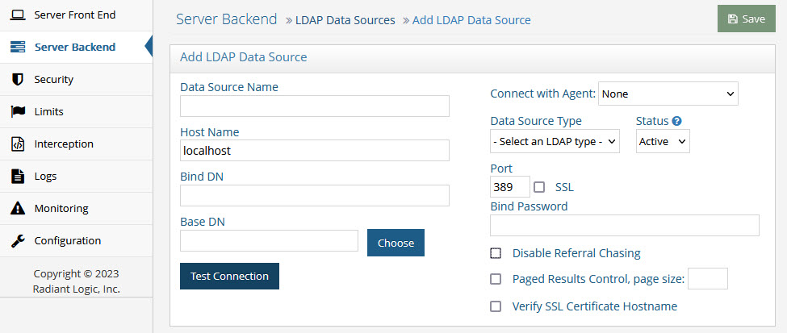
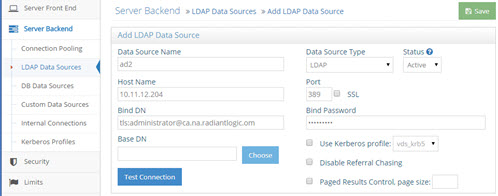
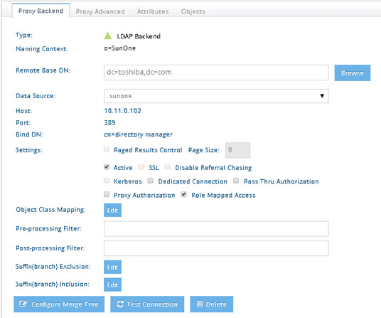

# Server Backend

These settings are related to how RadiantOne accesses backend data sources and can be managed from the Main Control Panel > Settings tab > Server Backend section.

## Connection Pooling

>**Note – This section is accessible only in [Expert Mode](introduction#expert-mode).**


Figure 1: Connection Pooling Settings

Connection pooling for database and LDAP sources is enabled by default. The settings can be modified in the Main Control Panel > Settings Tab > Server Backend section, Connection Pooling sub-section. Connection pooling improves performance for virtual views because a connection to the underlying source does not need to be created every time data needs to be retrieved.

When RadiantOne receives a search for information (that is not stored locally, either in cache or a local Universal Directory store), a connection to the underlying system is established. Since opening and closing a connection every time information must be retrieved from an underlying source can be time consuming, RadiantOne can pool the open connections and re-use them (thus saving the overhead involved in having to open/close a connection every time a backend needs to be accessed).

The first time RadiantOne queries an underlying source, a connection is opened. When the operation is done, the open connection remains in the connection pool (for the specified timeout parameter that has been set). The next time RadiantOne receives a query for the same underlying source, an open connection is retrieved from the pool (instead of opening a new connection). If no connections are available in the pool, a new connection is opened. This process continues until the connection-poolsize parameter has been reached (the maximum number of open connections to keep in the pool). Once this happens (the max number of open connections has been reached and they are all in use), the client must wait until one of the used connections is finished before their query can be processed.

### LDAP Backends

Connection pooling for LDAP backends is configured with the following settings:

#### Pool size

This is the maximum number of concurrent connections by RadiantOne to each LDAP source. For example, if you have four LDAP sources and your maximum connections value is set to 200, then you could have up to a total of 800 LDAP connections maintained by RadiantOne.

#### Timeout

The default is 7. This is the maximum number of seconds RadiantOne waits while trying to establish a connection to the backend LDAP server. There are two attempts to create a connection (each tries to create a connection for 7 seconds).

#### Operation Timeout

The default is 0 (no timeout). This is the maximum number of seconds RadiantOne waits to receive a response from the backend LDAP server. After this time, RadiantOne drops the request and attempts to send the request again. After two failed attempts to get a response back, RadiantOne returns an error to the client.

#### Write Operation Timeout

The default is 0 (no timeout). This is the maximum number of seconds RadiantOne waits to receive a response from the backend LDAP server for a write operation. After this time, RadiantOne drops the request and attempts to send the request again. After two failed attempts to get a response back, RadiantOne returns an error to the client.

#### Idle Timeout

The default is 5 minutes. This is the maximum amount of time to keep an idle connection in the pool.

### Database Backends

Connection pooling for database backends is configured with the following settings:

#### Pool Size

The default is set to 20, this means 20 open connections are held in the pool for each JDBC data source. A connection pool is managed per each data source.

#### Idle Timeout

The default is 15. This is the number of minutes a connection stays in the connection pool once it is idle. Setting this to “0” (zero) results in opened connections to stay in the pool forever.

#### Prepared Statement Cache

The default is 50. RadiantOne uses parameterized SQL statements and maintains a cache of the most used SQL prepared statements. This improves performance by reducing the number of times the database SQL engine parses and prepares SQL. 

This setting is per database connection. Use caution when changing this default value as not all databases have the same limits on the number of 'active' prepared statements allowed.

#### Manually Clearing the Connection Pool

RadiantOne supports special LDAP commands to reset connections in the pools. If you issue these commands to RadiantOne, all the connections that are currently not being used in the pool are closed.

To reset the connection pools from the command line, you can use the ldapsearch utility.

The following command clears the LDAP connection pool (assuming RadiantOne is listening on LDAP port 2389 and the super user password is “password”):

```
ldapsearch -h host -p 2389 -D"cn=directory manager" -w "password" -b "action=clearldappool" (objectclass=*)
```

The following command clears the database connection pool (assuming RadiantOne is listening on LDAP port 2389 and the super user password is “password”):

```
ldapsearch -h host -p 2389 -D"cn=directory manager" -w "password" -b "action=clearjdbcpool" (objectclass=*)
```

The connection pools can also be cleared using the LDAP Browser client that is included with RadiantOne. Enter the relevant connection criteria to RadiantOne (server, port, User ID, and Password) and in the Base DN field, enter action=clearldappool to clear the LDAP connection pool and click **Connect**. Use action=clearjdbcpool and the Base DN and click **Connect** to clear the database connection pool.


Figure 2: LDAP Browser Client used to Clear the Connection Pool

## Data Sources

A data source in RadiantOne represents the connection to a backend. Data sources can be managed from the Main Control Panel > Settings Tab > Server Backend section. Configuring connections to all backends from a central location simplifies the management task when changes to the backend are required. For more details on data sources, please see [Concepts](concepts).

>**Note - Data sources can also be managed from the command line using the RadiantOne command line config utility. Details on this utility can be found in the RadiantOne Command Line Configuration Guide.**

### Status

Each data source has a status associated with it. The status is either Active or Offline and can be changed as needed. If a backend server is known to be down/unavailable, setting the status to Offline can prevent undesirable performance impact to views associated with this backend. When a data source status is set to Offline, all views associated with this data source are not accessed to avoid the performance problems resulting from RadiantOne having to wait for a response from the backend before being able to process the client’s query. To change the status for a data source, navigate to the Main Control Panel -> Settings Tab -> Server Back End section. Select the section associated with the type of data source that is known to be unavailable (e.g. LDAP Data Sources, Database Data Sources or Custom Data Sources). On the right side, select the data source representing the backend that is down and click Edit. Locate the status drop-down list and choose Offline. Save the change.

>**Note – When a data source is set as Offline, RadiantOne does not try to access the primary backend nor any failover servers configured in the data source.**

### LDAP Data Sources

An LDAP data source represents a connection to an LDAP/JNDI-accessible backend.

><span style="color:red">**IMPORTANT NOTE – When configuring data sources for Active Directory backends, always enable the Paged Results Control option.**

To add an LDAP data source:
1.	From the Main Control Panel > Settings Tab > Server Backend section > LDAP Data Sources sub-section, click **Add**.



Figure 3: Adding a New LDAP Data Source

2.	Enter a unique data source name along with the connection information to reach your backend server. Also select the type of LDAP Data Source (VDS/OpenDJ/SunOne/Active Directory/Novell/Other LDAP).

><span style="color:red">**IMPORTANT NOTE – Do not use spaces, commas, brackets or parenthesis, colons, or the word “domain” in the data source name and do not use special characters in the Base DN value.**

3.	Click **Test Connection** to validate the values entered above.

4.	Click **Save** to apply the changes to the server.

### LDAP Data Source Advanced Settings

For LDAP backends there are five additional settings that are optional: SSL/TLS, STARTTLS, Mutual Authentication, Kerberos, Chasing Referrals and the Paged Results Control. These options are described below.

#### SSL/TLS

If the backend LDAP server you are connecting to uses a certificate issued by a trusted Certificate Authority, then all you need to do is enter the SSL port and check the SSL checkbox when you define the data source. If the server you are connecting to uses a self-signed certificate, then this certificate must be imported into the [RadiantOne client truststore](security#client-certificates-default-java-truststore).

#### Verify SSL Certificate Hostname

This setting is only applicable if SSL is used to connect to the backend. If enabled, RadiantOne validates the CN/SAN of the certificate and only establishes a connection to the backend if the hostname matches. This setting is not enabled by default meaning that RadiantOne doesn’t validate the hostname to the CN/SAN of the certificate for SSL connections.

?**Note - RadiantOne does not perform a reverse lookup when the Host Name for the backend is defined as an IP address instead of a fully qualified server name.**

### STARTTLS

If the backend LDAP server supports STARTTLS, you can configure the connection to be upgraded to use LDAPS on bind by prefixing your Bind DN parameter in the data source with tls: like shown in the following screen.

Some important tips for using STARTTLS are:

-	There is no extra space between the colon and the username.

-	Do NOT check the SSL checkbox. A secure connection is used for the bind and other connections flow over a non-SSL connection/port.

-	If the underlying LDAP server’s certificate has been signed by a trusted CA, then you do not need to import it into the RadiantOne client truststore. However, if the certificate has not been signed by a trusted CA, then you must import the certificate into the RadiantOne client truststore before attempting to connect via STARTTLS.

    Below is an example of the setting:



Figure 4: Configuration for RadiantOne to Connect to the Underlying LDAP Server via STARTTLS

><span style="color:red">**IMPORTANT NOTE - When using STARTTLS, be aware that you cannot use the IP of the server in the Host Name parameter, you need the exact name of the server (which should match what is in the certificate), or you will get the following error:**

><span style="color:red">**...JNDI connect Error : javax.net.ssl.SSLPeerUnverifiedException: hostname of the server '10.11.12.203' does not match the hostname in the server's certificate.**

### Mutual Authentication

If you want to use mutual authentication between RadiantOne and the backend LDAP directory, in the data source configuration, Bind DN parameter specify cert:<client certificate file> instead of an actual user DN. In this case, RadiantOne is the client when accessing the underlying LDAP server. Also the suffix of the certificate file must indicate the store type. For example, PFX assumes pkcs12. If no suffix is specified, or the suffix is unknown, JKS type is assumed.

Below are the valid values for the suffix:

-	jks
-	pfx 
-	pkcs12
-	pkcs11

The Bind Password for the data source configuration should be the one defined in the certificate itself, and the same as the keystore password.

```
Example:
Host: ADServer1.na.radiantlogic.com 
Port: 389
Bind DN: cert:mycert.pfx
Bind Password: mypassword
```


Figure 5: Enabling Mutual Authentication Between RadiantOne and the Underlying LDAP Server

Some important tips are: 

-	Do not use an extra space between the colon and the certificate file name. 

-	All client certificate files need to be stored under: <RLI_HOME>/certs

-	There should be one file per certificate, and the certificate password and keystore password must be the same.

-	When storing a private certificate in a java keystore, the store password and the certificate password must match. This is why you should put only one certificate per store.

-	RadiantOne uses StartTLS when connecting to the backend directory. Therefore, the SSL checkbox should be UNchecked and the normal (non-SSL) port should be listed in the port parameter of the data source.

### Kerberos

RadiantOne can play the role of a Kerberos client and issue a bind request with a Kerberos ticket to a backend LDAP server leveraging the SASL GSSAPI mechanism. This allows RadiantOne to connect to and virtualize data from any LDAP-accessible kerberos service (typically Active Directory, but could be any Kerberized LDAP service) in the same domain/realm as the RadiantOne server or any trusted domain/realm using Windows Integrated Authentication (WIA). 


Figure 6: RadiantOne Acting as a Kerberos Client – Note the client accessing RadiantOne is NOT portrayed in this Diagram

To use this option, you first need to define a Kerberos profile.

>**Note – All machines (client, domain controller…etc.) must be in sync in terms of clock (time/date settings).**

### Kerberos Profile

A Kerberos profile file defines the realm, domain and KDC information. All Kerberos profiles are stored in <RLI_HOME>/<instance_name>/conf/krb5. 

>**Note - Kerberos profile files are automatically shared across all RadiantOne cluster nodes.**

There is a default file named vds_krb5.conf included with RadiantOne. Each data source backend (associated with a KDC) that you want RadiantOne to connect to via Kerberos requires its own “…krb5.conf” file. It is recommended that the name of the conf file indicate the relevant realm, since each KDC realm requires its own krb5.conf file. For example, the sample below uses NA.RADIANTLOGIC.COM as the default realm, so a good name for the krb5.conf file may be na_krb5.conf.

```
[libdefaults]
default_realm = NA.RADIANTLOGIC.COM
[realms]
NA.RADIANTLOGIC.COM = {
kdc = 192.128.12.203:88
default_domain = NA.RADIANTLOGIC.COM
}
```

As another example, assume two separate Active Directory domains (LINKEDIN.BIZ and MICROSOFT.COM) which have a two-way trust between them. Assume a user account in LINKEDIN.BIZ is the service account configured in the RadiantOne LDAP data source and the server/host is another trusted domain; MICROSOFT.COM (make sure you use the FQDN for the host name). The krb5.conf file associated with the RadiantOne LDAP data source would contain the following.

```sh
[libdefaults]
	default_realm = LINKEDIN.BIZ
	
[realms]
	LINKEDIN.BIZ = {
		kdc = 192.128.12.208:88
		default_domain = linkedin.biz
        }

	MICROSOFT.COM = {
		kdc = 192.120.12.211:88
		default_domain = microsoft.com
        }

[domain_realm]
        microsoft.com = MICROSOFT.COM
        .microsoft.com = MICROSOFT.COM
        linkedin.biz = LINKEDIN.BIZ
        .linkedin.biz = LINKEDIN.BIZ
```

The [libdefaults] section specifies where to find the Kerberos user account. The [realms] specifies all the domains involved in the cross-domain access.

Kerberos profile files are managed from the Main Control Panel > Settings Tab > Server Backend section > Kerberos Profiles sub-section. You can add, edit and delete Kerberos profiles here.


Figure 7: Kerberos Profile Settings

Click **Add** the right side, and enter the details about the realm, domain and KDC that RadiantOne needs to connect and click **OK**. Then click **Save**. This information is saved into a Kerberos profile file and must be referenced in the LDAP data source.

After the Kerberos Profile has been defined:

1.	Create the LDAP data source from the Server Backend section > LDAP Data Sources sub-section. 

2.	Use the fully qualified server name in the Host Name parameter. 

3.	For the Bind DN setting in the Data Source, do not use a full DN. You need to indicate the sAMAccountName for the service account user in the KDC.

4.	Enter the service account user’s password.

5.	Check the “Use Kerberos profile” checkbox and select the appropriate Kerberos profile from the drop-down list. 

6.	Check Disable Referral Chasing. 

7.	Check Paged Results Control and enter a page size of at least 500.


Figure 8: Sample LDAP Data Source Using Kerberos

8.	Click **Save**.

9.	Restart the RadiantOne service.

When a client binds to RadiantOne using a simple bind (DN+password) and their DN “suffix” matches a virtual view where Kerberos is enabled for the backend data source, RadiantOne uses the value set in the Bind DN of the data source to determine how to perform the Kerberos authentication to the backend directory. RadiantOne searches in the KDC where sAMAccountName matches the value used in the Bind DN and then requests a ticket from the KDC on behalf of this user to connect to the backend directory (Kerberized service). The details in the krb5.conf (Kerberos profile) file dictate which realm and KDC RadiantOne uses.

>**Note – The user is authenticated by the KDC and RadiantOne passes this Kerberos ticket in the SASL GSSAPI LDAP bind to connect to the backend Active Directory. All subsequent requests after the bind request flow over the standard LDAP port. If you need to secure/encrypt subsequent requests, configure SSL/TLS in the data source in addition to the Kerberos configuration described in this section.**

#### Chasing Referrals

By default, RadiantOne does not attempt to chase referrals that have been configured in the underlying LDAP server. If you want RadiantOne to chase referrals when searching the underlying LDAP server, then you should uncheck the Disable Referral Chasing option. Click **Save** to apply the changes to the server.

Chasing referrals can affect the overall performance of the RadiantOne service because if the referral server is unresponsive, RadiantOne could take a long time to respond to the client. For example, in the case of querying an underlying Active Directory (with a base DN starting at the root of Active Directory) you may get entries like the following returned:

```
ldaps://ForestDnsZones.na.radiantlogic.com:636…
ldaps://DomainDnsZones.na.radiantlogic.com:636…
```

If RadiantOne attempts to “chase” these referrals, there can be extreme degradation in response times. Therefore, it is recommended that you disable referral chasing if you need to connect to Active Directory starting at the root of the Active Directory tree, or connect to any other directory where you don’t care about following referrals.

#### Paged Results Control

The paged results option is only relevant for LDAP directories that support the paged results control (such as Active Directory and the RadiantOne service).

>**Note - Sun Java Directory Server does NOT support the paged results control (at least as of v5.2).**

If you enable the paged results option, RadiantOne (as a client to other LDAP servers) will request the result of a query in chunks (to control the rate at which search results are returned). After enabling the paged results control option, specify the page size (number of entries per chunk). Click **Save** to apply the changes to the server.

This option can be useful when RadiantOne (as a client to other LDAP servers) has limited resources and may not be able to process the entire result set from a given LDAP query, or if it is connecting to the backend LDAP server over a low-bandwidth connection.

##### Edit an LDAP Data Source

To update the connection information associated with a data source, select the configured data source and click **Edit**. After editing the information, click **Test Connection** and then save the updated information.

##### Delete an LDAP Data Source

To delete a data source, select the configured data source and click **Delete**. After deleting any data source, save your changes.

##### Configure Failover Servers

If the primary backend is not available or the SSL certificate is expired (resulting in a connection error), RadiantOne attempts to connect to failover servers that are configured for the data source.

>**Note – if your data source is Active Directory and you are using Host Discovery in your data source settings, there is no need to define failover server. RadiantOne automatically leverages the first five LDAP servers listed in the SRV record as primary/failover servers. For more information on Host Discovery, see the RadiantOne Namespace Configuration Guide.**

1.	Go to the Main Control Panel > Settings Tab > Server Backend section.

2.	Select the LDAP Data Sources and on the right side, select the data source you want to configure a failover server for and click **Edit**.

3.	Click **Add** in the Failover LDAP Servers section and enter a host and port. The servers added here must be exact replicas of the primary server. In other words, the user/password configured for the primary server must be able to connect to these replica servers.

4.	Save the configuration when you are finished.

>**Note – RadiantOne attempts to connect to failover servers only if there is an error in connection to the primary server (it attempts to connect twice) or if the SSL certificate for the backend server is expired.**

### Proxy Impersonation Rules

For LDAP data sources, you can define advanced impersonation rules for determining which set of credentials are used when connecting to the backend. 

To define advanced impersonation rules:

1.	In the Main Control Panel, go to > Settings tab > Server Backend > LDAP Data Sources sub-section.

2.	Select the LDAP data source and click **Edit**.

3.	Expand the Advanced section at the bottom. The mappings defined here dictate which credentials to use when connecting to the backend data source. Members of the selected group are impersonated by the configured user. 

4.	Click **Add**.

5.	Click **Choose** to locate a group in the virtual namespace that contains members to be impersonated.

6.	Enter a user DN and password to be used when connecting to the backend data source.


 
Figure 9: Impersonation Rules

When you define a virtual view based on this data source, there is an option that can be enabled for Role Mapped Access. If this option is enabled, the impersonation rules defined for the data source take effect and dictate which credentials are used when connecting to the backend data source. This means that if a user binds to RadiantOne and accesses a virtual view from a backend data source where Role Mapped Access has been enabled, and this user is a member of a group that has been configured for impersonation rules, the credentials defined for the group are used for accessing the backend. Below is an example of a virtual view where Role Mapped Access has been enabled.


 
Figure 10: Virtual View with Role Mapped Access Enabled

### Default Credentials

If proxy impersonation rules are defined, you can also define a default user. If Role Mapped access is enabled for the proxy view and the user that binds to RadiantOne is not a member of any groups defined for proxy impersonation, the default user account is used. If the connected user is not a member of any groups defined in the proxy impersonation section and there is no default user account defined, then the BindDN set in the data source is used to connect to the backend.


Figure 11: Indicating a Default User Account

#### Database Data Sources

A database data source represents a connection to a SQL/JDBC-accessible backend.

The following JDBC drivers are installed with RadiantOne: JDBC-ODBC Bridge from Sun, Oracle (thin), Oracle oci, Microsoft SQL Server, HSQL, MariaDB (used for MySQL as well), IBM DB2, Sybase, and Derby.

You have the option to use one of the above drivers, however, it is recommended that you use the driver that was delivered with the database that you want to connect to. To add a JDBC driver, you must make sure that the driver libraries are added in the <RLI_HOME>/lib/jdbc directory.

><span style="color:red">**IMPORTANT NOTE – updating to a different DB2 driver may require more than just replacing the existing driver files in the <RLI_HOME>/lib/jdbc directory if the name or license has changed. Please consult the Radiant Logic knowledge base for additional details.**


Figure 12: Database Data Sources

#### Add a Database Data Source

1.	In the Main Control Panel, go to > Settings Tab > Server Backend section > DB Data Sources sub-section.

2.	Click **Add**.

3.	Enter a unique data source name (do not use spaces in the name) along with the connection information to reach your backend server. You can select a Data Source Type from the drop-down list and the driver class name and URL syntax is populated for you. You can then just modify the needed parameters in the URL and enter the required user/password. 

>**Note - A secure connection can be made to the database if the JDBC driver supports it. If the server you are connecting to uses a certificate issued by a trusted Certificate Authority, then all you need to do during the creation of the data source is enter the SSL port in the appropriate location of the URL. If the server you are connecting to uses a self-signed certificate, then this certificate must be imported into the [RadiantOne client trust store](security#client-certificates-default-java-truststore).**

4.	Click **Test Connection**.

5.	Click **Save**.

#### Edit a Database Data Source

To update the connection information associated with a data source, select the configured data source and click **Edit**. After editing the information, click **Test Connection** and then save the updated information.

#### Delete a Database Data Source

To delete a data source, select the configured data source and click **Delete**. After deleting any data source, save your changes.

#### Adding a New Database Driver

A list of drivers appears in the drop-down list box when you are defining a database data source. Only the drivers that are shown in green were installed with RadiantOne. The other driver names/syntaxes that appear in the drop-down list have been provided to save time. If you would like to use one of these drivers or to include a new JDBC driver, install the driver files in the <RLI_HOME>/lib/jdbc directory. Restart the RadiantOne service and any open tools. During the creation of the database data source, if your driver type is listed in the drop-down list, select it and the syntax for the driver class name and URL is populated for you. Update the URL with the connection details for your database. If the drop-down list does not include your database driver type, you can leave this blank and manually type in the data source name, driver class name, driver URL, user and password.

This information is saved in a file so you do not have to re-enter the same connection parameters every time you extract a schema from the same type of database. The name of the file is jdbcxml.xml, and it can be found in the directory <RLI_HOME>\<instance_name>.

#### Configure Failover Servers

If the primary backend is not available, RadiantOne attempts to connect to a failover server that is configured for the data source.

><span style="color:red">**IMPORTANT NOTE – if you have not defined data sources for your failover servers, you must do so before performing the following steps.**

1.	In the Main Control Panel, go to > Settings Tab > Server Backend section.

2.	Select the DB Data Sources section and on the right side, select the data source you want to configure a failover server for and click **Edit**.

3.	In the Failover section, select the data source that represents the failover database from the drop-down list.

4.	Save the configuration when you are finished.

#### Custom Data Sources

A custom data source is defined as something that cannot be accessed directly using JDBC/ODBC or LDAP. To access these types of data sources, you need to configure what is known as a custom object. RadiantOne includes a few default custom objects representing data sources you can virtualize. These data sources are for the following applications: Google Apps, Azure AD, Okta Universal Directory, any SCIM v1 source, any SCIM v2 source, Workday, Concur, Epic, SharePoint Users and Profile, and SharePoint Online Profile. To use these objects in virtual views, you just need to update the connection properties to point to your own application instances. For more details on leveraging these custom data sources in virtual views, please see the RadiantOne Namespace Configuration Guide.

To edit a custom data source, from the Main Control Panel > Settings Tab > Server Backend section > Custom Data Sources sub-section, select the custom data source from the list and click **Edit**. Select a custom property and click **EDIT**. Save your changes when finished.


Figure 13: Sample Custom Data Source

><span style="color:red">**IMPORTANT NOTES – Most default custom data sources do not support authentication operations. They are primarily to allow for provisioning/de-provisioning identity information to these apps through RadiantOne and/or retrieving identity profile information from these apps for RadiantOne to present a complete user profile (to join views of these backends to identities from other data sources). However, Azure AD (graphapi and mgraph data sources) and Okta Universal Directory (oktaclient data source) do support authentication operations. For details on creating virtual views from the default custom data sources, see the RadiantOne Namespace Configuration Guide.

#### DSML/SPML Sources

For DSML/SPML accessible services, you can define the data source backend from the Main Control Panel.

1.	In the Main Control Panel, go to > Settings Tab > Server Backend section > Custom Data Sources sub-section.

2.	Click the drop-down arrow next to Add Custom and choose the DSML/SPML option.

3.	If you want to manually enter your own property names, click **Advaned Edit**. Otherwise, populate the properties described below.

4.	Enter a unique data source name (do not use spaces in the name).

5.	Enter the host, port (check the SSL box if it is a secured port), and select DSML or SPML from the drop-down list.

6.	Enter the credentials (e.g. username and password) to connect to the service.

7.	Enter the path (prefix) to reach the service.


Figure 14: Sample Custom DSML/SPML Data Source

### SCIM v2 Sources

This section provides general details about virtualizing SCIM data sources. Details about virtualizing some common SCIM-specific data sources like SailPoint can be found in the RadiantOne Namespace Configuration Guide. For SCIM v2 accessible services, you can define the data source backend from the Main Control Panel.

To virtualize a SCIM backend: 

1.	In the Main Control Panel, go to the Settings Tab -> Server Backend section -> Custom Data Sources sub-section.

2.	Click the drop-down arrow next to Add Custom and choose the SCIMv2 option.

3.	Enter a unique data source name (do not use spaces in the name).

4.	Enter the SCIM URL path to reach the service. When testing the connection for this data source, RadiantOne attempts to get data from the /ServiceProviderConfig endpoint. You can validate the connection to an alternate URL using the “test_connection_url” property.

>**Notes – If a RadiantOne service is the backend you are connecting to, the syntax of the URL is: http://`<fid_server>:8089/scim2/v2`**

5.	Enter the credentials (e.g. username and password) to connect to the service.


 
Figure 15: Sample Custom SCIM v2 Data Source

6.	Click **Test Connection**.

7.	To customize or add new property names, click **Advanced Edit**. See [Custom Properties](#custom-properties) for details.

8.	Click **Save**.

>**Notes - If you plan on virtualizing a RadiantOne Universal Directory backend, and are going to use the SCIM connector for detecting changes (for sync or persistent cache refreshes), the modifyTimestamp attribute must be removed from the Non-indexed Attributes property, and added to the Indexed Attributes and Sorted Attributes properties for the store. Rebuild the index for the store after modifying these properties. Also, the VLV/Sort control must be enabled on the RadiantOne service. This can be enabled from the Main Control Panel (associated with the RadiantOne backend) > Settings > Server Front End > Supported Controls.**

##### Custom Properties

Custom properties are optional. To add new properties, in the Advanced Edit window, click **Add**. To delete a property, select the property and click Delete. To edit a property, select the property and click **Edit**. Click **Save** after making any changes. 

><span style="color:red">**IMPORTANT NOTE – Certain SCIM-accessible backends can require more properties than others. If you are unsure about the properties required for your SCIM service, contact support@radiantlogic.com for guidance.**

The Namespace Configuration Guide describes the properties necessary for common SCIM services offered by SailPoint and PingOne Directory. 

#### Replace On Update

For update operations, some SCIM servers support both PATCH and PUT operations, and some only support PUT. If the SCIM server backend supports both operations, the value of the “replaceonupdate” property determines which operation RadiantOne sends. Set the “replaceonupdate” property to true, for RadiantOne to issue a PUT to the SCIM server. Otherwise set the “replaceonupdate” to false, and RadiantOne issues a PATCH to the SCIM server. You do not need to set this property for SCIM servers that do not support PATCH operations. In this scenario, RadiantOne detects that the server doesn’t support PATCH operations and sends the updates as PUT operations.

>**Notes – For SCIM servers that do not support PATCH operations: When clients send update requests to RadiantOne, values for all attributes (even which were not changed) must be set because it sends a PUT request to the SCIM Server, which replaces the entry.**

#### Pass Through Authorization

(Optional) RadiantOne (as a SCIM client) leverages the username and password defined in the data source to connect to the backend SCIM service. This is dictated by the passthru property which is set to a default value of false. If you set this property to true, if the user that binds (authenticates) to RadiantOne is defined in the SCIM backend, these credentials can be used to access the SCIM backend as opposed to the username and password defined in the data source. 

#### Oauth Authentication

If the backend SCIM service requires an OAuth2 token for authentication instead of a username and password (e.g. Slack), and you already have the token, add a property named “oauthtoken” and enter the token for the value. This is supported for accessing SCIMv1 and SCIMv2 services. 

If you do not already have the token, add a property named “oauthclientid” and enter the value associated with the client that is registered in the Oauth Provider. Add a property named “oauthclientsecret” and enter the value of the secret associated with the oauthclientid. Add a property named “oauthurl” and enter the URL for the token validator endpoint. These properties are used to get the token when the connection is made to the backend SCIM service.

To indicate the Oauth scope of the request to the backend SCIM server, you can add a property named “oauth_scope” that contains the value of the access token scope. An example for accessing Ping Federate’s Directory SCIM service via Oauth is: urn:pingidentity:directory-scim

#### Page Size

RadiantOne (as a SCIM client) uses paging when communicating with the SCIM service (backend). To customize the page size:

1.	Select the SCIM data source and click **Edit**.

2.	Click **Advanced Edit**. 

3.	In the Custom Properties section click **Add**. 

4.	Name the property “pagesize”.

5.	Indicate the page size value RadiantOne should use when it queries your SCIM service and click **OK**. If no value is set, a default value of 500 is used.

><span style="color:red">**IMPORTANT NOTE – The pagesize value set here should be less than or equal to the SCIM backend’s page size value.**

#### Sorting

RadiantOne allows you to indicate the order in which SCIM resources are returned in a query. This is done by specifying the sortBy parameter in the SCIM data source. To change the value of the sortBy property:

1.	Select the SCIM data source and click **Edit**.

2.	Click **Advanced Edit**.

3.	In the Custom Properties section click **Add**. 

4.	Name the property “sortby”. 

5.	In the value field, specify the endpoint, sort attribute, and sort order as follows. 

```
<endpointName>:<sortAttributeName>-<sortOrder>
```

6.	Click **OK**.

For each endpoint, the sortAttributeName indicates the attribute that determines the order of the returned responses. The sortOrder determines the order in which the sortBy parameter is applied to the query results. Acceptable values for the sortOrder are ascending and descending. 

In the following example, when the SCIM query (GET or POST) is made to the /Users endpoint, the results are returned in descending order, using the sort attribute "id".

```
Users:id-descending
```

Multiple endpoints with the associated sort attribute and sort order can be defined by creating a comma-separated list, as follows.

```
<endpointName1>:<sortAttributeName1>-<sortOrder1>,
<endpointName2>:<sortAttributeName2>-<sortOrder2>, 
```

In the following example, when the SCIM query (GET or POST) is made to the /Users endpoint, the results are returned in ascending order, using the sort attribute "userName". When the query is made to the /Groups endpoint, the results are returned in descending order, using the sort attribute "displayName"

```
Users:userName-ascending,Groups:displayName-descending
```

#### Test Connection URL

The “test_connection_url” property indicates a URL that can be used for testing the connection. This is an alternative to using the one in the “url” property. This might be useful if, for example, the endpoint indicated in the “url” property does not perform authorization.

To add a test connection URL: 

1.	Select the SCIM data source and click **Edit**. 

2.	In the Custom Properties section, click **Add**. 

3.	Name the property “test_connection_url”. 

4.	Indicate the URL to be tested.

5.	Click **OK**. 


Figure 16: The Test Connection URL Property

6.	Click **Save**.

#### SCIM Backend Exception Parameters

When RadiantOne sends a SCIM request, the SCIM service (backend) might generate an exception message. RadiantOne searches for keywords in the exception message, waits a specified amount of time, and then attempts to resend the SCIM request. This section describes how to customize this behavior, including how to disable it. 

#### Error Keywords

If a keyword is detected in the exception message from the SCIM service (backend), RadiantOne can attempt to process the query again. If the exception message does not contain any of the keywords listed in this property, the exception is logged, and the query is discarded. The error keywords are defined by the “error_key_words” property in the SCIM data source. If this property is missing from the data source, the default keyword values are “throttled” and “too many changes”. To change the value of the “error_key_words” property:

1.	Select the SCIM data source and click **Edit**. 

2.	In the Custom Properties section, click **Add**. 

3.	Name the property “error_key_words”. 

4.	In the value field, separate keywords (or phrases) with the # character. 

5.	Click **OK**.

#### Retry Interval On Error

In the event of an error, RadiantOne can wait before it attempts to resend a request to the SCIM service (backend). The waiting time is defined by the “retry_interval_on_error” property in the SCIM data source. If this property is missing from the data source, the default value is 5 seconds. To change the value of the “retry_interval_on_error” property:

1.	Select the SCIM data source and click **Edit**. 

2.	In the Custom Properties section, click Add. 

3.	Name the property “retry_interval_on_error”. 

4.	Indicate the length of time (in seconds) RadiantOne should wait before retrying when it queries the SCIM service. 

5.	Click **OK**. 

#### Retries On Error

You can specify how many times RadiantOne should try to resend a request to the SCIM service (backend). The number of retries on error is defined by the “retries_on_error” property in the SCIM data source. If this property is missing from the data source, the default value of this property is 60. To change the value of the “retries_on_error” property:

1.	Select the SCIM data source and click **Edit**. 

2.	In the Custom Properties section, click **Add**. 

3.	Name the property “retries_on_error”. 

4.	Indicate the number of times RadiantOne should attempt to reconnect to the SCIM service. This includes connection errors. 

5.	Click **OK**. 


Figure 17: SCIM Properties

To disable attempting retries on error:

1.	Select the SCIM data source.

2.	Select retries_on_error in the Custom Properties of the Connection Information. 

3.	Click **Edit**. 

4.	In the Property Value field, enter a negative value. 


Figure 18: Disabling SCIM Backend Exception Parameters

>**NOTE – With this setting, when an exception is thrown, it is logged and changes are discarded.**

5.	Click **OK**.

#### Updating Username and/or Password for Data Sources via LDAP

The username (Bind DN property for LDAP data sources, User property for Database data sources) and/or password properties of a data source can be updated via an LDAP modify command. This modifies the configuration in the RadiantOne data source and does not modify any credentials in the backend. Updating data sources via LDAP requires the RadiantOne super user (cn=directory manager) credentials. The DN in the modify should be in the form of: id=<data_source_name>,cn=metads

>**Note – to update the RadiantOne credentials associated with the KDC account that is defined on Main Control Panel > Settings > Security > Authentication Methods > Kerberos Authentication, modify the username (user principal name) and/or password (service password) with a DN of “id=KDCconnect,cn=metads”. These special credentials are stored in ZooKeeper and updating the credentials via LDAP updates the kerberosUserPrincipalName and kerberosServicePassword properties in /radiantone/v1/cluster/config/vds_server.conf in ZooKeeper.**

The LDAP attribute names to issue in the modify request for the Bind DN and password are: username and password respectively.

Two examples are shown below and leverage the ldapmodify command line utility. The syntax can be used to update LDAP data sources, database data sources and custom data sources (that have properties named username and password).

Example 1: A configured LDAP data source named sun102 has the following username (BindDN) and password configured:

```
username: uid=sbuchanan,ou=People,dc=sun,dc=com
password: Radiant1
```

The following LDIF formatted file (named ldapmodify_update_datasource_sun.ldif) is created to update the password:

```
dn: id=sun102,cn=metads
changetype: modify
replace: password
password: radiantlogic
```

The following is the ldapmodify command that is run to update the password in the sun102 data source:

```
ldapmodify -h localhost -p 2389 -D "cn=directory manager" -w password -f ldapmodify_update_datasource_sun.ldif
modifying entry id=sun102,cn=metads
```

To verify the password update, go to the Main Control Panel > Settings tab > Server Backend > LDAP Data Sources and edit the data source (e.g. sun102). Click **Test Connection** to confirm it succeeds. Also validate that virtual views associated with this data source still work fine. This can be checked from the Directory Browser tab in the Main Control Panel.

Example 2: A configured LDAP data source named ad203 has the following username (BindDN) and password configured:

```
username: CN=Shelly Wilson,OU=Users,OU=Europe,DC=na,DC=radiantlogic,DC=com
password: Secret2
```

The following LDIF formatted file (named ldapmodify_update_datasource_username.ldif) is created to update the username and password:

```
dn: id=ad203,cn=metads
changetype: modify
replace: username
username: CN=Logan Oliver,OU=Users,OU=Europe,DC=na,DC=radiantlogic,DC=com
-
replace: password
password: Radiant1
```

The following is the ldapmodify command that is run to update the username and password in the ad203 data source:

```
ldapmodify -h localhost -p 2389 -D "cn=directory manager" -w password -f ldapmodify_update_datasource_username.ldif
modifying entry id=ad203,cn=metads
```

To verify the username and password update, go to the Main Control Panel > Settings tab > Server Backend > LDAP Data Sources and edit the data source (e.g. ad203). Click **Test Connection** to confirm it succeeds. Also validate that virtual views associated with this data source still work fine. This can be checked from the Directory Browser tab in the Main Control Panel.

### Internal Connections

These settings define how RadiantOne accesses itself (internally) as a client. This can happen in some cases where interception scripts or joins are used. 

>**Note – The settings in this section are accessible only in [Expert Mode](introduction#expert-mode).**

Three advanced settings applicable to internal connections to the RadiantOne service are, Use SSL, Disable Referral Chasing and Paged Results Control. These are each described in more details below.


 
Figure 19: Internal Connection to RadiantOne

#### Use SSL

RadiantOne leverages an internal connection to the LDAP port for performing joins configured in virtual views. If the non-SSL LDAP port is turned off in RadiantOne, and the internal connection must connect via SSL, check the Use SSL option. Click **Save** to apply the changes to the server.

#### Disable Referral Chasing 

By default, RadiantOne attempts to chase referrals that have been configured in the underlying LDAP server (if for internal connections when calling itself as an LDAP server). If you do not want RadiantOne to chase referrals when searching the underlying LDAP server, then you should enable the Disable Referral Chasing option. Click Save to apply the changes to the server.

#### Paged result controls

If you enable the Paged Results Control option, RadiantOne (as a client to itself) requests the result of a query in chunks (to control the rate at which search results are returned). After enabling the Paged Results Control, indicate the page size you want to use. Click **Save** to apply the changes to the server.

This functionality can be useful when RadiantOne (as a client to itself) has limited resources and may not be able to process the entire result set from a given LDAP query. Verify that support for the [Paged Results Control](#paged-result-controls) is enabled RadiantOne to use this option for the internal connection.

#### Idle Timeout

Connections made internally, when RadiantOne is a client to itself, are configured with a default idle timeout length of 6 hours. This value is configurable in ZooKeeper. From the Main Control Panel -> ZooKeeper tab, navigate to /radiantone/v1/cluster/config/vds_server.conf. Click Edit Mode and locate the "idleTimeoutForLocalConnection" property. Define the idle timeout value (in seconds) for this property. Click **Save**.

><span style="color:red">**IMPORTANT NOTE - the idleTimeoutForLocalConnection property must always be greater than the [Global Idle Timeout](limits#idle-timeout), otherwise the Global Idle Timeout takes precedence for closing the internal connections as well as the external (client) connections.**

## Persistent Cache Initialization Location

Initialization of a persistent cache happens in two phases. The first phase is to create an LDIF formatted file of the cache contents (if you already have an LDIF file, you have the option to use this existing file as opposed to generating a new one). If you choose to generate a new LDIF file during the initialization wizard, you can indicate a file location for it to be generated. The second phase is to initialize the cache with the LDIF file.

After the first phase, RadiantOne prepares the LDIF file to initialize the cache. This could include re-ordering some entries to enforce parent-child relationships, re-formatting entries…etc. and leverages the Persistent Cache Initialization Location setting. This can be defined on the Main Control Panel > Settings Tab > Server Backend section > Internal connections sub-section. The value should be the location where the prepared LDIF file is written to. For the best performance (to avoid reading/writing from the same disk), this should be a different disk than where the original LDIF file was created or currently exists (the location indicated during the initialization wizard, whether you choose to generate the LDIF or browse to an existing LDIF). Ideally, the Persistent Cache Initialization Location is also a different disk than where RadiantOne is installed.


Figure 20: Persistent Cache Initialization Location

## Kerberos Profiles

A Kerberos profile file defines the realm, domain and KDC information. These profiles are used by RadiantOne when it acts as a client a backend Active Directory. For configuration details, please see [Kerberos](#kerberos).

>**Note – This section is accessible only in [Expert Mode](introduction#expert-mode).**
