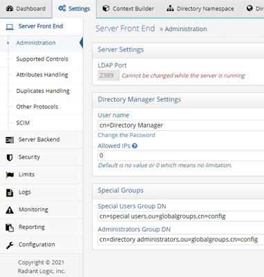
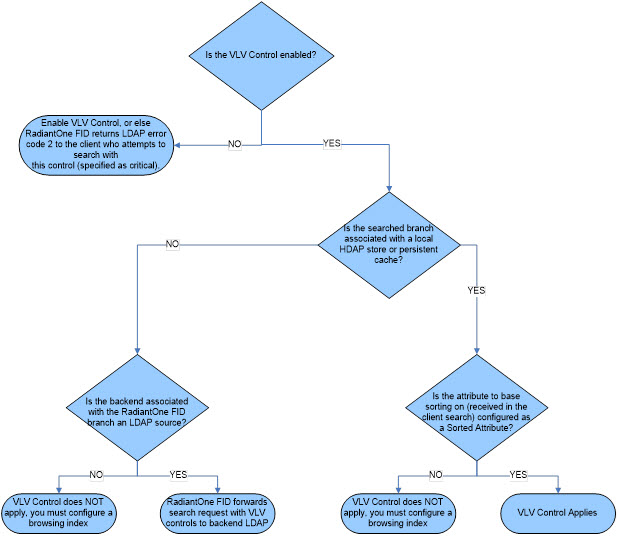
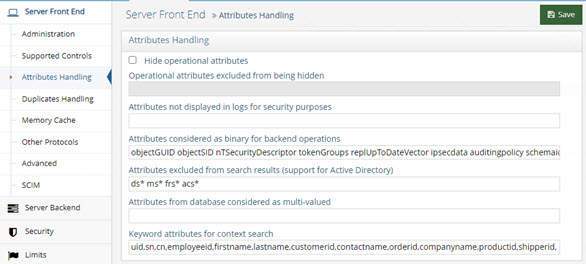
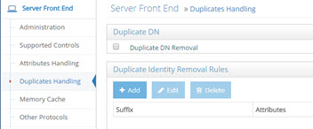
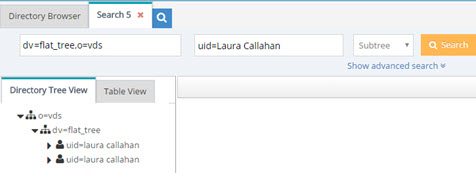
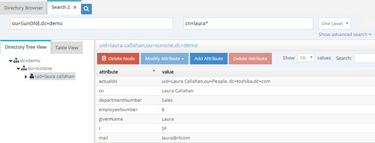
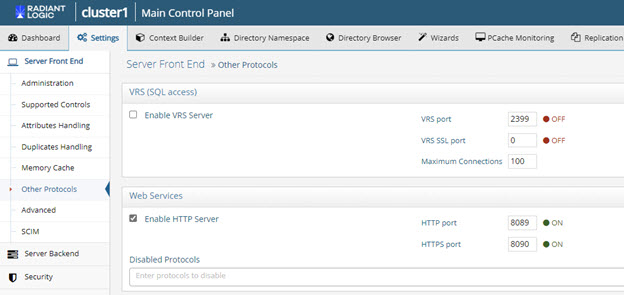
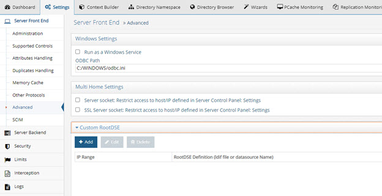

# Settings Tab

From the Settings Tab, you can manage the majority of RadiantOne settings. All settings found on this tab are detailed in this section.

Cluster settings are stored in ZooKeeper. These can be viewed/edited from the Zookeeper tab in the Main Control Panel (navigate to radiantone > `<version>` > <cluster_name> > config > vds_server.conf and click the **Edit Mode** button in the upper right corner). Or, these settings can be viewed/edited with ZooInspector. ZooInspector can be started with: <RLI_HOME>\apps\zookeeper\contrib\ZooInspector\run.cmd (or run.sh on UNIX platforms). In ZooInspector, click on   to connect to the ZooKeeper instance. For more details on ZooKeeper, please see the RadiantOne Architect Guide.


 
Figure 1: ZooInspector

## Server Front End

These settings are related to how clients access RadiantOne and can be managed from the Main Control Panel > Settings tab > Server Front End section. 
 
### Administration


 
Figure 2: Administration Section

#### LDAP Port

The LDAP port that the RadiantOne service listens on.  By default, this value is set to 2389 (this can be set during the RadiantOne install). A couple of things to keep in mind if you plan on changing the port are: on Windows platforms, you can use any available port less than 65355 and on UNIX platforms you must have admin/root privileges to start the RadiantOne service on any port less than 1024 (because these are considered "privileged").

><span style="color:red">**IMPORTANT NOTE – The RadiantOne service must be stopped before changing the port. If RadiantOne is deployed in a cluster, it must be stopped on all nodes. In the Main Control Panel go to the Dashboard tab and stop the RadiantOne service. If it is running as a service/daemon, stop it from the applicable service window/command. Once the service has stopped, change the port on the Settings tab, Server Front End section, Administration.  Click the Save button. Now, re-start the service and it listens on the new port. Also, you must manually edit both the vdsha and replicationjournal LDAP data sources to update the port here as well, in both the primary server settings and for servers defined in the “Failover LDAP Servers” section. Changes to the data sources are performed from the Main Control Panel > Settings Tab > Server Backend > LDAP Data Sources.**

The RadiantOne service can also listen on an [SSL port](), [HTTP port]() (to process DSML, SPML, SCIM or REST requests) or a [SQL port]().

#### Directory Manager User

The directory manager (cn=directory manager by default) is the super user for the directory and this account is defined during the RadiantOne install.

The super user is the only user that can login to the Main Control Panel while RadiantOne is not running. When you log into the Main Control Panel with this user, you can perform any of the operations described in [Delegation Administration](administration-and-configuration#delegated-administration-of-radiantone). Also, access permissions and password policies do not apply for this user. This safety measure prevents someone from accidentally denying the rights needed to access and manage the server. Access to this super user account should be limited. If you require many directory managers, add these as members to the [Directory Administrator Role](03-administration-and-configuration#delegated-administration-roles) instead of having them all use the single super user account.

The RadiantOne super user account is associated with an LDAP entry in the RadiantOne namespace located at: cn=Directory Manager,ou=RootUsers,cn=config. Cn=Directory Manager,ou=RootUsers,cn=config is authorized the same as cn=Directory Manager. If you want to log into the Main Control Panel with a [PIV Card/Certificate](03-radiantone-control-panels#logging-in-with-piv-cardsmart-cardcertificate) as the super user, you can store the certificate in the entry at this location.

To configure the Directory Manager username:

1.	In the Main Control Panel, go to the Setting Tab > Server Front End section > Administration sub-section.
2.	In the Directory Manager Settings section on the right side, edit the value in the User name field.

><span style="color:red">**IMPORTANT NOTE – The new value of the parameter should be in the same syntax: `cn=<new user value>`.**

3.	Click **Save**.

4.	Restart the RadiantOne service.

5.	Re-open the Main Control Panel.

6.	Log in as the new user.

If you update the Directory Manager username, the LDAP entry in the RadiantOne namespace is located at: cn=Directory Manager,ou=RootUsers,cn=config is updated with a seeAlso attribute that contains the value of the new username. This allows the new username to be used to log into the Main Control Panel.

#### Directory Manager Password

The directory administrator (cn=directory manager) password is set during the install of RadiantOne and can be changed here. To change this password, from the Main Control Panel -> Settings Tab -> Administration section, click “Change the password” link. Enter the new value and click on the Save button in the upper right corner.

><span style="color:red">**IMPORTANT NOTES – if you change the password and you are currently logged into the Control Panel as the directory administrator, you must close the Control Panel and re-open it logging in with the new password.**

To change the directory manager’s password from the Instance Manager command line utility, you can use the following command:

```
<RLI_HOME>/bin/instancemanager -u -n vds_server -p 2389 -w newpassword
```

The -p option is required when updating the password.

The RadiantOne service must be stopped when running this command. For more details on the Instance Manager utility, please see the RadiantOne Deployment and Tuning Guide.

You can also change the directory administrator’s password via LDAP. The DN representing the directory administrator is: cn=Directory Manager,ou=RootUsers,cn=config. The example below is using an LDIF file and the ldapmodify command to modify the password:

```
dn: cn=Directory Manager,ou=RootUsers,cn=config 
changetype: modify
replace: userPassword
userPassword: newpassword
```

An example of the syntax used in the command is shown below, assuming the LDIF file described above is named ChangePassword.ldif.  

```
ldapmodify.exe -D "cn=Directory Manager,ou=RootUsers,cn=config" -w password -h localhost -p 2389 -f c:\radiantone\ChangePassword.ldif
```

>**Note – The RadiantOne service may be running when this command is executed.**

#### Allowed IP Addresses

To prevent the unwarranted use of the directory administrator (super user) account, you can set specific IP addresses from where the directory administrator account can connect to the RadiantOne service from. This value can be a single IP address or a list of IP addresses separated by a comma. The IP address syntax can also support a range of IP addresses.

><span style="color:red">**IMPORTANT NOTE – When the “Allowed IP Addresses” property is used, the Control Panel is accessible from any machine whose IP address matches that of a registered RadiantOne cluster node (with the list of node IPs being resolved periodically), in addition to the allowed IPs configured in this property.**

The default value for this parameter is 0 (or could also have no value). This means that the directory administrator (super user) can bind against the RadiantOne service from anywhere.

This parameter can be changed in the Main Control Panel > Settings Tab > Administration section. On the right side, set the value for the Allowed IPs parameter. Both IPv4 and IPv6 addresses are supported. A mix of IPv4 and IPv6 can also be used.

Example set for a range of IP addresses:

10.11.12.0/24    which represents the given IPv4 address and its associated routing prefix 10.11.12.0, or equivalently, its subnet mask 255.255.255.0, which has 24 leading 1-bits. This covers the range between 10.11.12.0 to 10.11.12.255.

Example set for a range of IPv6 addresses:
2001:db8::/32    which covers the range between 2001:db8:0:0:0:0:0:0 to 2001:db8:ffff:ffff:ffff:ffff:ffff:ffff

Restart Jetty (server hosting the Control Panel) and the RadiantOne service (on all nodes if running in a cluster) after making changes to this property.

#### Special Users Group DN

This parameter can be set to the DN of any special group you want that is defined in the virtual namespace. The special users group is checked for enforcing access regulation (if access restrictions are set). To manage this value, from the Main Control Panel -> Settings Tab -> Administration section, locate the Special Users Group DN parameter. Enter the value of a valid group DN located in the virtual namespace.

For details on how this group is related to access restrictions, see the section titled [Access Regulation]().

#### Administrators Group DN

This parameter can be set to the DN of the Administrators group defined in the virtual namespace. The administrators group is checked for authorization purposes as members of this group do not have limits or password policy enforced for them. To manage this value, from the Main Control Panel > Settings Tab > Administration section, locate the Administrators Group DN parameter. Enter the value of a valid group DN located in the virtual namespace.

#### Admin HTTP Service

The RadiantOne service Admin HTTP Service ports are used internally for:

-	Block replication for RadiantOne Universal Directory stores.

-	File replication for things such as custom project changes and connector properties. 

-	REST admin API for collecting statistics and monitoring things like, node status, cluster status, and replication status.

-	RadiantOne service actions like restart and standby. 
You can disable the HTTP port by setting the value to zero. This leaves access only on the HTTPS port. If you disable the HTTP port, ensure the “Use SSL” setting is enabled for internal connections (Main Control Panel > Settings > Server Backend > Internal Connections), and Inter Nodes Communication is set to “Always use SSL” (Main Control Panel > Settings > Security > SSL). A restart of the RadiantOne service is required when these settings are changed. Restart the service on all cluster nodes.

Note – This setting is accessible only in [Expert Mode](introduction#expert-mode). 

## Supported Controls and Features

A control or feature is additional information that can be included in an LDAP request or response. For example, the server-side sort request control can be included in a search request to indicate the server should sort the matching entries before sending them to the client. LDAP controls have a unique object identifier (OID) and notion of criticality. The criticality is a flag that indicates how the server should behave if it does not recognize a requested control from a client, or if it cannot support the control in the context in which it was requested. A criticality of “true” indicates that the control is a critical part of the request, and that the server should reject the request if it cannot support the control. A criticality of “false” indicates that the control is optional, and that if the server cannot support the control then it should go ahead and process the operation as if the control had not been included. The criticality does not come into play if the server does support the control within the context of the request.

RadiantOne supports the following LDAP controls.

2.16.840.1.113730.3.4.18 – Proxied Authorization Control

1.2.840.113556.1.4.805 – Subtree Delete Control

1.2.840.113556.1.4.319 – Paged Results Control

2.16.840.1.113730.3.4.3 – Persistent Search LDAPv3 Control

1.2.840.113556.1.4.473 – LDAP Server Side Sort Control

2.16.840.1.113730.3.4.9 – VLV Request LDAPv3 Control

1.3.6.1.4.1.42.2.27.8.5.1 - Password policy control

RadiantOne supports the following LDAP features:

1.3.6.1.1.14 – Modify-Increment Extension

1.3.6.1.4.1.4203.1.5.1 – All Operational Attributes Extension

1.3.6.1.4.1.4203.1.5.3 - Absolute True and False Filters as described in RFC 4526

The Paged Results, VLV, Server Side Sort, Persistent Search and Proxy Authorization controls are not enabled by default.  The Subtree Delete and Password Policy Controls are enabled by default. The Modify-Increment, All Operational Attributes, and Absolute True/False filters extensions are enabled by default.
This section describes each control or feature and how to enable it if needed.


 
Figure 3: Supported Controls Section

#### Paged Results Control

The Paged Results Control allows an LDAP client to retrieve the results of a query in chunks (to control the rate at which search results are returned from the RadiantOne service). This feature can be useful when the client has limited resources and may not be able to process the entire result set from a given LDAP query. The client should specify the page size (number of entries per chunk) during the initial query. For more details on this control, please refer to the LDAP RFC 2696. This control can be enabled/disabled from the Main Control Panel > Settings Tab > Server Front End section > Supported Controls sub-section. Check the Enable paged results box and click Save. Restart the RadiantOne service. If you have a cluster deployed, restart the service on all nodes.

The LDAP control ID is 1.2.840.113556.1.4.319. If you query the RadiantOne service using an empty base DN (starting point), you should see a supportedControl attribute with the value of 1.2.840.113556.1.4.319.

Below is an example of an LDAP client issuing a query to RadiantOne using paging.


 
Figure 4: Client Accessing RadiantOne using Paging

In the <RLI_HOME>/<instance_name>/logs/vds_server_access.log you should see multiple search requests returning a maximum number of entries specified in the page size from the client (a minimum log level of ACCESS must be set for RadiantOne server log).  In the screen shot above, a total of 5,040 entries were returned to the client.

Sample vds_server_access.log content:

2006-09-27 09:21:40,390 INFO  --> conn=9 op=35 SearchRequest {dn="ou=Remote LDAP Directories,dc=tutorial,dc=com",scope=2,derefAliases=0,sizeLimit=0,timeLimit=0,attrsOnly=false,filter="(objectclass=*)",attributes="1.1"} LDAPControl {1.2.840.113556.1.4.319 true}
2006-09-27 09:21:43,984 INFO  <== conn=9 op=35 SearchResult {resultCode=0, matchedDN=null, errorMessage=null} LDAPControl {1.2.840.113556.1.4.319 true} **### nEntries=1000 ###**

2006-09-27 09:21:46,953 INFO  --> conn=9 op=36 SearchRequest {dn="ou=Remote LDAP Directories,dc=tutorial,dc=com",scope=2,derefAliases=0,sizeLimit=0,timeLimit=0,attrsOnly=false,filter="(objectclass=*)",attributes="1.1"} LDAPControl {1.2.840.113556.1.4.319 true}

2006-09-27 09:21:47,718 INFO  <== conn=9 op=36 SearchResult {resultCode=0, matchedDN=null, errorMessage=null} LDAPControl {1.2.840.113556.1.4.319 true} **### nEntries=1000 ###**

2006-09-27 09:21:48,890 INFO  --> conn=9 op=37 SearchRequest {dn="ou=Remote LDAP Directories,dc=tutorial,dc=com",scope=2,derefAliases=0,sizeLimit=0,timeLimit=0,attrsOnly=false,filter="(objectclass=*)",attributes="1.1"} LDAPControl {1.2.840.113556.1.4.319 true}

2006-09-27 09:21:49,187 INFO  <== conn=9 op=37 SearchResult {resultCode=0, matchedDN=null, errorMessage=null} LDAPControl {1.2.840.113556.1.4.319 true} **### nEntries=1000 ###**

2006-09-27 09:21:50,359 INFO  --> conn=9 op=38 SearchRequest {dn="ou=Remote LDAP Directories,dc=tutorial,dc=com",scope=2,derefAliases=0,sizeLimit=0,timeLimit=0,attrsOnly=false,filter="(objectclass=*)",attributes="1.1"} LDAPControl {1.2.840.113556.1.4.319 true}

2006-09-27 09:21:50,687 INFO  <== conn=9 op=38 SearchResult {resultCode=0, matchedDN=null, errorMessage=null} LDAPControl {1.2.840.113556.1.4.319 true} **### nEntries=1000 ###**

2006-09-27 09:21:51,968 INFO  --> conn=9 op=39 SearchRequest {dn="ou=Remote LDAP Directories,dc=tutorial,dc=com",scope=2,derefAliases=0,sizeLimit=0,timeLimit=0,attrsOnly=false,filter="(objectclass=*)",attributes="1.1"} LDAPControl {1.2.840.113556.1.4.319 true}

2006-09-27 09:21:52,265 INFO  <== conn=9 op=39 SearchResult {resultCode=0, matchedDN=null, errorMessage=null} LDAPControl {1.2.840.113556.1.4.319 true} **### nEntries=1000 ###**

2006-09-27 09:21:53,546 INFO  --> conn=9 op=40 SearchRequest {dn="ou=Remote LDAP Directories,dc=tutorial,dc=com",scope=2,derefAliases=0,sizeLimit=0,timeLimit=0,attrsOnly=false,filter="(objectclass=*)",attributes="1.1"} LDAPControl {1.2.840.113556.1.4.319 true}

2006-09-27 09:21:53,562 INFO  <== conn=9 op=40 SearchResult {resultCode=0, matchedDN=null, errorMessage=null} LDAPControl {1.2.840.113556.1.4.319 true} **### nEntries=40 ###**

#### VLV and Server Side Sort Controls

The Virtual List Views (VLV) control works in conjunction with the Server Side Sort Control, and allows a client to request that the RadiantOne service only return a subset of a large sorted dataset. By default, RadiantOne does not order its results because doing so is often a waste of the server's time since there may not be a need for ordering. However, when the VLV control is enabled, it works in conjunction with a server-side sort control. This ensures that the subset of values returned to the client are in order and the consecutive subsets follow that order continuously so there are no overlapping entries.

By using the VLV control, the client can retrieve results more quickly and is not required to store too many search results at a time. This is more efficient and prevents the client from being overwhelmed with too many entries that it may not be able to handle.

This control can be enabled/disabled from the Main Control Panel > Settings Tab > Server Front End section > Supported Controls sub-section. Check the Enable VLV/Sort option and click Save. Restart the RadiantOne service. If you have a cluster deployed, restart the service on all nodes.

#### Configure a Sorted Attributes List

A sorted attributes list is required at the level of the RadiantOne Universal Directory store or Persistent Cache configuration for the service to enforce the VLV/sort control on the branch. 

1.	From the Main Control Panel > Directory Namespace tab, navigate to the naming context associated with a RadiantOne Universal Directory (HDAP) store or persistent cache (located below the Cache node).

2.	In the Sorted Attributes list, enter a comma separated list of attribute names that should have a special, sorted index. Any attribute that the client requests the sorting be based on should be entered here. The value of this attribute must be unique across all entries in the selected branch. For example, if your client is going to be Microsoft Outlook, the attribute cn must be added to the Sorted Attribute list.

3.	Click **Save** in the upper right corner. The RadiantOne service does not need to be restarted.

If the VLV control has been enabled but a client searches (and passes the VLV control) in a branch that is not associated with a RadiantOne Universal Directory store or persistent cache, it performs one of the following:

-	Forwards the search request along with the included control to the backend LDAP server (if the branch in the RadiantOne namespace is associated with an LDAP backend). In this case, it is the responsibility of the backend LDAP server to implement the VLV control. RadiantOne returns any controls received from the LDAP backend to the client.

-	Not use the VLV control at all (if the backend is associated with something other than an LDAP server or local Universal Directory store/persistent cache).

If the VLV control has not been enabled at all, but a client issues it in the search request as a critical control, the RadiantOne service returns LDAP protocol error code 2.
The flowchart shown below depicts the behavior of RadiantOne for applying the VLV control.


 
Figure 5: Flowchart Depicting Behavior for Supporting VLV Control

#### Persistent Search Control

Using the Persistent Search Control is one of the recommended approaches for other processes to detect changes that have happened to RadiantOne entries. The changelog is the other method that can be used.

This control can be enabled/disabled from the Main Control Panel > Settings Tab > Server Front End section > Supported Controls sub-section. Check the Persistent Search option and click Save. Restart the RadiantOne service. If you have a cluster deployed, restart the service on all nodes.

If you enable the persistent search control, an LDAP client can receive notifications of changes that occur in the RadiantOne namespace. When a persistent search is requested, RadiantOne keeps the search operation going so clients can receive changed entries (and additional information about the changes that occurred). 

>**Note - The changelog number associated with the changed entries (logged into cn=changelog) is also returned in the persistent search response.**

#### Proxied Authorization Control

This control can be enabled/disabled from the Main Control Panel > Settings Tab > Server Front End section > Supported Controls sub-section. Check the Enable Proxy Authorization box and click Save. Restart the RadiantOne service. If you have a cluster deployed, restart the service on all nodes.

Authorization for RadiantOne data is checked based on the user who authenticated. The authorization ID (DN) is linked to the authenticated ID (DN) for the same connection. With the proxy authorization control enabled, the client can switch the user ID (for authorization purposes) without having to re-authenticate with a new connection. After the Proxy Authorization control is enabled from here, the configuration (who is allowed to impersonate whom) is defined as access controls from the Settings tab -> Security section -> Access Control sub-section. For more details on the configuration, please see [Operations]().

><span style="color:red">**IMPORTANT NOTE – to allow the RadiantOne super user (e.g. cn=directory manager) to impersonate other users, you must enable the “[Allow Directory Manager to Impersonate Other Users]()” option. In this special scenario, access controls defining the “proxy” permission is not required. However, the Proxy Authorization Control must be enabled.**

#### Subtree Delete Control

By default, only leaf nodes (nodes without child entries) can be deleted. If you need to delete an entire subtree, you must pass the subtree delete control (1.2.840.113556.1.4.805) in the request.

By default, only the RadiantOne super user (e.g. cn=directory manager) is allowed to issue delete requests with the subtree delete control. To configure access controls to allow other non-admin/super user accounts to perform sub-tree deletes, follow the steps below.

1.	Go to the Main Control Panel > Settings tab > Security > Access Control.

2.	Click **Add**.

3.	Enter an ACI Description (e.g. treedelete). 

4.	Click **Save.**

5.	Select the new ACI from the list of ACIs for root and click **Manual Edit**.

6.	Overwrite the aci definition with the following (update the userdn value to the DN of the user that you want to allow to use the subtree delete control):

    (targetcontrol = "1.2.840.113556.1.4.805") (version 3.0; acl "Tree delete control access"; allow(read) userdn="ldap:///uid=Aaron_Medler,ou=Accounting,o=companydirectory";).


Figure 6: Manually editing the ACI

>**Note – to allow anyone to perform a subtree delete request, use a value of “ldap:///anyone” for the userdn as shown in the example below.**

>**(targetcontrol = "1.2.840.113556.1.4.805") (version 3.0; acl "Anonymous tree delete control access"; allow(read) userdn ="ldap:///anyone";).**

7.	Click Save.

If the target DN is associated with a RadiantOne Universal Directory (HDAP) store, then RadiantOne processes the subtree delete control. If the target DN is a proxy view to a backend directory, RadiantOne request with the subtree delete control is delegated to the backend for processing.

For example, there are two delete requests shown below (snippets from vds_server.log). The first delete request shows the scenario where the sub tree delete control isn’t passed and the delete fails (with error code 66) and the other shows where the control (1.2.840.113556.1.4.805) is passed and the delete is successful.

Delete request without passing the subtree delete control:


2017-10-03 10:39:51,526 INFO  SessionHandler:1115 - --> conn[SSL/TLS]=1886 op=16 MsgID=16 DeleteRequest {entry=ou=test,o=companydirectory} LDAPControl {2.16.840.1.113730.3.4.2 false}

```
2017-10-03 10:39:51,606 ERROR BackendRouter:3743 - ??? BackendRouter.deleteEntry(): Error from backend: com.rli.slapd.server.LDAPException:  (66); Only leaf entry can be deleted.; Operation not allowed on nonleaf
2017-10-03 10:39:51,654 INFO  SessionHandler:3152 - <== conn[SSL/TLS]=1886 op=16 MsgID=16 DeleteResponse {resultCode=66, matchedDN=null, errorMessage=Only leaf entry can be deleted.} ### etime=128 ###
2017-10-03 10:40:40,583 WARN  session:561 - Session 17zh5m7l2n01j1gis29nv1entj is now immortal (maxInactiveInterval=-1)
```

Delete request passing the subtree delete control:

```
2017-10-03 10:40:40,584 INFO  SessionHandler:1115 - --> conn[SSL/TLS]=1886 op=17 MsgID=17 DeleteRequest {entry=ou=test,o=companydirectory} LDAPControl {1.2.840.113556.1.4.805 true} LDAPControl {2.16.840.1.113730.3.4.2 false}
2017-10-03 10:40:40,654 INFO  SessionHandler:3152 - <== conn[SSL/TLS]=1886 op=17 MsgID=17 DeleteResponse {resultCode=0, matchedDN=null, errorMessage=null} ### etime=70 ###
```

#### Password Policy Control 

The Password Policy Control is enabled by default and allows a client to request information about the current password policy information for a user entry. Specify the Password Policy Control in the LDAP request in the following ways:

-	With the OID. Use the --control or -J option with the Password Policy Control OID: 1.3.6.1.4.1.42.2.27.8.5.1 with no value.

-	Use the --usePasswordPolicyControl option. This option is used for bind requests. An example request and response is shown below.

```
PS C:\Users\test> ldapsearch -h localhost -p 2389 -D "uid=Aaron_Medler,ou=Accounting,o=companydirectory" -w password -b o=companydirectory 
-s sub --usePasswordPolicyControl "(uid=Aaron)"
# Bind Result:
# Result Code:  19 (constraint violation)
# Diagnostic Message:  Reason: 775 - Account locked : The password failure limit has been reached and the account is locked. Please retry later or contact the system administrator to reset the password.
# Password Policy Response Control:
#      OID:  1.3.6.1.4.1.42.2.27.8.5.1
#      Error Type:  account locked
#      Warning Type:  None
# An error occurred while attempting to create a connection pool to communicate with the directory server:  LDAPException(resultCode=19 (constraint violation), errorMessage='Reason: 775 - Account locked : The password failure limit has been reached and the account is locked. Please retry later or contact the system administrator to reset the password.', diagnosticMessage='Reason: 775 - Account locked : The password failure limit has been reached and the account is locked. Please retry later or contact the system administrator to reset the password.', responseControls={PasswordPolicyResponseControl(errorType='account locked', isCritical=false)}, ldapSDKVersion=4.0.1, revision='26090')
```

#### Modify Increment Extension Feature

RadiantOne supports the modify-increment extension feature as outlined in RFC 4525 by default. This is advertised in the rootDSE in the supportedFeature attribute with a value of 1.3.6.1.1.14.

This extension allows ldap modify operations to support increment capability. The attribute being modified must be appropriate for the request, meaning that it must be of type numeric or integer. The definition of the attribute, in the RadiantOne LDAP schema, must indicate AUTO INCREMENT ATTRIBUTE for the description. An example is shown below for an attribute named uidNumber:

```
attributetypes: ( 1.3.6.1.4.1.40747.92.154461398.154346690.151743700.95511113.1090264 NAME 'uidnumber' DESC 'AUTO INCREMENT ATTRIBUTE' SYNTAX 1.3.6.1.4.1.1466.115.121.1.27 )
```

An example of an ldapmodify request for incrementing the uidNumber by a value of 1 is shown below.

```
# Increment uidNumber
dn: uid=user1,dc=example,dc=com
changetype: modify
increment: uidNumber
uidNumber: 1
```

All Operational Attributes Extension Feature
RadiantOne supports the All Operational Attributes extension feature as outlined in RFC 3673 by default. This is advertised in the rootDSE to support searching for all operational attributes. 

Using the + character in your comma-separated list of return attributes, this extension allows LDAP searches of RadiantOne Universal Directory stores to return all operational attributes (except computed operational attributes, which must be specified by name). This feature can be useful when trying to determine which operational attributes exist in an entry.

>**Note – search results may not include all requested attributes if precluded by access controls.**

#### Absolute True and False Filters

This extension is intended to allow a more direct mapping between DAP and LDAP as needed to implement DAP-to-LDAP gateways. Clients can verify the support of this feature by accessing the RadiantOne RootDSE and verifying OID 1.3.6.1.4.1.4203.1.5.3 is advertised.

This extension allows clients to use “and” and “or” filters with zero filter elements. An “and” filter consisting of an empty set of filters evaluates to true. This filter is represented by the string “(&)”. An “or” filter consisting of an empty set of filters evaluates to false. This filter is represented by the string “(|)”.

#### Authorization Identity Control

Authorization Identity Control is a mechanism that allows a client to retrieve the authorization identity established in a bind operation. This is useful when certificates-based authentication is used.  Also, some SASL authentication mechanisms may not involve explicitly providing a DN, or may result in an authorization identity which is different from the authentication identity provided by the client.

The Authorization Identity Control (--reportAuthzID) may be submitted in a bind request only. The authorization identity request control has an object identifier of "2.16.840.1.113730.3.4.16" and does not have a value. RadiantOne advertises support for the Authorization Identity Control in the rootDSE. A client that requests the rootDSE sees this value returned as a supported control.


Image 7: Authorization Identity Control

><span style="color:red">**IMPORTANT NOTE – the Authorization Identity Control is allowed for use in conjunction with LDAP bind operations only and therefore cannot be used after the client has authenticated. To obtain the authorization identity at any time after the bind has completed, use the “Who Am I” extended operation.**

In the following example, the authorization identity control is requested by sending --reportAuthzID in the request.

```
$ ./ldapsearch.bat -h 10.0.3.86 -p 2389 -D "uid=Aaron_Medler,ou=Accounting,o=companydirectory" 
-w password --reportAuthzID -b o=companydirectory -s base objectclass=*
```

The sample command above results in the following type of bind request logged by RadiantOne.

```
BindRequest {version=3, name=uid=Aaron_Medler,ou=Accounting,o=companydirectory, authentication=********} AuthorizationIdentityRequestControl {2.16.840.1.113730.3.4.16 false}
```

The bind response from RadiantOne contains the identity assumed by the client. If the bind request succeeds and results in an identity (not anonymous), the control value contains the authorization identity (authzID).  If the bind request resulted in an anonymous association, the control value field is a string of zero length. In the example shown below, the authorization identity is uid=aaron_medler,ou=Accounting,o=companydirectory.

BindResponse {resultCode=0, matchedDN=null, errorMessage=null} AuthorizationIdentityResponseControl {2.16.840.1.113730.3.4.15 false authzID=dn:uid=Aaron_Medler,ou=Accounting,o=companydirectory} ### etime=3 ###

#### Who Am I Extended Operation

The "Who am I?" extended operation, as outlined in [RFC 4532](https://www.rfc-editor.org/rfc/rfc4532), provides a mechanism for a client to request the authorization identity associated with the bound connection. Using this extended operation obtains the authorization identity associated with the user or application entity after the bind has established integrity and data confidentiality protections. This approach provides greater flexibility than the [Authorization Identity Control]() because it can be requested at any time, not just during a bind operation. In addition, this extended operation can be augmented with a Proxied Authorization Control to determine the authorization identity that the server associated with the identity asserted in the [Proxied Authorization Control]().
RadiantOne advertises support for the “Who Am I” extended operation in the rootDSE. A client that requests the rootDSE sees the 1.3.6.1.4.1.4203.1.11.3 OID value returned as a supported control.


Figure 8: Who Am I extended request support

In the following example, a whoami extended request is performed.

```
$ ldapwhoami -h 10.11.12.21 -p 2389 -D "uid=Aaron_Medler,ou=Accounting,o=companydirectory" -w password dn:uid=Aaron_Medler,ou=Accounting,o=companydirectory
```

If the server can provide the authorization identity it associates with the client, the server returns a whoami Response with a successful resultCode.  If the client is an anonymous entity, the response field is present but empty.  Otherwise, the authzId represents the authorization identity it currently associates with the client in the response field.

Below is an example of a RadiantOne response to a “Who Am I” extended operation request.

```
2018-05-25 08:20:45,246 INFO  SessionHandler:1135 - --> conn=477 op=2 MsgID=2 ExtendedRequest {OID='1.3.6.1.4.1.4203.1.11.3', value=''}
2018-05-25 08:20:45,246 INFO  SessionHandler:3498 - <== conn=477 op=2 MsgID=2 ExtendedResponse {resultCode=0, matchedDN=null, errorMessage=null, OID='1.3.6.1.4.1.4203.1.11.3', value='dn:uid=Aaron_Medler,ou=Accounting,o=companydirectory'} ### etime=0 ###
```

#### Dynamic Entries Extension

The RadiantOne Universal Directory supports temporary entries using the dynamicObject auxiliary object class as specified in [RFC 2589](https://www.rfc-editor.org/rfc/rfc2589). These entries are associated with a time to live attribute and once expired, the entry is automatically removed from the directory. For details on this extension, see Chapter 5 in the RadiantOne Namespace Configuration Guide.
Attributes Handling


 
Figure 9: Attributes Handling Section

#### Hide Operational Attributes

Check the Hide Operational Attributes option on the Main Control Panel > Settings tab > Server Front End > Attributes Handling section if you do not want LDAP clients to have access to operational attributes (stored in a RadiantOne Universal Directory store) such as: createTimestamp, modifiersName, modifyTimestamp, creatorsName…etc. If you choose to hide operational attributes, LDAP clients must specifically request the operational attribute they want during the search request, otherwise it is not returned.

>**Note – Operational attributes are not hidden from the root user (e.g. cn=Directory Manager) or members of the cn=Directory Administrators group.**

Uncheck the Hide Operational Attributes option if LDAP clients are allowed to view the attributes.

#### Operational Attributes Excluded from Being Hidden

If checked, the Hide Operational Attributes option hides all operational attributes from non-root users and users that are not a member of the cn=Directory Administrators group. To accommodate third-party integrations that rely on certain operational attributes, without requiring the service account to have Directory Administrator privileges, you can indicate a list of operational attributes that should not be hidden. Indicate them in the Exclude Operational Attributes From Being Hidden field. Separate attribute names with a single space. 

#### Attributes Not Displayed in Logs

This property allows you to control which attribute values are not printed in clear in the RadiantOne logs. If you do not want certain attribute values printed in clear in the logs, you can indicate them here. Each attribute name should be separated with a single space. Any attribute indicated here has a value of ***** printed in the logs instead of the value in clear.
#### Binary Attributes

Sometimes, LDAP directory schema definitions do not define certain attributes as binary even though the value of these attributes is binary. An example of this is the objectGUID attribute in Microsoft Active Directory. If the LDAP backend schema definition does not properly define the attribute type as binary, RadiantOne does not translate the value properly when returning it to an LDAP client. To ensure RadiantOne translates the value as binary, you must list the attribute name in the Binary Attributes parameter (space separated list). This parameter is global and applies to any backend LDAP that RadiantOne is accessing. The binary attributes can be defined from the Main Control Panel > Settings tab > Server Front End > Attributes Handling section. As long as the attribute name is listed, RadiantOne returns the value to a client as binary even if the backend LDAP server doesn’t define it as such.

>**Note – If a binary attribute should be searchable, define the attribute in the RadiantOne LDAP schema with a friendly name indicating it as binary. Below is an example for the certificateRevocationList attribute: attributeTypes: ( 2.5.4.39 NAME ( 'certificateRevocationList;binary' 'certificateRevocationList' ) DESC 'Standard LDAP attribute type' SYNTAX 1.3.6.1.4.1.1466.115.121.1.5 X-ORIGIN 'RFC 2256’ )**

#### Excluded Attributes from Active Directory

This parameter is for Active Directory backends and is used for excluding specific attributes from being returned from the backend. Certain “system” attributes (e.g. dscorepropagationdata) returned from Active Directory (even for non-admin users) can cause problems for building persistent cache because the data type is not handled properly, and these attributes need to be added to the RadiantOne LDAP schema for the local storage to handle them in the cache. Also, these attributes cause problems for the change capture connector needed for real-time persistent cache refresh to work properly. Attributes that are not required by RadiantOne client applications, should be added to this list to ensure they are not returned in the view from Active Directory. By default, the AD attributes that are excluded are ds*, acs*, ms* and frs* (* is a wildcard meaning that any attributes with those prefixes are excluded). Any attributes that you do not want returned from the backend Active Directory can be added to the Excluded Attributes property. This value is defined from the Main Control Panel > Settings tab > Server Front End > Attributes Handling section. Make sure a space separates the attributes listed. Click **Save** when finished.

#### Multi-Valued Database Attributes

The Multi-Valued Database Attributes setting can be managed from the Main Control Panel > Settings tab > Server Front End > Attributes Handling section. This parameter allows for special processing of a database attribute that contains a multi-value. The database attribute must contain values separated by a space then the pound sign (#), then a space before the next value. For example, assume the following table existed inside a database:

Database Table Sample:

Name | Mail | 	Title
-|-|-
Harold Carter | hcarter@rli.com # harold@yahoo.com | HR Admin # HR # HR MGR

RadiantOne can return the database record with multi-valued attributes for Mail and Title.

Entry returned by RadiantOne with Multi-Valued Attributes Set:

```
cn=Harold Carter
mail = hcarter@rli.com
mail = harold@yahoo.com
title = HR Admin
title = HR
title = HR MGR
```

For RadiantOne to return database attributes as multi-valued, the attribute names must be listed in the Multi-valued DB Attributes parameter. The value of this parameter should be the database attribute name (or Mapped Attribute Name if one is being used). If there is more than one attribute, separate them with a comma.

If the Multi-valued DB Attributes parameter is not set, then RadiantOne would return the following:

Entry returned by RadiantOne if NO Multi-Valued Attributes Set:

```
cn=Harold Carter
mail = hcarter@rli.com # harold@yahoo.com
title = HR Admin # HR # HR MGR
```

#### Keyword Attributes for Context Search

The attributes that you want to be searchable from the sample RadiantOne client applications (e.g. Context Browser) must be defined in the Keyword Search Attributes. This parameter is located in the Main Control Panel > Settings tab > Server Front End > Attributes Handling section and should contain a comma separated list of attribute names that you want RadiantOne to use to locate the contexts relevant to the keyword searched from the Context Browser. 

The value that is searched from Context Browser results in a search against all attributes listed in the Keyword Search Attributes parameter. For example, if boots was the keyword entered in Context Browser, and productname, productdescription, and shipname where the attributes configured as Keyword Search Attributes, RadiantOne would return all contexts found where “productname=boots”, “productdescription=boots”, and/or “shipname=boots”. The Context Browser displays all contexts in which the keyword was found and based on the view hierarchy/definition (verb tagging), the results are in the form of human-readable sentences.

For more information on Context Browser, please see the RadiantOne Context Browser Guide.

### Duplicate Identity Handling



Figure 10: Duplicate Identity Handling Section

#### Duplicate DN Removal

During the identification phase (finding the person in the directory tree) of the authentication process, it is important that a search for a specific, unique user account only returns one entry.

When aggregating model-driven virtual views (created in Context Builder) from multiple sources, there is the potential to have duplicate DN’s (because the same person exists in more than one source or the same identifier belongs to different people).  Returning multiple users with the same DN is a violation of an LDAP directory.  Therefore, if your virtual namespace encounters this configuration issue, you can enable the Duplicate DN Removal option to have RadiantOne return only the first entry. This is fine if the duplicate DN’s result in the same person. If they are not the same person, then you have a different problem which is identity correlation (correlating and reconciling the same person in multiple data sources) that needs to be addressed. To assist with your identity correlation problem, please see the RadiantOne Global Identity Builder Guide.

Let’s look at an example of duplicate DN’s being returned for the same person. A person named Laura Callahan has an Active Directory account and a Sun Directory account. If both sources are virtualized and then merge-linked into a common virtual tree, a search on the tree would yield two results (because the RDN configured in the virtual views is exactly the same).  Below is a screen shot of the virtual tree where both virtual views are linked, and a search from the Main Control Panel, Directory Browser tab, that returns two results.


 
Figure 11: Virtual View Aggregating Two Data Sources


 
Figure 12: Same user ID Exists in Multiple Data Sources that have been Aggregated by RadiantOne

If Laura Callahan in Active Directory is in fact the same Laura Callahan as in Sun, you can enable Duplicate DN Removal to consolidate the two accounts. The screen shots below show the Duplicate DN Removal option enabled and the new result for the search.


 
Figure 13: Duplicate DN Removal Setting


 
Figure 14: Search Result after Enabling Duplicate DN Removal

The one entry returned with attributes from the first source the user was found in (Active Directory in this example).


 
Figure 15: Result of Duplicate DN Removal

#### Duplicate Identity Removal Rules

>**Note - In general, it is usually recommended that you use the Global Identity Builder to build your view if you know you have overlapping entries that require correlation/disambiguation.**

In cases where RadiantOne is aggregating common user identities from multiple data sources, you have the option to configure it to remove any duplicate users (from search responses) if it finds there is a common attribute/identifier (across the data sources you have aggregated).  It can also be used as a way for RadiantOne to eliminate ambiguity by returning only one unique entry.  Let’s take two sources as an example. Source 1 is Active Directory and source 2 is a Sun directory.  Both sources have been aggregated into the virtual namespace below a naming context of dc=demo and as the two following screens show, Laura Callahan exists in both.


 
Figure 16: Virtual Entry from Active Directory Backend


 
Figure 17: Virtual Entry from Sun Directory Backend

The unique Identifier between the examples above is employeeID (employeeNumber in Sun has been mapped to employeeID to provide a common attribute between Sun and Active Directory).  Therefore, a subtree search for employeeID=8 below dc=demo would return two people in this example.


 
Figure 18: Two Entries are Returned based on Filter of EmployeeID=8

Now, if Duplicate Identity Removal rules are configured, RadiantOne returns only the first entry that it finds (in this case, the one from Active Directory). Multiple duplicate identity rules can be configured (each branch in the RadiantOne namespace may have a duplicate identity removal rule). In addition, multiple attributes may be used to determine a duplicate identity. For example, you can set uid,employeeid and this means if an entry has the same uid and employeeid then it is the same person. Make sure to list the attributes you want to use to determine a duplicate identity with a comma separating each attribute name. Remember to save your settings after defining the rules.


Figure 19: Duplicate Identity Removal Settings

><span style="color:red">**IMPORTANT NOTES: <br>The identity attribute selected, must satisfy the following requirements: 
<br>Single-valued <br>Represent an identity (sAMAccountName, employeeID, etc...) <br>If the attribute is not present in an entry, the entry is returned. <br>If no suffix is specified, this identity attribute applies to the whole server search response.<br>The RadiantOne service must be restarted after changing these parameters. <br>Any search response returned by RadiantOne (below the specified starting suffix) checks if another entry with the same attribute/value has already been returned. If an entry with the same identity attribute value has been returned, then others are not returned.**


Figure 20: One Entry for Laura is Returned with Duplicate Identity Removal Rules Enabled

This is ideal for handling authentication requests (to ensure only one entry is returned to base authentication on). However, for authorization purposes, if a user exists in more than one source, only attributes from the first source are returned. If you need a complete profile of attributes coming from all the user’s accounts, then you need to configure joins to all branches in the virtual tree where the user may have an account. This join condition can be based on the identity attribute (or any other attribute that can be used to uniquely identify the person in the other branch).  As a result, searches for the user still return only one entry. Without a join configured across these virtual views, only attributes from the first source the user was found in would be returned. For details on joining, please see [Joins](02-concepts#joins) in the Concepts section.

><span style="color:red">**IMPORTANT NOTE – If your use case requires identity correlation to address user overlap, and a complete identity profile is needed for authorization, you should review the capabilities of the Global Identity Builder as opposed to trying to use Duplicate Identity Removal.**

### Memory Cache

RadiantOne supports two types of memory cache: Query and Entry. For complete details on both, please see the RadiantOne Deployment and Tuning Guide.

Memory cache can be configured from the Main Control Panel > Settings Tab > Server Front End > Memory Cache section.


Figure 21: Memory Cache Settings

#### Entry Cache

>**Note – This setting is accessible only in [Expert Mode](introduction#expert-mode).

To define an entry cache:

1.	In the Main Control Panel go to the > Settings Tab > Server Front End > Memory Cache section. 

2.	Check the Entry Cache box. 

3.	Click **Add**.

4.	Choose a starting point in the virtual namespace from where you want to start caching entries.

5.	Indicate the number of entries to cache, Time to Live (how long you want the entries to remain in the cache), which attributes to index, and any desired include or exclude filters.

6.	Click **OK**. The new entry cache is displayed. 

7.	Click **Save**.

>**Note – You can flush the entry memory cache at any time from the Main Control Panel > Settings Tab > Server Front End > Memory Cache section. Click FLUSH ALL located in the Entry cache section.**

For complete details on how entry memory cache works, please see the RadiantOne Deployment and Tuning Guide.

Query Cache

>**Note – This setting is accessible only in [Expert Mode](introduction#expert-mode).**

To define a query cache:

1.	In the Main Control Panel, go to > Settings Tab > Server Front End > Memory Cache section.

2.	Check the Query Cache box. 

3.	Click **Add**.

4.	Choose a starting point in the virtual namespace from where you want to start caching queries. 

5.	Indicate the Time to Live (how long you want the queries to remain in the cache). 

6.	Click **OK**. The new query cache is displayed.

7.	Click **Save**.

>**Note – You can flush the query memory cache at any time from the Main Control Panel -> Settings Tab -> Server Front End -> Memory Cache section. Click on the FLUSH ALL button located in the Query cache section.**

For complete details on how query memory cache works, please see the RadiantOne Deployment and Tuning Guide. 

### Other Access Protocols

In addition to supporting LDAP operations, RadiantOne can also be accessed via SQL (JDBC), SPML, DSML, REST and SAML. The configuration for these additional services is located on the Settings tab, Server Front End Section, Other Protocols sub-section.



Figure 22: Other Protocols Section

#### SQL

The Virtual Relational Server (VRS) allows for SQL clients to query the RadiantOne service. Details on how to enable the SQL interface can be found in this section. For complete details on the SQL interface, please see the RadiantOne VRS Guide.

To enable SQL access:

1.	In the Main Control Panel go to the Settings tab > Server Front End section > Other Protocols sub-section.

2.	Check the Enable VRS Server checkbox.

3.	Enter a port, SSL port (optional) and set a maximum number of connections to allow to the server.

4.	After enabling the server and setting the port(s), click **Save**.

5.	Restart the RadiantOne service to start listening on the new VRS port. If deployed in a cluster, restart the service on all nodes.

><span style="color:red">**IMPORTANT NOTE – If you need to change the port, first stop the RadiantOne service, change the port for the database server and save the new configuration. Then, Restart the RadiantOne service and it should listen on the new port. If RadiantOne is deployed in a cluster, restart the service on all nodes.**

#### Web Services (HTTP) Port

The HTTP interface is enabled by default.  These are the ports the RadiantOne service accepts web service requests (SCIM, ADAP, DSML, SPML) on. For details on accessing the RadiantOne Web Services, please see the RadiantOne Web Services API Guide. 

If you would only like to support encrypted traffic over HTTPS, just set the standard HTTP port to a value of 0.

><span style="color:red">**IMPORTANT NOTE – you can enable both secure and non-secure ports. This way, clients may choose to use either one.**

Restart the RadiantOne service if changes are made to these settings. If RadiantOne is deployed in a cluster, the service on all nodes must be restarted.

#### DSML, SPML, SCIM, REST (ADAP), SAML

SCIM settings are configured in the Server Front End -> SCIM section. 

For details on configuring and accessing RadiantOne via DSML, SPML, SCIM, and REST, please see the RadiantOne Web Services API Guide. 

### Advanced Settings

>**Note – The settings in this section are accessible only in [Expert Mode](01-introduction#expert-mode).**
 


Figure 23: Advanced Section

#### Run as Windows Service

If the RadiantOne service has been installed as a Windows Service, this option should be checked. If you uninstall the Windows Service, you must uncheck this option to ensure that the RadiantOne service can be started from the Control Panel > Dashboard tab.

#### Windows Directory

This is the location of the Windows file folder on the server RadiantOne is installed on. This parameter appears only if RadiantOne is installed on a Windows operating system.

#### ODBC Path

This is the location of the ODBC drivers available to use any database that can be defined using DSN such as MS Access. This parameter appears only if RadiantOne is installed on a Windows operating system.

#### Multi Home Settings

When a machine that hosts RadiantOne has multiple IP addresses, the RadiantOne service (by default) listens to all IP address available for that machine (this includes localhost and 127.0.0.1). It is now possible to set a property to restrict and listen to only a specific IP address (or a specific DNS server name). The Server Name setting on the Main Control Panel > Settings tab > Server Front End section > Administration sub-section specifies the server name (or IP address).

This allows for having more than one RadiantOne instance using the same port but listening on different IP address.

This feature can also increase the security for accessing RadiantOne. You can set the server name in the Server Control Panel > Settings tab as localhost (which is the default when installing RadiantOne) and then restrict access to localhost for the plain socket/port (by checking the option next to the Server socket: Restrict to Host/IP specified in Server Control Panel: Settings). Leave the option of SSL Server socket: Restrict to Host/IP specified in Server Control Panel: Settings unchecked. This allows all available IP addresses only over the SSL port but access to the non-secured port only from the same machine where the RadiantOne service is running (essentially forcing a secure connection over SSL when accessing the RadiantOne service from a remote machine).

**Server socket: Restrict access to host/IP defined in Server Control Panel: Settings**

Check this option to restrict access for the plain socket/port to the Host/IP address specified in the server setting.

**SSL server socket: Restrict access to host/IP defined in Server Control Panel: Settings**

Check this option to restrict access for the secured SSL socket/port to the Host/IP address specified in the server setting.

><span style="color:red">**IMPORTANT NOTE – “localhost” is available only if it is set as the host name on the Server Control Panel > Settings tab > Server Name property. If it is set as the server name, the RadiantOne service is accessible ONLY by using a server name of localhost.**

#### RootDSE

Directory Servers provide information about themselves to clients through the rootDSE. It contains information about the server in the form of attributes, some of which are multi-valued. The rootDSE may contain information about the vendor, the naming contexts the server supports, the LDAP controls the server supports, the supported SASL mechanisms, schema location, and other information. The contents of the rootDSE generally determine the sequence and format of requests clients issue to the server.

##### Search the RootDSE

The RadiantOne rootDSE is located at <RLI_HOME>\vds_server\conf\rootdse.ldif and is the default content returned to clients when they request a base search against the rootDSE (an LDAP search request with an empty base DN). Some clients search directories using a blank base DN as a method to search across multiple root naming contexts with a specific filter. For RadiantOne to support this capability, manually add the root naming contexts to the globalSearchIncludedNamings property in the vds_server.conf settings in ZooKeeper. This can be done from the Main Control Panel > ZooKeeper tab (requires [Expert Mode](01-introduction#expert-mode)). Navigate to /radiantone/v1/cluster/config/vds_server.conf and click **Edit Mode**. Locate the globalSearchIncludedNamings property and enter a comma separated list of root naming contexts that you want RadiantOne to search against in situations where a client performs one-level or subtree searches with a blank/empty base DN and passes a search filter. Below is an example of configuring two different naming contexts (e.g. o=companydirectory and dc=example,dc=com).

```
"globalSearchIncludedNamings" : ["o=companydirectory", "dc=example,dc=com"],
```

RadiantOne searches across the naming contexts listed in this property when a client issues a one-level or subtree search with an empty/blank base DN. If the client issues a base search, only the contents of the rootDSE are returned.

##### Custom RootDSE

Depending on the backends that are integrated into the RadiantOne platform, it might be appropriate for RadiantOne to reply with different rootDSE content. This feature should be used with caution and is generally only pertinent if RadiantOne is configured as a proxy to a backend directory (e.g. Active Directory). This proxy view can be "merged/extended" with branches from other directories if needed, but the main/primary directory hierarchy being virtualized must remain the same and conform to the desired rootDSE to return. This is important because as mentioned, the contents of the rootDSE often dictates subsequent requests the client issues to RadiantOne. Therefore, any supported controls, mechanisms, schema locations...etc. must match and be supported by the backend so the subsequent client requests are routed/handled properly.

Some LDAP clients search the rootDSE to determine the naming contexts available in the LDAP directory and leverage this information to determine the baseDN (starting point in the directory) to pass in search requests. To condition which naming contexts are returned to which clients, configure Custom RootDSE criteria as described below. This allows each client to retrieve a list of naming contexts applicable to their needs.

To configure the rules that RadiantOne should abide by when responding to rootDSE requests from clients, click **ADD** in the Custom RootDSE section of the Server Front End > Advanced section.


 
Figure 24: Custom RootDSE Settings

Enter the IP address of the client (or a range or IP addresses like 127.0.0.1,10.11.12.1/139) and indicate which RootDSE definition RadiantOne should respond with. This can be configured with a specific path and LDIF file name, or with a RadiantOne data source name. If a data source name is used, RadiantOne connects to the backend indicated in the data source configuration and requests its rootDSE content to return to the client.
