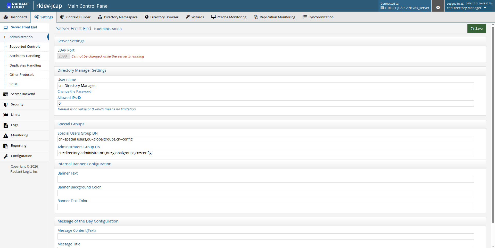
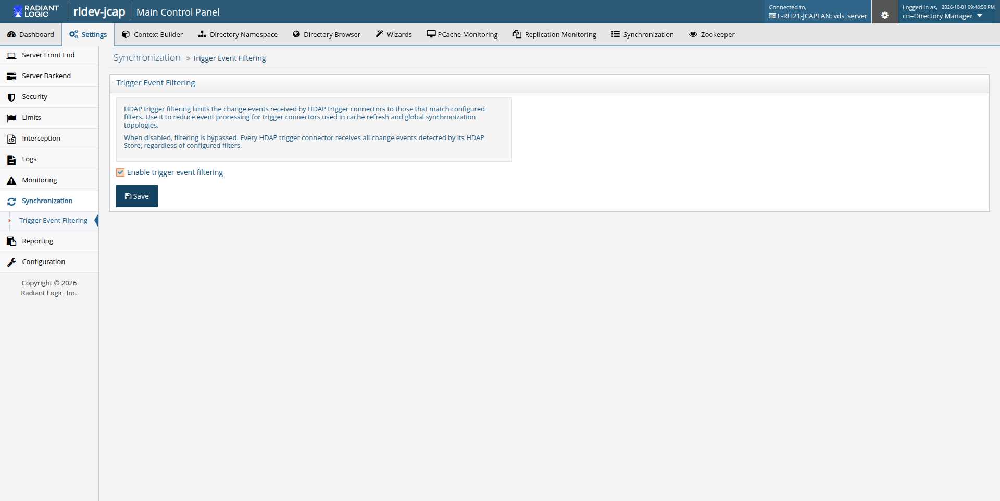

# Synchronization Settings

The Synchronization settings allow administrators to manage global event capture and filtering behaviors across all Global Synchronization topologies and Real-Time Persistent Caches.

>[!note]
>**Prerequisite (Expert Mode):** The Synchronization section under Settings is an advanced administration setting. It is visible in the Main Control Panel navigation only when [Expert Mode](01-introduction#expert-mode) is ON. When Expert Mode is OFF (Standard Mode), the Synchronization section is hidden.

To access the Synchronization settings:

1. In the Main Control Panel, verify that [Expert Mode](01-introduction#expert-mode) is ON.
    - When Expert Mode is OFF (Standard Mode), the Synchronization option is not displayed in the Settings left navigation.

      

    - When Expert Mode is ON, Synchronization appears in the Settings left navigation.

1. Go to **Settings** > **Synchronization** > **Trigger Event Filtering**.

    

## Global Trigger Event Filtering Switch

HDAP trigger filtering limits the change events received by HDAP trigger connectors to those that match configured filters. Use it to reduce event processing for trigger connectors used in persistent cache refresh and Global Synchronization topologies. By default, trigger event filtering is active system-wide.

The **Enable trigger event filtering** check box controls the global state:

- **Checked (default)**: All configured trigger filters on topologies, pipelines, and real-time persistent caches actively filter incoming change capture notifications.
- **Unchecked**: Trigger-based event filtering is bypassed globally across the entire RadiantOne instance. Every HDAP trigger connector receives all change events detected by its HDAP store, regardless of configured filters.

To change the setting, check or uncheck **Enable trigger event filtering** and click **Save**.

>[!warning]
>When Trigger Event Filtering is disabled globally:
>- Filters defined on individual topologies, pipelines, and caches are bypassed (all events are captured and queued). The filters remain saved in the configuration and are enforced again once the setting is re-enabled.
>- The topology trigger filter dialog, the pipeline Capture tab, and the persistent cache connector event filter dialog display a warning banner stating that trigger event filtering is disabled deployment-wide.

For details on configuring the filters themselves, see:

- [Topology-Level Trigger Filter](/global-sync-guide/configuration/synchronization-topologies#topology-level-trigger-filter) in the RadiantOne Synchronization Guide.
- [2. Pipeline-Level Event Filter](/global-sync-guide/configuration/capture-connector/capture-connector-configuration#2-pipeline-level-event-filter) in the RadiantOne Synchronization Guide.
- [Configuring Trigger Event Filtering for Persistent Cache](/deployment-and-tuning-guide/02-tuning-tips-for-caching-in-radiantone#configuring-trigger-event-filtering-for-persistent-cache) in the RadiantOne Deployment and Tuning Guide.
