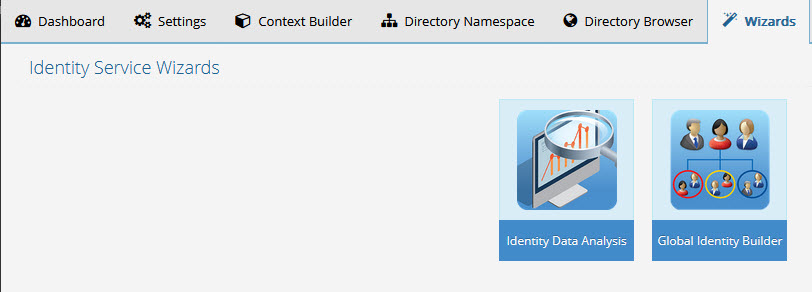

# Wizards Tab

The Identity Identity Data Analysis and Global Identity Builder tools can be launched from the Main Control Panel > Wizards tab. RadiantOne must be running in order to launch these tools. If RadiantOne is not running, it can be started from the Dashboard tab. Details on each wizard can be found in the [Identity Service Tools](administration-and-configuration.md#identity-service-tools) section of this guide.

 
Figure 1: Wizards Tab
