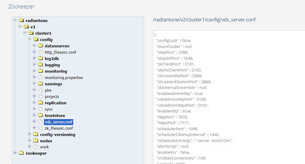

# Zookeeper Tab
The Zookeeper tab is used for browsing and editing ZooKeeper contents. The configurations that are managed for all cluster nodes can be viewed from here. RadiantOne specific configuration is shown when expanding the RadiantOne node. ZooKeeper specific configuration is shown when expanding the zookeeper node.

>**Note – This tab is accessible only in Expert Mode. 
One of the key configuration nodes is vds_server.conf located at /radiantone/<version>/cluster/config. This node contains most configuration information that was previously contained in the vds_server.conf file used in previous RadiantOne versions.**

 
Figure 1: ZooKeeper Tab

Certain nodes contain editable information. To modify settings for a specific node, click **EDIT MODE**. You can also import ZooKeeper configuration while in the EDIT MODE. This allows you to rollback to a previously saved ZooKeeper configuration or import configuration from another ZooKeeper (from another cluster for example). Click **SAVE** when you are finished.

You can also export the ZooKeeper configuration (to make backup copies) by clicking on the EXPORT button. Indicate the parent node in ZooKeeper from where you want to start exporting from. The default is the root (entire config). Indicate the directory to export the file to and the file name. This export can be used to save a backup of the ZooKeeper configuration.

 
Figure 2: Exporting ZooKeeper Configuration
