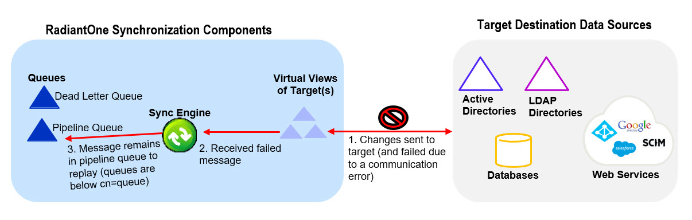
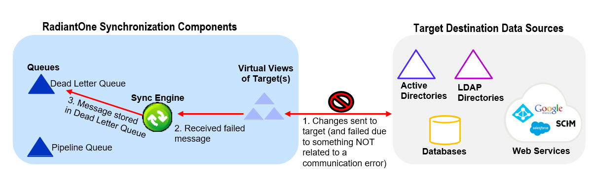
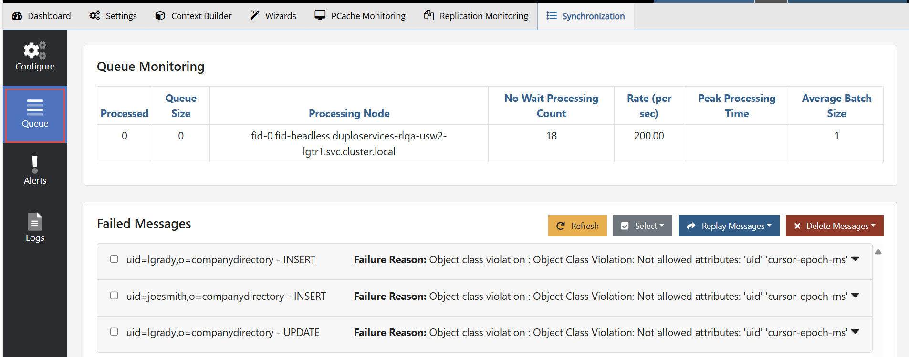
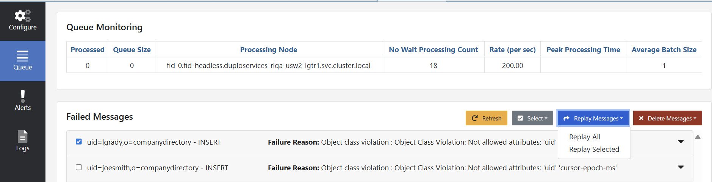
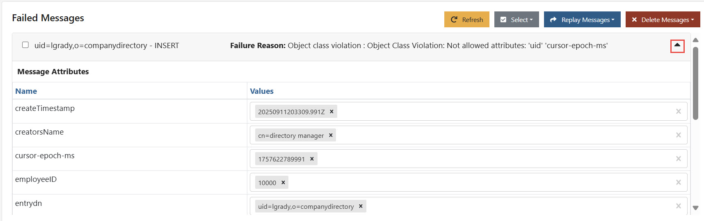

## Overview

The synchronization service differentiates between two types of failures when applying messages. It is either connection/communication-related or its not. Connection-related failures are handled differently than all other apply errors.  The following diagram describes a failure to apply due to a connection or communication error. In this case, the message is logged into the queue dedicated for the given pipeline and is automatically replayed. Each pipeline has a queue, which is stored locally below the cn=queue naming context in the RadiantOne namespace.

The following diagram describes a failure to apply due to some other non-communication related problem. After 5 retries are exhausted, the message is written to dead letter queue. Dead Letter Queues are located below the cn=dlqueue root naming context. This is a HIDDEN root naming context, so you must explicitly search for it. There is one queue created PER pipeline (each topology can have one or more pipelines). Messages in the dead letter queue must be manually managed.

## Replaying Failed Messages

Messages that fail to be applied not due to a communication error can be managed from the Classic Control Panel > Synchronization tab. Select the topology and then click CONFIGURE next to the pipeline.  Click QUEUE in the left panel.

The administrator can select which messages to replay, or replay all using the Replay Messages drop-down menu.  Messages can also be selectively deleted from the failed messages queue using the Delete Messages drop-down menu.

Use the arrow next to the failed message to display the attributes associated with the entry. Viewing the attributes in the message can help with troubleshooting why an entry failed to be applied. 

