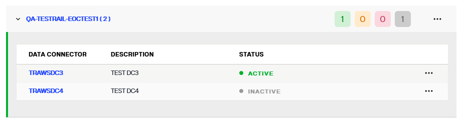

## Overview

RadiantOne uses the log4J v2 API for logging. Although a variety of log files are generated by RadiantOne, the ones most useful for troubleshooting are associated with RadiantOne LDAP, SCIM and REST APIs, Control Panel, the real-time persistent cache refresh and synchornization components: Connectors, Sync Engine and Agents.

## Viewing Logs

Logs can be viewed from Server Control Panel and Environment Operations Center.

>[!warn] - Only SaaS deployments have access to Environment Operations Center. Self-managed deployments of RadiantOne do not.

### Control Panel

Logs can be viewed and downloaded from Classic Control Panel > Server Control Panel > Log Viewer tab.

To switch to Classic Control Panel, use the menu options for the logged in user in the upper right.


Once logged into the Classic Control Panel, click  in the upper right.

Go to the Log Viewer tab and select the log file from the drop-down list.

### Environment Operations Center

Logs can be viewed from the Environment Operations Center. Log into your Tenant as an administrator.
Select the environment where RadiantOne Identity Data Management is deployed and go to the Logs tab. Select the log from the drop-down list.


>[!warn] - Only SaaS deployments have access to Environment Operations Center. Self-managed deployments of RadiantOne do not.

## Secure Data Connectors

The section describes managing data connectors and the secure data connector client.

#### Managing Data Connectors

Secure data connectors can be managed from the *Secure Data Connectors* screen. From here, you can edit, enable or disable, and delete connectors. This guide outlines the steps to manage data connectors.

All of the operations to manage secure data connectors are available in the **Options** (**...**) menu for each connector. To begin managing a connector, select the **Options** (**...**) menu of the specific connector you wish to modify.


**Edit a data connector**

The name and description of a data connector can be updated. To edit connector details, select **Edit** from the associated **Options** (**...**) menu.


This enables editing of the **Data Connector** row. In the provided name and description fields, update the connector details as needed. Select :white_check_mark: to update the connector details.

The connectors list displays updated details for the updated *Secure Data Connector*.


**Enable or disable a connector**

To disable a data connector, select **Pause** from the **Options** (**...**) menu.


The connector status updates to "Paused" and all associated connections are disabled.


To reactivate a data connector, select **Start** from the **Options** (**...**) menu.


The connector status updates to "Active" and all associated connections are enabled.



**Restart a data connector**

To restart a data connector, select **Restart** from the **Options** (**...**) menu.

The connector completely stops and starts. This action is similar to starting a data connector for the first time, which does pulling all latest configurations, stops, and starts all the required processes.


**Delete a data connector**

To delete a data connector, select **Delete** from the **Options** (**...**) menu.

[!warning] Deleting a data connector is a permanent action and cannot be undone.


A confirmation dialog asks you to confirm that you would like to delete the selected data connector. Select **Delete** to proceed and delete the connector.

If you would like to keep the connector, select **Cancel** to exit out of the workflow to delete the connector.


If the connector is successfully deleted, you receive a confirmation message on the *Secure Data Connectors* home screen and the connector is no longer available in the list of connectors.

#### Manage the Secure Data Connector Client

This guide outlines the steps to manage a secure data connector client, including updating, troubleshooting, and reviewing client logs.

**Update the secure data connector client**

Client updates can be applied by stopping the client or as a rolling update. The following sections outline how to apply updates to Windows, Linux, or Docker systems, as well as how to apply rolling updates to avoid an interruption in service.

*Update on Windows or Linux*

The client must be stopped before applying an update. To stop the client, select **Ctrl + C** in the terminal window running the client.

To install the update, unzip the new client version in the same directory that contains the current client. Overwrite everything except for *appsettings.Production.json*, as this is the configuration file for the client.

If the update is being installed on a Windows system, launch the *RaidantLogic.OnPremisesAgentClient.Agent.exe* file.

If the update is being installed on a Linux system, run the following command:

`dotnet run RadiantLogic.OnPremisesAgentClient.Agent.dll`

*Update on Docker*

To update a secure data connector client on Docker, stop the Docker image and then start it again with the latest tag. The client starts running again with the latest available version.

**Rolling update**

Installing a rolling update allows the client to continue running with no downtime during the update. To install a rolling update, create a new data connector in Environment Operations Center (see the [add a data connector](configure-sdc-client#adding-a-new-data-connector) guide) within the same group as the client you would like to update. 

Copy the new token from the *Data Connector Registration* dialog in the data connector details section.


Follow the steps outlined in the [deploy a secure data connector client](configure-sdc-client#deploy-the-secure-data-connector-client) guide for your system type to deploy the client as a fresh installation.

Once the new client deployment is complete, delete the old client.

## Managing Log Levels

There are different levels of logging available for the components. The options are: Off, Fatal, Error, Warn, Info, Debug, and Trace.
Log levels are configured from Classic Control Panel > Settings > Logs > Log Settings. To ensure optimal performance, the logging for RadiantOne should be reduced to the minimum level that meets your auditing needs for production environments.

The RadiantOne service must be restarted if you set a log level to *OFF*.

**Off**

Logging is turned off completely for the server.

**Fatal**

Logs events that may cause the RadiantOne service to not be able to respond.  An example would be if a single client was using all threads and the RadiantOne service could not respond to anyone else but this client.

**Error**

Logs any error message encountered by RadiantOne (database connection problems, fatal errors…etc.).

**Warn**

Logs any warning messages encountered by RadiantOne (client disconnected before response could be sent, and errors, fatal messages…etc.).

**Info**

Logs all access to RadiantOne.  All actions taken by RadiantOne and the results (including warnings, errors, and fatal messages).

**Debug**

Logs very detailed information about the actions taken by RadiantOne.

**Trace**

This log level is relevant only for the Radiant Logic development team to understand problems and is used for intensive troubleshooting.

## RadiantOne Directory and Integration Logs

The main log file for troubleshooting the RadiantOne service is vds_server.log.

### RadiantOne Server Log

Server logging is configured from the Classic Control Panel > Settings tab > Logs > Logs Settings section. Select the VDS – Server option from the Log Settings to Configure drop-down menu.

**Log Contents:**
-	Host name of the local RadiantOne server. This is only reported when the service starts. An example is:
<br> 2017-08-14 10:33:16,839 WARN  VDSServer:54 - zkId:1 hostname:vds72l IP:10.11.8.22 cloudId:6646de6a-356a-45b1-b1cf-5ae118c35fc5

-	Open/closed connections by LDAP clients to the RadiantOne service

-	LDAP requests made to the RadiantOne service

-	LDAP responses from the RadiantOne service

-	Some information generated by the RadiantOne engine: errors (backend unavailable, etc…), requests, etc…

-	Commands issued by RadiantOne against the underlying backends.  

-	Requests made to ZooKeeper.

-	SCIMv2 requests and responses. The SCIMv2 incoming queries from clients are prefixed with ScimRequest for the requests and ScimResponse for the replies from RadiantOne. RadiantOne server log level of at least INFO is required to log the SCIMv2 requests.
-	ACI evaluation decisions.  RadiantOne server log level must be set to DEBUG. When DEBUG level is set, the evaluation rules can be seen in vds_server.log. An example of ACI evaluation is shown below:

`2021-05-07T15:40:44,920 DEBUG com.rli.slapd.aci.generic.AciHandler:436 - `
<br>
`  [ACI EVAL] operation: 'SEARCH REQUEST'`
<br>
`  [ACI EVAL]  targetDN: 'ou=Accounting,o=companydirectory'`
<br>
`  [ACI EVAL]   subject: 'uid=Aaron_Medler,ou=Accounting,o=companydirectory'`
<br>
`  [ACI EVAL] Aci candidates {2}:`
<br>
`  [ACI EVAL] Aci candidate # 1 - '(targetattr = "*")(target = "ldap:///o=companydirectory")(targetscope = "subtree")(version 3.0;acl "myaci description";deny (all) (userdn = "ldap:///uid=Aaron_Medler,ou=Accounting,o=companydirectory");)'`
<br>
`  [ACI EVAL] Aci candidate # 2 - '(targetattr!="aci")(version 3.0; acl "Grant read access to anyone"; allow (read,search,compare) userdn="ldap:///anyone";)'`
<br>
`  [ACI EVAL] Aci evaluation result: --DENY-- `
<br>
`2021-05-07T15:40:44,921 DEBUG com.rli.slapd.server.nio.SessionHandler:2354 - [conn=50 op=2]  Entry discared by ACI`

**Log Level**

Select the level from the Log Level drop-down list.

**Rollover Size**

By default, the vds_server.log file rolls over once it reaches 100MB in size. Change this value if needed.

**Log Archiving**

By default, 20 log files are kept (oldest ones are deleted to maintain a maximum of 20). You can change this value in the How Many Files to Keep in Archive setting. The archived files are named vds_server-<yyyy-MM-dd_HH-mm-ss>.log.zip and can be downloaded from Server Control Panel > Log Viewer. 

**Log Failure Notification**
The RadiantOne service can send an alert email if logging fails for the vds_server.log. Enable the notification process from Classic Control Panel > Settings > Log > Log Settings > Log Failure Notification section.
1. Check to **Enable Notifications**.
2. Enter the **SMTP Server URL**.
3. Enter the **SMTP port**.
4. **Username** to connect to the SMTP server.
5. **Password** associated with the username entered in step 4. Used to connect to the SMTP server.
6. Enter the subject of the email message in the **Message Subject** property.
7. Enter the body of the email message in the **Message Body** property.
8. Enter the email address to send the alert to, in the **Message Recipient** property.
9. Enter the email address from which the alert should be sent, in the **Message Sender** property.
10. Enter a number of minutes to indicate how long to wait before sending a subsequent alert email, in the **Minimum Interval Between Emails**.
11. Click **Save**.

### RadiantOne LDAP Access Log 

The vds_server_access.log contains less information than vds_server.log and is used more for auditing. Access logging is configured from the Classic Control Panel > Settings tab > Logs > Access Logs section.

**Log Output Format**

The output formats for the access log are text and CSV by default. 

**Bind DN Information in vds_server_access.log**

By default, the Search Results in vds_server_access.log do not contain bind DN information. To enable bind DN information to be logged for search results in the access log set the enableAccessLoggingWithWhoDidThat to true using the REST configuration API with the commande shown below.

`https://<rli_rest_endpoint>/adap/util?action=vdsconfig&commandname=set-property&name=enableAccessLoggingWithWhoDidThat&value=true`

The access log now displays bind DN information for Search Results for both successful and unsuccessful binds.

>[!note] 
>This setting does not affect vds_server_access.csv, which displays bind DN information by default.

The following example entry shows bind DN information for a successful bind. 

`2020-11-10 16:26:04,896 |localhost~201110154406|<== conn=10 op=57 MsgID=57 SearchResult {resultCode=0, matchedDN=null, errorMessage=null} ### nEntries=1 ### bindDN="cn=Directory Manager" ### etime=0 ###`

The following example entry shows bind DN information for an unsuccessful bind attempt. 

`2022-05-09 15:02:40,446 |localhost ~220509150108|<== conn=5 op=3 MsgID=3 BindResponse {resultCode=49, matchedDN=null, errorMessage=Reason: 52e - Invalid credentials} ### bindDN="cn=Marketing User,dc=hdap" ### etime=8 ###
`

**Log Location**

The vds_server_access.log and vds_server_access.csv can be viewed and downloaded from Server Control Panel > Log Viewer.

**Rollover Size**

The vds_server_access.log rolls over when it reaches 100MB in size. Change this value if needed.

**Log Archiving**

By default, once the vds_server_access log rolls over, it is kept for 30 days. Change this value in the Rollover: How long to keep the logs property if needed.

**Log Contents**

This log file acts as an audit log (and is used to generate reports from) and records the following information:

- Who binds to RadiantOne

-	Open/closed connections by LDAP clients to the RadiantOne service

-	LDAP requests made to RadiantOne 

-	LDAP responses from RadiantOne 

More information can be found in the Log Details section below.

**Log Details**

Details regarding the CSV column names and descriptions are shown below.

*Table 1: Access Log CSV Column Names and Description*

ACCESS LOG COLUMNS	| DESCRIPTION
-|-	
LOGID	| This is the unique accesslog id based on `<timestamp>+<counter>`.
LOGDATE	| This is the date of request.
LOGTIME	| This is the time of request.
LOGTYPE	 | 1:request, 2:response, 3:connect, 4:disconnect
SERVERID	| This is `<servername>-<instancename>`.
SERVERPORT	| This is the RadiantOne service port the request came in on.
SESSIONID	| This is the server session id.
MSGID	| This is the LDAP operation message ID.
CLIENTIP | This is the IP address of client. For calls sent to RadiantOne through REST (through the ADAP API) or SCIM, X-Forwarded-For header is supported. In this context, the whole chain of IP addresses (e.g. client, load balancer…etc.) are logged.
BINDDN	| BindDn contains the value representing the user to authenticate, that RadiantOne gets in the BindRequest. 
BINDUSER	| If Proxy Authorization is used in the request, BindUser contains the authorization DN. This is the DN associated with the user which RadiantOne bases authorization on. If Proxy Authorization is not used in the request, BindUser is empty.
CONNNB   | This is the connection number.
OPNB	| This is the operation number.
OPCODE	| This is the protocol operation type (see table 2 below).
OPNAME	| This is the protocol operation name (see table 2 below).
BASEDN	| This is the basedn (starting point in the RadiantOne namespace) rec'd in the request.
ATTRIBUTES	| These are the attributes received in the request.
SCOPE	| This is the scope received in the request.
FILTER	| This is the filter received in the request.
SIZELIMIT	| This is the sizelimit received in the request.
TIMELIMIT	| This is the timelimit received in the request.
LDAPCONTROLS	| These are the LDAP controls received in the request. This column also indicates if a secure socket is used. If the request came in on the non SSL/TLS port, this column has `[Plain]`. If the request came in on the SSL/TLS port, this column has `[SSL/TLS]` followed by the LDAP control requested (if any). A summary is shown below.<br> `[Plain]`  - plain socket, not secure <br> `[SSL/TLS]`  -  secure socket, protocol unknown <br> `[SSL/TLS-<protocol>]` - secure socket with protocol used (e.g. `[SSL/TLS-TLSV1.2])`
CHANGES	| These are the changes for add/delete/modify requests.
RESULTCODE | This is the ldap operation result code returned by RadiantOne.
ERRORMESSAGE	| This is the error message returned by RadiantOne.
MATCHEDDN	| This is returned in the result message from RadiantOne in case of errors like (32) noObjectFound or (21) invalidSyntax. This is usually set to the last DN used in finding the requested entry.
NBENTRIES	| This is the number of entries returned in searchrequest.
ETIME	| This is the elapsed time (in ms) to complete the operation.

 
*Table 2: Operation Name and Code*

OPNAME	| OPCODE
-|-
BindRequest	| 0
BindResponse	| 1
UnbindRequest	| 2
SearchRequest	| 3
SearchResponse	| 4
SearchResult	| 5
ModifyRequest	| 6
ModifyResponse	| 7
AddRequest	| 8
AddResponse	| 9
DelRequest	| 10
DelResponse	| 11
ModifyRDNRequest	| 12
ModifyRDNResponse	| 13
CompareRequest	| 14
CompareResponse	| 15
AbandonRequest	| 16
SearchResultReference	| 19
ExtendedRequest	| 23
ExtendedResponse	| 24
Connect	| 30
Disconnect	| 31

**Ignore Logging for Internal Naming Contexts**

Queries to certain internal naming contexts can happen frequently resulting in a lot of “noise” in the access log. To ignore logging for these naming contexts, check the box next to the naming context to ignore. Logging for the following naming contexts can be ignored.

-	ROOT: this is for queries requesting the rootDSE (an empty base DN) and is often used by hardware load balancers to check the availability of the RadiantOne service.

-	cn=changelog: modifications to entries in the RadiantOne namespace are tracked in the changelog. Other services can query the changelog frequently to check for changes.

-	cn=clustermonitor: various statistics and availability of cluster nodes are retrieved by querying cn=clustermonitor.
-	cn=replicationjournal: inter-cluster replication queries the cn=replicationjournal.


### RadiantOne ADAP Access Log

ADAP is the RESTFul Web Service included in RadiantOne. It allows REST-access to data managed in RadiantOne. ADAP access logging is configured from the Classic Control Panel > Settings tab > Logs > Log Settings section. Select the VDS – ADAP Access option from the Log Settings to Configure drop-down menu. 

**Log Level** 

Select a log level from the drop-down list in the Log Settings section.

**Log Contents**
 
The ADAP access log records the following.
-	Simple binds

-	Authorization (basic or token)

-	Searches

-	Operations including Post, Put, RDN Patch, and deletes

-	Detailed error messages

**Log Location**

The adap_access.log file can be viewed and downloaded from Server Control Panel > Log Viewer tab.

**Rollover Size**

By default, the adap_access.log file rolls over once it reaches 100MB in size. Change this value if needed.

**Log Archiving**

By default, 10 files are kept in the archive. Change this value in the How Many Files to Keep in Archive setting. The archived files are named `adap_access-<N>.log` and can be viewed and downloaded from Server Control Panel > Log Viewer. 

### RadiantOne SCIM Access Log

The RadiantOne service supports SCIMv2. SCIM logging is configured from the Classic Control Panel > Settings tab > Logs > Logs Settings section. Select the VDS – SCIM option from the Log Settings to Configure drop-down menu. 

**Log Level**

Select a log level from the drop-down list in the Log Settings section. The default log level for this log is INFO. 

**Log Contents**

The SCIM log records the following. 

-	Operations including post, put, patch, and deletes

-	Internal processing related to servicing requests from SCIM clients

**Log Location**

The SCIM log file is scim.log. It can be viewed and downloaded from the Server Control Panel > Log Viewer. 

**Rollover Size**

By default, the scim.log file rolls over once it reaches 100MB in size. Change this value if needed. 

**Log Archiving**

By default, 20 files are kept in the archive. Change this value in the How Many Files to Keep in Archive setting. The archived files are named `scim-<yyyy-MM-dd_HH-mm-ss>.log.zip` and and can be downloaded from Server Control Panel > Log Viewer. 

## RadiantOne Persistent Cache with Real-time Refresh

The logs associated with persistent cache with real-time refresh are described in this section. The high-level diagram below depicts the components involved.


1.	A connector detects changes in the backend.

2.	The connector publishes changes into a queue (one queue per backend). The message doesn't require all attributes of the entries, just enough to process the refresh.

3.	The Sync Engine picks up changes from the queue. This is event-driven (not polling).

4.	The Sync Engine queries the backend(s) and updates the persistent cache view(s) accordingly.

### Agent Log

The agent logs to agent_fid_sd_agent_real_time.log. This log can be viewed and downloaded from Server Control Panel > Log Viewer.

The agent log level is controlled by the setting in Classic Control Panel -> Settings tab -> Logs -> Log Settings. Select the Sync Agents – Agents option.


### Connector Logs

The capture connector logs use the following syntax: `<naming_context>_<baseDN>_<data_source>\connector.log`. These logs can be viewed and downloaded from Server Control Panel > Log Viewer. They can also be viewed from the Classic Control Panel > PCache Monitoring tab. 

The log level is defined per connector with the setting in Classic Control Panel -> PCache Monitoring tab. Select the connector on the topology and the configuration window displays. In the Configuration section, select the level from the Log Level drop-down list.


### Sync Engine Log

The sync engine log sync_engine.log on the RadiantOne node where the sync engine processor that is assigned for the pipeline is running. If RadiantOne is deployed in a cluster, a sync engine processor can be running on one or more nodes and the pipeline processing is distributed across them. The sync_engine.log can be viewed and downloaded from the Server Control Panel > Log Viewer.

### HDAP Trigger Log

When identity views are created on RadiantOne Directory stores or persistent cache, and those views are configured for persistent cache, the change capture connector type defaults to HDAP Trigger. This is an internal mechanism that automatically refreshes persistent caches that are built on top of other persistent caches or RadiantOne Directory (HDAP) stores. When the RadiantOne Sync Engine is configured for DEBUG log level, the HDAP trigger activity is logged into the sync_engine.log

You can set the log level from Classic Control Panel > Settings > Logs > Log Settings as shown below.


## RadiantOne Persistent Cache with Periodic Refresh

### Snapshot Files

Periodic persistent cache refresh leverages a snapshot mechanism to detect changes in the backend data source(s). The “snapshot” is an LDIF formatted file that contains the entries from the backend. During a refresh cycle, a new LDIF file is generated from the backend and compared to the last snapshot to detect changes. 

### Periodic Refresh Log

The log associated with persistent cache with periodic refresh is configured from the Classic Control Panel > Settings tab > Logs > Logs Settings section. Select the VDS – Persistent Cache Periodic Refresh option from the Log Settings to Configure drop-down menu.

**Log Contents**

The periodiccache.log records persistent cache, periodic refresh activity. Below is an example of the activity you can find in this log. The example below is based on a naming context named dc=pxy that has been configured as persistent cache with periodic refresh.

```
[2016-03-18 14:56:01,571] [Storage Periodic Refresh - dc=pxy] scheduling refresh - cron expression=0 0/2 * * * ?
[2016-03-18 14:58:00,769] [Storage Periodic Refresh - dc=pxy] Entries exported: 10015 in 1 sec
[2016-03-18 14:58:00,770] [Storage Periodic Refresh - dc=pxy] Sorting C:\radiantone\vds\vds_server\ldif\import\dc=pxy_temp.ldif...
[2016-03-18 14:58:01,123] [Storage Periodic Refresh - dc=pxy] Delta refresh starting...
[2016-03-18 14:58:01,588] [Storage Periodic Refresh - dc=pxy] Compared: 10000 entries [inserted=2, updated=0, deleted=0]...
[2016-03-18 14:58:01,590] [Storage Periodic Refresh - dc=pxy] Finished: total compared 10015 entries [inserted=4, updated=10, deleted=0]
```

**Log Location**

Periodiccache.log can be viewed and downloaded from Server Control Panel > Log Viewer.

**Log Level**

Only log level INFO is applicable. Therefore, this cannot be changed.

**Rollover Size**

By default, the periodiccache.log file rolls over once it reaches 10MB in size. Change this value if needed.

**Log Archiving**

By default, 10 files are kept in the archive. Change this value in the How Many Files to Keep in Archive setting. The archived files are named `periodiccache-<N>.log` and can be viewed and downloaded form Server Control Panel > Log Viewer.

## Classic Control Panel

A Jetty web server hosts the Classic and Server Control Panels. There are two log files applicable to this component. The Server Log contains internal server activities and is generated the first time each day that Jetty is started. The Access Log contains the save operations performed by administrators.

### Server Log

The log file is web.log. 

This file rolls over when it reaches 100M in size and 5 files are archived. These settings are configured from the Classic Control Panel > Settings tab > Logs > Log Settings section. Select Control Panel – Server from the Log Settings to Configure drop-down list. Define the log level, rollover size and number of files to keep archived.


Web.log can be viewed and downloaded from Server Control Panel > Log Viewer. 

### Access Log

The Control Panel access log file contains the save operations performed by administrators. When any user that is a member of the delegated administration groups saves changes in the Classic or Server Control Panels, this activity is logged into the web_access log. This is a CSV formatted log file with the delimiter being <TAB>. These settings are configured from the Classic Control Panel > Settings tab > Logs > Log Settings section. Select Control Panel – Access from the Log Settings to Configure drop-down list. Define the log level, rollover size and number of files to keep archived.


 

Web_access.log file can be viewed and downloaded from Server Control Panel > Log Viewer.


## Synchronization
The components described in this section are applicable to the RadiantOne Synchronization capability. The high-level diagram below depicts the components involved. 


If the identity view of the source is configured in persistent cache, the default HDAP trigger method is used to detect and publish the change (detailed in 1b in the diagram). If the identity view of the source is not configured in persistent cache, the capture connector detects changes directly on the source. In this case, the agent manages the connector (detailed in 1a in the diagram).

### Agent Log

The Agent manages the capture connectors. The agent log file agent_fid_sd_agent_real_time.log on the RadiantOne node where the sync agent is running. You can view and download this log file from the Server Control Panel > Log Viewer.

This log file provides details about the state of capture connectors (e.g. started). An example of the kind of message you can find in this log:

`2021-12-14T08:26:22,853 INFO  com.rli.cragents.orchestrator.client.e:80 - [SyncWorker-agent_W-RLI21-LGRADY_fid_sd_agent__real_time_PID_2472] Connector started for o_activedirectory_sync_ou_testing_o_companydirectory_pipeline_o_activedirectory.`

The log level is controlled by the setting in Classic Control Panel -> Settings tab -> Logs -> Log Settings. Select the Sync Agents – Agents option.


### Connector Logs

Capture connectors log activity to <piplelineId>\connector.log on the RadiantOne node where the sync agent is running. You can view and download this log file from the Server Control Panel > Log Viewer.
 
1.	The log level is defined per connector with the setting in Classic Control Panel > Synchronization tab. 

1.	Select the topology and click Configure next to the relevant pipeline. 

1.	Click the Capture component and expand the Advanced Properties section.
	


1.	Locate the Log Level property and select the level from the drop-down list.
	
 

1.	Click **Save**.

### Sync Engine Logs (Transformation and Apply)

The Sync Engine processes the transformations and sends the changes to the destination. These activities are logged in sync_engine.log on the RadiantOne node where the sync engine processor that is assigned for the pipeline is running. You can view and download sync_engine.log from the Server Control Panel > Log Viewer.  You can also use the Classic Control Panel > Synchronization tab by selecting the topology and clicking Configure next to the pipeline. Select the Apply component and in the Log Viewer section, click Download.

An example of transformation and apply activities that you can find in this log are shown below. Important information is highlighted in <span style="color:red">red</span>.


2021-12-14T09:38:27,954 INFO  com.rli.cragents.queue.b:331 - HDAP@[Queue o_activedirectory_sync_ou_testing_o_companydirectory_pipeline_o_activedirectory] <span style="color:red">Polled 1 new events from queue</span>

2021-12-14T09:38:27,954 INFO  com.rli.cragents.refresh.EventsProcessor:374 - [EventsProcessor-Sync - sync pipeline - o_activedirectory_sync_ou_testing_o_companydirectory_pipeline_o_activedirectory] <span style="color:red">Starting sync session </span> o_activedirectory_sync_ou_testing_o_companydirectory_pipeline_o_activedirectory1639503507954 for <span style="color:red">processing batch of 1 events...

2021-12-14T09:38:27,955 INFO  com.rli.cragents.refresh.EventsProcessor:215 - [<span style="color:red">EventsProcessor-Sync </span> - sync pipeline - o_activedirectory_sync_ou_testing_o_companydirectory_pipeline_o_activedirectory] [SessionId=o_activedirectory_sync_ou_testing_o_companydirectory_pipeline_o_activedirectory1639503507954, SequenceId=11] Processing sync event SyncEvent:{ChangeEvent [eventType:INSERT,connectorCursor:[2302571] : [seq: 0] : [deletedCursor: 2302520],EventID:CN=Allie Baba,CN=Users,DC=seradiant,DC=dom,messageAttributes:[Attributes = accountexpires:[9223372036854775807], badpasswordtime:[0], badpwdcount:[0], cn:[Allie Baba], codepage:[0], countrycode:[0], displayname:[Allie Baba], distinguishedname:[CN=Allie Baba,CN=Users,DC=seradiant,DC=dom], dscorepropagationdata:[16010101000000.0Z], givenname:[Allie], instancetype:[4], lastlogoff:[0], lastlogon:[0], logoncount:[0], name:[Allie Baba], objectcategory:[CN=Person,CN=Schema,CN=Configuration,DC=seradiant,DC=dom], objectclass:[top, person, organizationalPerson, user], objectguid:[f1ede72292706942831dc451bdb22198], objectsid:[{base64binary}AQUAAAAAAAUVAAAA8bKdBjJRDGMRc5FC5v0DAA==], primarygroupid:[513], pwdlastset:[132839771030547655], samaccountname:[ababa], samaccounttype:[805306368], sn:[Baba], useraccountcontrol:[66048], userprincipalname:[ababa@seradiant.dom], usnchanged:[2302571], usncreated:[2302566], whenchanged:[20211214173823.0Z], whencreated:[20211214173823.0Z] ],patchOperations:[ ] ], Message sequence=11 - body=Message body=[eventId=CN=Allie Baba,CN=Users,DC=seradiant,DC=dom, creatorsName=cn=Directory Manager, connectorNameId=o_activedirectory_sync_ou_testing_o_companydirectory_pipeline_o_activedirectory, eventType=INSERT, objectclass=[top, queueMessage, ], connectorCursor=..., modifyTimestamp=20211214173827.951Z, createTimestamp=20211214173827.951Z, sequence=11, messageAttributes=..., changeMode=DEFAULT, modifiersName=cn=Directory Manager, entrydn=..., timestampms=1639503507951, ]}

2021-12-14T09:38:27,956 INFO  com.rli.cragents.refresh.h:270 - [o_activedirectory_sync_ou_testing_o_companydirectory_pipeline_o_activedirectory <span style="color:red">FidApplyChangeEvent processEntry</span>] Processing dn:uid=ababa,ou=Testing,o=companydirectory

2021-12-14T09:38:27,956 INFO  com.rli.cragents.refresh.h:271 - [o_activedirectory_sync_ou_testing_o_companydirectory_pipeline_o_activedirectory FidApplyChangeEvent processEntry] Processing changeEvent:ChangeEvent [<span style="color:red">eventType:INSERT</span>,changeMode:ADAPTIVE,connectorCursor:[null],EventID:uid=ababa,ou=Testing,o=companydirectory,messageAttributes:[Attributes = cn:[Allie Baba], givenName:[Allie], objectclass:[inetOrgPerson], sn:[Baba], uid:[ababa] ],patchOperations:[ ] ]

2021-12-14T09:38:27,961 INFO  com.rli.cragents.refresh.h:431 - [o_activedirectory_sync_ou_testing_o_companydirectory_pipeline_o_activedirectory FidApplyChangeEvent insertChangeEvent] <span style="color:red">Inserted ldapEntry:uid=ababa,ou=Testing,o=companydirectory

2021-12-14T09:38:27,962 INFO  com.rli.cragents.refresh.EventsProcessor:259 - [EventsProcessor-Sync - sync pipeline - o_activedirectory_sync_ou_testing_o_companydirectory_pipeline_o_activedirectory] [SessionId=o_activedirectory_sync_ou_testing_o_companydirectory_pipeline_o_activedirectory1639503507954, SequenceId=11] <span style="color:red">Done processing sync event.

2021-12-14T09:38:27,962 INFO  com.rli.cragents.refresh.EventsProcessor:329 - [EventsProcessor-Sync - sync pipeline - o_activedirectory_sync_ou_testing_o_companydirectory_pipeline_o_activedirectory] <span style="color:red">Done processing batch of 1 events in 8 ms

## Task Scheduler and Tasks

The Task Scheduler schedules tasks. Activities that are processed as tasks are: 

-	Exporting to LDIF

-	Importing from LDIF

-	Login analysis (initiated from the Global Identity Builder)

-	Initializing a persistent cache or RadiantOne Directory store

-	Re-indexing a persistent cache or RadiantOne Directory store

-	Default monitoring

There are two aspects of logging described in this section: 

-	The task scheduler itself 

-	The tasks themselves

### Scheduler Server

The task scheduler logging is configured from the Classic Control Panel > Settings tab > Logs > Logs Settings section. Select the Scheduler – Scheduler Server option from the Log Settings to Configure drop-down menu.


**Log Level**

Select a log level from the drop-down list in the Log Settings section. 

**Rollover Size**

By default, the task scheduler log file rolls over once it reaches 100MB in size. Change this value if needed.

**Log Location**

The task scheduler log file is server.log and can be viewed and downloaded from Server Control Panel > Log Viewer. 

**Log Archiving**

By default, 10 files are kept in the archive. Change this value in the How Many Files to Keep in Archive setting. The archived files are named `server-<number>.log` and can be viewed and downloaded from the Server Control Panel > Log Viewer.

### Scheduled Tasks

Logging for scheduled tasks is configured from the Classic Control Panel > Settings tab > Logs > Logs Settings section. Select the Scheduler – Scheduler Tasks option from the Log Settings to Configure drop-down menu.


**Log Level**

Select a log level from the drop-down list in the Log Settings section. 

**Rollover Size**

By default, the task log file rolls over once it reaches 100MB in size. Change this value if needed.

**Log Location**

The task log file is `task.<taskID>.log` and can be viewed and downloaded from the Server Control Panel > Log Viewer.

**Log Archiving**

By default, 10 files are kept in the archive. Change this value in the How Many Files to Keep in Archive setting. The archived files are named `task.<taskID-<number>>.log` and can be viewed and downloaded from the Server Control Panel > Log Viewer. 

## Secure Data Connector

>[!warn] - Only SaaS deployments have access to Secure Data Connectors. Self-managed deployments of RadiantOne do not.

The following sections outline where to locate the data connector client logs on a Windows, Linux, or Docker system.

### Review logs on Windows or Linux

If the secure data connector client is running on a Windows or Linux system, navigate to the unzipped directory. The client logs are located in the "/Logs" file in the directory.

### Review logs on a Docker container

If the secure data connector client is running on a Docker container, open a terminal and connect to the docker container using the following command:

`docker exec -it <container_name> bash`

Navigate to the logs folder:

`cd Logs`

List the log files:

`ls`

From here, you can open the logs files to access further details on the client activity.
