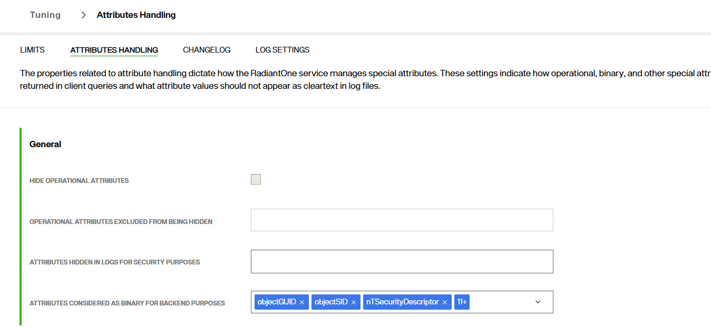

## Overview

Configuring general attributes handling and special settings for addressing duplicate entries are a couple of methods to consider for tuning Identity Data Management.

## Attributes Handling

Attributes Handling is managed from the Control Panel > Global Settings > Tuning > Attributes Handling

 
### Hide Operational Attributes
Check the Hide Operational Attributes option on the Control Panel > Global Settings > Tuning > Attributes Handling section if you do not want LDAP clients to have access to operational attributes (stored in a RadiantOne Directory store) such as: createTimestamp, modifiersName, modifyTimestamp, creatorsName…etc. If you choose to hide operational attributes, LDAP clients must specifically request the operational attribute they want during the search request, otherwise it is not returned.

>[!note] 
>Operational attributes are not hidden from the root user (e.g. cn=Directory Manager) or members of the cn=Directory Administrators group.

Uncheck the Hide Operational Attributes option if LDAP clients are allowed to view the attributes.

### Operational Attributes Excluded from Being Hidden

If checked, the Hide Operational Attributes option hides all operational attributes from non-root users and users that are not a member of the cn=Directory Administrators group. To accommodate third-party integrations that rely on certain operational attributes, without requiring the service account to have Directory Administrator privileges, you can indicate a list of operational attributes that should not be hidden. Indicate them in the "Exclude Operational Attributes From Being Hidden" property. Press "Enter" after entering each attribute name. 

### Attributes Not Displayed in Logs

The "Attributes Hidden in Logs for Security Purposes" property allows you to control which attribute values are not printed in clear in the RadiantOne logs. If you do not want certain attribute values printed in clear in the logs, you can indicate them here. Press "Enter" after entering each attribute name.  Any attribute indicated here has a value of ***** printed in the logs instead of the value in clear.

### Binary Attributes

Sometimes, LDAP directory schema definitions do not define certain attributes as binary even though the value of these attributes is binary. An example of this is the objectGUID attribute in Microsoft Active Directory. If the LDAP backend schema definition does not properly define the attribute type as binary, RadiantOne does not translate the value properly when returning it to an LDAP client. To ensure RadiantOne translates the value as binary, you must list the attribute name in the Binary Attributes parameter (space separated list). This parameter is global and applies to any backend LDAP that RadiantOne is accessing. The binary attributes can be defined in the "Attributes Considered as binary for backend purposes" property. As long as the attribute name is listed, RadiantOne returns the value to a client as binary even if the backend LDAP server doesn’t define it as such.

>[!note] 
>If a binary attribute should be searchable, define the attribute in the RadiantOne LDAP schema with a friendly name indicating it as binary. Below is an example for the certificateRevocationList attribute: attributeTypes: ( 2.5.4.39 NAME ( 'certificateRevocationList;binary' 'certificateRevocationList' ) DESC 'Standard LDAP attribute type' SYNTAX 1.3.6.1.4.1.1466.115.121.1.5 X-ORIGIN 'RFC 2256’ )

## Duplicate Entry Handling

Use duplicate handling when aggregated virtual views can return the same identity more than once. Configure duplicate entry handling through the Settings Service REST API. With the deprecation of the Classic Control Panel, this setting is not available in the Control Panel UI. 

### Duplicate DN Removal

During the identification phase (finding the identity in the directory tree) of the authentication process, it is important that a search for a specific, unique account only returns one entry.

When aggregating model-driven virtual views (created in Context Builder) from multiple sources, there is the potential to have duplicate DN’s (e.g. the same person exists in more than one source or the same identifier belongs to different people). Returning multiple identities with the same DN is a violation of an LDAP directory. Therefore, if your virtual namespace encounters this configuration issue, you can enable the Duplicate DN Removal option to have RadiantOne return only the first entry. This is fine if the duplicate DN’s result in the same person. If they are not the same person, then you have a different problem which is identity correlation (correlating and reconciling the same person in multiple data sources) that needs to be addressed. If your sources contain overlapping accounts that must be correlated, reconciled, or combined into a complete profile, refer to the [Global Identity Builder guide](/documentation/configuration/global-identity-builder/introduction) for assistance.

#### Required permissions

Requests must use an authorization token associated with an account that has the required **Tuning > Attribute Handling** scope.


| Scope | Permission | Allows you to |
| --- | --- | --- |
| `SCOPE_TUNING_GLOBAL_ATTRIBUTES_VIEW` | View | Retrieve the current duplicate-entry configuration |
| `SCOPE_TUNING_GLOBAL_ATTRIBUTES_EDIT` | View & Edit | Update duplicate DN checking and duplicate identity rules |

#### View the configuration

Retrieve the duplicate DN checking setting and configured duplicate identity rules.

```
GET /api/settings-service/duplicate_handling
```

Example response:

```
{
  "duplicateDnChecking": true,
  "duplicationDnRules": [
    {
      "suffix": "ou=hr,o=examples",
      "attributes": ["uid"]
    },
    {
      "suffix": "o=companyprofiles",
      "attributes": ["uid", "mail"]
    }
  ]
}
```

#### Configure duplicate DN checking

Duplicate DNs can occur when multiple virtual views are linked into the same namespace and generate entries with the same DN. LDAP search results cannot contain multiple entries with the same DN, so enable duplicate DN checking to return only the first matching entry.

*Example: the same person in two linked views*

A person named Laura Callahan has an Active Directory account and a Sun Directory account. Both sources are virtualized and then merge-linked into a common virtual tree. Because the RDN configured in each virtual view is identical, both views generate the DN `cn=Laura Callahan,dc=demo`, and a search of the tree from **Control Panel > Manage > Directory Browser** returns two results.

If the Active Directory Laura Callahan is in fact the same person as the Sun Directory Laura Callahan, enable duplicate DN checking to consolidate the two accounts. The same search then returns a single entry, with attributes from the first source the user was found in — Active Directory, in this example.

Enable duplicate DN checking only when duplicate DNs represent the same person. If they represent different people, resolve the underlying identity correlation or namespace issue instead of suppressing the results.

Make the following request to enable (duplicateDnChecking: true) or disable (duplicateDnChecking: false) duplicate DN checking. 

```
PUT /api/settings-service/duplicate_handling/dn-checking
```

```
{
  "duplicateDnChecking": true
}
```

#### Configure duplicate identity rules

Duplicate identity rules suppress entries with matching attribute values, even when the entries have different DNs. Define rules for a namespace suffix and one or more attributes that identify an identity.

Use these rules when RadiantOne aggregates common user identities from multiple sources and a shared attribute identifies the same person across them. Every search response below the configured suffix is checked: if an entry with the same identity attribute value has already been returned, the remaining entries are suppressed.

*Example: one identity across two aggregated sources*

An Active Directory source and a Sun Directory source are aggregated into the virtual namespace below the naming context `dc=demo`. Laura Callahan has an account in each one. To give the two sources a common identifier, `employeeNumber` in Sun is mapped to `employeeID`, so both of her entries carry `employeeID: 8`.

Without a rule, a subtree search for `employeeID=8` below `dc=demo` returns two entries. With a duplicate identity rule that uses `employeeID`, RadiantOne returns only the first entry it finds, the one from Active Directory.

You can configure multiple rules: each branch of the RadiantOne namespace can have its own rule. A rule can also combine attributes. For example, `uid` and `employeeID` together mean that two entries are the same person only when both values match.

##### Requirements for identity attributes

- Use single-valued attributes that represent an identity, such as `employeeID`, `uid`, or `sAMAccountName`.
- An entry is treated as a duplicate only if all attributes in the rule have matching values.
- If an entry does not contain a configured attribute, RadiantOne returns the entry.
- A rule applies to searches at or below its configured `suffix`.
- If no suffix is specified, the rule applies to the entire server search response.
- Restart the RadiantOne service after changing duplicate-entry settings.

Use the following `PUT` request to create or replace duplicate identity rules:

```
PUT /api/settings-service/duplicate_handling/rules
```

```
[
  {
    "suffix": "ou=hr,o=examples",
    "attributes": ["uid"]
  },
  {
    "suffix": "o=companyprofiles",
    "attributes": ["uid", "mail", "cn", "title"]
  }
]
```

To delete specific rules, send an updated array that omits those rules. To delete all rules, send an empty array in the request body:

```
PUT /api/settings-service/duplicate_handling/rules
```

```
[]
```

Duplicate identity rules are useful for authentication searches that must return a single account. For authorization and profile lookups, however, suppressed entries do not contribute their attributes. If you need a complete profile across multiple sources, configure joins between the relevant virtual views. See see [Joins](https://developer.radiantlogic.com/idm/v8.1/introduction/concepts/#joins) for more information.

>[!warning] If your use case requires identity correlation to address user overlap, and a complete identity profile is needed for authorization, you should review the capabilities of the [Global Identity Builder](/documentation/configuration/global-identity-builder/introduction) as opposed to trying to use Duplicate Identity Removal.
