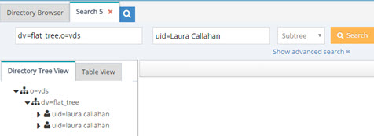
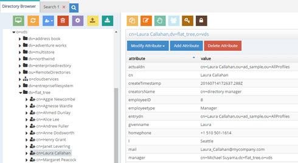
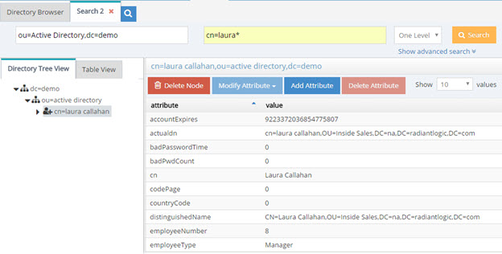
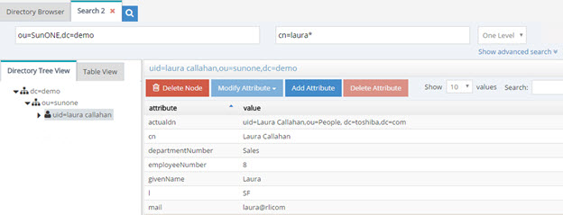
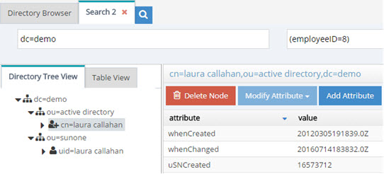
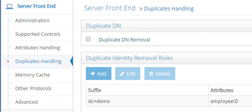

## Overview

Configuring general attributes handling and special settings for addressing duplicate entries are a couple of methods to consider for tuning Identity Data Management.

## Attributes Handling

Attributes Handling is managed from Classic Control Panel > Settings > Server Front End > Attributes Handling

 
### Hide Operational Attributes
Check the Hide Operational Attributes option on the Classic Control Panel > Settings tab > Server Front End > Attributes Handling section if you do not want LDAP clients to have access to operational attributes (stored in a RadiantOne Directory store) such as: createTimestamp, modifiersName, modifyTimestamp, creatorsName…etc. If you choose to hide operational attributes, LDAP clients must specifically request the operational attribute they want during the search request, otherwise it is not returned.

>[!note] 
>Operational attributes are not hidden from the root user (e.g. cn=Directory Manager) or members of the cn=Directory Administrators group.

Uncheck the Hide Operational Attributes option if LDAP clients are allowed to view the attributes.

### Operational Attributes Excluded from Being Hidden
If checked, the Hide Operational Attributes option hides all operational attributes from non-root users and users that are not a member of the cn=Directory Administrators group. To accommodate third-party integrations that rely on certain operational attributes, without requiring the service account to have Directory Administrator privileges, you can indicate a list of operational attributes that should not be hidden. Indicate them in the Exclude Operational Attributes From Being Hidden field. Separate attribute names with a single space. 

<ins>Attributes Not Displayed in Logs</ins>

This property allows you to control which attribute values are not printed in clear in the RadiantOne logs. If you do not want certain attribute values printed in clear in the logs, you can indicate them here. Each attribute name should be separated with a single space. Any attribute indicated here has a value of ***** printed in the logs instead of the value in clear.

### Binary Attributes

Sometimes, LDAP directory schema definitions do not define certain attributes as binary even though the value of these attributes is binary. An example of this is the objectGUID attribute in Microsoft Active Directory. If the LDAP backend schema definition does not properly define the attribute type as binary, RadiantOne does not translate the value properly when returning it to an LDAP client. To ensure RadiantOne translates the value as binary, you must list the attribute name in the Binary Attributes parameter (space separated list). This parameter is global and applies to any backend LDAP that RadiantOne is accessing. The binary attributes can be defined from the Main Control Panel > Settings tab > Server Front End > Attributes Handling section. As long as the attribute name is listed, RadiantOne returns the value to a client as binary even if the backend LDAP server doesn’t define it as such.

>[!note] 
>If a binary attribute should be searchable, define the attribute in the RadiantOne LDAP schema with a friendly name indicating it as binary. Below is an example for the certificateRevocationList attribute: attributeTypes: ( 2.5.4.39 NAME ( 'certificateRevocationList;binary' 'certificateRevocationList' ) DESC 'Standard LDAP attribute type' SYNTAX 1.3.6.1.4.1.1466.115.121.1.5 X-ORIGIN 'RFC 2256’ )

### Excluded Attributes from Active Directory

This parameter is for Active Directory backends and is used for excluding specific attributes from being returned from the backend. Certain “system” attributes (e.g. dscorepropagationdata) returned from Active Directory (even for non-admin users) can cause problems for building persistent cache because the data type is not handled properly, and these attributes need to be added to the RadiantOne LDAP schema for the local storage to handle them in the cache. Also, these attributes cause problems for the change capture connector needed for real-time persistent cache refresh to work properly. Attributes that are not required by RadiantOne client applications, should be added to this list to ensure they are not returned in the view from Active Directory. By default, the AD attributes that are excluded are ds*, acs*, ms* and frs* (* is a wildcard meaning that any attributes with those prefixes are excluded). Any attributes that you do not want returned from the backend Active Directory can be added to the Excluded Attributes property. This value is defined from the Main Control Panel > Settings tab > Server Front End > Attributes Handling section. Make sure a space separates the attributes listed. Click **Save** when finished.

### Multi-Valued Database Attributes

The Multi-Valued Database Attributes setting can be managed from the Main Control Panel > Settings tab > Server Front End > Attributes Handling section. This parameter allows for special processing of a database attribute that contains a multi-value. The database attribute must contain values separated by a space then the pound sign (#), then a space before the next value. For example, assume the following table existed inside a database:

Database Table Sample:

Name | Mail | 	Title
-|-|-
Harold Carter | hcarter@rli.com # harold@yahoo.com | HR Admin # HR # HR MGR

RadiantOne can return the database record with multi-valued attributes for Mail and Title.

Entry returned by RadiantOne with Multi-Valued Attributes Set:

```
cn=Harold Carter
mail = hcarter@rli.com
mail = harold@yahoo.com
title = HR Admin
title = HR
title = HR MGR
```

For RadiantOne to return database attributes as multi-valued, the attribute names must be listed in the Multi-valued DB Attributes parameter. The value of this parameter should be the database attribute name (or Mapped Attribute Name if one is being used). If there is more than one attribute, separate them with a comma.

If the Multi-valued DB Attributes parameter is not set, then RadiantOne would return the following:

Entry returned by RadiantOne if NO Multi-Valued Attributes Set:

```
cn=Harold Carter
mail = hcarter@rli.com # harold@yahoo.com
title = HR Admin # HR # HR MGR
```

## Duplicate Entry Handling

Manage duplicates handling from Classic Control Panel > Settings > Server Front End > Duplicates Handling.

### Duplicate DN Removal

During the identification phase (finding the person in the directory tree) of the authentication process, it is important that a search for a specific, unique user account only returns one entry.

When aggregating model-driven virtual views (created in Context Builder) from multiple sources, there is the potential to have duplicate DN’s (because the same person exists in more than one source or the same identifier belongs to different people). Returning multiple users with the same DN is a violation of an LDAP directory. Therefore, if your virtual namespace encounters this configuration issue, you can enable the Duplicate DN Removal option to have RadiantOne return only the first entry. This is fine if the duplicate DN’s result in the same person. If they are not the same person, then you have a different problem which is identity correlation (correlating and reconciling the same person in multiple data sources) that needs to be addressed. To assist with your identity correlation problem, please see [Global Identity Builder Guide](/documentation/configuration/global-identity-builder/introduction).

Let’s look at an example of duplicate DN’s being returned for the same person. A person named Laura Callahan has an Active Directory account and a Sun Directory account. If both sources are virtualized and then merge-linked into a common virtual tree, a search on the tree would yield two results (because the RDN configured in the virtual views is exactly the same). Below is a screen shot of the virtual tree where both virtual views are linked, and a search from the Control Panel > Manage > Directory Browser, that returns two results.


 

 
If Laura Callahan in Active Directory is in fact the same Laura Callahan as in Sun, you can enable Duplicate DN Removal to consolidate the two accounts. The screen shots below show the Duplicate DN Removal option enabled and the new result for the search.


 


The one entry returned with attributes from the first source the user was found in (Active Directory in this example).



### Duplicate Identity Removal Rules

>[!note] 
>In general, it is usually recommended that you use the [Global Identity Builder](/documentation/configuration/global-identity-builder/introduction) to build your view if you know you have overlapping entries that require correlation/disambiguation.

In cases where RadiantOne is aggregating common user identities from multiple data sources, you have the option to configure it to remove any duplicate users (from search responses) if it finds there is a common attribute/identifier (across the data sources you have aggregated). It can also be used as a way for RadiantOne to eliminate ambiguity by returning only one unique entry. Let’s take two sources as an example. Source 1 is Active Directory and source 2 is a Sun directory. Both sources have been aggregated into the virtual namespace below a naming context of dc=demo and as the two following screens show, Laura Callahan exists in both.





The unique Identifier between the examples above is employeeID (employeeNumber in Sun has been mapped to employeeID to provide a common attribute between Sun and Active Directory). Therefore, a subtree search for employeeID=8 below dc=demo would return two people in this example.



Now, if Duplicate Identity Removal rules are configured, RadiantOne returns only the first entry that it finds (in this case, the one from Active Directory). Multiple duplicate identity rules can be configured (each branch in the RadiantOne namespace may have a duplicate identity removal rule). In addition, multiple attributes may be used to determine a duplicate identity. For example, you can set uid,employeeid and this means if an entry has the same uid and employeeid then it is the same person. Make sure to list the attributes you want to use to determine a duplicate identity with a comma separating each attribute name. Remember to save your settings after defining the rules.



>[!warning] 
>The identity attribute selected, must satisfy the following requirements: 
<br>Single-valued <br>Represent an identity (sAMAccountName, employeeID, etc...) <br>If the attribute is not present in an entry, the entry is returned. <br>If no suffix is specified, this identity attribute applies to the whole server search response.<br>The RadiantOne service must be restarted after changing these parameters. <br>Any search response returned by RadiantOne (below the specified starting suffix) checks if another entry with the same attribute/value has already been returned. If an entry with the same identity attribute value has been returned, then others are not returned.


This is ideal for handling authentication requests (to ensure only one entry is returned to base authentication on). However, for authorization purposes, if a user exists in more than one source, only attributes from the first source are returned. If you need a complete profile of attributes coming from all the user’s accounts, then you need to configure joins to all branches in the virtual tree where the user may have an account. This join condition can be based on the identity attribute (or any other attribute that can be used to uniquely identify the person in the other branch). As a result, searches for the user still return only one entry. Without a join configured across these virtual views, only attributes from the first source the user was found in would be returned. For details on joining, please see [Joins](../introduction/concepts#joins) in the Concepts section.

>[!warning] If your use case requires identity correlation to address user overlap, and a complete identity profile is needed for authorization, you should review the capabilities of the [Global Identity Builder](/documentation/configuration/global-identity-builder/introduction) as opposed to trying to use Duplicate Identity Removal.
