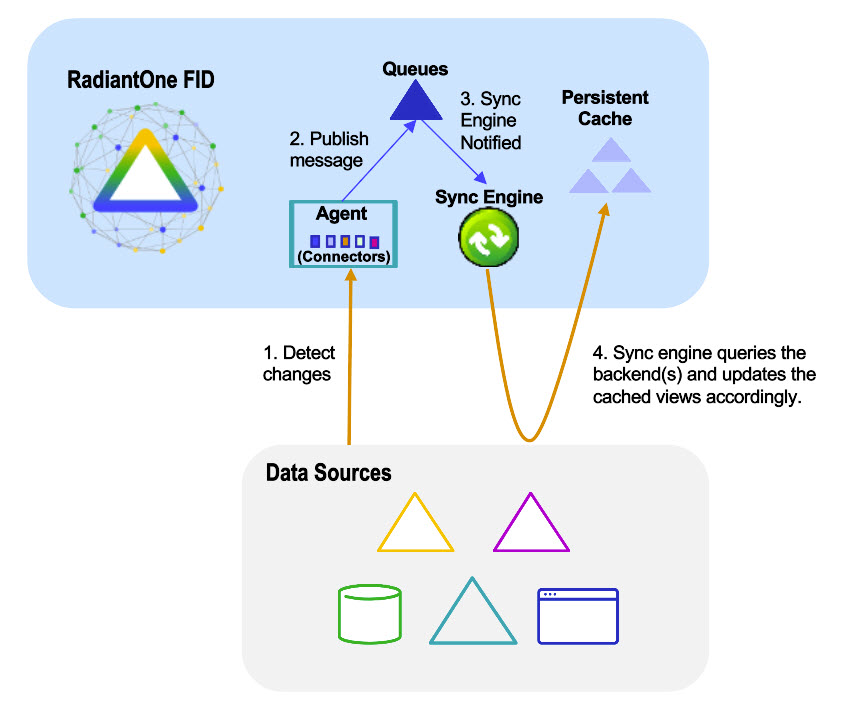
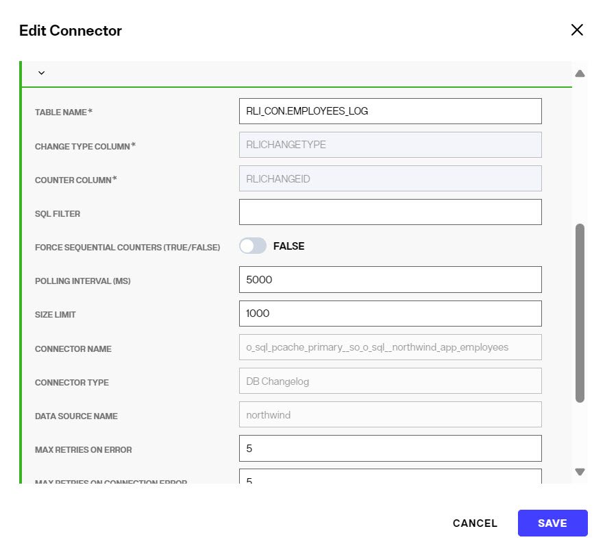
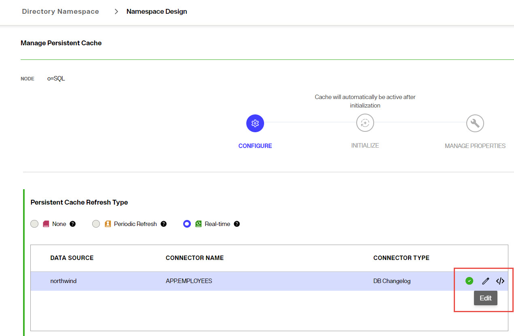
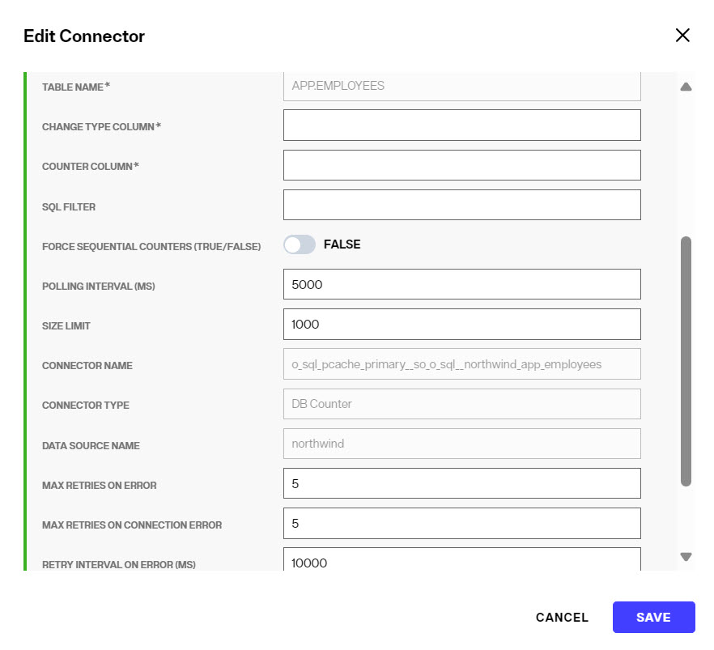
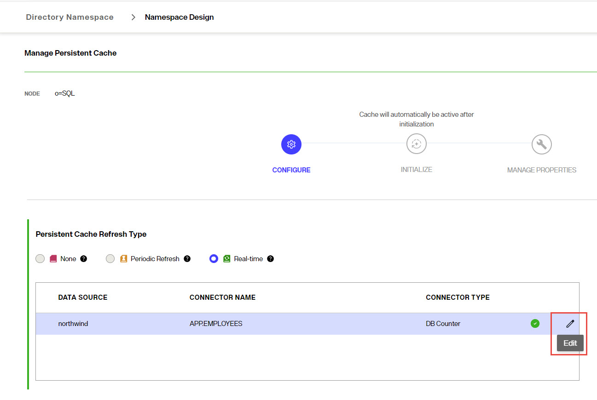
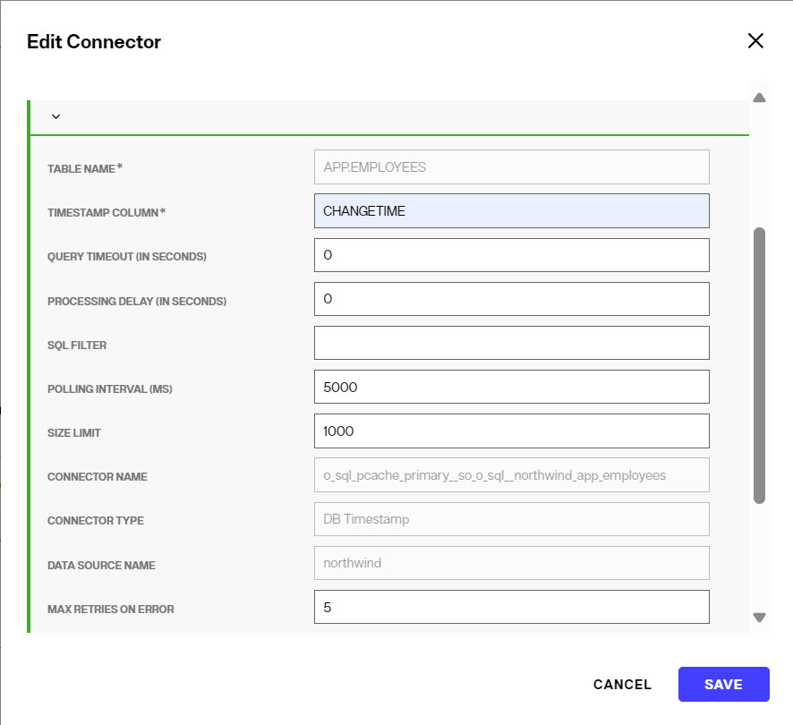
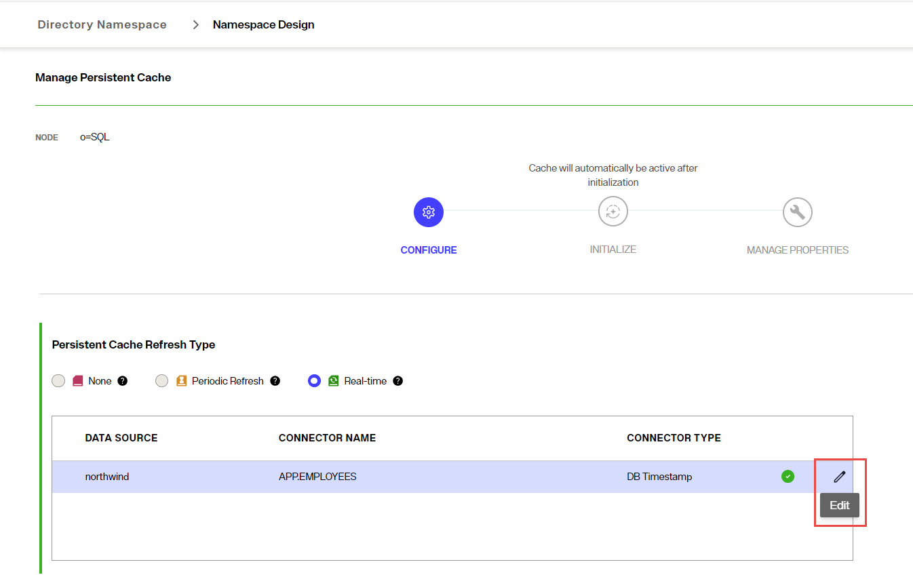
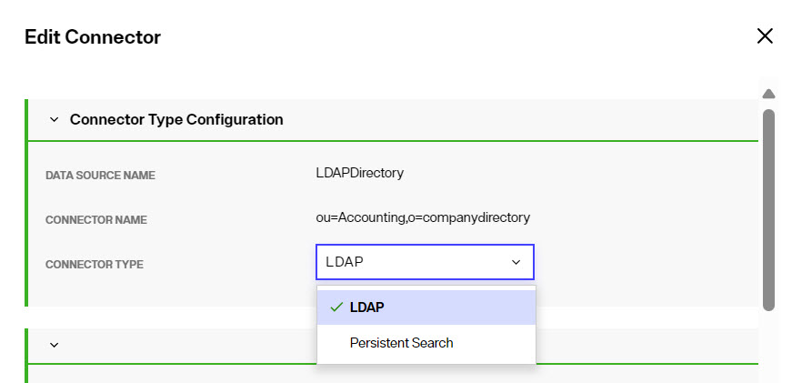
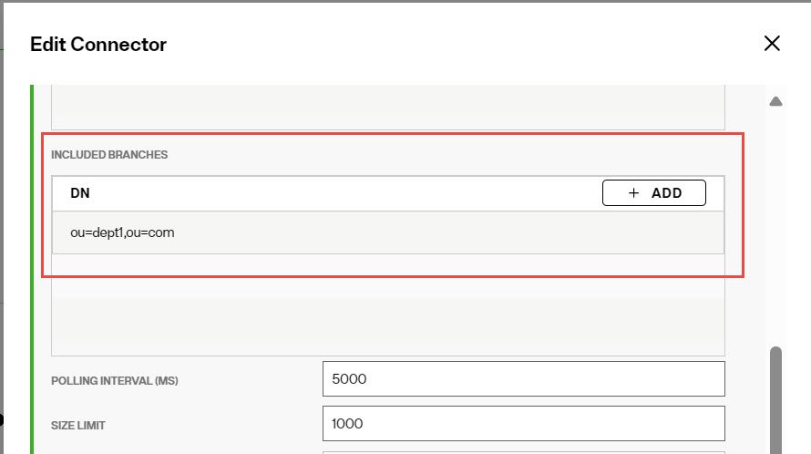

## Overview
RadiantOne includes capture connectors for databases and directories. A connector is an adapter for one catalog/object per data source that can be configured to listen for changes. Some examples are:

- A SQL Server connector for database/catalog PUBS
- An Oracle connector for database owner SCOTT
- An LDAP connector for the inetOrgPerson object class in the schema

For databases, there are three capture connector types: Counter, Changelog (Triggers-based), or Timestamp.

For LDAP directories, there are two connector type options: LDAP (changelog), or Persistent Search.

For Active Directory, there are three connector type options: AD USNChanged, AD DirSync, and AD Hybrid. 

Capture connectors are used to trigger events for persistent cache refresh and publish change messages to queues. A sync engine receives notification when messages are in a queue, applies transformation to the message (when needed) and sends notification to the RadiantOne service to refresh the needed views/cache dependencies.

A high-level architecture is shown below.



### Reset connector cursor – detect new changes only

Capture connectors use a cursor to maintain information about the last processed changes. This allows the connectors to capture only changes that have happened since the last time they checked for changes. When the real-time persistent cache refresh connectors start, they automatically attempt to capture all changes that have happened since the last time they checked. If the real-time persistent cache refresh process has been stopped for an extended period of time, you might not want them to attempt to capture all changes since the last time they checked. In this case, you can reset the cursor for the connector. From the Classic Control Panel > PCache Monitoring tab, select the real-time refresh topology and the topology displays. Click the icon representing the capture connector and the Runtime details are displayed on the right. Click **Reset Cursor** to clear the cursor value and trigger the connector to behave as if it is the first time connecting to the source to collect changes.


## Database Changelog 
When a database object is configured as a publisher, triggers are installed on the object and document all changes to a log table. This object name has the syntax `{TABLE_NAME}_LOG`. In the log table, two predefined column names are required: `RLICHANGEID` and `RLICHANGETYPE`. `RLICHANGEID` uniquely identifies one row in the change log table, and `RLICHANGETYPE` identifies the operation (insert, update, delete, abort). The database connector queries the log table to check for changes based on the polling interval.

The `RLI_CON` user (configurable) is the default owner of the log table. This special user can also prevent a constant loop of changes when the database objects have been configured as both a publisher and subscriber. When this user makes changes to the database objects, the connector knows to ignore the change.


### Configuration

To detect changes using Changelog (triggers) see: [Configure capture connector types](cache-capture-connectors#database-connectors).

After the DB Changelog connector type has been selected and configured, you can configure the properties in the Edit Connector screen. An example is shown below.



To go back to edit connector properties after the initial configuration, in the **CONFIGURE** section of the cache, click the pencil icon inline with the connector.



### Log Table User

Enter the user name for the connector's dedicated credentials for connecting to the log table. If you do not have the user name, contact your DBA to get the information to use.

### Log Table User password

The password for the user configured in the Log Table User property. If you do not have the password, contact your DBA to get the credentials.

### Table name

The name of the database table where changes to database entries are logged. You can use an existing table by entering the name in this property. Or enter the name of the table to create using the RadiantOne configuration scripts. Be sure to use the proper syntax for your database vendor (e.g. `{USER}.{TABLE}_LOG`).

### Apply configuration to database

When you save the connector type configuration, you are prompted to execute the scripts on the database server. An example is shown below.


If you choose **OK** to execute the DB Changelog scripts, `SELECT`, `INSERT`, `UPDATE`, and `DELETE` access are granted for PUBLIC to the LOG table. Check with your database administrator if you need to restrict access rights on the log table. You can select the **NO** option and the generated script can be reviewed, modified if needed, and run on the database by a DBA. Click the Download button to download the sql scripts.

### SQL Filter

SQL Filter is used as part of the request for entries captured by the timestamp connector. Only changes that match the filter are published by the connector.

A SQL filter is either a single expression or several single expressions joined by binary operators and brackets ( ). Possible binary operators are:

- `AND`
- `OR`
- `NOT`

Some examples of valid SQL Filters are:

- `ID='5'`
- `ID='5' AND NAME='ALLEN'`
- `ID='5' AND NAME='ALLEN' OR CITY='SAN FRANCISCO'`
- `ID='5' AND (NAME='ALLEN' OR CITY='SAN FRANCISCO')`
- `NAME LIKE 'AL%'`
- `NAME LIKE 'ALLE_'`

If the SQL Filter syntax entered in the property is not correct, an error occurs. The connector waits for the length of time specified in the [Retry Interval on Error](configure-connector-types-and-properties.md#retry-interval-on-error) and then tries to get the changed entries in the database again. After the maximum number of retries (indicated in the [Max Retries on Error](configure-connector-types-and-properties.md#max-retries-on-error) property) is exhausted, if the SQL syntax is still invalid, the connector stops. You must either remove or correct the SQL filter before restarting the connector. It is recommended that you set the connector [Log Level](configure-connector-types-and-properties.md#log-level) to `DEBUG` and check the connector log for the SQL query (**Executing query:**) that is generated to ensure the value entered in the SQL Filter property is translated properly. The capture connector log is located at `{RLI_HOME}\logs\sync_agents\{PIPELINE_ID}\connector.log` on the RadiantOne node where the sync agent is running. Go to the Server Control Panel > Log Viewer to download and/or view the log file. See the RadiantOne System Administration Guide for details on the Server Control Panel. 

If the connector should process all changed entries, do not enter a SQL filter.

### Force Sequential Counters

This property accepts a value of `true` or `false` and dictates how the connector treats entries it picks up from the LOG table that have non-sequential change IDs. The default is `true` meaning that if the connector detects a non-sequential change ID for an entry in the LOG table, it behaves as if there is an error (non-connection error) and the retry logic based on the Max Retries on Error and Retry Interval on Error properties takes effect. Sometimes rows in the log table are not written in the order of the change ID, and if the connector does not wait for the entries to have sequential IDs, some changes could be missed. The connector waits for the length of time specified in the [Retry Interval on Error](configure-connector-types-and-properties.md#retry-interval-on-error) and then tries to get the changed entries in the database again. After the maximum number of retries (indicated in the [Max Retries on Error](configure-connector-types-and-properties.md#max-retries-on-error) property) is exhausted, if it still detects non-sequential change IDs, the connector stops. You can [manually edit the cursor value](overview.md#manually-update-connector-cursor) before restarting the connector to avoid the non-sequential number. Or you can disable the `Force Sequential Counters` property for the connector.

If the connector should ignore non-sequential change IDs, and process all changes immediately, set the property to `false`.

To learn more about connectors, please read the document that describes properties specific to the [Database timestamp connector](database-timestamp-connector.md).
  

## Database Counter  
To support the Database Counter connector, the database table must have an indexed column that contains a sequence-based value that is automatically maintained and modified for each record that is added, updated or deleted. The Database Counter connector uses this column to maintain a cursor to keep track of processed changes.

### Supported database integer types

The counter connector supports database integer data types; more specifically, types which can be converted into Java's long data type (approx. from -9.2\*10^18 to 9.2\*10^18).

### Configuration

To detect changes using Database Counter see: [Configure capture connector types](cache-capture-connectors#database-connectors).

After the DB Counter connector type has been selected and configured, you can configure the properties in the Edit Connector screen. An example is shown below.



To go back to edit connector properties after the initial configuration, in the **CONFIGURE** section of the cache, click the pencil icon inline with the connector.



### Change Type Column

In the Core Properties section, enter a column name in the Change Type Column property. This value is the database table column name that contains the information about the type of change (insert, update or delete). If the column does not have a value, an update operation is assumed.

### Counter Column

In the Core Properties section, enter a column name in the Counter Column property. This value is the database table column name that contains the value that auto-increments when the row changes.


### SQL Filter

SQL filter is used as part of the request for entries captured by the timestamp connector. Only changes that match the filter are published by the connector.

A SQL filter is either a single expression or several single expressions joined by binary operators and brackets ( ). Possible binary operators
are:

- `AND`
- `OR`
- `NOT`

Some examples of valid SQL Filters are:

- `ID='5'`
- `ID='5' AND NAME='ALLEN'`
- `ID='5' AND NAME='ALLEN' OR CITY='SAN FRANCISCO'`
- `ID='5' AND (NAME='ALLEN' OR CITY='SAN FRANCISCO')`
- `NAME LIKE 'AL%'`
- `NAME LIKE 'ALLE_'`

If the SQL Filter syntax entered into the property is not correct, an error occurs. The connector waits for the length of time specified in the [Retry Interval on Error](configure-connector-types-and-properties.md#retry-interval-on-error) and then tries to get the changed entries in the database again. After the maximum number of retries (indicated in the [Max Retries on Error](configure-connector-types-and-properties.md#max-retries-on-error) property) is exhausted, if the SQL syntax is still invalid, the connector stops. You must either remove or correct the SQL filter before restarting the connector. It is recommended that you set the connector [Log Level](configure-connector-types-and-properties.md#log-level) to `DEBUG` and check the connector log for the SQL query (**Executing query:**) that is generated to ensure the value entered in the `SQL Filter` property is translated properly. The capture connector log is located at `{RLI_HOME}\logs\sync_agents\{PIPELINE_ID}\connector.log` on the RadiantOne node where the sync agent is running. Go to the Server Control Panel > Log Viewer to download and/or view the log file. See the RadiantOne System Administration Guide for details on the Server Control Panel.

If the connector should process all changed entries, do not enter a SQL filter.

### Force Sequential Counters

This property accepts a value of `true` or `false` and dictates how the connector treats entries it picks up from the LOG table that have non-sequential change IDs. The default is `true` meaning that if the connector detects a non-sequential change ID for an entry in the LOG table, it behaves as if there is an error (non-connection error) and the retry logic based on the Max Retries on Error and Retry Interval on Error properties takes effect. Sometimes rows in the log table are not written in the order of the change ID, and if the connector does not wait for the entries to have sequential IDs, some changes could be missed. The connector waits for the length of time specified in the [Retry Interval on Error](configure-connector-types-and-properties.md#retry-interval-on-error) and then tries to get the changed entries in the database again. After the maximum number of retries (indicated in the [Max Retries on Error](configure-connector-types-and-properties.md#max-retries-on-error) property) is exhausted, if it still detects non-sequential change IDs, the connector stops. You can [manually edit the cursor value](overview.md#manually-update-connector-cursor) before restarting the connector to avoid the non-sequential number. Or you can disable the Force Sequential Counters property for the connector.

If the connector should ignore non-sequential change IDs, and process all changes immediately, set the property to `false`.


## Database Timestamp  

For Oracle, SQL Server, MySQL, MariaDB, PostGres, Apache Derby, Snowflake and Salesforce backends (using the RadiantOne JDBC driver), a timestamp-based change detection mechanism is available. To leverage this mechanism, your database table must have a column that contains a timestamp/date value associated with updates. For Salesforce, this column is `LastModifiedDate`. The column used in the timestamp connector must be indexed for performance.

>[!warning]
>This connector type does not detect delete operations. If you have a need to detect and propagate delete operations from the database, you should choose a different connector type. However, for Salesforce backends, delete operations can be detected because a delete operation is detected when the `isActive` attribute is set to `false`.
>This connector type does not differentiate between `ADD` and `UPDATE` operations. All events are processed as `UPDATE` operations. 

For each database object that is a publisher of changes, a new/changed row in the table must have a timestamp column associated with it.

### Supported database date types

The timestamp connector has been validated against Oracle, SQL Server, MySQL, and MariaDB databases, and Salesforce only (when accessed using the RadiantOne Salesforce JDBC driver). The timestamp connector time stamp mode supports the following database date types:

- For Oracle DB: `TIMESTAMP`, `TIMESTAMP WITH TIME ZONE`, `TIMESTAMP WITH LOCAL TIME ZONE`, and `DATE`.
- For SQL Server: `SMALLDATETIME`, `DATETIME`, and `DATETIME2`
- For Salesforce (using RadiantOne Salesforce JDBC driver): `LastModifiedDate`
- For MySQL or MariaDB: `DATETIME` is preferable, but `TIMESTAMP` can also be used. `DATETIME`, `DATETIME(3)`, or `DATETIME(6)` can be used. `DATETIME(7)` is not supported.
- For Snowflake: `TIMESTAMPNTZ`
- For Apache Derby: `TIMESTAMP`
- For PostGres: `TIMESTAMP`, timestamp without time zone (equivalent to timestamp), or `TIMESTAMPTZ`, timestamp with time zone (equivalent to timestamptz)

### Configuration

This connector type can be used for detecting changes in Oracle, SQL Server, MySQL, Apache Derby, PostGres, Snowflake, MariaDB and Salesforce (when the RadiantOne JDBC driver for Salesforce is used).

To detect changes using Database Timestamp see: [Configure capture connector types](cache-capture-connectors#database-connectors).

After the DB Timestamp connector type has been selected and configured, you can configure the properties in the Edit Connector screen. An example is shown below.



To go back to edit connector properties after the initial configuration, in the **CONFIGURE** section of the cache, click the pencil icon inline with the connector.



### Timestamp Column

In the Core Properties section, set the Timestamp Column. The value of this property should indicate the exact database column name in your database table that contains either a date/timestamp or a sequence number that indicates when a record has been modified. The value of this column is used by the connector to determine which rows have been modified since the last time it picked up changes from the table.

>[!note]
>For detecting changes in Salesforce, the column name should be `LastModifiedDate`.

If an invalid column name is configured, the connector stops.


### Processing Delay

This property can be used if there is a need for a delay in the processing of changes by the connector. For example, if there are two or more processes that update the source table at the same time, and they take about 2 minutes each to run, the processing delay can be set at anywhere between 4-6 minutes. This delays the processing and makes sure the connector captures all changes coming from both processes.

The property value is in seconds, and the default value is `0`. If the value is set to `<=0`, it means that the property is ignored by the connector. If the value is set to be more than `0`, then only the entries between `last_cursor` and `current_time – processing_delay` are processed by the connector. If an invalid, non-numeric value is set for this property, the connector stops.

### SQL Filter

SQL filter is used as part of the request for entries captured by the timestamp connector. Only changes that match the filter are published by the connector.

A SQL filter is either a single expression or several single expressions joined by binary operators and brackets ( ). Possible binary operators are:

- `AND`
- `OR`
- `NOT`

Some examples of valid SQL Filters are:

- `ID='5'`
- `ID='5' AND NAME='ALLEN'`
- `ID='5' AND NAME='ALLEN' OR CITY='SAN FRANCISCO'`
- `ID='5' AND (NAME='ALLEN' OR CITY='SAN FRANCISCO')`
- `NAME LIKE 'AL%'`
- `NAME LIKE 'ALLE_'`

If the SQL Filter syntax entered into the property is not correct, an error occurs. The connector waits for the length of time specified in the [Retry Interval on Error](configure-connector-types-and-properties.md#retry-interval-on-error) and then tries to get the changed entries in the database again. After the maximum number of retries (indicated in the [Max Retries on Error](configure-connector-types-and-properties.md#max-retries-on-error) property) is exhausted, if the SQL syntax is still invalid, the connector stops. You must either remove or correct the SQL filter before restarting the connector. It is recommended that you set the connector [Log Level](configure-connector-types-and-properties.md#log-level) to `DEBUG` and check the connector log for the SQL query (**Executing query:**) that is generated to ensure the value entered in the SQL Filter property is translated properly. The capture connector log is located at `{RLI_HOME}\logs\sync_agents\{PIPELINE_ID}\connector.log` on the RadiantOne node where the sync agent is running. Go to the Server Control Panel > Log Viewer to download and/or view the log file. See the RadiantOne System Administration Guide for details on the Server Control Panel.

If the connector should process all changed entries, do not enter a SQL filter.

### Query Timeout

The default is 0 (no timeout). This is the length of time (in seconds) that the connector waits to receive a response from the backend database. After this time, the connector discards the query and moves on to the next query. If the query timeout is set to 0, the connector waits indefinitely for a response from the backend database.

### Force Sequential Counters

This property accepts a value of`true` or `false` and dictates how the connector treats entries it picks up from the LOG table that have non-sequential change IDs. The default is `true` meaning that if the connector detects a non-sequential change ID for an entry in the LOG table, it behaves as if there is an error (non-connection error) and the retry logic based on the Max Retries on Error and Retry Interval on Error properties takes effect. Sometimes rows in the log table are not written in the order of the change ID, and if the connector does not wait for the entries to have sequential IDs, some changes could be missed. The connector waits for the length of time specified in the [Retry Interval on Error](configure-connector-types-and-properties.md#retry-interval-on-error) and then tries to get the changed entries in the database again. After the maximum number of retries (indicated in the [Max Retries on Error](configure-connector-types-and-properties.md#max-retries-on-error) property) is exhausted, if it still detects non-sequential change IDs, the connector stops. You can [manually edit the cursor value](overview.md#manually-update-connector-cursor) before restarting the connector to avoid the non-sequential number. Or you can disable the Force Sequential Counters property for the connector.

If the connector should ignore non-sequential change IDs, and process all changes immediately, set the property to `false`.

## LDAP Connectors
There are two types of LDAP connectors: Changelog and Persistent Search. These connector types are described in this document.

**LDAP (Changelog) connector**

Any LDAP directory that offers a changelog can use the LDAP connector type. This includes the RadiantOne service.

For the changelog functionality, some directories like Oracle ODSEE, must have the changelog and retro changelog plug-in enabled. The connector polls the changelog based on the changelog polling interval parameter. The connector internally keeps track of the last processed change and only processes new changes. If the connector is shut down (either deliberately or due to failure) it can read the changelog and capture all changes that occurred while the connector was offline.

A special user (that represents the "connector" user) must exist in the directory. This user must have sufficient rights for detecting changes (reading the changelog). When defining the data source associated with the LDAP (source) backend, enter this user in the connection parameter.

**LDAP Persistent Search connector**

The Persistent Search connector issues a persistent search and gets notified by the directory server when data changes. For directories that offer persistent search, no special configuration is required to enable this function on the LDAP server. If the connector is shut down (either deliberately or due to failure), the delete operations that occurred on the directory are lost. Once the connector is back online there is no way to retrieve the delete operations that occurred while it was down. The only exception to this is for IBM TDS directories. It stores deleted entries and the capture connector is able to read them, and based on timestamp, determine if the change occurred while the connector was offline.

Any LDAP directory that offers a persistent search mechanism can use the Persistent Search connector type. Novell eDirectory is an example of an LDAP source that supports persistent search. Others include Red Hat Directory, IBM TDS, and CA Directory.

### Configuration

Set the connector type in the **CONFIGURE** section of the persistent cache refresh. Select the connector type from the drop-down list.



After selecting the Connector Type, configure the connector properties. For properties common to all connectors, see [Configure capture connector types and properties](configure-connector-types-and-properties.md#common-properties-for-all-connectors). The general properties for LDAP connectors are configured in the Core Properties section. Properties related to filtering of events are configured in the Event Filtering section. Properties related to the contents of the messages published by the connector are configured in the [Event Content](configure-connector-types-and-properties.md#event-contents) section. All other properties are configured in the Advanced Properties section. [Polling interval](configure-connector-types-and-properties.md#polling-interval)is not required for the LDAP Persistent Search connector. For properties that determine how the connector filters events that are not needed, configure the LDAP Filter, Included Branches and Excluded Branches in the Event Filtering section. These properties are described below.

### LDAP Filter

To further condition the entries that are published, you can indicate the desired criteria in the LDAP Filter property. This is a post filter, used to qualify which entries are published by the connector. You must enter a valid LDAP filter in the property.

This property can be used to avoid publishing unwanted information.

If a captured entry matches the criteria indicated in the LDAP filter property, it is published by the connector. If it does not, the entry is not published.

If the captured change type is delete, and not enough information is known about the entry, the LDAP filter is not used and the entry is published by the connector. For example, if the LDAP filter property contained a value of `(l=Novato)` and the captured entry did not contain an `l` attribute, the LDAP filter is not applied and the entry is published.

If the captured change type is not delete (e.g. insert, update, move, etc.), and not enough information is known about the entry, the LDAP filter is still used and the entry is not published. For example, if the LDAP filter property contained a value of `(l=Novato)` and the captured entry did not contain an `l` attribute, the LDAP filter is still applied and the entry is not published by the connector.

>[!note]
>If a change is made to this property while the connector is running, it must be restarted for the new value to take effect.

### Excluded Branches

To further condition the entries that are published, you can indicate one or more branches to exclude. In the Excluded Branches property, use **+ADD** and enter (or browse to) one or more suffixes associated with entries that should not be published by the connector. Click the  after each suffix. An example is shown below.


If the changed entry DN contains a suffix that matches the excluded branches value, or is a change in the exact entry that is listed (e.g. `ou=dept1,ou=com`), this entry is not published by the connector. Otherwise, the entry is published. This can avoid publishing unwanted information.

>[!note]
>If both included and excluded branches are used, an entry must satisfy the conditions defined in both settings to be included in the message. The included branches condition(s) is checked first.

If a change is made to this property while the connector is running, the new value is taken into account once the connector re-initializes which happens automatically every 20 seconds.

### Included Branches

To further condition the entries that are published, you can indicate one or more branches to include. In the Included Branches property, enter one or more suffixes associated with entries that should be published by the connector. Select **Enter** after each suffix. An example is shown below.



If the changed entry DN contains a suffix that matches the included branches value, or is a change in the exact entry that is listed (e.g. `ou=dept1,ou=com`), this entry is published by the connector. Otherwise, the entry is not published. This can avoid publishing unwanted
information.

>[!note]
>If both included and excluded branches are used, an entry must satisfy the conditions defined in both settings to be included in the message. The included branches condition(s) is checked first.

If a change is made to this property while the connector is running, the new value is taken into account once the connector re-initializes which happens automatically every 20 seconds.

### Switch to Primary Server (in polling intervals)

This option is relevant for the LDAP changelog connector type.

This option, working in conjunction with the Polling Interval property, allows you to configure how often, if at all, the connector attempts to switch back to the primary server after failover.

To configure the connector to attempt to switch to the primary server, set Switch to Primary Server to a value of `4` or greater. You can set the value to less than `4`, but attempting to connect back to the primary server can be time consuming and therefore not recommended to do frequently. For example, if this value is set to `1`, the connector makes an attempt every polling interval. If the Switch to Primary Server value is `3`, the connector makes an attempt every third polling interval.

To disable attempts to reconnect to the primary server, set this value to `zero`. This is the default value.

Changes made to this property's value while the connector is running are immediately taken into account. When the connector starts or restarts and the property value is `1` or higher, the connector attempts to switch to the primary server immediately.


### Failover Algorithm

This option is relevant for the LDAP changelog connector type.

When a failover happens, the changelog capture connector attempts to find a new cursor. Since this process is inexact, and changenumber sequence can vary across some replica servers, some events may be replayed or lost. The changelog connector maintains a cursor that indicates information related to the last change processed by the connector along with information about possible replica servers in case failover is needed. During failover, the connector searches the changelog of the replica servers and determines minimum and maximum changenumbers across them. Assume that the last processed changenumber stored by the connector is 100 and there are 2 replica servers defined for the backend. During failover, the connector determines the current changenumbers for each of the replicas by searching their changelogs. Assume that replica 1 has changenumber 99 and replica 2 has changenumber 97. When the connector needs to failover, it must decide whether to start processing changes using changenumber 100 (its current last processed change), 97 (changenumber from replica 2), or 99 (changenumber from replica 1).

The Failover Algorithm property allows you to determine how the cursor value gets set during failover, and ultimately determine the quantity of events that are replayed. The property supports values between `1` and `4`. The meaning of each is outlined in the table below.


| Value | Function | Set this value if... |
|---|---|---|
| 1 | Sets cursor to the minimum changenumber based on the current changelog numbers of the replica servers. In the example described above, changenumber of 97 is used. This is the default setting. | You do not want to lose any events. This may result in many events being replayed. |
| 2 | Sets cursor to maximum changenumber based on the current changelog numbers of the replica servers. In the example described above, changenumber of 99 is used. | You want to minimize the replaying of events during failover. This may result in some events being lost. |
| 3 | The cursor is not changed. The exact last processed changed stored in the connector cursor would be used. In the example described above, changenumber of 100 is used. | You know that the LDAP servers in the replica have the same changeNumber in `cn=changelog`. For example, all RadiantOne nodes in a cluster have the same changeNumber in `cn=changelog`. |
| 4 | Sets cursor to the last changenumber of the failover server. In the example described above, if replica 1 is the failover server that gets used, changenumber of 99 is used. If replica 2 is the failover server, changenumber of 97 is used. | You do not want to replay any events during failover. This may result in the loss of many events. |

## Active Directory Connectors  
There are three types of Active Directory connectors: USNChanged, DirSync and Hybrid. These connector types are described in this document.

>[!note]
>The Active Directory USNChanged connector supports AD LDS.

The decision tree below can help guide you on the Active Directory connector type to use.


**Active Directory USNChanged connector**

Active Directory keeps track of changes that happen to entries in the directory (by incrementing the `uSNChanged` attribute for the entry). Based on a polling interval configured, the connector connects with the user and password configured in the connection string/data source and checks the list of changes stored by Active Directory. The connector internally maintains the last processed change number (`uSNChanged` value) and this allows for the recovery of all changes that occur even if the connector is down (deliberately or due to failure).

>[!note]
>This is the connector type that must be used if the backend is an Active Directory Global Catalog. The Active Directory DirSync connector should not be used because it is unable to detect events in sub-domains.**
>Also, If you are pointing the Active Directory connector to the Global Catalog, when a deleted entry is detected, the connector receives only the DN of the deleted entry in the context of the `CN=Deleted Objects` container (e.g. `CN=u1\0ADEL:2ca20e8c-1748-4e7d-9044-45e64ab8105b,CN=Deleted Objects,DC=t1,DC=f6,DC=rli`). Transformation logic needs to address how to find the corresponding entry in the target(s) to remove or update them accordingly.**

If the sequence of events is critical, use the [DirSync connector](#active-directory-dirsync-connector) because it processes events in the order in which they occur instead of prioritizing and processing inserts and updates before deletes.

>[!warning]
>To detect delete events, the service account used by RadiantOne to connect to the backend Active Directory (configured in the connection string of the RadiantOne data source) must have permissions to search the tombstone objects. More specifically, the LIST CONTENTS and READ PROPERTY permissions to the` CN=Deleted Objects` branch are required. Generally, a member of the Administrators group is sufficient. However, some Active Directory servers may require a member of the Domain Admins group. Check with your Active Directory permissions to determine the appropriate credentials required.

**Active Directory DirSync connector**

The Active Directory DirSync capture connector retrieves changes that occur to entries in a directory by passing a cookie that identifies the directory state at the time of the previous DirSync search. The first time the DirSync capture connector is started, it stores a cookie in a cursor file. At the next polling interval, the connector performs a DirSync search to detect changes by sending the current cookie. These changes include only the objects and attributes that have changed since the previous state identified by the current cookie. Because it retrieves only changed objects and attributes, the Active Directory DirSync capture connector avoids propagating irrelevant attributes, reducing message size and potentially reducing network congestion. After retrieving changes, a new cookie is obtained, and the cursor file is updated.

>[!warning]
> Do not use this connector type if your backend is an Active Directory Global Catalog because it is unable to detect events in sub-domains. Use the [Active Directory (USNChanged)](overview.md#manually-update-connector-cursor) connector instead.
>To detect delete events, the service account used by RadiantOne to connect to the backend Active Directory (configured in the connection string of the RadiantOne data source) must have permissions to search the tombstone objects. Generally, a member of the Administrators group is sufficient. However, some Active Directory servers may require a member of the Domain Admins group. Check with your Active Directory permissions to determine the appropriate credentials required.

The DirSync capture connector is recommended for environments where the sequence of events is critical. The DirSync capture connector processes events in the order in which they occur, unlike the [Active Directory USNChanged connector](overview.md#manually-update-connector-cursor) which prioritizes inserts and updates before deletes.

To use the DirSync control, the Bind DN connecting to the directory must have the DS-Replication-Get-Changes extended right, which can be enabled with the **Replicating Directory Changes** permission, on the root of the partition being monitored. By default, this right is assigned to the Administrator and LocalSystem accounts on domain controllers.

>[!warning]
>The DirSync capture connector does NOT capture changes to calculated attributes such as the `memberOf` attribute or moved entries (`modDN` or `modRDN` operations).

**Active Directory Hybrid connector**

The Active Directory hybrid capture connector uses a combination of the uSNChanged and DirSync change detection mechanisms. The first time the connector starts, it gets a new cookie and the highest `uSNchanged` number. When the connector gets a new change (modify or delete), it makes an additional search using the DN of the entry and fetches the entry from AD. The fetched entry contains the `uSNChanged` attribute, so the connector updates the cursor values for both for the cookie and the last processed `uSNchanged` number.

>[!warning]
>If you are virtualizing and detecting changes from a Global Catalog, then you must use the Active Directory USNChanged changed connector because the Hybrid connector cannot detect change events on sub-domains.

When the connector restarts, uSNChanged detection catches the entries that have been modified or deleted while the connector was stopped. The LDAP search uses the last processed uSN to catch up. After the connector processes all entries, it requests a new cookie from AD (not from the cursor) and switches to DirSync change detection.

### Active Directory Connector Failover

All Active Directory connectors have the ability to failover to a replica if the primary server is unavailable and the number of failure exceptions exceeds either the [Maximum Retries on Error](configure-connector-types-and-properties.md#max-retries-on-error) or [Maximum Retries on Connection Error](configure-connector-types-and-properties.md#max-retries-on-connection-error) value. This mechanism leverages the Active Directory replication vectors `[replUpToDateVector]`, and the failover servers configured at the level of the RadiantOne data source associated with Active Directory, to determinate which server(s) the connector switches to in case of failure. Since the replication vector contains all domains, in addition to some possibly retired domains, the connector narrows down the list of possible failover candidates to only the ones listed as failover servers in the RadiantOne data source associated with the Active Directory backend. If there are no failover server defined for the data source, all domains in the replication vector are possible candidates for failover.

>[!warning]
>When defining the RadiantOne data source associated with Active Directory, do not use Host Discovery or Load Balancers. You must use the fully qualified machine names for the primary server and failover servers. Do not use IP addresses. Also, it is highly recommended that you list your desired failover servers at the level of the data source. Not only does this make the failover logic more efficient, but it also avoids delays in synchronization.

`[replUpToDateVector]` definition: The non-replicated attribute `replUpToDateVector` is an optional attribute on the naming context root of every naming context replica. If this vector is unavailable, the connector is suspended.

The ReplUpToDateVector type is a tuple with the following fields:

- `uuidDsa`: The invocation ID of the DC that assigned `usnHighPropUpdate`.
- `usnHighPropUpdate`: A USN at which an update was applied on the DC
  identified by `uuidDsa`.
- `timeLastSyncSuccess`: The time at which the last successful replication occurred from the DC identified by `uuidDsa`; for replication latency reporting only.

`[replUpToDateVector]` example:

```sh
01ca6e90-7d20-4f9c-ba7b-823a72fc459e @ USN 2210490 @ Time 2005-08-21
15:54:21

1d9bb4b6-054a-440c-aedf-7a3f28837e7f @ USN 26245013 @ Time 2007-02-27
10:17:33

24980c9d-39fa-44d7-a153-c0c5c27f0577 @ USN 4606302 @ Time 2006-08-20
23:33:09
```

For more information on Active Directory replication please read [how the Active Directory replication model works](http://technet.microsoft.com/en-us/library/cc772726(WS.10).aspx) and this [guide to Active Directory replication](http://technet.microsoft.com/en-us/magazine/2007.10.replication.aspx).

At run-time, the connector retrieves the entire list of servers defined in the replication vector and reduces the number of possible failover candidates based on failover servers defined in the RadiantOne data source (if any). The list of potential failover servers is stored at each polling interval. When the current server fails, and retries are exhausted, the connector decides to switch to the closest candidate by selecting the server with the maximum timestamp from the up-to-dateness vector. The capture connector's cursor is assigned the value from the up-to-dateness vector for the failover server. If the closest candidate fails as well, the connector tries with a second closest candidate and so on.

Important things to keep in mind about the different Active Directory connector types:

- Active Directory USNChanged connector - Due to the lack of Active Directory replication for the `USNChanged` attribute, some changes could be missed or replayed on failover.
- For AD LDS backends, a special user for the connector must exist under the `CN=Configuration`, `CN={...}` naming context. This account must be configured in the RadiantOne LDAP data source associated with the AD LDS backend. This user must have permissions to read everything under the Root DSE, (e.g. `CN=Configuration`, `CN={...}`), and the AD LDS branch that the connector is monitoring for changes. All AD LDS instances must run on different computers and must listen on the same ports.
- Active Directory DirSync connector – When the connector fails over to another DC replica, the connector may receive all objects and attributes instead of just the delta since the last request. Therefore, you may notice the number of entries published by the connector is more than you were expecting. This behavior is dictated by the Active Directory server and is out of the control of the connector. Keep this in mind when you define the Max Retries and Retry Intervals for the connector properties. The smaller the number of retries, the higher the chance the connector will failover and the greater potential of receiving all objects and attributes (a full sync) from the domain controller.
- Active Directory Hybrid connector – leverages a mix of both USNChanged and DirSync functionalities during failover. After the failover server is found, uSNChanged detection catches the entries that have been modified or deleted since the connector's failure. The LDAP search uses the last processed `uSNChanged` number to catch up. After the connector processes all entries, it requests a new cookie from Active Directory and switches to DirSync change detection.

### LDAP Filter

This is used for event filtering. To further condition the entries that are published, you can indicate the desired criteria in the LDAP Filter property. This is a post filter, used to qualify which entries are included in the message published by the connector. You must enter a valid LDAP filter in the property.

This property can be used to reduce the size of the message by only including desired entries (that match the filter). This can also help reduce the amount of transformation logic needed because you can easily avoid synchronizing certain entries without needing the logic to abort them in the transformation script.

If a captured entry matches the criteria indicated in the LDAP filter property, it is published in the message by the connector. If it does not, the entry is not published in the message. Information about the skipped entries is in the connector log (with log level 4).

If the captured change type is delete, and not enough information is known about the entry, the LDAP filter is not used and the entry is published in the message. For example, if the LDAP filter property contained a value of `(l=Novato)` and the captured entry did not contain an `l` attribute, the LDAP filter is not applied and the entry is published in the message.

If the captured change type is not delete (e.g. insert, update, move, etc.), and not enough information is known about the entry, the LDAP filter is still used and the entry is not published into the message. For example, if the LDAP filter property contained a value of `(l=Novato)` and the captured entry did not contain an `l` attribute, the LDAP filter is still applied and the entry is not published in the message.

>[!note]
>This property can be updated while the connector is running and takes effect without restarting the connector.

### Excluded Branches

This is used for event filtering. To further condition the entries that are published, you can indicate one or more branches to exclude. In the Excluded Branches property, enter one or more suffixes associated with entries that should not be published by the connector. Select **Enter** after each suffix. An example is shown below.


If the changed entry DN contains a suffix that matches the excluded branches value, or is a change in the exact entry that is listed (e.g. `ou=dept1,ou=com`), this entry is not published by the connector. Otherwise, the entry is published. This can avoid publishing unwanted information.

>[!note]
>If both included and excluded branches are used, an entry must satisfy the conditions defined in both settings to be included in the message. The included branches condition(s) is checked first.

If a change is made to this property while the connector is running, the new value is taken into account once the connector re-initializes which happens automatically every 20 seconds.

### Included Branches

This is used for event filtering. To further condition the entries that are published, you can indicate one or more branches to include. In the Included Branches property, enter one or more suffixes associated with entries that should be published by the connector. Select **Enter** after each suffix. An example is shown below.


If the changed entry DN contains a suffix that matches the included branches value, or is a change in the exact entry that is listed (e.g. `ou=dept1,ou=com`), this entry is published by the connector. Otherwise, the entry is not published. This can avoid publishing unwanted information.

>[!note]
>If both included and excluded branches are used, an entry must satisfy the conditions defined in both settings to be included in the message. The included branches condition(s) is checked first.

If a change is made to this property while the connector is running, the new value is taken into account once the connector re-initializes which happens automatically every 20 seconds.

### Determine Move Operations

By default, the connector handles changes associated with LDAP modify DN and RDN operations, which change the distinguished name (DN)/relative distinguished name (RDN) of an entry, as an update operation. In the case of modify DN/RDN operations, Active Directory does not provide information about the old DN of the entry making it impossible for the connector to propagate a delete operation for the old DN/entry.

If you require DN/RDN changes to be processed by the connector as a `modDN/modRDN` operation (so the target data source(s) get the change as a `modDN/modRDN`), set the Determine Move Operations property to: `true`

>[!warning]
>The connector must be restarted for this property to take effect.

When the Determine Move Operations property is enabled, the connector maintains a cache mapping the objectGUID to DN for each Active Directory entry. This allows the connector to detect and propagate the event as a `modDN/modRDN` (move) operation. All entries from Active Directory must be read the first time when the connector starts/restarts to populate the cache. This increases the amount of time it takes for the connector to start and be able to capture changes.

>[!warning]
>When defining the data source for the backend Active Directory, check the Paged Results Control option to ensure that all entries can be retrieved from the backend. This is required for the connector to get all entries in the cache to map objectGUID to DN and support `modDN/modRDN` operations.
