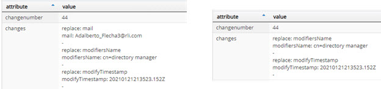

## Overview

RadiantOne supports logging at different levels for different components. Logs for the different components are configured in the Classic Control Panel > Settings > Logs section. RadiantOne access logs are configured in the Access Logs section and RadiantOne changelog is configured in the Changelog section. An introduction to these sections is below. 

To switch to Classic Control Panel from the new Control Panel, use the menu options for the logged in user in the upper right.

To download log files, use the Server Control Panel > Log Viewer tab.
To access the Server Control Panel, click the link in the upper corner of the Classic Control Panel.

## Log Settings

Log level, rollover size and number of files to keep in archive are configurable for each RadiantOne component. On the Logs > Log Settings section, select the component from the drop-down list. The default log level is INFO. The default rollover size is 100MB and the default number of log files to keep is 10.

For RadiantOne Directory, the item in the drop-down list is VDS – Server. The default log file name is vds_server.log.

For the Task Scheduler, the items in the drop-down list are Scheduler – Scheduler server and Scheduler – Scheduler Tasks. The default log file name for the server is server.log. The default log file name for the tasks is `task.<taskID>.log`. 

For the Classic Control Panel, the items in the drop-down list are Control Panel – Server and Control Panel – Access. The default log file name for the server is web.log. The default log file name for the access information is web_access.log.

For the Sync Agents used in real-time persistent cache refresh, the item in the drop-down list is Sync Agents – Agents. The default log file name is agent_fid_sd_agent_real_time.log.

### Log File Integrity Assurance

The Log file integrity assurance option adds a signature file (.sig) to the contents of the compressed log file when it is archived. This signature can then be verified for authenticity. 

**Enabling Log File Integrity Assurance**

To enable log file integrity assurance:

1. On the Classic Control Panel, navigate to the Settings tab > Logs > Log Settings.
 
1. Check the Integrity Assurance box (requires Expert Mode). 

    >[!note] This appends the server.log.file.archive value with **_sig**. This is part of the file definition but does not impact the naming of the zip file itself.

1. Click Save.

1. Restart the RadiantOne Service. For SaaS deployments, this can be done from the Environment Operations Center for the environment where you have deployed RadiantOne Identity Data Management.

**Verifying the Authenticity of the Signature**

With this signature file and a public key, you can use a third-party utility such as openSSL to verify the signature.

To verify the signature, download the server.log.file from the Server Control Panel and run the following command:

    openssl dgst -verify <path_to_publickey_file> -keyform PEM -sha512 -signature <path_to_signature_file> -binary <path_to_source_file>

If the source file is authentic, the above command returns “Verified OK”. If the source file has been tampered with, the above command returns “Verification Failure”. 

## Access Logs

The RadiantOne access log contains details about client requests to RadiantOne and the response. This is a structured log file and the contents can be used for auditing RadiantOne activity. The output is a text file named vds_server_access.log and a .csv file named vds_server_access.csv. 

The access log rolls over when it reaches 100MB in size. This size can be set in the Rollover size property. The access logs are kept for 30 days by default and then deleted. This is configurable in the “Rollover: How long to keep the logs” property.

### Log File Integrity Assurance

The Log file integrity assurance option adds a signature file (.sig) to the contents of the compressed log file when it rolls over. This signature can then be verified for authenticity. 

**Enabling Log File Integrity Assurance**

To enable log file integrity assurance:

1. On the Classic Control Panel, navigate to the Settings tab > Logs > Access Logs. 
1. Check the Integrity Assurance box (requires Expert Mode). 

  >[!note] This appends the Text Rollover Destination value with **_sig**. This is part of the file definition but does not impact the naming of the zip file itself.

1. Click Save.

1. Restart the RadiantOne Service. For SaaS deployments, this can be done from the Environment Operations Center for the environment where you have deployed RadiantOne Identity Data Management. 

**Verifying the Authenticity of the Signature**

With this signature file and a public key, you can use a third-party utility such as openSSL to verify the signature.

To verify the signature, download the server.log.file from the Server Control Panel and run the following command:

  openssl dgst -verify <path_to_publickey_file> -keyform PEM -sha512 -signature <path_to_signature_file> -binary <path_to_source_file>

If the source file is authentic, the above command returns “Verified OK”. If the source file has been tampered with, the above command returns “Verification Failure”. 

## Changelog

The changelog is one of the recommended approaches for other processes to detect changes that have happened to RadiantOne entries. The [Persistent Search control](/configuration/global-settings/client-protocols#supported-controls) is the other method that can be used.

The Changelog can be enabled from the Classic Control Panel > Settings Tab > Logs section > Changelog sub-section. If enabled, the change log stores all modifications made to any entry in the RadiantOne namespace including entries that are stored in persistent cache. The contents of the change log can be viewed below the cn=changelog suffix in the directory.This suffix is indicated in the RadiantOne rootDSE changelog attribute. The rootDSE also contains the firstchangenumber and lastchangenumber attributes. This information can be used by clients as a cursor to track changes. Access the rootDSE by querying the RadiantOne service with an empty/blank Base DN.

Each entry in the changelog is comprised of the following attributes:

-	changeNumber – number that uniquely identifies an entry
-	changes – LDIF formatted value that describes the changes made to the entry.
-	changeTime – time of the change.
-	changeType – type of change: add, modify, delete
-	entrydn – DN of the entry that changed.
-	objectClass – all entries are associated with top and changelogEntry object classes.
-	targetContextId – used internally by RadiantOne for isolation per naming context.
-	targetDN - DN of the entry that changed.
-	timestampms –used by RadiantOne internally for changelog isolation per naming context.

For more details on these operational attributes, see [Operational Attributes](/configuration/directory-stores/understanding-operational-attributes).

### Disabling Changelog for Certain Naming Contexts 

Changes to entries in certain naming contexts representing certain RadiantOne Directory stores or persistent cache, are not applicable to logging into change log (e.g. cn=replicationjournal, cn=config…etc.). Other naming contexts that represent backend directories (proxy views to these directories) might not require changelog either. Therefore, these naming contexts can have this function disabled. The list of disabled naming contexts is configured from the Changelog sub-section. Uncheck the Changelog box to disable the naming context.

>[!warning] 
>In most cases, this setting should not be touched. Only naming contexts representing RadiantOne Directory stores, persistent cache, or proxy views are shown in the list. Disabling changelog for certain naming contexts should only be done when advised by Radiant Logic.

### Automatic Backup of Changelog

Whenever the RadiantOne service starts, the changelog storage is checked to see if there are enough change numbers left for use (a total of 2 billion numbers are allocated for use). If there is less than 10% of the 2 billion numbers left, the existing records are automatically be rolled over into the corresponding backup storage and the change number will start over at number 1. 

While the RadiantOne service running, once the change log number reaches 90% capacity (90% of the allocated 2 billion numbers are used), the following warning message will appear in the RadiantOne log "!!! 90% change numbers have been used! The VDS should be restarted to prevent any possible exhaust of change number and loss of change records." When this message appears, the RadiantOne service should be restarted. If it is not restarted and the entire 2 billion allocated numbers are used, changes are no longer logged into the changelog.

### Excluded Change Log Attributes

When entries are changed, the change log reports the attributes under its "changes" attribute. This may pose a security risk if sensitive attributes have been changed, and the change log is searchable by outside applications such as sync connectors. To eliminate this risk, the Excluded Change Log Attributes option allows you to exclude selected attributes from members of the “ChangelogAllowedAttributesOnly” group. Though these attributes are logged in the change log, they are not returned for these group members when performing a search on the change log. 

To exclude attributes in changelog searches:

1.	In the New Control Panel, navigate to Manage > Directory Browser. 

2.	Expand cn=config and ou=groups. 

3.	Select cn=ChangelogAllowedAttributesOnly. 

4.	Add users and/or groups that you do not want to have access to the “changes” attribute for certain attributes.

5.	To edit the list of attributes to exclude from the changelog, use the RadiantOne REST API, set-property *changelogExcludedAttributes*. In brackets, enter attributes to be excluded in a comma-separated list. Wrap each attribute in double quotes. An example is shown below:

https://rst-rlqa-usw2-env.dev01.radiantlogic.io/adap/util?action=vdsconfig&commandname=set-property&name=changelogExcludedAttributes&value=["mail", "l", "homePhone"]

When a member of the group searches the changelog, the specified attributes are not included in the “changes” attribute. An example is shown below. 

### Changelog and Replication Journal Max Age

For the RadiantOne service to maintain efficiency and performance (as well as save disk space), you should set a maximum age for changelog entries. The maximum age parameter specifies the number of days an entry stays in storage for the following event stores.
-	cn=changelog
-	cn=cacherefreshlog
-	cn=replicationjournal

  >[!note] 
  >Maximum age also applies to the vdsSyncHist attribute maintained at the level of entries involved in inter-cluster replication. This attribute is multi-valued and continues to grow until the RadiantOne service scans the values and removes ones that are older than the maximum age. RadiantOne scans the values only when the entry is modified. For entries that aren’t updated often, vdsSyncHist will potentially contain values that are older than the maximum age.**
-	cn=localjournal
-	cn=tombstone
-	stores below cn=queue 
-	stores below cn=dlqueue

Records older than the maximum age are deleted automatically. Old change log numbers (from deleted records) do not get re-used.

This parameter is set in the Classic Control Panel > Settings Tab > Logs section > Changelog sub-section. The default value is 3 days which means records are automatically deleted after 3 days.

### Replication Journal Read Timeout

This is the number of milliseconds RadiantOne waits to receive a response from the replication journal. When the replication journal read timeout time is exceeded, RadiantOne skips the entry, and the next entry in the replication journal is searched. The next time the RadiantOne node checks the replication journal, it attempts to read the skipped entries.

This setting can be viewed and set through the RadiantOne REST API.  Use the get-property command to get the current value. Use the set-property command to update the value.

To get the value:
https://rst-rlqa-usw2-env.dev01.radiantlogic.io/adap/util?action=vdsconfig&commandname=get-property&name=replicationReadTimeoutMS

To set the value to 50ms:
https://rst-rlqa-usw2-env.dev01.radiantlogic.io/adap/util?action=vdsconfig&commandname=set-property&name=replicationReadTimeoutMS&value=50

The default is 0 (no timeout) meaning that the RadiantOne service waits forever for a response from the query to the replication journal. If the replicationReadTimeMS property is zero and there is a non-zero value for the Operation Timeout in the JNDI Pooling property (Classic Control Panel > Settings > Server Backend > Connection Pooling), RadiantOne uses the Operation Timeout value to determine how long to wait for a response when querying the replication journal. If the replicationReadTimeMS property has a non-zero value, then it overrides the Operation Timeout value.

### Persistent Cache Refresh Log Level

Activity performed against a persistent cache is logged below a branch in the RadiantOne namespace named cn=cacherefreshlog. This log is always enabled and the level can be set to all, status, or just errors. The level is set on the Classic Control Panel > Settings Tab > Logs section > Changelog sub-section, Persistent Cache Refresh Log Level parameter.

If all log level is selected, the cn=cacherefreshlog branch contains all requests (successful or not) to refresh the persistent cache. This includes information about the exact changes (what information changed). The attribute named ‘changes’ contains the attribute level changes. The format is compatible with the changelog format.

The latest IETF description of it is:

http://www.mozilla.org/directory/ietf-docs/draft-good-ldap-changelog-03.txt

The ‘changes’ attribute is actually an LDIF representation of the change as defined in:

http://ietfreport.isoc.org/rfc/rfc2849.txt

The difference between status level and all level is that all only logs entries that have **actually** changed whereas status level logs all changes coming into the persistent cache whether the actual entry has changed or not. To provide an example, say you have cached data from a materialized view in a database and are using triggers to detect changes on the database. A materialized view may be rebuilt daily, triggering many “changes” detected by the RadiantOne change capture connector. On a more simplistic level, updating an entry with the exact same value results in the connector picking up an update change. Therefore, the persistent cache connector sends a cache refresh to RadiantOne for the entry that was updated.If the cache refresh log level is set to status, this update is logged in the cn=cacherefreshlog. If the cache refresh log level is all, the existing entry in persistent cache is compared with the entry received in the message from the connector, if the entry really has changed, it is stored in the cache refresh log. If the entry did not change, then the “change” is not documented in the cacherefresh log. Because of this, the all log level generates LESS entries in the cn=cacherefreshlog, and documents which attribute actually changed, but is more time consuming because of the comparison required. 

On the Main Control Panel > Directory Browser tab, navigate to the cn=cacherefreshlog branch to view the persistent cache activity.

The information logged can be used for the following purposes:
-	To update some other RadiantOne persistent caches that contains the same information.
-	As a location where any user/application can review to see what changes were made to the persistent cache and when.
-	To monitor errors in case one of the underlying sources is down when RadiantOne attempts to get the latest image.
-	To recover from persistent cache update errors without having to reinitialize the persistent cache again. More on this topic can be found in the RadiantOne Operations Guide section titled: Recovering from Persistent Cache Update Errors.

All changes to persistent cache branches are logged in the [change log](09-logs#changelog). Therefore, the persistent cache refresh log level is typically set to error to log only entries that could not be refreshed in the cache. The other log levels are still available to support backward compatibility (when changes to the persistent cache branches were not logged into the general change log).

For more information, please see the RadiantOne Deployment and Tuning Guide, section titled: Logging Persistent Cache Refreshes.

## Clustermonitor

The [Server Control Panel > Dashboard tab](01-introduction#dashboard-tab), displays a variety of aspects related to a given RadiantOne node. The graphs display CPU usage, JVM memory usage, disk space usage, disk latency and number of client connections. To use the dashboard tab for monitoring, the cluster monitor store must be enabled. This parameter is set in the Main Control Panel > Settings Tab > Logs section > Clustermonitor sub-section. Select the enabled option and enter a max age (in hours). The default is 72 hours, meaning the statistics displayed cover the past 3 days.

### Statistics

RadiantOne logs statistics related to operations it receives. This includes average execution time, peak execution time, and whether the operation was successful. No actual data (entires/attributes) is logged, only metadata. This log is primarily for Radiant Logic support to have key information to assist with troubleshooting.

This logging is enabled by default and can be managed from the Main Control Panel > Settings Tab > Logs section > Statistics > Statistics Analyzer Settings sub-section. The log name is stats.log. This logging is enabled by default and calculates statistics during 1 minute intervals prior to saving to the stats.log.

For each RadiantOne Universal Directory store or persistent cache initialization, statistics are calculated for the total number of entries and sub-categorized by branches and object classes. The average and peak number of attributes per entry, and the average and peak size (in KB) per entry are also calculated. This information is logged into the stats.log. This logging is enabled by default and can be managed from the Main Control Panel > Settings Tab > Logs section > Statistics > Init Statistics Settings sub-section.
