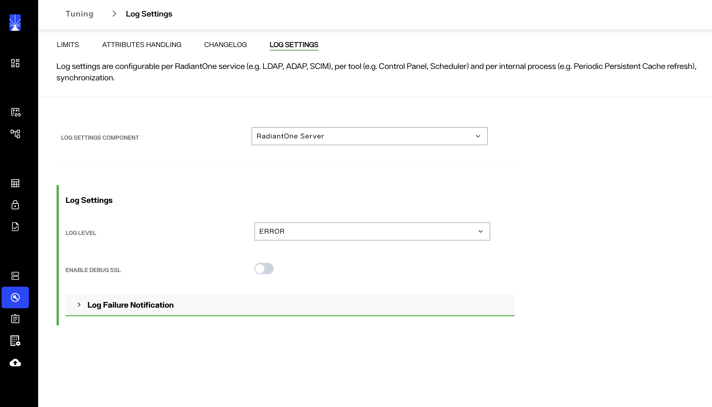
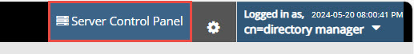
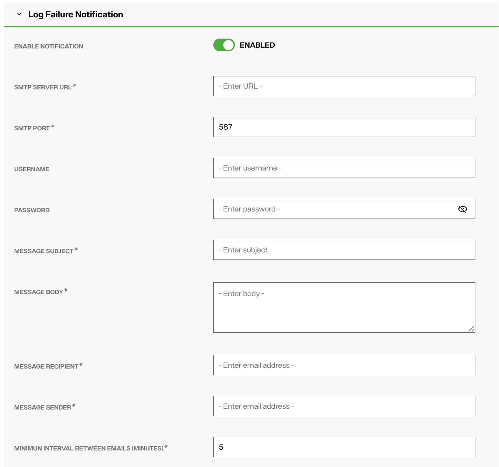
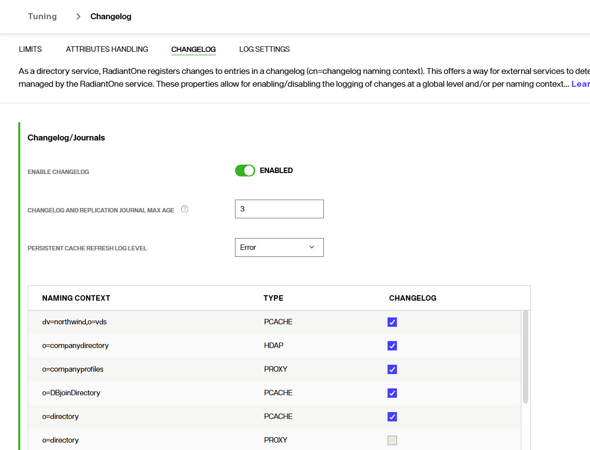
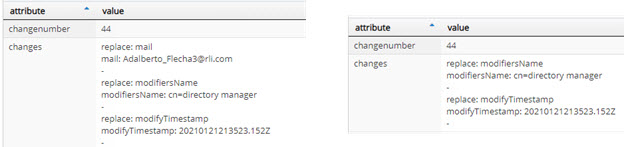

## Overview

RadiantOne supports logging at different levels for different components. Logs for the different components are configured in the Control Panel > Global Settings > Tuning > Log Settings section. RadiantOne changelog is configured in the Changelog section. 



To download log files, use the Server Control Panel > Log Viewer tab. To access the Server Control Panel, click the link in the upper corner of the Classic Control Panel.



For each log component, you can configure settings for log level as well as choose whether to enable or disable SSL debug and failure notification.


## Log Settings

The Log Settings page provides granular, component-specific control over system logging. Here are the log components available: 
The available components include:

- **RadiantOne Server Log**: Core directory server log capturing LDAP requests and responses, backend commands, and server-side errors for general troubleshooting of the RadiantOne service.  

- **RadiantOne LDAP Access**: Access/audit log that records who connects to RadiantOne via LDAP, what operations they perform, and the server’s results, typically in a detailed, reportable format.  

- **ADAP Access**: REST/ADAP access log that tracks REST calls to RadiantOne (binds, searches, CRUD operations) and related errors for the ADAP web service interface.  

- **SCIM**: SCIM log that records SCIMv2 API activity, including POST, PUT, PATCH, and DELETE operations and internal processing for SCIM client requests.  

- **Persistent Cache**: Periodic Refresh – Log for periodic refresh jobs that rebuild or update persistent cache content, showing refresh cycles, comparisons, and counts of added, changed, or removed entries.  

- **Sync Agents**: Logs for Sync Agents used in real-time persistent cache refresh that show connector/agent activity, such as capturing changes and forwarding them to RadiantOne.  

- **Sync Engine**: Sync Engine log that traces how change events are processed, transformed, and written to targets for cache refresh and synchronization flows.  

- **Control Panel Server**: Classic Control Panel server log (web.log) that captures internal web application and server activity for the admin UI.  

- **Control Panel Access**: Control Panel access log (web_access.log) that records administrator actions such as saves and configuration changes in the UI.  

- **Scheduler Server**: Task scheduler server log that shows how background tasks are scheduled, started, and managed by the scheduler service.  

- **Scheduled Tasks**: Per-task logs (task.taskID.log) that capture execution details, status, and errors for individual jobs like LDIF import/export, cache initialization, and reindexing.  

- **Custom Data Source**:  Log category for connectors built using the latest Connector SDK.

### SaaS vs. Self-Managed Log Settings

The available log configuration options differ depending on whether RadiantOne is deployed as **SaaS** or **Self-Managed**.  

Self-managed deployments include additional **advanced log management settings** such as log file rollover, archive retention, and integrity verification.

The table below shows which settings are available in each component based on the deployment type. 

| Log Component | SaaS Settings | Self-Managed Settings |
|---|---|---|
| RadiantOne Server | Log Level, Enable Debug SSL, Log Failure Notification | Log Level, Enable Debug SSL, Log Failure Notification, Rollover Size, Archive Files to Keep, Integrity Assurance |
| RadiantOne LDAP Access | Ignore Access Logs for Naming Contexts | Ignore Access Logs for Naming Contexts, Rollover Size, Archive Files to Keep, Integrity Assurance |
| ADAP Access | Log Level | Log Level, Rollover Size, Archive Files to Keep, Integrity Assurance |
| SCIM | Log Level | Log Level, Rollover Size, Archive Files to Keep, Integrity Assurance |
| Persistent Cache Periodic Refresh | Log Level | Log Level, Rollover Size, Archive Files to Keep, Integrity Assurance |
| Sync Agents | Log Level | Log Level, Rollover Size, Archive Files to Keep, Integrity Assurance |
| Sync Engine | Log Level | Log Level |
| Control Panel Server | Log Level | Log Level, Rollover Size, Archive Files to Keep, Integrity Assurance |
| Control Panel Access | Log Level | Log Level, Rollover Size, Archive Files to Keep, Integrity Assurance |
| Scheduler Server | Log Level | Log Level, Rollover Size, Archive Files to Keep, Integrity Assurance |
| Scheduled Tasks | Log Level | Log Level, Rollover Size, Archive Files to Keep, Integrity Assurance |
| Custom Data Source | Data Source, Log Level | Data Source, Log Level, Rollover Size, Archive Files to Keep, Integrity Assurance |

See the sections below to learn more about log settings. 

### Log levels

Multiple log levels are available for each component to control the detail level and type of information written to the logs. The available log levels are Off, Fatal, Error, Warn, Info, Debug, and Trace. Keep in mind that not all components include every log level option. Although default options are preselected, you can configure the log levels depending on your needs.

* **Off**: Disables logging entirely for the server. No log entries are generated.

* **Fatal**: Logs critical events that prevent the RadiantOne service from functioning correctly or responding to requests. For example, a condition where a single client consumes all available threads, preventing the service from responding to other clients.

* **Error**: Logs error conditions encountered by RadiantOne, such as database connection failures and other runtime errors.

* **Warn**: Logs warning conditions that may affect operation but do not stop processing, such as a client disconnecting before a response is sent. Warning logs also include error and fatal messages.

* **Info**: Logs standard operational activity, including all access to RadiantOne, actions performed by the service, and their results. This level includes warning, error, and fatal messages and is typically used for normal operation.

* **Debug**: Logs detailed diagnostic information about internal processing and actions taken by RadiantOne. This level is intended for troubleshooting and should be used temporarily.

* **Trace**: Logs highly granular diagnostic information intended for intensive troubleshooting. This level is primarily used by the Radiant Logic development team and is not recommended for customer use.


### Enable Debug SSL
​
The RadiantOne Server component provides an Enable Debug SSL option. This option is intended for troubleshooting SSL/TLS-related issues. 

### Log Failure Notification

Using this option, you can configure how Radiant Logic notifies you when Radiant One Server log related failures occur.




To enable this feature, follow these steps:

1. Turn on the Enable Notifications feature.
2. Enter the SMTP Server URL.
3. Enter the SMTP port.
4. Enter the username to connect to the SMTP server.
5. Enter the password associated with the username entered in step 4. Used to connect to the SMTP server.
6. Enter the subject of the email message in the Message Subject property.
7. Enter the body of the email message in the Message Body property.
8. Enter the email address to send the alert to, in the Message Recipient property.
9. Enter the email address from which the alert should be sent, in the Message Sender property.
10. Enter a number of minutes to indicate how long to wait before sending a subsequent alert email, in the Minimum Interval Between Emails.
11. Click Save.

### Log File Integrity Assurance

The Log file integrity assurance option adds a signature file (.sig) to the contents of the compressed log file when it is archived. This signature can then be verified for authenticity.

To enable log file integrity assurance, follow these steps:

1. Check the Integrity Assurance box.

> This appends the server.log.file.archive value with _sig. This is part of the file definition but does not impact the naming of the zip file itself.

2. Click Save.

3. Restart the RadiantOne Service. For SaaS deployments, this can be done from the Environment Operations Center for the environment where you have deployed RadiantOne Identity Data Management.

#### Verifying the Authenticity of the Signature

With this signature file and a public key, you can use a third-party utility such as openSSL to verify the signature.

To verify the signature, download the server.log.file from the Server Control Panel and run the following command:

```
openssl dgst -verify <path_to_publickey_file> -keyform PEM -sha512 -signature <path_to_signature_file> -binary <path_to_source_file>
If the source file is authentic, the above command returns “Verified OK”. If the source file has been tampered with, the above command returns “Verification Failure”.
```

### Production Tuning and Log Management Guidelines

Proper log management is essential for maintaining consistent performance and predictable storage usage in production environments. Use the following guidelines to estimate log growth, retention, and storage requirements before deployment.

**Log Configuration Considerations**

<u>Log level</u>: Determine the log level required for production. A minimal log level suitable for auditing is recommended to reduce storage consumption and system overhead.

<u>Log growth rate</u>: Estimate how quickly log files will grow based on expected transaction volume and system activity. Use a QA or staging environment with simulated production load to collect growth metrics and predict log rollover frequency.

<u>Archived file count</u>: Configure the number of rolled-over log files to retain. This setting directly affects how large the log archive can grow. Larger values provide a longer log history for troubleshooting but increase disk space usage.

<u>Log retention period</u>: By default, rolled-over log files are retained indefinitely. Define a retention period that aligns with your organization’s compliance and operational requirements.

<u>Log file formats</u>: If both the text and CSV log formats are enabled, each `vds_server_access` log entry is written twice—once in text format and once in CSV—effectively doubling the number of generated log files. Plan storage and rollover settings accordingly.

**Validation and Sizing**

Perform all log tuning and sizing tests in a QA environment with load conditions representative of production usage. This ensures that log rotation, retention, and performance characteristics are validated before deployment.

By balancing log level, growth rate, archive count, retention period, and output format, you can achieve efficient and sustainable log management for production operation.

## Changelog

The changelog is one of the recommended approaches for other processes to detect changes that have happened to RadiantOne entries. The [Persistent Search control](/configuration/global-settings/client-protocols#supported-controls) is the other method that can be used.

The Changelog settings can be enabled from the Control Panel > Global Settings > Tuning > CHANGELOG tab. If enabled, the changelog stores all modifications made to any entry in the RadiantOne namespace including entries that are stored in persistent cache. The contents of the changelog can be viewed below the cn=changelog suffix in the directory. This suffix is indicated in the RadiantOne rootDSE changelog attribute. The rootDSE also contains the firstchangenumber and lastchangenumber attributes. This information can be used by clients as a cursor to track changes. Access the rootDSE by querying the RadiantOne service with an empty/blank Base DN.



Each entry in the changelog is comprised of the following attributes:

-	changeNumber – number that uniquely identifies an entry
-	changes – LDIF formatted value that describes the changes made to the entry.
-	changeTime – time of the change.
-	changeType – type of change: add, modify, delete
-	entrydn – DN of the entry that changed.
-	objectClass – all entries are associated with top and changelogEntry object classes.
-	targetContextId – used internally by RadiantOne for isolation per naming context.
-	targetDN - DN of the entry that changed.
-	timestampms –used by RadiantOne internally for changelog isolation per naming context.

For more details on these operational attributes, see [Operational Attributes](/configuration/directory-stores/understanding-operational-attributes).

### Disabling Changelog for Certain Naming Contexts 

Changes to entries in certain naming contexts representing certain RadiantOne Directory stores or persistent cache, are not applicable to logging into change log (e.g. cn=replicationjournal, cn=config…etc.). Other naming contexts that represent backend directories (proxy views to these directories) might not require changelog either. Therefore, these naming contexts can have this function disabled. The list of disabled naming contexts is configured from the table shown at the bottom of the CHANGELOG tab. Uncheck the Changelog box to disable the naming context.

>[!warning] 
>In most cases, this setting should not be touched. Only naming contexts representing RadiantOne Directory stores, persistent cache, or proxy views are shown in the list. Disabling changelog for certain naming contexts should only be done when advised by Radiant Logic.

### Excluded Change Log Attributes

When entries are changed, the change log reports the attributes under its "changes" attribute. This may pose a security risk if sensitive attributes have been changed, and the change log is searchable by outside applications such as sync connectors. To eliminate this risk, the Excluded Change Log Attributes option allows you to exclude selected attributes from members of the “ChangelogAllowedAttributesOnly” group. Though these attributes are logged in the change log, they are not returned for these group members when performing a search on the change log. 

To exclude attributes in changelog searches:

1.	In the Control Panel, navigate to Manage > Directory Browser. 

2.	Expand cn=config and ou=groups. 

3.	Select cn=ChangelogAllowedAttributesOnly. 

4.	Add users and/or groups that you do not want to have access to the “changes” attribute for certain attributes.

5.	To edit the list of attributes to exclude from the changelog, use the RadiantOne REST API, set-property *changelogExcludedAttributes*. In brackets, enter attributes to be excluded in a comma-separated list. Wrap each attribute in double quotes. An example is shown below:

```
https://rst-rlqa-usw2-env.dev01.radiantlogic.io/adap/util?action=vdsconfig&commandname=set-property&name=changelogExcludedAttributes&value=["mail", "l", "homePhone"]
```

When a member of the group searches the changelog, the specified attributes are not included in the “changes” attribute. An example is shown below. 



### Changelog and Replication Journal Max Age

For the RadiantOne service to maintain efficiency and performance (as well as save disk space), you should set a maximum age for changelog entries. The "Changelog and Replication Journal Max Age" property can be set in Control Panel > Global Settings > Tuning > CHANGELOG tab and specifies the number of days an entry stays in storage for the following event stores. The default value is 3 days which means records are automatically deleted after 3 days.

-	cn=changelog
-	cn=cacherefreshlog
-	cn=replicationjournal

  >[!note] 
  >Maximum age also applies to the vdsSyncHist attribute maintained at the level of entries involved in inter-cluster replication. This attribute is multi-valued and continues to grow until the RadiantOne service scans the values and removes ones that are older than the maximum age. RadiantOne scans the values only when the entry is modified. For entries that aren’t updated often, vdsSyncHist will potentially contain values that are older than the maximum age.
-	cn=localjournal
-	cn=tombstone
-	stores below cn=queue 
-	stores below cn=dlqueue

Records older than the maximum age are deleted automatically. Old change log numbers (from deleted records) do not get re-used.

### Replication Journal Read Timeout

This is the number of milliseconds RadiantOne waits to receive a response from the replication journal. When the replication journal read timeout time is exceeded, RadiantOne skips the entry, and the next entry in the replication journal is searched. The next time the RadiantOne node checks the replication journal, it attempts to read the skipped entries.

This setting can be viewed and set through the RadiantOne REST API.  Use the get-property command to get the current value. Use the set-property command to update the value.

To get the value (update the hostname for your environment):
```
https://rst-rlqa-usw2-env.dev01.radiantlogic.io/adap/util?action=vdsconfig&commandname=get-property&name=replicationReadTimeoutMS
```

To set the value to 50ms (update the hostname for your environment):
```
https://rst-rlqa-usw2-env.dev01.radiantlogic.io/adap/util?action=vdsconfig&commandname=set-property&name=replicationReadTimeoutMS&value=50
```

The default is 0 (no timeout) meaning that the RadiantOne service waits forever for a response from the query to the replication journal. If the replicationReadTimeMS property is zero and there is a non-zero value for the Operation Timeout in the JNDI Pooling property (Classic Control Panel > Settings > Server Backend > Connection Pooling), RadiantOne uses the Operation Timeout value to determine how long to wait for a response when querying the replication journal. If the replicationReadTimeMS property has a non-zero value, then it overrides the Operation Timeout value.

### Persistent Cache Refresh Log Level

Activity performed against a persistent cache is logged below a branch in the RadiantOne namespace named cn=cacherefreshlog. This log is always enabled and the level can be set to all, status, or just errors. The level is set on the Control Panel > Global Settings > Tuning > CHANGELOG tab, "Persistent Cache Refresh Log Level" property.

If *all* log level is selected, the cn=cacherefreshlog branch contains all requests (successful or not) to refresh the persistent cache. This includes information about the exact changes (what information changed). The attribute named ‘changes’ contains the attribute level changes. The format is compatible with the changelog format.

The latest IETF description of it is:

http://www.mozilla.org/directory/ietf-docs/draft-good-ldap-changelog-03.txt

The ‘changes’ attribute is actually an LDIF representation of the change as defined in:

http://ietfreport.isoc.org/rfc/rfc2849.txt

The difference between *status* level and *all* level is that all only logs entries that have actually changed whereas status level logs all changes coming into the persistent cache whether the actual entry has changed or not. To provide an example, say you have cached data from a materialized view in a database and are using triggers to detect changes on the database. A materialized view may be rebuilt daily, triggering many “changes” detected by the RadiantOne change capture connector. On a more simplistic level, updating an entry with the exact same value results in the connector picking up an update change. Therefore, the persistent cache connector sends a cache refresh to RadiantOne for the entry that was updated. If the cache refresh log level is set to *status*, this update is logged in the cn=cacherefreshlog. If the cache refresh log level is *all*, the existing entry in persistent cache is compared with the entry received in the message from the connector, if the entry really has changed, it is stored in the cache refresh log. If the entry did not change, then the “change” is not documented in the cacherefresh log. Because of this, the *all* log level generates LESS entries in the cn=cacherefreshlog, and documents which attribute actually changed, but is more time consuming because of the comparison required. 

On the new Control Panel > Manage > Directory Browser, navigate to the cn=cacherefreshlog branch to view the persistent cache activity.

The information logged can be used for the following purposes:
-	To update some other RadiantOne persistent caches that contains the same information.
-	As a location where any user/application can review to see what changes were made to the persistent cache and when.
-	To monitor errors in case one of the underlying sources is down when RadiantOne attempts to get the latest image.

All changes to persistent cache branches are logged in the cn=changelog. Therefore, the persistent cache refresh log level is typically set to error to log only entries that could not be refreshed in the cache. The other log levels are still available to support backward compatibility (when changes to the persistent cache branches were not logged into the general change log).


## RadiantOne Directory Store Statistics

RadiantOne logs statistics related to operations it receives. This includes average execution time, peak execution time, and whether the operation was successful. No actual data (entires/attributes) is logged, only metadata. This log is primarily for Radiant Logic support to have key information to assist with troubleshooting.

This logging is enabled by default and can be managed from the Classic Control Panel > Settings Tab > Logs section > Statistics > Statistics Analyzer Settings sub-section. The log name is stats.log and statistics are calculated in one minute intervals.

For each RadiantOne Directory store or persistent cache initialization, statistics are calculated for the total number of entries and sub-categorized by branches and object classes. The average and peak number of attributes per entry, and the average and peak size (in KB) per entry are also calculated. This information is logged into the stats.log. 
