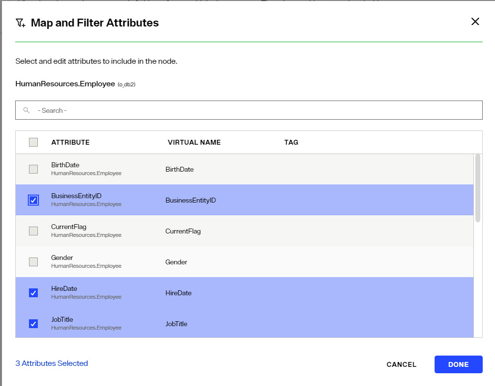
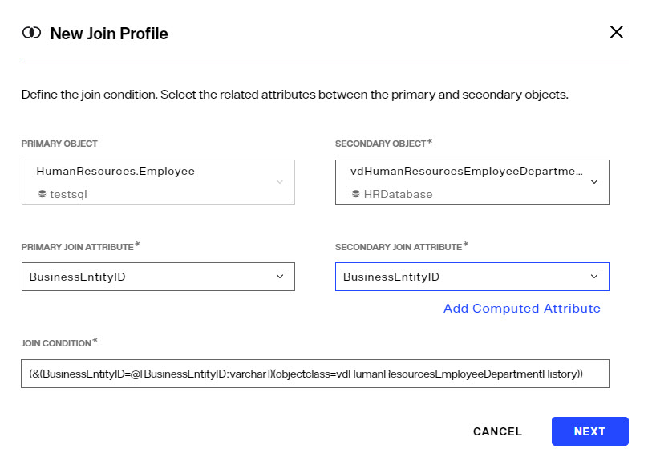
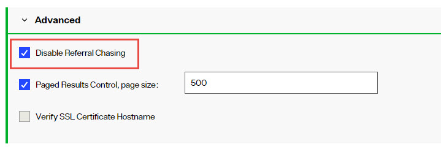
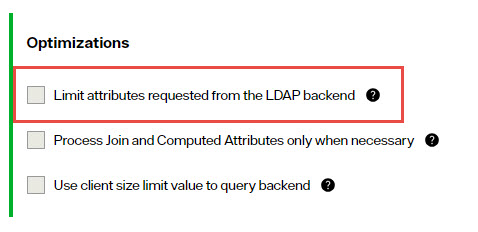
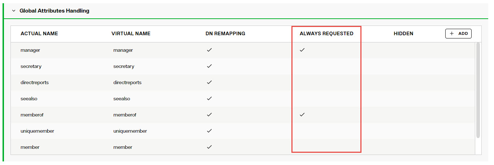
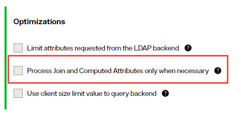
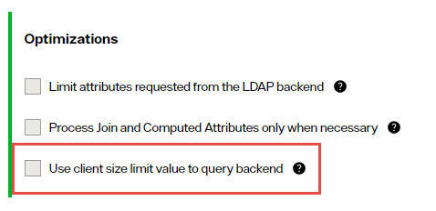

## Overview

Depending on the data source type that an identity view is built from, different optimization settings are available. 

## Views from Database Backends

Database backends are any source accessed via JDBC or ODBC. This includes Oracle, SQL Server, and IBM DB2 among others.

For certain configurations/use cases, there are different parameters that may be enabled to improve processing/performance. They are located on the Control Panel > Setup > Directory Namespace > Namespace Design. Navigate below the Root Naming Context section and select the node representing your database backend. On the right side, select the ADVANCED SETTINGS tab. Each optimization is described below.

>[!note] 
>Some optimization settings are only configurable in the Classic Control Panel and this is noted in the respective section.

### Case Sensitivity for Searches

There are three options available for handling case sensitive databases. These options are related to how the RadiantOne service generates the query to send to the database. In the Control Panel > Setup > Directory Namespace > Namespace Design, select the container/content node in an identity view below Root Naming Contexts and on the right side, select the ADVANCED SETTINGS tab. 

1.	As Is

	If your database is not case sensitive, then you should choose the As Is option. With this option, the RadiantOne service forwards the search filter to the backend in the exact case it was received in the request from the client. This is the default option.

	If your database is case sensitive and you choose this option, the case received in the filter from the client search request must match the case used in the database or else the entry will not be found.
	For example, if a database attribute named FIRSTNAME had a value of Nancy, and the RadiantOne service received a search request with a filter of (firstname=nancy), the entry would not be returned. The client must use a filter of (firstname=Nancy) in order for the entry to be properly returned from the database.

2.	Ignore Case

	If your database is case sensitive and you are not sure how the values are stored (mixed case, all upper, all lower…etc.), then you should choose the Ignore Case option. With this option, the RadiantOne service generates the SQL query so that both the filter that was received in the client request and the values from the backend are converted into uppercase before the search filter can be validated. For example, if a client sent a request with a filter of (firstname=Nancy), the RadiantOne service would generate the following where clause based on the filter received in the client request.

	WHERE (UPPER(APP.EMPLOYEES.FIRSTNAME)=UPPER('Nancy'))
	The case used in the filter from the client is irrelevant and everything is converted into uppercase.
	This option offers the least performance, so it should only be used when absolutely required. If the database is case sensitive and the values are stored in uppercase, you should use the Translate Values to Uppercase option (see #3 below) as it is more efficient.

3.	Translate Values to Uppercase

	If your database is case sensitive and you know the values are stored in uppercase, you should choose the Translate Values to Uppercase option. With this option, the RadiantOne service translates the search filter value into uppercase before sending it to the backend database. This option is more efficient than the Ignore Case option mentioned above.

### Modify the Exposed Attributes

To improve the performance of the view, you should only expose the required attributes. The default behavior of the RadiantOne service is to request all attributes from the underlying source (no matter what specific attributes a client may have requested). Having unnecessary attributes in the output can slow down the performance of the query (because it makes the query string much longer). In the Control Panel > Setup > Directory Namespace > Namespace Design, select the container/content node in the identity view below Root Naming Contexts and on the right side, select the OBJECT BUILDER tab. Click  and select only the attributes that are required for the identity view.


 
### Index Attributes Used in Joins

If joins are configured, verify that all attributes conditioning the join are indexed in the underlying sources. In the example shown below, the join is based on BusinessEntityID in the source matching BusinessEntityID in the target. This means BusinessEntityID should be indexed in the source and BusinessEntityID should be indexed in the target.
 


### Removing UPPER

Since some databases are case sensitive, RadiantOne transforms primary key attribute values to upper case when generating the where clause. This is only applicable when the database key is a character data type. “UPPER” is generated automatically for the following databases: Oracle, SQL Server, Sybase, Interbase, and DB2. If you do not want UPPER to be used (because your database is NOT case sensitive), you can navigate to ADVANCED SETTINGS tab > Configuration Paramters and click **EDIT**. Select the BASE PARMETERS tab and edit the Base Search and Update parameters accordingly.

The Base Search parameter allows you to remove UPPER (that is generated by default) for base searches. If your database is not case sensitive, then the UPPER can be removed. If your database is case sensitive, then you must make sure that the attribute that is indexed (and is used in the base parameter) uses the UPPER case. Otherwise, performance of the identity view (during a base search) is unpredictable.

>[!warning] 
>Using the UPPER can slow down performance because the indexes in the database may not be used. IF your database has an index on an attribute and it stores the value in upper case, then you have the option of removing the UPPER generated on the left side of the parameter (it is the UPPER on the left that is most costly in terms of performance).

Below is an example of the Base Search filter that is generated for a database. If the database is case sensitive and the CN attribute is indexed (and the index stores the value in upper case), then the UPPER generated on the left side of the “=” can be removed and performance is improved (also remove the leading and ending parentheses).

The following example:

```
(UPPER(SCOTT.PEOPLE.CN)=UPPER(@@[cn : VARCHAR2(60)]))
```

Would become:

```
(SCOTT.PEOPLE.CN=UPPER(@@[cn : VARCHAR2(60)]))
```

If you are not able to remove the UPPER then you should consider using cache at the level of RadiantOne in order to improve performance. RadiantOne queries the database the first time (the UPPER is used), the results are cached and future queries receive the information from cache.

The Update parameter allows you to remove UPPER (that is generated by default) for updates to the database. The UPPER is generated when the primary key of the database object is a character data type. The UPPER is used to generate the where clause based on the primary key to locate the entry to update. If your database is not case sensitive, then you can remove the UPPER that is generated in the update parameter and the performance of the query is improved.

### Request Attributes Only When Necessary

Requesting BLOB attributes can significantly decrease performance. When this option is enabled, RadiantOne requests binary/BLOB attributes from the backend only if they are specifically requested by the client. 

Use caution when enabling this parameter if an interception script is defined (which may need such attributes even if they are not requested by the client).

### Process Joins and Computed Attributes Only When Necessary

The default behavior of RadiantOne is to process associated joins and build computed attributes whenever an object in an identity view is reached from a query regardless of whether the attributes requested come from a secondary source or computation.

If you enable this option, RadiantOne does not perform joins or computations if a client requests or searches for attributes from a primary object only. If a client requests or searches for attributes from secondary objects or computed attributes, then RadiantOne processes the join(s) and computations accordingly. 

Use caution when enabling this option if you have interception scripts defined on these objects, or access controls based on filters are being used (both of which may require other attributes returned from secondary sources or computations regardless of whether or not the client requested or searched for them). 


### Connection Pooling

Connection pooling improves performance because a connection to the underlying source does not need to be created every time data needs to be retrieved.

Connection pooling for database sources is automatically enabled by default and the settings can be modified in the Classic Control Panel > Settings tab > Server Backend section, under the Connection Pooling sub section (requires Expert Mode).

To switch to Classic Control Panel, use the menu options for the logged in user in the upper right.


To switch Classic Control Panel into Expert Mode, click the "Logged in as:" and choose *Expert Mode*.


The Connection Pool settings are described below.

*Pool Size*

The maximum number of connections that are held in the pool for each JDBC data source. The default is 20.

*Idle Timeout*

This is the maximum number of minutes to keep an idle connection in the pool. The default is 15. Setting this value to “0” means the opened connection stays in the pool forever.

*Prepared Statement Cache*

RadiantOne uses parameterized SQL statements and maintains a cache of the most used SQL prepared statements. The default is 50. This improves performance by reducing the number of times the database SQL engine parses and prepares SQL. 

This setting is per database connection.

>[!warning] 
>Use caution when changing this default value as not all databases have the same limits on the number of 'active' prepared statements allowed.

## Views from LDAP Backends

LDAP backends are any source accessed via LDAP. This includes Sun Java Directory, IBM Directory Server, and Active Directory among others.

For certain configurations/use cases, there are different parameters that may be enabled to improve processing/performance. They are located on the Control Panel > Setup > Directory Namespace > Namespace Design. Navigate below the Root Naming Context section and select the node representing your LDAP backend. On the right side, select the ADVANCED SETTINGS tab. Each optimization is described below.

>[!note] 
>Some optimization settings are only configurable in the Classic Control Panel and this is noted in the respective section.

### Disable Referral Chasing

Disabling referral chasing is configured at the level of the LDAP data source in Control Panel > Setup > Data Catalog > Data Sources > [SelectedLDAPDataSource] > Advanced section.


 
Chasing referrals can affect the overall performance because if the referral server is not responding (or responding slowly) the RadiantOne service could take a long time to respond to the client. For example, in the case of querying an underlying Active Directory (with a base DN starting at the root of Active Directory) you may get entries like the following returned:

```
ldaps://ForestDnsZones.na.radiantlogic.com:636…
ldaps://DomainDnsZones.na.radiantlogic.com:636…
```

If the RadiantOne service attempts to “chase” these referrals, this can result in an extreme degradation in response times. Therefore, it is recommended that referral chasing is disabled, especially if you need to connect to Active Directory starting at the root of the tree.

### Excluded Attributes for Active Directory Backends

This parameter is for Active Directory backends. It excludes specific attributes from being returned from the backend. Certain “system” attributes (e.g. dscorepropagationdata) returned from Active Directory (even for non-admin users) can cause problems for building persistent cache because the data type is not handled properly, and these attributes need to be added to the RadiantOne schema for the local storage to handle them in the cache. Also, these attributes cause problems for the change capture connector needed for real-time persistent cache refresh to work properly. Attributes that are not required by client applications, should be added to this list to ensure they are not returned in the view from Active Directory. By default, the AD attributes that are excluded are ds*, acs*, ms* and frs* (* is a wildcard meaning that any attributes with those prefixes are excluded). Any attributes that you do not want returned from the backend Active Directory can be added to the Attributes excluded from search results (support for Active Directory) list which is found on the Classic Control Panel > Settings tab > Server Front End section > Attributes Handling sub-section. Make sure a space separates the attributes listed.

To switch to Classic Control Panel, use the menu options for the logged in user in the upper right.


### Index Attributes Used in Joins

If joins are configured, verify that all attributes conditioning the join are indexed in the underlying sources.

 
### Limit Attributes Requested from the LDAP Backend

The *Limit Attributes Requested from the LDAP Backend* option is located in Control Panel > Setup > Directory Namespace > Namespace Design > [SelectedIdentityView] > ADVANCED SETTINGS tab > Optimizations section.

Whenever the RadiantOne service queries a backend LDAP directory, the default behavior is to ask for all attributes (although ONLY the attributes requested in the query are returned to the client). This default behavior is for the following reasons:

-	Joins have been configured and the filter in the search request involves attributes from both the primary and secondary sources (i.e. the query filter contains conditions on both primary and secondary objects). 

-	Interception scripts that involve logic based on attributes from the backend. These attributes may not be specifically requested or searched for by the client. However, the RadiantOne service must retrieve them from the backend in order for the script logic to be valid.

-	ACL checking. You can setup ACLs on attribute/values of an entry (i.e. mystatus=hidden), so the RadiantOne service may need the whole entry to check the authorization.

-	For entry caching. The entire entry needs to be in the entry cache.

If your identity view does not require any of the conditions mentioned above, you can enable the *Limit Attributes Requested from the LDAP Backend* option for better performance.



If this option is enabled, the RadiantOne service queries the backend server only for attributes requested from the client in addition to attributes set as 'Always Requested' on the ADVANCED SETTINGS Tab >  Global Attributes Handling section.



### Process Joins and Computed Attributes Only When Necessary

The *Process Joins and Computed Attributes Only When Necessary* option is located in Control Panel > Setup > Directory Namespace > Namespace Design > [SelectedIdentityView] > ADVANCED SETTINGS tab > Optimizations section.

The default behavior of the RadiantOne service is to process associated joins and build computed attributes whenever a entry in the namespace is reached from a query regardless of whether the attributes requested come from a secondary source or computation.

If you enable the *Process Joins and Computed Attributes Only When Necessary* option, the RadiantOne service does not perform joins or computations when a client requests or searches for attributes from a primary object only. If a client requests or searches for attributes from secondary objects or computed attributes, then the RadiantOne service processes the join(s) and computations accordingly. 



Use caution when enabling this option if you have interception scripts defined on these objects, or access controls based on filters are being used (both of which may require other attributes returned from secondary sources or computations regardless of whether or not the client requested or searched for them). 


### Use Client Size Limit Value to Query Backend 

The *Use Client Size Limit Value to Query Backend* option is located in Control Panel > Setup > Directory Namespace > Namespace Design > [SelectedIdentityView] > ADVANCED SETTINGS tab > Optimizations section.

Whenever the RadiantOne service queries a backend LDAP directory, the default behavior is to ask for all entries (sizelimit=0) even if the client indicates a size limit. 

This default behavior is because the entries returned by the backend are possible candidates, but may not be retained for the final result that is sent to the client. For example, if an ACL has been defined in RadiantOne, not all entries from the backend may be authorized for the user (connected to the RadiantOne service) to access. Other cases are when joins or interception scripts are involved with the virtual view, these may also alter the entries that match the client’s search.

To limit the number of entries from the backend, using paging is the recommended approach. If the backend supports paging, the RadiantOne service will not get all the results at once, only one page at a time (page size indicated in the configuration). In this case, if RadiantOne has returned to the client the size limit required, it will not go to the next page.

If your identity view does not require any of the conditions mentioned above (joins, interceptions, ACL), and using paging between the RadiantOne service and the backend is not possible, you can enable the *Use Client Size Limit Value to Query Backend* option to limit the number of entries requested from the backend. If this option is enabled, the RadiantOne service uses the size limit specified by the client instead of using sizelimit=0 when querying the backend.




### Use Client Time Limit Value to Query Backend

Whenever RadiantOne FID queries a backend LDAP, the default behavior is to request no time limit (timelimit=0) even if the client indicates a time limit.

If you want RadiantOne FID to utilize the time limit value it receives from the client request when it queries the backend directory, set enableLdapServerTimeLimit = true; in ZooKeeper.

1.	From the Main Control Panel, switch to [expert mode](00-preface#expert-mode) and then go to the Zookeeper tab.

2.	On the Zookeeper tab, navigate to `radiantone/<version>/<clusterName>/config/vds_server.conf`.

3.	Click **Edit Mode**.

4.	Search for "enableLdapServerTimeLimit" : false, and change false to true.

5.	Click **Save**.

If enableLdapServerTimeLimit is set to true, RadiantOne FID uses the time limit specified by the client instead of using timelimit=0 when querying the backend.

### Max Requested Attributes

If more than 30 attributes are configured to be returned for a container or content node (indicated on the Final Output Object on the canvas on the OBJECT BUILDER tab), RadiantOne optimizes the query by requesting * instead of requesting each attribute explicitly. If your identity view is required to include operational attributes (computed by the backend server when requested), and you have more than 30 attributes declared in the view definition, the default behavior to translate the query to use * can cause problems resulting in the operational attributes not being returned from the backend server because they are not explicitly requested. You can adjust the maximum number of attributes to determine the usage of the * translation in the Max Requested Attributes property. If this property is set to zero, all attributes specified in the Final Output Object on the canvas on the OBJECT BUILDER tab are requested.

### Connection Pooling

JNDI connection pooling to a backend LDAP source is enabled by default.

To change the maximum connections to maintain in the pool, the idle timeout, or connection timeout, go to the Classic Control Panel > Settings tab > Server Backend section, under the Connection Pooling sub section (requires Expert Mode).

To switch to Classic Control Panel, use the menu options for the logged in user in the upper right.


To switch Classic Control Panel into Expert Mode, click the "Logged in as:" and choose *Expert Mode*.


The Connection Pool settings are described below.

*Pool Size*

Default is 1000. This is the maximum number of concurrent connections by RadiantOne to each LDAP source. For example, if you have four LDAP sources and your maximum connections value is set to 200, then you could have up to a total of 800 LDAP connections maintained by RadiantOne.

*Timeout*

Default is 7. This is the maximum number of seconds the RadiantOne service waits while trying to establish a connection to the backend LDAP server. There are two attempts to create a connection (7 seconds per attempt).

*Operation Timeout*

Default is 0 (no timeout). This is the maximum number of seconds the RadiantOne service waits to receive a response from to the backend LDAP server. After this time, RadiantOne drops the request and tries to send the request again. After two failed attempts to get a response back, the RadiantOne service returns an error to the client.

*Write Operation Timeout*

The default is 0 (no timeout). This is the maximum number of seconds the RadiantOne service waits to receive a response from to the backend LDAP server for write operations and bind operations. After this time, RadiantOne drops the request and attempts to send the request again. After two failed attempts to get a response back, the RadiantOne service returns an error to the client.

*Idle Timeout*

Default is 5. This is the maximum number of minutes to keep an idle connection in the pool. Setting this value to “0” means the opened connection stays in the pool forever.

## Views from Custom Backends

If the identity data sources you plan on integrating with RadiantOne are anything other than LDAP directories or Active Directories, the recommended approach is to first create a basic identity view that has no specific attribute mappings, computed attributes, joins...etc. and then configure the identity view with persistent cache and the desired refresh strategy. This is the process to stage the backend data in persistent cache. Most custom backends only support a periodic persistent cache refresh type. Then, as a second step, create an identity view using the cache image as the data source. This identity view is where you would configure the attribute mappings, computed attributes, joins...etc. This data staging and virtual view layering methodology is essential for custom backend data source (e.g. Azure AD, Okta, Salesforce...etc.) that are not as performant as directories for search queries and even works well for RDBMS data sources.
