## Overview

Persistent cache is the cache image stored on disk. With persistent cache, the RadiantOne service can offer a guaranteed level of performance because the underlying data source(s) do not need to be queried and once the server starts, the cache is ready without having to “prime” with an initial set of queries. Also, you do not need to worry about how quickly the underlying data source can respond. What is unique about the persistent cache is if the RadiantOne service receives an update for information that is stored in the cache, the underlying data source(s) receives the update, and the persistent cache is refreshed automatically. In addition, you have the option of configuring real-time cache refreshes which automatically update the persistent cache image when data changes directly on the backend sources. For more details, please see [Refreshing the Persistent Cache](#options-for-refreshing-the-persistent-cache).

>[!warning] 
>If you plan on caching the branch in the tree that maps to an LDAP backend, you must list the operational attributes you want to be in the cache as “always requested”. Otherwise, the entry stored in cache would not have these attributes and clients accessing these entries may need them.

Initialization of a persistent cache happens in two phases. The first phase is to create an LDIF formatted file of the cache contents (if you already have an LDIF file, you have the option to use this existing file as opposed to generating a new one). The second phase is to initialize the cache with the LDIF file. After the first phase, RadiantOne prepares the LDIF file to initialize the cache. 

Persistent cache is configured from the Root Naming Context where the identity view is mounted. If the Root Naming Context contains many sub-branches/containers, you can choose to cache some of them and not others. A summary of configured branches is shown on the CACHE tab for the selected naming context.


## Options for Refreshing the Persistent Cache

There are three categories of events that can invoke a persistent cache refresh. They are:

-	When changes occur through RadiantOne.

-	When changes occur outside of RadiantOne (directly on the backend source).

-	Scheduling a periodic refresh of the persistent cache.

Each is described below.

### Changes Occurring Through RadiantOne

If RadiantOne receives an update for an entry that is stored in a persistent cache, the following operations occur:

-	The entry in persistent cache is “locked” pending the update to the underlying source(s).

-	The underlying source(s) receives the update from RadiantOne.

-	Upon successful update of the underlying source(s), RadiantOne updates the entry in the persistent cache.

-	The modified entry is available in the persistent cache.

### Real Time Cache Refresh Based on Changes Occurring Directly on the Backend Source(s)

When a change happens in the underlying source, connectors capture the change and send it to update the persistent cache. The connectors are managed by agents built into RadiantOne and changes flow through a message queue for guaranteed message delivery. The real-time refresh process is outlined below. 

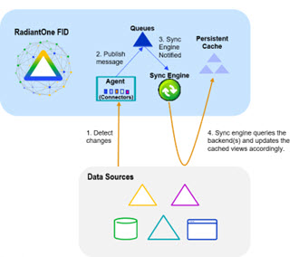
 
Persistent Cache Refresh Agents are started automatically once a persistent cache with real-time refresh is configured. Agents can run on any type of RadiantOne cluster node (follower or leaders) and there is only one agent running at any given time in a RadiantOne cluster. The agent doesn't consume a lot of memory, and they are not CPU-intensive, so there is no point in running multiple processes to distribute connectors on multiple nodes. One agent is enough per cluster and makes things simpler.

This type of refresh is described as “Real-time” in the Control Panel > Setup > Directory Namespace > Namespace Design. Select the Root Naming Context that contains the identity view/container to cache and click the CACHE tab.

**Periodic Refresh**

In certain cases, if you know the data in the backends does not change frequently (e.g. once a day), you may not care about refreshing the persistent cache immediately when a change is detected in the underlying data source. In this case, a periodic refresh can be used.

During each refresh interval, the periodic persistent cache refresh is performed based on the following high-level steps:

1.	RadiantOne generates an LDIF formatted file from the virtual view (bypassing the cache).

>[!warning] 
>If a backend data source is unreachable, RadiantOne attempts to re-connect one more time after waiting 5 seconds. The number of retries is dictated by the *maxPeriodicRefreshRetryCount* property.

2.	(Optional) If a [validation threshold](#add-validation-threshold) is defined, RadiantOne determines if the threshold defined has been exceeded. If it has, the persistent cache is not refreshed during this cycle.

4.	RadiantOne compares the LDIF file generated in step 1 to the current cache image and applies changes to the cache immediately as it goes through the comparison.

The periodic persistent cache refresh activity is logged into periodiccache.log. This file can be viewed and downloaded from Server Control Panel > Log Viewer. 

To switch to Classic Control Panel, use the menu options for the logged in user in the upper right.


Once logged into the Classic Control Panel, click the Server Control Panel link in the upper right.


Go to the Log Viewer tab and select the log file from the drop-down list.

The rebuild process can be very taxing on your backends, and each time a new image is built you are putting stress on the data sources. This type of cache refresh deployment works well when the data doesn’t change too frequently and the volume of data is relatively small.

**Real-Time Refresh**

If you plan on automatically refreshing the persistent cache as changes happen on the backend data sources, this would be the recommended cache configuration option. This type of caching option leverages the RadiantOne Directory to store the cache image and change-capture connectors to detect events in the identity sources.

If you choose a real-time refresh strategy, there are two terms you need to become familiar with:

- Cache Dependency – cache dependencies are all objects/views related to the view that is configured for persistent cache. A cache dependency is used by the cache refresh process to understand all the different objects/views that need to be updated based on changes to the backend sources.

- Cache Refresh Topology – a cache refresh topology is a graphical representation of the flow of data needed to refresh the cache. The topology includes an object/icon that represents the source (the backend object where changes are detected from), the queue (the temporary storage of the message), and the cache destination. Cache refresh topologies can be seen from the Classic Control Panel > PCache Monitoring tab. To switch to Classic Control Panel, use the menu options for the logged in user in the upper right.


Cache dependencies and the refresh topology are generated automatically during the cache configuration process.


## Configuring Persistent Cache with Real-Time Refresh

To configure persistent cache with real-time refresh:

1.	From the Control Panel, go to Setup > Directory Namespace > Namespace Design.

2.	Select the root naming context that contains the identity view that requires cache.

3.	On the right side, click the **CACHE** tab.
4.	Click **+CREATE NEW CACHE**.
5.	Browse to the branch in the RadiantOne namespace that you would like to store in persistent cache and click **CREATE**.

>[!warning] 
>For proxy views of LDAP backends, you must select the root level to start the cache from. Caching only a sub-container of a proxy view is not supported.

6. The configuration process begins. Once it completes, the manage cache refresh configuration displays.

7. On the Refresh Settings tab, select the Real-time refresh option. A table appears displaying the connectors related to the data sources that comprise the identity view.

>[!warning] 
>If your virtual view is joined with other virtual views, the secondary views are also cached. 

8. Configure any needed connectors shown in the table. See the section titled [Configuring Source Connectors](./cache-capture-connectors) for steps.

9. Click **NEXT**.

10. On the Initialize step, click **INITIALIZE** to initialize the persistent cache.

There are two options for initializing a persistent cache. Each is described below.

*Create an LDIF File*

If this is the first time you’ve initialized the persistent cache, choose this option. An LDIF formatted file is generated from the virtual view and then imported into the cache.

*Using an Existing LDIF*

If you’ve initialized the persistent cache before and the LDIF file was created successfully from the backend source(s) (and the data from the backend(s) has not changed since the generation of the LDIF file), then you can choose this option to use that existing file. The persisting of the cache occurs in two phases. The first phase generates an LDIF file with the data returned from the queries to the underlying data source(s). The second phase imports the LDIF file into the local RadiantOne Directory store. If there is a failure during the second phase, and you must re-initialize the persistent cache, you have the option to choose the LDIF file (that was already built during the first phase) instead of having to re-generate it (as long as the LDIF file generated successfully). You can click browse and navigate to the LDIF file. 
11. Click **DONE**. The cache initialization process begins. The cache initialization is performed as a task and can be viewed and managed from the Manage > Tasks section. 

12. Once the cache is initialized, click **NEXT** where you can manage properties.

The view(s) is now in the persistent cache. Queries are handled locally by RadiantOne and are no longer sent to the backend data source(s). Real-time cache refresh has been configured. For information about properties associated with persistent cache, please see [Persistent Cache Properties](#managing-cache-properties).


## Configuring Persistent Cache with Periodic Refresh

Review the section on [periodically refreshing the cache](#options-for-refreshing-the-persistent-cache) to ensure the persistent cache is updated to match your needs. If you plan on refreshing the cache image periodically on a defined schedule, this would be the appropriate cache configuration option. 

To configure persistent cache with periodic refresh:

1.	From the Control Panel, go to Setup > Directory Namespace > Namespace Design.

2.	Select the root naming context that contains the identity view that requires cache.

3.	On the right side, click the **CACHE** tab.
4.	Click **+CREATE NEW CACHE**.
5.	Browse to the branch in the RadiantOne namespace that you would like to store in persistent cache and click **CREATE**.

>[!warning] 
>For proxy views of LDAP backends, you must select the root level to start the cache from. Caching only a sub-container of a proxy view is not supported.

6. The configuration process begins. Once it completes, the manage cache refresh configuration displays.

7. Select the *Periodic Refresh* option. 

8.	Use the **FREEFORM** option to manually enter the CRON expression to define the refresh interval. Or, use the **ASSIST MODE** for help in generating the CRON expression.

7.	(Optional) Define a [Delete Validation Threshold](#delete-validation-threshold).

8.	(Optional) Define an [Add Validation Threshold](#add-validation-threshold).

9.	Click **NEXT**.

10.	Click **INITIALIZE** to start the initialization process.

There are two options for initializing the persistent cache: Creating a new LDIF file or initializing from an existing LDIF file. Each is described below.

*Create an LDIF from a Snapshot*

If this is the first time you’ve initialized the persistent cache, then you should choose this option. An LDIF formatted file is generated from the virtual view and then imported into the local RadiantOne Directory store.

*Initialize from an Existing LDIF File*

If you’ve initialized the persistent cache before and the LDIF file was created successfully from the backend source(s) (and the data from the backend(s) has not changed since the generation of the LDIF file), then you can choose to use that existing file. The persisting of the cache occurs in two phases. The first phase generates an LDIF file with the data returned from the queries to the underlying data source(s). The second phase imports the LDIF file into the local RadiantOne Directory. If there is a failure during the second phase, and you must re-initialize the persistent cache, you have the option to choose the LDIF file (that was already built during the first phase) instead of having to re-generate it (as long as the LDIF file generated successfully). You can click browse and select the LDIF file. 

After you choose to either generate or re-use an LDIF file, click **DONE** and cache initialization begins. Cache initialization is launched as a task and can be viewed from Manage > Tasks.

After the persistent cache is initialized, queries are handled locally by the RadiantOne service and no longer be sent to the backend data source(s). For information about properties associated with persistent cache, please see [Persistent Cache Properties](#managing-cache-properties).

### Periodic Refresh CRON Expression

If periodic refresh is enabled, you must define the refresh interval in this property. For example, if you want the persistent cache refreshed every day at 12:00 PM, the CRON expression is: 
0 0 12 1/1 * ?

Click **ASSIST MODE** if you need help defining the CRON expression.

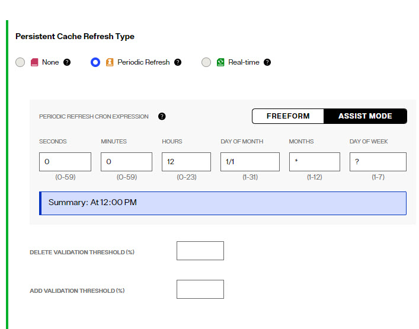


### Delete Validation Threshold

For details on how the periodic persistent cache refresh process works, see [Periodic Refresh](#options-for-refreshing-the-persistent-cache).

You can define a threshold to validate the generated LDIF file/image prior to RadiantOne executing the cache refresh process. The threshold is a percentage of the total entries.

To define a granular threshold for delete operations, indicate the percentage in the Delete Validation Threshold. For example, if Delete Validation Threshold contains a value of 50, it means if the generated LDIF image contains at least 50% fewer entries than the current cache image, the periodic persistent cache refresh is aborted for the current refresh cycle.

If a validation threshold is configured, the threshold is checked.

### Add Validation Threshold

For details on how the periodic persistent cache refresh process works, see [Periodic Refresh](#options-for-refreshing-the-persistent-cache).

You can define a threshold to validate the generated LDIF file/image prior to RadiantOne executing the cache refresh process. The threshold is a percentage of the total entries.

To define a granular threshold for add operations, indicate the percentage in the Add Validation Threshold. For example, if Add Validation Threshold contains a value of 50, it means if the generated LDIF image contains 50% more entries than the current cache image, the periodic persistent cache refresh is aborted for the current refresh cycle.

## Managing Cache

Persistent cache should be initialized during off-peak hours, or during scheduled downtime, since it is a CPU-intensive process and during the initialization queries are delegated to the backend data sources which might not be able to handle the load.

When initializing persistent cache, two settings you should take into consideration are paging and initializing cache from an encrypted file. These options are described in this section.

>[!warning] 
>If you are using real-time refresh, make sure the cache refresh components are stopped before re-initializing or re-indexing a persistent cache.

### Using Paging for Cache Initialization

Depending on the complexity of the identity view, building the persistent cache image can take some time. Since the internal connections used by RadiantOne to build the persistent cache image are subject to the Idle Connection Timeout server setting, the cache initialization process might fail due to the connection being automatically closed by the server. To avoid cache initialization problems, it is recommended to use paging for internal connections. The Paged Results Control is enabled by default.

To use paging:

1.	Open the Classic Control Panel.
2.	In the logged in as user menu (upper right), select Expert Mode.
3.	Navigate to > Settings tab > Server Backend > Internal Connections.
4.	On the right, check the option for Paged Results Control, page size: 1000.
5.	Click **SAVE**.

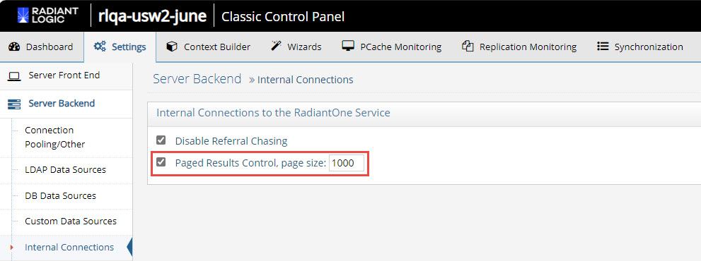

### Supporting Zipped and Encrypted LDIF Files During Cache Initialization

If you are initializing persistent cache using an existing LDIFZ file, the security key used in RadiantOne (for attribute encryption) where the file was exported must be the same security key value used on the RadiantOne server that you are trying to import the file into.

If you are creating a new LDIF file to initialize the persistent cache, you have the option to use an LDIFZ file which is a zipped and encrypted file format. This ensures that the data to be cached is not stored in clear in files required for the initialization process.

To use this option, you must have an LDIFZ encryption key configured. The security key is defined from the Control Panel > Manage > Security > Attribute Encryption.

Once the security key has been defined, check the option to "Use .ldifz" (zipped and secure format).

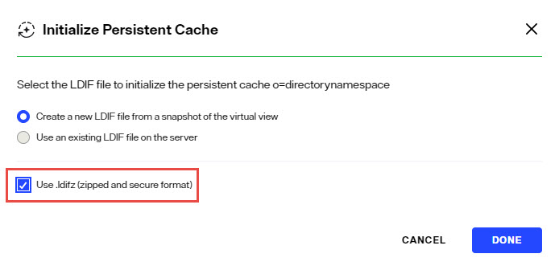

### Backing up (Exporting) Persistent Cache

To backup a persistent cache:
1. Go to the Control Panel > Setup > Directory Namespace > Namespace Design.
2. Select the cached root naming context and click the *Cache* tab.
3. Click `...` inline with the cached branch and choose EDIT.
4. Click Export.
5. Enter a file name, check the *Export for Replication* option to include the uuid as part of the entry and click **Download File** to save a copy to your desired backup location.


### Enable/Disable Cache

**Disable**

1. From the Control Panel > Setup > Directory Namespace > Namespace Design, select the root naming context that contains the cached branch.
2. Select the **CACHE** tab.
3. Click ... inline with the cache node and choose **Deactivate Cache**.

**Enable**

1. From the Control Panel > Setup > Directory Namespace > Namespace Design, select the root naming context that contains the cached branch.
2. Select the **CACHE** tab.
3. Click ... inline with the cache node and choose **Activate Cache**.

### Delete Cache

1. From the Control Panel > Setup > Directory Namespace > Namespace Design, select the root naming context that contains the cached branch.
2. Select the **CACHE** tab.
3. Click ... inline with the cache node and choose Edit.
4. In the Manage Properties section, click **Delete**.

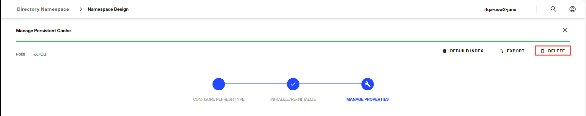

### Rebuild Index
Re-indexing a persistent cache is an operation that should not be needed frequently. Re-indexation is a time-consuming process and should only be done while the service is offline during a scheduled maintenance window. The store is inaccessible, and no other operations can be performed during the re-indexation. During the re-indexing, the persistent cache image is unable to service client requests. Therefore, RadiantOne bypasses the cache image and queries the backend(s) directly to service client requests.

If the Indexed Attributes or Sorted Indexes properties are changed, or if support for full text search is enabled, the persistent cache must be re-indexed. 

**Disable Inter-cluster Replication**
If the persistent cache is involved in inter-cluster replication, temporarily disable the replication prior to rebuilding the index.1.
1. From the Control Panel > Setup > Directory Namespace > Directory Namespace, select the cached root naming context.
2. Click the **CACHE** tab.
3. Click `...` inline with the cached branch and choose EDIT.
4. In the *Manage Properties* section, expand **REPLICATION**
5. Uncheck *Inter Cluster Replication* and click **SAVE**.

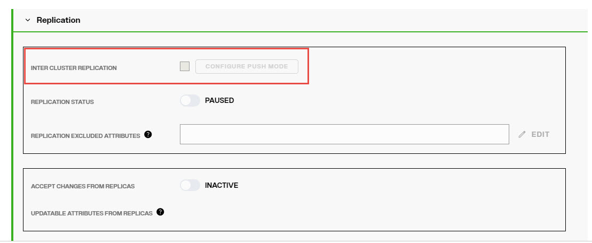

**Rebuild Index**

1. From the Control Panel > Setup > Directory Namespace > Namespace Design, select the root naming context that contains the cached branch.
2. Select the **CACHE** tab.
3. Click ... inline with the cache node and choose Edit.
4. In the Manage Properties section, click **Rebuild Index**.

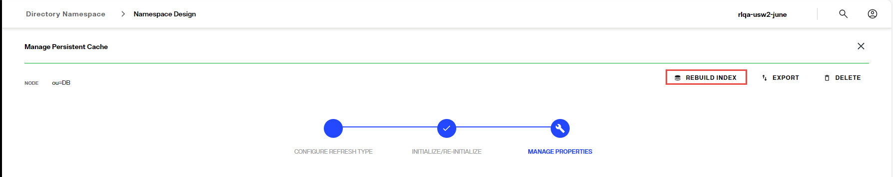

**Enable Inter Cluster Replication**

1. From the Control Panel > Setup > Directory Namespace > Directory Namespace, select the cached root naming context.
2. Click the **CACHE** tab.
3. Click `...` inline with the cached branch and choose EDIT.
4. In the *Manage Properties* section, expand **REPLICATION**
5. Check *Inter Cluster Replication* to enable it and click **SAVE**.

### Export

1. From the Control Panel > Setup > Directory Namespace > Namespace Design, select the root naming context that contains the cached branch.
2. Select the **CACHE** tab.
3. Click ... inline with the cache node and choose Edit.
4. In the Manage Properties section, click **Export**.

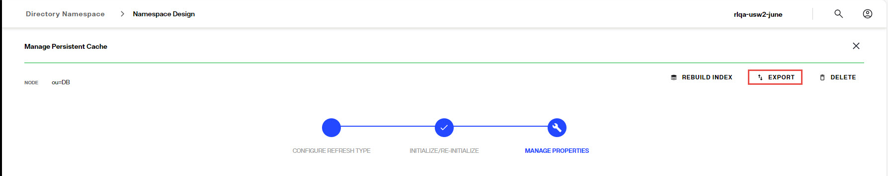

## Managing Cache Properties

1. From the Control Panel > Setup > Directory Namespace > Namespace Design, select the root naming context that contains the cached branch.
2. Select the **CACHE** tab.
3. Click ... inline with the cache node and choose Edit.
4. Click the Manage Properties section. This section is activated after the cache refresh type has been selected and the cache has been intialized.

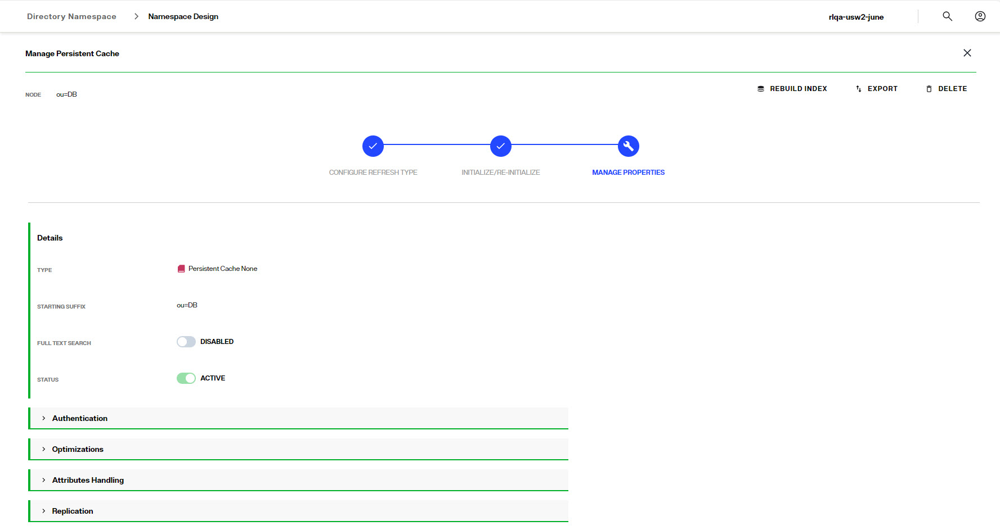

### Full-text Search

Persistent cache branches can support full text searches. This offers additional flexibility for clients as they can search data in the RadiantOne namespace based on text (character) data. These types of searches are no longer linked to specific attributes as the characters requested could be found in any attribute value. An entry is returned if any attribute in the entry contains the character string(s) requested by the client.

Clients issue full text searches similar to the way they issue LDAP searches. The only difference is the filter contains `(fulltext=<value>)` where `<value>` would be the text they are interested in. As an example, if a client was interested in the text John Doe as an exact phrase, the search filter sent to RadiantOne would be (fulltext= “John Doe”) where the phrase is encapsulated in double quotes. If the phrase in the filter is not encapsulated in double quotes it means the client wants any entries that have attribute values that contain the character string John OR Doe. 

The part of the filter that contains the piece related to the full text search can also be combined with other “standard” LDAP operators. As an example, a filter could be something like (&(uid=sjones)(fulltext=”John Doe”)). This would return entries that contain a uid attribute with the value sjones AND any other attribute that contains the exact character string John Doe.

If you want the persistent cache to support full text searches, toggle the Full-Text Search option on and click **SAVE**. If you add the support for full text searches, click **Rebuild Index**.

### Authentication

In the Manage Properties section, expand the *Authentication* section.

**Use Cache for Authentication**

The default behavior of the RadiantOne service for processing bind requests for users located in a persistent cache branch is to delegate the credentials checking to the authoritative backend source. If the password in the backend is encrypted using one of the algorithms supported by RadiantOne, and the passwords are stored in the cache, you can configure the service to authenticate the user locally against the password in cache instead of delegating the credentials checking to the backend. To enable this behavior, toggle the *Use Cache for Authentication* option on. This option is not applicable in scenarios where the passwords are not stored in the persistent cache.

By default, if the *Use Cache for Authentication* option is enabled and the entry in persistent cache has a password, RadiantOne checks the password against the local value and the user is authenticated or not based on this comparison. If the entry in persistent cache doesn’t have a password, RadiantOne delegates the credentials checking to the backend data source. There are two options to override this default behavior: Local Bind Only or Delegate on Failure. 

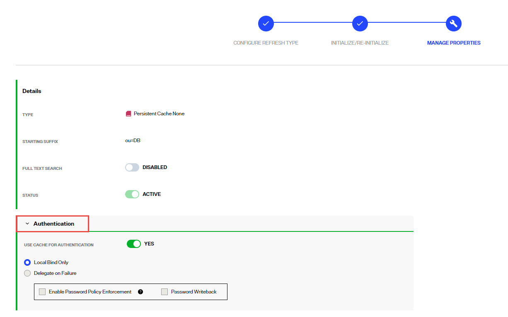

Each option is described in more details below.

**Local Bind Only**

-	Local Bind Only – If this option is enabled and the user entry in cache either has no password or the bind fails, RadiantOne does not delegate the credentials checking to the backend. It determines if the user authentication fails based on the local comparison.

If *Local Bind Only* is selected, there are two additional configuration options shown: Enable Password Policy Enforcement and Password Writeback.

*Enable Password Policy Enforcement*

Enable Password Policy Enforcement - If you are storing user passwords in cache and you are using the cache for authentication, you can also choose to have RadiantOne enforce password policies (as opposed to delegating password checking to the backend directory and having it enforce password policies). Enable this option and then define the password policy to enforce in Classic Control Panel > Settings > Security > Password Policies. 

*Password Writeback*

When you enable the password policy enforcement on a persistent cache, the userPassword attribute is automatically added to the Extension Attribute property and you have the option to enable Password Write Back. If Password Write Back is enabled, and a modify request for the password is sent to RadiantOne, it tries to update the password in the backend. In some circumstances, having two levels of password policies can result in inconsistencies between the cache image and the underlying backend(s). These circumstances are outlined in the table below.

Password Change Event | Password Writeback Enabled?	| Expected Behavior
-|-|-
Password update via a Modify Request sent to RadiantOne	| No | The password is updated in the persistent cache if it complies with the persistent cache password policy. Otherwise the password update fails. <br> <br> The password update is not sent to the backend. If the update to the persistent cache succeeds, the password in the persistent cache will be different than the one in the backend.
Password update via a Modify Request sent to RadiantOne	| Yes | The password update is sent to the backend. If the password update fails in the backend, the password in the persistent cache is not updated. If the password update succeeds in the backend, the password is updated in the persistent cache. 
Password is updated directly in the backend (outside of RadiantOne) | N/A | Through the persistent cache refresh process, the password is updated in the persistent cache. If the account was locked in the persistent cache due to a password policy enforced at the cache layer, it will be unlocked by the cache refresh process after a successful password update in the backend. Password strength defined in the persistent cache password policy is not enforced since the password change originated from the backend.


**Delegate on Failure**

-	Delegate on Failure – If this option is enabled and the user entry in cache has a password but the local checking fails, RadiantOne delegates the credentials checking to the backend. If the credentials checking fails against the backend, an unsuccessful bind response is returned to the client. If the credentials checking succeeds against the backend, a successful bind response is returned to the client.


### Optimizations

In the Manage Properties section, expand the Optimizations section.

**Optimize Linked Attributes**

Linked attributes are attributes that allow relationships between objects. A typical example would be isMemberOf/uniqueMember for user/groups objects. A group has members (uniqueMember attribute) which is the forward link relationship. Those members have an isMemberOf attribute which is the back link (to the group entry) relationship. Other examples of linked attributes are:

```
manager/directReports
altRecipient/altRecipientBL
dLMemRejectPerms/dLMemRejectPermsBL
dLMemSubmitPerms/dLMemSubmitPermsBL
msExchArchiveDatabaseLink/msExchArchiveDatabaseLinkBL
msExchDelegateListLink/msExchDelegateListBL
publicDelegates/publicDelegatesBL
owner/ownerBL
```

The most common back link/forward link relationship is between group and user objects. A list of groups a user is a member of can be calculated automatically by RadiantOne and returned in the membership attribute of the user entry. The most common back link attributes are in the drop-down list. However, you can manually enter any attribute name you want. This is configured on the Control Panel > Setup > Directory Namespace > Namespace Design. Select the root naming context and click the **SPECIAL ATTRIBUTES** tab.

If the Target Base DN (back link attribute location) and the Source Base DN (forward link attribute location) in the Linked Attributes setting is a persistent cached branch, the computation of the references can be optimized in order to return client requests for the back link attribute at high speed. To enable this optimization, follow the steps below.

>[!warning] 
>If your linked attributes are for users and groups (both branches located in persistent cache), and you enable the Optimize Linked Attributes setting, and must support nested groups, only one user location per persistent cache store is supported. For example, in the Linked Attributes setting, having a Target Base DN location configured for ou=people1,dc=myhdap and ou=people2,dc=myhdap (both in the same dc=myhdap persistent cache store) is not supported. In this case, you should configure a single user location as dc=myhdap as a shared parent for both containers.

It is assumed you have configured and initialized your persistent cache, and configured the Linked Attributes in Special Attributes Handling. If you have not, please do so prior to continuing with the steps below.

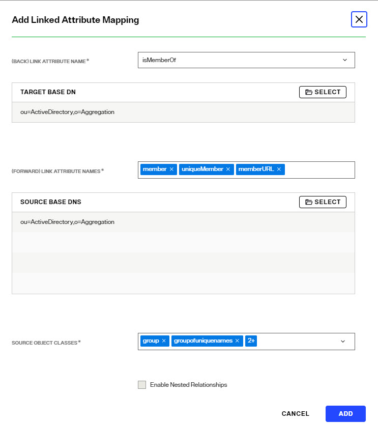

1. Expand the Optimization section and toggle on the option to *Optimize Linked Attributes*. The defined linked attribute is added to the Extension Attributes List for the persistent cache.

2. Click **SAVE**. 

3. Either rebuild the index, or reinitialize the persistent cache. Click **Re-build Index** in the Manage Properties section, or **Re-initialize** from the 
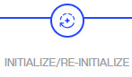 section. The back link attribute is always returned to clients even when not requested unless Hide Operational Attributes is enabled in RadiantOne (in which case it is only returned when a client explicitly requests it). 

>[!warning] 
>If a persistent cache has optimizations associated with it, deactivating it will interfere with queries associated with the linked attributes and they will not return properly. If you no longer need a cache, delete it instead of deactivating it.

**Enable Changelog**

When Optimize Linked Attributes is enabled, the Enable Changelog option is available. Check this option if you want the RadiantOne service to publish changes to the back link attribute into the cn=changelog. By default, the RadiantOne service doesn’t publish changes to operational back link attributes like isMemberOf into the cn=changelog.

This option should only be enabled if downstream applications are leveraging the changelog to detect changes in the RadiantOne service and need access to entries that have had their back link attribute (e.g. memberOf, isMemberOf) updated by RadiantOne. If this option is not enabled, and the back link attribute is the only change on an entry, it is not published into cn=changelog.

The most common linked objects are groups and users. Use caution when enabling this option because modifications that add or update dynamic (memberURL attribute) or static group members can result in changing memberOf/isMemberOf for many users, causing many time-consuming writes into the changelog. Also, all RadiantOne changelog connectors (e.g. Global Sync connectors and/or persistent cache refresh connectors), and downstream applications leveraging the changelog for capturing changes, will have to process many potentially irrelevant changes. Enabling this option forces the RadiantOne service to update the linked entries (e.g. groups and users) asynchronously, allowing the client that issued the group modification request to get a response immediately after the group membership is updated without waiting for the backlink attribute in all related objects to be updated. This can avoid a modification timeout getting returned to the client that issued the modify request, but can result in transactional integrity because all related objects haven’t necessarily been updated when the modify response is returned. For example, if a client application queries a user entry to get isMemberOf during this period (could be as much as a few seconds), there is a risk that they receive outdated information because the backlink attribute hasn’t been updated yet. Also, the asynchronous processing results in higher CPU usage on the RadiantOne node while it is processing the modifications on objects containing the forward link and back link attributes, which could trigger monitoring alerts if configured thresholds are reached.

**Async Indexing**

When Optimize Linked Attributes is enabled, the Aysnc Indexing option is available to be used in conjunction with the Enable Changelog option, or on its own. 

Enabling this option forces the RadiantOne service to update the linked entries (most commonly, groups and users) asynchronously, allowing the client that issued the group modification request to get a response immediately after the group membership (object containing the forward link attribute) is updated without waiting for the back link attribute in all related objects to be updated. This can avoid a modification timeout getting returned to the client that issued the modify request, but can result in transactional integrity because all related objects haven’t necessarily been updated when the modify response is returned. For example, if a client application queries a user entry to get isMemberOf during this period (could be as much as a few seconds), there is a risk that they receive outdated information because the back link attribute hasn’t been updated yet. Also, the asynchronous processing results in higher CPU usage on the RadiantOne node while it is processing the modifications on objects containing the forward link and back link attributes, which could trigger monitoring alerts if configured thresholds are reached. 

If async indexing is not used, all objects containing either a forward link or back link attribute are updated before the modify response is returned to the client. If the modification request results in many objects getting updated, this can be time-consuming and the client may receive a timeout error.

>[!note] 
>For persistent cached branches, you should only consider enabling this option if client applications issue modification requests to the RadiantOne service for the cached branch. If the data is only modified directly on the backend, and this is the event that triggers the persistent cache refresh, async indexing is irrelevant and not used.

### Attributes Handling

In the Manage Properties section, expand the Attributes Handling section.

**Non-indexed Attributes**

If possible, add attributes that must be modified frequently (e.g. pwdLastLogonTime) to the non-indexed attributes list to improve update performance. Attributes that don’t need to be used in searches are good candidates for the non-indexed attribute list. Limit the number of configured non-indexed attributes to further improve update performance.

The userPassword, description and pwdLastLogonTime attributes are in the non-indexed list by default along with some other operational attributes.

**Sorted Attributes**

This is a comma-separated list of attributes to be used in association with Virtual List Views (VLV) or sort control configured for RadiantOne. These sorted indexes are managed internally in the persistent cache and kept optimized for sorting. They are required if you need to sort the search result or to execute a VLV query on the persistent cache branch.

If you need to support VLV, the VLV/Sort control must be enabled in RadiantOne. 

If you change the sorted attributes, you must re-build the index. 

**Encrypted Attributes**

Attribute encryption protects sensitive data while it is stored in RadiantOne. You can specify that certain attributes of an entry are stored in an encrypted format. This prevents data from being readable while stored in persistent cache, backup files, and exported LDIF files. Attribute values are encrypted before they are stored in persistent cache, and decrypted before being returned to the client, as long as the client is authorized to read the attribute (based on ACLs defined in RadiantOne), is connected to the RadiantOne service via SSL, and not a member of the special group containing members not allowed to get these attributes (e.g. cn=ClearAttributesOnly,cn=globalgroups,cn=config). 

>[!warning] 
>Define a security encryption key from the Control Panel > Manage > Security > Attribute Encryption prior to configuring encrypted attributes. 

Enter an attribue name to store encrypted in the Encrypted Attributes property (press "Enter" after entering the attribute name). Attributes listed in the Encrypted Attributes property are added to the Non-indexed attribute list by default. This means these attributes are not searchable by default. Indexing encrypted attributes is generally not advised as the index itself is less secure than the attribute stored in the persistent cache. However, if you must be able to search on the encrypted attribute value, it must be indexed. Only “exact match/equality” index is supported for encrypted attributes. To make an encrypted attribute searchable, remove the attribute from the list of nonindexed attributes and then click **Re-build Index**.


**Extension Attributes**

Extension Attributes are new attributes (meaning these attributes don’t exist anywhere yet) that are associated with a cached virtual entry. This is primarily used to accommodate the storage of application-specific attributes that you want to store locally as opposed to the backend(s) you are virtualizing. Extension attributes should be used as an alternative to Extended Joins in scenarios where the virtual view is stored in persistent cache and then needs replicated out to RadiantOne Directory stores in other clusters.

Extension attributes are stored locally and RadiantOne handles the lifecycle of these attributes accordingly. Once a persistent cache is defined, list the attribute names (press "Enter" after entering the attribute name) in the Extension Attributes property. The attribute names must be unique and not overlap with attributes coming from and being cached from existing backends. The example below has an extension attribute named lastLogin. Applications can write to this attribute and RadiantOne handles the write locally without delegating anything to the backend. 

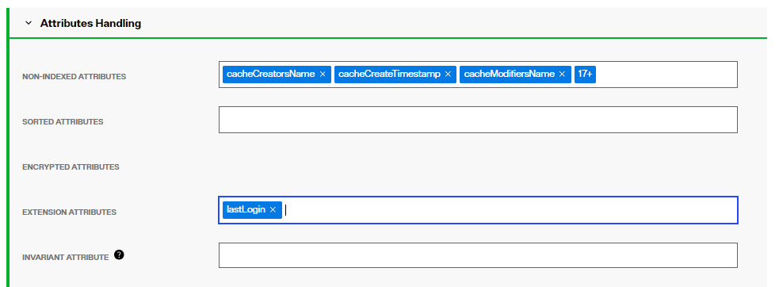

For consistency of the RadiantOne LDAP schema, define the extension attributes as part of the schema, generally associated with an auxiliary object class. For details, see: [Directory Schema](../configuration/directory-stores/managing-directory-schema)

Extension Attributes are replicated to other clusters in deployment scenarios where inter-cluster replication is enabled and a replica of a persistent cache is maintained as a RadiantOne Directory store in the target cluster(s).

When using extension attributes for cached virtual views of LDAP directory backends, you must configure invariant attribute(s). See the following section for more details.

**Invariant Attribute**

To guarantee extension attributes are linked to their respective underlying entries and moved properly should modRDN/modDN events occur in the backend source, an invariant attribute must be defined. The invariant attribute is the unique identifier in the backend directory. Below are some invariant attributes used in common LDAP directories.

-	objectGUID (Active Directory)

-	entryUUID (Oracle Unified Directory, OpenDJ, unboundID) 

-	nsUniqueID (Sun/ODSEE)

-	ibm-entryUUID (IBM)

-	UUID (RadiantOne Universal Directory)

For the example shown below, the persistent cached view is from an Active Directory backend. RadiantOne manages the lifecycle of the attribute named lastLogin and this attribute is stored directly in the cache. The invariant attribute is set to objectGUID which is the unique identifier for the users in the backend Active Directory. If the entry in the backend is moved, the invariant attribute ensures RadiantOne handles the move of the associated cached extension attributes properly.

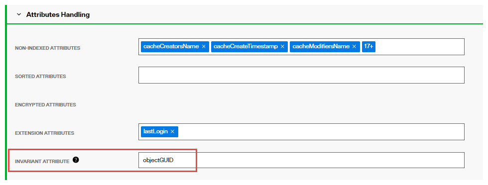

### Other Persistent Cache Attributes

**Persistent Cache Universally Unique Identifier (UUID)**

The Universally Unique Identifier (UUID) attribute is a reserved, internal attribute that is assigned to each entry and can guarantee uniqueness across space and time.

When adding entries into a persistent cache (LDAP ADD operations) from an LDIF file, if there are UUID attributes they are ignored by RadiantOne during import. RadiantOne generates a unique value for each entry based on the specifications in RFC 4122. 

When initializing with an LDIF file (LDIF INIT), if the entry has a UUID attribute, RadiantOne keeps it. If the entry does not have a UUID attribute, RadiantOne generates a unique value for each entry based on the specifications in RFC 4122.

UUID is an operational attribute meaning that if a client wants this attribute, they must explicitly ask for it in the search request sent to RadiantOne.

When exporting a persistent cache store to an LDIF file, you have the option to export the UUID attribute or not. The UUID attribute should be exported into LDIF if you plan on using this export to initialize a RadiantOne Directory store, a replica for inter-cluster replication. Otherwise, the UUID attribute generally should not be exported. To export a persistent cache store and include the UUID attributes, check the Export for Replication option in the export window.

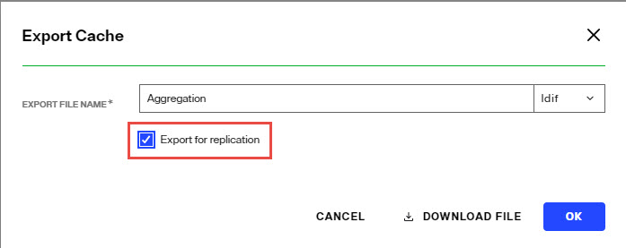

### Replication

In the Manage Properties section, expand the Replication section.

This option should be enabled if you want to support replication between this persistent cache branch and a RadiantOne Directory store in a different cluster. 

If inter-cluster replication is enabled, a replication journal is used to store changes that happen on the persistent cache branch. The replication journal is associated with the default LDAP data source defined as replicationjournal and root naming context named cn=replicationjournal. The RadiantOne node in the cluster associated with the persistent cache, publishes changes into the replication journal. All other clusters (that are configured for inter-cluster replication) pick up changes from the replication journal to update their local replica. Persistent caches usually only publish changes into the replication journal (for other RadiantOne Directory replicas in other clusters). There are some cases where persistent cache can accept changes from other clusters.

>[!warning] 
>Changes that haven’t been picked up from the replicationjournal for 3 days are automatically purged.


**Replication Excluded Attributes**

Before enabling replication, all replicas must have the same initial image: either an empty store or an initialized store based on the export of the RadiantOne Directory store at the primary data center. When you export the store on the primary data center, you must have the option “Export for Replication” checked. If you want to use fractional replication, make sure you set the excluded attributes (that you don’t want replicated) in the *Replication Excluded Attributes* property. When you export the store from the primary data center, the LDIF file will not have the excluded attributes in it.

If you want to exclude certain attributes from replication, click **Edit** next to the *Replication Excluded Attributes* property and enter the list of attribute names. Then, you can click “Export” to generate an LDIF file (make sure you have “Export for Replication” enabled), that excludes these attributes. This LDIF file can be used to initialize replicas in other clusters.

**Accept Changes from Replicas**

For limited use cases where the only type of modify operations that client applications perform is updates to existing entries (no adds or deletes), the persistent cache can subscribe to these events. If the persistent cache should process attribute updates from RadiantOne Directory replicas in other clusters, toggle on the *Accept Changes from Replicas* option and list the acceptable attributes in the *Updateable Attributes from Replicas* property.

>[!warning] 
>Persistent Cache stores can only accept modification operations from RadiantOne Directory replicas. Add and delete operations are currently not supported. Therefore, proper ACLs should be configured for the RadiantOne Directory replicas to prevent the addition and deletion of entries.

>[!warning] 
>This is an advanced setting, consult with a Radiant Logic Solution Architect to get assistance on the needed architecture and usage.

