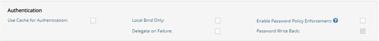
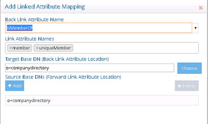
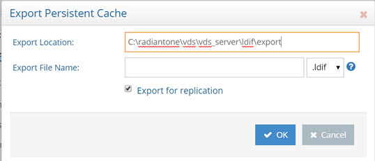

## Overview

Persistent cache is the cache image stored on disk. With persistent cache, the RadiantOne service can offer a guaranteed level of performance because the underlying data source(s) do not need to be queried and once the server starts, the cache is ready without having to “prime” with an initial set of queries. Also, you do not need to worry about how quickly the underlying data source can respond. What is unique about the persistent cache is if the RadiantOne service receives an update for information that is stored in the cache, the underlying data source(s) receives the update, and the persistent cache is refreshed automatically. In addition, you have the option of configuring real-time cache refreshes which automatically update the persistent cache image when data changes directly on the backend sources. For more details, please see [Refreshing the Persistent Cache](#options-for-refreshing-the-persistent-cache).

>[!warning] 
>If you plan on caching (either entry memory cache or persistent cache) the branch in the tree that maps to an LDAP backend, you must list the operational attributes you want to be in the cache as “always requested”. Otherwise, the entry stored in cache would not have these attributes and clients accessing these entries may need them.

## Persistent Cache Disk Space Requirements

Initialization of a persistent cache happens in two phases. The first phase is to create an LDIF formatted file of the cache contents (if you already have an LDIF file, you have the option to use this existing file as opposed to generating a new one). The second phase is to initialize the cache with the LDIF file. After the first phase, RadiantOne prepares the LDIF file to initialize the cache. Therefore, you need to consider at least these two LDIF files and the amount of disk space to store the entries in cache. 

Best practice would be to take four times the size of the LDIF file generated to determine the disk space that is required to initialize the persistent cache. For example, lab tests have shown 50 million entries (1KB or less in size) generates an LDIF file approximately 50 GB in size. So total disk space recommended to create the persistent cache for this example would be 200 GB.

## Options for Refreshing the Persistent Cache

There are four categories of events that can invoke a persistent cache refresh. They are:

-	When changes occur through RadiantOne.

-	When changes occur outside of RadiantOne (directly on the backend source).

-	Scheduling a periodic refresh of the persistent cache.

Each is described below.

### Changes Occurring Through RadiantOne

If RadiantOne receives an update for an entry that is stored in a persistent cache, the following operations occur:

-	The entry in persistent cache is “locked” pending the update to the underlying source(s).

-	The underlying source(s) receives the update from RadiantOne.

-	Upon successful update of the underlying source(s), RadiantOne updates the entry in the persistent cache.

-	The modified entry is available in the persistent cache.

### Real Time Cache Refresh Based on Changes Occurring Directly on the Backend Source(s)

When a change happens in the underlying source, connectors capture the change and send it to update the persistent cache. The connectors are managed by agents built into RadiantOne and changes flow through a message queue for guaranteed message delivery. The real-time refresh process is outlined below. 


 
Figure 2.5: Persistent Cache Refresh Architecture

Persistent Cache Refresh Agents are started automatically once a persistent cache with real-time refresh is configured. Agents can run on any type of RadiantOne cluster node (follower or leaders) and there is only one agent running at any given time in a RadiantOne cluster. The agent doesn't consume a lot of memory, and they are not CPU-intensive, so there is no point in running multiple processes to distribute connectors on multiple nodes. One agent is enough per cluster and makes things simpler.

This type of refresh is described as “Real-time” in the Main Control Panel > Directory Namespace > Cache settings > Cache Branch > Refresh Settings tab (on the right). This is the recommended approach if a real-time refresh is needed.

### Periodic Refresh

In certain cases, if you know the data in the backends does not change frequently (e.g. once a day), you may not care about refreshing the persistent cache immediately when a change is detected in the underlying data source. In this case, a periodic refresh can be used.

If you have built your view in either the Context Builder tab or Directory Namespace Tab, you can define the refresh interval after you’ve configured the persistent cache. The option to enable periodic refresh is on the Refresh Settings tab (on the right) for the selected persistent cache node. Once the periodic refresh is enabled, configure the interval using a CRON expression. Click the Assist button if you need help defining the CRON expression.


 
Figure 2.6: Periodic Cache Refresh Settings

During each refresh interval, the periodic persistent cache refresh is performed based on the following high-level steps:

1.	RadiantOne generates an LDIF formatted file from the virtual view (bypassing the cache).

>[!warning] 
>If a backend data source is unreachable, RadiantOne attempts to re-connect one more time after waiting 5 seconds. The number of retries is dictated by the maxPeriodicRefreshRetryCount property defined in `/radiantone/<version>/<clusterName>/config/vds_server.conf` in ZooKeeper.

2.	(Optional) If a [validation threshold](#add-validation-threshold) is defined, RadiantOne determines if the threshold defined has been exceeded. If it has, the persistent cache is not refreshed during this cycle.

4.	RadiantOne compares the LDIF file generated in step 1 to the current cache image and applies changes to the cache immediately as it goes through the comparison.

The periodic persistent cache refresh activity is logged into periodiccache.log. This file can be viewed and downloaded from Server Control Panel > Log Viewer. For details on this log, see the Logging and Troubleshooting Guide.

The rebuild process can be very taxing on your backends, and each time a new image is built you are putting stress on the data sources. This type of cache refresh deployment works well when the data doesn’t change too frequently and the volume of data is relatively small.
## Configuring Real-time Refresh

## Configuring Persistent Cache with Real-Time Refresh

If you plan on automatically refreshing the persistent cache as changes happen on the backend data sources, this would be the recommended cache configuration option. This type of caching option leverages the RadiantOne Universal Directory storage for the cache image. 

If you choose a real-time refresh strategy, there are two terms you need to become familiar with:

- Cache Dependency – cache dependencies are all objects/views related to the view that is configured for persistent cache. A cache dependency is used by the cache refresh process to understand all the different objects/views that need to be updated based on changes to the backend sources.

- Cache Refresh Topology – a cache refresh topology is a graphical representation of the flow of data needed to refresh the cache. The topology includes an object/icon that represents the source (the backend object where changes are detected from), the queue (the temporary storage of the message), and the cache destination. Cache refresh topologies can be seen from the Main Control Panel > PCache Monitoring tab.

Cache dependencies and the refresh topology are generated automatically during the cache configuration process.

If you have deployed multiple nodes in a cluster, to configure and initialize the persistent cache, you must be on the current RadiantOne leader node. To find out the leader status of the nodes, go to the Dashboard tab > Overview section in the Main Control Panel and locate the node with a yellow triangle icon. 

To configure persistent cache with real-time refresh:

1.	Go to the Directory Namespace Tab of the Main Control Panel associated with the current RadiantOne leader node.

2.	Click the Cache node.

3.	On the right side, browse to the branch in the RadiantOne namespace that you would like to store in persistent cache and click **OK**.

>[!warning] 
>For proxy views of LDAP backends, you must select the root level to start the cache from. Caching only a sub-container of a proxy view is not supported.

4. Click Create Persistent Cache. The configuration process begins. Once it completes, click OK to exit the window.

5. On the Refresh Settings tab, select the Real-time refresh option.

>[!warning] 
>If your virtual view is joined with other virtual views you must cache the secondary views first. Otherwise, you are unable to configure the real-time refresh and will see the following message. A Diagnostic button is also shown and provides more details about which virtual views require caching.


 	 
Figure 2.8: Caching secondary views message

6. Configure any needed connectors. Please see the section titled [Configuring Source Connectors](#configuring-source-connectors) for steps.

7. Click **Save**.

8. On the Refresh Settings tab, click Initialize to initialize the persistent cache.

There are two options for initializing a persistent cache. Each is described below.

*Create an LDIF File*

If this is the first time you’ve initialized the persistent cache, choose this option. An LDIF formatted file is generated from the virtual view and then imported into the cache.

*Using an Existing LDIF*

If you’ve initialized the persistent cache before and the LDIF file was created successfully from the backend source(s) (and the data from the backend(s) has not changed since the generation of the LDIF file), then you can choose this option to use that existing file. The persisting of the cache occurs in two phases. The first phase generates an LDIF file with the data returned from the queries to the underlying data source(s). The second phase imports the LDIF file into the local RadiantOne Universal Directory store. If there is a failure during the second phase, and you must re-initialize the persistent cache, you have the option to choose the LDIF file (that was already built during the first phase) instead of having to re-generate it (as long as the LDIF file generated successfully). You can click browse and navigate to the location of the LDIF. The LDIF files generated are in `<RLI_HOME>\<vds_server>\ldif\import`.

If you have a large data set and generated multiple LDIF files for the purpose of initializing the persistent cache (each containing a subset of what you want to cache), name the files with a suffix of “_2”, “_3”…etc. For example, let’s say the initial LDIF file (containing the first subset of data you want to import) is named cacheinit.ldif. After this file has been imported, the process attempts to find cacheinit_2.ldif, then cacheinit_3.ldif…etc. Make sure all files are located in the same place so the initialization process can find them.

9. Click **OK**. The cache initialization process begins. The cache initialization is performed as a task and can be viewed and managed from the Tasks Tab in the Server Control Panel associated with the RadiantOne leader node. Therefore, you do not need to wait for the initialization to finish before exiting the initialization window.

10. The view(s) is now in the persistent cache. Queries are handled locally by RadiantOne and are no longer sent to the backend data source(s). Real-time cache refresh has been configured. For information about properties associated with persistent cache, please see [Persistent Cache Properties](#persistent-cache-properties).


## Configuring Periodic Refresh

Review the section on [periodically refreshing the cache](#periodic-refresh) to ensure the persistent cache is updated to match your needs. If you plan on refreshing the cache image periodically on a defined schedule, this would be the appropriate cache configuration option. This type of caching option leverages the internal RadiantOne Universal Directory storage for the cache image.

To configure persistent cache with Periodic refresh
1.	On the Directory Namespace tab of the Main Control Panel, click the Cache node.

2.	On the right side, browse to the branch in the RadiantOne namespace that you would like to store in persistent cache and click **OK**.

3.	Click **Create Persistent Cache**. The configuration process begins. Once it completes, click **OK** to exit the window.

4.	Click the **Refresh Settings** tab.

5.	Select the Periodic Refresh option.

6.	Enter the [CRON expression](#periodic-refresh-cron-expression) to define the refresh interval.

7.	(Optional) Define a [Delete Validation Threshold](#delete-validation-threshold).

8.	(Optional) Define an [Add Validation Threshold](#add-validation-threshold).

9.	Click **Save**.

10.	Click **Initialize** to start the initialization process.

There are two options for initializing the persistent cache: Creating a new LDIF file or initializing from an existing LDIF file. Each is described below.

*Create an LDIF from a Snapshot*

If this is the first time you’ve initialized the persistent cache, then you should choose this option. An LDIF formatted file is generated from the virtual view and then imported into the local RadiantOne Universal Directory store.

*Initialize from an Existing LDIF File*

If you’ve initialized the persistent cache before and the LDIF file was created successfully from the backend source(s) (and the data from the backend(s) has not changed since the generation of the LDIF file), then you can choose to use that existing file. The persisting of the cache occurs in two phases. The first phase generates an LDIF file with the data returned from the queries to the underlying data source(s). The second phase imports the LDIF file into the local RadiantOne Universal Directory store. If there is a failure during the second phase, and you must re-initialize the persistent cache, you have the option to choose the LDIF file (that was already built during the first phase) instead of having to re-generate it (as long as the LDIF file generated successfully). You can click browse and navigate to the location of the LDIF. The LDIF files generated are in <RLI_HOME>\<instance_name>\ldif\import.

If you have a large data set and generated multiple LDIF files for the purpose of initializing the persistent cache (each containing a subset of what you want to cache), name the files with a suffix of “_2”, “_3”…etc. For example, let’s say the initial LDIF file (containing the first subset of data you want to import) is named cacheinit.ldif. After this file has been imported, the process attempts to find cacheinit_2.ldif, then cacheinit_3.ldif…etc. Make sure all files are located in the same place so the initialization process can find them.

After you choose to either generate or re-use an LDIF file, click Finish and cache initialization begins. Cache initialization is launched as a task and can be viewed and managed from the Tasks Tab in the Server Control Panel associated with the RadiantOne leader node. Therefore, you do not need to wait for the initialization to finish before exiting the initialization window.

After the persistent cache is initialized, queries are handled locally by the RadiantOne service and no longer be sent to the backend data source(s). For information about properties associated with persistent cache, please see [Persistent Cache Properties](#persistent-cache-properties).

### Periodic Refresh CRON Expression

If periodic refresh is enabled, you must define the refresh interval in this property. For example, if you want the persistent cache refreshed every day at 12:00 PM, the CRON expression is: 
0 0 12 1/1 * ? *
Click **Assist** if you need help defining the CRON expression.


 
Figure 2.7: CRON Expression Editor

### Delete Validation Threshold

For details on how the periodic persistent cache refresh process works, see [Periodic Refresh](#periodic-refresh).

You can define a threshold to validate the generated LDIF file/image prior to RadiantOne executing the cache refresh process. The threshold is a percentage of the total entries.

To define a granular threshold for delete operations, indicate the percentage in the Delete Validation Threshold. For example, if Delete Validation Threshold contains a value of 50, it means if the generated LDIF image contains at least 50% fewer entries than the current cache image, the periodic persistent cache refresh is aborted for the current refresh cycle.

If a validation threshold is configured, the threshold is checked.

### Add Validation Threshold

For details on how the periodic persistent cache refresh process works, see [Periodic Refresh](#periodic-refresh).

You can define a threshold to validate the generated LDIF file/image prior to RadiantOne executing the cache refresh process. The threshold is a percentage of the total entries.

To define a granular threshold for add operations, indicate the percentage in the Add Validation Threshold. For example, if Add Validation Threshold contains a value of 50, it means if the generated LDIF image contains 50% more entries than the current cache image, the periodic persistent cache refresh is aborted for the current refresh cycle.

## Managing Cache

Persistent cache should be initialized during off-peak hours, or during scheduled downtime, since it is a CPU-intensive process and during the initialization queries are delegated to the backend data sources which might not be able to handle the load.

When initializing persistent cache, two settings you should take into consideration are paging and initializing cache from an encrypted file. These options are described in this section.

>[!warning] 
>If you are using real-time refresh, make sure the cache refresh components are stopped before re-initializing or re-indexing a persistent cache.

### Using Paging

Depending on the complexity of the virtual view, building the persistent cache image can take some time. Since the internal connections used by RadiantOne to build the persistent cache image are subject to the Idle Connection Timeout server setting, the cache initialization process might fail due to the connection being automatically closed by the server. To avoid cache initialization problems, it is recommended to use paging for internal connections. To use paging:

1.	Navigate to the Main Control Panel > Settings tab > Server Front End > Supported Controls.

2.	On the right, check the option to Enable Paged Results.

3.	Click **Save**.

4.	Navigate to the Main Control Panel > Settings tab > Server Backend > Internal Connections (requires [Expert Mode](00-preface#expert-mode)).

5.	On the right, check the option for Paged Results Control, page size: 1000.

6.	Click **Save**.

### Supporting Zipped and Encrypted LDIF Files

If you are initializing persistent cache using an existing LDIFZ file, the security key used in RadiantOne (for attribute encryption) where the file was exported must be the same security key value used on the RadiantOne server that you are trying to import the file into.

If you are creating a new LDIF file to initialize the persistent cache, you have the option to use an LDIFZ file which is a zipped and encrypted file format. This ensures that the data to be cached is not stored in clear in files required for the initialization process.

To use this option, you must have an LDIFZ encryption key configured. The security key is defined from the Main Control Panel > Settings Tab > Security > Attribute Encryption section.

Once the security key has been defined, check the option to “Use .ldifz (zipped and secure format).


### Enable/Disable
Active

### Delete Cache

### Rebuild Index

### Export

## Managing Cache Properties

### Full-text Search

Persistent cache branches can support full text searches. This offers additional flexibility for clients as they can search data in the RadiantOne namespace based on text (character) data. These types of searches are no longer linked to specific attributes as the characters requested could be found in any attribute value. An entry is returned if any attribute in the entry contains the character string(s) requested by the client.

Clients issue full text searches similar to the way they issue LDAP searches. The only difference is the filter contains `(fulltext=<value>)` where `<value>` would be the text they are interested in. As an example, if a client was interested in the text John Doe as an exact phrase, the search filter sent to RadiantOne would be (fulltext= “John Doe”) where the phrase is encapsulated in double quotes. If the phrase in the filter is not encapsulated in double quotes it means the client wants any entries that have attribute values that contain the character string John OR Doe. 

The part of the filter that contains the piece related to the full text search can also be combined with other “standard” LDAP operators. As an example, a filter could be something like (&(uid=sjones)(fulltext=”John Doe”)). This would return entries that contain a uid attribute with the value sjones AND any other attribute that contains the exact character string John Doe.

If you want the persistent cache to support full text searches, check the Full-Text Search option and click **Save**. If you add the support for full text searches, click **Re-build Index**.

### Authentication

**Use Cache for Authentication**

The default behavior of the RadiantOne service for processing bind requests for users located in a persistent cache branch is to delegate the credentials checking to the authoritative backend source. If the password in the backend is encrypted using one of the algorithms supported by RadiantOne, and the passwords are stored in the cache, you can configure the service to authenticate the user locally against the password in cache instead of delegating the credentials checking to the backend. To enable this behavior, check the Use Cache for Authentication option on the configured cache branch. This option is not applicable in scenarios where the passwords are not stored in the persistent cache. For an example use case where this option could be applicable, please see [Authoritative Backends Inaccessible by All Sites](07-deployment-architecture#backends-inaccessible-by-all-sites).

By default, if the Use Cache for Authentication option is enabled and the entry in persistent cache has a password, RadiantOne checks the password against the local value and the user is authenticated or not based on this comparison. If the entry in persistent cache doesn’t have a password, RadiantOne delegates the credentials checking to the backend data source. There are two options to override this default behavior: Local Bind Only or Delegate on Failure. 



Figure 2.25: Authentication Options

Each option is described in more details below.

**Local Bind Only**

-	Local Bind Only – If this option is enabled and the user entry in cache either has no password or the bind fails, RadiantOne does not delegate the credentials checking to the backend. It determines if the user authentication fails based on the local comparison.

**Delegate on Failure**

-	Delegate on Failure – If this option is enabled and the user entry in cache has a password but the local checking fails, RadiantOne delegates the credentials checking to the backend. If the credentials checking fails against the backend, an unsuccessful bind response is returned to the client. If the credentials checking succeeds against the backend, a successful bind response is returned to the client.

**Enable Password Policy Enforcement**

-	Enable Password Policy Enforcement - If you are storing user passwords in cache and you are using the cache for authentication, you can also choose to have RadiantOne enforce password policies (as opposed to delegating password checking to the backend directory and having it enforce password policies). Enable this option and then define the password policy to enforce. For details on password policies, see the RadiantOne System Administration Guide. 

**Password Writeback**

-	When you enable the password policy enforcement on a persistent cache, the userPassword attribute is automatically added to the Extension Attribute property and you have the option to enable Password Write Back. If Password Write Back is enabled, and a modify request for the password is sent to RadiantOne, it tries to update the password in the backend. In some circumstances, having two levels of password policies can result in inconsistencies between the cache image and the underlying backend(s). These circumstances are outlined in the table below.

Password Change Event | Password Writeback Enabled?	| Expected Behavior
-|-|-
Password update via a Modify Request sent to RadiantOne	| No | The password is updated in the persistent cache if it complies with the persistent cache password policy. Otherwise the password update fails. <br> <br> The password update is not sent to the backend. If the update to the persistent cache succeeds, the password in the persistent cache will be different than the one in the backend.
Password update via a Modify Request sent to RadiantOne	| Yes | The password update is sent to the backend. If the password update fails in the backend, the password in the persistent cache is not updated. If the password update succeeds in the backend, the password is updated in the persistent cache. 
Password is updated directly in the backend (outside of RadiantOne) | N/A | Through the persistent cache refresh process, the password is updated in the persistent cache. If the account was locked in the persistent cache due to a password policy enforced at the cache layer, it will be unlocked by the cache refresh process after a successful password update in the backend. Password strength defined in the persistent cache password policy is not enforced since the password change originated from the backend.

### Optimize Linked Attributes

Linked attributes are attributes that allow relationships between objects. A typical example would be isMemberOf/uniqueMember for user/groups objects. A group has members (uniqueMember attribute) which is the forward link relationship. Those members have an isMemberOf attribute which is the back link (to the group entry) relationship. Other examples of linked attributes are:

```
manager/directReports
altRecipient/altRecipientBL
dLMemRejectPerms/dLMemRejectPermsBL
dLMemSubmitPerms/dLMemSubmitPermsBL
msExchArchiveDatabaseLink/msExchArchiveDatabaseLinkBL
msExchDelegateListLink/msExchDelegateListBL
publicDelegates/publicDelegatesBL
owner/ownerBL
```

The most common back link/forward link relationship is between group and user objects. A list of groups a user is a member of can be calculated automatically by RadiantOne and returned in the membership attribute of the user entry. The most common back link attributes are in the drop-down list. However, you can manually enter any attribute name you want. This is configured on the Main Control Panel, click Settings > Interception > Special Attributes Handling > Linked Attributes setting (on the right).

If the Target Base DN (back link attribute location) and the Source Base DN (forward link attribute location) in the Linked Attributes setting is a persistent cached branch, the computation of the references can be optimized in order to return client requests for the back link attribute at high speed. To enable this optimization, follow the steps below.

>[!warning] 
>If your linked attributes are for users and groups (both branches located in persistent cache), and you enable the Optimize Linked Attributes setting, and must support nested groups, only one user location per persistent cache store is supported. For example, in the Linked Attributes setting, having a Target Base DN location configured for ou=people1,dc=myhdap and ou=people2,dc=myhdap (both in the same dc=myhdap persistent cache store) is not supported. In this case, you should configure a single user location as dc=myhdap as a shared parent for both containers.

It is assumed you have configured and initialized your persistent cache, and configured the Linked Attributes in Special Attributes Handling. If you have not, please do so prior to continuing with the steps below.



Figure 2.29: Back Link Attribute Name in Special Attribute Handling

1. Select the Optimize Linked Attributes option on the Properties tab for the selected persistent cache branch on the Main Control Panel > Directory Namespace tab > Cache section. The defined linked attribute is added to the Extension Attributes List for the persistent cache.

2. Click **Save**. 

3. You can either rebuild the index, or reinitialize the persistent cache. Click **Re-build Index** or **Initialize**. The back link attribute is always returned to clients even when not requested unless Hide Operational Attributes is enabled in RadiantOne (in which case it is only returned when a client explicitly requests it). For details on the Hide Operational Attributes setting, please see the RadiantOne System Administration Guide. 

>[!warning] 
>If a persistent cache has optimizations associated with it, deactivating it will interfere with queries associated with the linked attributes and they will not return properly. If you no longer need a cache, delete it instead of deactivating it.

### Persistent Cache Universally Unique Identifier (UUID)

The Universally Unique Identifier (UUID) attribute is a reserved, internal attribute that is assigned to each entry and can guarantee uniqueness across space and time.

When adding entries into a persistent cache (LDAP ADD operations) from an LDIF file, if there are UUID attributes they are ignored by RadiantOne during import. RadiantOne generates a unique value for each entry based on the specifications in RFC 4122. 

When initializing with an LDIF file (LDIF INIT), if the entry has a UUID attribute, RadiantOne keeps it. If the entry does not have a UUID attribute, RadiantOne generates a unique value for each entry based on the specifications in RFC 4122.

UUID is an operational attribute meaning that if a client wants this attribute, they must explicitly ask for it in the search request sent to RadiantOne.

When exporting a persistent cache store to an LDIF file, you have the option to export the UUID attribute or not. The UUID attribute should be exported into LDIF if you plan on using this export to initialize a RadiantOne Universal Directory store, a replica for inter-cluster replication. Otherwise, the UUID attribute generally should not be exported. To export a persistent cache store and include the UUID attributes, check the Export for Replication option in the export window.



**Enable Changelog**

**Async Indexing**

### Non-indexed Attributes
### Sorted Attributes
### Encrypted Attributes
### Extension Attributes
### Invariant Attribute

### Inter-cluster Replication

**Replication Excluded Attributes**

**Accept Changes from Replicas**


