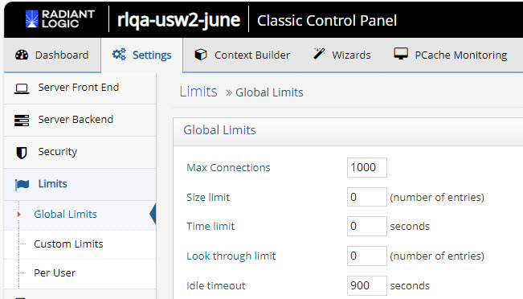
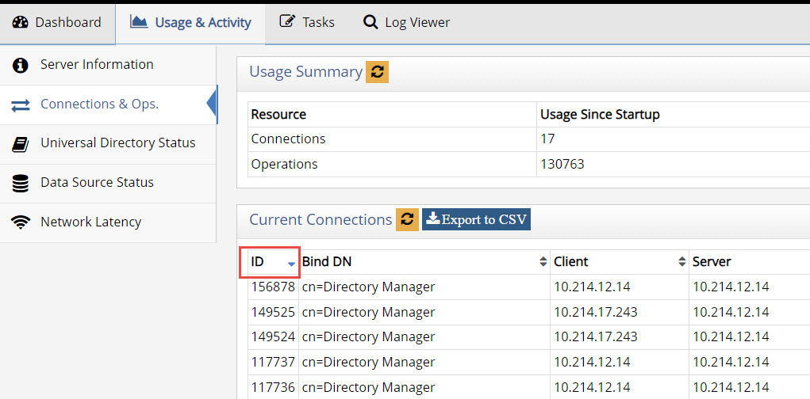
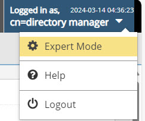
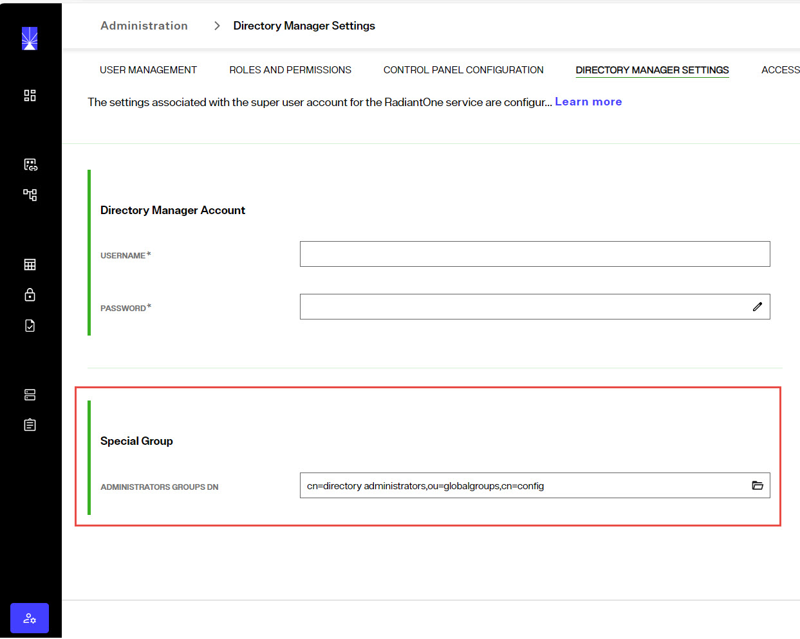

## Overview
The settings found in the Classic Control Panel > Settings Tab > Limits section are related to enforcing search size limits and activity quotas. These settings prevent against Denial of Service (DoS) attacks towards RadiantOne. 

To switch to Classic Control Panel, use the menu options for the logged in user in the upper right.


>[!warning]
>Changing any property in the Limits section requires a restart of the RadiantOne service to take effect. You can restart the service in your environment from Environment Operations Center.

## Global Limits

The following parameters are configured from the Classic Control Panel > Settings Tab > Limits section > Global Limits sub-section.



 
### Maximum Connections

The maximum number of client connections the server can accept concurrently (connecting at the exact same time).

**Manually Closing a Client Connection**

A connection can be manually closed by issuing an LDAP search to RadiantOne with the connection ID. The connection ID can be viewed from the Server Control Panel > Usage & Activity tab > Connections & Operations. 



With the connection ID, connect to RadiantOne as the super user (e.g. cn=directory manager) and perform a search request with a base DN of, `action=closeconnection,ID=<connectionID>`. An example is shown below using the ldapsearch utility. This example closes the connection associated with ID 148300.

```
C:\SunKit>ldapsearch -h ldaps://ldaps-rlqa-usw2-lg123.dev01.radiantlogic.io -p 636 -D "cn=directory manager" -w password -b action=closeconnection,ID=148300 (objectlcass=*)
```

### Size Limit

The maximum number of entries a search operation can return. This allows for limiting the number of entries LDAP clients can receive from a query. By default this value is set to 0 which means there is no restriction on the size. 

>[!warning] 
>This parameter is a global parameter for RadiantOne. If you want more granular, specific size limits set, then you should set them in the Custom Limits sections.

### Time Limit

The time (in seconds) during which a search operation is expected to finish. If a search operation does not finish within this time parameter, the query is aborted. By default, this value is set to 0 which means there is no restriction on time. 

### Look Through Limit

The look through limit is the maximum number of entries you want the server to check in response to a search request. You should use this value to limit the number of entries the server will look through to find an entry. This limits the processing and time spent by the server to respond to potentially bogus search requests (for example, if a client sends a search filter based on an attribute that is not indexed). By default, this is set to 0, which means that there is no limit set for the number of entries that the server will look through.

>[!warning] 
>This property is not used by RadiantOne Directory stores.

### Idle Timeout

The length of time (in seconds) to keep a connection open without any activity from the client. The default is 900, which means the idle connection is kept open for 900 seconds and then closed by the server. 

## Custom Limits

Custom limits are more fine-grained than global limits and can be defined in the Classic Control Panel > Settings > Limits > Custom Limits section. Custom limits can be configured for the pre-defined users: “Anonymous Users”, and “Authenticated Users”. They can also be more granular and associated with users belonging to any group or located below any branch/naming context (subtree) in RadiantOne.

>[!note] 
>Multiple custom limits are not allowed for anonymous users and authenticated users.

Custom limits override any Global Limits defined in the Classic Control Panel > Settings tab > Limits section > Global Limits sub-section. The order of precedence (highest to lowest) for global and custom limits containing the same subject is: Group, Sub-tree, Authenticated Users, Anonymous Users, Global. For custom limits defined within the same root naming context, the limit defined for the deepest entry in the tree will take precedence. For example, if a custom size limit of 3 is defined for a subject location of ou=Novato,ou=California,dc=USA and a size limit of 5 is defined for a subject location of ou=California,dc=USA, if a user of uid=Svc1,ou=Novato,ou=California,dc=USA connects to RadiantOne, the custom size limit of 3 will be enforced.

>[!note] 
>This section is accessible only in Expert Mode. Click the "Logged in user" menu and choose Expert Mode.




### Granular Limits

To define custom limits:
1.	Click **ADD** in the Custom Limits section.

2.	Select a subject from the drop-down list. The possible subjects are described below.
    - Sub-tree - the location (base DN) in the RadiantOne namespace containing the users that are affected by the custom limits.
    - Group – a group entry in the virtual namespace. All members of this group are affected by the custom limits.
    - Anonymous users – any authenticated users or anonymous users.
    - Authenticated Users – any authenticated users.

3.	Click **CHOOSE** to browse and select a subject location – if sub-tree is selected, the subject location is the base DN containing the users that are affected by the custom limits. If group is selected, the subject location is the DN of the group entry. All members of this group are affected by the custom limits. If authenticated users or anonymous users are selected, subject location is irrelevant.

4.	Enter a value for maximum connections. This is the maximum number of concurrent connections the subject can create. By default, this value is set to 0 which means there is no restriction on maximum connections.

5.	Enter a value for size limit. This is the maximum number of entries a search operation can return. This allows for limiting the number of entries LDAP clients can receive from a query. By default, this value is set to 0 which means there is no restriction on the size. 

6.	Enter a value for idle timeout. This is the length of time (in seconds) to keep a connection open without any activity from the client. By default, this value is set to 0 which means there is no restriction on idle time.

7.	Click **OK**.

8.	Click **Save**. The RadiantOne service needs to be restarted. You can restart the service in your environment from Environment Operations Center.

### Number of Processing Queues

If you are running RadiantOne on a multi-processor machine, performance and efficiency of the server might improve by increasing the value for the Number of Processing Queues parameter. The default value is 2 and is sufficient for most deployments. As a general guideline, this value should never exceed 3.

>[!warning] 
>This parameter does not affect the actual number of processors that get used. However, it does improve the utilization of the available processors.

A better indicator for performance is the number of threads allocated for each processing queue. For each processing queue, the maximum number of concurrent worker threads is 80 by default. This value can be seen/changed in the Max Concurrent Working Threads parameter. For more details, see the next section.

After making changes, click **Save**. RadiantOne must be restarted for the changes to take effect. If deployed in a cluster, restart the service on all nodes.

### Maximum Concurrent Working Threads

This is the number of threads the virtual directory server uses for handling client requests. In other words, this defines the number of concurrent LDAP requests RadiantOne can handle. If there are backends involved (e.g. proxy views without persistent cache), then you must also consider how the backend handles the level of concurrency you define here as well because requests made to RadiantOne may directly result in concurrent requests sent to the backend(s).

The default value is 16, which means 16 worker threads allocated per processing queue defined in the Number of Processing Queues property. This amount is sufficient for most deployments and generally should not be modified unless recommended by Radiant Logic. You might be able to increase this number if:

-	You are using a multiprocessor system - Multiprocessor systems can support larger thread pools than single processor systems. See the Number of Processors parameter above.

-	Clients connecting to RadiantOne perform many time-consuming operations simultaneously (like complex searches or updates).

-	RadiantOne needs to support many simultaneous client connections.

It is difficult to provide an exact formula for determining the optimal number of maximum concurrent working threads to set because it depends on the machine and environment where RadiantOne is running. Generally, the value for concurrent working threads should not be modified unless recommended by Radiant Logic. If it is modified, you must verify the value you set with testing. Incrementally change the value and retest. In the test results, you should start to see performance peak and then a decrease. The peak in the curve should represent the optimal setting.

### Max Pending Connection Requests

The max pending connection property represents a queue of server socket connections associated with requests from clients. This is not managed by the RadiantOne process. As soon as a TCP connection is established to RadiantOne, the connection is removed from the pending queue. A maximum number of pending client requests can be set in the Max Pending Connection Requests parameter. This parameter should not be changed unless advised by a Radiant Logic Support Engineer. 

## Access Regulation

After a client connects to the RadiantOne service, the amount of activity they perform can be limited by configuring access regulation. The activity checking can be performed based on the user that connects to RadiantOne.

The “Restrictions Checking Interval” parameter indicated in the Per User section is the time frame in which the activity (max binds and max operations) is monitored. Once the time interval is reached, the counts are reset. For example, if Special Users Group checking is enabled, and the checking interval, max bind operations per checking interval and max operations per checking interval are set to 300, 30 and 10 respectively, during a 5 minute (300 secs) period, anyone who is a member of the special users group can bind no more than 30 times to the RadiantOne service and not perform more than 10 operations. This count resets every 5 minutes. If a user attempts to perform more than the allowed number of operations, the RadiantOne service refuses the operation and the client must wait until the checking interval resets.

### Per User

The following groups of users found on the Classic Control Panel > Settings tab > Limits section > Per User sub-section allow you to configure fine-grained activity control:

>[!note] 
>Members of the Administrators group specified on the Control Panel > Admin > Directory Manager Settings tab > Special Group section do not have any access limitations in terms of max connections or max operations per second.



### Anonymous

An anonymous user is a client who connects anonymously (no username or password) to the RadiantOne service. To enable checking for this category of user, check the Enable Access Checking option in the Anonymous section of the Per User Category sub-section. Enter a number for the maximum bind operations that anonymous users are allowed to perform. Also enter a number for the maximum number of operations per checking interval they are allowed to issue. Any parameters that are set to 0 have no limits applied. The restrictions checking interval dictates the number of seconds the server should wait before determining if these thresholds are reached.

### Authenticated Users

An authenticated user encompasses any client who successfully authenticates no matter which group they are a member of. To enable checking for this category of users, check the Enable Access Checking option in the Authenticated Users section of the Per User Category sub-section. Enter a number for the maximum bind operations that authenticated users are allowed to perform. Also enter a number for the maximum number of operations per checking interval they are allowed to issue. Any parameters that are set to 0 have no limits applied. The restrictions checking interval dictates the number of seconds the server should wait before determining if these thresholds are reached.

### Special Users Group

Special Users are anyone who successfully binds and is a member of the special user group defined on the Classic Control Panel > Server Front End > Administration section. To enable checking for this category of users, check the Enable Access Checking option in the Special Users Group section in the Per User Category sub-section. Enter a number for the maximum bind operations that users in the Special Users Group are allowed to perform. Also enter a number for the maximum number of operations per checking interval they are allowed to issue. Any parameters that are set to 0 have no limits applied. The restrictions checking interval dictates the number of seconds the server should wait before determining if these thresholds are reached.

## Backends

Tuning settings for backends includes connection pooling. For Active Directory backends there is an additional tuning property to indicate the maximum number of SRV records to use during failover. These topics are discussed in this section.

### Connection Pooling Overview

>[!note] 
>This section is accessible only in [Expert Mode](01-introduction#expert-mode).


Connection pooling for database and LDAP sources is enabled by default. The settings can be modified in the Classic Control Panel > Settings Tab > Server Backend section, Connection Pooling sub-section. Connection pooling improves performance for identity views because a connection to the underlying source does not need to be created every time data needs to be retrieved.

When RadiantOne receives a search for information (that is not stored locally, either in cache or a local Directory store), a connection to the underlying system is established. Since opening and closing a connection every time information must be retrieved from an underlying source can be time consuming, RadiantOne can pool the open connections and re-use them (thus saving the overhead involved in having to open/close a connection every time a backend needs to be accessed).

The first time RadiantOne queries an underlying source, a connection is opened. When the operation is done, the open connection remains in the connection pool (for the specified timeout parameter that has been set). The next time RadiantOne receives a query for the same underlying source, an open connection is retrieved from the pool (instead of opening a new connection). If no connections are available in the pool, a new connection is opened. This process continues until the connection-poolsize parameter has been reached (the maximum number of open connections to keep in the pool). Once this happens (the max number of open connections has been reached and they are all in use), the client must wait until one of the used connections is finished before their query can be processed.

### Connection Pooling for LDAP Backends

Connection pooling for LDAP backends is configured with the following settings:

**Pool size**

This is the maximum number of concurrent connections by RadiantOne to each LDAP source. For example, if you have four LDAP sources and your maximum connections value is set to 200, then you could have up to a total of 800 LDAP connections maintained by RadiantOne.

**Timeout**

The default is 7. This is the maximum number of seconds RadiantOne waits while trying to establish a connection to the backend LDAP server. There are two attempts to create a connection (each tries to create a connection for 7 seconds).

**Operation Timeout**

The default is 0 (no timeout). This is the maximum number of seconds RadiantOne waits to receive a response from the backend LDAP server. After this time, RadiantOne drops the request and attempts to send the request again. After two failed attempts to get a response back, RadiantOne returns an error to the client.

**Write Operation Timeout**

The default is 0 (no timeout). This is the maximum number of seconds RadiantOne waits to receive a response from the backend LDAP server for write operations and bind operations. After this time, RadiantOne drops the request and attempts to send the request again. After two failed attempts to get a response back, RadiantOne returns an error to the client.

**Idle Timeout**

The default is 5 minutes. This is the maximum amount of time to keep an idle connection in the pool.

### Connection Pooling for Database Backends

Connection pooling for database backends is configured with the following settings:

**Pool Size**

The default is set to 20, this means 20 open connections are held in the pool for each JDBC data source. A connection pool is managed per each data source.

**Idle Timeout**

The default is 15. This is the number of minutes a connection stays in the connection pool once it is idle. Setting this to “0” (zero) results in opened connections to stay in the pool forever.

**Prepared Statement Cache**

The default is 50. RadiantOne uses parameterized SQL statements and maintains a cache of the most used SQL prepared statements. This improves performance by reducing the number of times the database SQL engine parses and prepares SQL. 

This setting is per database connection. Use caution when changing this default value as not all databases have the same limits on the number of 'active' prepared statements allowed.

### Manually Clearing the Connection Pool

RadiantOne supports special LDAP commands to reset connections in the pools. If you issue these commands to RadiantOne, all the connections that are currently not being used in the pool are closed.

To reset the connection pools from the command line, you can use the ldapsearch utility.

The following is an example command that clears the LDAP connection pool (assuming RadiantOne is listening on LDAP port 2389 and the super user password is “password”):

```
ldapsearch -h host -p 2389 -D"cn=directory manager" -w "password" -b "action=clearldappool" (objectclass=*)
```

The following is an example command that clears the database connection pool (assuming RadiantOne is listening on LDAP port 2389 and the super user password is “password”):

```
ldapsearch -h host -p 2389 -D"cn=directory manager" -w "password" -b "action=clearjdbcpool" (objectclass=*)
```

### Active Directory SRV Record Limit

If there are multiple Active Directory domains available in the SRV record, by default RadiantOne uses five as “main/primary” and “failover” servers. RadiantOne uses these to automatically failover if the primary server is down. The Active Directory SRV Record Limit can be adjusted from the Main Control Panel. 

To change the Active Directory SRV record limit:

1. In the Classic Control Panel, navigate to Settings > Server Backend > Connection Pooling > Other. 

1. Set the Active Directory SRV Record Limit value. The default value is 5. 

1. Click Save. 


