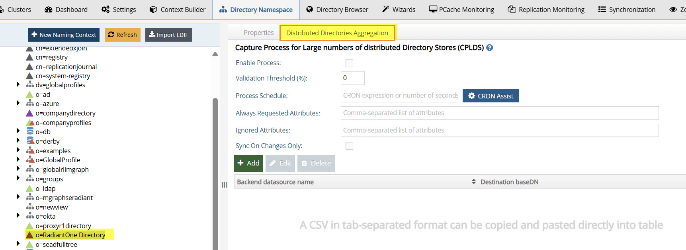

# Overview

This document provides details on deprecated features and features that may require alternatives or additional support when upgrading from v7.4 to v8.1.

## Features Deprecated in 8.1

The following features have been deprecated and are no longer available in v8.1 of Identity Data Management. If you have any questions about these features, reach out to the Radiant Logic Customer Support team.

| Feature                                                       | Where to find this feature in 7.4                                                             |  
| ------------------------------------------------------------- | --------------------------------------------------------------------------------------------- | 
| Server Front-End – Other Protocols (VRS)                      | Check configuration for VRS protocol usage.              | 
| ACI Settings – Level of Assurance                             | Check Access Control rules for “Level of Assurance.”     | 
| Security Settings – Role Mapped Access in Proxy Views of LDAP | Review proxy view settings for role mapping.                                                  | 
| Wizard – Directory Tree Wizard                                | Check if it is used to create virtual identity views. In v8, you can use Directory Namespace to create your tree.   |
| Wizard – Groups Builder Wizard                                | Check if it is used to create virtual identity views. In v8, you can use Directory Browser to create dynamic groups.   | 
| Wizard – Groups Migration Wizard                              | Check if it is used to create virtual identity views.   |
| Wizard – Merge Tree Wizard                                    | Check if it is used to create virtual identity views. In v8, you can use Directory Namespace to create your merged tree.   | 

## Features Available Upon Request

If you are using any of the following settings, and are moving to SaaS, let the Radiant Logic customer onboarding team know, so your tenant can be customized to support client IP address-related checking and/or client certificates checking.

- **Allowed IPs (Administration)** 
  
    

- **Per Computer/IP Limits & Special IP Checks (Limits)**  

  Review if you have enabled any of the highlighted options in the image below.

    
   

- **IP Restrictions (ACI Settings)** 
 
    

- **Mutual Authentication (Security Settings)** 

    

## Feature Usage Requiring Further Discussion 

If you have enabled any of the following features in v7.4, work with Radiant Logic Customer Support team to understand your options when upgrading:

- **Synchronizing Passwords to Entra ID**

- **Using the Active Directory Password Filter**

- **Kerberos Authentication** 

  
 

- **Kerberos to Backend Active Directory Data Sources**

  

- **Log2DB**: The Log2DB utility is discontinued in v8.1. However, pushing log files to a log aggregator like Splunk is available in Identity Data Management (SaaS & Self-managed). Self-managed deployments must set up **[their own log aggregator](../../v8.1/installation/metrics-and-logging/)**.

- **Reporting**: Reporting is included in Environment Operations Center for SaaS deployments. Self-managed deployments should use **Prometheus (15.13.0+)** and optionally **Grafana (6.40.0+)** to generate reports from **[metrics](../../v8.1/installation/metrics-and-logging/)**.

- **Retrieving Existing Active Directory Passwords**: For SaaS deployments, this requires a Secure Data Connector to be deployed in the Active Directory network. This feature will be supported in self-managed deployments soon.

- **CPLDS**: RadiantOne v7.4 includes a Capture Process for Large numbers of distributed Directory Stores (CPLDS). This feature leverages components known as Workers to detect changes in source LDAP directories, Active Directories, or LDIF files and refreshes a RadiantOne Directory (HDAP) replica.
  
  

