## Feature comparison guide

Use the table below to see which features will change or be discontinued when moving from v7.4 to v8.1.

| Feature| Where to find this feature in 7.4 | Action to take| Availability in 8.1 (SaaS / Self-managed Identity Data Management) |
|---------------------|--------------------------|--------------------|---------------------------------------|
| Server Front-End – Other Protocols (VRS) | Check configuration for VRS protocol usage.  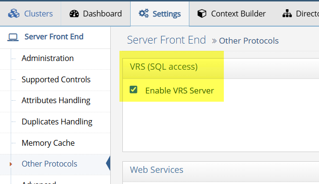   | Contact Support for alternatives. | Deprecated in both SaaS and Self-managed Identity Data Management |
| Administration – Allowed IPs | Review load balancer/firewall IP restriction settings.  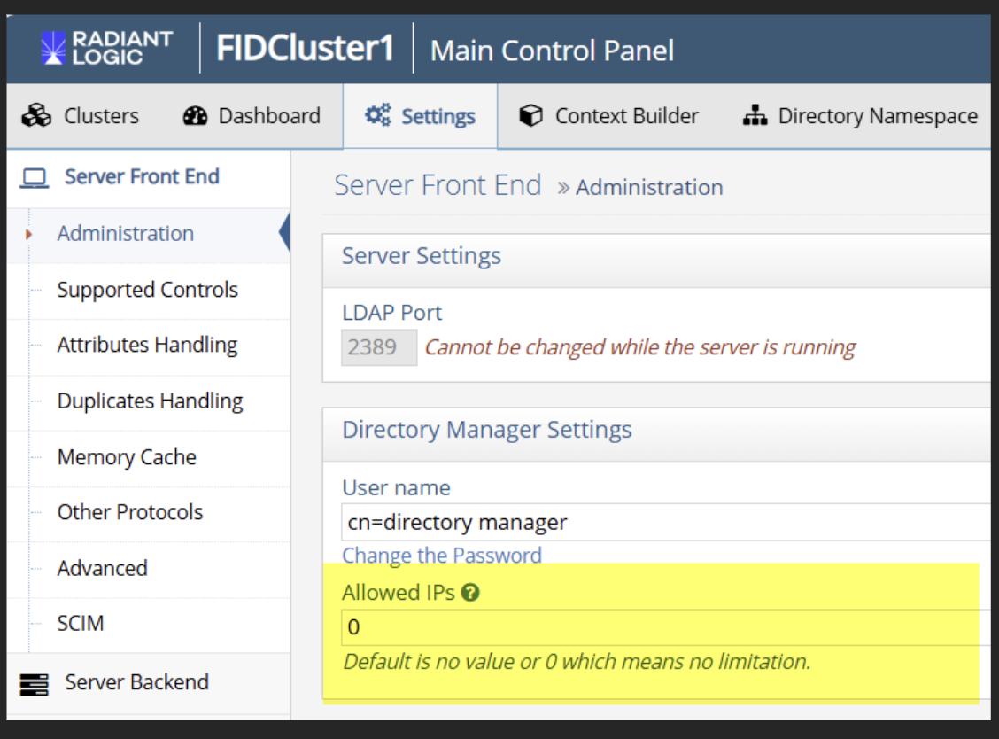 | It can be configured by Radiant Logic SaaS team upon request; Self-managed Identity Data Management customers can configure it via their load balancer. | SaaS: Supported with customization; Self-managed: Supported |
| Data Source – Kerberos to Backend AD | Review Data Source settings for Kerberos authentication.  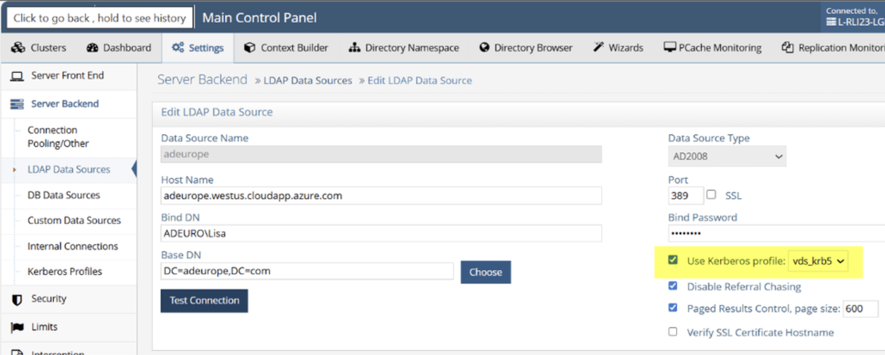 | Contact Support to assess migration. | Not included in 8.1 UI (SaaS & Self-managed Identity Data Management) |
| Internal Connections – Use SSL | Check Internal Connections in Control Panel.  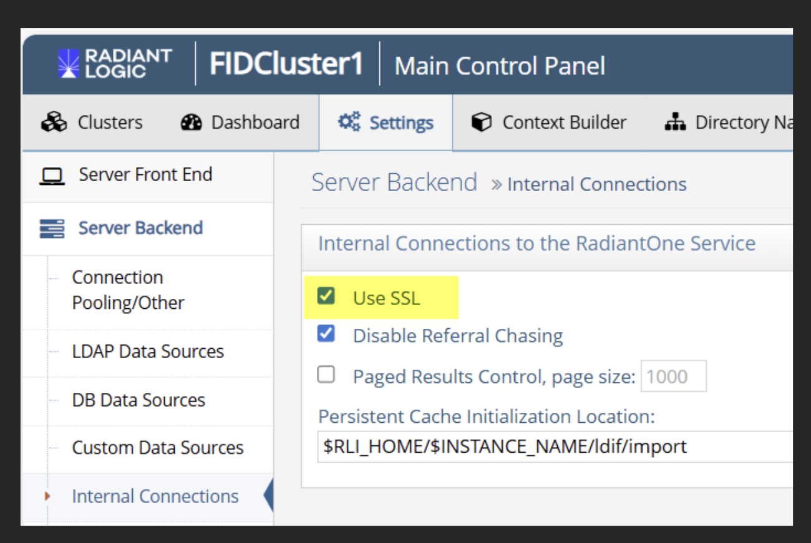 | SaaS: As of now, it can be configured by Radiant Logic SaaS team upon request; Self-managed Identity Data Management customers can configure it directly. | Supported in both SaaS and Self-managed Identity Data Management |
| Limits – Per Computer/IP Address / Special IP Checking | Review load balancer/firewall IP restriction settings.  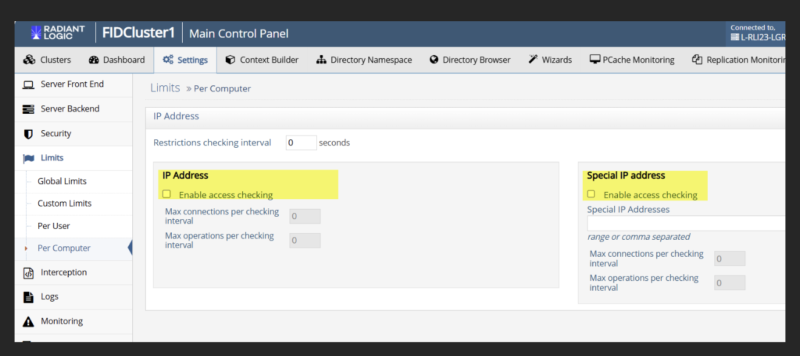 | SaaS: Work with Radiant Logic SaaS team; Self-managed Identity Data Management customers can configure it directly. | SaaS: Supported with customization; Self-managed: Supported |
| ACI Settings – Level of Assurance | Check Access Control rules for “Level of Assurance.”  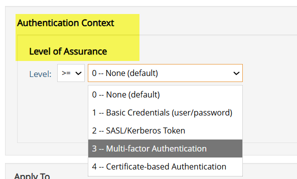 | Contact Support for alternatives. | Deprecated in both SaaS and Self-managed Identity Data Management |
| ACI Settings – IP Restriction | Check Access Control rules for “Allowed IP.”  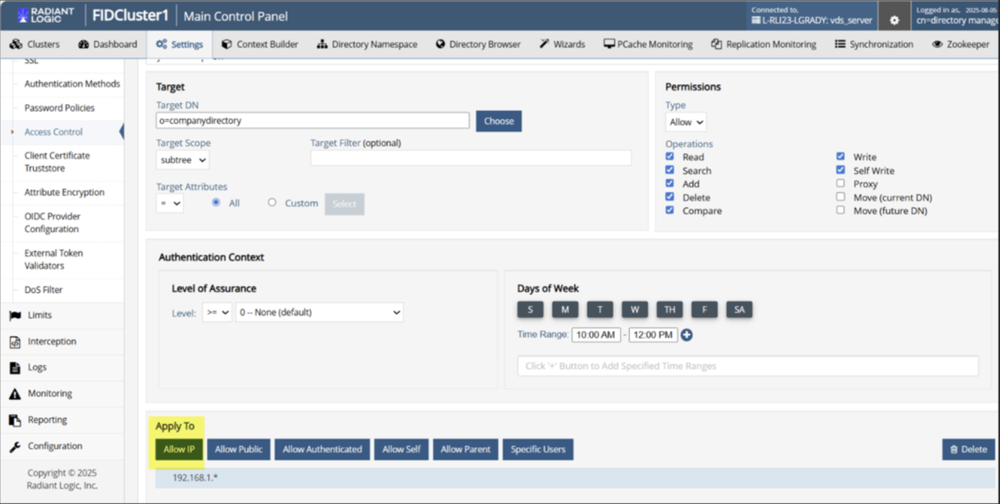  | SaaS customers will need to request support for it to be configured by Radiant Logic SaaS team. Self-managed Identity Data Management customers can configure it directly. | SaaS: Supported with customization; Self-managed: Supported |
| Security Settings – Mutual Authentication | Check Security Settings for “REQUIRED” or “REQUESTED.”  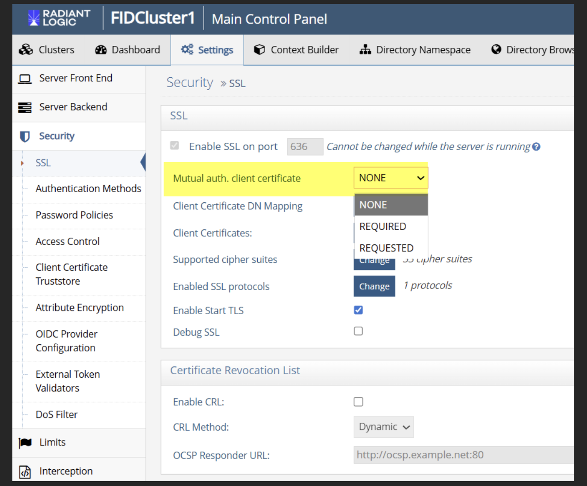 | It can be configured by Radiant Logic SaaS team upon request; Self-managed Identity Data Management customers can configure it directly. | Supported in both SaaS and Self-managed Identity Data Management |
| Security Settings – Role Mapped Access in Proxy Views of LDAP | Review proxy view settings for role mapping. | Contact Support for alternatives. | Deprecated in both SaaS and Self-managed Identity Data Management |
| Security Settings – CRL | Check CRL configuration in Security Settings.  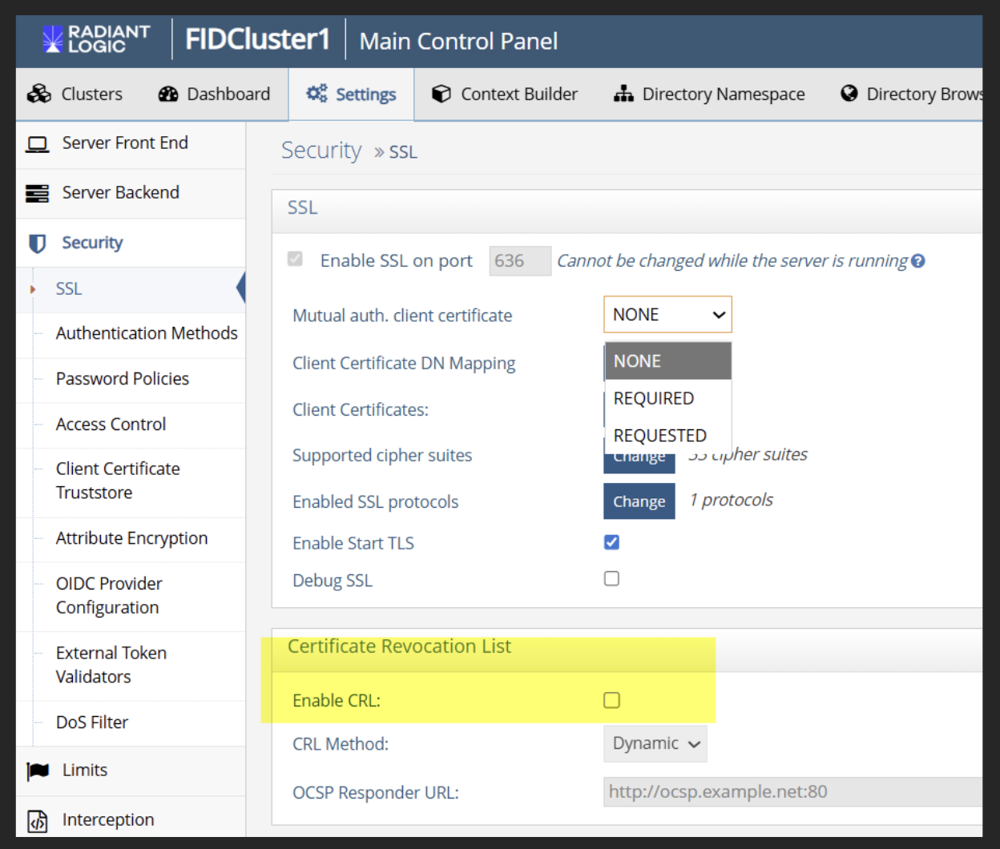 | It can be configured by Radiant Logic SaaS team upon request; Self-managed Identity Data Management can configure it directly. | Supported in both SaaS and Self-managed Identity Data Management |
| Authentication – NTLM | Review authentication configuration.  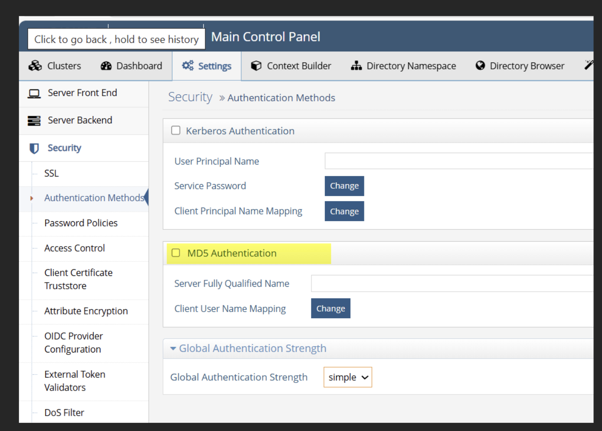 | Contact Support if in use. | Not supported in SaaS or Self-managed Identity Data Management |
| Authentication – Kerberos | Review authentication configuration.  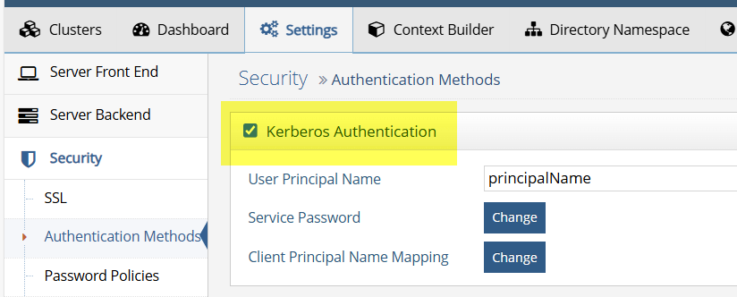 | Contact Support if in use. | Not supported in SaaS or Self-managed Identity Data Management |
| AD Password – Caching AD Passwords | No UI setting; contact Support if you are unsure about its usage. | None if unused. | SaaS: Supported via SDC; Self-managed Identity Data Management: Not supported |
| AD Password – Sync to Entra ID | No UI setting; contact Support if you are unsure about its usage. | Contact Support; requires Windows, not supported yet. | Not supported in SaaS or Self-managed Identity Data Management |
| AD Password – Password Filter | No UI setting; contact Support if you are unsure about its usage. | Contact Support; update planned for v8.1. | Not supported until update (SaaS & Self-managed Identity Data Management) |
| Wizard – Directory Tree Wizard | Check if used in workflows.  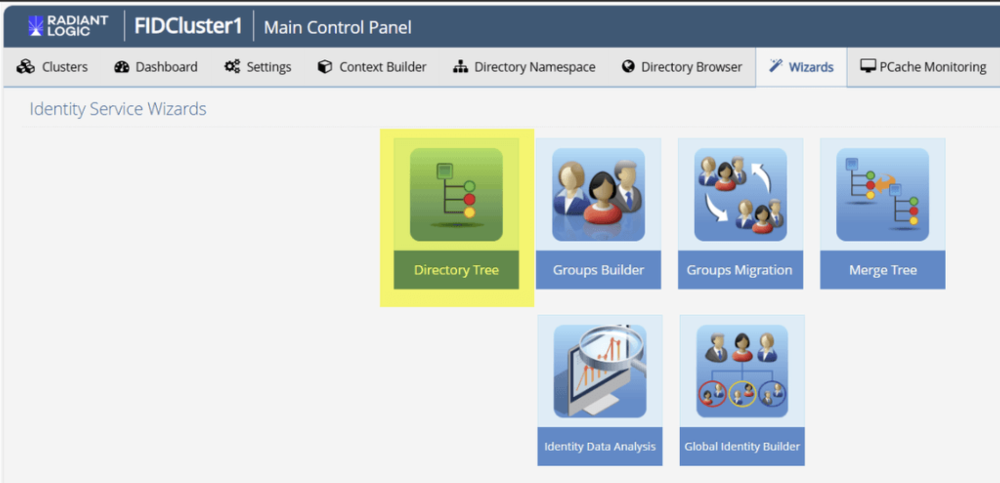 | Contact Support for updated processes. | Deprecated in both SaaS and Self-managed Identity Data Management |
| Wizard – Groups Builder Wizard | Check if used in workflows.  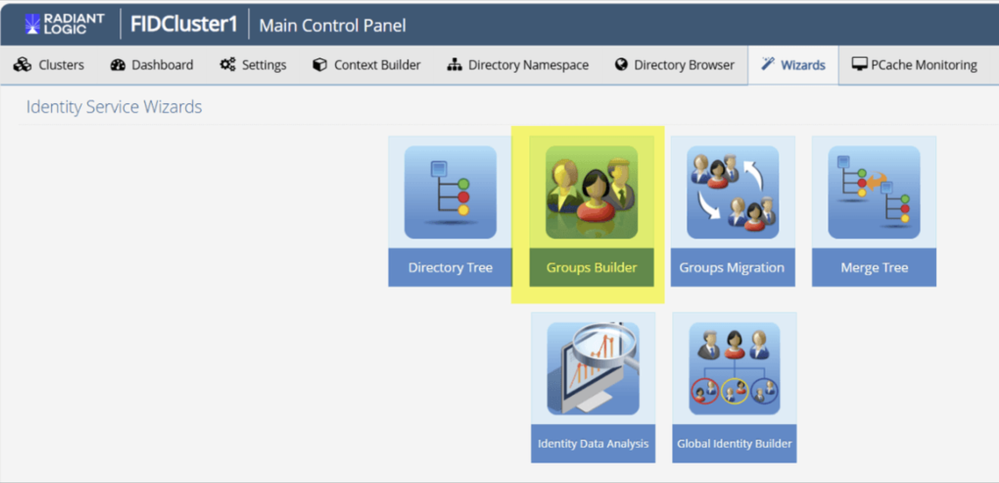 | Contact Support for updated processes. | Deprecated in both SaaS and Self-managed Identity Data Management |
| Wizard – Groups Migration Wizard | Check if used in workflows.  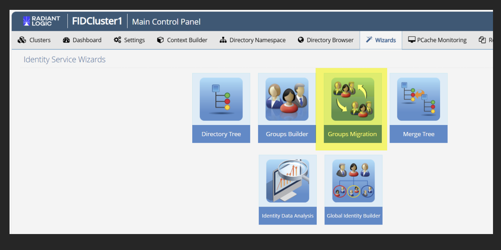 | Contact Support for updated processes. | Deprecated in both SaaS and Self-managed Identity Data Management |
| Wizard – Merge Tree Wizard | Check if used in workflows.  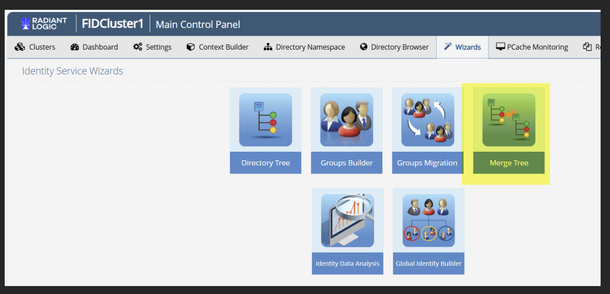 | Contact Support for updated processes. | Deprecated in both SaaS and Self-managed Identity Data Management |
| Radiant SSO – CFS | No UI setting; contact Support if you are unsure about its usage. | No action needed if it is not being used. | Not available in SaaS or Self-managed Identity Data Management |
| Logging – Log2DB | No UI setting. Check logging configuration for database storage. | Migrate to fluentd/ElasticSearch. SaaS customers can view logs in Environment Operations Center. Self-managed Identity Data Management customers can [setup their own logging system](../../../v8.1/installation/metrics-and-logging/). | SaaS: Supports fluentd/ElasticSearch; Self-managed: Supports logging via customers' own logging system. |
| Reporting – Access, Audit, Groups Audit Reports | Check if reports are used.  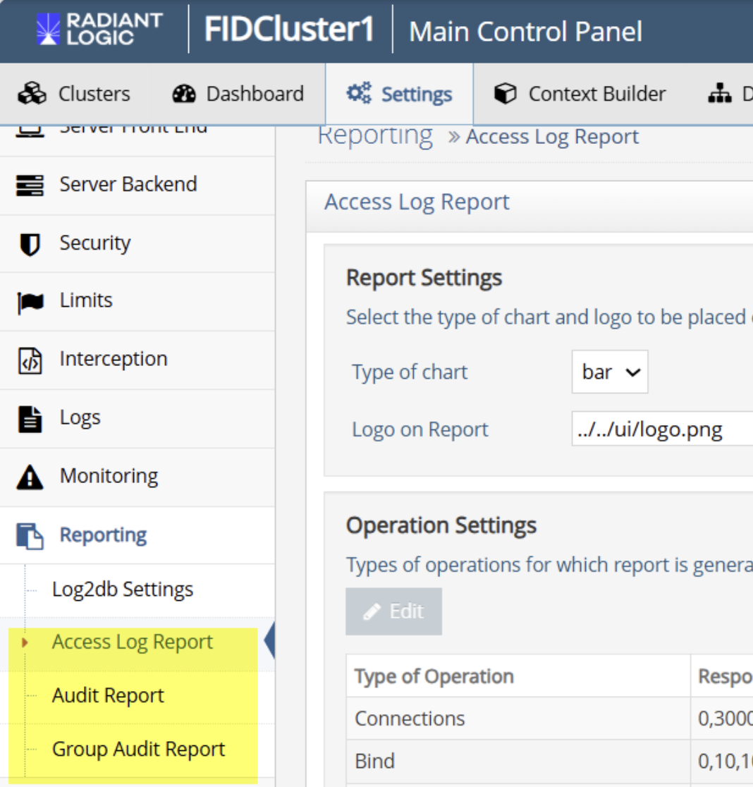  | Self-managed customers will need to  use Prometheus (15.13.0+) and optionally Grafana (6.40.0+) and generate their own reports based on [metrics](../../../v8.1/installation/metrics-and-logging/). SaaS customers can view reports in Environment Operations Center. | Supported in both but infrastructure has changed. |

