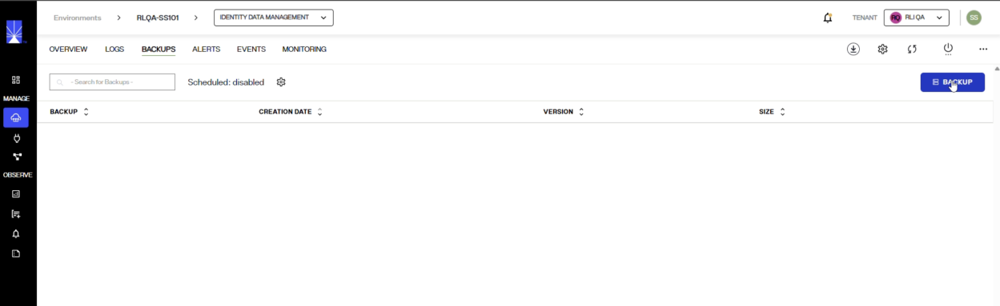
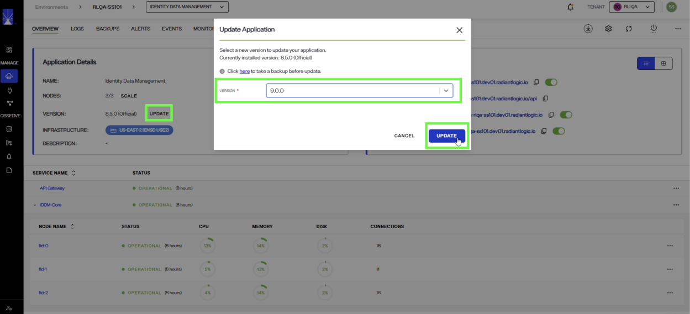
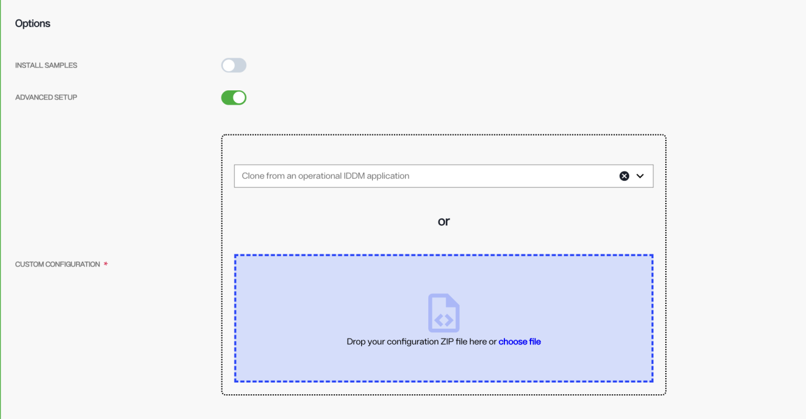

## Overview

This document explains how to patch an environment from RadiantOne Identity Data Management v8 to v9 on a SaaS deployment. The steps vary depending on how you have deployed the application. 

Updating from v8 to v9 is triggered like a typical patch. However, there are a few differences that you should be aware of. Read *Main differences in v9* before you begin and plan a maintenance window.

> If you have multiple clusters deployed in SaaS, contact Radiant Logic Support with your planned maintenance window so your client traffic can be redirected to your failover cluster while your primary cluster is being updated. Even if you only have a single cluster deployed, it is highly recommended to contact Radiant Logic Support to notify them about your planned maintenance window for updating, so staff can be available to assist with any issues you encounter.

### Main differences in v9

v9 updates the platform from Java 8 to Java 25 and from Lucene 6 to Lucene 10. Lucene is the storage engine behind RadiantOne Directory, and the v10 index format cannot be read by a v6 engine. As a result, the update is not an image swap like typical updates/patches: every RadiantOne Directory store is exported to LDIF on the old version and rebuilt on the new version. This is automatically handled during the patching process but requires all cluster nodes to be stopped at the same time.

## Updating SaaS Deployments

The following steps describe how to update RadiantOne Identity Data Management v8 to v9.0.0 for SaaS deployments.

### Preparing for the Update

**1. Confirm your current version is 8.5.0 or newer.**

In Environment Operations Center, navigate to **Environments > [EnvironmentName] > OVERVIEW** tab and check the version under **Application Details**.

Environments on 8.1.x or 8.3.x must first update to 8.5.0 or newer. Apply patch updates until you reach 8.5.x, confirm the application returns to **Operational**, then continue.

**2. Create a backup.**

Prior to updating RadiantOne Identity Data Management, ensure you have a recent environment backup for your existing v8.5.x version.

1. In Environment Operations Center, navigate to **Environments > [EnvironmentName] > BACKUPS** tab.
2. If you do not have any recent backups, click **Backup**.

   

3. Enter a backup file name (there is a default auto-prefix) and click **SAVE**. This process takes a few minutes. Ensure the backup file shows in the list of backups before updating.
4. Download the backup file and save it to your device. You can use this backup to do any of the following if needed:

   i. Installing Identity Data Management v9 in a new environment [with existing configurations saved in your backup](../../../eoc/latest/environments/applications/applications-overview/#custom-configuration). 

   ii. Rolling back to your older version by installing a new v8 Identity Data Management application that references the backup file in the Advanced Setup, CUSTOM CONFIGURATION.

   > A 9.x backup can't be restored into a 8.x deployment.

**3. Confirm the application is active.**

If the status of the application is OFFLINE, the UPDATE option is not displayed. Restart the application first.

**4. Plan a maintenance window.**

All nodes stop during the update, so only run the update during a scheduled maintenance window. See [Expected downtime](#expected-downtime) section below.

> If you have multiple clusters deployed in SaaS, contact Radiant Logic Support with your planned maintenance window so your client traffic can be redirected to your failover cluster while your primary cluster is being updated. Even if you only have a single cluster deployed, it is highly recommended to contact Radiant Logic Support to notify them about your planned maintenance window for updating, so staff can be available to assist with any issues you encounter.

### Applying the Update

1. In Environment Operations Center, navigate to **Environments > [EnvironmentName] > OVERVIEW** tab.
2. In the Application Details section, click **UPDATE** next to the VERSION.

   

3. Select **v9.0.0** from the drop-down list and click **UPDATE**. This version must be greater than the version currently installed.
4. Click **UPDATE** again to confirm.

The application status displays as UPDATE APPLICATION while the update runs. Do not restart, stop, or re-update the environment while the update is in progress.

If the update succeeds, a success notification is displayed and the application status changes to **Operational**. If it fails, an error notification is displayed and the status changes to **Update Failed**; if this happens, contact Radiant Logic Support with the environment name and the time of the attempt.

You can view the result from **Environments > [EnvironmentName] > OVERVIEW > View Version History**, which lists the version number, the date applied, and the user who applied it.

### Expected Downtime

This is not a rolling update of each cluster node independently. All cluster nodes are stopped during the update. The update runs in the following order:

1. All RadiantOne Identity Data Management nodes stop.
2. Every RadiantOne Directory store is exported to LDIF on the old version.
3. fid-0 node starts with v9 and imports the LDIF, rebuilding each store.
4. The follower nodes start and rebuild their data from the fid-0 directory store images.

All endpoints (LDAP, REST/ADAP, SCIM) and the Control Panel are unavailable for the whole update window. The duration depends on the size of your stores (entry counts, number of stores, and indexes to rebuild). Where possible, run the update in a lower environment with a representative data set first and size your production window downtime from the measured time.

### After the Update

1. Confirm the version under Application Details reads 9.0.0 and the status is **Operational**.
2. Confirm all expected nodes are present and healthy.
3. Test Control Panel login and LDAP, REST/ADAP and SCIM access from a client.
4. (Optional) if you had your client traffic redirected to a failover cluster during the update, contact Radiant Logic Support to have your traffic redirected back to your primary cluster and proceed to update your failover cluster to v9.

### Reverting to v8

An environment cannot be downgraded in place, and a 9.x backup cannot be restored into a v8.x environment. If you need to revert to v8 for some reason, you will need to create a new environment and use your last v8 backup zip file in the advanced setup option.

Additionally, you might need to perform these steps after the v8 application is operational:

1. Rebuild persistent caches and repopulate excluded data, such as inactive stores and cn=queue.
2. Reapply configuration changes made after the backup.
3. Verify data and application access.
4. Update client endpoints and, if applicable, the OIDC callback URL.
