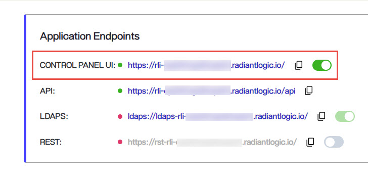
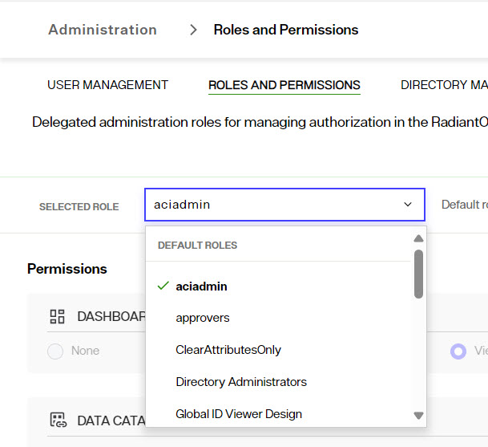
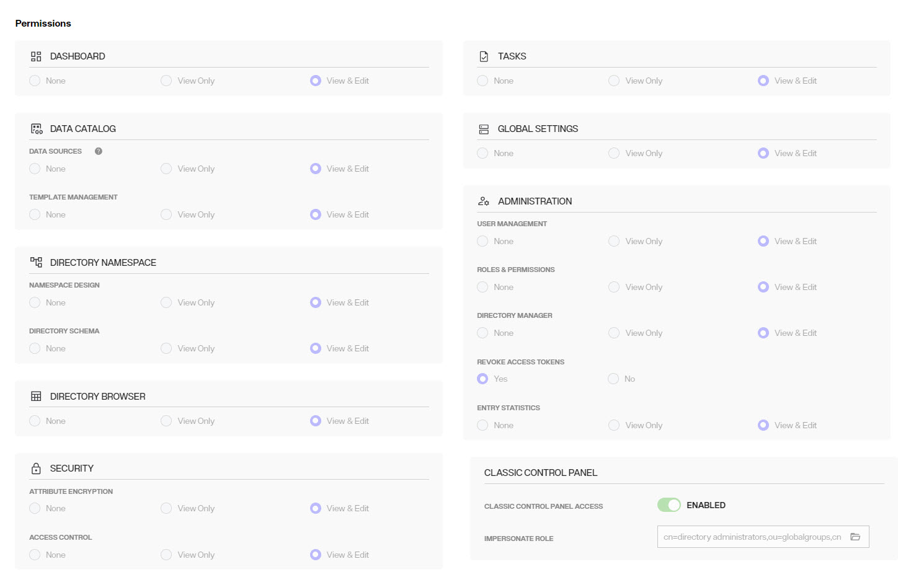
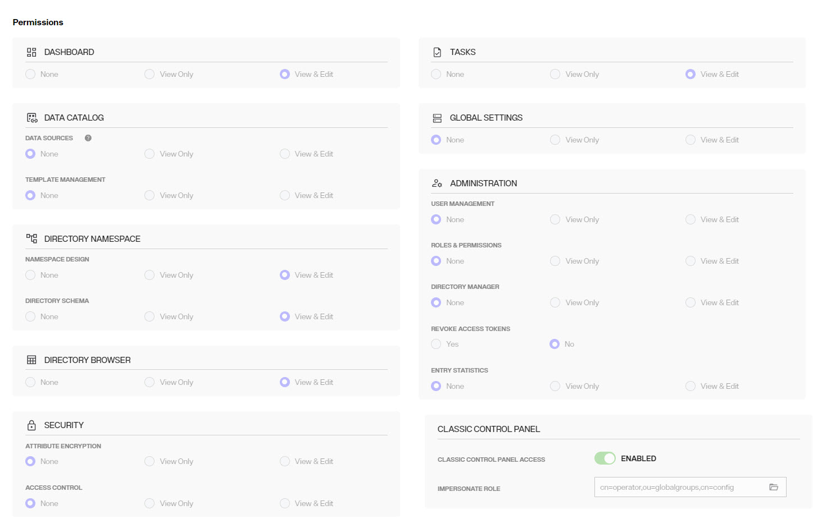
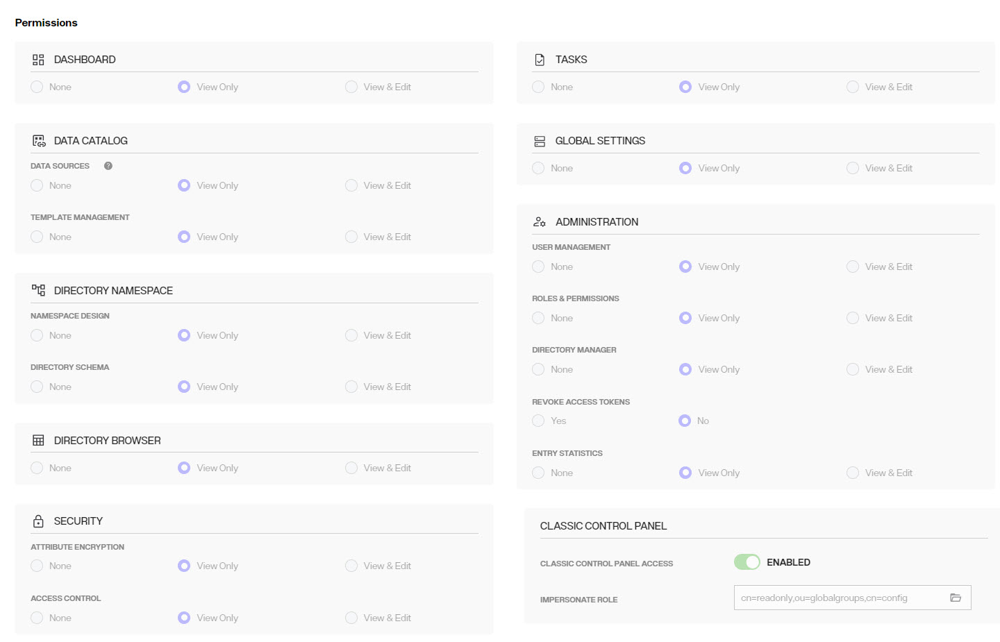
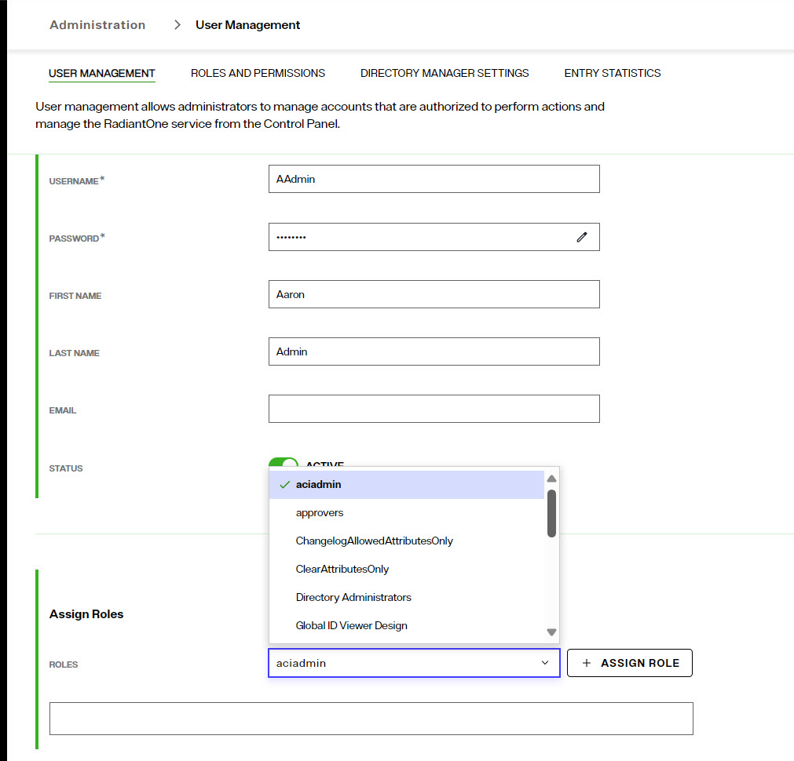

## Overview

The process from upgrading from RadiantOne Identity Data Management v8.0.2 to v8.1.0 is described below. If you are running a version prior to v8.0.2, you must first update to this version.

## Prerequisites

In Environment Operations Center, navigate to your Identity Data Management environment and go to the **BACKUPS** section.  Ensure you have a recent backup of your application. If not, click **BACKUP** to create one and download this image to a safe place.

## Upgrade Process

1. In Environment Operations Center, navigate to your Identity Data Management environment and go to the **OVERVIEW** section.  

1. In the Application Details section, click *Update* next to **VERSION**.

1. Choose v8.0.3 (Official) from the list of options.

1. After the application is updated to v8.0.3, follow this same process to update to v8.1.0 (Official).

## Next Steps

Review the following sections for the next steps to using the v8.1 Control Panel.

### Control Panel Endpoint

The new Control Panel endpoint is listed in Environment Operations Center > Environments > Environment Name > Overview > Application Endpoints. 

  

Connect to this endpoint and login as the directory manager with the password you defined during the environment creation.

### Configure Delegated Administrators 

There are new Control Panel entitlements in v8.1. There are two aspects to take into consideration:  

To continue to use the delegated admin roles applicable to the Classic (old) Control Panel in the new Control Panel, update them to assign permissions for the new Control Panel. Log into the Control Panel as the Directory Manager (configured when you create the environment in EOC) and go to ADMIN > Roles and Permissions. Select a role from the list and enable the needed permissions. 

The default list of delegated admin roles and the permissions that are equivalent for the new control panel are as follows. Update your default roles with the same permissions shown in the screenshots: 

 
**ACIADMIN** 
 
 
 
**DIRECTORY ADMINISTRATORS** 

 

 **ICSADMIN** 

 
**ICSOPERATOR** 

 

**NAMESPACEADMIN** 

 

**OPERATOR** 

 

**READONLY** 

 
 
**SCHEMAADMIN** 

 
 

To properly assign new users to delegated admin roles, log into the Control Panel as the Directory Manager (configured when you create the environment in EOC) and go to ADMIN > USER MANAGEMENT.  Search for the delegated admin user account and assign the user to the new role.  

   

>[!note] – if the default roles are inadequate, you can create new roles from the ROLES and PERMSSIONS tab. Do this first and then search for/assign the user to the role. Also, if the user should be able to switch to/configure settings in the Classic Control Panel, the new role MUST have the “Classic Control Panel Access” permission enabled, and the group associated with this role for entitlement enforcement for the classic control panel selected. 

 

### Create a Root Naming Context to Manage Unmounted Identity Views 

The new Control Panel does not have Context Builder. Therefore, only identity views that have been mounted somewhere below a root naming context are editable. Any identity views that were not mounted cannot be edited until they are mounted.  Create a new Root Naming Context from Control Panel > Manage > Directory Namespace > Namespace Design and then mount a label below the naming context for each identity view you want to mount. 

  

Once all labels are created, use the “MOUNT BACKEND” button at each label level and choose the Virtual Tree type, selecting the identity view (.dvx file) to mount: one identity view per label. 

This will allow you to edit the identity view configuration using the PROPERTIES, ADVANCED SETTINGS and OBJECT BUILDER tabs. 

## How to Report Problems and Provide Feedback 

Feedback and problems can be reported from the Support Center/Knowledge Base accessible from: https://support.radiantlogic.com 

If you do not have a user ID and password to access the site, please contact support@radiantlogic.com. 
