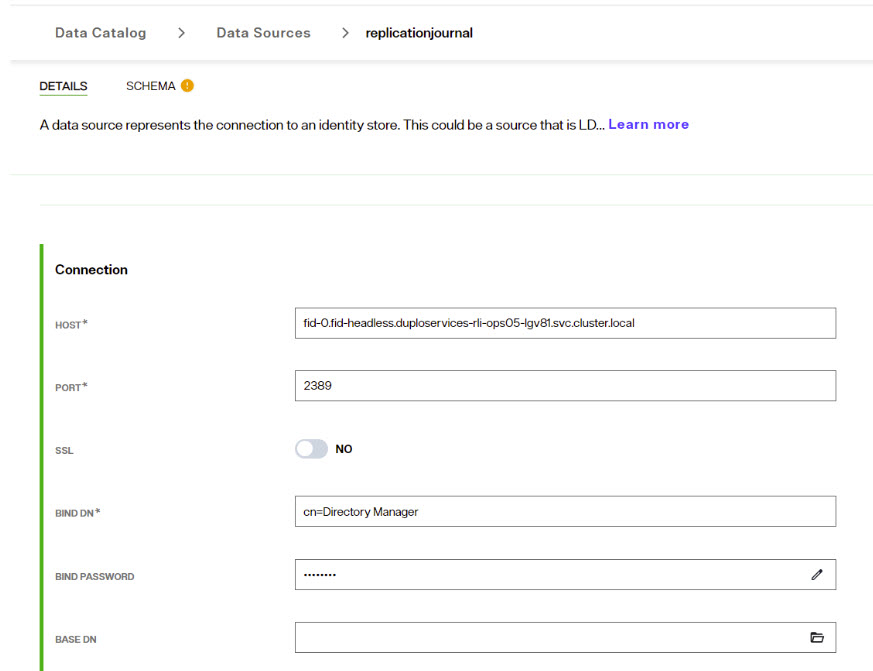

## Overview

The process from upgrading from RadiantOne Identity Data Management v7.4.10 to v8.1.0 is described below. If you are running a version prior to v7.4.10, you must first update to this version.

## Steps to Perform on the v7.4 Environment 

The section describes the processes of backing up and exporting your RadiantOne v7.4 configuration and backing up existing stores and ACIs.  

### Backup Configuration 

Stop the RadiantOne service (to ensure no files are locked/in use) and from the file system, make a copy of the whole <RLI_HOME> directory and store in a safe place. 

### Backup Existing RadiantOne Directory (HDAP) Stores 

To back up naming contexts defined as RadiantOne Directory (HDAP) stores, perform the following steps for each of your HDAP stores. Note that in v8.1, HDAP stores are referred to as RadiantOne Directory stores. 

1. On the Control Panel, log in as a user associated with the Directory Administrator role.  

1. On the Directory Namespace tab, select your HDAP store. HDAP stores are identified with a  icon. 

1. In the right pane, in the Properties tab, click Export. The Export box is displayed.  

1. Enter an export file name. 

1. Check the Export for Replication box (to ensure the UUID attribute remains with the entries).  

1. Click OK. The Tasks Launched window opens.
   

1. Once the export finishes, click OK to close the Tasks Launched window. You are returned to the store’s Properties tab.  

1. Repeat steps 2-7 for each RadiantOne Directory (HDAP) store. 

1. Copy the LDIF files from <RLI_HOME>/vds_server/ldif/export to a safe place outside of the <RLI_HOME> location. 

### Disable Inter-cluster Replication 

Disable inter-cluster replication for RadiantOne Directory (HDAP) and Persistent Cache stores. 

To disable inter-cluster replication: 

1. On the Control Panel > Directory Namespace tab, expand below . 

1. Select the cached naming context.  

1. On the Properties tab, uncheck the Inter-cluster Replication.
 

1. Click Save. 

1. On the Control Panel > Directory Namespace tab, select the RadiantOne Directory (HDAP) store naming context. 

1. On the Properties tab, uncheck Inter-cluster Replication. 

1. Click Save. 

 

### Backup Persistent Cache Stores 

Persistent caches must be re-initialized manually after migrating to SaaS. Even if you choose to re-initialize the persistent caches from scratch in SaaS, it is always good to have a backup of the cache image from v7.4. 

To back up a persistent cache store:  

1. On the Control Panel > Directory Namespace tab, expand below . 

1. Under the Cache node in the left pane, select a cache to back up. The two types of persistent cache are listed below.  

Icon	 | Cache Type
-|-
 | Persistent cache with periodic refresh 

 | Persistent cache with near real-time automated refresh 

1. In the right pane, in the Properties tab, click Export. 

1. Enter an export file name. 

1. Check the Export for Replication box (to ensure the UUID attribute remains with the entries).  

1. Click OK. The Tasks Launched window opens. 

1. Once the export finishes, click OK to close the Tasks Launched window. You are returned to the cache’s Properties tab.  

1. Repeat steps 2-7 for each persistent cache branch. 

1. Copy the LDIF files from <RLI_HOME>/vds_server/ldif/export to a safe place outside of the <RLI_HOME> location. 

 

### Backup ACLs 

To back up ACLs: 

1. On the Control Panel > Directory Browser tab, right-click on the cn=config node. 

1. Select LDIF -> Export to LDIF.    

1. Enter a file name for the ldif file (overwrite the default untitled) and click Confirm.  

1. An export task is launched in the background. To view the task, go to the Server Control Panel associated with the RadiantOne node you are exporting from > Tasks tab. Check the “Terminated” option to view all tasks. Confirm the task “Export To LDIF [config] has FINISHED successfully. 

1. Copy the LDIF files from <RLI_HOME>/vds_server/ldif/export to a safe place outside of the <RLI_HOME> location. 

### Export Existing Configuration 

Download the migration utility v2.1.X from the Radiant Logic support site and unzip it on the source v7.4 machine (the node from where you are exporting).  

Create an account here: https://radiantlogicinc246.sharefile.com/i/i1bc2de34c6e42bba 

If you already have a Sharefile account, you can login here: https://radiantlogicinc246.sharefile.com/ 

Once logged in, navigate to: Customer Downloads/MigrationUtility/Migration Utility v2.1 

Download the migration utility version that matches the last digit of your patch release number. For example, if you are running v7.4.9, use migration utility version: radiantone-migration-tool-2.1.9.zip. 

**Specifying RLI_HOME** 

If you do not have an RLI_HOME system environment variable set on your v7.4 machine, you must pass the location where you have RadiantOne installed when you run the Migration Utility. 

An example of exporting configuration on Linux where RadiantOne is installed in /home/r1user/radiantone/vds, can be seen below. 

 ./migrate.sh /home/r1user/radiantone/vds export test2.zip 

 
1. On the machine where you are exporting the configuration from, run <RLI_HOME>/bin/advanced/stop_servers.bat (.sh) to stop the RadiantOne services. 

1. Run <RLI_HOME>\bin\runZooKeeper.bat (.sh) to start ZooKeeper. 

1. From a command prompt navigate to the location where you unzipped the migration utility v2.1.X.  

>[!warn] If performing the export on Windows, run the command line as Administrator (right-click on the .exe and choose Run as Administrator option).  

1. Run the following command (modifying the version of the migration tool and the location of the export file to match your needs). 
C:\r1\migration\radiantone-migration-tool-2.1.9\migrate.bat export C:/tmp/export.zip 

## Steps to Perform for your SaaS Deployment in Environment Operations Center 

Log into your Environment Operations Center. The credentials were sent to you during your onboarding process.

Use the Environment Operations Center to create an environment and install RadiantOne Identity Data Management version v8.0.2 and import the configuration that was exported from the v7.4 machine using the CUSTOM CONFIGURATION option. For assistance see: [Creating Environments](https://developer.radiantlogic.com/eoc/latest/environments/environment-overview/create-environments/#advanced-setup)

>[!note] Production SaaS environments are created with 2-node RadiantOne clusters. If your RadiantOne cluster requires more nodes, you can manually scale up the application once it is deployed. 

## Upgrade Process

Once the SaaS environment is ready, navigate to the environment > OVERVIEW section. In the Application Details section click UPDATE and choose v8.0.3 (official) for the version. 

After the update completes, navigate to the environment > OVERVIEW section. In the Application Details section click UPDATE and choose v8.1.0 (official) for the version. 

## Next Steps

Review the following sections for the next steps to using the v8.1 Control Panel.

### Create Secure Data Connector 

To connect to data sources that are not directly accessible from the SaaS environment, create a Secure Data Connector group and add a data connector in Environment Operations Center.  

Once a secure data connector has been created in Environment Operations Center, the SDC client must be deployed on your local system before you can establish a connection. For assistance see: [Creating Environments](https://developer.radiantlogic.com/eoc/latest/secure-data-connector/configure-sdc-service/)
 

### Control Panel Endpoint

The new Control Panel endpoint is listed in Environment Operations Center > Environments > Environment Name > Overview > Application Endpoints. You can enable the LDAPS and REST endpoints from here as well. 

  

Connect to this endpoint and login as the directory manager with the password you defined during the environment creation.

### Validate Data Sources

Check the data sources to make sure they point to the desired servers (and failover servers if applicable). For example, if you are using inter cluster replication, verify that the replicationjournal LDAP data source points to the correct journal. You can check your data sources from the Control Panel > Setup > Data Catalog > Data Sources. If you were connecting to backend data sources via SSL, make sure your certificates were migrated over successfully and that they are still valid from Control Panel > Global Settings > Client Certificates. 

### Update Data Source Connections to use Secure Data Connector (where applicable) 

In the Control Panel > Setup > Data Catalog > Data Sources, select your data source.  

In the Secure Data Connector Group drop-down list, select the secure data connector that should be used to tunnel a secure connection to the data source. 

  

### Initialize Persistent Cache 

When you log into the Control Panel > Manage > Directory Namespace > Namespace Design, you should see the naming contexts that were migrated from v7.4. Select the naming context that has a cache defined and go to the CACHE TAB to edit/reinitialize the cache. You must do this for every imported naming context that has a cache defined. 

Stop all persistent cache refreshes (if they are running) and deactivate the cache.  Once the cache refresh has been stopped and the cache deactivated, go through the configuration process.  This can be done from Control Panel > Setup > Directory Namespace > Namespace Design. Select the root naming context and click the CACHE tab. Use the ... menu inline with the cached subtree to deactivate the cache.  Use the ... menu inline with the cache and choose Edit to go through the configuration process. In the CONFIGURE section, choose and configure the refresh strategy. Then, in the INITIALIZE section, initialize the cache. Finally, manage the cache properties from the MANAGE PROPERTIES section. 

  

### Perform Upload for Global Identity Builder Projects 

If you had Global Identity Builder projects in v7.4, you must re-upload in the Global Identity Builder project the identity sources in your SaaS environment. If the Global Identity Builder project has identity sources that are based on persistent cache, make sure these caches are reinitialized in SaaS before re-uploading the global profile. 

To edit Global Identity Builder projects in SaaS, from the Control Panel switch to Classic Control Panel and navigate to the Wizards tab. 

### Re-enable Inter-cluster Replication 

Once all of your clusters have been moved to SaaS (create a different environment in Environment Operations Center for each), re-enable inter-cluster replication for all needed RadiantOne Directory (HDAP) stores and persistent caches. Verify the replicationjournal LDAP data source indicates the correct cluster (that plays the role of the replication journal). 

In the Control Panel > Setup > Data Catalog > Data Sources, select the replicationjournal data source. View the DETAILS section for this data source and ensure it points to the correct environment endpoint. 

  

Notice in the screenshot above, the syntax references the local node (internal name) as the replicationjournal. For other environments/clusters to reference this cluster as the replicationjournal, they should use the LDAPS endpoint (which you can view in Environment Operations Center > Environment Name > Overview. 

### Configure Delegated Administrators 

There are new Control Panel entitlements in v8.1. There are two aspects to take into consideration:  

To continue to use the delegated admin roles applicable to the Classic (old) Control Panel in the new Control Panel, update them to assign permissions for the new Control Panel. Log into the Control Panel as the Directory Manager (configured when you create the environment in EOC) and go to ADMIN > Roles and Permissions. Select a role from the list and enable the needed permissions. 

The default list of delegated admin roles and the permissions that are equivalent for the new control panel are as follows. Update your default roles with the same permissions shown in the screenshots: 

 
**ACIADMIN** 
 
 
 
**DIRECTORY ADMINISTRATORS** 

 

 **ICSADMIN** 

 
**ICSOPERATOR** 

 

**NAMESPACEADMIN** 

 

**OPERATOR** 

 

**READONLY** 

 
 
**SCHEMAADMIN** 

 
 

To properly assign new users to delegated admin roles, log into the Control Panel as the Directory Manager (configured when you create the environment in EOC) and go to ADMIN > USER MANAGEMENT.  Search for the delegated admin user account and assign the user to the new role.  

   

>[!note] – if the default roles are inadequate, you can create new roles from the ROLES and PERMSSIONS tab. Do this first and then search for/assign the user to the role. Also, if the user should be able to switch to/configure settings in the Classic Control Panel, the new role MUST have the “Classic Control Panel Access” permission enabled, and the group associated with this role for entitlement enforcement for the classic control panel selected. 

 

### Create a Root Naming Context to Manage Unmounted Identity Views 

The new Control Panel does not have Context Builder. Therefore, only identity views that have been mounted somewhere below a root naming context are editable. Any identity views that were not mounted cannot be edited until they are mounted.  Create a new Root Naming Context from Control Panel > Manage > Directory Namespace > Namespace Design and then mount a label below the naming context for each identity view you want to mount. 

Once all labels are created, use the “MOUNT BACKEND” button at each label level and choose the Virtual Tree type, selecting the identity view (.dvx file) to mount: one identity view per label. 

   

This will allow you to edit the identity view configuration using the PROPERTIES, ADVANCED SETTINGS and OBJECT BUILDER tabs. 

  

### Migrating Custom Objects and Interception Scripts 

To migrate custom objects and/or interception scripts, use the File Manager in the SaaS environment to upload the files from the following folders. 

For custom data sources, from your v7.4 backup location, upload the <RLI_HOME>\vds_server\custom\src\com\rli\scripts\customobjects\<files> to the  <RLI_HOME>\vds_server\custom\src\com\rli\scripts\customobjects folder and overwrite the target files.  From the Control Panel, use the “Logged in...” account menu and choose: Open Classic Control Panel. 

 

In the Classic Control Panel, navigate to Settings > Configuration > File Manager. In File Manager, navigate to vds_server > custom > src > com > rli > scripts > customobjects and click Upload Files. Navigate to the corresponding location from your v7.4 backup and upload your files.  

For interception scripts, from your v7.4 backup location, upload the files from <RLI_HOME>\vds_server\custom\src\com\rli\scripts\intercept\<files> to the  <RLI_HOME>\vds_server\custom\src\com\rli\scripts\intercept folder and overwrite the target files. If custom libraries are used, upload the <RLI_HOME>\vds_server\custom\lib\<files> from your v7.4 backup to the <RLI_HOME>\vds_server\custom\lib folder in File Manager and overwrite the target files. 

After the files are uploaded, choose Build > Build All Jars in File Manager.  You can be more selective and just choose to build the Intercept Jars and Custom Jars instead of all jars. 

>[!note] If the build fails, you must investigate further to ensure you are only including libraries that are needed. Any extra, unused libraries can cause the build of the jars to fail. 

Restart the RadiantOne service using Environment Operations Center. Navigate to Environments > *Environment_Name* > OVERVIEW and use the following menu: 

This performs a rolling restart of all RadiantOne cluster nodes for the new scripts to take effect. 

## How to Report Problems and Provide Feedback 

Feedback and problems can be reported from the Support Center/Knowledge Base accessible from: https://support.radiantlogic.com 

If you do not have a user ID and password to access the site, please contact support@radiantlogic.com. 
