## Overview

This guide describes how to migrate a RadiantOne Identity Data Management v7.4 deployment to self-managed v9.0.0.

The migration is performed by creating a new v9 deployment alongside the existing v7.4 deployment. The existing v7.4 deployment is not upgraded in place.

To migrate to v9, you must:

- First, use the Migration Utility to export the configuration from the existing v7.4 environment.
- Then, install v9 as a separate deployment and use the exported configuration during the v9 installation.

The target deployment can be either v9 SaaS or v9 self-managed. The export procedure from the existing v7.4 environment is the same for both deployment models.

The existing v7.4 deployment is not modified during the migration and can continue serving clients while the new v9 deployment is installed, configured, and validated.

Before beginning the migration:

- Review **Key Differences between v7.4 and v9** below to understand changes that may affect your deployment.
- Plan a configuration freeze on the v7.4 environment after the migration export is created. Configuration changes made after the export are not automatically carried over to the v9 deployment.
- Plan a maintenance window for the final cutover, when production clients and traffic are redirected from the existing v7.4 deployment to the new v9 deployment.

## Key Differences between v7.4 and v9

RadiantOne Identity Data Management v9 includes significant changes to the underlying platform and deployment architecture that affect how a v7.4 deployment is migrated.

### Java and Directory Storage

v9 updates the platform from Java 8 to Java 25 and from Lucene 6 to Lucene 10. Lucene provides the underlying index format used by RadiantOne Directory, and Lucene 10 cannot directly read the Lucene 6 indexes used by v7.4.

As a result, RadiantOne Directory data is not migrated by copying the existing index files. Instead, the directory data is exported from v7.4 and rebuilt in the new v9 deployment as part of the initial installation.

This is also why the v7.4 migration export is provided when the new v9 deployment is created rather than restored into an already running v9 deployment.

### Kubernetes-Based Deployment

v9 is deployed as containers on Kubernetes. It can be deployed either as:

- **RadiantOne SaaS**, managed by Radiant Logic.
- **Self-managed**, installed on a Kubernetes cluster using the Identity Data Management Helm chart.

The v7.4 deployment model of installing RadiantOne directly on hosts, using an `<RLI_HOME>` directory, and configuring cluster nodes individually no longer applies.

For self-managed deployments, you will need to configure the number of RadiantOne nodes through the [Helm chart](#) using properties such as `replicaCount`. In SaaS deployments, the underlying Kubernetes infrastructure, deployment, and scaling configuration are managed by Radiant Logic.

### Service Architecture

In v9, functionality that was previously provided within the v7.4 deployment is distributed across multiple containerized services running as Kubernetes pods.

You will see pods for these services such as: `api-gateway`, `authentication`, `data-catalog`, `directory-browser`, `directory-namespace`, `fid-X`, `iddm-proxy`, `iddm-sync`, `iddm-ui`, `settings`, `system-administration`, `zipkin`, and `zookeeper-X`.

The `fid-X` pods run the core RadiantOne server and directory engine.

Monitoring, alerting, health checks, and operational procedures carried over from v7.4 should be reviewed and updated to account for the v9 service and pod architecture.

**Note:** Starting with v9, the Helm chart version matches the product version. For example, to install IDDM 9.0.0, specify `--version 9.0.0`.

## What the Migration Export Includes

The Migration Utility creates a single `.zip` archive containing the v7.4 configuration and supported RadiantOne Directory Store data required to initialize the new v9 deployment.

### Included in the export

The migration export includes items such as:

- Naming contexts.
- Global syncs.
- Data sources.
- Identity views (`.dvx` files) and their corresponding schemas (`.orx` files).
- Roles and ACLs.
- Configured stores.
- Directory data for RadiantOne Directory stores.

RadiantOne Directory data is exported as data rather than copied as existing Lucene index files. During the v9 deployment, the exported data is imported and the directory indexes are rebuilt using the v9 storage format.

### What is not included

Persistent cache data is not included in the migration export. After the migration is complete and the v9 deployment is running successfully, persistent caches must be re-initialized.

Other items that are not included in the migration export and must be recreated, restored, or otherwise handled separately in v9 include:

- Inactive stores.
- Custom JARs, custom scripts, interception scripts, and any third-party libraries that were added in the v7.4 deployment.
- TLS certificates, keystores, and external trust configuration from the v7.4 hosts.
- Configuration or data changes made in v7.4 after the migration export was created.

For a complete list of items that are not migrated, see **Items Not Migrated** (https://developer.radiantlogic.com/idm/v7.4/migration-utility/04-items-not-migrated/) in the v7.4 Migration Utility documentation.

## Prerequisites

Before beginning the migration, verify that the source v7.4 deployment and the target v9 deployment meet the following requirements.

### Source v7.4 deployment

- **RadiantOne Identity Data Management v7.4.10 or later.** Deployments running an earlier v7.4 version must first be upgraded before using the Migration Utility.
- **Migration Utility version 2.1.x**, where x matches the v7.4 patch release number. For example, use `radiantone-migration-tool-2.1.10.zip` with v7.4.10.

Download the Migration Utility from the [Radiant Logic support site](https://files.radiantlogic.com/receive/?packageCode=IX0qTSRyilShjhpxusLWpUDzzb4rduq2tO9F81NhEt4#keycode=Niad1bODfyRmdW8PlGO-5In0mdRKsa0u6551qXXI1rA) and unzip it on the source v7.4 machine (the node from where you are exporting) — under **Customer Downloads > MigrationUtility > Migration Utility v2.1**, download the Migration Utility version 2.1.x, where x matches the v7.4 patch release number. Log in using the email address associated with your Radiant Logic Support Portal account. If you do not yet have access, email support@radiantlogic.com.

- The `RLI_HOME` environment variable must be set, or the path to the v7.4 installation must be provided explicitly when running the Migration Utility.

### Target v9 deployment

The target requirements depend on whether you are migrating to RadiantOne SaaS or a self-managed deployment.

#### Self-managed

For a v9 self-managed deployment, you need:

- **Kubernetes 1.27 or later.** See **Sizing a Kubernetes Cluster** for guidance on cluster sizing.
- **Helm 3.8 or later.**
- **kubectl 1.27 or later**, configured to access the target Kubernetes cluster.
- **An Identity Data Management license key.** New customers receive a license during onboarding. Existing customers can use their current license where applicable. If you encounter licensing issues, open a ticket with Radiant Logic Support.
- **Container registry access and image pull credentials** (`regcred.yaml`) provided by Radiant Logic. Existing customers who do not already have registry credentials can request them through Radiant Logic Support.
- **Storage provisioners and storage classes** configured for the Kubernetes cluster. Common examples include AWS gp2 or gp3 storage classes and Azure Disk.
- **Sufficient CPU, memory, and storage capacity** for the deployment. The default resource values in the Helm chart may not be appropriate for every workload. Resource requirements from an existing v7.4 host should not be used as a direct equivalent for v9 container sizing. Work with your Radiant Logic solutions engineer to determine appropriate sizing for your deployment.
- **Nested virtualization**, only when testing a self-managed deployment using Docker Desktop and when required by the host virtualization environment.

## Preparing the v7.4 Deployment

Complete all the following before running the export.

1. **Back up the entire `<RLI_HOME>` directory** to a safe location outside `<RLI_HOME>`. `<RLI_HOME>` is the file system location of the **root installation directory** where RadiantOne is installed (e.g., `/opt/radiantone/vds` on Linux or `C:\radiantone\vds` on Windows).
2. **Export the RadiantOne Directory (HDAP) stores as LDIF files**, with Export for Replication checked. **Store all LDIF exports outside `<RLI_HOME>`.**
3. **Export the persistent cache stores as LDIF files**, with Export for Replication checked. Persistent cache data is not included in the configuration export, so these LDIF files are the only copy you carry forward.

## Creating the v7.4 Migration Export

Run the Migration Utility from the directory where you extracted it. The utility creates a single `.zip` archive containing the configuration and supported RadiantOne Directory data that will be used to initialize the new v9 deployment.

For a multi-node cluster, run the export from a follower node rather than the leader node. To identify each node's role, run:

```
<RLI_HOME>/bin/advanced/cluster.sh list
```

> **Note:** `<RLI_HOME>` is the file system location of the root installation directory where RadiantOne is installed (e.g., `/opt/radiantone/vds` on Linux or `C:\radiantone\vds` on Windows).

In the command output, a follower node will display `false` in the **ZK leader** column.

### Windows

Run the command from an Administrator command prompt:

```
C:\r1\migration\radiantone-migration-tool-2.1.10\migrate.bat export C:/tmp/export.zip
```

The final argument specifies the path and filename of the migration export to create.

### Linux

If the `RLI_HOME` environment variable is not already set in the environment, provide the path to the v7.4 installation explicitly as shown below:

```
./migrate.sh /home/r1user/radiantone/vds export export.zip
```

The final argument specifies the path and filename of the migration export to create.

### Verify the Export

Before using the export to create the v9 deployment, verify that:

- The Migration Utility completed successfully without errors.
- The `.zip` archive was created at the expected location.
- The archive has a non-zero size and can be opened successfully.
- The archive contains the expected migration content.

Record the date and time the export was created. This timestamp marks the beginning of the configuration and data change freeze: changes made to the v7.4 deployment after this export are not automatically carried over to v9.

Keep the migration export in a secure location until the migration and cutover have been completed successfully. The archive is the source migration artifact used to initialize the new v9 deployment and represents the configuration and supported directory data captured from v7.4 at the time of export.

## Installing the New v9 Deployment

In this step, you will create a new v9 deployment using the migration export generated from v7.4.

The migration export must be supplied when the new v9 deployment is created. It cannot be added to an existing v9 deployment after installation. How you provide the export depends on the target deployment model.

| Target | Export Supplied As | Export Location |
|---|---|---|
| v9 SaaS | Custom configuration file during **Advanced Setup** | Uploaded from your local device |
| v9 self-managed | `fid.migration.url` in values.yaml | Accessible by URL from the Kubernetes cluster |

### Installing v9 in Self-managed

This deployment seeds a new Identity Data Management deployment from a backup of an existing deployment, using the `fid.migration.url` property in values.yaml. The Helm chart downloads and imports the backup automatically during the first startup of the server pod. A v9 deployment can be seeded directly from a 7.4 backup.

This procedure is for a new deployment only. It cannot be used for updates or patches: setting `fid.migration.url` during an update does not trigger a new migration. To change settings on a running deployment, refer to Updating a Deployment.

To create the backup file this procedure uses, refer to Creating backups.

#### 1. Set up the values.yaml file for Helm deployment

Create a values.yaml file. Ensure that it includes at least the following properties. Values such as `storageClass` and `resources` vary by use case, cloud provider, and storage requirements. Work with your Radiant Logic solutions engineer to customize your Helm configuration.

The example below shows the required structure and placeholder values, including the `fid.migration.url` property used to restore from a backup file during this initial installation. It is not a sizing recommendation. Before you deploy, replace `resources`, `FID_SERVER_JOPTS`, and `persistence.size` with the values from the row you select in Sizing the Deployment, replace `fid.migration.url` with the URL of your backup export file, and size `fid.startupProbe.failureThreshold` as described in Sizing the startup allowance below.

Example values.yaml file:

```yaml
replicaCount: 1                 # 1 for testing; 2 or more for production

fid:
  license: >-
    YourLicense
  rootPassword: "Enteryourrootpw"
  migration:
    # Migration file URL to be imported during the first installation (e.g., export.zip)
    url: <URL_TO_YOUR_BACKUP_FILE>
  startupProbe:
    periodSeconds: 20
    failureThreshold: 540

imagePullSecrets:
  - name: regcred

persistence:
  enabled: true
  storageClass: "gp3"
  size: 10Gi

zookeeper:
  persistence:
    enabled: true
    storageClass: "gp3"

resources:
  requests:
    cpu: 4
    memory: 8Gi
  limits:
    cpu: 4
    memory: 8Gi

env:
  INSTALL_SAMPLES: "false"
  FID_SERVER_JOPTS: "-Xms2g -Xmx4g"
```

**Note:** Ensure that both the `migration` and `startupProbe` properties are placed under `fid`. Values placed at the top level are ignored without any warning, and the deployment then starts either empty or with the default five-minute startup allowance.

A complete reference file containing every tunable setting discussed in this document is provided in Complete values.yaml Reference.

**Definitions of the properties:**

- **replicaCount:** Specifies the number of RadiantOne nodes to deploy. Set the value to a minimum of 2 in production environments for high availability.
- **image.tag:** Optional. Leave this unset. The image version comes from `--version`. Set this only if Radiant Logic Support instructs you to use a specific image. A pinned tag is not updated by a later `--version` value and can leave the server on an older version while the other services update.
- **fid.rootUser:** Specifies the RadiantOne root user. Defaults to `cn=Directory Manager`.
- **fid.rootPassword:** Specifies the password for the root user. Set a strong password that meets your corporate security policy. You can update this password after installation if needed.
- **fid.license:** Set your Identity Data Management license key.
- **fid.migration.url:** Specifies the URL of the backup export file (`export.zip`) to import during this initial installation. Ensure the URL points to an HTTP server that is accessible from the Kubernetes cluster and does not require authentication.

  **Note:** The migration property must be `fid.migration.url`. A value placed at `migration.url` is ignored without an error, and the deployment starts empty.

- **fid.startupProbe.periodSeconds / fid.startupProbe.failureThreshold:** Together, these size the startup allowance Kubernetes gives the server pod to download and load the backup before the server starts responding. The default allowance (`periodSeconds: 20`, `failureThreshold: 15`, or 5 minutes) is not sufficient for a backup of any significant size. Leave `periodSeconds` at 20 and increase `failureThreshold`; refer to Sizing the startup allowance below.
- **persistence.enabled:** Enables or disables data persistence. Set to `true` or `false`.

#### 2. Create a namespace for your IDDM cluster

```
kubectl create namespace self-managed
```

#### 3. Deploy the credentials file in the same namespace

```
kubectl apply -n self-managed -f regcred.yaml
```

#### 4. Optional - dry run your deployment

```
helm -n self-managed upgrade --install fid \
  oci://registry-1.docker.io/radiantone/iddm-helm \
  --version 9.0.0 \
  --values </path/to/your/values.yaml> \
  --dry-run
```

This command renders your YAML configuration files without deploying anything and reports template or value errors. If everything looks good, rerun the command without the `--dry-run` parameter.

#### 5. Deploy self-managed Identity Data Management

Provide the appropriate path for your values.yaml file before you run this command:

```
helm -n self-managed install fid \
  oci://registry-1.docker.io/radiantone/iddm-helm \
  --version 9.0.0 \
  --values </path/to/your/values.yaml>
```

This command omits `--wait` because a restore normally takes longer than Helm's five-minute default timeout. Either omit `--wait` and monitor the pod yourself, as described in Verify deployment below, or pass `--wait` together with a `--timeout` value that exceeds the expected restore time — use the same estimate you used to size the startup allowance above.

Helm prints `STATUS: deployed` and displays notes containing the port-forward command and the commands for retrieving the root credentials.

Helm's `--timeout` value (default `5m0s`) limits how long Helm waits for an individual operation, including any Job it runs as a hook. It does not stop work in the cluster: when it expires, Helm returns an error, but work that has already started continues. A timed-out installation is not a cancelled installation. For automation, use `--wait` together with a `--timeout` value that comfortably exceeds your expected startup time.

To also wait for the Jobs in the release to finish before Helm reports success, add `--wait-for-jobs` alongside `--wait`.

**Note:** Do not use `--atomic` when restoring from a backup. If the timeout expires, `--atomic` rolls back the release, which deletes a deployment that is partway through a restore.

After installation, you can confirm that the migration URL was correctly set by checking the pod's environment variables or init container configuration:

```
kubectl describe pod fid-0 -n self-managed
```

During installation, the Helm chart downloads the migration export file from the specified URL and imports it.

#### 6. Verify deployment

```
kubectl get pod -n self-managed
```

You should see the following pods listed in the output, all Running and ready, confirming that the deployment was successful:

- **api-gateway:** API Gateway (request routing) for the configuration REST API.
- **authentication:** Microservice for the configuration REST API endpoints concerning authentication.
- **data-catalog:** Microservice for the configuration REST API endpoints concerning the data catalog.
- **directory-browser:** Microservice for the configuration REST API endpoints concerning the directory browser.
- **directory-namespace:** Microservice for the configuration REST API endpoints concerning the directory namespace.
- **fid-X:** The core server/engine for Identity Data Management. The number of deployed fid services is determined by the `replicaCount` property in your values.yaml file. For example, if `replicaCount` is set to 1, you see only `fid-0`. If it is set to 2, you see `fid-0` and `fid-1`.
- **iddm-proxy:** Load balancer and reverse proxy service.
- **iddm-ui:** Front-end for the control panel.
- **settings:** Microservice for the configuration REST API endpoints concerning a variety of Identity Data Management server settings (security, ACIs, etc.).
- **sync:** Synchronization service. New in v9; replaces `directory-schema`.
- **system-administration:** Microservice for the configuration REST API endpoints concerning Identity Data Management administration (users, roles, permissions, etc.).
- **zookeeper-X:** Distributed configuration service used by the Identity Data Management backend. You may see `zookeeper-0`, `zookeeper-1`, `zookeeper-2`, etc.

You will also see four or five Jobs named `fid-hdap-…` with a Completed status, and their pods in Completed state. These Jobs belong to the platform's internal version update procedure, which runs automatically during installation. On a fresh install they find no update work and finish immediately. This is expected.

**Verify that the backup was loaded**

A failed download, such as one caused by an expired link, is not detected by the pod becoming ready. Before the server starts, the backup file is downloaded to `/migrations/export.zip` in the pod. After the pod is running, verify the file:

```
kubectl exec -n self-managed fid-0 -- \
  unzip -l /migrations/export.zip | tail -3
```

To confirm whether real stores were loaded, check the data directory. Stores that are only a few tens of kilobytes indicate that no data was loaded:

```
kubectl -n self-managed exec fid-0 -c fid -- \
  du -sh /opt/radiantone/vds/vds_server/data/*
```

**Note:** If the startup allowance is too short, the deployment can appear healthy but contain no data. Kubernetes stops the container while it is loading the backup, and on the next startup the software is already installed, so the restore is not attempted again and the server starts with empty stores. Restarting does not recover the restore. To recover, delete the deployment and its volumes, then install again with a larger startup allowance. Refer to Removing a Deployment.

#### 7. Restore the default startup allowance

The startup allowance applies to every subsequent pod restart, not only to the restore. For example, if you configure a three-hour allowance for the restore, Kubernetes can wait up to three hours before restarting a pod that is unable to start successfully.

After the deployment is running and verified, return `failureThreshold` to its default value in your values.yaml file:

```yaml
fid:
  startupProbe:
    periodSeconds: 20
    failureThreshold: 15             # 15 = 5 minutes
```

You can also comment out the migration section from your values.yaml file at this point. It applies only to the initial deployment and has no effect on later upgrades.

Then, run the update command to apply the change:

```
helm -n self-managed upgrade --install fid \
  oci://registry-1.docker.io/radiantone/iddm-helm \
  --version 9.0.0 \
  --values </path/to/your/values.yaml>
```

**Note:** Always pass your complete values file with `--values`. Do not use `--reuse-values` with this chart.

Confirm that the cluster received the new value:

```
kubectl -n self-managed get statefulset fid \
  -o jsonpath='{.spec.template.spec.containers[0].startupProbe.periodSeconds}x{.spec.template.spec.containers[0].startupProbe.failureThreshold}{"\n"}'
```

The pods restart with the new setting.

### Accessing the Control Panel

To access the Identity Data Management control panel, first set up port forwarding for the `iddm-proxy-service` on port 8443:

```
kubectl port-forward svc/iddm-proxy-service -n self-managed 8443:443
```

After setting up port forwarding, you can reach the control panel at `https://localhost:8443/login`. Your browser displays a warning for the self-signed certificate. This is expected when you use port-forwarding.

In a production environment, expose `iddm-proxy-service` securely through a method appropriate for your infrastructure, such as an ingress controller or a Kubernetes LoadBalancer service (for example, on AWS, GCP, or another cloud platform).

**Note:** Ensure that all Identity Data Management URLs are accessed using HTTPS rather than HTTP for security purposes.

To retrieve the root credentials:

```
kubectl get secret rootcreds-fid -n self-managed \
  -o jsonpath="{.data.fid-root-username}" | base64 -d; echo
kubectl get secret rootcreds-fid -n self-managed \
  -o jsonpath="{.data.fid-root-password}" | base64 -d; echo
```

### Accessing the Configuration API

To access the Configuration API, open a new terminal and run the following command to port-forward:

**Note:** Ensure that port 8443 is not already in use on your local machine. If you are already port-forwarding the control panel on 8443, stop that forward first or map the Configuration API to a different local port.

```
kubectl port-forward svc/fid-app -n self-managed 8443
```

Access the Configuration API at `https://localhost:8443/api`.

### Accessing the Data Management SCIM and REST/ADAP APIs

To access the Data Management SCIM API and REST/ADAP API, open a new terminal and run the following command to port-forward:

**Note:** Ensure that ports 8089 and 8090 are not already in use on your local machine.

```
kubectl port-forward svc/fid-app -n self-managed 8089 8090
```

Access the ADAP REST API at `https://localhost:8089/adap`.
Access the ADAPS REST API at `https://localhost:8090/adap`.
Access the SCIM API at `https://localhost:8090/scim2`.

### Accessing LDAP/LDAPs Service

To access the LDAP/LDAPs service, open a new terminal and run the following command to port-forward:

**Note:** Ensure that ports 2389 and 2636 are not already in use on your local machine.

```
kubectl port-forward svc/fid-app -n self-managed 2389 2636
```

Access the LDAP service at: `ldap://localhost:2389` from your LDAP browser.
Access the LDAPs service at: `ldaps://localhost:2636` from your LDAP browser.

### Restarting LDAP and REST services

To perform a rolling restart of the LDAP and REST endpoints on all Identity Data Management pods, run this command:

```
kubectl rollout restart statefulset/fid -n self-managed
```

This restarts all `fid-<x>` pods, beginning with the pod that has the highest number. For example, in a 3-node cluster (`fid-0`, `fid-1`, `fid-2`), the restart order is `fid-2`, then `fid-1`, and finally `fid-0`.

To monitor the progress of the restart, run the following command:

```
kubectl rollout status statefulset/fid -n self-managed
```

### Updating a Deployment

To change resources or settings on a running deployment, edit the values in your values.yaml file and run the following command with the chart version that is currently deployed:

```
helm -n self-managed upgrade --install fid \
  oci://registry-1.docker.io/radiantone/iddm-helm \
  --version 9.0.0 \
  --values </path/to/your/values.yaml>
```

**Note:** Always pass your complete values file with `--values`. Do not use `--reuse-values` with this chart. Keys that the chart merges with its own defaults, such as `env`, are not carried forward reliably.

Keep the following in mind when you change a running deployment:

Resource changes affect every node. Identity Data Management runs as a StatefulSet, so a change to resources triggers a rolling restart of all `fid-<x>` pods, beginning with the pod that has the highest number.

Keep `-Xmx` at no more than about half of `resources.limits.memory`. The storage engine uses memory outside the Java heap. A heap sized to the container limit causes the container to be stopped for exceeding its memory limit.

Do not set `image.tag`. The image version comes from `--version`. A pinned tag is not updated by a later `--version` value and can leave the server on an older version while the other services update.

Keep `-Djdk.lang.Process.launchMechanism=FORK` in `env.JAVA_TOOL_OPTIONS` if you override that variable. Without it, the server can fail when it starts helper processes.

You cannot reduce `persistence.size`. Expanding a volume requires a storage class with `allowVolumeExpansion: true`. Refer to Storage Classes by Platform.

To confirm that the cluster received the values you intended:

```
kubectl -n self-managed get statefulset fid \
  -o jsonpath='resources={.spec.template.spec.containers[0].resources}{"\n"}image={.spec.template.spec.containers[0].image}{"\n"}'
```

**Note:** To update an existing version 8 deployment to version 9, do not use this procedure. That update exports and rebuilds every data store, and it is documented in Updating RadiantOne Identity Data Management.

## Complete the Configuration

After your v7.4 configuration is imported, work through the following in order. Each step assumes the previous one is complete.

#### Access the Control Panel

Set up port forwarding and log in to the Control Panel as described in **Accessing the Control Panel** under Installing the New v9 Deployment above. Log in as the Directory Manager with the password you set in `fid.rootPassword` in your values.yaml file.

#### Validate Data Sources

Check the data sources to make sure they point to the desired servers and failover servers, and that the host, port, SSL setting, bind DN, password, and base DN are correct.

Start from Control Panel > Usage & Activity > DATA SOURCE STATUS, which reports whether the RadiantOne service can reach each backend without having to open every data source and run Test Connection individually. The STATUS column shows one of the following:

| Status | Meaning |
|---|---|
| ON | RadiantOne can connect to the data source. |
| OFF | The connection test to the data source failed. The MESSAGE column reads Data Source Unreachable. |
| OFFLINE | The data source's active property is set to false, so no connection is attempted. The MESSAGE column reads Data Source Offline. |
| UNAVAILABLE | No classname property is defined for the data source. |

>[!note] You only need to validate the data sources referenced by your naming contexts. Anything with a status of OFFLINE was already disabled in v7.4 and can be left alone; review the sources with a status of ON or OFF. A status of ON only means the backend is reachable. Confirm the source points at the backend you intend to use in v9 — a source carried over from v7.4 may still point at an old backend, or you may want to repoint it as part of this migration.

For every data source you rely on, confirm it points to the desired servers and failover servers, and that the host, port, SSL setting, bind DN, password, and base DN are correct. Open each one from Control Panel > Setup > Data Catalog > Data Sources, correct any values, and run Test Connection before saving.

**replicationjournal** — if you were using inter cluster replication, verify that this LDAP data source points to the correct journal, with the correct primary LDAP host, port, SSL setting, and Directory Manager credentials. Then open Advanced > Failover LDAP Servers and confirm each required failover server is present with the correct host, port, and SSL setting.

**vdslb** and **adaplb** — if you were using either in v7.4, verify the load-balanced LDAP endpoint, credentials, and remaining connection values.

If you were connecting to backend data sources via SSL, make sure your certificates were migrated over successfully and that they are still valid from Control Panel > Global Settings > Client Certificates. Confirm the required client certificates and private keys are present, unexpired, and used by the intended backend data source or service. Import any missing certificates, install the required keystores and external trust configuration, and retest the affected data sources.

>[!note] Remove unused certificates only according to your certificate-retention policy.

If you had Global Identity Builder projects in v7.4, you must re-upload the identity sources in your new v9 environment. If the Global Identity Builder project has identity sources that are based on persistent cache, make sure these caches are reinitialized before re-uploading the global profile.

To edit Global Identity Builder projects, from the Control Panel use the "Logged in..." account menu and choose: Open Classic Control Panel.

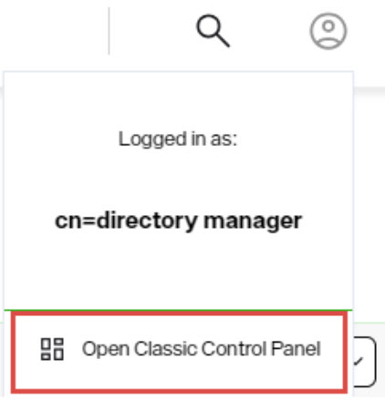

Navigate to the Wizards tab, launch the Global Identity Builder, and re-upload your identities in your project.

>[!note] You need to go through the cache configuration process described above again after the upload.

#### Migrate Custom Objects and Interception Scripts

To migrate custom objects and/or interception scripts, use the File Manager in the v9 environment to upload the files from your v7.4 backup location. Go to Control Panel > Manage > File Manager, which opens at the RLI_HOME directory. Use the breadcrumb and folder list to navigate to each target folder below, click UPLOAD FILE, and either drag and drop or browse to the corresponding location from your v7.4 backup, overwriting the target files:

- For custom data sources, upload `<RLI_HOME>\vds_server\custom\src\com\rli\scripts\customobjects\<files>` to vds_server > custom > src > com > rli > scripts > customobjects.
- For interception scripts, upload `<RLI_HOME>\vds_server\custom\src\com\rli\scripts\intercept\<files>` to the corresponding intercept folder.
- If custom libraries are used, upload `<RLI_HOME>\vds_server\custom\lib\<files>` to the vds_server > custom > lib folder.

>[!note] Single-file upload is supported. When multiple files are selected at once, only the last file in the list is processed in the current release.

After the files are uploaded, navigate to the custom folder or one of its subfolders and choose BUILD > Build All Jars. You can be more selective and just choose to build the Intercept Jars and Custom Jars instead of all jars. The Build Results panel displays the compilation messages, the jar files produced, and any warnings.

>[!note] If the build fails, you must investigate further to ensure you are only including libraries that are needed. Any extra, unused libraries can cause the build of the jars to fail.

Restart the RadiantOne service for the new scripts to take effect:

```
kubectl rollout restart statefulset/fid -n self-managed
```

This performs a rolling restart of all RadiantOne cluster nodes.

#### Initialize Persistent Cache

Go to Control Panel > Setup > Directory Namespace > Namespace Design, where you should see the naming contexts that were migrated from v7.4. Identify every migrated naming context that has a cache defined; persistent-cache data is not restored by the v7.4 export, so each one must be reinitialized from its backend data source or exported LDIF cache image.

Select the root naming context and click the CACHE tab. Stop all persistent cache refreshes if they are running, then use the ... menu inline with the cached subtree to deactivate the cache. Once the refresh has been stopped and the cache deactivated, use the ... menu inline with the cache and choose Edit to go through the configuration process. In the CONFIGURE section, choose and configure the refresh strategy. Then, in the INITIALIZE section, initialize the cache. Finally, manage the cache properties from the MANAGE PROPERTIES section. The cache becomes active after initialization completes successfully. You must do this for every imported naming context that has a cache defined.

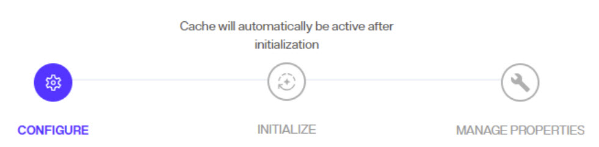

#### Configure Delegated Administrators

There are new Control Panel entitlements in v9. There are two aspects to take into consideration:

To continue to use the delegated admin roles applicable to the Classic (old) Control Panel in the new Control Panel, update them to assign permissions for the new Control Panel. Log into the Control Panel as the Directory Manager (the `fid.rootPassword` value from your values.yaml file) and go to ADMIN > Roles and Permissions. Select a role from the list and enable the needed permissions.

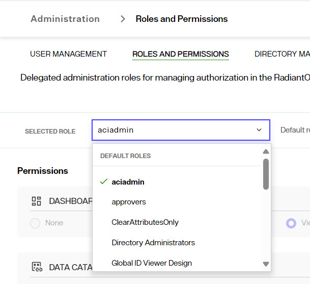

The default list of delegated admin roles and the permissions that are equivalent for the new control panel are as follows. Update your default roles with the same permissions shown in the screenshots:

**ACIADMIN**

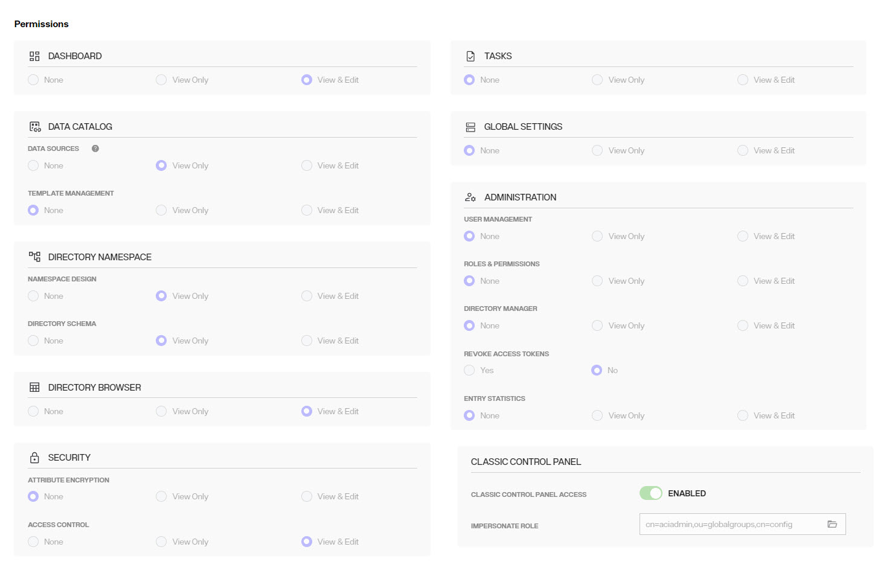

**DIRECTORY ADMINISTRATORS**

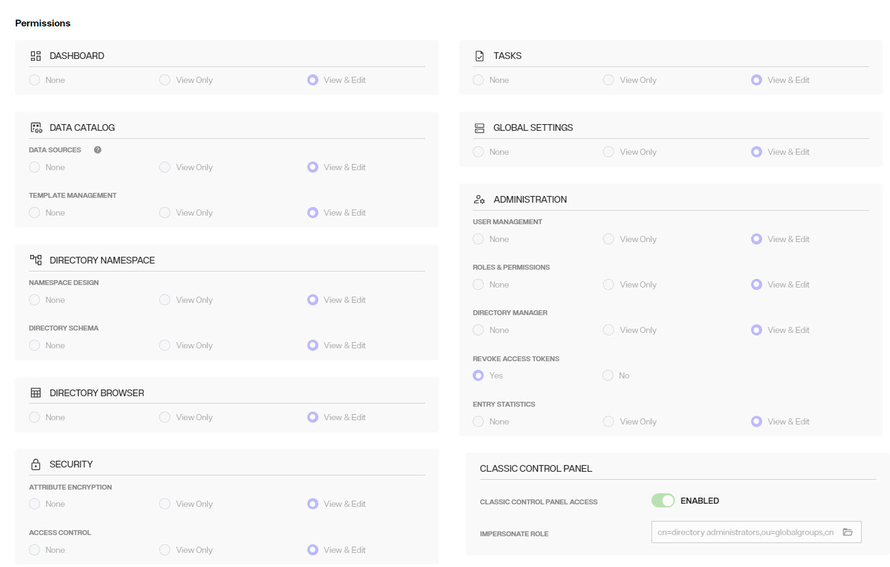

**ICSADMIN**

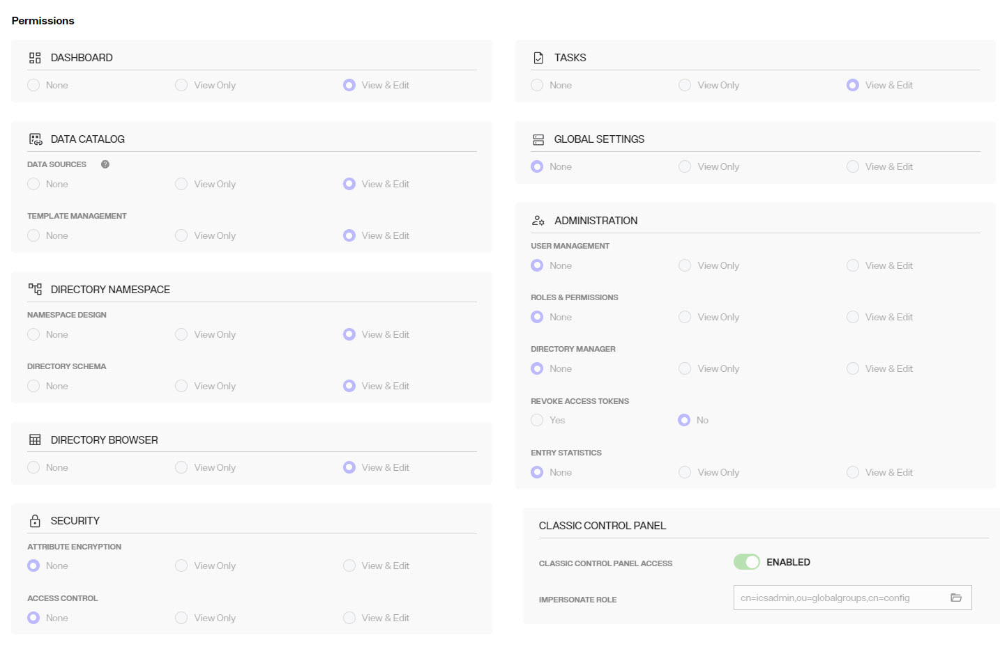

**ICSOPERATOR**

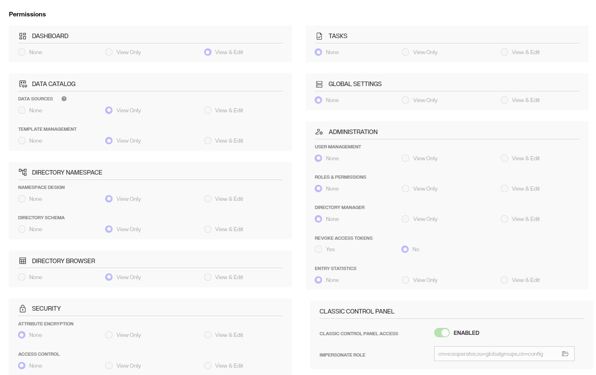

**NAMESPACEADMIN**

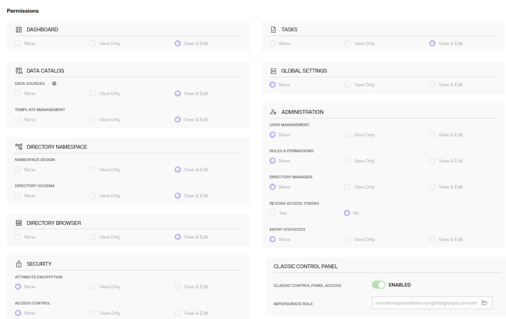

**OPERATOR**

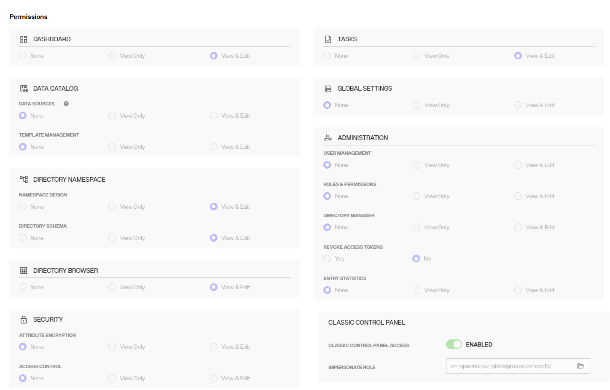

**READONLY**

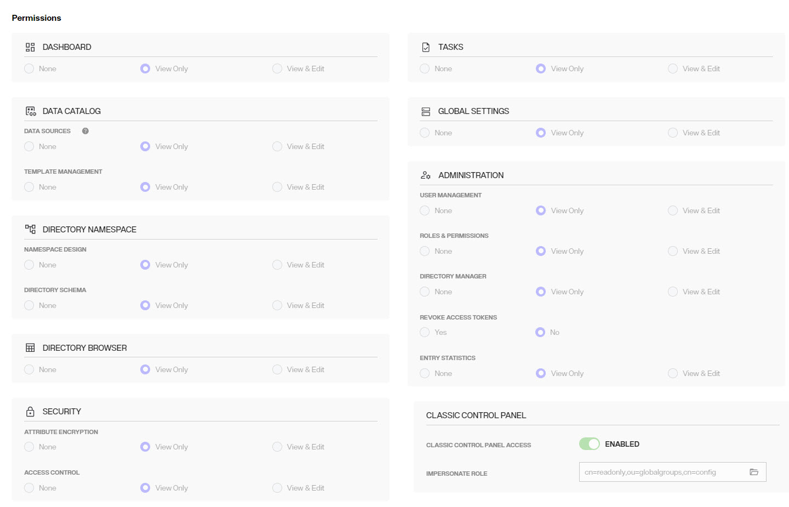

**SCHEMAADMIN**

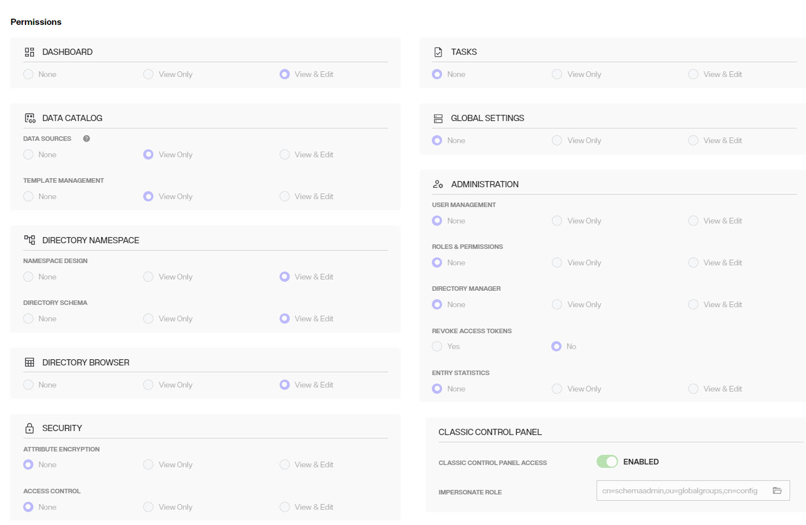

To properly assign new users to delegated admin roles, log into the Control Panel as the Directory Manager and go to ADMIN > USER MANAGEMENT. Search for the delegated admin user account and assign the user to the new role.

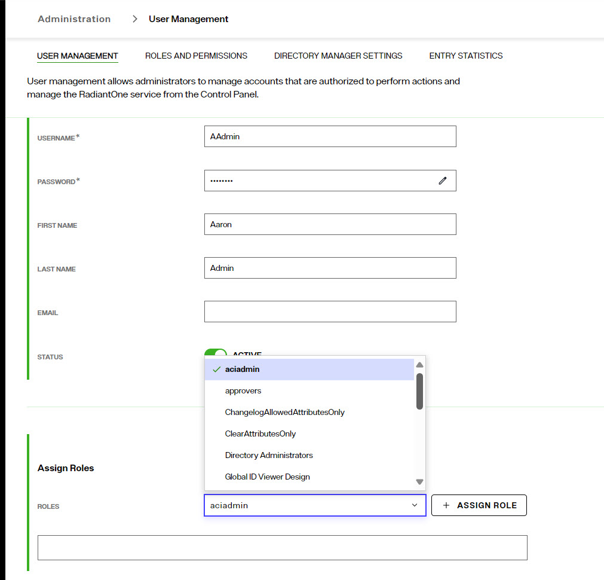

>[!note] If the default roles are inadequate, you can create new roles from the ROLES and PERMSSIONS tab. Do this first and then search for/assign the user to the role. Also, if the user should be able to switch to/configure settings in the Classic Control Panel, the new role MUST have the "Classic Control Panel Access" permission enabled, and the group associated with this role for entitlement enforcement for the classic control panel selected.

## Final validation and cutover

| What to check or do | Where to check | What to verify | Action if needed |
|---|---|---|---|
| Validate Global Sync Pipeline | Classic Control Panel > **Synchronization** > select the relevant pipeline | Capture, transformation, and apply stages run without connection, authentication, certificate, or data-source errors. | If a capture error occurs, return to the data source used by the pipeline. Verify its host, port, credentials, SSL settings, and failover LDAP servers. Then retest the pipeline. |

Ensure that you have repointed clients to the new environment's endpoints. In self-managed deployments these are the services fronting `iddm-proxy`. If you had an OIDC provider configured, update the callback URL in the Identity Provider to match the new endpoint.

Keep the v7.4 deployment running until you have accepted the v9 environment.

## Reverting to v7.4

There is no downgrade from v9, and a v9 backup cannot be restored into a v7.4 deployment. Because the migration does not modify v7.4, the only way back is to repoint clients to the existing v7.4 deployment; there is nothing to restore.

Do not decommission the v7.4 deployment, or delete the export archive, the `<RLI_HOME>` backup or the LDIF exports, until you have fully migrated and reviewed the v9 environment.

## Troubleshooting

| Issue | Cause | Action |
|---|---|---|
| The Migration Utility reports a version mismatch | Utility version does not match the v7.4 patch release | Use Migration Utility 2.1.X, where X is your v7.4 patch number |
| The Migration Utility cannot locate the configuration | RLI_HOME is not set | Set RLI_HOME, or pass the path explicitly as the first argument |
| The export fails or produces an empty archive | Services still running, or insufficient space at the target path | Stop the services as described in Preparing the v7.4 Deployment, free space, and retry |
| A new v9 self-managed deployment comes up empty | The value was placed at `migration.url` instead of `fid.migration.url` and was ignored | Correct the property path and reinstall; `fid.migration.url` applies only to the initial deployment |
| fid-0 cannot download the seed file | `fid.migration.url` is not reachable from the cluster, or a pre-signed URL expired | Test the URL from inside the cluster and reissue it if needed |
| Errors when the server spawns a child process; the import does not start | `env` overridden without `JAVA_TOOL_OPTIONS` | Restore `JAVA_TOOL_OPTIONS: "-Djdk.lang.Process.launchMechanism=FORK"` in values.yaml |
| fid-0 comes up on v9 with empty or partial stores | The import did not complete | Check the fid-0 logs and reinstall from the export |
| fid-0 runs out of disk during the import | `persistence.size` sized from the export archive rather than the rebuilt stores | Raise `persistence.size` and reinstall |
| Entry counts on v9 are lower than on v7.4 | Persistent cache data, inactive stores and cn=queue are not carried by the export | Re-initialize the persistent caches from your LDIF exports and recreate the remaining stores |
| Monitoring reports missing pods after cutover | Checks carried over from v7.4 | Rewrite the checks against the v9 pod inventory, including iddm-sync |

## Known Issues

For known issues reported after the release, please see the Radiant Logic Knowledge Base:

https://support.radiantlogic.com/hc/en-us/categories/4412501931540-Known-Issues

## How to Report Problems and Provide Feedback

Feedback and problems can be reported from the Support Center/Knowledge Base accessible from: https://support.radiantlogic.com

If you do not have a user ID and password to access the site, please contact support@radiantlogic.com.
