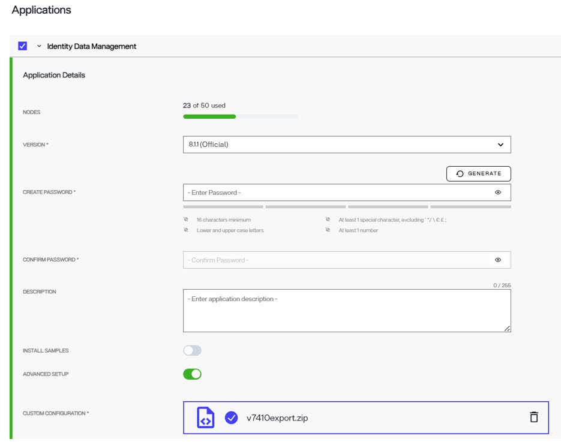

## Overview

The process from upgrading from RadiantOne Identity Data Management v7.4.10 to v9.0 is described below. If you are running a version prior to v7.4.10, you must first update to this version.

v9 updates the platform from Java 8 to Java 25 and from Lucene 6 to Lucene 10. Lucene provides the underlying index format used by RadiantOne Directory, and Lucene 10 cannot directly read the Lucene 6 indexes used by v7.4. 

As a result, RadiantOne Directory data is not migrated by copying the existing index files. Instead, the directory data is exported from v7.4 and rebuilt in the new v9 deployment as part of the initial installation. This is also why the v7.4 migration export is provided when the new v9 deployment is created rather than restored into an already running v9 deployment. 

#### Notice on Versioning Scheme

Similar to the v8 release, in v9 release, the software now follows Semantic Versioning. This differs from earlier RadiantOne releases, such as 7.2, 7.3, and 7.4, where the first two digits together represented the major version.

Version numbers will use the format MAJOR.MINOR.PATCH:

MAJOR – incompatible API or behavior changes   MINOR – backward-compatible feature additions   PATCH – backward-compatible bug fixes

This versioning scheme makes it easier to identify the scope of changes in a release and plan upgrades with greater confidence.

**Before beginning the migration:** 

* Review the [features list](./features-list.md) and the [comparison matrix guide](./iddm-v7-v8-v9-comparison) section to understand changes that may affect your deployment.
* Plan a configuration freeze on the v7.4 environment after the migration export is created. Configuration changes made after the export are not automatically carried over to the v9 deployment.
* Plan a maintenance window for the final cutover, when production clients and traffic are redirected from the existing v7.4 deployment to the new v9 deployment. 

The migration is performed by creating a new v9 deployment alongside the existing v7.4 deployment. The existing v7.4 deployment is not upgraded in place. 

To migrate to v9, you must: 

* First, use the [Migration Utility](to-add) to export the configuration from the existing v7.4 environment.  

* Then, install v9 as a separate deployment using the exported configuration. 

## Steps to Perform on the v7.4 Environment 

The section describes the processes of backing up and exporting your RadiantOne v7.4 configuration and backing up existing stores and ACIs. 

Complete the following before running the export using the migration utility tool: 

### Create backups 

1. Back up the entire <RLI_HOME> directory to a safe location outside <RLI_HOME>. <RLI_HOME> is the file system location of the root installation directory where RadiantOne is installed (e.g., /opt/radiantone/vds on Linux or C:\radiantone\vds on Windows). 

2. Export the RadiantOne Directory (HDAP) stores as LDIF files, with Export for Replication checked. Store all LDIF exports outside <RLI_HOME>.  

To back up naming contexts defined as RadiantOne Directory (HDAP) stores, perform the following steps for each of your HDAP stores. Note that in v9, HDAP stores are referred to as RadiantOne Directory stores. 

  1. On the Control Panel, log in as a user associated with the Directory Administrator role.  
  
  i. On the Directory Namespace tab, select your HDAP store. HDAP stores are identified with a  icon. 
  
  ii. In the right pane, in the Properties tab, click Export. The Export box is displayed.  
  
  iii. Enter an export file name. 
  
  iv. Check the Export for Replication box (to ensure the UUID attribute remains with the entries).  
  
  v. Click OK. The Tasks Launched window opens.
     
  
  vi. Once the export finishes, click OK to close the Tasks Launched window. You are returned to the store’s Properties tab.  
  
  vii. Repeat steps 2-7 for each RadiantOne Directory (HDAP) store. 
  
  viii. Copy the LDIF files from <RLI_HOME>/vds_server/ldif/export to a safe place outside of the <RLI_HOME> location. 

### Export existing configurations

Download the migration utility v2.1.X from the [Radiant Logic support site](https://files.radiantlogic.com/receive/?packageCode=IX0qTSRyilShjhpxusLWpUDzzb4rduq2tO9F81NhEt4#keycode=Niad1bODfyRmdW8PlGO-5In0mdRKsa0u6551qXXI1rA) and unzip it on the source v7.4 machine (the node from where you are exporting). Login using the email address associated with your Radiant Logic Support Portal account. If you do not yet have access, email support@radiantlogic.com.

Once logged in, navigate to Customer Downloads/MigrationUtility/Migration Utility v2.1. Download the Migration Utility version 2.1.x, where x matches the v7.4 patch release number. For example, if you are on v7.4.10, use radiantone-migration-tool-2.1.10.zip. 

For a multi-node cluster, run the export from a follower node rather than the leader node. To identify each node’s role, run:

`<RLI_HOME>/bin/advanced/cluster.sh list`

  > Note: <RLI_HOME> is the file system location of the root installation directory where RadiantOne is installed (e.g., /opt/radiantone/vds on Linux or C:\radiantone\vds on Windows).

In the command output, a follower node will display `false` in the **ZK leader** column. 

**Generating the Export**

Modify the file path depending on where your migration utility is located and run one of the following commands based on your operating system:

* In Windows, run the command from an Administrator command prompt: 

  `C:\r1\migration\radiantone-migration-tool-2.1.10\migrate.bat export C:/tmp/export.zip `

* In Linux, run the following: 

  `./migrate.sh /home/r1user/radiantone/vds export export.zip `

The final argument specifies the path and filename of the migration export to create. 

After the command executes successfully, the Migration Utility creates a `.zip` archive containing the v7.4 configuration and RadiantOne Directory Store data needed to initialize v9. It includes naming contexts, global syncs, data sources, identity views (`.dvx`) and schemas (`.orx`), roles, ACLs, configured stores, and RadiantOne Directory Store data. Directory data is exported without Lucene indexes; during v9 initialization, the data is imported and indexes are rebuilt in the v9 format.

The export does not include persistent cache data, inactive stores, custom JARs or scripts, third-party libraries, TLS certificates, keystores, external trust configuration, or v7.4 changes made after the export. Reinitialize persistent caches after migration, and recreate, restore, or otherwise handle the remaining items as needed in v9. For the complete list, see [Items Not Migrated](../migration-utility/04-items-not-migrated/).

## Steps to Perform in your SaaS Deployment in Environment Operations Center 

If you are migrating to a SaaS environment, refer to the instructions in this section. For self-managed, see [this](to-add) upgrade guide. 

1. Log into your Environment Operations Center. The credentials were sent to you during your onboarding process.

2. Create an environment with RadiantOne Identity Data Management version v9.0.0 and import the configuration (`export.zip`) that was exported from the v7.4 machine using the CUSTOM CONFIGURATION option by toggling the **Advanced Setup** option on. For assistance see: [Creating Environments](../../../../eoc/latest/environments/environment-overview/create-environments/#advanced-setup)

>[!warning] do NOT select RadiantOne Identity Data Management v8.1.0 when creating the environment. Migrations from v7.4 to v8.1.0 are not supported.

>[!note] Production SaaS environments are created with 2-node RadiantOne clusters. If your RadiantOne cluster requires more nodes, you can manually scale up the number of nodes once it is deployed.

Because the directory stores must be rebuilt, provisioning a migrated application can take longer than provisioning a new v9 application without migration data. The time required depends on factors such as the number and size of the directory stores, entry counts, and the indexes that must be rebuilt. 

The existing v7.4 deployment is not affected by this process and can continue serving clients while the new v9 application is provisioned. 

If you run into any issues, contact Radiant Logic Support at support@radiantlogic.com and provide the environment name and the approximate time of the provisioning attempt. 

### Create Secure Data Connector 

To connect to data sources that are not directly accessible from the SaaS environment, create a Secure Data Connector group and add a data connector in Environment Operations Center.  

Once a secure data connector has been created in Environment Operations Center, the SDC client must be deployed on your local system before you can establish a connection. For assistance see: [Creating Environments](../../../../eoc/latest/secure-data-connector/configure-sdc-service/)
 

### Access Control Panel

The new Control Panel endpoint is listed in Environment Operations Center > Environments > Environment Name > Overview > Application Endpoints. You can enable the LDAPS and REST endpoints from here as well. 

  

Connect to this endpoint and login as the directory manager with the password you defined during the environment creation.

### Validate Data Sources

Check the data sources to make sure they point to the desired servers (and failover servers if applicable). For example, if you are using inter cluster replication, verify that the replicationjournal LDAP data source points to the correct journal. You can check your data sources from the Control Panel > Setup > Data Catalog > Data Sources. If you were connecting to backend data sources via SSL, make sure your certificates were migrated over successfully and that they are still valid from Control Panel > Global Settings > Client Certificates. 

### Update Data Source Connections to use Secure Data Connector (where applicable) 

In the Control Panel > Setup > Data Catalog > Data Sources, select your data source.  

In the Secure Data Connector Group drop-down list, select the secure data connector that should be used to tunnel a secure connection to the data source. 

  

### Initialize Persistent Cache 

When you log into the Control Panel > Manage > Directory Namespace > Namespace Design, you should see the naming contexts that were migrated from v7.4. Select the naming context that has a cache defined and go to the CACHE TAB to edit/reinitialize the cache. You must do this for every imported naming context that has a cache defined. 

Stop all persistent cache refreshes (if they are running) and deactivate the cache.  Once the cache refresh has been stopped and the cache deactivated, go through the configuration process.  This can be done from Control Panel > Setup > Directory Namespace > Namespace Design. Select the root naming context and click the CACHE tab. Use the ... menu inline with the cached subtree to deactivate the cache.  Use the ... menu inline with the cache and choose Edit to go through the configuration process. In the CONFIGURE section, choose and configure the refresh strategy. Then, in the INITIALIZE section, initialize the cache. Finally, manage the cache properties from the MANAGE PROPERTIES section. 

  

### Perform Upload for Global Identity Builder Projects 

If you had Global Identity Builder projects in v7.4, you must re-upload in the Global Identity Builder project the identity sources in your SaaS environment. If the Global Identity Builder project has identity sources that are based on persistent cache, make sure these caches are reinitialized in SaaS before re-uploading the global profile. 

To edit Global Identity Builder projects in SaaS, from the Control Panel switch to Classic Control Panel and navigate to the Wizards tab. Launch the Global Identity Builder and re-upload your identities in your project. You need to go throught the cache configuration process mentioned in the previous section after the upload.

### Configure Delegated Administrators 

There are new Control Panel entitlements in v9. There are two aspects to take into consideration:  

To continue to use the delegated admin roles applicable to the Classic (old) Control Panel in the new Control Panel, update them to assign permissions for the new Control Panel. Log into the Control Panel as the Directory Manager (configured when you create the environment in EOC) and go to ADMIN > Roles and Permissions. Select a role from the list and enable the needed permissions. 

The default list of delegated admin roles and the permissions that are equivalent for the new control panel are as follows. Update your default roles with the same permissions shown in the screenshots: 

 
**ACIADMIN** 
 
 
 
**DIRECTORY ADMINISTRATORS** 

 

 **ICSADMIN** 

 
**ICSOPERATOR** 

 

**NAMESPACEADMIN** 

 

**OPERATOR** 

 

**READONLY** 

 
 
**SCHEMAADMIN** 

 
 

To properly assign new users to delegated admin roles, log into the Control Panel as the Directory Manager (configured when you create the environment in EOC) and go to ADMIN > USER MANAGEMENT.  Search for the delegated admin user account and assign the user to the new role.  

   

>[!note] If the default roles are inadequate, you can create new roles from the ROLES and PERMSSIONS tab. Do this first and then search for/assign the user to the role. Also, if the user should be able to switch to/configure settings in the Classic Control Panel, the new role MUST have the “Classic Control Panel Access” permission enabled, and the group associated with this role for entitlement enforcement for the classic control panel selected. 

### Migrating Custom Objects and Interception Scripts 

To migrate custom objects and/or interception scripts, use the File Manager in the SaaS environment to upload the files from the following folders. 

For custom data sources, from your v7.4 backup location, upload the <RLI_HOME>\vds_server\custom\src\com\rli\scripts\customobjects\<files> to the  <RLI_HOME>\vds_server\custom\src\com\rli\scripts\customobjects folder and overwrite the target files.  From the Control Panel, use the “Logged in...” account menu and choose: Open Classic Control Panel. 

 

In the Classic Control Panel, navigate to Settings > Configuration > File Manager. In File Manager, navigate to vds_server > custom > src > com > rli > scripts > customobjects and click Upload Files. Navigate to the corresponding location from your v7.4 backup and upload your files.  

For interception scripts, from your v7.4 backup location, upload the files from <RLI_HOME>\vds_server\custom\src\com\rli\scripts\intercept\<files> to the  <RLI_HOME>\vds_server\custom\src\com\rli\scripts\intercept folder and overwrite the target files. If custom libraries are used, upload the <RLI_HOME>\vds_server\custom\lib\<files> from your v7.4 backup to the <RLI_HOME>\vds_server\custom\lib folder in File Manager and overwrite the target files. 

After the files are uploaded, choose Build > Build All Jars in File Manager.  You can be more selective and just choose to build the Intercept Jars and Custom Jars instead of all jars. 

>[!note] If the build fails, you must investigate further to ensure you are only including libraries that are needed. Any extra, unused libraries can cause the build of the jars to fail. 

Restart the RadiantOne service using Environment Operations Center. Navigate to Environments > *Environment_Name* > OVERVIEW and use the following menu: 

This performs a rolling restart of all RadiantOne cluster nodes for the new scripts to take effect. 

## How to Report Problems and Provide Feedback 

Feedback and problems can be reported from the Support Center/Knowledge Base accessible from: https://support.radiantlogic.com 

If you do not have a user ID and password to access the site, please contact support@radiantlogic.com. 

