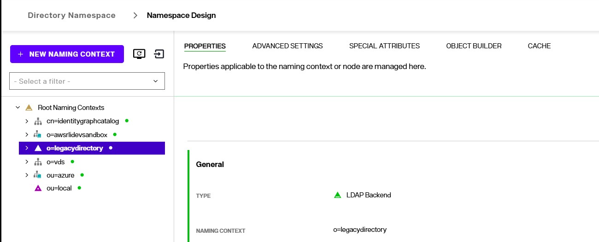
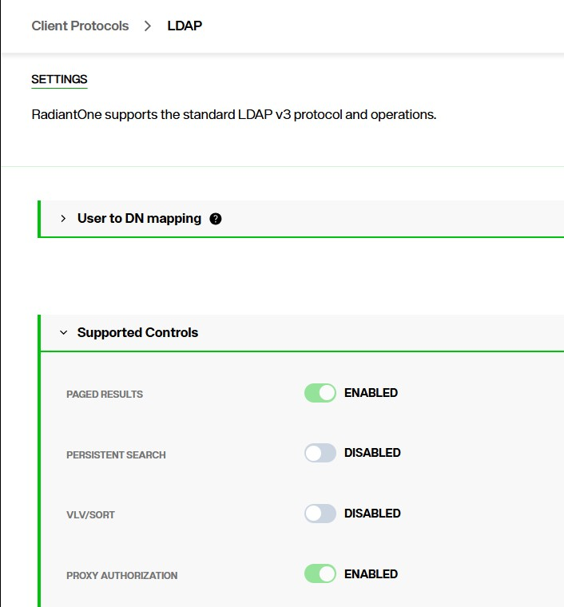
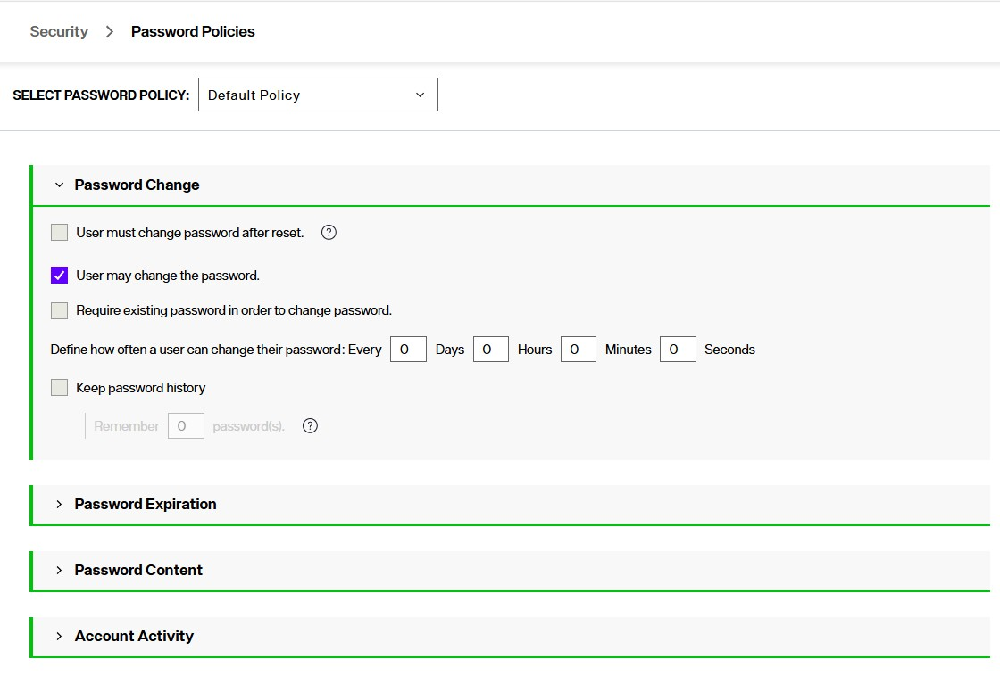
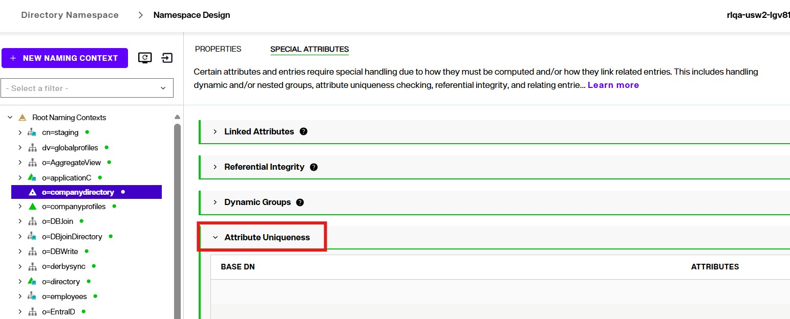
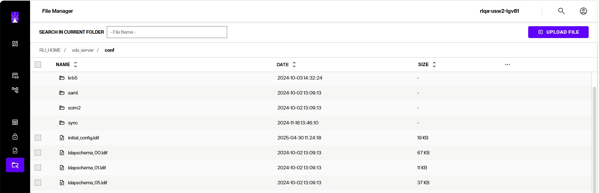
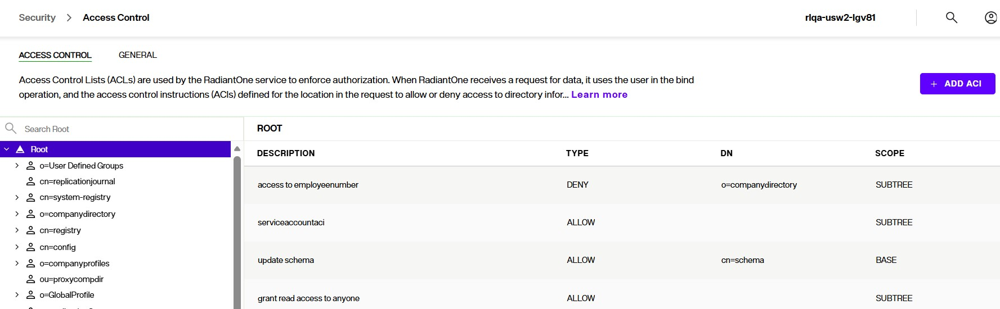

## Overview

The purpose of this use case is to provide guidance for migrating from a legacy LDAP directory (OpenDJ, SunOne/ODSEE, IBM Tivoli Directory) into the RadiantOne Directory. This document provides a general overview of the migration process. The steps provided here are not exhaustive and may vary depending on the use case.

Although the RadiantOne Directory supports the standard LDAP v3 RFC and closely mimics the behavior of legacy LDAP directory implementations, slight variations are possible. These variations might impact client applications. The level of impact depends on how tightly-coupled the application is with the LDAP variations implemented by the legacy LDAP directory.  In certain cases, the logic of the application might need to change. In some situations, where clients cannot change, RadiantOne’s various customization techniques (e.g. interception scripts, computed attributes…etc.) can be used to mimic the legacy directory. If you encounter this situation, reach out to support@radiantlogic.com for assistance.

This gets you all of the components needed for your replacement task. Then, the outline below details the general migration strategy. Each item is further detailed in later sections.

- [Inventory Existing Legacy Directory](#inventory-existing-legacy-directory) - Inventory existing directory (schema, hierarchy, types of client requests, password policies…etc.)
- [Import Data into RadiantOne Directory](#import-data-into-radiantOne-directory) - Import data into RadiantOne Directory. This can be handled with a persistent cache initialization (if a cache with refresh is desired), or an initial upload in the sync pipleline if a synchronization approach from the legacy directory to the RadiantOne directory is used.
- [Configure RadiantOne server settings](#configure-radiantone-server-settings) - Configure RadiantOne server settings. These settings are access controls, password policies, schema and any customizations needed to address legacy plugin behavior.
- [Determine the application usage and cutover strategy](#determine-the-application-usage-and-cutover-strategy) - Determine the application usage and cutover strategy. This determines how long the persistent cache refresh and/or synchronization pipeline needs to be running.
- [Decommission legacy directory](#decommission-legacy-directory) - Decommission legacy directory after all applications have been migrated to use the RadiantOne Directory.

## Inventory Existing Legacy Directory

Taking inventory of the existing directory is mostly a manually process. Once you’ve acquired the basic credentials from the directory owner, you can access the directory from any LDAP client, like Softerra LDAP Browser. From here, you can get a glimpse of the existing root naming context, hierarchical structure, and export schema and branches to LDIF files. 

### Schema

To get the schema information from the LDAP directory, you can typically use a base DN of cn=schema in an LDAP client/Browser. Then, export the schema to an LDIF formatted file.

### LDAP Controls

Understanding the enabled LDAP controls (e.g. paged results, VLV/sort, persistent search, proxy authorization) is a manual process. Check the legacy directory server settings to determine which controls are enabled.

### Password Policies

Understanding the password policies defined in the legacy directory is a manual process. You must work with the directory owner/administrator to understand how password policies are enforced. Some questions to ask might be:

What level are password policies enforced (e.g. global, per group, per “ou”/tree branch, per user)?

What are the requirements of the policies themselves (e.g. password strength, lockout policy, password hash…etc.)?

## Import Data into RadiantOne Directory

The recommended approach is to import the data as is (stick to the original DIT of the backend) to avoid complex re-mappings of group memberships. The easiest approach to import the data is achieved through a persistent cache initialization of the proxy view. Once the data is in persistent cache, complex reorganizations of the original DIT can be done using virtualization. This includes things like flattening the hierarchy to get a list of users and groups, and merging overlapping users and groups (requiring correlation)…etc. 

>[!note] If you would like to discuss a particular use case or alternate approach (e.g. using synchronization instead of a persistent cache), please contact your Radiant Logic Account Representative.

To ingest the existing legacy directory data into RadiantOne, create a proxy view of the backend directory and create a persistent cache as outlined below. 

### Persistent Cache View

1. Define an LDAP data source for the backend directory from the Control Panel > Setup > Data Catalog > [Data Sources](../configuration/data-sources/data-sources).
2. Click New Source and choose Generic LDAP template. Complete the form to configure a connection to the legacy LDAP Directory.
3. Create a Root Naming Context from the Control Panel > Setup > Directory Namespace > Namespace Design.
4. Click New Naming Context and enter the name of the Root Naming Context. Typically, this should match the naming used in the legacy LDAP directory.
5. With the new naming context select in the Namespace Design section, click **MOUNT BACKEND**.
6. Select the LDAP type and then select the data source created in step 1 of this section.
   

7. With the naming context selected, click the CACHE tab.
8. Click **CREATE NEW CACHE** and go through the process to define a [persistent cache with refresh](../tuning/persistent-cache).

(Optional) If you need to configure more advanced views/hierarchies, you can virtualize the persistent cache as an LDAP directory backend and create the desired view. Then, define a persistent cache for this view. Ensure that the final virtual view is mounted at the root naming context that client's expect. Any intermediate views can be mounted using any internal root naming context name you choose.

>[!note] to support bind operations, the persistent cache must contain the user passwords from the backend directory. As long as the password hash is compatible with RadiantOne, users should be able to [bind against the cache](../tuning/persistent-cache.md#authentication).

## Configure RadiantOne Server Settings

Configure the appropriate server settings. These include things like LDAP controls and extensions, plugins, schema, access controls and password policies.  These topics are discussed in this section.

### LDAP Controls and Extensions

RadiantOne supports the following controls and extensions:

* Subtree Delete Control - 1.2.840.113556.1.4.805
* Password expired notification control - 2.16.840.1.113730.3.4.4
* Password expiring notification control - 2.16.840.1.113730.3.4.5
* Password policy control - 1.3.6.1.4.1.42.2.27.8.5.1
* Persistent search control - 2.16.840.1.113730.3.4.3
* Virtual list view request control - 2.16.840.1.113730.3.4.9
* Proxied authorization (version 2) control, described in RFC 4370 - 2.16.840.1.113730.3.4.18
* Server-side sort request, described in RFC 2891 - 1.2.840.113556.1.4.473
* Authorization bind identity response control, described in RFC 3829 - 2.16.840.1.113730.3.4.15
* Authorization bind identity request control, described in RFC 3829 - 2.16.840.1.113730.3.4.16
* Who Am I extended operation, described in RFC 4532 - 1.3.6.1.4.1.4203.1.11.3
* Paged Results Control - 1.2.840.113556.1.4.319
* Dynamic entries extension, described in RFC 2589  - 1.3.6.1.4.1.1466.101.119.1
* All Operational Attributes feature, described in RFC 3673 - 1.3.6.1.4.1.4203.1.5.1
* Absolute True and False Filters as described in RFC 4526 - 1.3.6.1.4.1.4203.1.5.3

The following controls that could be used in Sun Java Directory/ODSEE are *not* supported in RadiantOne:

* Manage DSA IT control, described in RFC 3296 - 2.16.840.1.113730.3.4.2
* Get effective rights request control - 1.3.6.1.4.1.42.2.27.9.5.2
* Account usability control - 1.3.6.1.4.1.42.2.27.9.5.8
* Specific backend search request control - 2.16.840.1.113730.3.4.14
* Real attributes only request control - 2.16.840.1.113730.3.4.17
* Virtual attributes only request control - 2.16.840.1.113730.3.4.19

Paged Results, VLV/Sort, Persistent Search and Proxy Authorization [Controls](../configuration/global-settings/client-protocols/#supported-controls) are enabled from the Control Panel > Manage > Global Settings > Client Protocols.

Password expired notification, password expiring notification, and password policy control are configured for [password policies](../configuration/security/password-policies/) from Control Panel > Security > Password Policies. 

### RootDSE

Directory Servers provide information about themselves to clients through the rootDSE. It contains information about the server in the form of attributes, some of which are multi-valued. The rootDSE may contain information about the vendor, the naming contexts the server supports, the LDAP controls the server supports, the supported SASL mechanisms, schema location, and other information. The contents of the rootDSE generally determine the sequence and format of requests clients issue to the server.

The RadiantOne rootDSE can be managed from Control Panel > Manage > File Manager. Navigate to vds_server/conf and click rootdse.ldif. This file contains the default content returned to clients when they request the rootDSE (an LDAP search request with an empty DN). Some LDAP clients search the rootDSE to determine the naming contexts available in the LDAP directory and leverage this information to determine the baseDN (starting point in the directory) to pass in search requests.

### Plugins

Some legacy LDAP directories support plug-ins to add specific functionality to the server.

Some of the most commonly used plugins and how to configure them in RadiantOne are described in this section.

**Attribute Uniqueness**

The Attribute Uniqueness plugin in legacy LDAP directories ensures that the value of a given attribute is unique among all entries of a subtree.

To enable comparable functionality in RadiantOne, from the Control Panel > Setup > Directory Namespace > Namespace Design, navigate to the root naming context where you want to support this functionality. Then go to the Special Attributes tab. Locate the Attribute Uniqueness setting and configure the attributes here.

**Referential Integrity**

The referential integrity plug-in in legacy LDAP directories performs integrity updates on specified attributes immediately after a delete, rename, or move operation. It ensures that all attributes that reference the deleted, renamed or moved entry are updated accordingly.

To enable comparable functionality in RadiantOne, from the Control Panel > Setup > Directory Namespace > Namespace Design, navigate to the root naming context where you want to support this functionality. Then go to the Special Attributes tab. Locate the Referential Integrity setting and configure the references here.

**Linked Attributes**

The isMemberOf plug-in in legacy LDAP directories enables clients to check a user’s group membership by requesting the isMemberOf attribute in the user entries. This can be more efficient than searching in group entries looking for a uniquemember (especially in situations where group entries can be large/have many members).

To enable comparable functionality in RadiantOne, from the Control Panel > Setup > Directory Namespace > Namespace Design, navigate to the root naming context where you want to support this functionality. Locate the Linked Attributes setting and configure the link between the location of users and the location of potential groups they are a member of here. RadiantOne computes isMemberOf only when the attribute is explicitly requested from clients.

This setting can be used for other back-link/forward-link attributes also (e.g. manager, owner, reportsTo…etc.).

**Strong Password Check**

The Strong Password Check plug-in enables the Directory Server to verify that a user’s password doesn’t contain unallowed strings from a specified dictionary file. This can be used as a method to enforce strong password policies.
To enable comparable functionality in RadiantOne, from Control Panel > Security > Password Policies, locate the Password Content section and check the option to Enable Dictionary Check. Click **UPDATE DICTIONARY** to manage the contents of the dictionary file. The dictionary file must be a text-formatted file containing one dictionary word per line.

### Schema

The RadiantOne directory schema is comprised of a series of LDIF files that can be managed from Control Panel > Manage > File Manager. Navigate to vds_server > conf and locate the *ldapschema_XX.ldif* files.  XX being the number indicating the order in which the files are loaded. To extend the schema, the easiest approach is to get the object classes and attributes in LDIF format and then name the file ldapschema_XX.ldif where XX is the sequence you want the file loaded. Then, use File Manager to upload the file to the `vds_server/conf`and restart the RadiantOne service.

>[!warn] If you apply a new `ldapschema_XX.ldif` file and it has a number GREATER than 50 (e.g. `ldapschema_51.ldif`) and this definition includes object classes or attributes that are already defined in the VDS schema (in lower numbered schema files), the existing definitions are overridden with the latest definitions. This only starts AFTER the `ldapschema_50.ldif` file.  Otherwise, the definition in the lower numbered files are not overridden.

### Access Controls

Access controls can be viewed and defined manually from the Control Panel > Manage > Security > Access Controls.

### Password Policies

Password Policies can be viewed and defined manually from the Control Panel > Manage > Security > Password Policies.

To support best practices around auditing and maintenance, RadiantOne only supports [password policies](../configuration/security/security/#password-policies) assigned to LDAP groups or sub-trees (user’s located in a given container in the RadiantOne namespace). Password policies defined at the user level are not supported. If you are replacing an LDAP directory that enforces password policies at the user level (e.g. in the passwordpolicysubentry attribute), when preparing the LDIF from the underlying directory (that you will use to initialize RadiantOne Directory) do not include the passwordPolicySubentry attribute and move to use password policies defined at the group and/or “OU” (subtree) level.

For details see here: [RadiantOne password policy implementation](https://tools.ietf.org/html/draft-behera-ldap-password-policy-10):

## Determine the Application Usage and Cutover Strategy

### Determine Cutover Strategy

Generally all applications are not switched to use the new directory at the same time. There is a gradual migration of applications to point to the new directory. This allows application teams to migrate and test on their own schedule.

Likewise, the legacy LDAP directory isn’t immediately switched off overnight. There is generally a temporary time period where both the legacy LDAP directory and the RadiantOne Directory store must co-exist. This results in a required temporary synchronization process, which can be addressed with a persistent cache refresh strategy, as outlined in this use case, or a [synchronization](../configuration/synchronization/synchronization-concepts) strategy.

### Analyze Client Requests

Once applications are modified to point to the RadiantOne Directory, analyze the `vds_server.log` to track the sequence of requests in an effort to determine what settings to tweak in RadiantOne. This log file can be viewed from Classic Control Panel > Server Control Panel > Log Viewer.

Items to pay special attention to:

* Does the client query for the rootDSE (blank base DN in the search request)? If so, what attributes are being requested?
* What are the requested attributes for searches? Are they sensitive attributes that require being stored encrypted?
* Do the requests invoke a sort control (special index for the attribute)?
* Do clients use proxy authorization (connect as a specific user and issue requests on behalf of someone else)?
* Do clients issue modification operations or only read operations? If modifications, which attributes are being modified?
* How is group membership checked (e.g. searching group entry if user is a member or searching user entry to see if they are a member of a certain group)?

## Decommission Legacy Directory

Once all applications have successfully migrated over to use RadiantOne Directory, the legacy directory can be decommissioned and the persistent cache refresh process can be stopped. The persistent cache can be converted to a RadiantOne Directory store. This is a sensitive operation and must be performed during off-peak hours.

To stop persistent cache refresh:
1. Go to the Control Panel > Setup > Directory Namespace > Namespace Design.
2. Select the root naming context where the persistent cached view is located.
3. Click the **CACHE** tab.
4. Click the `...` menu inline with the cached view and choose Edit.
5. In the Configure Refresh Type section, select *None*.
6. Click Next, and then Next again.
7. Click **SAVE**.
8. To convert the persistent cache to a RadiantOne Directory store, on the CACHE tab, click `...` menu inline with the cached view and choose Edit.
9. In the **MANAGE PROPERTIES** section, under the ACTION section, click EXECUTE next to "Convert to RadiantOne Directory".
10. Rebuild the index to remove any persistent cache operational attributes. The REBUILD INDEX button is located in the upper right of the Manage Persistent Cache page.
