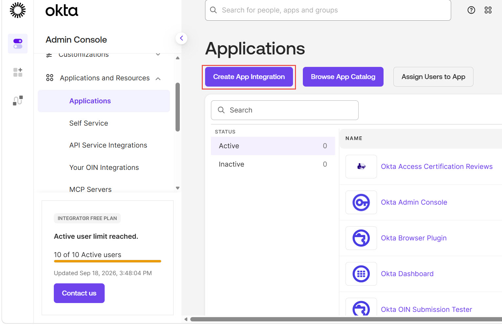
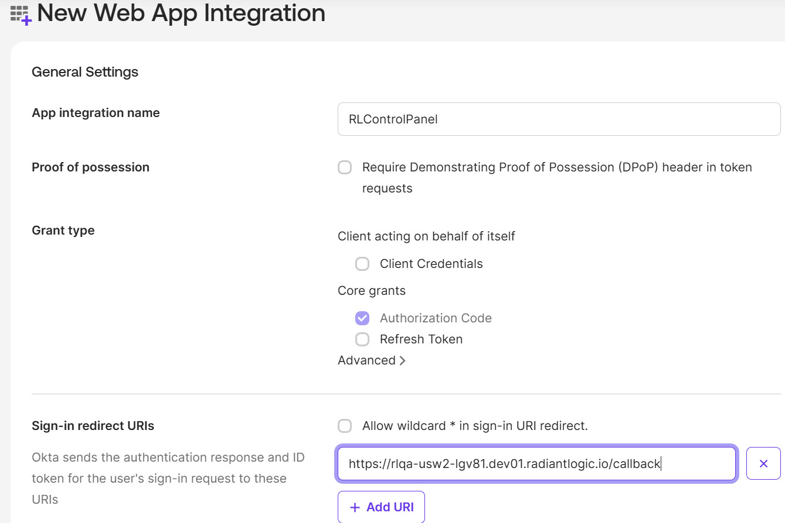
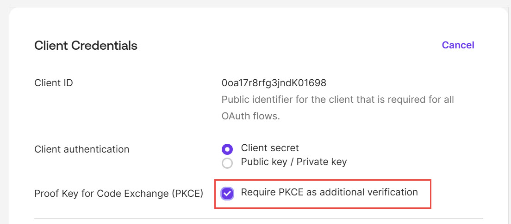
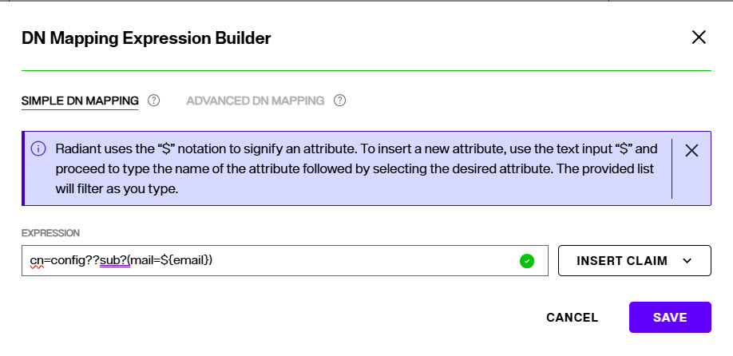
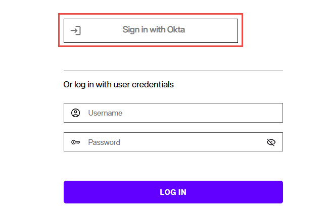
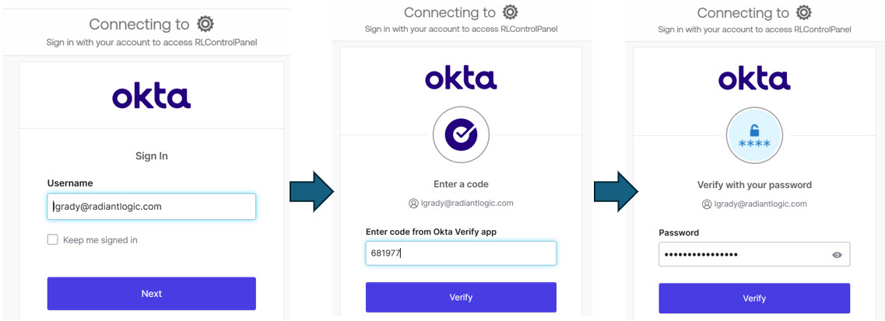
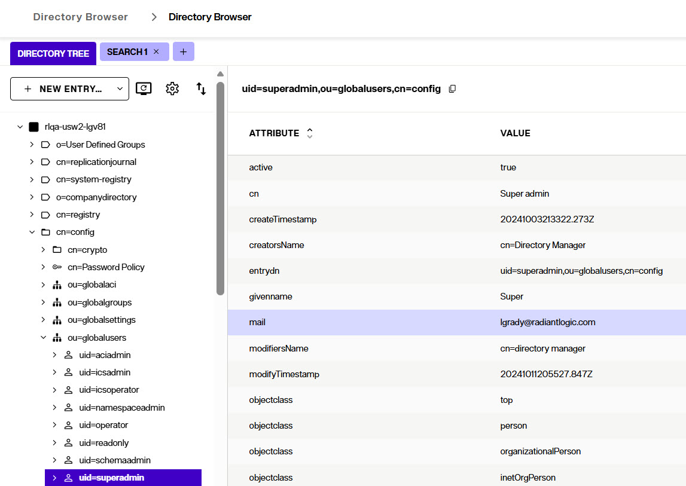

# Okta SSO Control Panel

## Introduction

This document provides an example of how to configure Okta as the Identity Provider supporting Single Sign-on into the RadiantOne Control Panel. This configuration has been validated for RadiantOne v8.1+.

## Prerequisites

Ensure you know your Control Panel endpoint. If you have deployed RadiantOne in Environment Operations Center, you can login and navigate to your environment. Select the application in the environment to view the details and look for the Application Endpoints. Copy the Control Panel UI endpoint.  The Callback URL configured in the Okta app will be the value of this endpoint with a suffix of /callback. An example is: https://rlqa-usw2-lgv81.dev01.radiantlogic.io/callback

## Okta Configuration

Perform the following steps in your Okta tenant. Please refer to the Okta documentation as some of these interfaces may have changed.

1. Login with an administrator account and go to **Administration > Applications and Resources > Applications**.

   

2. Click **CREATE APP INTEGRATION**.

3. Enter **App Integration Name**. 

4. Select **OIDC** for the sign-in method and **Single Page Application** for the type.

5. Select *Authorization Code* for Core Grants.

6. For **Sign-in Redirect URI**, enter the Control Panel endpoint you noted during the prerequisite step above, appended with: /callback

7. Select the applicable authorization and click **SAVE**.

8. On the Client Credential page, click *Edit*.

9. Copy the value for the Client ID. This is used when you configure Okta as the Identity Provider in the Control Panel. 

10. Enable the option *Require PKCE as additional verification*.
    

12. Click **SAVE**.

13. You can fill in the rest of the sections on this page applicable to your company's security policies.

## Control Panel Configuration

1. Log into the RadiantOne Control Panel as an administrator allowed to edit security settings.

2. Navigate to ADMIN > CONTROL PANEL CONFIGURATION.

3. Click **+ADD OIDC CONFIGURATION**.

4. Enable the OIDC Configuration with the toggle.

5. Enter a Configuration Name for the provider (e.g. Okta)

6. Select **CUSTOM** from the **OIDC Provider** drop-down list.

7. Enter the OIDC discovery URL for the Okta tenant (e.g. `https://<OKTA_DOMAIN>/.well-known/openid-configuration`) and click **Discover Endpoint URLs**. This auto-populates the **Authorization Endpoint URL** and the **Token Endpoint URL** (you can manually enter these if needed).

8. Enter the **Client ID** you saved from the Okta setup.
9. This configuration uses the **CLIENT_SECRET_POST** authentication method and **openid** as the scope.
10. Click **+ADD MAPPING** next to *DN Mapping Expression* in the **CLAIMS TO USER DN MAPPING**. This setting is used to translate the account that authenticates with Okta to a delegated admin user in RadiantOne. This can be a simple mapping (DN substitution using claim values if needed) or a complex mapping with lookups in the RadiantOne namespace to match claim values to profile attributes. In the following example, the `email` claim received from the Okta authentication is used to lookup the identity in the RadiantOne namespace to locate the admin account below the `cn=config` naming context that has this value for the `mail` attribute.

   

   | Setting | Value |
   | --- | --- |
   | Base DN | `cn=config` |
   | Search Level | `sub` |
   | Attribute | `mail` |
   | Claim | `email` |
   | Expression | `cn=config??sub?(mail=${email})` |

9. Click **SAVE**.

## Testing SSO

To test SSO:

1. Log out of the RadiantOne Control Panel (account menu in upper-right).

2. Click the **Sign in with Okta** option on the RadiantOne Control Panel.

   

   This redirects to Okta where the user (not already logged into Okta) is prompted to login, enter Okta Verify Credentials and Password:

   

3. After clicking **Verify** the user should be automatically logged into the RadiantOne Control Panel as the admin account matching the OIDC to User Mapping.

   

