## Overview

This document provides the steps to synchronize on-premises Active Directory (AD) users to Entra ID (formerly Azure Active Directory) using Identity Data Management.  
 
This synchronization includes common user attributes such as names, email addresses, group memberships as well as users’ password hash, allowing synchronized users to sign in to Entra ID with their on-prem credentials. 

This guide focuses on users whose identities are initially created in the on-premises Active Directory and then synchronized to Entra ID using Identity Data Management. 


## Prerequisites

### Identity Data Management Requirements

Ensure that Identity Data Management is deployed in an environment that meets the following requirements:

- **Operating System**: Windows only  
- **.NET Framework**: Version 4.8 or higher  
- **Connectivity**:  
- Your Identity Data Management server must have network connectivity to the on-premises Active Directory domain controller


### Register an Application on Entra ID

Manually create an application in the Entra ID portal before using the `AzureADInitialization` tool. This app will grant programmatic access to Identity Data Management to manage user objects in Entra ID.

#### Steps for Application Creation

1. Navigate to **Entra ID Portal > App Registrations**.
2. Create a new **application registration**.
3. Copy and securely store the following values:
   - **Client ID**
   - **Client Secret** (generate a secret under **Certificates & Secrets**)
   - **Tenant ID**
4. Grant the application the following API permissions via an admin account:

   **Microsoft Graph:**
   - `User.ReadWrite.All`
   - `Directory.ReadWrite.All`
   - `Application.ReadWrite.All`
   - `AppRoleAssignment.ReadWrite.All`
   - `Organization.ReadWrite.All`
   - `OnPremDirectorySynchronization.ReadWrite.All`





In a later step, you will use the application details from your registered Entra ID application to create a second application using `AzureADInitialization.exe` provided by RadiantOne Identity Data Management.


## Steps to set up the synchronization 

### 1. Configure On-Prem AD as a Data Source

#### a. Create an Active Directory Data Source

1. Open the **Control Panel** in Identity Data Management and navigate to `Settings > LDAP Data Sources`.
2. Click the **Add** button to add a new LDAP data source that points to your **Active Directory** domain controller. An example is shown below:

   

3. Provide all the details that are required, test the connection, and save your changes. Use secure bind credentials with read access to the targeted user objects. The image below shows an example for reference:

   


#### b. Configure LDAP Proxy Naming Context for Your AD

1. Under Directory Namespace, create a new LDAP proxy naming context using the AD data source. For example, the image below shows a proxy      name “adproxy” that points to a sample AD data source named “ad35” that was created in step a. Names can be customized.  

    

2. In the **Remote Base DN**, click **Browse**, specify the scope, and click **OK**.  

    

3. In the Objects tab, ensure the object class associated with your user accounts in Active Directory (e.g., user) is added to the Primary Objects section. If not present, click the Add button to include it.  

    

4. At the bottom of the **Objects** tab, click **Edit** next to **Define Computed Attributes**.
   - Click **Add** and enter the following:
     - **Name**: `userPassword`  
     - **Function**: Click **Function**, select `getADPassword()`, click **OK**  
     - Validate the expression and click **OK**

    

5. **Save** your changes.  
   - This attribute will now hold the **password hash** for each synced on-prem AD user.


#### c. Configure Persistent Cache

* Create and initialize a **persistent cache** on the LDAP Proxy Naming Context with real-time refresh using **DirSync** or **USN Active Directory connector**.


### 2. Configure Entra ID as a Data Source

#### a. Run AzureADInitialization.exe

1. Open CLI and run the AzureADInitialization script:

   ```shell
   C:\radiantone\vds\bin\ad_pwd>AzureADInitialization.exe
   ```

   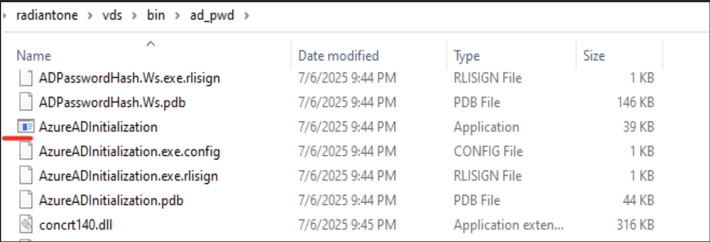


 This launches a service account registration process on Entra ID used by RadiantOne.

2. When prompted, provide the following details associated with previously registered Entra ID application: 

 * Tenant ID (Entra ID admin account)
 * Email address (Entra ID admin)
 * Client ID of the previously registered Entra ID app
 * Client Secret of the previously registered app
 * A unique data source name for the Entra ID data source
 * Yes/No responses to any additional prompts
 
    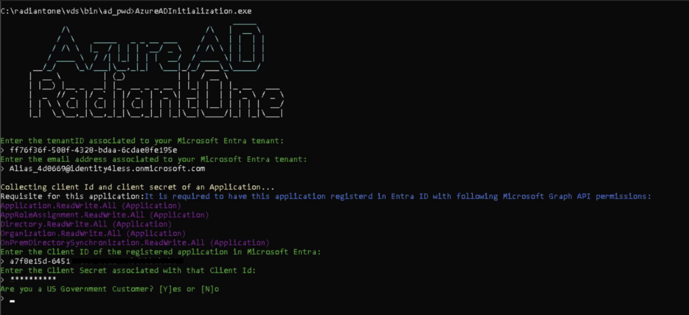
 
 
 * When prompted to create a new application for sync, type Y and press Enter.
 * When asked for the vdsconfig file location, press Enter to accept the default location.
 * A name for the Entra ID data source and press Enter. Note the name used.
 
   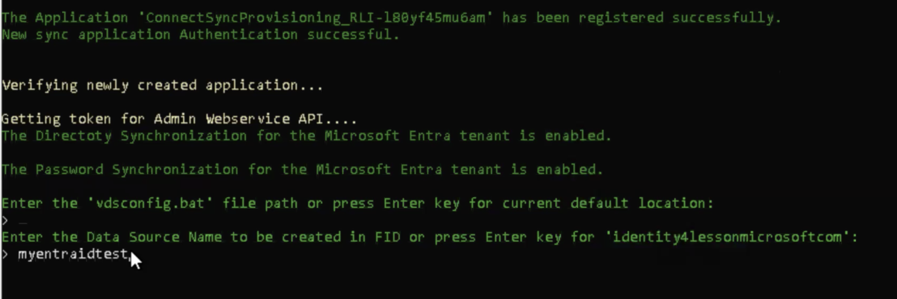

After completing the steps, a pre-configured data source is created in your Identity Data Management instance.
To view it, navigate to Main Control Panel > Settings tab > Server Backend > Custom Data Sources section. An example is shown below:

  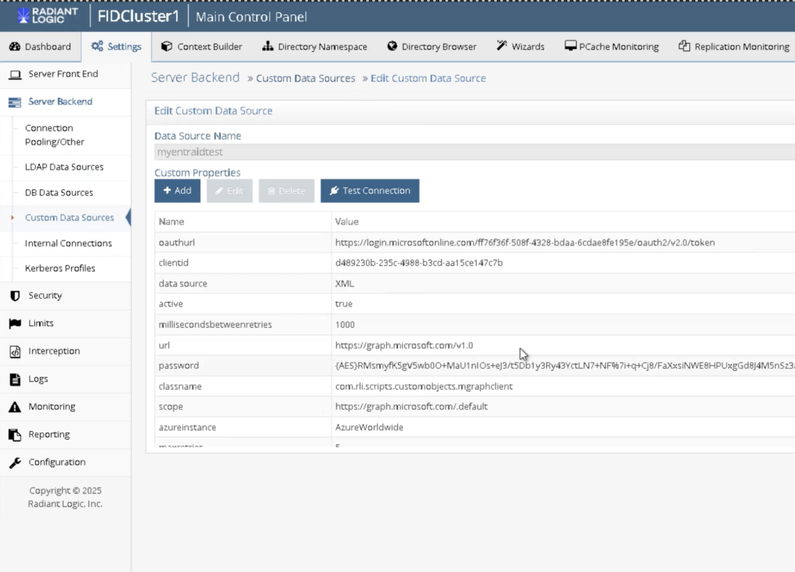


#### b. Configure Web Proxy (Optional)

* If your company requires API calls to be made through a **Web Proxy Server**:

 - Add a property named `proxy` with a value that points to the proxy server and port.  
   Example: `rli.vip.proxy.com:9090`
 
 - If SSL is required, add a property named `proxyssl` and set the value to `true`. If SSL is used, ensure **RadiantOne trusts the proxy server’s public certificate**. Manually import the certificate into the RadiantOne **Client Certificate Truststore** via: `Main Control Panel > Settings > Security > Client Certificate Truststore`
 After completing the configuration, click **OK** and then, click **Save**. 

#### c. Create View of Entra ID Users in Context Builder

1. Navigate to `Context Builder > View Designer`

2. Click the **“+”** button to create a new View:
   - Enter a **name** for the view.
   - Click **Select** next to **Schema**.
   - Under the **Custom** tab, choose the **mgraph schema** (template schema for Entra ID).
   - Click **OK**.  

  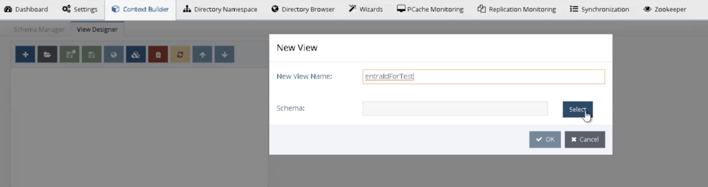

3. This creates an **empty view**.

4. To connect this view to the previously generated **Entra ID data source** (via `AzureADInitialization.exe`):

   - Click on the generated view (e.g., `entraIDForTest` as shown in the image below).
   - Click **Edit connection string**.

  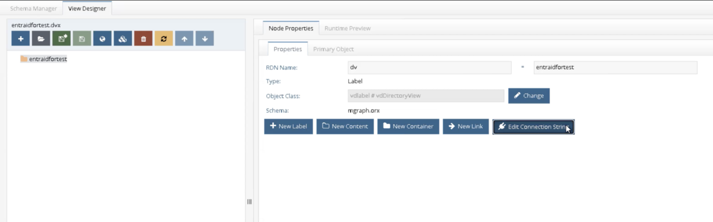

5. Click **Edit** next to **Data Source**:
   - Select the data source name generated earlier in step 2a
   - Click **OK** twice to confirm the data source selection.

  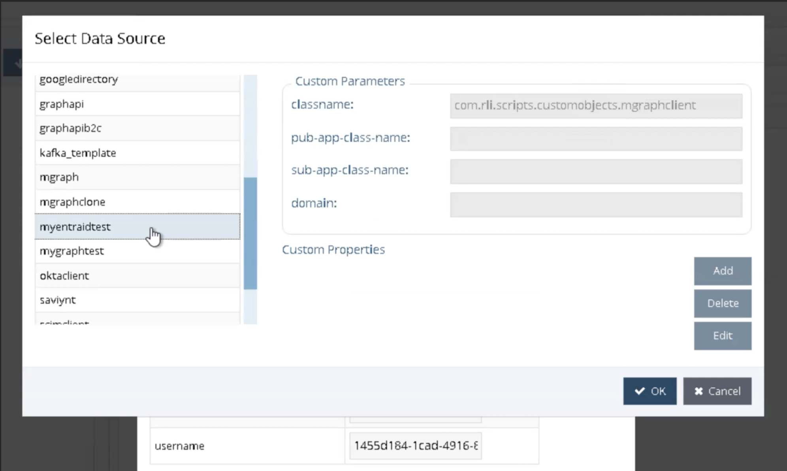

6. Create a new level for users:
   - Click **New Label**
   - Set the **ou** value to `Users`
   - Click **OK**  
  
  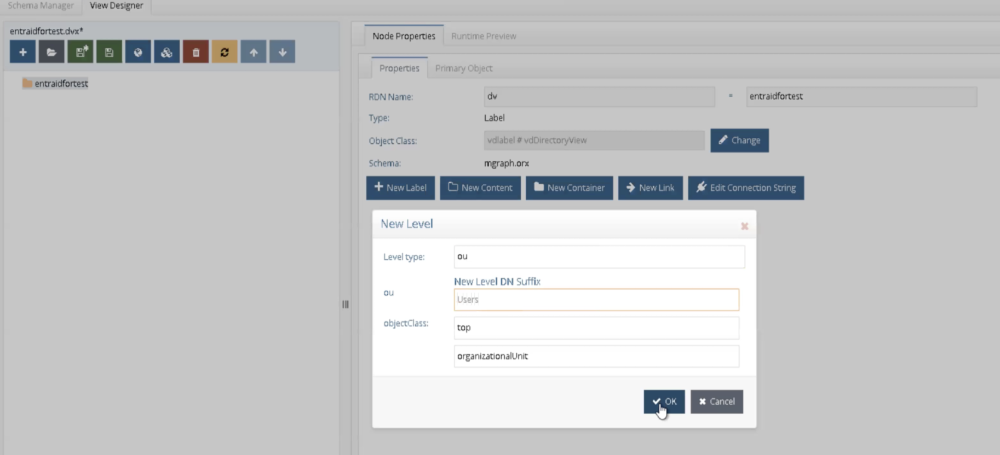


7. Select the `ou=Users` directory and click **New Content**.  

   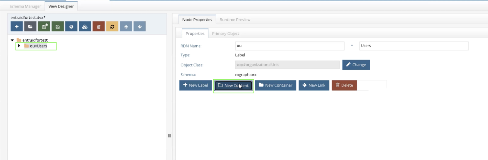

8. Select `user` and click OK. On the “user” content node, navigate to the Attributes tab and publish all attributes as mapped attributes by clicking on the publish all button as shown below: 
  
   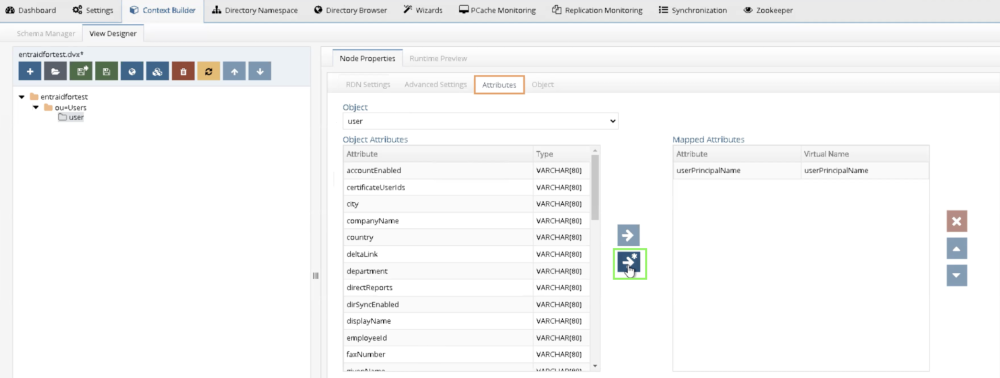

9. Click **Save** to save the view.


#### d. Create Naming Context in Directory Namespace

1. In **Directory Namespace**, create a new **virtual tree naming context** that references the `.dvx` view file created in step **b**.

   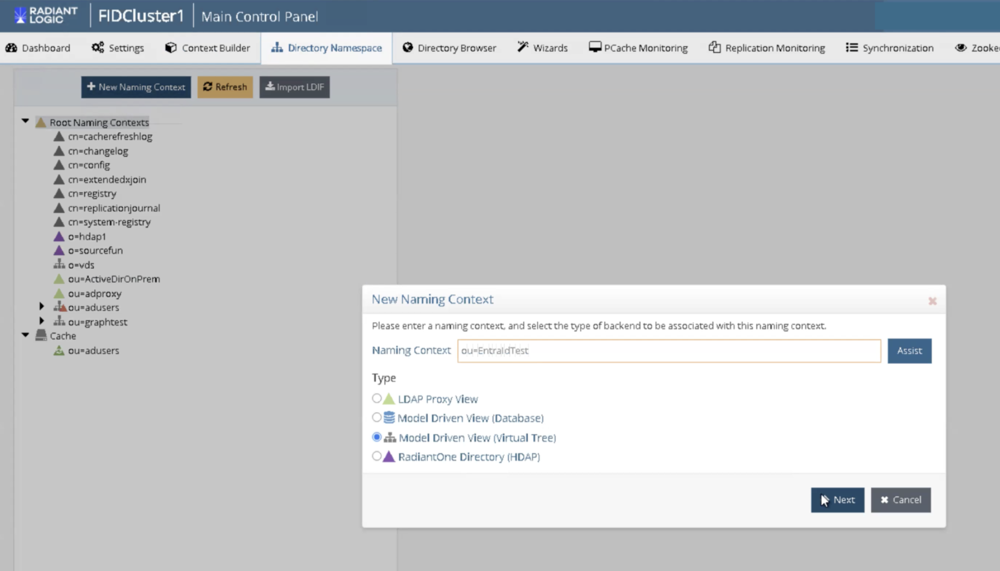

2. Name the naming context and click **Next** to populate additional details:
   - Choose **Use an existing view**
   - Select the view file from step b
   - Click **OK**

3. In **Directory Browser**, expand the naming context. You should see **Entra ID user entries** and their mapped attribute data.


### 3. Configure Global Sync

#### a. Create a New Topology

1. Click the **Synchronization** menu item to open Global sync. 

   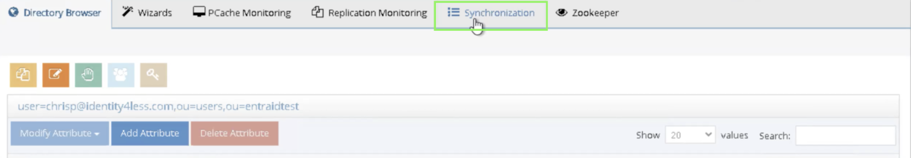

2. Click **New Topology** to create a new synchronization topology:
   * Set the **Source Naming Context** to the AD naming context created in **step 1**.
   * Set the **Target Naming Context** to the Entra ID naming context from **step 2**.

   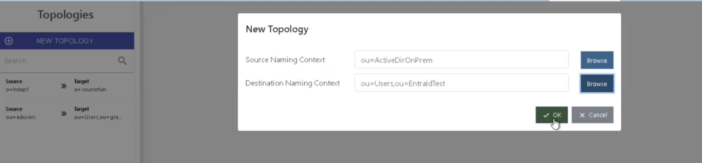

4. Click **OK**


#### b. Set Transformation Type

1. Click **Configure** to define synchronization pipelines between On-prem AD view (source) and Entra ID view (target). Set **Transformation Type** to `Rules-based`.

  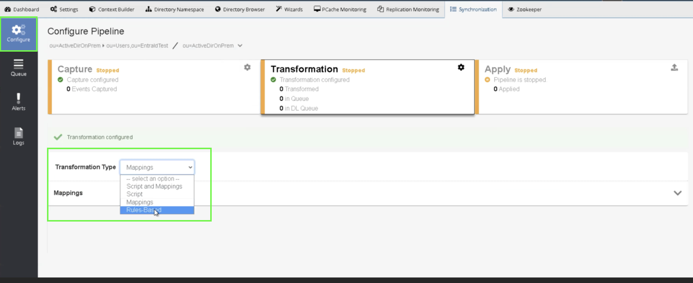

2. In the next step, you will need to set up new rules definition mapping between:
   - **Source Object Class**: `user`
   - **Target Object Class**: `azureaduser`


#### c. Define Rules: Insert, Update, Delete

In this step, you will create **rule sets** that define how data is transformed between source and target during **Insert**, **Update**, and **Delete** events. For example, when a new user is created in **on-prem AD** (insert event), you will need to define a rule that automatically maps and syncs the user to **Entra ID**.

1. To create a new rule, Click the **“+”** button and provide **basic information**  

     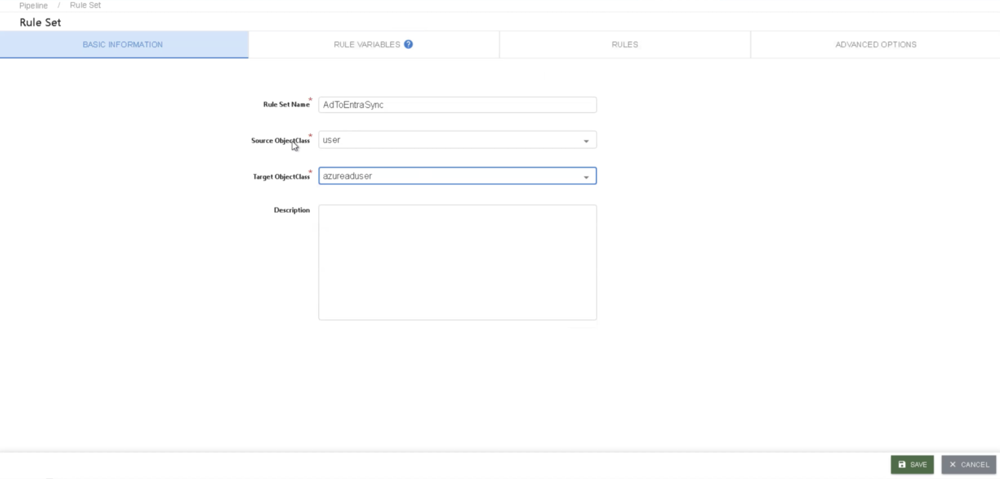

2. Go to the **Rules** tab and click the **Template** button to auto-generate Insert, Update, and Delete rule templates
  
   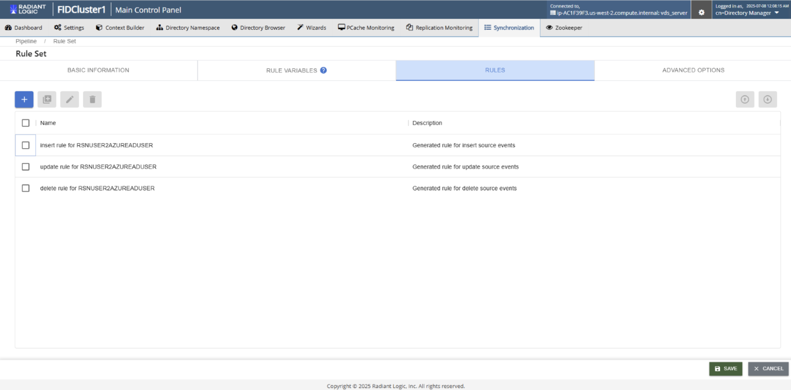


4. Next, edit each template manually as needed. To edit a template, select the checkbox next to it and click the Edit button.

   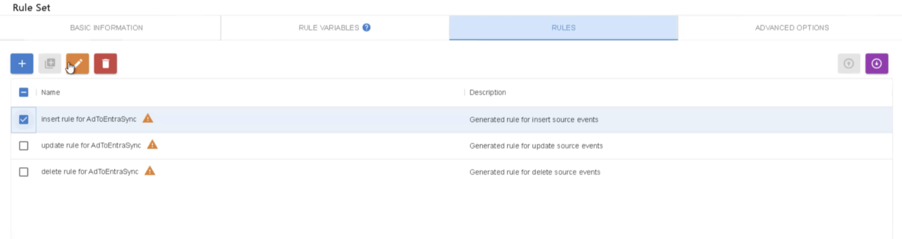

Key mappings and examples related to these rules are noted below.  


#### d. Establish Identity Linkage

To ensure effective identity linkage, it's essential that the source and target systems use matching identifiers. Set the RDN name to align with the RDN of your EntraID user content node (“user”). 

**Example: Matching Entra ID DN Format**

If the DN in the target (Entra ID) looks like "user=abc@identityforless.onmicrosoft.com", you need to configure Global Sync rules to generate this format from source (on-prem AD) values. 


**Steps to Configure Identity Linkage (Insert Event)**

1. Set the **RDN Name** to match the Entra ID user content node RDN — typically `user`. To do this, navigate to the Global Sync rule and click **Advanced Options**. Under **Target Object RDN**, select `user`.

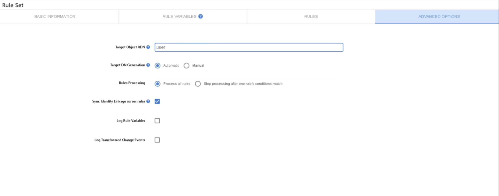


2. Determine a unique source attribute by analyzing your source data (e.g., from your on-premises Active Directory). You will often find that the source user identifiers do not match the UPN format used in Entra ID. To bridge this difference, you must select a source attribute that can be transformed into the target format and is guaranteed to be unique.
Commonly used unique attributes include userPrincipalName, sAMAccountName or other unique identifiers available in your directory.  

Example: If we take `sAMAccountName = JaneDoeU5`, we can format the Entra ID DN as `user=JaneDoeU5@identityforless.onmicrosoft.com` by appending the domain suffix (@identityforless.onmicrosoft.com) using a dynamic expression. 


#### e. Build Dynamic Expression

1. Return to the Insert Rule and click the edit icon next to Identity Linkage. After clicking edit, you should see `user` as the target attribute.   

 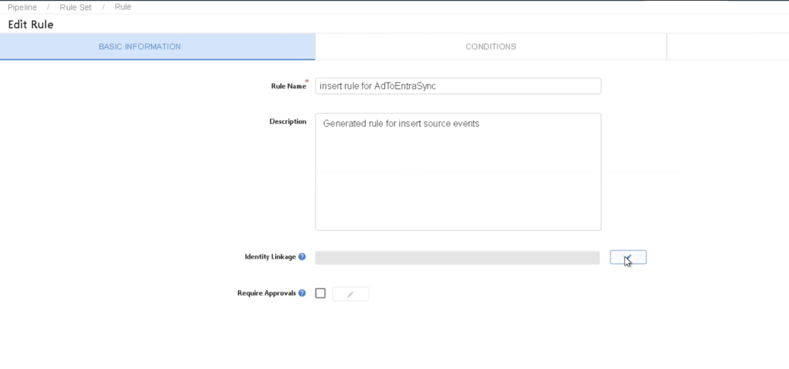


2. In the Identity Linkage UI, set the **Type** to `function`. Click **Edit** next to the function field to open **Function Mapping Interface**.

 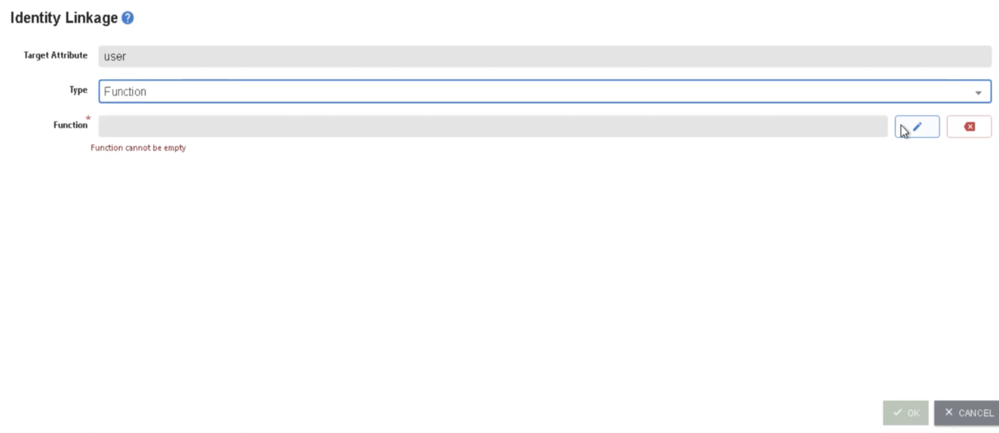


3. Click **Build Expression** in the left menu and click **Insert Attribute**. Click Next. Now, you can insert the attribute that you selected and define the expression.
   
 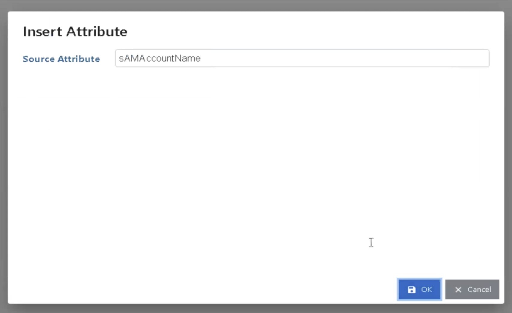


4. In the example below, we are inserting the sAMAccountName attribute and appending it with @identityforless.onmicrosoft.com.

 

  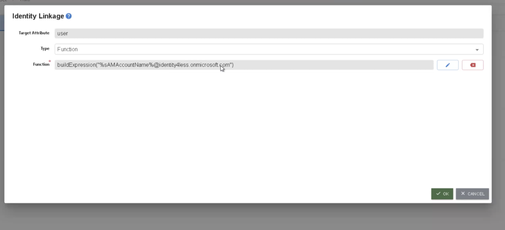

5. Click OK. The synchronization engine will then use this expression whenever it needs to insert a user into the target system, helping maintain identity consistency between the source (on-prem) and target (Entra ID) systems.

Follow a similar approach for **Update** and **Delete** rules based on your requirements.


#### f. Attribute Mappings from On-Prem AD to Entra ID

 Identify which attributes in Entra ID should be populated from your on-prem Active Directory during Insert events.  

 * Create necessary mappings under the Actions tab. Some attributes map directly (e.g., UserPrincipalName maps 1:1). Some attributes have different names in source versus target (e.g, passwordProfile-password maps with userPassword). 

#### Examples:

| Entra ID Attribute           | On-Prem AD Source         |
|-----------------------------|---------------------------|
| `userPrincipalName`         | `userPrincipalName`       |
| `passwordProfile-password`  | `userPassword`            |


1. Click the **“+”** icon next to the attribute. Select the correct mapping and click **OK**. 

  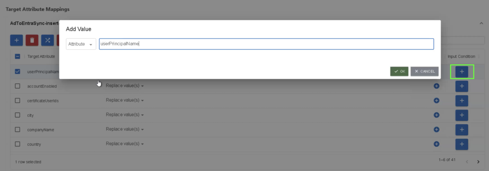


Some attributes require special handling: 
  - You must provide a boolean value for `accountEnabled` (true or false).
  - `onPremisesSyncEnabled` **must** be set to true to enable password synchronization. This is a required attribute. Synchronization will fail if this is not provided. 
  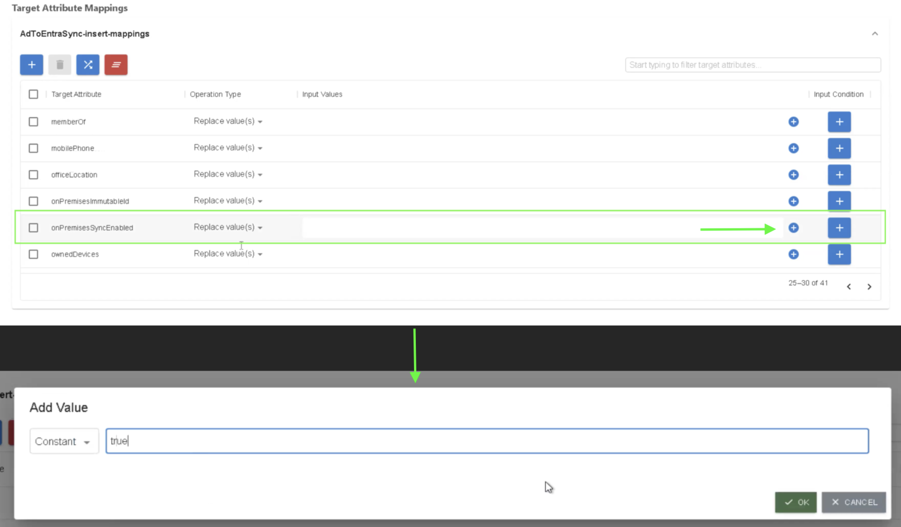
  
  - `passwordProfile-password` must map to the **computed attribute `userPassword`** from earlier steps.
  
    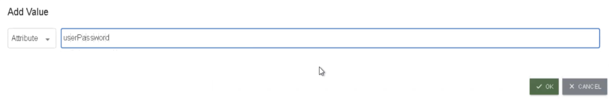

2. Map all other necessary user attributes such as name, email, job title, department, etc. as needed. Enable the Apply target attribute mappings checkbox and click OK to save the mappings.  

3. After mapping, enable **Apply Target Attribute Mappings** and click **OK**. You should see all your saved mappings in the screen. 
  
  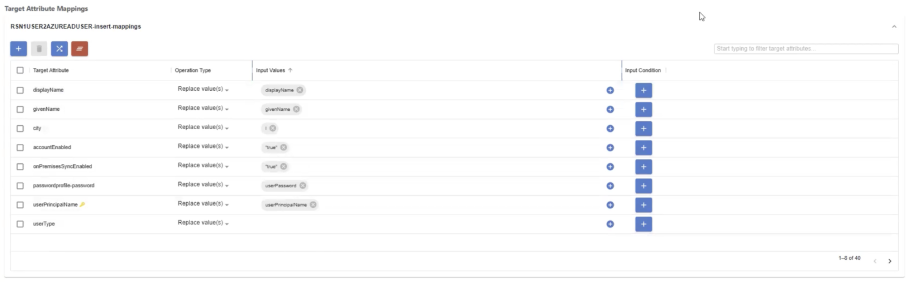

Repeat a similar approach for **Update** and **Delete** rules.


### g. Test Transformation

After setting your transformation rules for all events, you can test if the transformation rules execute as expected or not by following these steps:  

1. Navigate to `Synchronization > Transformation > Rules-Based Transformation` and click the **“<>”** icon next to the rule. 

  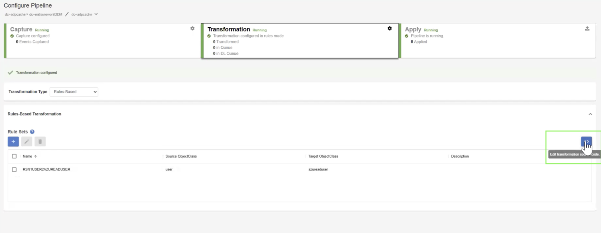


3. Click the **Test** button (top-right corner). An interface containing your current test mappings gets displayed. In this interface, edit any test attribute values. Click **Test** again. If the test succeeds, you’ll see the **transformed output** in the Output section.

At a minimum, verify the following: 

- User objects are correctly matched
- Attribute mappings are correct
- Password hash (`userPassword`) is populated properly

Examples of insert and update events mappings are shown below for reference.


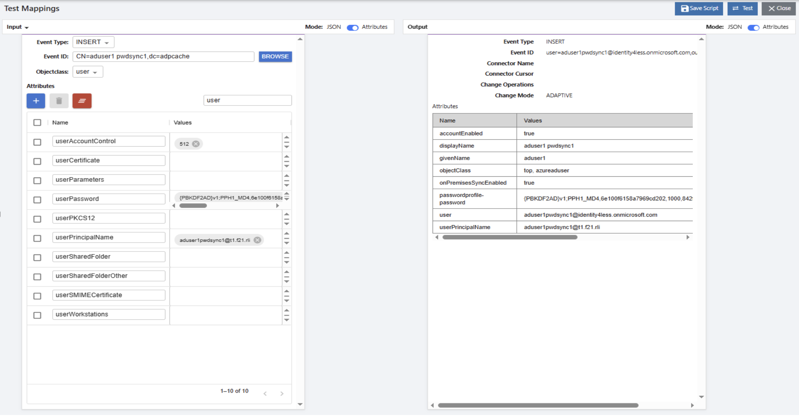

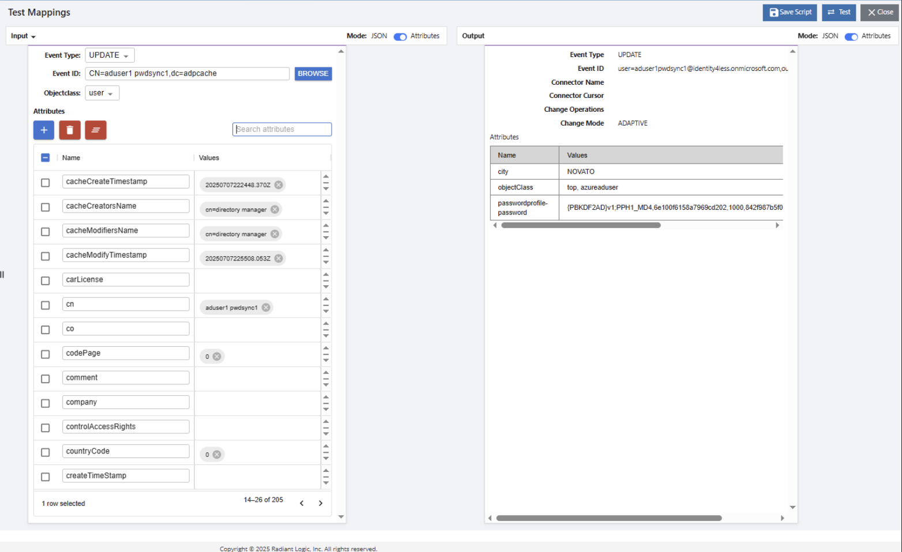


### h. Start Connectors

* Once you're ready to start synchronization, navigate to `Synchronization > Global Sync > Apply`.
  
 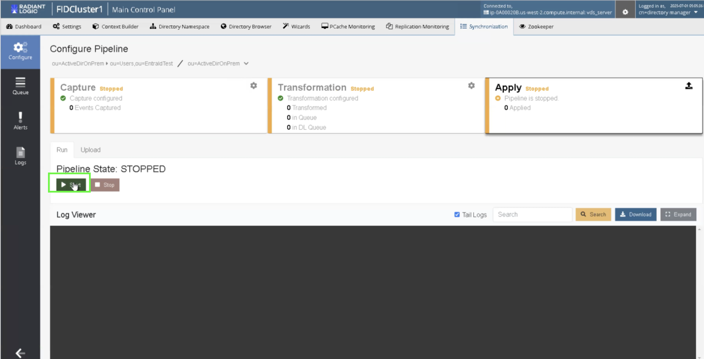

* Click the **Start** button to launch the sync pipeline.
* Ensure the **capture connector type** is set to **HDAP triggers**. This enables real-time synchronization


