# Overview

This guide walks you through synchronizing on-premises Active Directory (AD) users to Microsoft Entra ID using RadiantOne Identity Data Management (IDDM). This synchronization guide covers common user attributes such as names, email addresses and user password hash, so synchronized users can sign in to Entra ID with their on-premises credentials.

The guide focuses on identities that originate in on-premises AD and flow outbound to Entra ID through IDDM. By the end, you will have built a real-time synchronization pipeline that captures user and password changes in AD, transforms them into the format Entra ID expects, and writes them to your Entra ID tenant through Identity Data Management.

## Prerequisites

Ensure that you have the following requirements in place.

- An on-premises Active Directory environment.
- A Radiant One IDDM v8.4.0 (or later) SaaS instance.
- [Secure Data Connector](../../eoc/latest/secure-data-connector/configure-sdc-service/) is installed on a Windows machine that can reach your Active Directory.
- The Visual C++ Redistributable v143 (Visual C++ Redistributable for Visual Studio 2015–2022) must be installed on the machine where the SDC client is running.

## Steps for Synchronization

### 1. Register an Entra ID App

1. Sign in to the Microsoft Entra admin center and navigate to **Entra ID > App Registrations**.
2. Create a new **application registration**.
3. When prompted with *"What type of permissions does your application require?"*, you must select **"Application permissions"**. Grant the application the following API permissions via an admin account:

   - **Microsoft Graph Application**
     - `Directory.ReadWrite.All`
     - `User.ReadWrite.All`
   - **Microsoft Entra AD Synchronization Service Application**
     - `ADSynchronization.ReadWrite.All`
   - **Microsoft password reset service Application**
     - `PasswordWriteback.OffboardClient.All`
     - `PasswordWriteback.RefreshClient.All`
     - `PasswordWriteback.RegisterClientVersion.All`

   > **Note:** To add `ADSynchronization.ReadWrite.All`, search for *"Microsoft Entra AD Synchronization Service"* under *"APIs my organization uses"*. To add password reset permissions, search for *"Microsoft Password Reset Service"* under *"APIs my organization uses"*.

4. After the registration is created, note the following values for later use:

   - **Application (client) ID**
   - **Directory (tenant) ID**

5. Under **Certificates & secrets**, create a new client secret and copy the secret value. Store it securely.

These values will be used when registering Entra ID as a data source in Identity Data Management.

### 2. Install and start the SDC Client

1. [Install and run the SDC client](../../eoc/latest/secure-data-connector/configure-sdc-client/#deploy-on-windows) on the same Windows machine as your AD domain controller, or on another Windows host that has network access to AD over the ports used by your directory (typically 389 for LDAP or 636 for LDAPS).

### 3. Configure On-Prem AD as a Data Source

1. Navigate to **Control Panel > Setup > Data Catalog > Data Sources**.
2. Click on the **New Source** button and select **Active Directory**.
3. Configure your Active Directory to use the SDC group you registered in step 2, so Identity Data Management reaches AD through SDC.

   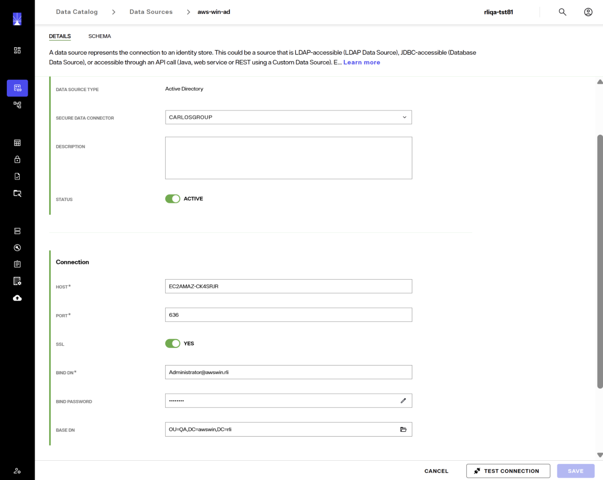

   Fill in the AD connection details:

   - **Host**: the hostname or IP address of your domain controller.
   - **Port**: typically 389 (LDAP) or 636 (LDAPS).
   - **SSL**: enable if you are using LDAPS (recommended).
   - **Bind DN**: the service account used to bind to AD.
   - **Bind Password**: the password for the bind account.
   - **Base DN**: the distinguished name of the container IDDM should read from (for example, `OU=QA, DC=awswin,DC=rli`).

4. Test the connection to confirm it binds successfully and save this data source.

### 4. Create a Proxy for AD

1. Navigate to **Directory Namespace > Namespace Design** and create a proxy based on the AD data source you just configured in Step 3.

   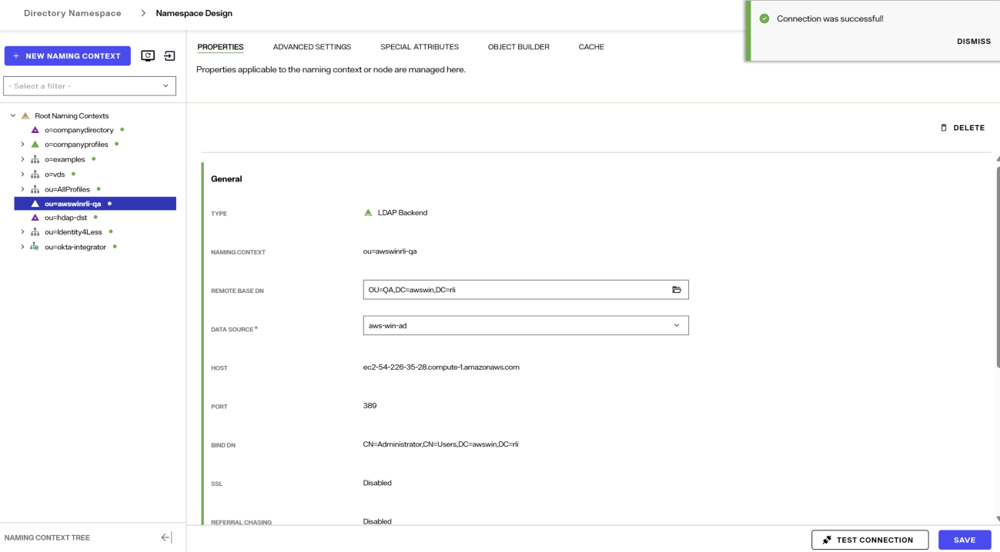

2. Set the proxy naming context (for example, `ou=awswinrli-qa`).
3. Open the **Object Builder** for the proxy and set the AD `user` object class as the primary object.

   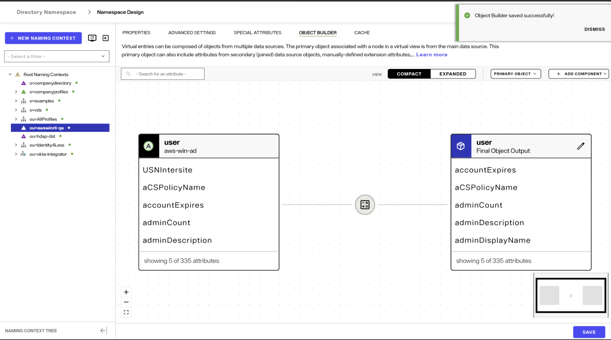

4. In **Directory Schema → Computed Attributes**, add the following computed attributes:

   a. **immutableid**

   ```
   immutableid = getHexGUIDForDn("aws-win-ad", distinguishedName)
   ```

   Replace `"aws-win-ad"` with the name of your AD connection.

   b. **userPassword**

   ```
   userPassword = getADPasswordMD4()
   ```

   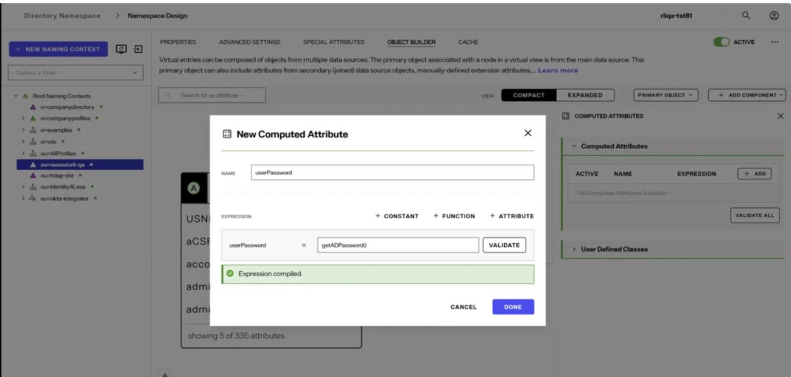

5. Navigate to **Directory Namespace → Caches** and create a Realtime Cache for the AD proxy. Set the **Refresh Type** to **DirSync**.

   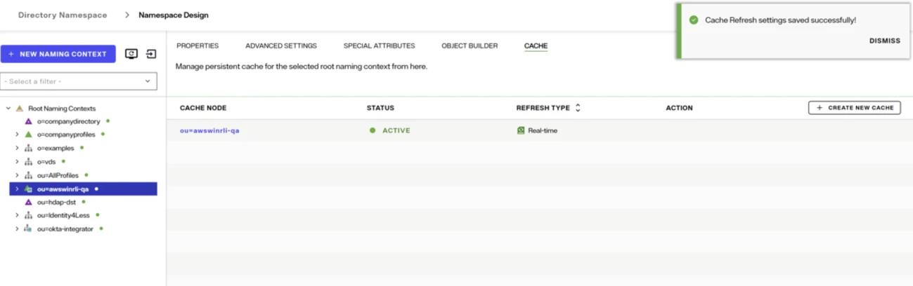

6. Initialize the cache. Initialization may take longer than usual because each entry computes `userPassword` and `immutableid`. Once complete, the cached proxy is the source for your sync pipeline.

### 5. Configure the Entra ID Target Connector

1. In **Data Sources**, create a Microsoft Entra ID data source if one does not already exist.
2. Configure it using the App Registration values captured in Step 1:

   a. Client ID
   b. Tenant ID
   c. Client secret

3. Test the connection test and confirm it passes.
4. Navigate to **Directory Namespace > Namespace Design** and create a proxy based on the Entra ID data source you just configured.

### 6. Create the AD to Entra ID Sync Pipeline

1. Open **Classic Control Panel**, navigate to **Pipelines**.
2. Create a new topology for the pipelines with the following:

   a. **Source:** the cached AD proxy.
   b. **Target:** the Entra ID naming context that points to your Entra data source.

3. Set the capture connector on the source to **HDAP trigger** so that real-time changes, including password changes, are captured.
4. Click on the Transformation section of the synchronization pipeline. In the Transformation tab, configure a ruleset for user provisioning and password sync.
5. On the **Basic Information** tab, provide:

   - **Rule Set Name**: for example, `ADToEntra`.
   - **Source Object Class**: `user`.
   - **Target Object Class**: `azureaduser`.

   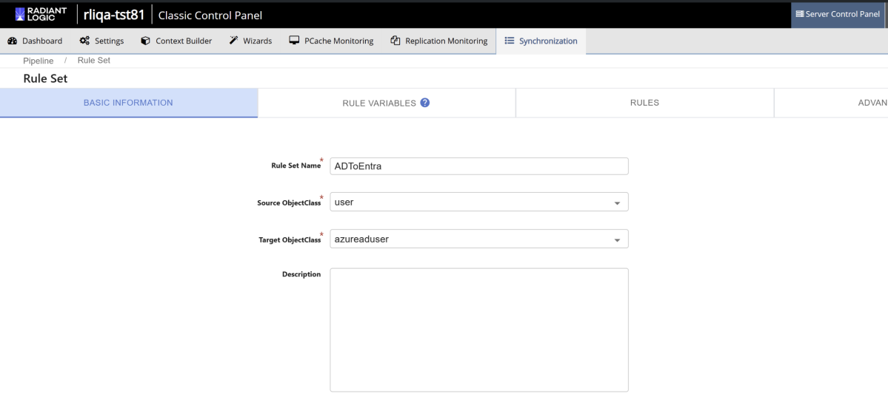

6. On the **Rules** tab, add both **INSERT** and **UPDATE** rules. Add a **DELETE** rule as well if you want deletions in AD to flow through to Entra ID.

   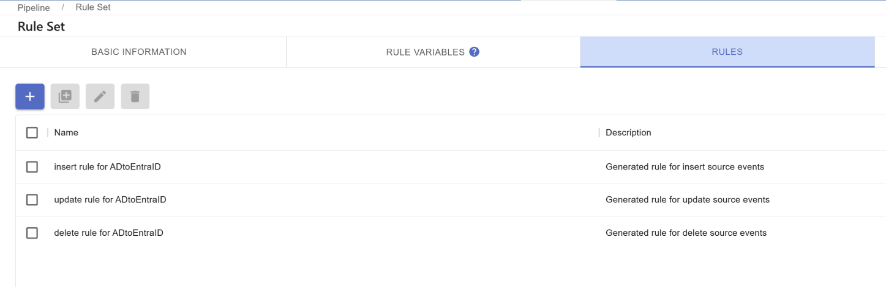

7. Select the insert rule and click the edit icon to edit its details.

   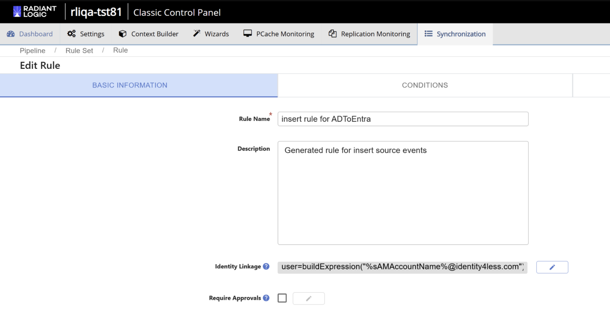

   Under **Identity Linkage**, set the expression that builds the Entra UPN. For example:

   ```
   buildExpression("%sAMAccountName%@identity4less.com")
   ```

8. Under **Actions > Target Attribute Mappings**, configure the following source-to-target mappings at a minimum:

   | Entra ID attribute | Source / value |
   |---|---|
   | `passwordprofile-password` | `userPassword` (computed attribute) |
   | `unicodePwd` | `userPassword` (computed attribute) |
   | `accountEnabled` | `true` |
   | `dirsyncenabled` | `true` (you may need to add this attribute manually) |
   | `mailNickname` | `sAMAccountName` |
   | `givenName` | `sAMAccountName` |
   | `displayName` | `sAMAccountName` |
   | `onPremisesImmutableId` | `immutableid` |
   | `userPrincipalName` | `sAMAccountName` |

   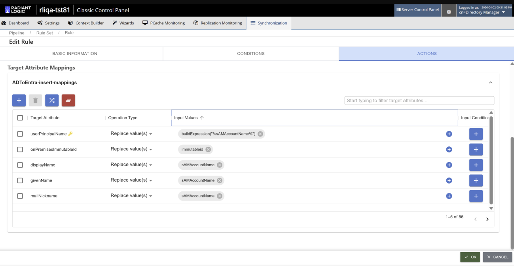

   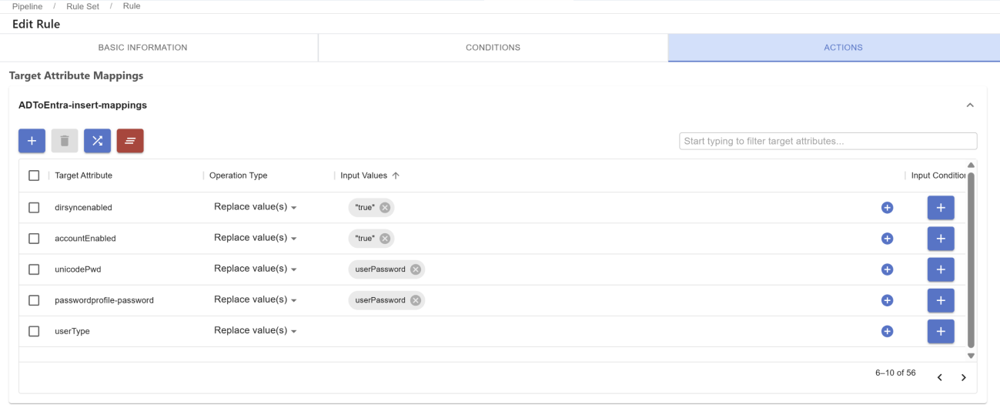

   Follow a similar approach when setting up the Update and Delete rules based on your requirements.

9. In the advanced options, make the following selections:

   - **Target Object RDN** — Set the value to `user`, so the pipeline uses the `user` attribute to build the target DN.
   - **Target DN Generation** — Select **Automatic** to let the pipeline generate target DNs from the RDN and naming context.
   - **Rules Processing** — Select **Process all rules** so every matching rule is evaluated for each change event.
   - **Sync Identity Linkage across rules** — Enable this to share identity linkage across all rules in the rule set.

   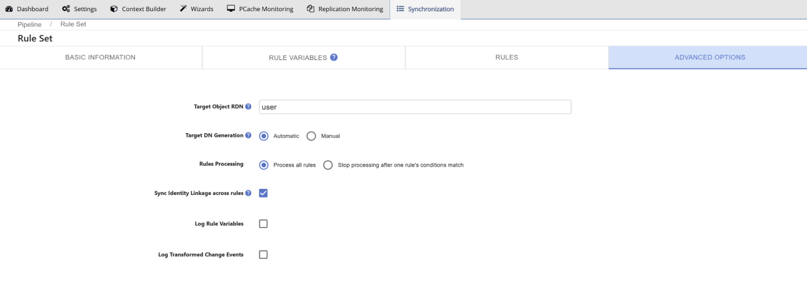

   After finalizing your changes, save and enable the ruleset.

### 7. Verify the Synchronization

With the pipeline running, perform these steps to verify that the user details including the password hash is synchronized from AD to Entra ID:

1. Create a test user in AD, through the Identity Data Management AD proxy.

   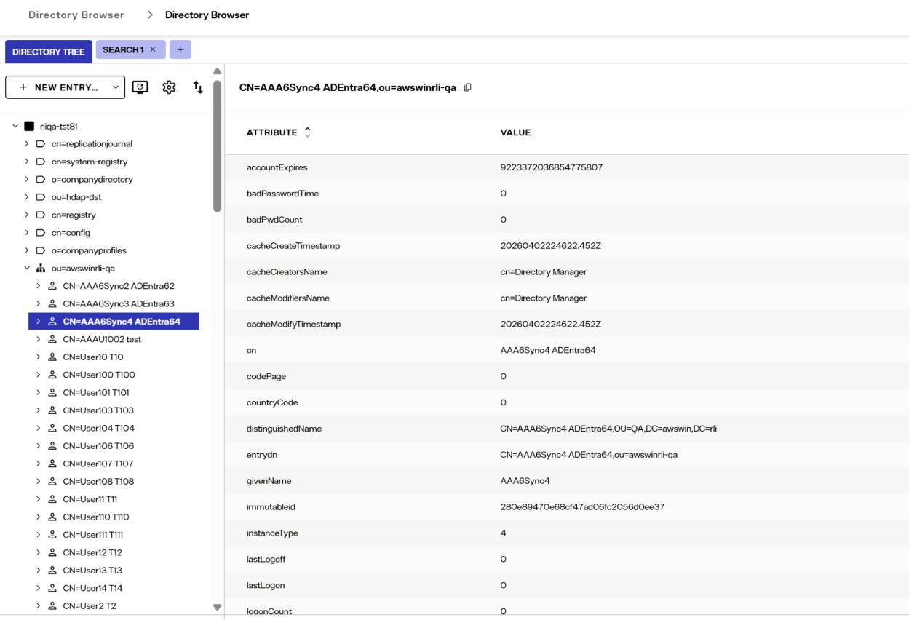

2. Reset the password of the test user.
3. Verify the following:

   a. The user record appears in Entra ID.
   b. Pipeline logs show successful processing of the user.
   c. The SDC log includes a `CONVERT_PWD_SUCCESS` message.
   d. The user can successfully login to Entra ID using the new password.
