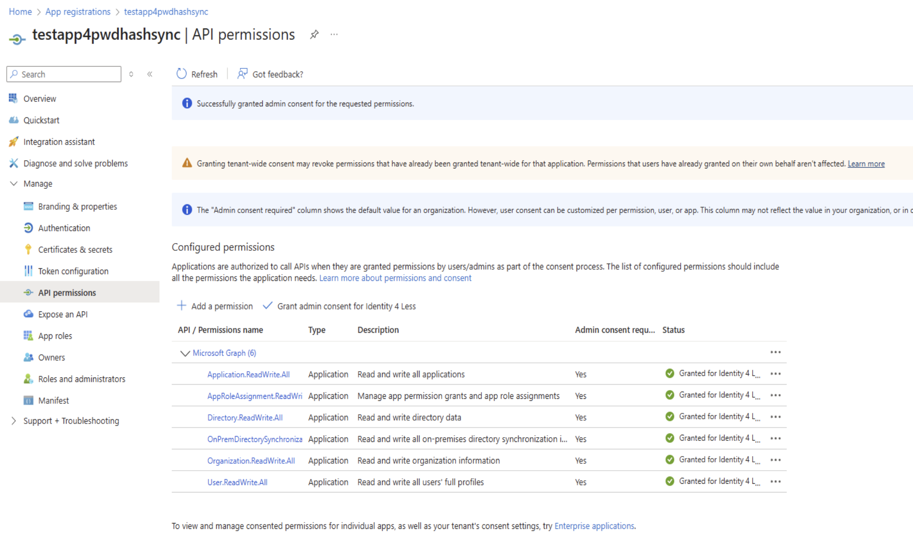
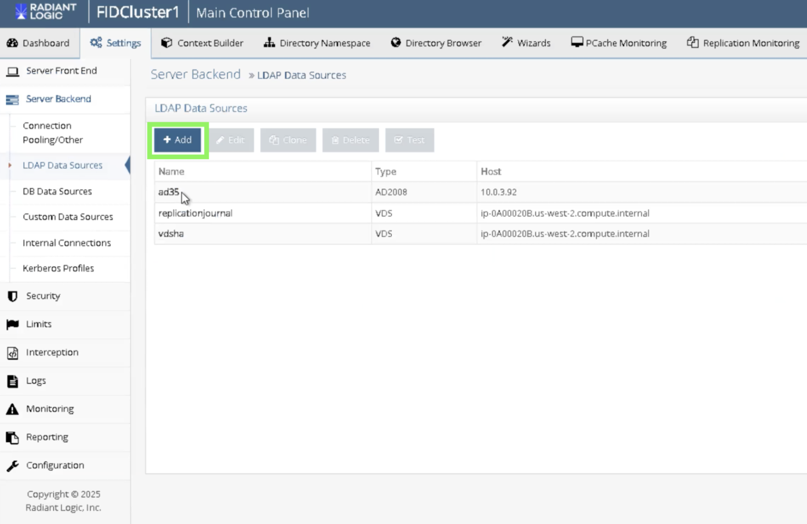
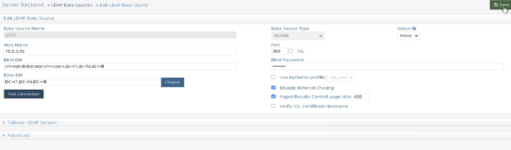
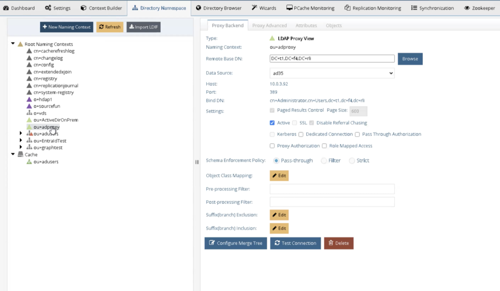
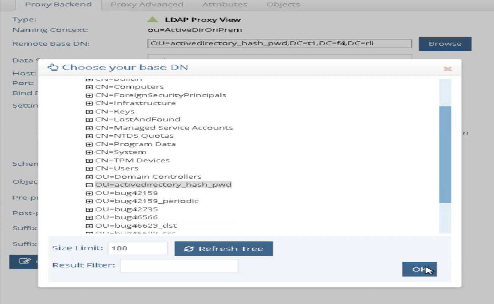
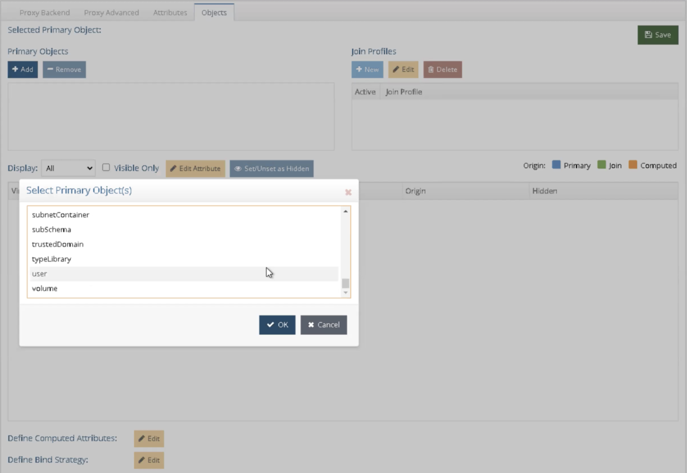
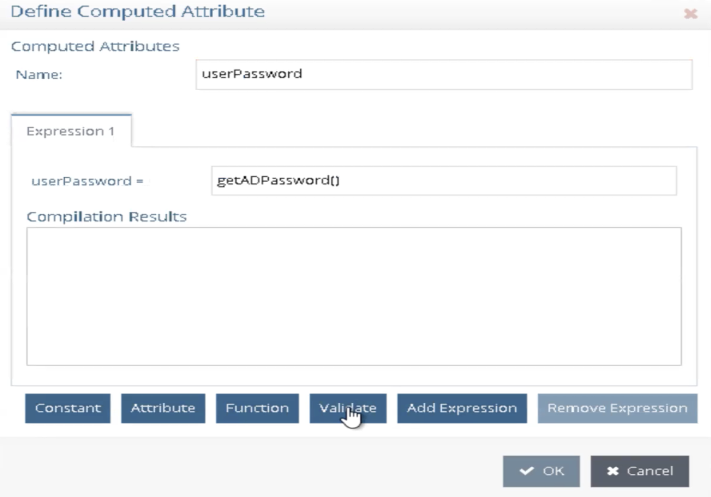

## Overview

This document provides the steps to synchronize on-premises Active Directory (AD) users to Entra ID (formerly Azure Active Directory) using Identity Data Management.  
 
This synchronization includes common user attributes such as names, email addresses, group memberships as well as users’ password hash, allowing synchronized users to sign in to Entra ID with their on-prem credentials. 

This guide focuses on users whose identities are initially created in the on-premises Active Directory and then synchronized to Entra ID using Identity Data Management. 


## Prerequisites

### Identity Data Management Requirements

Ensure that Identity Data Management is deployed in an environment that meets the following requirements:

- **Operating System**: Windows only  
- **.NET Framework**: Version 4.8 or higher  
- **Connectivity**:  
- Your Identity Data Management server must have network connectivity to the on-premises Active Directory domain controller


### Register an Application on Entra ID

Manually create an application in the Entra ID portal before using the `AzureADInitialization` tool. This app will grant programmatic access to Identity Data Management to manage user objects in Entra ID.

#### Steps for Application Creation

1. Navigate to **Entra ID Portal > App Registrations**.
2. Create a new **application registration**.
3. Copy and securely store the following values:
   - **Client ID**
   - **Client Secret** (generate a secret under **Certificates & Secrets**)
   - **Tenant ID**
4. Grant the application the following API permissions via an admin account:

   **Microsoft Graph:**
   - `User.ReadWrite.All`
   - `Directory.ReadWrite.All`
   - `Application.ReadWrite.All`
   - `AppRoleAssignment.ReadWrite.All`
   - `Organization.ReadWrite.All`
   - `OnPremDirectorySynchronization.ReadWrite.All`





In a later step, you will use the application details from your registered Entra ID application to create a second application using `AzureADInitialization.exe` provided by RadiantOne Identity Data Management.


### Setting Up the Sync

#### 1. Configure On-Prem AD as a Data Source

##### a. Create an Active Directory Data Source

* Open the **Control Panel** in Identity Data Management and navigate to `Settings > LDAP Data Sources`.
* Click the **Add** button to add a new LDAP data source that points to your **Active Directory** domain controller. An example is shown below:

   
* Provide all the details that are required, test the connection, and save your changes. Use secure bind credentials with read access to the targeted user objects. The image below shows an example for reference:

   


##### b. Configure LDAP Proxy Naming Context for Your AD

* Under Directory Namespace, create a new LDAP proxy naming context using the AD data source. For example, the image below shows a proxy      name “adproxy” that points to a sample AD data source named “ad35” that was created in step a. Names can be customized.  

    

* In the **Remote Base DN**, click **Browse**, specify the scope, and click **OK**.  

    

* In the Objects tab, ensure the object class associated with your user accounts in Active Directory (e.g., user) is added to the Primary Objects section. If not present, click the Add button to include it.  

    

   

* At the bottom of the **Objects** tab, click **Edit** next to **Define Computed Attributes**.
   - Click **Add** and enter the following:
     - **Name**: `userPassword`  
     - **Function**: Click **Function**, select `getADPassword()`, click **OK**  
     - Validate the expression and click **OK**

    

* **Save** your changes.  
   - This attribute will now hold the **password hash** for each synced on-prem AD user.


##### c. Configure Persistent Cache

* Create and initialize a **persistent cache** on the LDAP Proxy Naming Context with real-time refresh using **DirSync** or **USN Active Directory connector**.


#### 2. Configure Entra ID as a Data Source

##### a. Run AzureADInitialization.exe

1. Open CLI and run the AzureADInitialization script:

   ```shell
   C:\radiantone\vds\bin\ad_pwd>AzureADInitialization.exe
[Insert Picture]

This launches a service account registration process on Entra ID used by RadiantOne.

When prompted, provide:

Tenant ID (Entra ID admin account)

Email address (Entra ID admin)

Client ID of the previously registered Entra ID app

Client Secret of the previously registered app

A unique data source name for the Entra ID data source

Yes/No responses to any additional prompts
[Insert Picture]

When prompted to create a new application for sync, type:
Y
and press Enter.

When asked for the vdsconfig file location, press Enter to accept the default.

Provide a name for the Entra ID data source and press Enter.

Note the name used.
[Insert Picture]

After completing the steps, a pre-configured data source is created in your Identity Data Management instance.

To view it, navigate to:

Main Control Panel > Settings tab > Server Backend > Custom Data Sources section
[Insert Picture]


#### Optional: Configure Web Proxy (If Required)

If your company requires API calls to be made through a **Web Proxy Server**:

- Add a property named `proxy` with a value that points to the proxy server and port.  
  _Example_:  
  `rli.vip.proxy.com:9090`

- If SSL is required, add a property named `proxyssl` and set the value to `true`.

If SSL is used:

- Ensure **RadiantOne trusts the proxy server’s public certificate**.
- Manually import the certificate into the RadiantOne **Client Certificate Truststore** via:  
  `Main Control Panel > Settings > Security > Client Certificate Truststore`

After completing the configuration:

- Click **OK**
- Then click **Save**


#### b. Create View of Entra ID Users in Context Builder

1. Navigate to:  
   `Context Builder > View Designer`

2. Click the **“+”** button to create a new view:
   - Enter a **name** for the view.
   - Click **Select** next to **Schema**.
   - Under the **Custom** tab, choose the **mgraph schema** (template schema for Entra ID).
   - Click **OK**.  
   _[Insert Picture]_

3. This creates an **empty view**.

4. To connect this view to the previously generated **Entra ID data source** (via `AzureADInitialization.exe`):

   - Click on the generated view (e.g., `entraIDForTest`)
   - Click **Edit connection string**

   _[Insert Picture]_

5. Click **Edit** next to **Data Source**:
   - Select the data source name generated earlier in step 2a
   - Click **OK** twice to confirm  
   _[Insert Picture]_

6. Create a new level for users:
   - Click **New Label**
   - Set the **ou** value to `Users`
   - Click **OK**  
   _[Insert Picture]_

7. Select the `ou=Users` directory and click **New Content**

   _[Insert Picture]_

8. Select `user` and click **OK**

9. On the `user` content node:
   - Go to the **Attributes** tab
   - Publish all attributes as **mapped attributes**  
     (click the button that publishes all)  
   _[Insert Picture]_

10. Click **Save** to store the view.


#### c. Create Naming Context in Directory Namespace

1. In **Directory Namespace**, create a new **virtual tree naming context** that references the `.dvx` view file created in step **b**.

   _[Insert Picture]_

2. When prompted:
   - Name the naming context
   - Click **Next** to populate additional details
   - Choose **Use an existing view**
   - Select the view file from step b
   - Click **OK**

3. In **Directory Browser**:
   - Expand the naming context
   - You should now see **Entra ID user entries** and their mapped attribute data


### 3. Configure Global Sync

#### a. Create a New Topology

1. Open **Global Sync** by clicking **Synchronization**

   _[Insert Picture]_

2. Click **New Topology** to create a new synchronization topology:

   - Set the **Source Naming Context** to the AD context created in **step 1**
   - Set the **Target Naming Context** to the Entra ID context from **step 2**

   _[Insert Picture]_

3. Click **OK**


### b. Set Transformation Type

1. Click **Configure** to define synchronization pipelines between:

   - **Source**: On-prem AD view
   - **Target**: Entra ID view

2. Set **Transformation Type** to `Rules-based`

   _[Insert Picture]_

3. Define a new rules definition mapping:

   - **Source Object Class**: `user`
   - **Target Object Class**: `azureaduser`


### c. Define Rules: Insert, Update, Delete

In this step, you will create **rule sets** that define how data is transformed between source and target. This includes handling:

- **Insert**
- **Update**
- **Delete**

For example:

- When a new user is created in **on-prem AD**, define a rule that automatically maps and syncs the user to **Entra ID**.

To create a new rule:

- Click the **“+”** button

### c. Define Rules: Insert, Update, Delete (continued)

To create a new rule:

1. Click the **“+”** button
2. Provide **basic information**  
   _[Insert Picture]_

3. Go to the **Rules** tab and click the **Template** button to auto-generate Insert, Update, and Delete rule templates  
   _[Insert Picture]_

4. To edit any rule:
   - Select the checkbox next to the rule
   - Click the **Edit** button  
   _[Insert Picture]_


### Identity Linkage / RDN Configuration

To ensure proper synchronization, you must configure **identity linkage** between the source and target systems by aligning their **RDN (Relative Distinguished Name)** formats.

#### Example: Matching Entra ID DN Format

If the DN in the target (Entra ID) looks like:
user=abc@identityforless.onmicrosoft.com

You need to configure Global Sync rules to generate this format from source values.


#### Steps to Configure Identity Linkage (Insert Event)

1. Set the **RDN Name** to match the Entra ID user content node RDN — typically `user`.
   - Navigate to the Global Sync rule
   - Click **Advanced Options**
   - Under **Target Object RDN**, select `user`  
   _[Insert Picture]_

2. **Determine Source Attribute**  
   - Review your on-prem AD source data
   - Choose a unique attribute such as `sAMAccountName`, `userPrincipalName`, or a custom attribute

> Example:  
> If `sAMAccountName = JaneDoeU5`, we can format the Entra ID DN as `user=JaneDoeU5@identityforless.onmicrosoft.com`


#### Build Dynamic Expression

1. In the **Insert Rule**, click the **Edit** icon next to **Identity Linkage**
   - You should see `user` as the target RDN  
   _[Insert Picture]_

2. Set the **Type** to `function`

3. Click **Edit** next to the function field to open **Function Mapping Interface**

4. Navigate to **Build Expression** in the left panel
   - Click **Insert Attribute**
   - Choose the source attribute (`sAMAccountName`)
   - Append the Entra domain suffix  
   _[Insert Picture]_

5. Click **OK**  
   - This ensures identity consistency between the source (on-prem) and target (Entra ID)

6. Repeat this method for **Update** and **Delete** rules if needed.


### Attribute Mappings from On-Prem AD to Entra ID

During **Insert events**, define attribute mappings to populate Entra ID fields from on-prem AD:

#### Examples:

| Entra ID Attribute           | On-Prem AD Source         |
|-----------------------------|---------------------------|
| `userPrincipalName`         | `userPrincipalName`       |
| `passwordProfile-password`  | `userPassword`            |
| `accountEnabled`            | Must be set to `true`     |
| `onPremisesSyncEnabled`     | Must be set to `true`     |

- Click the **“+”** icon next to the attribute
- Select the correct mapping
- Click **OK**  
  _[Insert Picture]_

> **Note:**  
> - `accountEnabled` and `onPremisesSyncEnabled` **must** be set explicitly.  
> - `passwordProfile-password` must map to the **computed attribute `userPassword`** from earlier steps.

#### Additional Attribute Suggestions

- `displayName`
- `mail`
- `jobTitle`
- `department`
- `givenName`
- `surname`

After mapping:

- Enable **Apply Target Attribute Mappings**
- Click **OK**  
  _[Insert Picture]_

Repeat a similar approach for **Update** and **Delete** rules.


### d. Test Transformation

After configuring rules:

1. Navigate to:  
   `Synchronization > Transformation > Rules-Based Transformation`

2. Click the **“<>”** icon next to the rule  
   _[Insert Picture]_

3. Click the **Test** button (top-right corner)

4. In the test interface:
   - Edit any test attribute values
   - Click **Test** again

#### Things to Verify:

- User objects are correctly matched
- Attribute mappings are correct
- Password hash (`userPassword`) is populated properly

_Example: Insert Test Mapping_  
_Example: Update Test Mapping_  
_[Insert Pictures]_

If the test succeeds, you’ll see the **transformed output** in the Output section.


### e. Start Connectors

Once you're ready to execute synchronization:

1. Navigate to:  
   `Synchronization > Global Sync > Apply`

2. Click the **Start** button to launch the sync pipeline  
   _[Insert Picture]_

> Ensure the **capture connector type** is set to:
> **HDAP triggers** — this enables real-time synchronization


