# Overview 

The RadiantOne Identity Data Management service acts as a virtual hub, capable of virtualizing and synchronizing data from all your identity sources for administration, management, and provisioning to other applications in the required format. 

The purpose of this guide is to provide the necessary steps to implement the RadiantOne Okta connector for creating virtual identity views of data from Okta Universal Directory.

## Prerequisites

Log into the Okta Admin Dashboard and create an API token that the RadiantOne service can use to access identity data in Okta Universal Directory. The screen below shows the location. Verify the Okta documentation to ensure the correct steps are followed since the Okta interface may have changed.

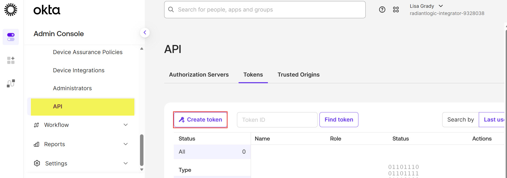

Ensure you copy the token value that is generated in the Okta Admin Dashboard, you will need it when creating the data source in RadiantOne.

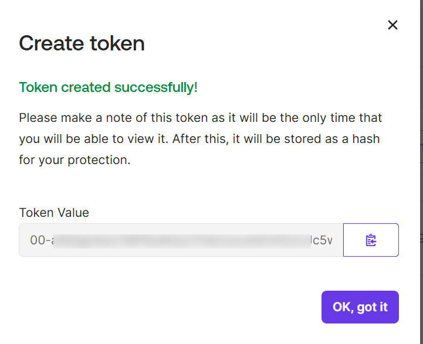

## RadiantOne Configuration Steps

### Create a Data Source

Log into the Identity Data Management Control Panel UI using an account with sufficient privileges to manage Data Sources, Namespaces, and Schema configuration. All setup is performed through point-and-click operations in the UI.

1. After logging into Identity Data Management Control Panel, select Data Catalog > Data Sources from the navigation pane on the left hand side and click **NEW SOURCE**.
   
1. Click the ’OKTA’ tile from the list of displayed data sources on the OTHER tab and click the 'Select' button.
   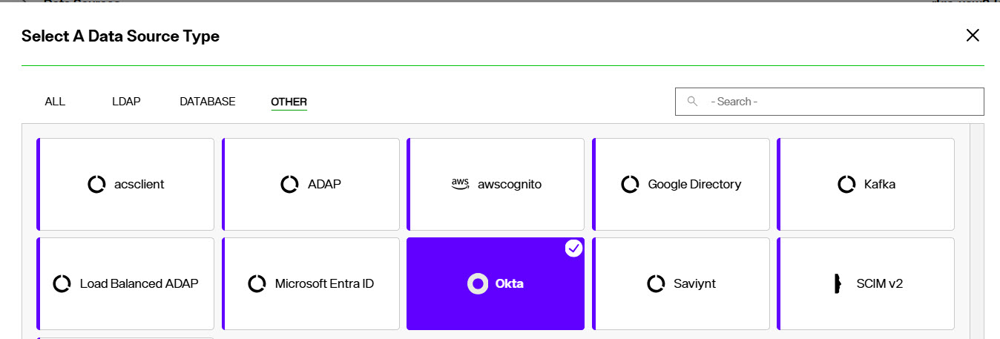
1. Enter a unique name for the Data Source, along with a description. The description field is optional.  The ‘ACTIVE’ toggle should be selected by default, if not, enable it. The ‘SECURE DATA CONNECTOR’ field is not a part of this set up, so leave that set to ‘None’. Note that certain characters are not allowed in the Data Source Name, including dashes (-).  The system will provide an error message should there be any issue with the name provided.
   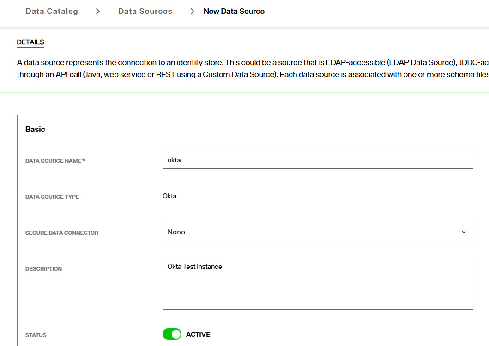

1. Scroll down to the ‘Connection Info’ section. Enter the required information as shown for the target Okta environment. The following properties apply to Okta.

PROPERTY	| DESCRIPTION
-|-
URL	| Must be the tenant's Okta base URL e.g. https://radiantlogic.okta.com/
APITOKEN	| The API token created in the Okta Admin Dashboard. Shown above.
MAXRETRIES 	| Maximum request retries if failure.
TIMEOUT	| Request timeout in number of seconds.
RATELIMIT | Any positive integer. Indicates the maximum requests per minute that RadiantOne will send (to avoid throttling). 
PROXY | Provide a value that points to the HTTP proxy address and port if your org requires a HTTP web proxy  
PROXYSSL | HTTPS proxy address (host:port) used for SSL/TLS traffic to the Okta Service

5. Click the **TEST CONNECTION** button to validate the credentials and connectivity.  A pop up notification will be displayed with the results of the test.  If the test is not successful additional information will be displayed to assist with troubleshooting.   
When done with the configuration and test, click **CREATE**. 

After the Data Source has been created, you will be taken back to the main Data Source page and should see the newly created Data Source, showing ‘ACTIVE’. 

### Managing the Schema for the Data Source 

The default schema for Okta is included with the template and can be seen from the **SCHEMA** tab with the Okta data source selected. Users, Groups and Apps are the objects supported with the out-of-the-box Okta template.

1. From the Control Panel > Setup > Data Catalog > Data Sources > Data Source page, click on the newly created Data Source.
2. Click on the **SCHEMA** tab at the top of the Data Source page. 
3. Expand the Tables section to view the objects and each object can be expanded to view the attributes. 

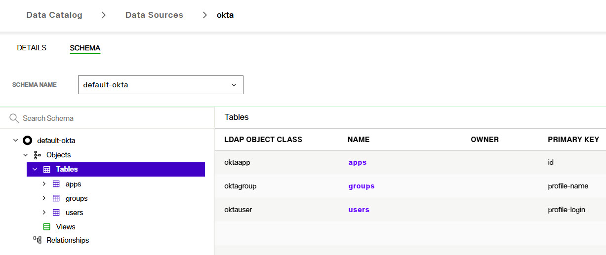

### Create a Virtual Identity View 

1. In Control Panel, go to SETUP > Directory Namespace > Namespace Design from the navigation panel on the left. 
2. Click on the ‘NEW NAMING CONTEXT’ button to initiate the process to create the virtual view. 
3. The drop-down provides additional label options, such as ‘cn’ and ‘dc’.  The selection of the label name is subject to your design and desired representation of the data.  For this example, we are using ‘o’ (organization’) and 'okta' as the value as the root object. 
 
Once you select a label name and value, click on **CONFIRM**. 

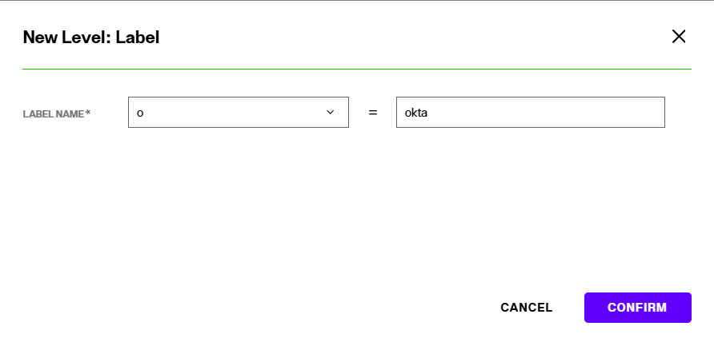 

4. At the root level that was just created, select and then click +NEW LEVEL > Label.  These steps go over a basic virtual view. However, you may customize your view any way you choose.

5. Name the Label level `ou=Users` and click **CONFIRM**

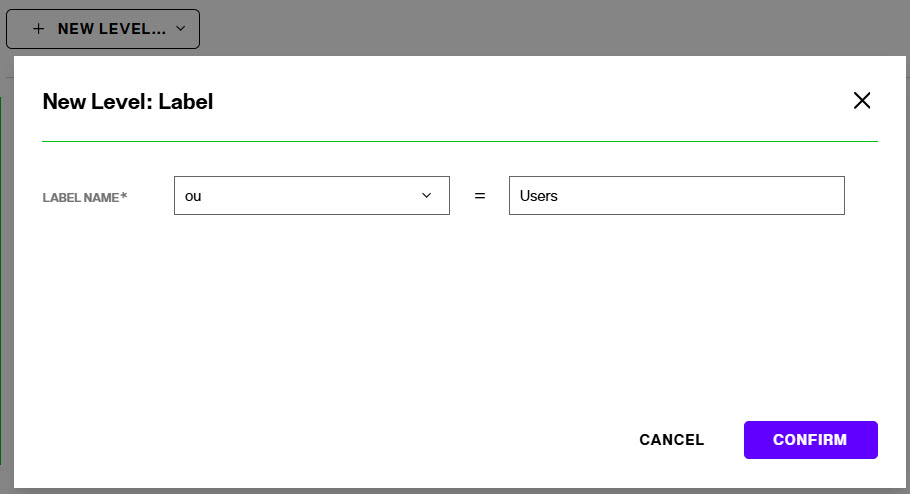 
 
6. Select the ou=Users label level and choose +NEW LEVEL > Content. Select the Okta data source from the drop-down list and the default-okta schema should be populated.

7. Click NEXT.
8. Select the User object from the schema and click **SELECT**. 
9. Repeat steps 4-8 in this section with a label level named `ou=Groups` where a content node based on the group object from the default-okta schema is mounted. The virtual view should look as shown below.

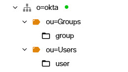 

10. To view the runtime virtual identity view to ensure identity data is returned from Okta, in Control Panel go to Manage > Directory Browser and expand the `o=okta` root naming context. Expand below ou=Users and user entries from Okta should be returned. Expand below ou=Groups and group entries from Okta should be returned.

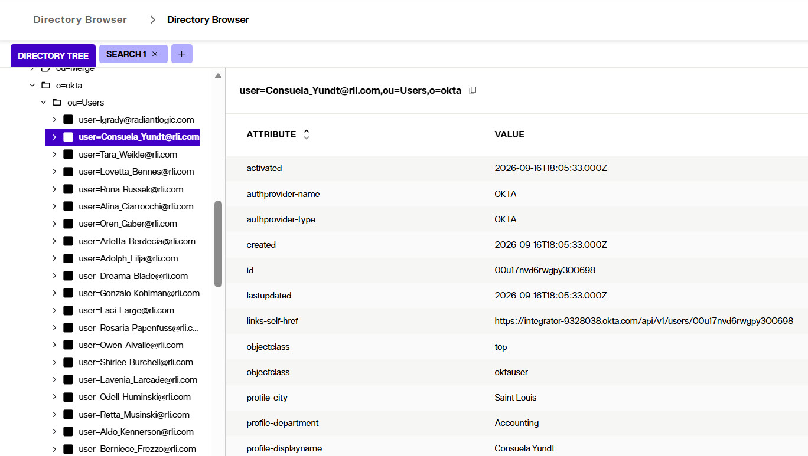 

### (Optional) Extend Virtual View with Custom Okta Attributes 

Virtual views are based on a metadata configuration file containing default attributes describing users, groups and applications in the Okta Universal Directory. If you have custom attributes in Okta they will automatically be returned in your virtual view. However, if you would like to use those source attributes in synchronization pipeline mappings follow the steps in this section to add them to the RadiantOne schema. 

The following steps assume an attribute named MyCustomAttribute has been implemented in Okta.

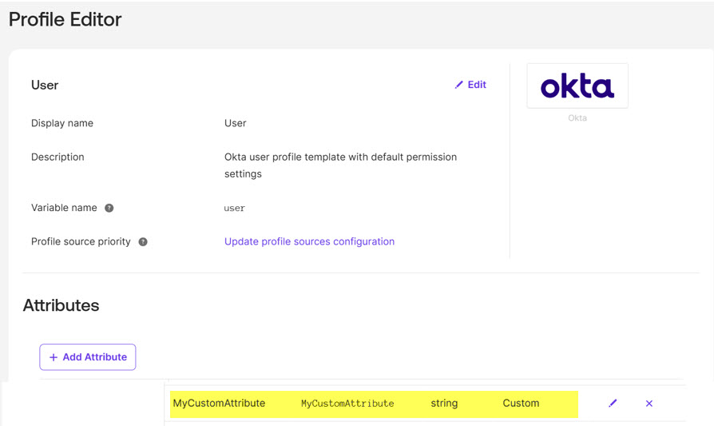 

1. From the Control Panel > Setup > Data Catalog > Data Sources > Data Source page, click on the Okta Data Source.
2. Click on the ’SCHEMA’ tab at the top of the Data Source page. 
3. Expand the Tables section to view the objects and each object can be expanded to view the attributes. For the object where you want to add additional attributes, right-click on the Attributes level and choose *Add New Attribute*.
4. A new attribute line is added to the table on the right. The Name of the attribute needs to be prefixed by ‘profile-’. For example, a custom attribute ‘MyCustomAttribute’ in okta, should be entered as: profile-mycustomattribute

    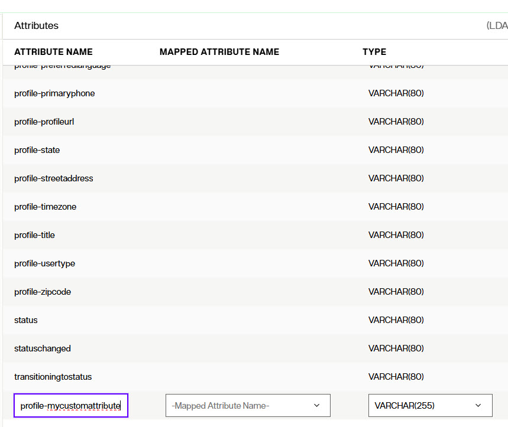

5. Click the checkmark button to the far right inline with the new attribute row to save. Repeat this process to add all the required custom attributes.
6. To extend the [RadiantOne Schema](../configuration/directory-stores/managing-directory-schema) with the Okta objects, toggle the option in the upper right on: **INCLUDE IN SERVER SCHEMA**. This ensures that if you want to use your Okta view as a source for synchronization pipelines that your custom attributes are available for mappings.

    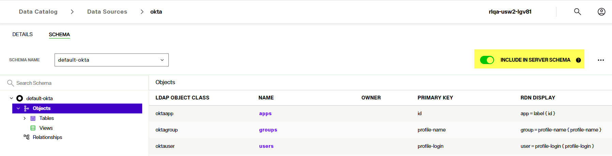

7. To test that the custom attribue is returned in the virtual identity view, in Control Panel, go to Manage > Directory Browser and expand the `o=okta` root naming context. 
8. Expand ou=users and select a user that has the custom attribute populated. The value from Okta should be returned. An example is shown below.

    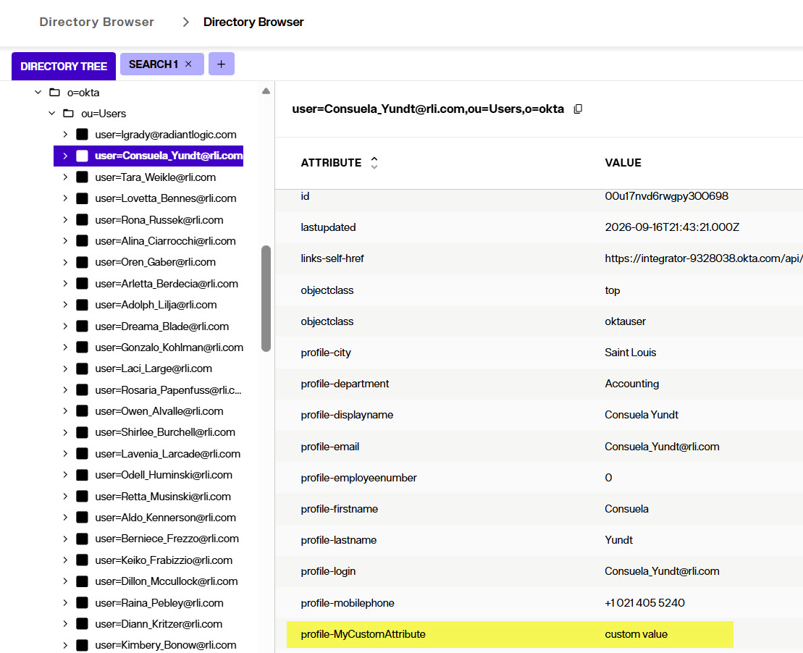

  

 

