## Overview

Password synchronization across multiple systems is challenging because different data sources encrypt and store passwords in different ways. To simplify this, RadiantOne provides a Password Filter that captures password changes on your on-premises Active Directory (AD) domain controllers the moment they occur and securely forwards them to RadiantOne Identity Data Management.

Identity Data Management then propagates the updated password to other connected directories, keeping credentials consistent and secure across your integrated environment.

This guide covers configuring the synchronization pipeline (including LDAP proxies, data sources, and rule-based transformations), installing and registering the Password Filter service on an Active Directory domain controller, and validating end-to-end password synchronization.

> [!note] The Password Filter captures a password only when it is first set or reset for AD users. Existing passwords that have not been changed since the filter was installed are not captured until the next time they are set or reset.

In the scenario covered in this document:

- A password gets set or reset in the source **Active Directory** (AD 1).
- The RadiantOne Password Filter captures the password change detail in **RadiantOne Identity Data Management.**
- RadiantOne updates the user's password in the destination **Active Directory** (AD 2).
- After successful synchronization, the user can log in to both Active Directory environments using the same new password.

> [!note] While this document focuses on syncing passwords between two Active Directories, you can also use this filter to sync passwords between AD and any other LDAP directory target.

## Deployment Architecture

The Password Filter deployment consists of **two runtime components** installation:

**1. Domain Controller (DC) relay component** installed on each source AD domain controller. This component includes the following services:

- `ChangePasswordFilter_x64.dll` is loaded by LSASS. This intercepts password changes and writes them to a local queue under `%SystemRoot%\System32\RadiantOne_PWDCHANGES`.
- `RadiantOnePasswordFilterDcRelay` Windows service reads queued password-change files and forwards them over HTTPS to the Identity Data Management forwarder.

**2. Identity Data Management (IDDM) forwarder component** installed on a separate host reachable from all DC relays:

- `RadiantOnePasswordFilterIddmForwarder` Windows service (or Linux package) receives relay requests, validates inbound API headers, and forwards the password change to Identity Data Management.

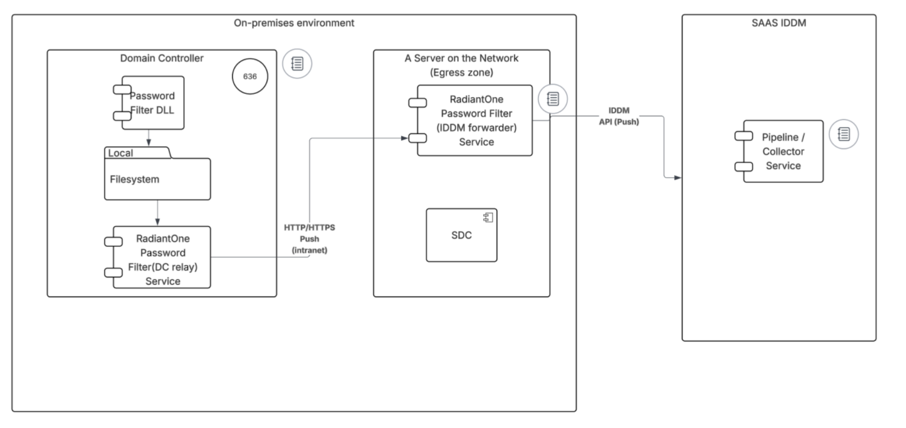

You will need to install the **Identity Data Management forwarder** first on its host, then install the **DC relay** on each source domain controller. The DC relay installer requires the forwarder's URL, so the forwarder must be running and reachable before the relay is configured. Details about installation are covered in a later section in this document.

## Prerequisites

Before configuring the Password Filter, an administrator should have the following data sources already in place in RadiantOne:

### Environment requirements

1. [SDC Client](../../eoc/latest/secure-data-connector/configure-sdc-service/) v1.2.2 or higher.
2. Windows x64 (for each AD domain controller running the DC relay)
3. .NET Framework 4.7.2 or higher (on the domain controller and forwarder host)
4. Two downloadable MSI packages from RadiantOne: 
   - `RadiantOnePasswordFilterIddmForwarder-<version>.msi` — for the forwarder host
   - `RadiantOnePasswordFilterDcRelay-<version>.msi` — for each source domain controller
   You can download these packages from [here](https://files.radiantlogic.com/receive/?packageCode=IX0qTSRyilShjhpxusLWpUDzzb4rduq2tO9F81NhEt4#keycode=Niad1bODfyRmdW8PlGO-5In0mdRKsa0u6551qXXI1rA). 
   Login using the email address associated with your Radiant Logic Support Portal account and navigate to Tools > AD_PWD_FILTER > RadiantOne Identity Data Management v8.1+ folder to locate these packages. If you do not yet have access, email support@radiantlogic.com.
5. A dedicated host (Windows or Linux) reachable from all source domain controllers over HTTPS, for the Identity Data Management forwarder
6. A TLS server certificate (PFX) for the Identity Data Management forwarder's HTTPS listener
7. (Optional) Add or modify proxy settings if your environment requires a proxy. Proxy settings apply to the Identity Data Management forwarder host. Edit `appsettings.json` on the forwarder host after installation and add or modify the `Iddm:Proxy` section:

```json
{
  "Iddm": {
    "Proxy": {
      "Url": "http://proxy.example.com:8080",
      "UserName": "...",
      "Password": "...",
      "UseDefaultCredentials": false,
      "BypassOnLocal": false
    }
  }
}
```

If `Url` is empty or omitted, no explicit proxy is configured.

### Network and permission requirements

Each component has distinct network and file system requirements. The table below summarizes what needs to be in place on each host for the Password Filter to work.

| Component | Network | File System |
|-----------|---------|-------------|
| **DC relay** *(runs on each source domain controller)* | Outbound HTTPS to the IDDM forwarder base URL on the port configured in `Inbound:Https:Url` (e.g. 8443). No inbound connections required. Domain controllers do **not** need direct access to RadiantOne IDDM — the forwarder handles that leg. | **Read/Write/Delete** access on "%SystemRoot%\System32\RadiantOne_PWDCHANGES". This is the queue folder where `ChangePasswordFilter_x64.dll` writes password-change files and the relay service reads and removes them after a successful forward. **Read** access on `<install folder>\appsettings.json` (the relay's runtime configuration including forwarder URL, API key, ID, log settings). **Write** access on the log file (default: `C:\Program Files\Radiant Logic\RadiantOne Password Filter\RLI_passwordfilter_service.log`). |
| **Identity Data Management forwarder** *(runs on a separate host reachable from all DCs)* | Inbound HTTPS from DC relays on the configured listen port (e.g. 8443) — ensure firewall rules allow each domain controller to reach this host on that port. Outbound HTTPS to RadiantOne IDDM on port 443. | **Read** on `<install folder>\appsettings.json` — the forwarder's runtime configuration (IDDM endpoint, JWT token, inbound API key, TLS settings). **Read** access on the TLS server certificate PFX presented to DC relays on every inbound connection. **Read** on the JWT token file and client CA PEM file, if you store the token as a file (`Iddm:TokenPath`) or enable mTLS (`Inbound:ClientCertificateTrustPemPath`). **Write** on the log file (default: `C:\Program Files\Radiant Logic\RadiantOne Password Filter Iddm Forwarder\RLI_passwordfilter_service.log`). |

Allow outbound HTTPS from each domain controller to the IDDM forwarder host through firewalls and load balancers.

The default service account for both Windows MSIs is Local System. If using a dedicated service account, grant **Log on as a service** and NTFS rights on the paths listed above.

### SSL Certificate requirements

1. **Add your server's SSL certificate** to the Identity Data Management Certificate Truststore. This allows RadiantOne Identity Data Management to establish a trusted LDAPS connection to your AD.

> [!note] If your AD server's SSL certificate is issued by a well-known public Certificate Authority (CA) that is already included in IDDM's default truststore, you can skip this step as the certificate will be trusted automatically. Import is only required for self-signed certificates or certificates issued by a private/internal CA.

### Data Source requirements

1. Create a [data source](https://docs.radiantlogic.com) that points to your source Active Directory in RadiantOne using SSL.

   **Example:**

   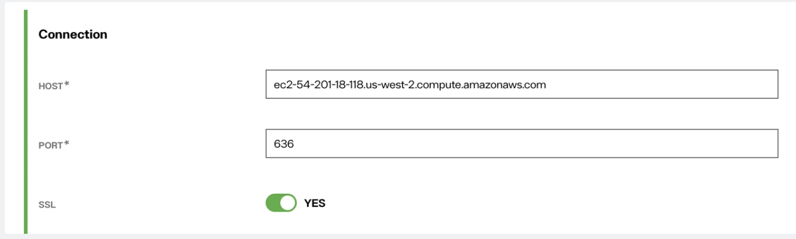

2. Create an LDAP proxy to connect to your source Active Directory (for example, `o=src`).

   **General Settings Example:**

   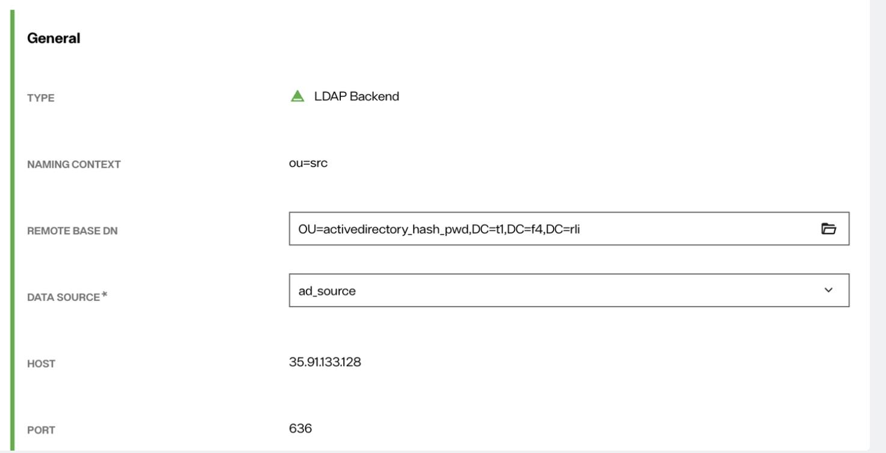

   | Field | Value |
   |-------|-------|
   | TYPE | LDAP Backend |
   | NAMING CONTEXT | ou=src |
   | REMOTE BASE DN | OU=activedirectory_hash_pwd,DC=t1,DC=f4,DC=rli |
   | DATA SOURCE | ad_source |
   | HOST | 35.91.133.128 |
   | PORT | 636 |

3. Repeat steps 1 and 2 for the destination source. Create a data source that connects to your destination Active Directory Server using an SSL connection. Then, create an LDAP proxy pointing to Active Directory Server 2 (for example, **o=dst**).

## Initial Sync Pipeline Configuration

1. Create a [synchronization pipeline](https://docs.radiantlogic.com) that syncs the two data sources in RadiantOne classic control panel from `o=src` to `o=dst` using **Rule-Based** mode.

   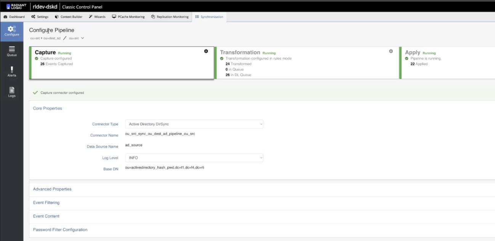

2. In the Capture Configuration page, click on the Password Filter Configuration feature and select the **Enable Password Filter** option.

   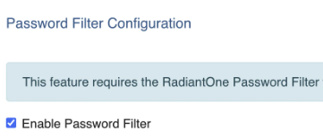

3. Click on the **Manage Password Filters** setting and click the **Register New Password Filter** option.

4. Enter a name for the filter and click **Register**. A window with additional details about the filter will appear. Copy the values of **ID**, **Token**, and **Target Endpoint** shown in this window as you will need the information for a later step.

   > [!note] The token is only visible now and will not be accessible once you close this dialog. Please copy and store it securely.

   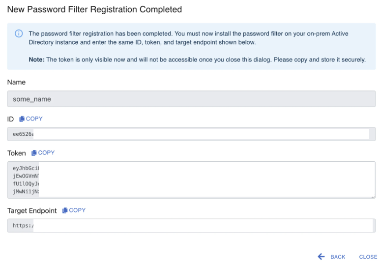

   The registration window contains the following fields:

   - **Name** (e.g., `some_name`)
   - **ID** (with COPY button)
   - **Token** (with COPY button)
   - **Target Endpoint** (with COPY button)

5. Close the tab. Under **Password Filter Configuration > Name**, select the password filter that you just created and click **Save**.

   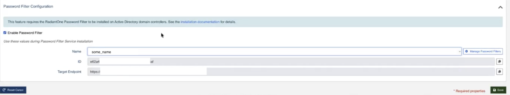

## Install the Password Filter Components

### Install the Identity Data Management Forwarder

Install the forwarder **first**, before installing the DC relay on domain controllers. To start the installation, run `RadiantOnePasswordFilterIddmForwarder-<version>.msi` on the forwarder host and proceed through the installer:

1. On the Welcome screen, click **Next**.
2. Choose or confirm the install directory, then click **Next**.
3. On the **Identity Data Management forwarder configuration** screen, fill in the following fields:

   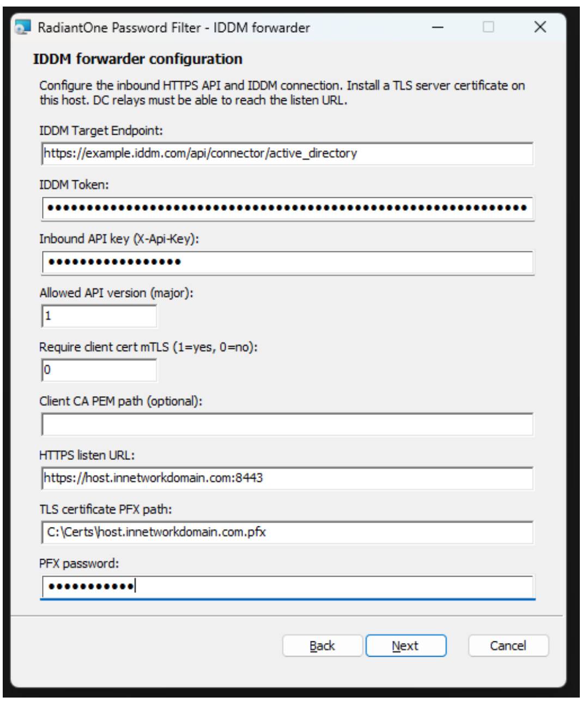

   | Field | Value |
   |-------|-------|
   | Identity Data Management Target Endpoint | The Target Endpoint that you previously copied from RadiantOne registration. |
   | Identity Data Management Token | JWT Token that you previously copied from RadiantOne registration. |
   | Inbound API key (X-Api-Key) | Inbound API key defined by you or your admin. This must match every DC relay. |
   | Allowed API version (major) | Major API version relays send (default: 1). |
   | Require client cert mTLS (1=yes, 0=no) | Enter 1 to enable mTLS for DC relay clients (optional). |
   | Client CA PEM path (optional) | Path to client CA PEM file when mTLS is enabled. |
   | HTTPS listen URL | URL this forwarder listens on (e.g. `https://host.domain.com:8443`). |
   | TLS certificate PFX path | Path to the TLS server certificate PFX file. |
   | PFX password | Password for the PFX file. |

4. Click **Next**. On the **Logging** screen, set the following values:

   | Field | Value |
   |-------|-------|
   | Log Level | Information for normal use; Debug for troubleshooting |
   | Log file path | Default: `C:\Program Files\Radiant Logic\RadiantOne Password Filter Iddm Forwarder\RLI_passwordfilter_service.log` |

5. Click **Next**, then **Install**, then **Finish**.

   **Verify that you see the following:**
   - Under Windows service: `RadiantOne Password Filter (Iddm forwarder)`
   - Under Program or Apps & Features: `RadiantOne Password Filter (IDDM forwarder)`

### Install the DC Relay on Each Domain Controller

After the Identity Data Management forwarder is running and reachable, install `RadiantOnePasswordFilterDcRelay-<version>.msi` on each source AD domain controller:

1. On the Welcome screen, click **Next**.
2. Choose or confirm the install directory, then click **Next**.
3. On the **Relay and Logging Configuration** screen, fill in the following fields:

   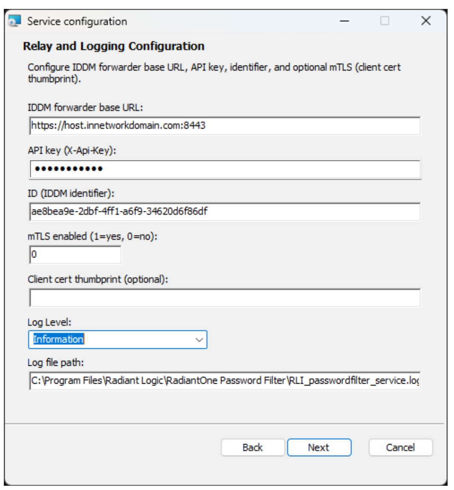

   | Field | Value |
   |-------|-------|
   | Identity Data Management forwarder base URL | The forwarder's HTTPS listen URL (e.g. `https://host.domain.com:8443`) |
   | API key (X-Api-Key) | Same shared secret set as Inbound API key on the Identity Data Management forwarder |
   | ID | ID copied previously from RadiantOne registration. |
   | mTLS enabled (1=yes, 0=no) | Enter 1 to use a client certificate for mutual TLS to the forwarder (optional) |
   | Client cert thumbprint (optional) | Windows certificate store thumbprint of the client certificate when mTLS is enabled |
   | Log Level | Set "Information" for normal use or "Debug" for troubleshooting. |
   | Log file path | Default: `C:\Program Files\Radiant Logic\RadiantOne Password Filter\RLI_passwordfilter_service.log` |

4. Click **Next**, then **Install**, then **Finish**.
5. **Restart the domain controller** if prompted so that LSASS can load `ChangePasswordFilter_x64.dll`.

   **Verify that you see the following:**
   - Under Windows service: `RadiantOne Password Filter (Dc relay)`
   - Under Program or Apps & Features: `RadiantOne Password Filter (DC relay)`

## Pipeline Transformation Configuration

1. Click on the **Transformation** section of the synchronization pipeline. In the Transformation tab, create a rule set with rules for both **Insert** and **Password Update**. Start by creating the Insert rule set. This rule ensures that users added to one Active Directory are also created in another Active Directory.

   It defines how user records are synchronized and is optional for password synchronization. The Password Update rule set, however, is required to ensure password changes are properly synchronized. This is covered in step 4.

   **Rule Set Basic Information:**

   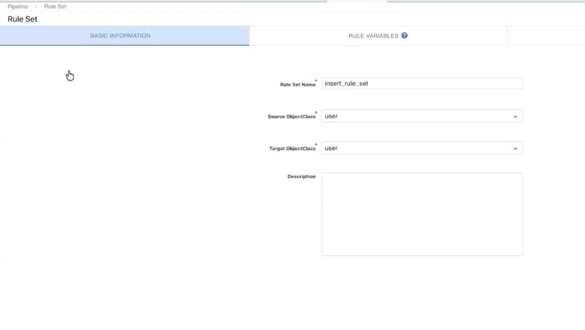

   | Field | Value |
   |-------|-------|
   | Rule Set Name | insert_rule_set |
   | Source ObjectClass | user |
   | Target ObjectClass | user |
   | Description | (optional) |

2. Complete all initial details for the insert rule such as the rule name, description and identity linkage.

   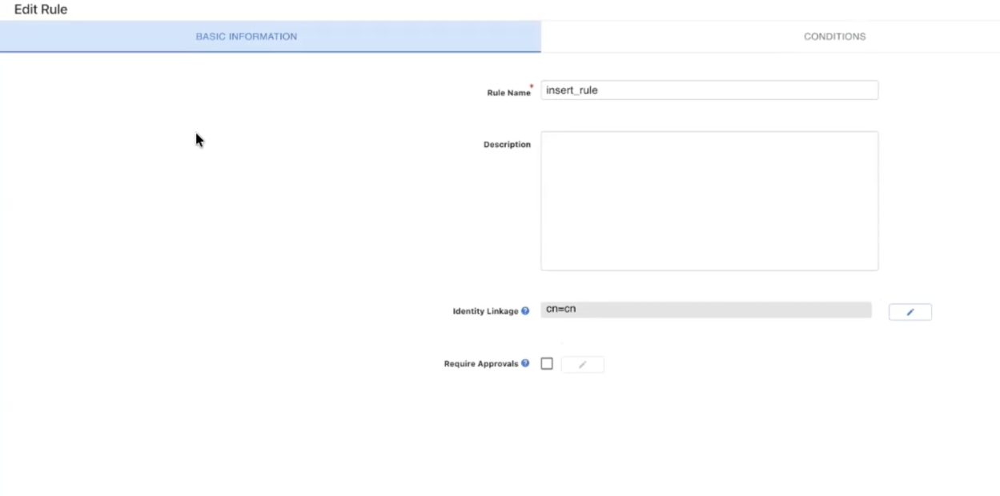

   | Field | Value |
   |-------|-------|
   | Rule Name | insert_rule |
   | Description | (optional) |
   | Identity Linkage | cn=cn |
   | Require Approvals | (optional) |

   Specify a condition for the insert rule. For example, *"If source event equals inserted entry."*

   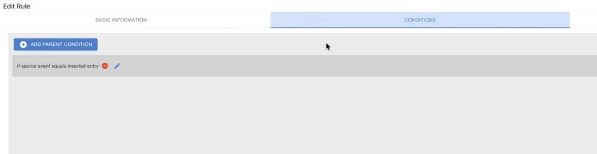

   Define the target attribute mappings and any attributes that need to be linked.

   **Example — Target Attribute Mappings (`user_insert_mapping`):**

   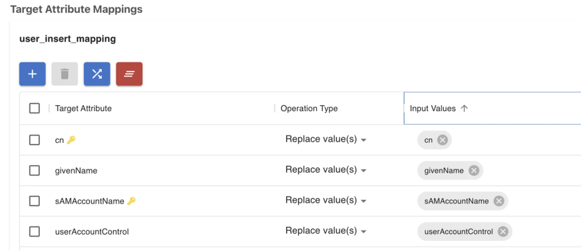

   | Target Attribute | Operation Type | Input Values |
   |------------------|----------------|--------------|
   | cn | Replace value(s) | cn |
   | givenName | Replace value(s) | givenName |
   | sAMAccountName | Replace value(s) | sAMAccountName |
   | userAccountControl | Replace value(s) | userAccountControl |

   > [!warning]
   > Do not enable Adaptive mode. Leave adaptive mode disabled.

3. Save the configured insert rule.

4. Next, create an update rule to synchronize password changes. This step is important as it is the rule that enables password synchronization.

   Provide basic details such as the rule name and description, then set "user" as the value for both `sourceobjectclass` and `targetobjectclass`.

   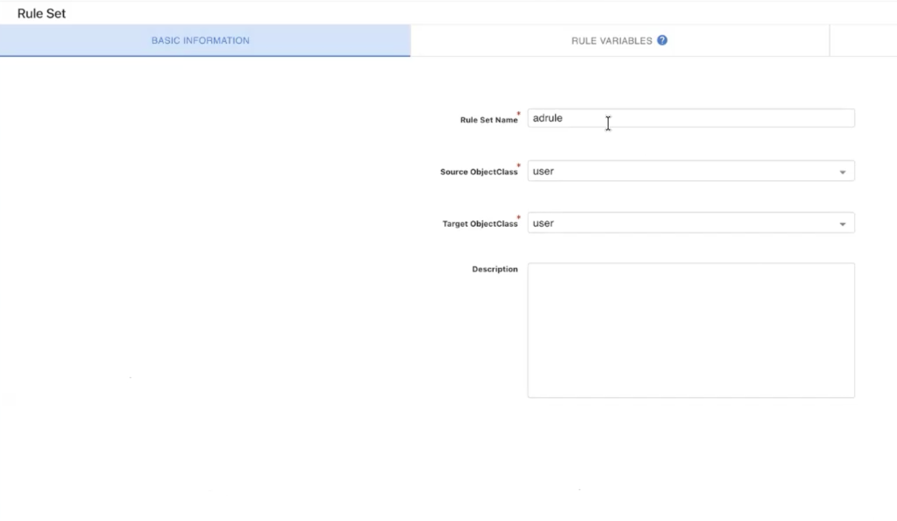

   | Field | Value |
   |-------|-------|
   | Rule Set Name | adrule |
   | Source ObjectClass | user |
   | Target ObjectClass | user |
   | Description | (optional) |

5. Click on the **Rules** tab and add a new rule (for example: `update_rule`). In the identity linkage field, enter `cn=cn`.

6. Click on the **Conditions** tab and add *"if source event equals updated entry"* condition.

   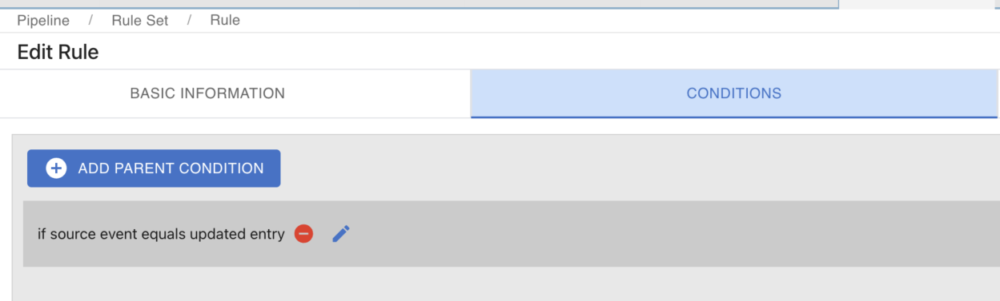

7. Navigate to the **Actions** tab and configure the attributes to be synchronized during update operations.

8. Add the `unicodePwd` field to the mappings and, under replace values, select `unicodePwd`. This field is necessary for syncing password updates.

   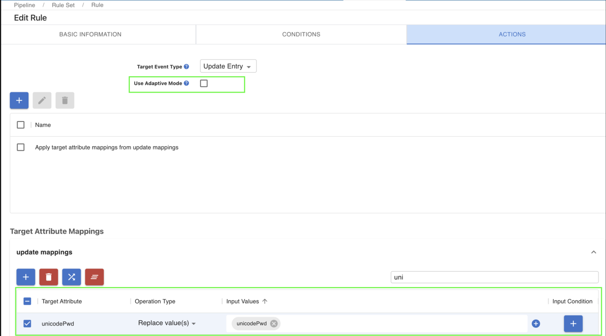

   **Actions Settings:**

   | Field | Value |
   |-------|-------|
   | Target Event Type | Update Entry |
   | Use Adaptive Mode | (unchecked) |

   **Target Attribute Mappings (`update mappings`):**

   | Target Attribute | Operation Type | Input Values |
   |------------------|----------------|--------------|
   | unicodePwd | Replace value(s) | unicodePwd |

   > [!warning]
   > Do not enable Adaptive mode. Keep it disabled.

9. Save the configured update rule.

## How the Password Filter Works During Password Changes

### End-to-End Flow

Once installed and configured:

1. A user on the source Active Directory changes their password.
2. `ChangePasswordFilter_x64.dll` (loaded by LSASS on the domain controller) writes a password-change entry to a queue file under `%SystemRoot%\System32\RadiantOne_PWDCHANGES`.
3. `RadiantOnePasswordFilterDcRelay` reads the queue file and sends an HTTPS `POST /api/password-changes` request to the Identity Data Management forwarder, including the `X-Api-Key` header, `X-RadiantOne-Api-Version`, and the registration identifier (ID) in the request body.
4. `RadiantOnePasswordFilterIddmForwarder` validates the `X-Api-Key` and forwards the password change to RadiantOne Identity Data Management using the JWT Token and Target Endpoint.
5. RadiantOne processes the password update through the sync pipeline using the `password_update_rule` rule set.
6. The pipeline writes the new password to the destination directory (AD 2).
7. The user can authenticate with the new password against both the source context (`o=src`) and the destination context (`o=dst`).

### Retry and error behavior

- Queue files are deleted from the DC **only after** the Identity Data Management forwarder returns a 2xx response.
- The forwarder returns 2xx only when Identity Data Management returns 2xx.
- If the forwarder returns non-2xx, the DC relay **keeps** the queue file and retries on the next cycle.
- `401` — missing or invalid `X-Api-Key`; verify that the API key on the DC relay and the Inbound API key on the forwarder match.
- `502` — Identity Data Management or upstream failure; check forwarder logs and verify the Token, Target Endpoint, and identifier (ID) values.

## Validating That Password Sync Works

Use the following steps to confirm end-to-end behavior after setup is complete.

1. On AD Server 1, choose a test user. Ensure that the user account is activated.

2. Change the test user's password to a new password in Active Directory 1 (right-click the user → **Reset Password**).

   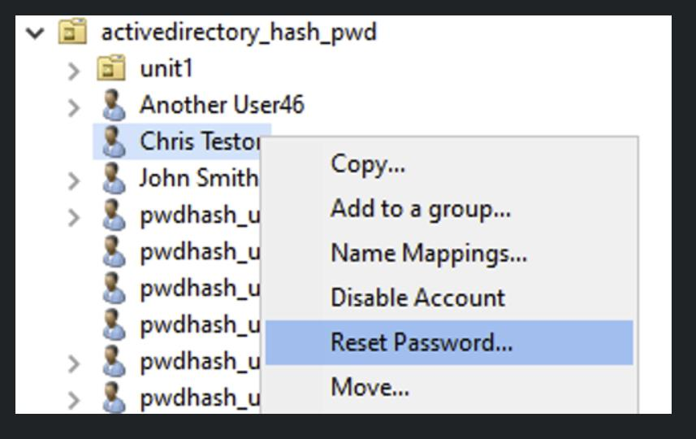

3. In RadiantOne, use the **Test Authentication** option to authenticate against the **source context** (`o=src`) using the test user's DN and the new password.

   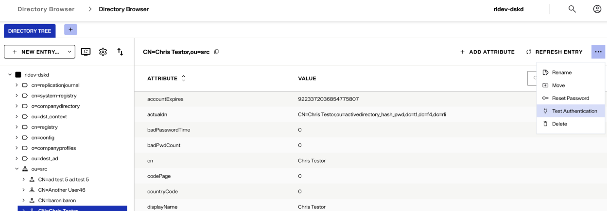

   You should see a message that indicates that the **authentication was successful**.

4. Authenticate the same user in the **destination context** (`o=dst`) using the **same new password**. You should again see **authentication success**. This confirms that the password was synchronized to AD 2.
