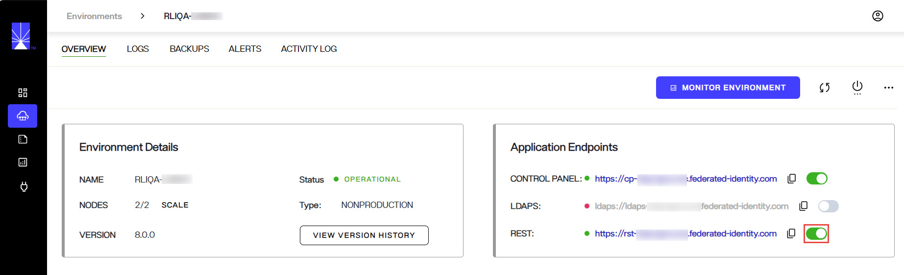

# Overview

In addition to handling LDAP requests for data stored in RadiantOne Directory stores or Persistent Cache, the service can also respond to SCIMv2 (System for Cross-domain Identity Management), and REST (ADAP) requests.

Since RadiantOne supports the standard LDAP v3 protocol and operations, and this API is well documented by the industry, this material focuses solely on the Web Services APIs available.

The HTTPS web services endpoint is disabled by default. Enable the endpoint from Environment Operations Center > Environments > Selected Environment > Application Endpoints > REST. This is the endpoint for both SCIMv2 and REST (ADAP) queries.

## Expert Mode

Some settings in the Classic Control Panel are accessible only in Expert Mode. To switch to Expert Mode, click the Logged in as, (username) drop-down menu and select Expert Mode. 

 
>[!note] The Classic Control Panel saves the last mode (Expert or Standard) it was in when you log out and returns to this mode automatically when you log back in. The mode is saved on a per-role basis.

## Accessing the Web Services Welcome Page

You can access the welcome page by opening a browser and typing the following URL. 

`http[s]://endpoint`

i.e. https://cp-rliqa.dc.federated-identity.com/main/app/settings/web_services

This displays the welcome screen and shows the supported services.

>[!note] In order for the SCIM examples shown below to work properly, SCIM resource types must be created in RadiantOne. Go to the Classic Control Panel > Settings Tab > Server Front End section > SCIM sub-section. On the Resource Types tab, create a new resource type named Users and another named Groups. Save the configuration. See [SCIM](scim.md) for more information on configuring SCIM resource types. 

 UPDATE THIS SCREENSHOT!!!!!!
 
