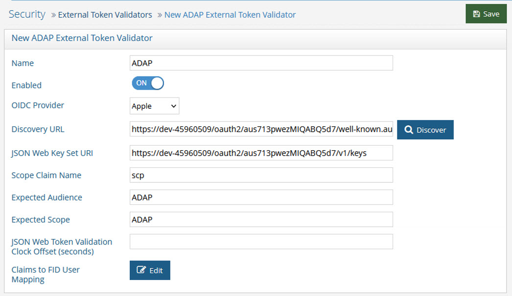
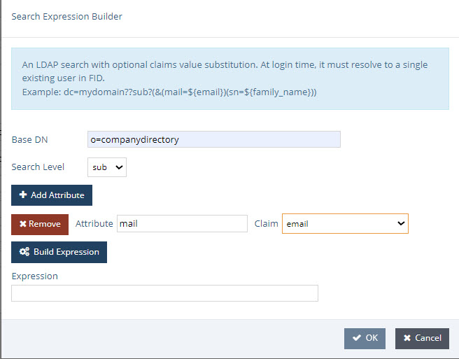
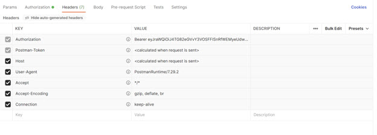

## REST (ADAP) Overview

The REST interface supports all LDAP operations and the ability to navigate the directory tree. Wrapping these operations and the progressive disclosure capabilities that exist in LDAP directories into a REST interface opens it up to the web. The REST API in RadiantOne is referred to as ADAP (Adaptive Directory Access Protocol).

This section describes how to perform the following functions:

-	Authenticate

-	Search

-	Display an LDAP server’s root naming contexts

-	Add 

-	Replace

-	Modify

-	Modify RDN

-	Move

-	Delete

-	Perform Bulk Operations

-	Working with Complex Attributes

>[!note] The examples shown in this section use the Advanced Rest Client Google Chrome app.

## Accessing the RadiantOne RESTFul Web Service

You can access the RadiantOne RESTFul Web Service using the REST endpoint displayed in: Environment Operations Center > Environments > `<Environment Name>` > Identity Data Management application > Application Endpoints 

`https://rlqa-usw2-testn.dev01.radiantlogic.io/adap/<baseDN>`

See [API Specs](/../../../adap/) for complete details.

## REST Response Status Codes

When a REST client performs an operation, it displays one or more codes in its Response section. One of these codes is an HTTP status. (In the Response section of the REST client, look for the numeric value that follows ). The following table describes these HTTP status codes.

HTTP Status #	| Description	| Next Step
-|-|-
200	| Operation successful.	| For searches, no action necessary. For other operations, refresh the RadiantOne namespace to view the modification.   Note - For bind requests where the user’s password is near expiration, the response includes the time (in seconds) until the password expires (secUntilPwdExp value). This is only relevant if the RadiantOne password policy applicable for the user has been configured to support password expiration.
302	| Found Request Headers	| This code is issued on a node that receives a paging request but did not generate the cookie related to paged results. This node redirects the request to the node that generated the cookie. No action is required. (Applicable to multi-node clusters only.)
400	| Bad Request (operation unsuccessful). | ADAP validates parameter syntax in the URL (including case sensitivity) and returns this code when invalid syntax is detected (review entire Response section for more information).
500	| Server error. | Send the exception message along with the <RLI_HOME>/vds_server/logs/vds_server.log to Radiant Logic customer support.

## Maximum Requests

This is the number of threads the REST/ADAP interface uses for handling client requests. In other words, this option defines the number of requests REST/ADAP can handle. The default value is 100.

To set the maximum threads value:

1.	From the RadiantOne Main Control Panel, go to the Settings tab > Server Front End section > Other Protocols sub-section. 

2.	On the right side, under the REST/ADAP header, enter a value in the Max Thread field. 

  

3.	Click the Save button in the upper right corner. 

4.	Restart the RadiantOne service. If deployed in a cluster, restart it on all nodes.

## Proxy Authorization

Authorization is enforced by the RadiantOne service based on the user who authenticated. The authorization ID (DN) is linked to the authenticated ID (DN) for the same connection. If the Proxy Authorization Control is enabled, the client can switch the user ID for authorization purposes, without having to re-authenticate with a new connection. To use proxy authorization in the REST/ADAP request, define a header named Proxy which contains the value of the user ID (DN) for which authorization should be enforced. An example is shown below where requests are performed on behalf of the user identified by: uid=Adalberto_Flecha,ou=Accounting,o=companydirectory

Ensure the proxy authorization control is enabled for the RadantOne service and access controls have been defined to indicate who is allowed to impersonate who. For more information on enabling the proxy authorization control and defining access controls, please see the RadiantOne **System** Administration Guide.

>[!warning] 
>To allow the super user (e.g. cn=directory manager) to impersonate other users, you must enable the “Allow Directory Manager to Impersonate Other Users” option. For more information on this setting, please see the RadiantOne System Administration Guide.

## Basic Password Authentication

All REST operations require a header which is used to bind to the LDAP server. If this header is not populated, it uses anonymous access. 

The header must be named “authorization” and the header value is derived by concatenating: Basic base64(dn:password). Use a `<space>` between Basic and the encoded value. 

You can use any base64 encoder to get this value. For example, the base64 encoded value for cn=directory manager and password of secretsecret would be the following. 

Y249ZGlyZWN0b3J5IG1hbmFnZXI6c2VjcmV0c2VjcmV0

>[!note] The encoded header value does not contain “:”.

Resulting in a header of: 
  `<header key="authorization" value="Basic Y249ZGlyZWN0b3J5IG1hbmFnZXI6c2VjcmV0c2VjcmV0"/>`

In this section, a simple bind to the RadiantOne REST service is shown in the table below. 

Field	| Value
-|-
URL Syntax	| `http://<RadiantOneServer>:8089/adap?bind=simpleBind`
Method	| Get
Header Name	| Authorization
Header Value	| Basic `<base64 value (dn:password)>`
Example Header Value	| Basic Y249ZGlyZWN0b3J5IG1hbmFnZXI6c2VjcmV0c2VjcmV0

An authentication attempt with the above parameters results in the message {“httpStatus”:200}.  This means the credentials check was successful.

 
An unsuccessful authentication attempt may result in the status ”401: Unauthorized”.

Unless otherwise stated, this document assumes the use of password authentication. 

## Always Authenticate - Avoid Connection Pooling

By default, the REST/ADAP service leverages connection pooling when connecting to the RadiantOne service. To require a new authentication (bind) for every connection to RadiantOne, and not use connection pooling, the Always Authenticate option must be enabled in the REST/ADAP configuration. If Always Authenticate is enabled, there is a single bind to the RadiantOne service for every bind to ADAP and a single bind to with every search to ADAP. 

When Always Authenticate is not enabled (which is the default), connection pooling is used. There is a single bind to RadiantOne for every search if the connection is not in the pool, and no bind if the connection is in the pool. 

To enable the Always Authenticate option:

1.	Go to the Main Control Panel > Settings tab > Server Front End > Other Protocols section. 

2.	In the REST/ADAP section (requires [Expert Mode](01-overview#expert-mode)), check the ‘Always Authenticate’ checkbox.

  

3.	Click Save. 

4.	Restart the RadiantOne service. If deployed in a cluster, restart the service on all nodes.

## OpenID Connect Token Authentication

The RadiantOne REST (ADAP) interface supports OpenID Connect token-based authentication. This option provides the security of sending user login credentials to the authentication server, not the application (ADAP). OpenID Connect token authentication allows you to send your username and password just once and then pass the token in the request to ADAP. However, the user cannot use the token authentication to request a new token. Multiple requests can be performed during a token’s lifetime.
 
A high-level diagram of the different components is shown below. Postman is used as a simple client to illustrate the flow.

External token validators allow applications to use an access token to call an API on behalf of itself. The API then responds with the requested data. This section assumes that your OIDC provider is already set up and that you know your client ID and secret to test getting a token.

### Getting an Access Token

This section describes using the Postman REST client to obtain an access token. 

1. Start a new request. 

1. Click the Auth tab.

1. From the Type drop down menu, select OAuth 2.0. The Current Token section displays. 

2. In the Configure New Token section, enter the Client ID and client secret.

    >[!note] These values were created during the OIDC provider configuration process. 

3. Provide the access token URL. 

    >[!note] This value can be found using the using the metadata URL from the Authorization Server. 

4. Click Get New Access Token. The new access token's details are displayed. 

5. Copy this token and decode it for the values needed for configuring a mapping between the token contents and a unique identity in the RadiantOne namespace. You can do this at https://jwt.io/. 

### RadiantOne Configuration
This section describes configuring proxy authorization, configuring an ADAP external token validator, and Claims to FID User Mapping.

**Configuring Proxy Authorization**

The RadiantOne ADAP service queries the RadiantOne LDAP service using proxy authorization.

To configure proxy authorization: 

1. In the Main Control Panel, navigate to Settings > Server Front End > Supported Controls.

1. Enable Proxy Authorization and click Save.

1. Navigate to Settings > Security > Access Control.

1. Enable the “Allow Directory Manager to impersonate other users” option and click Save.

**Configuring External Token Validators**

To add an external token validator:

1.  In the Main Control Panel, navigate to Settings > Security > External Token Validators. 
1.  Click **Add**. The New ADAP External Token Validator page displays.

1.  Name the external token validator.
1.  Toggle the Enable switch to On. 
1.  Select an OIDC provider from the drop-down menu (if applicable, to assist with populating the Discovery URL syntax). Otherwise, skip this step and enter your own Discovery URL. 
1.  If the Discovery URL is not loaded automatically, paste the Metadata URI from your OIDC authorization server into the Discovery URL field. 
1.  Click Discover. The JSON Web Key Set URI auto-populates. 
1.  Use the Expected Audience from your OIDC provider configuration to populate the Expected Audience field.
1.  Enter the expected Scope.This property determines what information/claims ("sub" indicates Subject) in the token (based on scopes requested) can be used to identify the relevant account in the RadiantOne namespace for enforcing authorization on subsequent requests for this connection. The value of this attribute is used as input for the *Claims to FID User Mapping* configured later in the steps below. The standard claims associated with the scopes are shown in the table below.

Scope	| Claims
-|-
Email	| email, email_verified
Address	| address
Profile	| name, family_name, given_name, middle_name, nickname, preferred_username, profile, picture, website, gender, birthdate, zoneinfo, locale, updated_at
Phone	| phone_number, phone_number_verified
Openid	| sub, auth_time, acr

1.  Other values can be obtained from the decoded access token. See the [Getting An Access Token](#getting-an-access-token) section for more information.  

1.  Click Edit next to Claims to FID User Mapping. The OIDC to FID User Mappings page displays.
1.  Click Add. Use either a Simple DN Expression or a Search Expression to map a uniquely identifying attribute to a corresponding claim value in the token (refer to the [Getting An Access Token](#getting-an-access-token) section for more information). In the following image, a Search Expression is used to map the attribute **mail** to the claim value **email**.

>[!note] In some cases, creating a new attribute may be required.

1.  Click OK.
1.  Click OK again to close the *OIDC to FID User Mappings* window.
1.  Click Save. 

### Querying RadiantOne REST API (ADAP) with a Token

In this example, Postman is the REST client that will issue calls to ADAP. Obtain an OpenID Connect Token for Postman from your OIDC provider. Use the token value in a header configured in a Postman client as follows.

1. Request a new access token (see [Getting An Access Token](#getting-an-access-token)). 
1. Click *Use Token*. This inserts an Authorization header that inserts your bearer token. 

1. Send the bearer token to the REST (ADAP) endpoint. In this example, a basic search is performed. 

Field	| Value
-|-
URL Syntax	| `https://<REST_ENDPOINT>/adap/<baseDN>`     
Method	| Get
Header Name	| Authorization
Header Value	| Bearer `<token>`
Example URL	| https://rlqa-usw2-testn.dev01.radiantlogic.io/adap/o=companydirectory

If successful, the operation displays results similar to the following. 

 
Figure 13: Successful REST Operation using OpenID Connect Token

## REST Query Examples

The examples below describe how to issue REST queries for search, insert, update, and delete operations.

### Search 

In this section, a search is performed using the REST client parameters and values shown in the table below. 

Field	| Value
-|-
URL Syntax	| `https://<REST_ENDPOINT>/adap/<baseDN>`
Example URL	 | https://rlqa-usw2-testn.dev01.radiantlogic.io/adap/o=companydirectory
Method	| Get
Header Name	| Authorization
Header Value	| Basic `<userDN>:<password>`

>[!note] Depending on the parameters you define for the search, the loading time for your search results may be significantly longer than the loading times of other operations. A search’s initial loading time may be reduced by performing a paged search. See the PageSize section.

>The search example shown in the table above displays a total of 10,011 results returned, as shown below.

 

### Optional Search Parameters

You can use the following search parameters: filter, attributes, scope, startIndex, count, sizelimit, paging, context, context filter, return mode, special character encoding, and derefAliases. The & sign is the parameter delimiter in the URL. These options are described in this section.

>[!note] Special characters that appear in an LDAP filter may have a different usage in a URL syntax. For example, the ‘&’ character is the parameter delimiter in URLs. These special characters should be replaced by their hexadecimal value.  Below, the character ‘&’ is replaced by its hexadecimal equivalent, ‘%26’.
 LDAP Filter	            ->     Corrected URL
 (&(objectclass=*)(cn=a*))  ->  (%26(objectclass=*)(cn=a*))

**Filter** 

The filter option allows you to search for entries with a specific attribute value. The value defined for this option is translated into an LDAP filter when the query is issued to the RadiantOne LDAP service. In the following example, a search is performed for records with the value Manager for the employeeType attribute within o=companydirectory. 

Field	| Value
-|-
URL Syntax	| `https://<REST_ENDPOINT>/adap/<baseDN>?<search param>&<search param>`
Example URL	| https://rlqa-usw2-testn.dev01.radiantlogic.io/adap/o=companydirectory?filter=employeeType=Manager
Method	| Get
Header Name	| Authorization
Header Value	| Basic `<userDN>:<password>`

An example is shown below.

 
By default, all attributes associated with the matching entries are returned. The attributes option allows you to indicate which attributes you want returned in the search result. Separate attribute names with a comma in the URL.  The value defined for this option is translated into requested attributes in the LDAP query issued to the RadiantOne service. The example shown below expects the objectclass and cn attributes returned for each entry.

Field	| Value
-|-
URL Syntax	| `https://<REST_ENDPOINT>/adap/<baseDN>?<search param>&<search param>`
Example URL	| https://rlqa-usw2-testn.dev01.radiantlogic.io/adap/o=companydirectory?attributes=objectclass,cn
Method	| Get
Header Name	| Authorization
Header Value	| Basic `<userDN>:<password>`

**Scope**

This option defines how many levels beneath the base DN to search for entries. The value defined for this option is translated into the scope for the LDAP query issued to the RadiantOne service. The options include the following.

-	Base (the base DN only)

-	One (the level beneath the base DN only)

-	Sub (all levels beneath the base DN)

Field | Value
-|-
URL Syntax	| `https://<REST_ENDPOINT>/adap/<baseDN>?<search param>&<search param>`
Example URL	| https://rlqa-usw2-testn.dev01.radiantlogic.io/adap/o=companydirectory?scope=sub 
Method	| Get
Header Name	| Authorization
Header Value	| Basic `<userDN>:<password>`

**StartIndex (Paging Results)**

This option defines the number used for the paged search, and indicates the first entry to return from all the matched entries. This option should be used in conjunction with the ‘count’ option described in the next section. StartIndex dictates the behavior at the client level and is not passed to the RadiantOne service in the LDAP query.
 

Field	| Value
-|-
URL Syntax	| `https://<REST_ENDPOINT>/adap/<baseDN>?<search param>&<search param>`
Example URL	| https://rlqa-usw2-testn.dev01.radiantlogic.io/adap/o=companydirectory?startIndex=101&count=2
Method	| Get
Header Name	| Authorization
Header Value	| Basic `<userDN>:<password>`

**Count**

This option should be passed with StartIndex (described above) and defines the number of successive entries displayed in a paged search, starting with the one previously defined using the StartIndex search parameter. Count dictates the behavior at the client level and is not passed to the RadiantOne service in the LDAP query.

For example, to return the attribute “cn” for entries number 101 and 102 located under o=companydirectory, the configuration is indicated in the following table. 

Field	| Value
-|-
URL Syntax	| `https://<REST_ENDPOINT>/adap/<baseDN>?<searchparam>&<searchparam>`
Example URL	| https://rlqa-usw2-testn.dev01.radiantlogic.io/adap/o=companydirectory?attributes=cn&startIndex=101&count=2 
Method	| Get
Header Name	| Authorization
Header Value	| Basic `<userDN>:<password>`

An example is shown below. 

 

The ‘totalResults’ field displays one of the following values. The following table explains each of these values.

‘totalResults’ Value	| Description
-|-
-1	| The number of entries returned by the search exceeds the default size limit (1000 entries). 
-2	| A next page of search results is available to be displayed. This value is displayed only when performing a paged search. 
-3	| The last page of search results has been reached.  
Any other value	| The total number of entries that were matched. This value is displayed only if the parameter SizeLimit is set to 0. 

The “count” value represents the number of results actually returned in the response and was set when “count=2” was added to the URL in the example above. Otherwise, the count value would have been equal to the total number of entries returned without the use of paging. 

**SizeLimit**

SizeLimit indicates the maximum number of entries to request from the RadiantOne service. The value defined for this option is translated into the sizelimit property passed in the LDAP query to RadiantOne. The default sizelimit is set at 1000, meaning that only 1000 entries will be returned by the RadiantOne LDAP sevice for a request. If the REST client is expecting all entries, sizelimit should be set to 0.

In the example used for the “count” parameter described previously, the query to return the attribute “cn” for entries number 101 and 102 located under o=companydirectory is: 

`https://rlqa-usw2-testn.dev01.radiantlogic.io/adap/o=companydirectory?attributes=cn&startIndex=101&count=2 `

However, even if the REST interface only returns entries 101 and 102, it requests all entries from the RadiantOne LDAP service. Then, post filtering is performed using the values for the “startIndex” and “count” parameters. 

A more efficient way to get entries 101 and 102 is by using SizeLimit. SizeLimit could be set to the maximum number of entries required in order to retrieve the desired 101 and 102.  This example is shown in the table below.

Field	| Value
-|-
URL Syntax	| `https://<REST_ENDPOINT>/adap/<baseDN>?<searchparam>&<searchparam>`
Example URL	| https://rlqa-usw2-testn.dev01.radiantlogic.io/adap/o=companydirectory?attributes=cn&sizeLimit=102&startIndex=101&count=2
Method	| Get
Header Name	| Authorization
Header Value	| Basic `<userDN>:<password>`

**Paging**

The PageSize option indicates paging via the Paged Results Control should be passed in the query to the RadiantOne LDAP service. The PageSize value entered when passing the initial search defines the number of entries displayed per page. This reduces the initial loading time and memory requirement when performing a search, making this option especially useful when the total search result count is high. 

For REST access, the paging functionality leverages a session cookie which is linked to the original LDAP connection. Since this requires the same connection/session to work properly, paging through the REST interface does not work against a RadiantOne cluster deployment because subsequent requests could be directed to a RadiantOne node that is not associated with the original session cookie. If paging is required for cluster deployments, it is recommended to use source address affinity persistence in your load balancer.

>[!note] To use this option, paged results must be enabled in RadiantOne. To enable paged results, go to the Main Control Panel > Settings tab > Server Front End > Supported Controls. Check the ‘Enable paged results’ checkbox, and click Save. 

 
>[!note] In multi-node clusters, an HTTP Status 302 is issued on a node that receives a paging request but did not generate the cookie related to paged results. This node redirects the request to the node that generated the cookie. No action is required. The cookie timeout can be configured in RadiantOne. To configure this timeout, go to the Main Control Panel > Settings > Server Front End > Other Protocols (requires [Expert Mode](overview#expert-mode)). Expand the REST/ADAP section. Enter a value in the Cookie Timeout field in seconds (the default is 60). Click Save.

 
If you try to use the PageSize option without paging enabled in RadiantOne, the REST interface ignores paging and performs a non-paged search against RadiantOne with SizeLimit equal to the PageSize parameter.

A search displaying, for example, five results per page is started using the parameters shown in the table below. 

Field	| Value
-|-
URL	| `https://<REST_ENDPOINT>/adap/<baseDN>?<searchparam>&<searchparam>`
Method	| Get
Header Name	| Authorization
Header Value	| Basic `<userDN>:<password>`
Example URL	| https://rlqa-usw2-testn.dev01.radiantlogic.io/adap/o=companydirectory?pageSize=5

>[!note] If the PageSize option is used, ‘startIndex’, ‘count’ and ‘sizeLimit’ options will be ignored.

 

>[!note] Record the value in the ‘cookie’ field. This value defines a search parameter that will be used to display the next page of search results. If the value in the ‘cookie’ field is “null”, the last page of search results has been reached; there are no more pages to retrieve. 

The totalResults’ field displays one of three values. The following table explains each of these values.

‘totalResults’ Value	| Value
-|-
-1	| A PageSize search was sent in the REST query, but paging is not enabled in RadiantOne. Therefore, a non-paged search was performed.
-2	| Paged search results were successfully retrieved.
-3	| The search was terminated prior to reaching the end of the search results. This result is displayed only in sessions that use cookies.

The next page of search results is displayed using the parameters shown in the table below. In this example, the value for the second search parameter, cookie, is derived from the value in the cookie field in the search results displayed above.

Field	| Value
-|-
URL	| `https://<REST_ENDPOINT>/adap/<baseDN>?<searchparam>&<searchparam>`
Method	| Get
Header Name	| Authorization
Header Value	| Basic `<userDN>:<password>`
Example URL	| https://rlqa-usw2-testn.dev01.radiantlogic.io/adap/o=companydirectory?pageSize=5&cookie= localhost=NTEyNDIzODcw

A paged search stops automatically after five minutes of inactivity, or it can be stopped manually using the parameters shown in the table below.

Field	| Value
-|-
URL	| `https://<REST_ENDPOINT>/adap/<baseDN>?<searchparam>&<searchparam>`
Method	| Get
Header Name	| Authorization
Header Value	| Basic `<userDN>:<password>`
Example URL	| https://rlqa-usw2-testn.dev01.radiantlogic.io/adap/o=companydirectory?pageSize=0&cookie= localhost=NTEyNDIzODcw

**Context**

The context option allows you to display a hierarchical view of an entry’s ancestor(s) when performing a search. By adding “context=true” to the URL of a standard REST search operation, you activate this context search option. Optional search parameters that can be used in conjunction with a context search include filter, scope, and sizelimit. 

Field	| Value
-|-
URL Syntax	| `https://<REST_ENDPOINT>/adap/<baseDN>?<search param>?context=true`
Example URL	| https://rlqa-usw2-testn.dev01.radiantlogic.io/adap/uid=Aaron_Medler,ou=Accounting,o=companydirectory?context=true
Method	| Get
Header Name	| Authorization
Header Value	| Basic `<userDN>:<password>`

In the figure above, starting at the bottom, the bottom box contains the uid that matches the search criteria defined in the URL. The next box up contains the parent entry that uid=Aaron Medler belongs to, ou=Accounting. The top box contains the top entry, o=companydirectory. 

**Context Filter**

The context filter option allows you to pass a filtered search to the REST interface, which returns only the entries that match each of the search criteria filters. Wildcards can be used in the filters, as shown in the Example URL field below. The optional search parameters ‘attributes’ and ‘context’ can also be used with this search option. You can define the scope of each context filter search as follows.

/ sets a filter’s scope to one level 

// sets a filter’s scope to the entire subtree

Field	| Value
-|-
URL Syntax	| `https://<REST_ENDPOINT>/adap/<search param>?contextFilter=/` (or) //`<search param>`
Example URL	| https://rlqa-usw2-testn.dev01.radiantlogic.io/adap/o=companydirectory?contextFilter=/ou=A*/uid=Aug*&attributes=objectclass
Method	| Get
Header Name	| Authorization
Header Value	| Basic `<userDN>:<password>`

 
**Return Mode**

This options controls how the JSON response is formatted when ADAP returns a search response. The options include the following. 

  - array (attribute values are arranged in an array, regardless of the quantity of attribute values. Without this option, attribute values are arranged in an array only if there are two or more attribute values.)

  - ldapschema (the RadiantOne server LDAP schema is checked for each attribute. If the attribute schema is single-valued, a JSON String is used. If the attribute schema is multi-valued, a JSON array is used.)

  >[!note] If returnMode is not specified, default formatting is used; if there is a single value for an attribute, a JSON string is used. If there is more than one value for an attribute, a JSON array is used. The RadiantOne server LDAP schema is not used. 

Field	| Value
-|-
URL Syntax	| `https://<REST_ENDPOINT>/adap/<baseDN>?returnMode=array&<searchparam>` 
Example URL	| https://rlqa-usw2-testn.dev01.radiantlogic.io/adap/o=companydirectory?returnMode=array
Method	| Get
Header Name	| Authorization
Header Value	| Basic `<userDN>:<password>`

**Special Character Encoding**

To pass an LDAP filter in the request, or any filter that contains special characters, encode the characters as outlined in the table below.

Character	| From UTF-8
-|-
Space	| %20
&	| %26
!	| %21
|	| %7C
=	| %3D

An example LDAP filter of:
(|(cn=Lisa Grady)(sAMAccountName=Lisa Grady)(uid=Lisa Grady)) 
  Would need converted to:   (%7C(cn%3DLisa%20Grady)(sAMAccountName%3DLisa%20Grady)(uid%3DLisa%20Grady))

**Dereferencing Alias Entries**

RadiantOne Directory stores supports alias entries as defined in RFC 22521. Alias entries point to/reference another entry in the directory. The attribute containing the location of the target entry (DN) is aliasedObjectName and the object class associated with these entries is alias. When a client requests an alias entry, they can indicate if they want the alias dereferenced or not. The indicators are outlined in the table below.

>[!warning] 
>Dereferencing alias entries is only supported on base-level searches. One-level and subtree searches are not supported at this time.

Flag	| RadiantOne Behavior
-|-
derefAliases=0   (equivalent to using -a never in an ldapsearch command)	| Never dereferences aliases.  This is the default behavior.
derefAliases=1   (equivalent to using -a search in an ldapsearch command)	| Dereferences aliases in subordinates of the base object in a search but not in locating the base object of the search.
derefAliases=2	  (equivalent to using -a find in an ldapsearch command)	| Dereferences the base object in a search, but does not dereference alias entries that are under the base.
derefAliases=3   (equivalent to using -a always in an ldapsearch command)	| Dereferences aliases both in searching and in locating the base object of the search.

The default behavior of the REST/ADAP service is to never dereference aliases. If the REST client wants an alias entry dereferenced, they must pass the search parameter derefaliases as described below.

Field	| Value
-|-
URL	| `https://<REST_ENDPOINT>/adap/<baseDN>?<searchparam>&<searchparam>`
Method	| Get
Header Name	| Authorization
Header Value	| Basic `<userDN>:<password>`
Example URL	| https://rlqa-usw2-testn.dev01.radiantlogic.io/adap/ou=Headquarters,o=companydirectory?derefAliases=3

When a client requests derefAliases=3, RadiantOne automatically dereferences the alias entry and returns the entry it points to. In this example, the search dereferences “ou=Headquarters,o=companydirectory”, which is an alias entry, and returns “ou=Information Technology,o=companydirectory” as shown below.

 
**Display LDAP server’s root naming contexts**

To display a list of the LDAP server’s root naming contexts, pass rootdse as part of the URL.

Field	| Value
-|-
URL Syntax	| `http://<REST_ENDPOINT>/adap/rootdse` 
Method	| Get
Header Name	| Authorization
Header Value	| Basic `<userDN>:<password>`

An example of the list displayed by this command is shown below.

 
### Add

In this section, a new entry is added to RadiantOne using the parameters shown in the table below. The value in the Request Body field contains the information for the entry to be added. 

Field	| Value
-|-
URL Syntax | `https://<REST_ENDPOINT>/adap`
Example URL	| https://rlqa-usw2-testn.dev01.radiantlogic.io/adap
Method	| Post
Header Name	| Authorization
Header Value	| Basic `<userDN>:<password>`
Example Request Body	| { "params" : {  "dn" : "uid=alice,cn=config",  "attributes" : { "objectClass" : [ "top",  "person",  "organizationalPerson",  "inetOrgPerson" ],  "cn" : "Alice Wonderland",  "sn" : "Wonderland",  "uid" : "alice" } }  }

  
If successful, the Response section displays the message “{"httpStatus":200}”. 

If unsuccessful, the Response section displays the message “{"httpStatus":400}”, as well as additional information about the request’s failure. 

 
### Replace (PUT)

In this section, an existing entry is replaced using the parameters shown in the table below.

>[!note] “BaseDN” is the DN of the targeted entry.

Field	| Value
-|-
URL Syntax | `https://<REST_ENDPOINT>/adap/<baseDN>`
Example URL	| https://rlqa-usw2-testn.dev01.radiantlogic.io/adap/uid=alice,cn=config
Method	| Put
Header Name	| Authorization
Header Value	| Basic `<userDN>:<password>`
Example Request Body	| { "params" : {  "attributes" : {"objectClass" : [ "top",   "person",  "organizationalPerson",  "inetOrgPerson" ],  "cn" : "Alice Wonderland2",  "sn" : "Wonderland2",  "uid" : "alice" } }  }

If successful, the Response section displays the message “{"httpStatus":200}”. 

### Modify (PATCH) Add and Replace Attributes 

In the first example, an attribute is added to a user entry identified as “uid=alice,cn=config”, and another is replaced using the parameters shown in the table below.

Field	| Value
-|-
URL Syntax	| `https://<REST_ENDPOINT>/adap/<baseDN>`
Example URL	| https://rlqa-usw2-testn.dev01.radiantlogic.io/adap/uid=alice,cn=config
Method	| Patch
Header Name	| Authorization
Header Value	| Basic `<userDN>:<password>`
Example Request Body	| { "params" : {  "mods" : [ { "attribute" : "telephoneNumber",  "type" : "ADD", "values" : [ "+1 354 2344 5433" ] },  { "attribute" : "mobile",  "type" : "REPLACE",  "values" : [ "+1 123 4544 1290" ] } ] }  }

 
If successful, the Response section displays the message “{"httpStatus":200}”. 

### Modify (PATCH) Delete Attribute Value

In this example an attribute (e.g. email) containing a specified value (e.g. alice@radiantlogic.com) is deleted by using the parameters shown in the table below. 

Field	| Value
-|-
URL Syntax	| `https://<REST_ENDPOINT>/adap/<baseDN>`
Example URL	| https://rlqa-usw2-testn.dev01.radiantlogic.io/adap/uid=alice,cn=config
Method	| Patch
Header Name	| Authorization
Header Value	| Basic `<userDN>:<password>`
Example Request Body	| { "params": { "mods": [ { "attribute": "email",  "type": "DELETE",   "values": [alice@radiantlogic.com]} ]  }  }

If successful, the Response section displays the message “{"httpStatus":200}”.

### Modify (PATCH) Delete Attribute

In this example, an attribute is deleted, regardless of its attribute values, using the parameters shown in the table below. This is an example of removing all values for the email attribute. 

<table>
<tr>
<td> Field	
<td> Value
<tr>
<td>URL Syntax	
<td> `https://<REST_ENDPOINT>/adap/<baseDN>`
<tr>
<td>Example URL	
<td> https://rlqa-usw2-testn.dev01.radiantlogic.io/adap/uid=alice,cn=config
<tr>
<td>Method	
<td> Patch
<tr>
<td>Header Name	
<td> Authorization
<tr>
<td>Header Value	
<td> Basic  < userDN>:< password>
<tr>
<td>Example Request Body	
<td> <pre>{
    "params": {
        "mods": [
            {
                "attribute": "email",
                "type": "DELETE",
                "values": []
            }
        ]
    }
}
</table>

If successful, the Response section displays the message “{"httpStatus":200}”.

### Modify (PATCH) Add Group Member

In this example, a group entry identified as “cn=operator,ou=globalgroups,cn=config” is updated to add a member identified as “uid=Adalberto_Flecha,ou=Accounting,o=companydirectory”. 

<table>
<tr>
<td>Field	
<td>Value
<tr>
<td>URL Syntax	
<td>`https://<REST_ENDPOINT>/adap/<baseDN>`
<tr>
<td>Example URL	
<td>https://rlqa-usw2-testn.dev01.radiantlogic.io/adap/cn=operator,ou=globalgroups,cn=config
<tr>
<td>Method	
<td>Patch
<tr>
<td>Header Name	
<td>Authorization
<tr>
<td>Header Value	
<td>`Basic <userDN>:<password>`
<tr>
<td>Example Request Body
<td><pre>	{
  "params": {
    "mods": [
      {
        "attribute": "uniquemember",
        "type": "ADD",
        "values": [
          "uid=Adalberto_Flecha,ou=Accounting,o=companydirectory"
        ]
      }
    ]
  }
}

</table> 

 
If successful, the Response section displays the message “{"httpStatus":200}”.

### Modify (PATCH) Replace Group Members

In this example, a group entry’s members are replaced by a new member.

<table>
<tr>
<td>Field	
<td>Value
<tr>
<td>URL Syntax	
<td>`https://<REST_ENDPOINT>/adap/<baseDN>`
<tr>
<td>Example URL	
<td>https://rlqa-usw2-testn.dev01.radiantlogic.io/adap/cn=operator,ou=globalgroups,cn=config
<tr>
<td>Method	
<td>Patch
<tr>
<td>Header Name	
<td>Authorization
<tr>
<td>Header Value	
<td>Basic < userDN>:< password>
<tr>
<td>Example Request Body	
<td><pre>{
  "params": {
    "mods": [
      {
        "attribute": "uniquemember",
        "type": "REPLACE",
        "values": [
          "uid=Adele_Kucan,ou=Accounting,o=companydirectory"
        ]
      }
    ]
  }
}
</table>

 
If successful, the Response section displays the message “{"httpStatus":200}”.

### Modify (PATCH) Modify RDN

This section explains how to modify the RDN of an entry using the parameters shown in the table below.

Field	| Value
-|-
URL Syntax	| `https://<REST_ENDPOINT>/adap`
Method	| Patch
Header Name	| Authorization
Header Value	| Basic `<userDN>:<password>`
Example Request Body	| {"params" : { "DN" : " uid=alice,cn=config ",  "newRDN" : " uid=lewis "}  }

 
If successful, the Response section displays the message “{"httpStatus":200}”. 

### Modify (PATCH) Move Entry

This section explains how to move the entry "uid=Adalberto_Flecha,ou=Accounting,o=companydirectory" to "ou=Administration,o=companydirectory", keeping the same RDN name.

Field	| Value
-|-
URL Syntax	| `https://<REST_ENDPOINT>/adap`
Method	| Patch
Header Name	| Authorization
Header Value	| Basic `<userDN>:<password>`
Example Request Body	| {"params" : { "DN" :  uid=Adalberto_Flecha,ou=Accounting,o=companydirectory",  "newRDN" : "uid=Adalberto_Flecha", "newSuperiorDN" : "ou=Administration,o=companydirectory"} 
}

 
If successful, the Response section displays the message “{"httpStatus":200}”. 

### Delete 

This section explains how to delete an entry in RadiantOne using the parameters shown in the table below. “baseDN” is the DN of the targeted entry. 

Field	| Value
-|-
URL Syntax	| `https://<REST_ENDPOINT>/adap/<baseDN>`
Example URL	| https://rlqa-usw2-testn.dev01.radiantlogic.io/adap/uid=alice,cn=config
Method	| Delete
Header Name	| Authorization
Header Value	| Basic `<userDN>:<password>`

 
If successful, the Response section displays the message “{"httpStatus":200}”. 

### Deleting a Node and Its Sub-Nodes

This section explains how to delete a node and its sub-nodes. When attempting to perform a standard deletion on a node that contains sub-nodes, the operation fails because of those sub-nodes. The Response section displays the message “Entry not deleted”. 

To delete a node that contains sub-nodes, perform a deletion using the parameters shown in the table below. “baseDN” is the DN of the targeted entry.

Field	| Value
-|-
URL Syntax	| `https://<REST_ENDPOINT>/adap/<baseDN>?deletetree=true`
Example URL	| https://rlqa-usw2-testn.dev01.radiantlogic.io/adap/uid=alice,cn=config?deletetree=true
Method	| Delete
Header Name	| Authorization
Header Value	| Basic `<userDN>:<password>`

 
>[!note] The “deletetree=true” parameter does not delete root naming contexts.

### Performing Bulk Operations

Performing large quantities of REST requests may affect your network’s workload. This section explains how to perform bulk operations, which bundle multiple operations into one REST request, reducing your network’s workload. In the example below, the following are performed inside of one operation:

-	A new entry is added to the directory

- A node (and its sub-nodes) is deleted

-	An existing directory entry is replaced 

-	An entry’s attribute is modified

-	An entry is deleted from the directory

A bulk operation contains unique fields in its syntax. The “method” field indicates the type of REST operation performed, and the “dn” field indicates the DN of the entry the operation applies to. 

>[!note] The fields “method”, “dn”, and “params” are required for every bulk operation.

<table>
<tr>
<td>Field	
<td>Value
<tr>
<td>URL Syntax	
<td>`http://<REST_ENDPOINT>/adap/bulk`
<tr>
<td>Method	
<td>Post
<tr>
<td>Header Name	
<td>Authorization
<tr>
<td>Header Value	
<td>`Basic <userDN>:<password>`
<tr>
<td>Example Request Body	
<td><pre>{
  "Operations": [
    {
      "method": "POST",
      "dn": "uid=alice,cn=config",
      "params": {
        "attributes": {
          "objectClass": [
            "top",
            "person",
            "organizationalPerson",
            "inetOrgPerson"
          ],
          "cn": "Alice Wonderland",
          "sn": "Wonderland",
          "uid": "alice"
        }
      }
    },
    {
      "method": "PUT",
      "dn": "uid=Adalberto_Karoly,ou=Accounting,o=companydirectory",
      "params": {
        "attributes": {
          "objectClass": [
            "top",
            "person",
            "organizationalPerson",
            "inetOrgPerson"
          ],
          "cn": "Alice Wonderland2",
          "sn": "Wonderland2",
          "uid": "alice"
        }
      }
    },
    {
      "method": "PATCH",
      "dn": "uid=Aaron_Medler,ou=Accounting,o=companydirectory",
      "params": {
        "mods": [
          {
            "attribute": "telephoneNumber",
            "type": "ADD",
            "values": [
              "911"
            ]
          }
        ]
      }
    },
    {
      "method": "DELETE",
      "dn": "uid=Adan_Organista,ou=Accounting,o=companydirectory"
    }
  ]
}

</table>

 
In the image above, starting at the top, in the top box, the addition of a new entry to the directory is confirmed. In the second box, the replacement of an existing directory entry is confirmed. In the third box, the modification of an entry’s attribute is confirmed. In the fourth box, the deletion of an entry is confirmed.

### Delete Nodes and Their Sub-Nodes

This section explains how to delete nodes and their sub-nodes. When attempting to perform a standard deletion on a node that contains sub-nodes, the operation fails because of those sub-nodes. The value in the Example Request Body field below contains the information needed to delete the nodes. 

<table>
<tr>
<td>Field	Value
<tr>
<td>URL Syntax
<td>`http://<REST_ENDPOINT>/adap/bulk`
<tr>
<td>Method	
<td>Post
<tr>
<td>Header Name	
<td>Authorization
<tr>
<td>Header Value	
<td>`Basic <userDN>:<password>`
<tr>
<td>Example Request Body
<td><pre> {
    "params": [
        {
            "method": "DELETE",
            "dn": "ou=Human Resources,o=companydirectory",
            "deletetree": true
        },
        {
            "method": "DELETE",
            "dn": "ou=Information Technology,o=companydirectory",
            "deletetree": false
        },
        {
            "method": "DELETE",
            "dn": "ou=Inventory,o=companydirectory",
            "deletetree": true
        }
    ]
}
</table>

 
In the image above, starting at the top, in the top box, the deletion of this node is confirmed. In the second box, this node was not deleted because deletetree it had a value of false in the body of the request. In the third box, the deletion of this node is confirmed.

>[!note] The “deletetree=true” parameter does not delete root naming contexts.

### Working with Complex Attributes Overview

Complex attributes are those that contain one or more sub-attributes. With the REST interface, you can search for and modify “complex” attributes. Complex attributes are not compatible with bulk operations.

This section explains how to perform the following operations.

[Search for complex attributes](#search-for-complex-attributes)

[Add an entry with complex attributes](#add-an-entry-with-complex-attributes)

[Add complex attributes to an existing entry](#add-complex-attributes-to-an-existing-entry)

[Replace an entry’s complex attributes](#replace-an-entrys-complex-attributes)

[Delete an entry’s complex attributes](#delete-an-entrys-complex-attributes)

[Modify multiple complex attributes in an operation](#modify-multiple-complex-attributes-in-an-operation)

### Search for Complex Attributes

The complex attribute search allows you to indicate which attributes you want returned in the search result. Separate attribute names with a comma in the URL. The value defined for this option is translated into requested attributes in the LDAP query issued to RadiantOne. The example shown below expects the attribute address and its sub-attributes returned for each entry.

Field	| Value
-|-
URL Syntax	| `https://<REST_ENDPOINT>/adap/<baseDN>?<search param>&<search param>.*`
Example URL	| https://rlqa-usw2-testn.dev01.radiantlogic.io/adap/cn=config?attributes=address.*
Method	| Get
Header Name	| Authorization
Header Value	| Basic `<userDN>:<password>`

An example complex attribute search result is shown in the image below.
 

When using a complex attribute in a filter, you can search for entries with a specific sub-attribute value. The value defined for this option is translated into an LDAP filter when the query is issued to RadiantOne. In the following example, a search is performed for records with the value NY for the “state” sub-attribute within cn=config.

Field	| Value
-|-
URL Syntax	| `https://<REST_ENDPOINT>/adap/<baseDN>?<search param>&<search param>`
Example URL	| https://rlqa-usw2-testn.dev01.radiantlogic.io/adap/cn=config?filter=(address.state=NY)
Method	| Get
Header Name	| Authorization
Header Value	| Basic `<userDN>:<password>`

An example complex attribute search result is shown in the image below.

 
### Add an Entry with Complex Attributes

In this section, an entry with complex attributes is added using the parameters shown in the table below. The value in the Example Request Body field contains the information for the entry to be added. The “phone” attribute contains the sub-attributes “type” and “value”, and the “address” attribute contains the sub-attributes “state”, “country”, and “streetNumber”.

<table>
<tr>
<td>Field	
<td>Value
<tr>
<td>URL	
<td>`http://<REST_ENDPOINT>:8089/adap`
<tr>
<td>Method	
<td>Post
<tr>
<td>Header Name	
<td>Authorization
<tr>
<td>Header Value	
<td>`Basic <userDN>:<password>`
<tr>
<td>Example Request Body	
<td><pre>{
    "params": {
        "dn": "uid=alice,cn=config",
        "attributes": {
            "objectClass": [
                "top",
                "person",
                "organizationalPerson",
                "inetOrgPerson"
            ],
            "cn": "Alice Wonderland",
            "sn": "Wonderland",
            "uid": "alice",
            "phone": {
                "type": "home",
                "value": "123"
            },
            "address": [
                {
                    "state": "NY",
                    "country": "US",
                    "streetNumber": "35"
                },
                {
                    "country": "france",
                    "state": "ain"
                }
            ]
        }
    }
}
</table>

 
### Add Complex Attributes to an Existing Entry

In this section, complex attributes are added to an existing user entry using the parameters shown in the table below. The value in the Example Request Body field contains the information for the attributes to be added to the entry. 

<table>
<tr>
<td>Field	
<tr>
<td>Value
<tr>
<td>URL Syntax	
<td>`https://<REST_ENDPOINT>/adap/<userDN you want to add attributes to>,<baseDN>`
<tr>
<td>Example URL	
<td>https://rlqa-usw2-testn.dev01.radiantlogic.io/adap/uid=alice,cn=config
<tr>
<td>Method	
<td>Patch
<tr>
<td>Header Name	
<td>Authorization
<tr>
<td>Header Value	
<td>Basic `<userDN>:<password>`
<tr>
<td>Example Request Body	
<td><pre>{
    "params": {
        "mods": [
            {
                "attribute": "phone",
                "type": "ADD",
                "values": [
                    {
                        "type": "home",
                        "value": "456"
                    },
                    {
                        "type": "mobile",
                        "value": "111"
                    }
                ]
            }
        ]
    }
}
</table>

If you attempt to add an attribute that has an already existing, identical value, the REST client displays LDAP code 20 (the provided attribute contains a value that would result in duplicate value in the entry). If this happens, the entire request is ignored by the REST client. 

### Replace an Entry’s Complex Attributes

In this section, new attributes are added to an existing user entry using the parameters shown in the table below. The value in the Example Request Body field contains the information for the attributes to be added to the entry. 

<table>
<tr>
<td>Field	Value
<tr>
<td>URL Syntax	
<td>`https://<REST_ENDPOINT>/adap/<userDN you want to add attributes to>,<baseDN>`
<tr>
<td>Example URL	
<td>https://rlqa-usw2-testn.dev01.radiantlogic.io/adap/uid=alice,cn=config
<tr>
<td>Method	
<td>Patch
<tr>
<td>Header Name	
<td>Authorization
<tr>
<td>Header Value	
<td>Basic `<userDN>:<password>`
<tr>
<td>Example Request Body	
<td><pre>{
    "params": {
        "mods": [
            {
                "attribute": "phone",
                "type": "REPLACE",
                "values": [
                    {
                        "type": "work",
                        "value": "123"
                    },
                    {
                        "type": "work",
                        "value": "456",
                        "brand": "orange"
                    }
                ]
            }
        ]
    }
}
</table>

### Delete an Entry’s Complex Attributes

In this section, sub-attributes are deleted from an existing entry using the parameters shown in the table below. The value in the Example Request Body field contains the information for the sub-attributes to be deleted from the entry. 

<table>
<tr>
<td>Field	Value
<tr>
<td>URL Syntax	
<td>`https://<REST_ENDPOINT>/adap/<userDN you want to delete attributes from>,<baseDN>`
<tr>
<td>Example URL	
<td>https://rlqa-usw2-testn.dev01.radiantlogic.io/adap/uid=alice,cn=config
<tr>
<td>Method	Patch
<tr>
<td>Header Name	
<td>Authorization
<tr>
<td>Header Value	
<td>Basic `<userDN>:<password>`
<tr>
<td>Example Request Body	
<td><pre>{
    "params": {
        "mods": [
            {
                "attribute": "phone",
                "type": "DELETE",
                "values": [
                    {
                        "type": "home",
                        "value": "123"
                    }
                ]
            }
        ]
    }
}
</table>

In the following example, all values for the attribute “address” are deleted using the parameters in the table below. The value in the Example Request Body field contains the information for the sub-attributes to be deleted from the entry.

<table>
<tr>
<td>Field	Value
<tr>
<td>URL Syntax	
<td>`https://<REST_ENDPOINT>/adap/<userDN you want to delete attributes from>,<baseDN>`
<tr>
<td>Example URL	
<td>https://rlqa-usw2-testn.dev01.radiantlogic.io/adap/uid=alice,cn=config
<tr>
<td>Method	
<td>Patch
<tr>
<td>Header Name
<td>Authorization
<tr>
<td>Header Value	
<td>Basic `<userDN>:<password>`
<tr>
<td>Example Request Body	
<td><pre>{
    "params": {
        "mods": [
            {
                "attribute": "address",
                "type": "DELETE",
                "values": [
                    {}
                ]
            }
        ]
    }
}
</table>

### Modify Multiple Complex Attributes in an Operation

In this section, the sub-attributes “streetNumber” and “country” are added to an existing user entry and sub-attributes “type”, “value”, and “brand” are replaced using the parameters shown in the table below. The value in the Example Request Body field contains the information for the attributes to be modified in the entry. 

<table>
<tr>
<td>Field	Value
<tr>
<td>URL Syntax	
<td>`https://<REST_ENDPOINT>/adap/<userDN you want to modify>,<baseDN>`
<tr>
<td>Example URL	
<td>https://rlqa-usw2-testn.dev01.radiantlogic.io/adap/uid=alice,cn=config
<tr>
<td>Method	
<td>Patch
<tr>
<td>Header Name	
<td>Authorization
<tr>
<td>Header Value	
<td>`Basic <userDN>:<password>`
<tr>
<td>Example Request Body	
<td><pre>{
    "params": {
        "mods": [
            {
                "attribute": "phone",
                "type": "REPLACE",
                "values": [
                    {
                        "type": "work",
                        "value": "123"
                    },
                    {
                        "type": "work",
                        "value": "456",
                        "brand": "orange"
                    }
                ]
            },
            {
                "attribute": "address",
                "type": "ADD",
                "values": [
                    {
                        "streetNumber": "123",
                        "country": "US"
                    }
                ]
            }
        ]
    }
}
</table>

