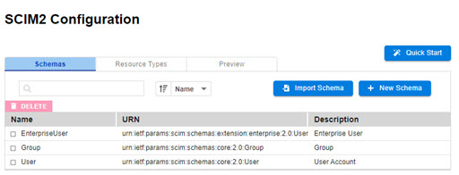
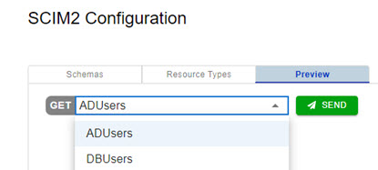
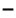
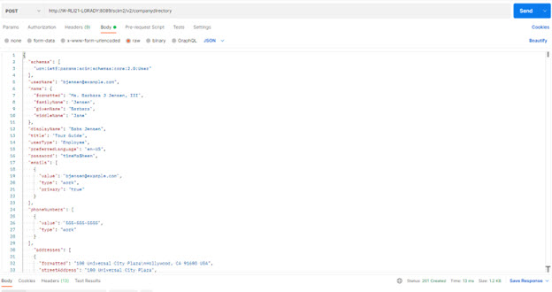
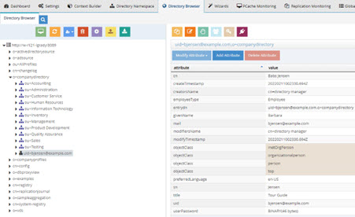
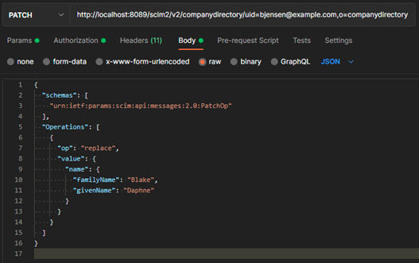
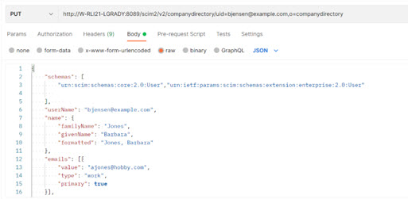

## SCIM Overview

The System for Cross-domain Identity Management (SCIM) specification automates user identity management between identity domains. This chapter describes the configuration of the RadiantOne SCIM service.  The RadiantOne service supports SCIMv2.

## Configuration

For the RadiantOne service to support SCIM queries from clients, a SCIM schema and resource type are required. To access the SCIM configuration in the Main Control Panel, go to Settings Tab > Server Front End > SCIM. The SCIM Configuration page contains three sub tabs: Schemas, Resource Types, and Preview. 
 


Figure 1: SCIM Configuration

The configuration is saved in: <RLI_HOME>/vds_server/conf/scim2. This folder contains three sub-folders: resources, schemas, and templates. The resources folder contains all resource type definitions, each defined in a JSON-formatted file. The schemas folder contains a definition for attributes, each defined in a JSON-formatted file. The templates folder contains predefined attribute mappings.

### Quick Start Configuration

To configure SCIM access to RadiantOne entries you can use the Quick Start option to automatically define a SCIM schema and resource type that matches the objects and attributes associated with your entries, or you can define your own SCIM schema and resource type. This example describes the Quick Start steps. See Creating Schemas and Creating Resource Types for steps on customizing your own.

1.	Create a virtual view of your identity sources. There are many methods to create virtual views using RadiantOne. If you need assistance, see the RadiantOne Namespace Configuration Guide, Context Builder Guide, and the Identity Service Wizards Guide. If your identities are in a RadiantOne Universal Directory instead of a virtual view, make sure you know what object class they are associated with.
1.	If using a virtual view, make sure it is mounted below a Root Naming Context in the RadiantOne namespace. If you need assistance, see the RadiantOne Namespace Configuration Guide.
1.	If the identities are associated with custom object classes or attributes (not currently defined in the RadiantOne schema), extend the RadiantOne schema with the objects and attributes. If you need assistance, see Chapter 4 in the RadiantOne System Administration Guide. 
1.	Go to the Main Control Panel > Settings Tab > Server Front End > SCIM.
1.	In the SCIM Configuration, click **Quick Start**.
1.	Enter a unique name in the Name property. This is used as the name for the Resource Type.
1.	For the Endpoint, enter an endpoint identifier. This comprises the URL a SCIM client uses to access the entries.
1.	For the Base DN, click Browse and select the root naming context in the RadiantOne namespace where your virtual view is mounted.
1.	For the Primary Object Class, select the object class associated with the identities in the virtual view from the drop-down list. If you do not see your object class here, extend the RadiantOne schema prior to using this Quick Start. See Chapter 4 in the RadiantOne System Administration Guide. 
1.	Click Save. An example is shown below.

  
 
  Figure 4.2: SCIM Quick Start

1.	To view the attribute mappings that were auto-generated, select the Resource Types tab.
1.	Select the resource type name you configured and click the MAPPINGS tab.  An example is shown below.
 
  

  Figure 4.3: Example of Auto-generated Attribute Mappings

1.	Click the Preview tab and select the Resource Type from the drop-down list. 
1.	Click Send. The entries in the RadiantOne service are returned as SCIM entries.


 
Figure 4.4: SCIM Preview Tab

## SCIM Schemas

A SCIM schema designates attribute characteristics such as their mutability, type, and other features. The core SCIM schemas: User, Group, and Enterprise User Extensions are supported and configured by default in RadiantOne. Custom schemas are also supported. SCIM schemas are managed from the Main Control Panel > Settings Tab > Server Front End > SCIM section -> Schemas tab on the right.

To query the SCIM schema (core, extension and custom) in the RadiantOne service, a SCIM client can use: `http://<RadiantOneService>:8089/scim2/v2/Schemas`

### Group Default Core Schema

To view the default Group SCIM schema, go to the Main Control Panel -> Settings Tab -> Server Front End -> SCIM. On the Schemas tab, click Group. The default attributes are outlined in the table below.

Name | Type | Description
-|-|-
displayName | string | A human-readable name for the Group. REQUIRED.
members	| complex | A list of members of the Group.

Table 4.1: SCIM Attributes Associated with the Default Group Schema

### User Default Core Schema

To view the default User SCIM schema, go to the Main Control Panel > Settings Tab > Server Front End > SCIM. On the Schemas tab, click User. The default attributes are outlined in the table below.

Name | Type | Description
-|-|-
active | boolean | A Boolean value indicating the User's administrative status.
addresses | complex	 | A physical mailing address for this User. Canonical type values of 'work', 'home', and 'other'. This attribute is a complex type with the following sub-attributes.
displayName	 | string | The name of the User, suitable for display to end-users. The name SHOULD be the full name of the User being described, if known.
emails | complex | Email addresses for the user. The value SHOULD be canonicalized by the service provider, e.g., 'bjensen@example.com' instead of 'bjensen@EXAMPLE.COM'. Canonical type values of 'work', 'home', and 'other'.
entitlements | complex | A list of entitlements for the User that represent a thing the User has.
groups | complex | A list of groups to which the user belongs, either through direct membership, through nested groups, or dynamically calculated.
ims | 	complex	 | Instant messaging addresses for the User.
locale | string | Used to indicate the user's default location for purposes of localizing items such as currency, date time format, or numerical representations.
name | complex | The components of the user's real name. Providers MAY return just the full name as a single string in the formatted sub-attribute, or they MAY return just the individual component attributes using the other sub-attributes, or they MAY return both. If both variants are returned, they SHOULD be describing the same name, with the formatted name indicating how the component attributes should be combined.
nickName | string | The casual way to address the user in real life, e.g., 'Bob' or 'Bobby' instead of 'Robert'. This attribute SHOULD NOT be used to represent a User's username (e.g., 'bjensen' or 'mpepperidge').
password | string | The User's cleartext password. This attribute is intended to be used as a means to specify an initial password when creating a new User or to reset an existing User's password.
phoneNumbers | complex | Phone numbers for the User. The value SHOULD be canonicalized by the service provider according to the format specified in RFC 3966, e.g., 'tel:+1-201-555-0123'. Canonical type values of 'work', 'home', 'mobile', 'fax', 'pager', and 'other'.
photos | complex | URLs of photos of the User.
preferredLanguage | string | Indicates the User's preferred written or spoken language. Generally used for selecting a localized user interface; e.g., 'en_US' specifies the language English and country US.
profileUrl | reference | A fully qualified URL pointing to a page representing the User's online profile.
roles | complex	| A list of roles for the User that collectively represent who the User is, e.g., 'Student', 'Faculty'.
timezone | string | The User's time zone in the 'Olson' time zone database format, e.g., 'America/Los_Angeles'.
title | string | The user's title, such as "Vice President."
userName | string | Unique identifier for the User, typically used by the user to directly authenticate to the service provider. Each User MUST include a non-empty userName value. This identifier MUST be unique across the service provider's entire set of Users. REQUIRED.
userType | string | Used to identify the relationship between the organization and the user. Typical values used might be 'Contractor', 'Employee', 'Intern', 'Temp', 'External', and 'Unknown', but any value may be used.
x509Certificates | complex | A list of certificates issued to the User.

Table 4.2: SCIM Attributes Associated with the Default User Schema

### Enterprise User Default Core Schema

To view the default Enterprise User SCIM schema, go to the Main Control Panel > Settings Tab > Server Front End > SCIM. On the Schemas tab, click User. The default attributes are outlined in the table below.

Name | Type | Description
-|-|-
costCenter | string | Identifies the name of a cost center.
department | string | Identifies the name of a department.
division | string | Identifies the name of a division.
employeeNumber | string | Numeric or alphanumeric identifier assigned to a person, typically based on order of hire or association with an organization.
manager	 | complex | The User's manager. A complex type that optionally allows service providers to represent organizational hierarchy by referencing the 'id' attribute of another User.
organization | string | Identifies the name of an organization.

Table 4.3: SCIM Attributes Associated with the Default Enterprise User Schema

## Creating Schemas

If the default SCIM schemas do not meet your needs, you can create a new one.

To add a new schema:

1.	From the Main Control Panel, click the Settings Tab > Server Front End section > SCIM sub-section.

2.	Click the New Schema button.

3.	Enter the Schema URN (Uniform Resource Name). This value must be unique.

4.	Enter a unique display name.

5.	To add attributes to the schema, click the New Attribute button. For more information, see the [Custom SCIM Attributes](#custom-scim-attributes) section.

6.	Click Save. 

### Custom SCIM Attributes

Custom SCIM attributes can be created for new schemas or when editing existing custom schemas. 

>[!note] 
>It is not advised to modify the attributes of the default core SCIM schemas.

Attributes can be either single-valued or multi-valued. Multi-valued attributes like email, phoneNumbers, and ims can support canonical values, like Type (work, home, mobile, fax, pager…etc.). SCIM also supports complex attributes where an attribute can have sub-attributes. This section describes the attribute types and provides an example for each.

Simple, single-valued attribute – an attribute that contains a single value. 

<br>`{`
<br> `"displayName" : "Carmen, Brian"`
<br>`}`
<br>`Simple, multi-valued attribute – an attribute that contains multiple values. These attributes can include a canonical “type” attribute to indicate the type of value specified.`
<br>`{`
<br> `"emails" : [`
<br> `{`
<br>`    "type" : "other",`
<br>`    "value" : "bcarmen@yahoo.com"`
<br>`},`
  <br>`{`
<br> `"type" : "work",`
<br> `"value" : "bcarmen@radiantlogic.com"`
<br> `}]`
<br>`}`

Complex attribute – an attribute that contains one or more simple attributes as sub-attributes.

`{`
<br>`  "name" : {`
<br>`"familyName" : "Carmen",`
<br>`"givenName" : "Brian",`
<br>`"displayName" : "Carmen, Brian" }`
<br>`}`

“givenName” is a sub-attribute of the “name” complex attribute.

To create SCIM attributes:

1.	From the Main Control Panel, click the Settings Tab > Server Front End > SCIM > Schemas tab on the right.

2.	On the Schemas tab, either create a new schema or click and existing schema.

3.	Click the **New Attribute** button. 

4.	Name the attribute. 

5.	Provide an optional description. 

6.	Select an [attribute type](#attribute-types).

7.	Enable the Required option if you want this attribute to be required (have a value) to insert or update entries associated with this SCIM schema.

8.	Enable the Multi-valued option if the attribute will have more than one value associated with it. Both simple and complex attributes can be multi-valued.

9.	Enable Case Exact if the attribute is a string type and you want the value to be case-sensitive.

10.	Select the [mutability](#attribute-mutability).

11.	Select the condition in which the [attribute is returned](#attribute-returned-characteristics). This indicates when an attribute and associated values are returned in response to a GET request or in response to a PUT, POST, or PATCH request.

12.	Click Save.

13.	Repeat steps 3-12 to add all attributes.

### SCIM Attribute Types

Type | Description
-|-
String | A sequence of zero or more Unicode characters encoded in UTF-8. Use this type for JSON attributes.
Boolean | A variable, having two possible values of either “true” or “false”.
Integer | A whole number with no fractional digits or decimal.
Binary | The attribute value MUST be encoded as a valid xsd:base64Binary value.
Decimal	| A real number with at least one digit to the left and right of the period.
DateTime | This attribute value must be encoded as a valid xsd:dateTime and must include both a data and a time.
Reference | A URI for a resource.
Complex	| A singular or multi-valued attribute whose value is a composition of one or more simple attributes. A complex attribute must not contain sub-attributes that have sub-attributes.

Table 4.4: Attribute Types
     
### SCIM Attribute Mutability 

Each custom attribute has a mutability property that dictates how the RadiantOne service handles the attribute when processing operations. The possible values (and meaning) for the mutability property are summarized in the table below.

Type | Description
-|-
readOnly | The attribute SHALL NOT be modified.
readWrite | The attribute MAY be updated and read at any time. This is the default value.     
immutable | The attribute MAY be defined at resource creation (e.g. POST) or at record replacement via a request (e.g. a PUT).  The attribute SHALL NOT be updated.
writeOnly | The attribute MAY be updated at any time. Attribute values SHALL NOT be returned (e.g. because the value is a stored hash). Note: An attribute with a mutability of "writeOnly" usually also has a returned setting of "never".

Table 5: Attribute Mutability

### SCIM Attribute Returned Characteristics

Each attribute has a characteristic regarding the behavior of how it is returned to clients. The possible values (and meaning) for the Returned property are summarized in the table below.

Type | Description
-|-
always | The attribute is always returned, regardless of the contents of the "attributes" parameter.  
never | The attribute is never returned. This attribute may be used in a search filter.
by-default | The attribute is returned by default in all SCIM responses where attribute values are returned.  If the GET request "attributes" parameter is specified, attribute values are only returned if the attribute is named in the "attributes" parameter. This is the default value.
request	 | The attribute is returned in response to any PUT, POST, or PATCH operations if the attribute was specified by the client (for example, the attribute was modified).  The attribute is returned in a SCIM query operation only if specified in the "attributes" parameter.

Table 4.6: Attribute Returned Characteristics

## Importing Schemas

If you have an existing schema definition (JSON-formatted), you can import this into the RadiantOne configuration.
To import a schema:

1.	From the Main Control Panel, click the Settings Tab > Server Front End section > SCIM sub-section.

2.	Click the Import Schema button. 

3.	In the Import Schema window, click the Choose File button. 

4.	Navigate to the directory containing the schema file. Select the file and click Open. 

5.	Click the Import button. 

## Deleting Schemas

To delete a schema:
1.	From the Main Control Panel, click the Settings Tab > Server Front End section > SCIM sub-section.

2.	Click the checkbox of the schema to be deleted. 

3.	Click the **Delete** button. 

4.	In the confirmation window, click Confirm. 

>[!note] 
>If you delete the JSON-formatted schema files directly on the file system, the RadiantOne service must be restarted for changes to take effect. If RadiantOne is deployed in a cluster, restart the service on all nodes.

## SCIM Resource Types

SCIM resource types are managed from the Main Control Panel > Settings Tab > Server Front End > SCIM section > Resource Types tab on the right.

>[!note]
>To view a list of resource types configured in RadiantOne, use: `http://<RadiantOneService>:8089/scim2/v2/resourcetypes`

A SCIM resource type is a collection of SCIM attributes identified by one or more SCIM schemas. Resource types are associated with specific base DNs in the RadiantOne namespace. For example, the “Users” resource type could be associated with o=companydirectory. This means that resource type “Users” cannot be associated with any other base DN. If you want to associate a resource type to multiple base DNs/views, you must aggregate them under a common root naming context and associate the resource type with the root naming context level.

The Base DN configured for the resource type dictates what root naming context the query applies to. If you want to find multiple resource types in the same base DN, you must create a resource type for each with a specific primary object class and unique endpoint name. For example, if you want to find both users and groups in o=companydirectory, you would create a resource type using the inetOrgPerson primary object class. You would then create another resource type using the groupOfUniqueNames object class.

Resource types are linked to a core SCIM schema and an optional set of extension schemas. Attribute mappings (between attributes in the virtual view to SCIM) can be applied across one or more SCIM schemas and a single virtual attribute can be mapped to more than one SCIM attribute. 

## Creating Resource Types

To add a new resource type:

1.	From the Main Control Panel, click the Settings Tab  Server Front End section  SCIM sub-section.

2.	Click the Resource Types tab. 

3.	Click the New Resource Type button. 

4.	On the Config page, enter a unique name to identify the resource.

5.	Enter the suffix of the SCIM URL to associate with this resource type in the Endpoint property. (e.g. MyUsers)

6.	To enable the resource type, click the Active toggle switch.

7.	(Optional) Enter a description of the resource in the Description property.

8.	Click Browse next to the Base DN property and select the root naming context in the RadiantOne namespace where the identities (e.g. users and groups) that you want accessible with SCIM are located.

9.	(Optional) Enter an LDAP filter if you want to condition the entries returned by the search.

10.	Enter the maximum number of entries to return in a query in the Max Entries Returned property. 

11.	Enter the Primary Object Class associated with your identities. This is the object class associated with the identities in your virtual view and/or Universal Directory store. This and the auxiliary object class(es) property determine which attributes are available to map to the SCIM schema. 

12.	(Optional) Enter additional [auxiliary] object class(es) associated with the identities in your virtual view and/or Universal Directory store. This and the primary object class determine which attributes are available to map to the SCIM schema. This drop-down menu allows the selection of multiple items. 

13.	Enter a DN Expression to calculate the LDAP DN for new entries. If the SCIM URL in the POST request does not specify the DN of the entry to insert, this property dictates how attribute value(s) from the body of the request are used to generate the DN for the new entry (e.g. uid=${userName},o=companydirectory). This DN expression should mimic the root naming context in the RadiantOne namespace where you want new entries created, prefixed with the RDN name and SCIM attribute in curly braces used to populate the RDN value.

14.	Select the core SCIM schema to associate with the resource type from the SCIM Core Schema drop-down list.

15.	(Optional) Select required (extension) schemas from the table on the left. To add all items as required schemas, click the  button. To add selected items as required schemas, select schemas from the table on the left and click the  button.

16.	(Optional) Select optional schemas from the table on the left. To add all choices as optional schemas, click the   button. To add only selected items as optional schemas, select schemas from the table on the left and click the  button.

17.	Click Next. The Mappings page is displayed.

18.	Map LDAP attributes in your RadiantOne virtual view or Universal Directory store to SCIM attributes using either a [pre-defined template](#template-based-attribute-mapping) or a [manual mapping](#manual-attribute-mapping).

19.	Click the Save button. The SCIM Configuration page displays the configured resource.

>[!note] 
>To view a list of resource types configured in RadiantOne, use: `http://<RadiantOneService>:8089/scim2/v2/resourcetypes`

### Template-based Attribute Mapping

To use a pre-defined template for attribute mapping, click the **Load Template** button.

The templates are pre-defined mappings based on object class and the schema URN. If the object class and schema URN of the resource type being created matches that of an existing resource(s), the relevant mapping template(s) are listed with multi-select checkboxes, as shown in the following image. 


 
Figure 5: Applying a Template

If no match is detected, a drop-down menu allows you to select one of the following templates.


 
Figure 6: Selecting a Template

>[!note] 
>To remove a mapping, click the  button in the LDAP Attribute column in the table on the right.

### Manual Attribute Mapping

To manually define an attribute mapping, select an attribute in the table on the left. In the table on the right, click the corresponding SCIM attribute, and click the  button. Repeat this process for all attributes to be mapped.

>[!note] 
>To remove a mapping, click the  button in the LDAP Attribute column in the table on the right.

**Mapping Complex Attributes**

A complex attribute is a singular or multi-valued attribute whose value is a composition of one or more simple attributes (sub-attributes). A complex attribute may be mapped, or its sub-attributes may be mapped, but not both. To manually map a complex attribute, select an attribute in the table on the left. In the table on the right, click the corresponding SCIM attribute, and click the  button. 
To map a complex attribute’s sub-attribute(s): 
1.	Select an attribute in the table on the left. 
1.	In the table on the right, click Plus-sign next to the complex SCIM attribute. The complex attribute is hidden, and its sub-attributes are displayed. 


 
Figure 4.7: Expanding a Complex Attribute

1.	In the table on the right, click the corresponding SCIM sub-attribute, and click the  button.

>[!note] 
>Mapping a complex attribute overrides any of its existing sub-attribute mappings and vice versa.

In the following example, the sub-attributes of the complex attribute Office are mapped. 


 
Figure 8: Mapping Sub-attributes

1.	Click Save. 

To collapse a complex attribute, click  next to the topmost sub-attribute.

## Importing Resource Types

If you have an existing resource type definition (JSON-formatted), you can import this into the RadiantOne configuration.

To import a resource type:

1.	From the Main Control Panel, click the Settings Tab -> Server Front End > SCIM > Resource Types tab on the right.
2.	Click Import Resource Type.

3.	Click Choose File and navigate to the folder containing the schema file, select the file, and click Open.

4.	Click the Import button.

## Deleting Resource Types

To delete a resource:
1.	From the Main Control Panel, click the Settings Tab -> Server Front End -> SCIM.
2.	On the SCIM2 Configuration page, click the Resource Types tab. 
3.	Click the checkbox of the resource to be deleted. 
4.	Click the **Delete**  button. 
5.	In the confirmation window, click Confirm. 

>[!note] If you delete JSON-formatted resource type files directly on the file system, the RadiantOne service must be restarted for changes to take effect. If RadiantOne is deployed in a cluster, restart the service on all nodes.

## Accessing the RadiantOne SCIM Service

To list all SCIM resource types configured in RadiantOne, use: 

`http://<RadiantOneService>:8089/scim2/v2/resourcetypes`

>[!note] The keywords in this request are not case-sensitive.

Examples of SCIM clients used in this guide are WizTools.org REST Client and Postman. Some important items to keep in mind are listed below:

-	Account creation uses POST. The DN expression (suffix) configured for the resource type indicates where the entry is created in the RadiantOne namespace. This account must not already exist.

-	Mass attribute updates can be done with PUT. If you want to do a lot of changes on an entry, then it is generally easier to “replace” the whole entry. To do this, you can use PUT. PUT is similar to POST, except that the entry needs to already exist when using PUT. If the URL does not specify the DN of the entry to replace, the DN expression property configured for the resource type dictates how the ID attribute value from the body of the request is used to generate the DN.

-	Entry deletion uses DELETE with URL containing the DN of the entry to delete. 

-	Add the “authorization” header with a value matching your RadiantOne user DN and password for [authentication](#authentication).

-	Add the “Content-Type” header with a value of application/json.

-	All keywords for Resource Types (v2/Users, v2/Groups, v2/List) in the SCIM request are case sensitive.

### SCIM Operations Supported

Operation	| Usage
-|-
GET	| Reads a resource (or resources) from the RadiantOne service.
POST	| Creates a new resource in the RadiantOne service. The DN Expression property defined for the Resource Type dictates which root naming context the entry is inserted into (how the DN is constructed).
PUT	| Updates an existing resource. Use caution with PUT operations, since they are handled as a replace of the entry. Some attributes are included in the modify request as a replace and others are included as a delete. This is dictated by the mutability property defined for the attribute.
PATCH	| Updates an existing resource. 
DELETE	| Deletes a resource in the RadiantOne service.

Table 7: SCIM Operations Supported

### SCIM Response Status Codes

One of these codes is an HTTP status returned to SCIM clients. (In the Response section of the REST client, look for the numeric value that follows "httpStatus"). The following table describes these HTTP status codes.

HTTP Status #	| Description	| Next Step
-|-|-
200	| Search (GET), update (PATCH) or Delete (DELETE) Operation successful.	| For searches, no action necessary. For other operations, refresh the RadiantOne namespace to view the modification. <br> Note - For bind requests where the user’s password is near expiration, the response includes the time (in seconds) until the password expires (secUntilPwdExp value). This is only relevant if the RadiantOne password policy applicable for the user has been configured to support password expiration.
201	| Entry successfully created (POST). | This code is issued if an entry is successfully created.
400	| Bad Request (operation unsuccessful). | This can happen if there is a syntax error in the body of a request.
404	| Entry not found.	| You get this message when searching for an entry or deleting an entry that doesn’t exist.
500	| Server error. | Send the exception message along with the <RLI_HOME>/vds_server/logs/vds_server.log to Radiant Logic customer support. 

Table 7: SCIM Response Status Codes

### Authentication

Authentication can be performed using basic authentication by passing the credentials in a header.
The header must be named “authorization” and the value is set by concatenating: Basic base64(dn:password). Don’t forget to use a `<space>` between Basic and the encoded value. Don’t forget to use “:” to separate dn value from password value. You can use any base64 encoder to get this value. An example for cn=directory manager and password of secretsecret would be this: cn=directory manager:secretsecret 

The base64 encoded value of this would be: Y249ZGlyZWN0b3J5IG1hbmFnZXI6c2VjcmV0c2VjcmV0

Resulting in a header of: 
<header key="authorization" value="Basic Y249ZGlyZWN0b3J5IG1hbmFnZXI6c2VjcmV0c2VjcmV0"/>

## Examples

Below are some example SCIM requests using a Postman client.

### Insert User
The following example creates an entry for a user named Barbara Jensen in one of the default RadiantOne Universal Directory stores located at o=companydirectory.
The resource type configuration and attribute mappings used in this example are shown below.


 
Figure 4.9: Resource Type Example
 

 
Figure 4.10: Sample Attribute Mappings

Based on the above configuration, the following is a sample SCIM POST query to create a user.

Field	| Value
-|-
URL Syntax	|  `http://< RadiantOneServer>:8089/scim2/v2/< ResourceType>`
Example URL	| http://localhost:8089/scim2/v2/companydirectory
Method	| Post
Header Name	| Authorization
Header Value	| Basic Y249ZGlyZWN0b3J5IG1hbmFnZXI6c2VjcmV0c2VjcmV0

The following body example can be used to insert a user:
```
{
  "schemas": [
    "urn:ietf:params:scim:schemas:core:2.0:User"
  ],
  "userName": "bjensen@example.com",
  "name": {
    "formatted": "Ms. Barbara J Jensen, III",
    "familyName": "Jensen",
    "givenName": "Barbara",
    "middleName": "Jane"
  },
  "displayName": "Babs Jensen",
  "title": "Tour Guide",
  "userType": "Employee",
  "preferredLanguage": "en-US",
  "password": "t1meMa$heen",
  "emails": [
    {
      "value": "bjensen@example.com",
      "type": "work",
      "primary": "true"
    }
  ],
  "phoneNumbers": [
    {
      "value": "555-555-5555",
      "type": "work"
    }
  ],
    "addresses": [
    {
      "formatted": "100 Universal City Plaza\nHollywood, CA 91608 USA",
      "streetAddress": "100 Universal City Plaza",
      "locality": "Hollywood",
      "region": "CA",
      "postalCode": "91608",
      "type": "work"
    }
  ]
  }
```
Table 4.8: SCIM Post Query to Create A User



Figure 4.11: POST Query to SCIMv2 API of RadiantOne

Based on the New Entry DN Expression in the Resource Type configuration described above, the entry is created as uid=bjensen@example.com,o=companydirectory. This can be seen in the RadiantOne in the screen shot below.


 
Figure 4.12: Sample Entry Created with a SCIM POST Operation

### Insert User with Enterprise Extension Attributes

The following SCIM POST query example describes how to create a user entry that contains enterprise extension attributes like employeeNumber, division, and department. This example is based on the configuration described in the [Insert Entry](#insert-user) example above.

Field	| Value
-|-
URL Syntax	|  `http://< RadiantOneServer>:8089/scim2/v2/< ResourceType>`
Example URL	| http://localhost:8089/scim2/v2/companydirectory
Method	| Post
Header Name	| Authorization
Header Value	| Basic Y249ZGlyZWN0b3J5IG1hbmFnZXI6c2VjcmV0c2VjcmV0

The following body example can be used to insert a user containing enterprise extension attributes:
 ```
{
    "schemas": [
        "urn:scim:schemas:core:2.0:User", "urn:ietf:params:scim:schemas:extension:enterprise:2.0:User"       
    ],    
    "userName": "Acooper",
    "name": {
        "familyName": "Cooper",
        "givenName": "Alice in wonderland",
        "formatted": "Alice D Cooper"
    },
    "emails": [{
        "value": "acooper@sindersuited.com",
        "type": "work",
        "primary": true
    }],
    "title": "Song writer",
    "urn:ietf:params:scim:schemas:extension:enterprise:2.0:User":
    {
        "employeeNumber":"9252",
        "division":"Sales",
        "department": "Rock'n roll"
    }
}
```

Table 9: SCIM POST Query to Insert A User with Enterprise Extension Attributes


 
Figure 13: Example POST Query Shown in Postman

Based on the New Entry DN Expression in the Resource Type configuration described above, the entry is created as uid=Acooper,o=companydirectory. This can be seen in the RadiantOne in the screen shot below.


 
Figure 14: Sample Entry Created with a SCIM POST Operation

### Update (PATCH) User

The following example updates an entry for a user named Barbara Jensen in one of the default RadiantOne Universal Directory stores located at o=companydirectory.

The resource type configuration and attribute mappings used in this example are shown below.

>[!note] 
>To execute this example command, the default SCIM user schema must be used. To use this schema, create a resource type using the New Resource Type option. Resource types created using the Quick Start option do not use the default SCIM user schema.


 
Figure 15: Resource Type Configuration Example


 
Figure 16: Sample Attribute Mappings

Based on the above configuration, the following is a sample SCIM PATCH query to update a user.

Field	| Value
-|-
URL Syntax	|  `http://< RadiantOneServer>:8089/scim2/v2/< ResourceType>/< DN>`
Example URL	| http://localhost:8089/scim2/v2/companydirectory/uid=bjensen@example.com,o=companydirectory
Method	| Patch
Header Name	| Authorization
Header Value	| Basic Y249ZGlyZWN0b3J5IG1hbmFnZXI6c2VjcmV0c2VjcmV0

The following body example can be used to update a user:
```
{
  "schemas": [
    "urn:ietf:params:scim:api:messages:2.0:PatchOp"
  ],
  "Operations": [
    {
      "op": "replace",
      "value": {
        "name": {
          "familyName": "Blake",
          "givenName": "Daphne"
        }
      }
    }
  ]
}
```

Table 10: SCIM PATCH Query to Update A User
 


Figure 17: PATCH Query to SCIMv2 API of RadiantOne

Based on the PATCH request described above, the entry uid=bjensen@example.com,o=companydirectory is updated. This can be seen in the RadiantOne in the screen below.
 


Figure 18: Sample Entry Updated with a SCIM PATCH Operation

### Update (PUT) User with Enterprise Extension Attributes

The following SCIM PUT query example describes how to update a user entry that contains enterprise extension attributes like employeeNumber, division, and department. This example is based on the configuration described in the [Insert Entry](#insert-user) example above.

>[!note] 
>For PUT requests, only attributes that are mapped for the resource type are replaced in the entry. If the body of the request contains an attribute that is not mapped, it is ignored by the RadiantOne service. If the body of the request does not contain an attribute that has a mapping, the value is removed (set to NULL) in the entry in RadiantOne. This behavior does not apply to the objectclass attribute.

Field	| Value
-|-
URL Syntax	|  `http://< RadiantOneServer>:8089/scim2/v2/< ResourceType>/< DN>`
Example URL	| http://localhost:8089/scim2/v2/companydirectory/uid=bjensen@example.com,o=companydirectory
Method	| Put
Header Name	| Authorization
Header Value	| Basic Y249ZGlyZWN0b3J5IG1hbmFnZXI6c2VjcmV0c2VjcmV0

The following body example can be used to update a user containing enterprise extension attributes:
```
{
    "schemas": ["urn:scim:schemas:core:2.0:User","urn:ietf:params:scim:schemas:extension:enterprise:2.0:User"     
    ],    
    "userName": "bjensen@example.com",
    "name": {
        "familyName": "Jones",
        "givenName": "Barbara",
        "formatted": "Jones, Barbara"
    },
    "emails": [{
        "value": "ajones@hobby.com",
        "type": "work",
        "primary": true
    }],
    "title": "Hobbyist",
    "urn:ietf:params:scim:schemas:extension:enterprise:2.0:User":
    {
        "employeeNumber":"9252",
        "division":"Sales",
        "department": "Hobby"
    }
   }
```

Table 11: SCIM PUT Query to Updated A User with Enterprise Extension Attributes

The PUT request from a Postman client is shown below.


  
Figure 19: Example SCIMv2 PUT Request

Based on the PUT request described above, the entry uid=bjensen@example.com,o=companydirectory is updated. This can be seen in RadiantOne in the screen shot below.


 
Figure 20: Sample Entry Updated with a SCIM PUT Operation
 
### Get Entry

The following SCIM GET query example describes how to retrieve the entry that was created in the [Insert Entry](#insert-user) example above.

Field	| Value
-|-
URL Syntax	| `http://< RadiantOneServer>:8089/scim2/v2/< ResourceType>/< DN>`
Example URL	| http://localhost:8089/scim2/v2/companydirectory/uid=bjensen@example.com,o=companydirectory
Method	| Get
Header Name	| Authorization
Header Value	| Basic Y249ZGlyZWN0b3J5IG1hbmFnZXI6c2VjcmV0c2VjcmV0

Table 12: SCIM GET Query to Retrieve an Entry

The GET request from a Postman client is shown below.


 
Figure 21: SCIM GET Query Example

### Delete Entry

The following SCIM DELETE query example describes how to delete the entry that was created in the [Insert Entry](#insert-user) example above.

Field	| Value
-|-
URL Syntax	| `http://< RadiantOneServer>:8089/scim2/v2/< ResourceType>/< DN>`
Example URL	| http://localhost:8089/scim2/v2/companydirectory/uid=bjensen@example.com,o=companydirectory
Method	| Delete
Header Name	| Authorization
Header Value	| Basic Y249ZGlyZWN0b3J5IG1hbmFnZXI6c2VjcmV0c2VjcmV0

Table 12: SCIM DELETE Query to Delete an Entry

The DELETE request from a Postman client is shown below.


 
Figure 22: SCIM DELETE Query Example
