# Chapter 2: Tuning Tips for Caching in the RadiantOne Federated Identity Service

This chapter provides guidelines on how to effectively use caching for optimal performance. The first part covers the different categories and levels of cache along with a quick review of the different use cases that justify a cache deployment. The second part provides details and describes the advantages and trade-off between “in-memory” and “persistent” cache.  Finally, a description of cache refresh methods is reviewed. This is an essential and often overlooked aspect of cache management.

Persistent caching is only associated with the RadiantOne Federated Identity module and is irrelevant for [RadiantOne Universal Directory](04-tuning-tips-radiantone-universal-directory.md).

## When and why do you need a cache with RadiantOne FID?

There are many cases where RadiantOne is leveraged more for its flexibility rather than its pure speed. However, in most critical operations such as identification, authentication, and authorization, it needs to provide guaranteed fast access to information. In fact, in many cases RadiantOne needs to provide read operations that are faster than what can be delivered by the underlying sources. What is meant by “fast”, is a level of performance that is at least 3 to 5 times what can be derived from standard relational databases (RDBMS) – as an example. 

An additional requirement, in some situations, is a fast “write” capability.  A typical case is when security information needs to be logged into the directory for audit purposes at authentication time.  The problem is that most directories are a lot slower than RDBMS when it comes to write operations.  In this case, RadiantOne can forward the writes to faster transactional data stores. 

The question then becomes: How can the RadiantOne FID service be faster than the underlying data sources despite the fact that it adds an extra layer of software and one more intermediate TCP/IP hop?  

The answer is unambiguous, without caching, the RadiantOne FID service is always slower than the sources it has virtualized. In terms of overhead, the additional TCP/IP hop (an application talks to RadiantOne first and then it talks to the underlying sources) by itself, divides the throughput of the virtualized source by approximately half.  If you include the dynamic transformations, the joins, and the reorganization of the underlying namespaces to this overhead (in short, all the value added by RadiantOne through on-the-fly processing), it is difficult to imagine how this service can be faster than the underlying sources with dynamic access alone. 

For all the above reasons, a flexible and efficient cache strategy and cache refresh mechanism is an absolute necessity.  In most sizeable identity and access management deployments, caching is not only required, but also depending on volume, scalability, resilience to failure, etc…different levels and types of cache (in-memory and/or persistent) are needed.  

To better understand the different aspects of performance and cache for RadiantOne, we need to look at the architecture. At a high level, the architecture can be divided into two main layers: 

-	A front-end layer which handles the protocol (LDAP or other standard protocols such as a Web Services, SPML, or SAML).

-	A back-end layer that oversees mapping/transforming the result set from the “virtualized” data sources (directories, databases and/or applications). 

The performance of the RadiantOne service depends on a front-end layer that shares most of the logic of an LDAP server and as such can leverage the same optimization strategies. However, performance also depends even more on the back–end layer, which really represents the virtualization. This is where the secret for performance and scalability resides and, where a solid and scalable caching mechanism is indispensable.

###Front-end performance

The RadiantOne front-end shares most of the layers of a “classic” LDAP directory and the same “potential” bottlenecks. They are essentially at: 
-	The TCP/IP server (and client) connections 

-	The first level of query parsing

#### TCP/IP Connections and Connection Pooling

The first bottleneck is common to any TCP/IP based server and not specific to LDAP servers. Even if a server could set aside resources (memory and handles) for an arbitrarily large number of connections, what the server can really support (the effective number of concurrent connections) is dictated by the underlying hardware platform, bandwidth and operating system.  Once this level is reached, no matter how powerful the underlying hardware is (in terms of processing throughput), the server is idle and waiting for the establishment of the connections.  In this case the only possible optimization at the TCP layer would be by using specific hardware such as TCP offload engines, more bandwidth, better routers and/or scaling out by load balancing.
The latency of a TCP/IP client connection is another point to consider in the terms of performance.  The latency of a TCP/IP client connection, compared to the speed of the processor is extremely high. As a result, multiple connections and disconnections hamper the apparent throughput of any directory server. (An easy way to verify this fact is to run the “search rate” utility (as described in [Chapter 5](05-testing-radiantone-performance.md)) against any LDAP directory with or without keeping the connection open after each search).  With multiple connections/disconnections the search rate of a server drops to a quarter or a third of the normal throughput.  At the same time the CPU of the server shows a lot of idle cycles. Most of the time is spent waiting for the establishment or re-establishment of the client TCP/IP connection.  Since the RadiantOne service must connect to many distributed sources, it acts as a client to many TCP/IP servers, and so the cumulated latencies could be quite high.  The solution to this problem consists in pooling the different connections by class of connected servers to reuse existing connections as much as possible.  It is essentially a form of cache for an already open structure needed for a connection.  Therefore, support for connection pooling is an important feature for RadiantOne in dynamic access mode (without caching any data at the level of the server).  For details on connection pooling, please see [Chapter 3](03-tuning-tips-for-specific-types-of-backend-data-sources.md).

#### First Level of Query Parsing

The second issue is the overhead generated by the parsing of incoming queries. Although a lot less expensive than TCP/IP overhead, the parsing time is not negligible. To optimize, RadiantOne couples a query cache with an entry cache. The idea is that by caching a frequently issued query and its result set (entry cache), significant server time can be saved.  This strategy works well when information is not too volatile. The cache is equipped with a LRU (least recently used) eviction policy and TTL (time-to-live) marker for both queries and entries. 

However, query cache and entry cache are not the panacea to addressing performance issues. Query cache is relatively blind and based essentially on syntax and not semantics: two queries yielding equivalent results but using a slightly different syntax are represented twice in the cache.  Another limitation is the size of these caches. As volume increases, many factors start to negate the value of the approach. The cache refresh strategy is more complex, and latency in case of failure and cold restart (the cache needs to be re-populated before providing its performance boost) can be stumbling blocks. For these reasons, these categories of caches in RadiantOne are used essentially as a performance enhancer rather than the base for server speed.  If correctly sized, such a cache brings a 15 to 30% performance boost to a server (unless the whole dataset is quite small and could fit entirely in memory).  The next section explains that the key to scalability and sustainable performance for a directory with significant volume rests upon its indexing strategy for entries and access paths.

### Back-end Performance

**The “Secret” of LDAP Directory Speed**

The beginning of this chapter referred to the speed of a directory being primarily focused on reads. So, how fast is fast?  Between 1500 to 2000 queries per second/per GHZ/per processor (Pentium IV class machine on a Windows Server or Linux) for LDAP (Sun or Netscape 4.x to 5.x) versus 150 to 300 queries per second for a RDBMS (Oracle, DB2, or SQL Server) for a standard entry search with fully indexed queries. The size of an entry for these performance numbers is about 512 bytes, and the number of entries in the LDAP directory was 2 million. These numbers reflect a search operation for identification purposes (login). This performance is quite stable, even if the volume of entries goes up to 80 to 100 million entries.  However, the size of an entry is a factor in terms of performance. At 2 KB or more per entry the search rate starts to drop quickly.

The performance secret of an LDAP server when it comes to read and search operations is a relatively simple structure for queries and operations, which yields a much simpler access method and storage strategy (nothing to be compared with the richness and capabilities of SQL, but also none of the optimizations and complexity required of a full RDBMS).  Essentially, an LDAP directory can be implemented very efficiently with a classic approach of fully indexed data files based on B+ trees (RDBMS uses the same kind of storage and access methods, however their access plans are a lot more complex, involve a lot of processing, many indexes and optimizations for full support of relational operations).

Due to their relative simplicity, LDAP directories fully benefit from the classic advantages of B+ tree indexing. Searching for an entry based on a fully indexed attribute can be delivered in a guaranteed time and scale quite well.  Even without page caching, a B+ tree index can retrieve an indexed attribute (in the worst case) in no more than log N disk accesses, N being the number of entries. This simple and robust structure explains the performance and stability of LDAP directories when it comes to read even with a significant number of entries (100 million entries or more). More importantly, this level of speed can be guaranteed even with a relatively modest amount of main memory, again one of the strong points for B+Trees.  However, the story in terms of writes is not as good. Writing is an expensive operation, which does not scale well when the volume of entries increases. If this constraint is added, the fact that an LDAP directory must maintain many indexes (ideally as many as potentially “searchable” attributes), you can see that the number of updates is the key factor that limits the scalability of a classic directory. As is well documented, a directory is optimized for read with a modest amount of writes.

**The Different Caching Strategies**

Where are the bottlenecks for the RadiantOne service?  As described in this chapter, when it comes to the front-end layer read/search speed, RadiantOne is comparable to a classic directory.  The optimizations at this level are also similar.  The target is essentially to optimize the TCP/IP connections and to re-use the previous queries and corresponding results sets (Query cache and entry cache - see previous sections) when and where possible.

**The major bottleneck is at the level of the back-end**

By definition, a federated identity layer does not own any specialized back-end like a classic LDAP server (which as we have seen is the secret to speed and scalability with modest memory requirements).  By construction, a federated identity layer needs access to the underlying “virtualized” data sources.  Without a caching strategy, a federated identity layer acts simply as a proxy and forwards the calls to the underlying sources.  Without caching, even with the best optimization at the front-end, RadiantOne FID can only deliver a fraction of the speed of the underlying sources. If the “virtualized” sources are fast in terms of read operations and if the virtualization overhead is acceptable then dynamic access alone to the source data may be a viable strategy.  

However in most cases (e.g. when databases and/or Web Services are involved and volume is significant), a back-end caching mechanism is a requirement. A complete federated identity layer needs to offer different levels of cache with different cache refresh implementation strategies matching different use cases. 

There are essentially two forms of cache:
-	In-memory cache

-	Disk-based cache also called “persistent cache”

Each of these caching mechanisms can be refreshed using different methods. 

Cache refresh strategies can be divided into two main categories:

-	Polling the changes either periodically or based or an expiration of a “time-to-live“ value assigned to a cache entry
-	Detecting the change events directly at the sources (triggers or other methods)

#### Memory Cache

In this approach, cached entries are stored solely in memory. In terms of implementation, this approach has the advantage of simplicity. However in practice, this solution may present many potential issues depending on the use case. In most cases, memory cache works when the volume of entries and the complexity of the queries are modest.  However, with sizeable volume (and often the flexibility of a federated identity service tends to yield many use cases which quickly add an increased demand in terms of memory) and the variable latencies and volatility (update rates) of the virtualized data sources, it is difficult to guarantee the performance of a memory cache solution. The greatest risks with a memory cache result when the query pattern is not predictable and the data set volume exceeds the size of memory. Furthermore, some categories of directory views are not good candidates for caching because the operation can never guarantee that all possible observable results are retrieved at the right time. If the volatility of the underlying data store is high, and the volume of data is significant, then a memory cache with a time-to-live refresh strategy alone is very difficult to put in place and will not guarantee an accurate “image” or will generate excessive refresh volume negating the advantages of the cache. As a result, providing guaranteed performance is difficult if not impossible. Moreover, as volume increases or when queries needed to build the virtual image are more complex, the latency incurred by accessing the underlying sources just to rebuild the memory cache after a cold restart becomes more and more problematic. As a consequence, memory cache provides performance improvements only in very specific cases.  Memory cache needs to be considered more like a partial/incremental improvement boost rather than a complete solution to guaranteed performance.

### Persistent Cache

In this approach, images of the virtual entries are stored in the local RadiantOne Universal Directory.  This approach allows for fast recovery in case of failure. The whole virtual tree could be cached this way and a large volume of entries can be supported (hundreds of millions entries - essentially no practical limit if combined with partitioning and clusters). 

The challenge then becomes how to access this disk cache selectively at the level of each entry and at the same speed than the fastest classic LDAP server.  The answer is pretty straightforward even if its implementation is not:  build a persistent cache, which is a full LDAP V3 server.  All the advantages described for the classic LDAP directory speed apply here. The persistent cache becomes the equivalent of what in the RDBMS world we would call a “materialized” view of a complex directory tree stored in an LDAP format and transparently refreshed by polling or pushing events (triggers or logs) at the level of the data sources. In fact, the complexity here resides essentially in the cache refresh mechanism. The good news is that by leveraging good abstraction and representation (data modeling and metadata) of the different data sources, a completely automated solution is possible. One can say that in this case, a bit paradoxically, good abstraction and virtualization ends up into an always “synchronized” and persistent directory view. The major difference though with classic synchronization resides in the simplicity and the ease of deployment. Virtualization and good data modeling yield an automated solution where transformation, reconciliation, joins, caching, and synchronization is totally transparent to the RadiantOne administrator and reduced to a fairly simple configuration. 

The diagram below provides a general “rule of thumb” as to what type of cache to implement.


Figure 2.1: Cache implementation diagram
 
* Low volatility during the life of the cache (the time to live)
** Repetitive Queries – a query having exactly the same syntax (same user, same filter, same ACL)
*** Low Volume – The size of the cache as measured by (Nb entries * entry size * 2.5) cannot exceed the amount of memory allocated for cache

>[!note] for persistent cache, there is no limitation in terms of number of entries since everything is stored on disk.  When fully indexed, the persistent cache provides performance levels comparable to the fastest “classic” LDAP directory and even better performance when it comes to modify operations.

## Cache

RadiantOne offers different caching options to accommodate a variety of deployment needs.
-	Memory Cache (Entry Cache and Query Cache)

-	Persistent Cache

The diagram below provides a general “rule of thumb” as to what type of cache to implement. 

* Low volatility during the life of the cache (the time to live).

** Repetitive Queries – a query having exactly the same syntax (same user, same filter, same ACL).

*** Low Volume – The size of the cache as measured by (Nb entries * entry size * 2.5) cannot exceed the amount of memory allocated for cache.

For persistent cache, there is no limitation in terms of number of entries since everything is stored on disk.  When fully indexed, the persistent cache provides performance levels comparable to the fastest “classic” LDAP directory.

### Memory Cache

A memory cache (requires [Expert Mode](00-preface#expert-mode)) can be configured for any virtual directory view and there are two different types of memory caching available: [Entry Memory Cache](#configuring-entry-memory-cache) and [Query Memory Cache](#configuring-query-cache). They can be used together or individually. 

>[!warning] if you plan on using both entry and query cache on the same view/branch, be aware that the query cache is searched first.

#### Configuring Entry Memory Cache

This model of caching leverages two types of memory: Main and Virtual. Main memory is the real memory where a certain number of most recently used entries reside. Virtual memory is memory on disk where all entries that exceed the amount allowed in the main memory reside. The swapping of entries from Virtual to Main memory (and vice versa) is managed by RadiantOne.

First, enable the Entry Memory Cache. In the Main Control Panel > Settings Tab > Server Front End section > Memory Cache sub-section (requires [Expert Mode](00-preface#expert-mode)), on the right side, check the Entry Cache box. Click Save in the top right corner.

>[!warning] if you plan on caching (either entry memory cache or persistent cache) the branch in the tree that maps to an LDAP backend, you must list the operational attributes you want to be in the cache as “always requested”. Otherwise, the entry stored in cache would not have these attributes and clients accessing these entries may need them. For details on how to define attributes as “always requested” please see the RadiantOne System Administration Guide.

Entry cache is for caching every entry (a unique DN) of the specified tree. This kind of cache works well on trees where the volatility (update rate) is low (the likelihood of this data changing during the lifetime of this cache is low). This type of cache is optimized for and should only be used for finding specific entries (e.g. finding user entries during the “identification” phase of authentication) based on unique attributes that have been indexed in the cache setting, and base searches. The attributes you choose to index for the cache are very important because the value needs to be unique across all entries in the cache. For example, if you index the uid attribute, then all entries in the cache must have a unique uid (and be able to be retrieved from the cache based on this value). On the other hand, an attribute like postalcode would not be a good attribute to index (and search for entries based on) because more than one entry could have the same value for postalcode.
 	
>[!warning]the DN attribute is indexed by default. DNs are unique for each entry which is the reason why base searches can be optimized with the entry cache.

For example, to populate/pre-fill the entry cache with unique user entries, you can preload with a query like:

```
ldapsearch -h localhost -p 2389 -D “uid=myuser,ou=people,dc=vds” -w secret -b “ou=people,dc=vds” -s sub (uid=*)
```

With this type of LDAP search, all entries (containing uid) are stored in the entry memory cache.  Therefore, if a client then searched for:

```
ldapsearch -h localhost -p 2389 -D “uid=myuser,ou=people,dc=vds” -w secret -b “ou=people,dc=vds” -s sub (uid=lcallahan)
```

The entry could be retrieved from the entry cache and the underlying source would not need to be accessed.

Also, since all DNs in an LDAP tree are unique, base searches can benefit from entry cache.  Continuing with the example above, if a client performed a base search on uid=lcallahan,ou=people,dc=vds, the entry could be retrieved from the entry cache.

>[!warning]Entry Memory Cache works for BASE searches on entries as well as on One Level and Sub Tree searches. However, for One Level and Sub Tree searches, whether the entry is returned from cache depends on whether the filter is "qualified" or not. Qualified means that the attribute in the filter is one that is indexed in your cache. Remember, only UNIQUE attributes can be indexed in your cache. You could index something like cn, which is fine if it is unique across all your entries. You cannot however index something like objectclass as more than one entry could be of the same objectclass.

For example, if your entry cache settings indexed the cn attribute, a search like the following (using the ldapsearch command line utility) doesn’t qualify to return the entry from entry cache even though it may be in the cache:

```
ldapsearch -h localhost -p 2389 -D "cn=directory manager" -w secret -b "cn=Laura Callahan,ou=Active Directory,dc=demo" -s sub (objectclass=*)
```

However, both of the following searches WOULD return the entry from the memory cache (because one uses a subtree search requesting a filter based on the indexed attribute, and one is a base search):

```
ldapsearch -h localhost -p 2389 -D "cn=directory manager" -w secret -b "cn=Laura Callahan,ou=Active Directory,dc=demo" -s sub "(cn=Laura Callahan)"

ldapsearch -h localhost -p 2389 -D "cn=directory manager" -w secret -b "cn=Laura Callahan,ou=Active Directory,dc=demo" -s base "(objectclass=*)"
```

To configure an entry memory cache, follow the steps below (requires [Expert Mode](00-preface#expert-mode)).
1.	On the Main Control Panel -> Settings Tab -> Server Front End section -> Memory Cache sub-section, on the right side click on the Add button in the Entry Cache section.
2.	Select a starting point location in the virtual tree. All entries queried below this point are cached. The maximum number of entries allowed in the main memory is specified in the Number of Cache Entries parameter.
3.	Enter values for the Number of Cache Entries, Time to Live, Indexed attributes, and include/exclude filters.  Details about these settings can be found below.

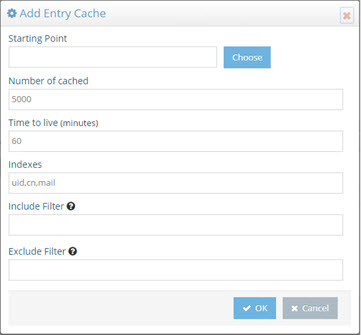
 
Figure 2.2: Entry Cache Settings

**Time to Live**

The amount of time that entries should remain in cache. After the time has been reached, the entry is removed from the cache. The next request for the entry is sent to the underlying data store(s). The result of the request is then stored in the memory cache again. This value is specified in minutes. The default value for this parameter is 60 (1 hour).

**Indexes**

Enter the attribute names in the cache that should be indexed. The values need to be separated with a comma. The attribute names must represent unique values for all entries across the entire cache. You must only index attributes that have unique values, otherwise the response from the cache can be unpredictable. For example, if you indexed the postalCode attribute, your first request with a filter of (postalCode=94947) may return 50 entries (because the query would be issued to and returned from the underlying source). However, your second request would only return 1 entry (because RadiantOne expects to find only one unique entry in the cache that matches a postalCode=94947, and this is typically the last entry that was added to the cache). If this functionality does not meet your needs, you should review the query cache and persistent cache options.

**Include Filter**

Enter a valid LDAP filter here that defines the entries that should be included in the cache. Only entries that match this filter are cached. 

As an alternative approach, you can indicate what entries to exclude by using the Exclude filter described below.

**Exclude Filter**

Enter a valid LDAP filter here that defines the entries that should be excluded from the cache. All entries that match this filter are not cached. 

As an alternative approach, you can indicate what entries to include by using the Include filter described above.

**Number of Cached Entries**

The total number of entries kept in main memory. The entry cache can expand beyond the main memory and the entries are swapped as needed. The default value for this parameter is 5000. This means that up to 5000 most recently used entries are put in the main memory cache. As the number of entries exceeds 5000, they are stored as virtual memory (memory on disk) and swapped as needed. The default value of 5000 is usually sufficient. However, if you would like to increase this number, you must make sure you have enough memory available on your machine and allocated to the RadiantOne Java Virtual Machine (see below for memory size requirements and check the RadiantOne Hardware Sizing Guide for global recommendations).

##### Memory Size Requirements

###### For Entries

As a rule of thumb, you should take the average size of one of your entries and multiply by the number of entries you want to store in main memory. Then multiply this total number (the size for all entries) by 2.5. This gives you the amount of main memory you should allocate to store the entries.

##### For Indexes

>[!note] This value is the total number of pages for each indexed attribute.  The default size is 1000 pages. Which means there are, at most, 1000 index pages for each attribute you have indexed.

For each indexed attribute, the amount of memory consumed per page is calculated by taking the average size of an indexed value x 3 x 64.

You should keep in mind that dn is always indexed (although it doesn’t appear in the index list). Therefore, the dn attribute by itself consumes the following (assuming the dn is an average of 200 bytes in size):
200 x 3 x 64 = 38,400 bytes (approximately 39 KB per index page)

The default of 1000 index pages, consumes about (1000 x 39 KB) 39 MB in memory for the dn attribute.

Now, calculate the amount for each attribute you have indexed and add it to the 39 MB.

For example, if you index the attribute uid, and the average uid is 20 characters, you would have 20x3x64 = 3840 byes (approximately 4 KB per index page).

With 1000 index pages (1000 x 4 KB), about 4 MB in memory is consumed for the uid attribute.

If you have 10 attributes indexed (all on average of 20 characters), the total consumption of memory would be about 40 MB + 39 MB (for the dn attribute) for a total of 79 MB.

### Total Memory Size Requirements

Add entry memory cache requirements and index memory cache requirements together to get the total memory size required for your cache.

Pay attention to the maximum Java virtual memory size for RadiantOne to ensure that you are allocating enough memory. Otherwise, out of memory errors can result. Please see the section on [increasing the JVM size for RadiantOne](07-deployment-architecture.md#setting-the-java-virtual-memory-size-for-the-radiantone-service) for more details.

### Configuring Query Cache

Query cache is sensitive to syntax. To benefit from the query cache, it must be the exact same query (from the same person, ACI, asking for the same information). This type of caching is good for repetitive queries (of the same nature).

Query cache is only applicable on naming contexts that are not configured as persistent cache.

First, enable the Query Memory Cache (requires [Expert Mode](00-preface#expert-mode)).  

1.	On the Main Control Panel > Settings Tab > Front End section > Memory Cache sub-section, on the right side, check the box in the Query Cache section.

2.	Click **Add** in the Query Cache section.

3.	Select a starting point location in the RadiantOne namespace. All queries below this point are cached. 

4.	Enter a Time to Live (in minutes). This is the amount of time that entries should remain in cache. After the time has been reached, the entry is removed from the cache.  The next request for the entry is sent to the underlying data store(s).  The result of the request is then stored in the memory cache again.  This value is specified in minutes. The default is 60 (1 hour).

5.	Click **OK**.

6.	Click **Save** (located in the top right hand corner) to save your settings.

>[!warning] the user and ACI information are also part of the query. This is why it was mentioned above that the query cache is sensitive to syntax.  If User A issues a query, and then User B issued a query asking for the exact same information, this would count as two queries in the Query Cache.**

#### Populating the Memory Cache

##### Entry Cache
The entry memory cache is filled as the RadiantOne service receives queries. The first time the server receives a request for an entry, the underlying data store(s) is queried and the entry is returned. The entry is stored in the entry memory cache. The entry remains in cache for the time specified in the Time to Live setting.

##### Query Cache

The query memory cache is filled as the RadiantOne service receives queries. The first time the server receives a request, the query is added to the query memory cache, and the underlying data store(s) is queried to retrieve the entries. The entries resulting from the query are also stored in the cache.

#### Refreshing the Memory Cache

A time-to-live parameter can be set for both the entry cache and the query cache.  The time starts when the entry/query is added into memory.  Once the time-to-live value is reached, the entry/query is removed from the cache. The next time a query is received for the entry, RadiantOne issues a query to the underlying store(s), retrieves the latest value and the entry is stored in the entry memory cache and/or the query memory cache again.

You also have the option to flush the entire memory cache from the Main Control Panel -> Settings Tab -> Server Front End section -> Memory Cache section (requires [Expert Mode](00-preface#expert-mode)). On the right side, click on the “Flush All” button next to the type of cache you are interested in clearing.


 
Figure 2.3: Memory Cache Settings

### Persistent Cache

Persistent cache is the cache image stored on disk.  With persistent cache, the RadiantOne service can offer a guaranteed level of performance because the underlying data source(s) do not need to be queried and once the server starts, the cache is ready without having to “prime” with an initial set of queries.  Also, you do not need to worry about how quickly the underlying data source can respond.  What is unique about the persistent cache is if the RadiantOne service receives an update for information that is stored in the cache, the underlying data source(s) receives the update, and the persistent cache is refreshed automatically. In addition, you have the option of configuring real-time cache refreshes which automatically update the persistent cache image when data changes directly on the backend sources. For more details, please see [Refreshing the Persistent Cache](#options-for-refreshing-the-persistent-cache).

>[!warning] if you plan on caching (either entry memory cache or persistent cache) the branch in the tree that maps to an LDAP backend, you must list the operational attributes you want to be in the cache as “always requested”. Otherwise, the entry stored in cache would not have these attributes and clients accessing these entries may need them.

#### Disk Space Requirements

Initialization of a persistent cache happens in two phases. The first phase is to create an LDIF formatted file of the cache contents (if you already have an LDIF file, you have the option to use this existing file as opposed to generating a new one). The second phase is to initialize the cache with the LDIF file. After the first phase, RadiantOne prepares the LDIF file to initialize the cache. Therefore, you need to consider at least these two LDIF files and the amount of disk space to store the entries in cache. 

Best practice would be to take four times the size of the LDIF file generated to determine the disk space that is required to initialize the persistent cache. For example, lab tests have shown 50 million entries (1KB or less in size) generates an LDIF file approximately 50 GB in size. So total disk space recommended to create the persistent cache for this example would be 200 GB. See the Hardware Sizing Guide for general recommendations on disk space.

#### Data Statistics

To get statistics about the entries in your view, you can use the LDIFStatistics function of the <RLI_HOME>/bin/advanced/ldif-utils utility. Once you have an LDIF file containing your entries, pass the file name and path to the utility. 

The results include the following statistics about entries (non-group), groups and objectclasses:

```
###### Entries statistics ######
Entry count – number of entries
Max attributes per entry
###### Non-group entry statistics ######
AVG attributes per entry
Max entry size in bytes
AVG entry size in bytes
Max attribute size
AVG attributes size (non-objectclass)
###### Groups statistics ######
Group count – number of group entries
Groups Statistics: [
### Groups SIZE_RANGE_NAME statistics ###
Group entry count
Max members
AVG members
Max entry size in bytes
AVG entry size in bytes
###### ObjectClass Statistics ###### 
### objectclass_name statistics ###
Entry count – number of entries
Max attributes per entry
AVG attributes per entry
Max entry size in bytes
AVG entry size in bytes
Max attribute size
AVG attributes size
RDN Types: [rdn_name]
Entry count per branch: {branch_dn=entrycount_x}, 
The following would be an example of the command and statistics returned.
C:\radiantone\vds\bin\advanced>ldif-utils LDIFStatistics -f "C:\radiantone\vds\vds_server\ldif\export\mydirectory.ldif"
###### Entries statistics ######
Entry count: 10014
Max attributes per entry: 19
###### Non-group entry statistics ######
AVG attributes per entry: 8
Max entry size: 956 bytes
AVG entry size: 813 bytes
Max attribute size: 1
AVG attributes size (non-objectclass): 1

###### Groups statistics ######
Group count: 2
Groups Statistics: [
        ### Groups LESS_THAN_10 statistics ###
        -Group entry count: 1
        -Max members: 2
        -AVG members: 2
        -Max entry size: 578 bytes
        -AVG entry size: 578 bytes,
        ### Groups BETWEEN_1K_AND_10K statistics ###
        -Group entry count: 1
        -Max members: 10000
        -AVG members: 10000
        -Max entry size: 571 KB
        -AVG entry size: 571 KB]
###### ObjectClass Statistics ######
        ### organization statistics ###
        -Entry count: 1
        -Max attributes per entry: 8
        -AVG attributes per entry: 8
        -Max entry size: 403 bytes
        -AVG entry size: 403 bytes
        -Max attribute size: 1
        -AVG attributes size: 1
        -RDN Types: [o]
        -Entry count per branch: {root=1},

        ### groupofuniquenames statistics ###
        -Entry count: 1
        -Max attributes per entry: 9
        -AVG attributes per entry: 9
        -Max entry size: 578 bytes
        -AVG entry size: 578 bytes
        -Max attribute size: 2
        -AVG attributes size: 2
        -RDN Types: [cn]
        -Entry count per branch: {ou=groups,o=companydirectory=1},
        ### organizationalunit statistics ###
        -Entry count: 11
        -Max attributes per entry: 8
        -AVG attributes per entry: 8
        -Max entry size: 468 bytes
        -AVG entry size: 439 bytes
        -Max attribute size: 1
        -AVG attributes size: 1
        -RDN Types: [ou]
        -Entry count per branch: {o=companydirectory=11},
        ### inetorgperson statistics ###
        -Entry count: 10000
        -Max attributes per entry: 19
        -AVG attributes per entry: 19
        -Max entry size: 956 bytes
        -AVG entry size: 814 bytes
        -Max attribute size: 1
        -AVG attributes size: 1
        -RDN Types: [uid]
        -Entry count per branch: {ou=inventory,o=companydirectory=1000, ou=management,o=companydirectory=1000, ou=human resources,o=companydirectory=1000, ou=product development,o=companydirectory=1000, ou=accounting,o=companydirectory=1000, ou=information technology,o=companydirectory=1000, ou=customer service,o=companydirectory=1000, ou=sales,o=companydirectory=1000, ou=quality assurance,o=companydirectory=1000, ou=administration,o=companydirectory=1000},
        ### groupofurls statistics ###
        -Entry count: 1
        -Max attributes per entry: 9
        -AVG attributes per entry: 9
        -Max entry size: 571 KB
        -AVG entry size: 571 KB
        -Max attribute size: 10000
        -AVG attributes size: 10000
        -RDN Types: [cn]
        -Entry count per branch: {ou=groups,o=companydirectory=1}]
Done in 1169ms
```

#### Initializing Persistent Cache

Persistent cache should be initialized during off-peak hours, or during scheduled downtime, since it is a CPU-intensive process and during the initialization queries are delegated to the backend data sources which might not be able to handle the load.

When initializing persistent cache, two settings you should take into consideration are paging and initializing cache from an encrypted file. These options are described in this section.

>[!warning] If you are using real-time refresh, make sure the cache refresh components are stopped before re-initializing or re-indexing a persistent cache.

##### Using Parallel Processing Engine

In some cases, the virtual engine parallel processor (vpp) can be used to speed up the cache image creation while indexing. This option can only be used when initializing persistent cache with the vdsconfig utility, init-pcache command. This is useful when the virtual view to be cached contains many entries and other time-intensive configurations like joins, and computed attributes involving lookups. This option isn’t compatible with views associated with interception scripts. Initializing a view that is incompatible with the -vpp command results in an error that indicates why the view is incompatible. See the RadiantOne Command Line Configuration Guide for details on the init-pcache command.

##### Using Paging

Depending on the complexity of the virtual view, building the persistent cache image can take some time. Since the internal connections used by RadiantOne to build the persistent cache image are subject to the Idle Connection Timeout server setting, the cache initialization process might fail due to the connection being automatically closed by the server. To avoid cache initialization problems, it is recommended to use paging for internal connections.  To use paging:

1.	Navigate to the Main Control Panel -> Settings tab -> Server Front End -> Supported Controls.

2.	On the right, check the option to Enable Paged Results.

3.	Click **Save**.

4.	Navigate to the Main Control Panel > Settings tab > Server Backend > Internal Connections (requires [Expert Mode](00-preface#expert-mode)).

5.	On the right, check the option for Paged Results Control, page size: 1000.

6.	Click **Save**.

##### Supporting Zipped and Encrypted LDIF Files

If you are initializing persistent cache using an existing LDIFZ file, the security key used in RadiantOne (for attribute encryption) where the file was exported must be the same security key value used on the RadiantOne server that you are trying to import the file into.

If you are creating a new LDIF file to initialize the persistent cache, you have the option to use an LDIFZ file which is a zipped and encrypted file format. This ensures that the data to be cached is not stored in clear in files required for the initialization process.

To use this option, you must have an LDIFZ encryption key configured. The security key is defined from the Main Control Panel > Settings Tab > Security > Attribute Encryption section.

Once the security key has been defined, check the option to “Use .ldifz (zipped and secure format).


Figure 2.4: Using LDIFZ File to Initialize Persistent Cache

#### Options for Refreshing the Persistent Cache

There are four categories of events that can invoke a persistent cache refresh. They are:

-	When changes occur through RadiantOne.

-	When changes occur outside of RadiantOne (directly on the backend source).

-	Scheduling a periodic refresh of the persistent cache.

-	Manually triggering a persistent cache refresh.

Each is described below.

##### Changes Occurring Through RadiantOne

If RadiantOne receives an update for an entry that is stored in a persistent cache, the following operations occur:

-	The entry in persistent cache is “locked” pending the update to the underlying source(s).

-	The underlying source(s) receives the update from RadiantOne.

-	Upon successful update of the underlying source(s), RadiantOne updates the entry in the persistent cache.

-	The modified entry is available in the persistent cache.

#### Real Time Cache Refresh Based on Changes Occurring Directly on the Backend Source(s)

When a change happens in the underlying source, connectors capture the change and send it to update the persistent cache.  The connectors are managed by agents built into RadiantOne and changes flow through a message queue for guaranteed message delivery. The real-time refresh process is outlined below. 

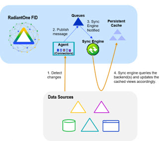
 
Figure 2.5: Persistent Cache Refresh Architecture

Persistent Cache Refresh Agents are started automatically once a persistent cache with real-time refresh is configured. Agents can run on any type of RadiantOne cluster node (follower or leaders) and there is only one agent running at any given time in a RadiantOne cluster. The agent doesn't consume a lot of memory, and they are not CPU-intensive, so there is no point in running multiple processes to distribute connectors on multiple nodes. One agent is enough per cluster and makes things simpler.

This type of refresh is described as “Real-time” in the Main Control Panel > Directory Namespace > Cache settings > Cache Branch > Refresh Settings tab (on the right). This is the recommended approach if a real-time refresh is needed.

##### Periodic Refresh

In certain cases, if you know the data in the backends does not change frequently (e.g. once a day), you may not care about refreshing the persistent cache immediately when a change is detected in the underlying data source. In this case, a periodic refresh can be used.

If you have built your view in either the Context Builder tab or Directory Namespace Tab, you can define the refresh interval after you’ve configured the persistent cache. The option to enable periodic refresh is on the Refresh Settings tab (on the right) for the selected persistent cache node. Once the periodic refresh is enabled, configure the interval using a CRON expression. Click the Assist button if you need help defining the CRON expression.

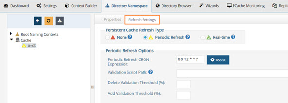
 
Figure 2.6: Periodic Cache Refresh Settings

During each refresh interval, the periodic persistent cache refresh is performed based on the following high-level steps:

1.	RadiantOne generates an LDIF formatted file from the virtual view (bypassing the cache).

>[!warning] If a backend data source is unreachable, RadiantOne attempts to re-connect one more time after waiting 5 seconds. The number of retries is dictated by the maxPeriodicRefreshRetryCount property defined in /radiantone/v1/cluster/config/vds_server.conf in ZooKeeper.**

2.	(Optional) If a [validation threshold](#add-validation-threshold) is defined, RadiantOne determines if the threshold defined has been exceeded. If it has, the persistent cache is not refreshed during this cycle.

3.	(Optional) If a [validation script](#validation-script-path) is defined, RadiantOne invokes the script logic. If the validation script is successful, RadiantOne updates the cache. If the validation script is unsuccessful, RadiantOne does not update the persistent cache during this cycle.

4.	RadiantOne compares the LDIF file generated in step 1 to the current cache image and applies changes to the cache immediately as it goes through the comparison.

The periodic persistent cache refresh activity is logged into <RLI_HOME>/vds_server/logs/periodiccache.log. For details on this log, see the Logging and Troubleshooting Guide.

The rebuild process can be very taxing on your backends, and each time a new image is built you are putting stress on the data sources. This type of cache refresh deployment works well when the data doesn’t change too frequently and the volume of data is relatively small. 

##### Manually Trigger a Persistent Cache Refresh

You can manually initiate a persistent cache refresh that leverages the same methodology as a periodic refresh with the following command (substitute your cached naming context for <pcache naming>).

>[!warning] You can manually trigger a persistent cache refresh with the method described in this section no matter what kind of refresh strategy has been configured (e.g. none, periodic or real-time).**

C:\radiantone\vds\bin>vdsconfig.bat search-vds -dn "action=deltarefreshpcache,<pcache naming>" -filter "(objectclass=*)" -leader

The log containing the refresh actions performed is <RLI_HOME>/vds_server/logs/periodiccache.log.

For more details on the search-vds command, see the RadiantOne Command Line Configuration Guide.

#### Configuring Persistent Cache with Periodic Refresh

Review the section on [periodically refreshing the cache](#periodic-refresh) to ensure the persistent cache is updated to match your needs. If you plan on refreshing the cache image periodically on a defined schedule, this would be the appropriate cache configuration option. This type of caching option leverages the internal RadiantOne Universal Directory storage for the cache image.

To configure persistent cache with Periodic refresh
1.	On the Directory Namespace tab of the Main Control Panel, click the Cache node.

2.	On the right side, browse to the branch in the RadiantOne namespace that you would like to store in persistent cache and click **OK**.

3.	Click **Create Persistent Cache**. The configuration process begins. Once it completes, click **OK** to exit the window.

4.	Click the **Refresh Settings** tab.

5.	Select the Periodic Refresh option.

6.	Enter the [CRON expression](#periodic-refresh-cron-expression) to define the refresh interval.

7.	(Optional) Define a [Validation Script Path](#validation-script-path).

8.	(Optional) Define a [Delete Validation Threshold](#delete-validation-threshold).

9.	(Optional) Define an [Add Validation Threshold](#add-validation-threshold).

10.	Click **Save**.

11.	Click **Initialize** to start the initialization process.

There are two options for initializing the persistent cache: Creating a new LDIF file or initializing from an existing LDIF file. Each is described below.

#### Create an LDIF from a Snapshot

If this is the first time you’ve initialized the persistent cache, then you should choose this option. An LDIF formatted file is generated from the virtual view and then imported into the local RadiantOne Universal Directory store.

**Initialize from an Existing LDIF File**

If you’ve initialized the persistent cache before and the LDIF file was created successfully from the backend source(s) (and the data from the backend(s) has not changed since the generation of the LDIF file), then you can choose to use that existing file. The persisting of the cache occurs in two phases. The first phase generates an LDIF file with the data returned from the queries to the underlying data source(s). The second phase imports the LDIF file into the local RadiantOne Universal Directory store. If there is a failure during the second phase, and you must re-initialize the persistent cache, you have the option to choose the LDIF file (that was already built during the first phase) instead of having to re-generate it (as long as the LDIF file generated successfully). You can click browse and navigate to the location of the LDIF.  The LDIF files generated are in <RLI_HOME>\<instance_name>\ldif\import.

If you have a large data set and generated multiple LDIF files for the purpose of initializing the persistent cache (each containing a subset of what you want to cache), name the files with a suffix of  “_2”, “_3”…etc.  For example, let’s say the initial LDIF file (containing the first subset of data you want to import) is named cacheinit.ldif.  After this file has been imported, the process attempts to find cacheinit_2.ldif, then cacheinit_3.ldif…etc.  Make sure all files are located in the same place so the initialization process can find them.

After you choose to either generate or re-use an LDIF file, click Finish and cache initialization begins. Cache initialization is launched as a task and can be viewed and managed from the Tasks Tab in the Server Control Panel associated with the RadiantOne leader node. Therefore, you do not need to wait for the initialization to finish before exiting the initialization window.

After the persistent cache is initialized, queries are handled locally by the RadiantOne service and no longer be sent to the backend data source(s). For information about properties associated with persistent cache, please see [Persistent Cache Properties](#persistent-cache-properties).

##### Periodic Refresh CRON Expression

If periodic refresh is enabled, you must define the refresh interval in this property. For example, if you want the persistent cache refreshed every day at 12:00 PM, the CRON expression is: 
0 0 12 1/1 * ? *
Click **Assist** if you need help defining the CRON expression.


 
Figure 2.7: CRON Expression Editor

##### Validation Script Path

For details on how the periodic persistent cache refresh process works, see [Periodic Refresh](#periodic-refresh).

You can apply a script to validate the generated LDIF file/image prior to RadiantOne executing the cache refresh process. If the LDIF file (input) doesn’t meet the validation requirements, the persistent cache refresh is aborted for this refresh cycle.

In the Validation Script Path property, you can enter the script name. The type of script should be a shell script (.sh) or batch script (.bat) file. If just a script name is defined (or a relative path and script name), it is assumed the script is in the <RLI_HOME>/vds_server/custom folder. This location is shared across cluster nodes automatically. If an absolute path is defined for this property, this location must be a shared drive/location across all cluster nodes. 

The image validation process takes the generated LDIF file name as an input. This function scans the LDIF file, can make changes if needed, and then returns an exit/error code to indicate whether RadiantOne should proceed with the cache refresh. If the exit code=0, the service continues with the refresh process. If the exit code is not=0, the cache refresh is aborted.

##### Delete Validation Threshold

For details on how the periodic persistent cache refresh process works, see [Periodic Refresh](#periodic-refresh).

You can define a threshold to validate the generated LDIF file/image prior to RadiantOne executing the cache refresh process. The threshold is a percentage of the total entries.

To define a granular threshold for delete operations, indicate the percentage in the Delete Validation Threshold. For example, if Delete Validation Threshold contains a value of 50, it means if the generated LDIF image contains at least 50% fewer entries than the current cache image, the periodic persistent cache refresh is aborted for the current refresh cycle.

If both a [validation script](#validation-script-path) and validation threshold are configured, the threshold is checked first. If the threshold does not invalidate the refresh, the validation script is invoked. If neither a threshold nor a script is configured, RadiantOne compares the generated LDIF file to the current cache image and updates the cache based on the differences between the two.

##### Add Validation Threshold
For details on how the periodic persistent cache refresh process works, see [Periodic Refresh](#periodic-refresh).

You can define a threshold to validate the generated LDIF file/image prior to RadiantOne executing the cache refresh process. The threshold is a percentage of the total entries.

To define a granular threshold for add operations, indicate the percentage in the Add Validation Threshold. For example, if Add Validation Threshold contains a value of 50, it means if the generated LDIF image contains 50% more entries than the current cache image, the periodic persistent cache refresh is aborted for the current refresh cycle.

If both a [validation script](#validation-script-path) and validation threshold are configured, the threshold is checked first. If the threshold does not invalidate the refresh, the validation script is invoked. If neither a threshold nor a script is configured, RadiantOne compares the generated LDIF file to the current cache image and updates the cache based on the differences between the two.

#### Configuring Persistent Cache with Real-Time Refresh 

If you plan on automatically refreshing the persistent cache as changes happen on the backend data sources, this would be the recommended cache configuration option. This type of caching option leverages the RadiantOne Universal Directory storage for the cache image. 

If you choose a real-time refresh strategy, there are two terms you need to become familiar with:

- Cache Dependency – cache dependencies are all objects/views related to the view that is configured for persistent cache.  A cache dependency is used by the cache refresh process to understand all the different objects/views that need to be updated based on changes to the backend sources.

- Cache Refresh Topology – a cache refresh topology is a graphical representation of the flow of data needed to refresh the cache. The topology includes an object/icon that represents the source (the backend object where changes are detected from), the queue (the temporary storage of the message), and the cache destination. Cache refresh topologies can be seen from the Main Control Panel > PCache Monitoring tab.

Cache dependencies and the refresh topology are generated automatically during the cache configuration process.

If you have deployed multiple nodes in a cluster, to configure and initialize the persistent cache, you must be on the current RadiantOne leader node. To find out the leader status of the nodes, go to the Dashboard tab > Overview section in the Main Control Panel and locate the node with a yellow triangle icon. 

To configure persistent cache with real-time refresh:

1.	Go to the Directory Namespace Tab of the Main Control Panel associated with the current RadiantOne leader node.

2.	Click the Cache node.

3.	On the right side, browse to the branch in the RadiantOne namespace that you would like to store in persistent cache and click **OK**.

>[!warning] For proxy views of LDAP backends, you must select the root level to start the cache from. Caching only a sub-container of a proxy view is not supported.

4. Click Create Persistent Cache. The configuration process begins. Once it completes, click OK to exit the window.

5. On the Refresh Settings tab, select the Real-time refresh option.

>[!warning] If your virtual view is joined with other virtual views you must cache the secondary views first. Otherwise, you are unable to configure the real-time refresh and will see the following message. A Diagnostic button is also shown and provides more details about which virtual views require caching.


 	 
Figure 2.8: Caching secondary views message

6. Configure any needed connectors. Please see the section titled [Configuring Source Connectors](#configuring-source-connectors) for steps.

7. Click **Save**.

8. On the Refresh Settings tab, click Initialize to initialize the persistent cache.

There are two options for initializing a persistent cache. Each is described below.

**Create an LDIF File**

If this is the first time you’ve initialized the persistent cache, choose this option. An LDIF formatted file is generated from the virtual view and then imported into the cache.

**Using an Existing LDIF **

If you’ve initialized the persistent cache before and the LDIF file was created successfully from the backend source(s) (and the data from the backend(s) has not changed since the generation of the LDIF file), then you can choose this option to use that existing file. The persisting of the cache occurs in two phases. The first phase generates an LDIF file with the data returned from the queries to the underlying data source(s). The second phase imports the LDIF file into the local RadiantOne Universal Directory store. If there is a failure during the second phase, and you must re-initialize the persistent cache, you have the option to choose the LDIF file (that was already built during the first phase) instead of having to re-generate it (as long as the LDIF file generated successfully). You can click browse and navigate to the location of the LDIF.  The LDIF files generated are in <RLI_HOME>\<instance_name>\ldif\import.

If you have a large data set and generated multiple LDIF files for the purpose of initializing the persistent cache (each containing a subset of what you want to cache), name the files with a suffix of “_2”, “_3”…etc.  For example, let’s say the initial LDIF file (containing the first subset of data you want to import) is named cacheinit.ldif.  After this file has been imported, the process attempts to find cacheinit_2.ldif, then cacheinit_3.ldif…etc.  Make sure all files are located in the same place so the initialization process can find them.

9. Click **OK**. The cache initialization process begins. The cache initialization is performed as a task and can be viewed and managed from the Tasks Tab in the Server Control Panel associated with the RadiantOne leader node. Therefore, you do not need to wait for the initialization to finish before exiting the initialization window.

10. The view(s) is now in the persistent cache. Queries are handled locally by RadiantOne and are no longer sent to the backend data source(s). Real-time cache refresh has been configured. For information about properties associated with persistent cache, please see [Persistent Cache Properties](#persistent-cache-properties).

##### Configuring Source Connectors

Configuring connectors involves deciding how you want to detect changes from your backend(s). By default, all [directory connectors](#directory-connectors) and [custom connectors](#custom-connectors) (only custom connectors included in the RadiantOne install) are configured and started immediately without further configuration. For databases, configure the connector to use the desired change detection mechanism. 

>[!warning] All connectors leverage the connection pooling settings defined from the Main Control Panel > Settings tab. In other words, the connector opens a connection to the data source to pick up changes and keeps the connection open so when the next interval passes a new connection does not need to be created.

### Database Connectors

For database backends (JDBC-accessible), the change detection options are:

- [Changelog](#db-changelog) – This connector type relies on a database table that contains all changes that have occurred on the base tables (that the RadiantOne virtual view is built from). This typically involves having triggers on the base tables that write into the log/changelog table. However, an external process may be used instead of triggers. The connector picks up changes from the changelog table based on a specified interval which is 10 seconds by default. If you need assistance with configuring triggers on the base tables and defining the changelog table, see [Script to Generate Triggers](#create-scripts-to-generate-triggers-and-changelog-table).

- [Timestamp](#db-timestamp) – This connector type has been validated against Oracle, SQL Server, MySQL, MariaDB, PostgreSQL, and Apache Derby. The database table must have a primary key defined for it and an indexed column that contains a timestamp/date value. This value must be maintained and modified accordingly for each record that is updated. 

    For Oracle databases, the timestamp column type must be one of the following: "TIMESTAMP", "DATE", "TIMESTAMP WITH TIME ZONE", "TIMESTAMP WITH LOCAL TIME ZONE". 

   For SQL Server database, the timestamp column type must be one of the following: "SMALLDATETIME", "DATETIME", "DATETIME2"

   For MYSQL or MariaDB databases, the timestamp column type must be one of the following: "TIMESTAMP", "DATETIME" 

    For PostgreSQL databases, the timestamp column type must be one of the following: "TIMESTAMP", "timestamp without time zone” (equivalent to timestamp), “TIMESTAMPTZ”, “timestamp with time zone” (equivalent to timestamptz)

    For Derby databases, the timestamp column type must be: "TIMESTAMP"

    The DB Timestamp connector leverages the timestamp column to determine which records have changed since the last polling interval. This connector type does not detect delete operations. If you have a need to detect and propagate delete operations from the database, you should choose a different connector type like DB Changelog or DB Counter.

- [Counter](#db-counter) - This connector type is supported for any database table that has an indexed column that contains a sequence-based value that is automatically maintained and modified for each record that is added/updated. This column must be one of the following types: BIGINT, DECIMAL, INTEGER, or NUMERIC. If DECIMAL or NUMERIC are used, they should be declared without numbers after the dot: DECIMAL(6,0) not as DECIMAL(6,2). The DB Counter connector leverages this column to determine which records have changed since the last polling interval. This connector type can detect delete operations as long as the table has a dedicated “Change Type” column that indicates one of the following values: insert, update, delete. If the value is empty or something other than insert, update, or delete, an update operation is assumed.

    >[!warning] If none of these options are useable with your database, use a periodic cache refresh instead of real-time.

###### DB Changelog

RadiantOne can generate the SQL scripts which create the configuration needed to support the DB Changelog Connector.  The scripts can be generated in the Main Control Panel or from command line. Both options store the scripts under <RLI_HOME>/work/sql.  The following scripts are generated. 

- create_user.sql – Reminds you to have your DBA manually create a user account to be associated with the connector.

- create_capture.sql - Creates the log table and the triggers on the base table.

- drop_capture.sql - Drops the triggers and the log table. 
Note: for some databases the file is empty.

- drop_user.sql - Drops the log table user and schema. 
<br> Note: for some databases the file is empty.

##### Connector Configuration

This section describes generating and executing the scripts in the Main Control Panel. The following steps assume the database backend has a changelog table that contains changed records that need to be updated in the persistent cache. The changelog table must have two key columns named RLICHANGETYPE and RLICHANGEID. RLICHANGETYPE must indicate insert, update or delete, dictating what type of change was made to the record. RLICHANGEID must be a sequence-based, auto-incremented INTEGER that contains a unique value for each record. The DB Changelog connector uses RLICHANGEID to maintain a cursor to keep track of processed changes.

If you need assistance with configuring triggers on the base tables and defining the changelog table, see [Script to Generate Triggers and Changelog Table](#create-scripts-to-generate-triggers-and-changelog-table).

To configure DB Changelog connector:

>[!note] These instructions assume you want to apply the SQL scripts immediately and you already have a user account in the database to use for the connector.**

1. From the Main Control Panel > Directory Namespace Tab, select the configured persistent cache branch below the Cache node. 
2. On the right side, select the Refresh Settings tab. 
3. When the Real-time refresh type is selected, the connectors appear in a table below. Select a connector and click **Configure**.
4. Select DB Changelog from the Connector Type drop-down list.

5.Enter the log table name using the proper syntax for your database (e.g. <USER>.<TABLE>_LOG). If you used [RadiantOne to generate the SQL scripts](#log-table-name-syntax) for configuring the changelog components in the database, you can view the scripts to see the exact table name. Otherwise, contact your DBA for the log table name.

>[!warning]Change the value for this property only if you are creating the log table manually and the capture connector does not calculate the log table name correctly. Be sure to use the [correct syntax](#log-table-name-syntax) if you change the value.

6. Indicate the user name and password for the connector’s dedicated credentials for connecting to the log table. If you do not have the user name and password, contact your DBA for the credentials. An example is shown below.

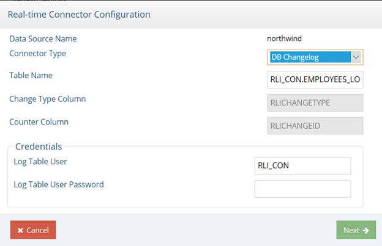
 
Figure 2.9: DB Changelog Connector Configuration

7. Click **Next**.

8. When the connector has been configured, click Next again. 

9. Select **Apply Now**. Click **Next**.

   >[!note] Selecting Apply Now creates and executes the SQL scripts. If you choose to apply later, the scripts are created but not executed.**

10.	Click **Next** and then click **Finish**.

11.	After all connectors are configured, click **Save**.

   >[!note] The Execute DB Configure Scripts and Execute DB Deconfigure Scripts buttons become available when you finish configuring the connector. Execute DB Configure Scripts runs create_capture.sql. Execute DB Deconfigure Scripts runs drop_capture.sql. The location that RadiantOne looks for these scripts in cannot be changed.**

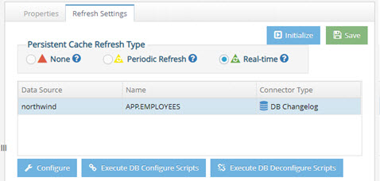

Figure 2.10: The Execute DB Configure and Deconfigure buttons
 
12. Go to Main Control Panel > PCache Monitoring tab to start connectors, configure [connector properties](#connector-properties) and manage and monitor the persistent cache refresh process.

>[!warning] If you make changes to the DB Changelog Connector configuration, restart the connector on the PCache Monitoring tab. Select the icon representing the database backend and click Stop. Then click Start to restart it.

##### Log Table Name Syntax

Proper syntax for the Log Table Name must include both the schema name and the table name separated with a period. Values for this property may contain quote marks as required by the database. In most cases, the double quote mark (“) is used, but some databases use a single quote (‘) or back quote (`). The following examples explain the property’s syntax and usage.

Example 1:
<br>For Postgres, if the schema is rli_con, and log table name is test_log, the property should be one of the following. 
>[!note] by default, Postgres uses lower-case table names. 
rli_con.test_log 
or with optional quoting: 
"rli_con"."test_log"

Example 2:
<br>For SQL Server, if the schema is RLI_CON, and log table name is TEST_LOG, the property should be one of the following.

>[!note] by default, many databases, including SQL Server, use upper-case table names.

```
RLI_CON.TEST_LOG 
```

Or with optional quoting: 

```
"RLI_CON"."TEST_LOG"
```

>[!note] If this name is the same as the log name in the database, leave the property empty.

Example 3:
<br>If schema and/or table name contain mixed-case characters, they must be quoted. For example, if the schema is Rli_Con, and log table name is Test_Log, the property should be as follows.

```
"Rli_con"."Test_log"
```

###### Create Scripts to Generate Triggers and Changelog Table

If the database backend doesn’t have a changelog table, you can use RadiantOne to create one. RadiantOne can generate SQL scripts that a DBA can run on the database backend. These scripts create the needed configuration to support the DB Changelog connector. Use <RLI_HOME>/bin/advanced/create_db_triggers.bat to generate the scripts. The command uses seven arguments (which are described below) and generates the SQL script needed to configure the database to support the DB Changelog connector.

These scripts can be provided to the database backend DBA to review, modify and execute on the database server. Scripts generated using this command cannot be executed in the Main Control Panel.

Example: 

```
create_db_triggers.bat -d sql123 -n sql_server_data_source -t DBO.EMPLOYEES -u rli_con -p rli_con -l EMPLOYEES_LOG
```

Based on this example, the command generates scripts at the following location: <RLI_HOME>/work/sql/sql123/

The RadiantOne data source name is sql_server_data_source (it must exist prior to running the command).

The base table name is EMPLOYEES in the DBO schema.

The log table user to be created is: rli_con with a password of: rli_con

The log table name is EMPLOYEES_LOG. 

The table below outlines the available arguments.

Argument | Description
-|-
-d | The name of the folder where the scripts are saved (e.g. sql1). The name should not contain any special or path characters (e.g. `/,\`). The folder will be created under the <RLI_HOME>/work/sql/ directory. If the location already contains scripts, they are overwritten without warning.
-n | The RadiantOne data source name. The data source contains information (JDBC connection string, user, and password) that is used to connect to the database and read the base table schema. The credentials defined in the data source must have permission to read the base table schema. Note - the data source must exist prior to using the command.
-t | The base table name. The name of the table is used to create the create_capture.sql and the drop_capture.sql scripts. The base table name should be in the form: SCHEMA.TABLE_NAME, for example DBO.CUSTOMERS. SCHEMA and TABLE_NAME should not contain special characters (e.g. [ ]`".), should not be quoted, and should be in the proper upper/lower case (depends on the database type/vendor).
-u | The log table user. The create_user.sql script includes commands to create a log table user/owner and the log table schema (which will have the same name as the log table user). The log table user is created with the password assigned by the -p option.
-l | Specify the log table name instead of using default computation based on full base table name. 
-s | Specify the log table schema name. 

###### DB Timestamp

The following steps assume your backend database table has a primary key defined and contains a timestamp column. The timestamp column name is required for configuring the connector. The timestamp column database types supported are described in the [Database Connectors](#database-connectors) section.

>[!warning] This connector type does not detect delete operations. If you need to detect delete operations from the database, you should choose a different connector type.

1. From the Main Control Panel > Directory Namespace Tab, select the configured persistent cache branch below the Cache node.

2. On the right side, select the Refresh Settings tab.

3. When the Real-time refresh type is selected, the connectors appear in a table below. Select a connector and click **Configure**.

4. Select DB Timestamp from the Connector Type drop-down list.

5. Indicate the column name in the database table that contains the timestamp. An example is shown below.

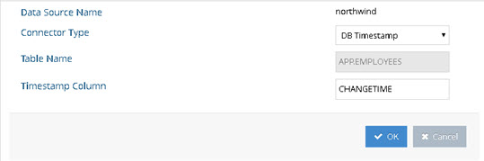
 
Figure 2.11: DB Timestamp Connector Configuration

6. Click **OK**.

7. After all connectors are configured, click **Save**.
8. The connectors are started automatically once they are configured.

9. Go to Main Control Panel > PCache Monitoring tab to configure connector properties and manage and monitor the persistent cache refresh process.

>[!warning] If you need to make changes to the timestamp column name, manually restart the connector and reset the cursor. This can be done from the PCache Monitoring tab. Select the icon representing the database backend and click Stop. Then click Start to restart it. Then click Reset Cursor.**
 	
###### DB Counter

The following steps assume your database backend table contains an indexed column that contains a sequence-based value that is automatically maintained and modified for each record that is added, updated or deleted.  The DB Counter connector uses this column to maintain a cursor to keep track of processed changes. The counter column database types supported are described in the [Database Connectors](#database-connectors) section.

1. From the Main Control Panel > Directory Namespace Tab, select the configured persistent cache branch below the Cache node.

2. On the right side, select the Refresh Settings tab.

3. When the Real-time refresh type is selected, the connectors appear in a table below. Select a connector and click **Configure**.

4. Select DB Counter from the Connector Type drop-down list.

5. Enter a value in the Change Type Column field. This value should be the database table column that contains the information about the type of change (insert, update or delete). If the column doesn’t have a value, an update operation is assumed.

6. Enter the column name in the database table that contains the counter. An example is shown below.


 
Figure 2.12: DB Counter Connector Configuration

7. Click **OK**.

8. After all connectors are configured, click **Save**.

9.  The connectors are started automatically once they are configured.

10. Go to Main Control Panel > PCache Monitoring tab to configure connector properties and manage and monitor the persistent cache refresh process.

>[!warning] If you need to make changes to the Counter Column name, manually restart the connector and reset the cursor. This can be done from the PCache Monitoring tab. Select the icon representing the database backend and click Stop. Then click Start to restart it. Then click Reset Cursor.**

###### DB Kafka

The Apache Kafka Consumer API allows applications to subscribe to one or more topics and process the stream of records produced from them. Persistent cached virtual views from Oracle databases that use the GoldenGate Kafka Handler, can leverage the RadiantOne Kafka capture connector to detect changes for real-time refresh.

>[!note] Oracle GoldenGate messages are the only format currently supported with the Kafka capture connector for persistent cache refresh.

After a persistent cache is configured for the virtual view from the Oracle database, on the Refresh Settings tab, select the Real-time refresh option.

1. Select the object representing the Oracle table/view and click **Configure**.

2. Select Kafka as the Connector Type from the drop-down list. 

3. Enter the Kafka Topic Name (e.g. TopicEmpTable).

4. Enter the full path to the Kafka Consumer Properties File (e.g. C:\Downloads\kafka\consumer.properties).

5. Click **OK**.
6. Click **Save**.


 
Figure 2.13: Kafka Connector for Persistent Cache Refresh

###### Database Connector Failover

This section describes the failover mechanism for the database connectors.

>[!warning] The backend servers must be configured for multi-master replication. Please check the vendor documentation for assistance with configuring replication for your backends.

The database connectors leverage the failover server that has been configured for the data source.  When you configure a data source for your backend database, select a failover database server from the drop-down list. The failover server must be configured as a RadiantOne data source.  See the screen shot below for how to indicate a failover server for the Data Sources from the Main Control Panel.

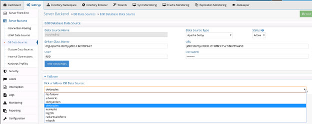
  
Figure 2.14: Configuring Failover Servers for the Backend Database

If a connection cannot be made to the primary server, the connector tries to connect to the failover server configured in the data source. If a connection to both the primary and failover servers fails, the retry count goes up. The connector repeats this process until the value configured in [Max Retries on Connection Error](#max-retries-on-connection-error-for-database-connectors) is reached. There is no automatic failback, meaning once the primary server is back online, the connector doesn’t automatically go back to it.

###### Re-configuring Database Connectors

By re-configuring the connector, you can change the connector type.

The connector can be re-configured from the Main Control Panel > Directory Namespace Tab. Navigate below the Cache node and select the persistent cache branch configured for auto-refresh. On the right side, select the Refresh Settings tab. Select the connector you want to re-configure and choose Configure. 

To change the connector user password, for a connector currently using DB Changelog, enter the user name and password in the Credentials section.


 
Figure 2.15: Editing DB Changelog Connector Configuration

To change the detection mechanism from DB Changelog to another method, select the type from the Connector Type drop-down menu. Enter values as needed for the properties specific to the new connector type and click Next. Click Next in the confirmation window to confirm that you want the connector reconfigured. Click Next to confirm that the connector has been reconfigured. Click Finish.

###### Directory Connectors

For directory backends (LDAP-accessible including RadiantOne Universal Directory and Active Directory), the default connectors are configured and started automatically. Go to Main Control Panel > PCache Monitoring tab to configure connector properties and manage and monitor the persistent cache refresh process.

>[!warning] If you are using a persistent cache on a proxy view of a local RadiantOne Universal Director store, or a nested persistent cache view (a cached view used in another cached view), the connector type is noted as HDAP Trigger. This is a special trigger mechanism that publishes the changes directly into the queue to automatically invoke the refresh to all associated persistent cache layers. This change detection mechanism doesn’t require a connector process (or agents). If a RadiantOne service is virtualizing an external (non-local) RadiantOne Universal Directory store, and a persistent cache is configured for the view, this is considered an “LDAP backend” and the refresh connector can be configured for either changelog or persistent search (whatever is enabled/supported on the remote RadiantOne server) as described below.

###### LDAP Directories

For LDAP backends that support both Changelog and Persistent Search, you can configure the connector from the Main Control Panel -> Directory Namespace Tab. Navigate below the Cache node and select the persistent cache branch configured for auto-refresh. On the right side, select the Refresh Settings tab.  Select the connector you want to configure and choose Configure. Choose either the LDAP option (for Changelog) or Persistent Search and click OK.

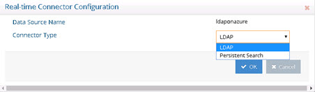
 
Figure 2.16: LDAP Directory Connector Types

**Changelog** - the connector leverages a changelog that has been enabled on the backend directory. The connector picks up changes from the cn=changelog naming context based on a polling interval. The changelog must be enabled in the backend directory. Please check with your directory vendor for instructions on how to enable the changelog.

**Persistent Search** - Any LDAP directory that offers a persistent search mechanism can use the Persistent Search connector type.  Novell eDirectory is an example of an LDAP source that supports persistent search.  Others include Red Hat Directory, IBM TDS, RadiantOne Universal Directory and CA Directory. The connector issues a persistent search and gets notified by the directory server when information changes. If the connector is shut down (either deliberately or due to failure), the delete operations that occurred in the directory are lost.  Once the connector is back online there is no way to detect the delete operations that occurred while it was down.  The only exception to this is for IBM TDS directories. It stores deleted entries and the capture connector is able to read them, and based on timestamp, determine if the change occurred while the connector was offline.

###### Active Directory

There are three change detection mechanisms: USNChanged, DirSync and Hybrid. If you are virtualizing and detecting changes from a Global Catalog, then you must use the USNChanged changed connector because the DirSync and Hybrid connectors cannot detect change events on sub-domains.

The flowchart below helps to decide which change detection mechanism to use.
 
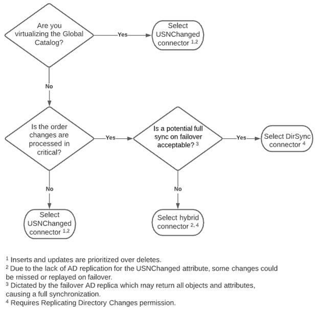

Figure 2.17: Selecting a Active Directory Change Detection  Mechanism

**The Active Directory DirSync** capture connector retrieves changes that occur to entries by passing a cookie that identifies the directory state at the time of the previous DirSync search. The first time the DirSync capture connector is started, it stores a cookie in a cursor file. At the next polling interval, the connector performs a DirSync search to detect changes by sending the current cookie. To use the DirSync control, the Bind DN connecting to the directory must have the DS-Replication-Get-Changes extended right, which can be enabled with the “Replicating Directory Changes” permission, on the root of the partition being monitored. By default, this right is assigned to the Administrator and LocalSystem accounts on domain controllers.

>[!warning] to detect delete events, the service account used by RadiantOne to connect to the backend Active Directory (configured in the connection string of the RadiantOne data source) must have permissions to search the tombstone objects. Usually, a member of the Administrators group is sufficient. However, some Active Directory servers may require a member of the Domain Admins group. Check with your Active Directory administrator to determine the appropriate credentials required.

>[!warning]If you are virtualizing and detecting changes from a Global Catalog, then you must use the Active Directory USNChanged changed connector because the DirSync connector cannot detect change events on sub-domains.

The Active Directory USNChanged capture connector keeps track of changes based on the uSNChanged attribute for the entry.  Based on a configured polling interval, the connector connects with the user and password configured in the connection string/data source and checks the list of changes stored by Active Directory.  The connector internally maintains the last processed change number (uSNChanged value) and this allows for the recovery of all changes that occur even if the connector is down (deliberately or due to failure).

If capturing the sequence of events is critical, use the DirSync connector instead of USNChanged because it processes events in the order in which they occur instead of prioritizing and processing inserts and updates before deletes.

By default, the connector is set to DirSync. To change, select the connector in the table and click Configure. Then select the desired change detection method from the drop-down list.

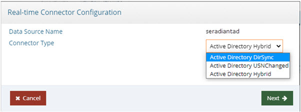
 
Figure 2.18: Active Directory Connector Type Configuration

The Active Directory hybrid capture connector uses a combination of the uSNChanged and DirSync change detection mechanisms. The first time the connector starts, it gets a new cookie and the highest uSNchanged number. When the connector gets a new change (modify or delete), it makes an additional search using the DN of the entry and fetches the entry from AD. The fetched entry contains the uSNChanged attribute, so the connector updates the cursor values for both for the cookie and the last processed uSNchanged number.

>[!warning] If you are virtualizing and detecting changes from a Global Catalog, then you must use the Active Directory USNChanged changed connector because the Hybrid connector cannot detect change events on sub-domains.

When the connector restarts, uSNChanged detection catches the entries that have been modified or deleted while the connector was stopped. The LDAP search uses the last processed uSNChanged number to catch up. After the connector processes all entries, it requests a new cookie from Active Directory (not from the cursor) and switches to DirSync change detection. 

**RadiantOne Universal Directory Stores**

If you are using a persistent cache on a proxy view of a local RadiantOne Universal Directory store, or a nested persistent cache view (a cached view used in another cached view), the connector type is noted as HDAP (trigger) automatically and cannot be changed. This is a special trigger mechanism that publishes changes directly into the queue to invoke the persistent cache refresh. 


 
Figure 2.19: HDAP Trigger Connector Type

[Connector properties](#connector-properties) can be edited from the Main Control Panel > PCache Monitoring tab. Click the icon representing the source in the topology to display the configuration section and view/edit properties.


 
Figure 2.19: Connector Properties

**Directory Connector Failover**

This section describes the failover mechanism for the LDAP, Persistent Search and Active Directory connectors.
 	
>[!warning] The backend servers must be configured for multi-master replication. Please check the vendor documentation for assistance with configuring replication for your backends.

The directory connectors leverage the failover servers that have been configured for the data source.  When you configure a data source for your backend directory, you need to indicate the list of failover servers in order of priority. When the connector fails over, it uses the failover servers in the order they are listed. See the screen shot below for how to indicate a failover server for the Data Sources from the Main Control Panel.


  
Figure 2.21: Configuring Failover Servers for the Backend Directory

If a connection cannot be made to the primary server and the maximum number of retry attempts has been exhausted, the connector connects to the failover servers in the order they are listed. There is no automatic failback, meaning once the primary server is back online, the connector doesn’t automatically go back to it.

This failover mechanism is supported for Active Directory, OpenDJ, Oracle Directory Server Enterprise Edition (Sun Directory v7), Oracle Unified Directory (OUD). In addition, any LDAP directory implementing cn=changelog and replicationCSN attribute or the persistent search control is also supported.

>[!warning] When the Active Directory DirSync connector fails over to another DC replica, the current cursor (cookie) is used. The connector may receive all objects and attributes from the replica instead of just the delta from its last request. Therefore, you may notice the number of entries published by the connector is more than you were expecting. This behavior is dictated by the Active Directory server and is out of the control of the connector. Keep this in mind when you define the Max Retries and Retry Intervals for the connector properties. The smaller the numbers of retries, the higher the chance the connector will fail over and possibly receive all objects and attributes (a full sync) from the domain controller.

For the Active Directory USNChanged connector, the failover logic leverages the Active Directory replication vectors [replUpToDateVector], and the failover servers configured at the level of the RadiantOne data source associated with Active Directory, to determine which server(s) the connector switches to in case of failure. Since the replication vector contains all domains, in addition to some possibly retired domains, the connector narrows down the list of possible failover candidates to only the ones listed as failover servers in the RadiantOne data source associated with the Active Directory backend. If there are no failover server defined for the data source, all domains in the replication vector are possible candidates for failover.

>[!warning] when defining the RadiantOne data source associated with Active Directory, do not use Host Discovery or Load Balancers. You must use the fully qualified machine names for the primary server and failover servers. Do not use IP addresses. Also, it is highly recommended that you list your desired failover servers at the level of the data source. Not only does this make the failover logic more efficient, but it also avoids delays in synchronization.

[replUpToDateVector] definition: The non-replicated attribute replUpToDateVector is an optional attribute on the naming context root of every naming context replica. If this vector is unavailable, the connector is suspended.

The ReplUpToDateVector type is a tuple with the following fields:

-	uuidDsa: The invocation ID of the DC that assigned usnHighPropUpdate.

-	usnHighPropUpdate: A USN at which an update was applied on the DC identified by uuidDsa.

-	timeLastSyncSuccess: The time at which the last successful replication occurred from the DC identified by uuidDsa; for replication latency reporting only.

[replUpToDateVector] example: 

01ca6e90-7d20-4f9c-ba7b-823a72fc459e @ USN 2210490 @ Time 2005-08-21 15:54:21

1d9bb4b6-054a-440c-aedf-7a3f28837e7f @ USN 26245013 @ Time 2007-02-27 10:17:33

24980c9d-39fa-44d7-a153-c0c5c27f0577 @ USN 4606302 @ Time 2006-08-20 23:33:09

At run-time, the connector retrieves the entire list of servers defined in the replication vector and reduces the number of possible failover candidates based on failover servers defined in the RadiantOne data source. The list of potential failover servers is stored at each polling interval. When the current server fails, the connector decides to switch to the closest candidate by selecting the server with the maximum timestamp from the up-to-dateness vector. The capture connector’s cursor will be assigned the value from the up-to-dateness vector for the failover server. If the closest candidate fails as well, the connector tries with a second closest candidate and so on.

>[!warning] Due to the lack of Active Directory replication for the USNChanged attribute, some changes could be missed or replayed on failover.

For the AD Hybrid connector, the failover process starts when the number of exceptions exceeds either the Maximum Retries on Error or Maximum Retries on Connection Error value. The failover servers are specified in the data source associated with Active Directory. The Active Directory up-to-date vector is used to determine the failover server and the value of the new cursor. If the up-to-date vector is unavailable from the current server, failover is not possible. If this happens, verify that AD replication is correctly configured. After the failover server is found, uSNChanged detection catches the entries that have been modified or deleted since the connector’s failure. The LDAP search uses the last processed uSNChanged number to catch up. 

>[!warning] Due to the lack of Active Directory replication for the USNChanged attribute, some changes could be missed or replayed on failover.

After the connector processes all entries, it requests a new cookie from Active Directory and switches to DirSync change detection.

###### Custom Connectors

The following custom data sources support Real-time persistent cache refresh. For all other custom data sources, use a [periodic cache refresh](#periodic-refresh). 

-	Any source that supports SCIM v1 or v2 (e.g. scimclient and scimclient2 custom data sources)

-	Azure Active Directory (e.g. default mgraph custom data source)

-	Okta Universal Directory (e.g. default oktaclient custom data source)

The custom connectors are configured and started automatically. Go to Main Control Panel > PCache Monitoring tab to configure [connector properties](#connector-properties) and manage and monitor the persistent cache refresh process. Click the icon representing the custom data source in the topology to display the configuration section and view/edit properties.

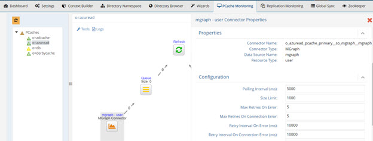
 
Figure 2.22: Custom Connector Properties

Custom connectors don’t have built-in failover logic. The web service target must handle failover and this is typically achieved with a web server/HTTP load balancer.

###### Connector Properties

The following properties are for real-time persistent cache refresh connectors. Not all properties are applicable for every type of backend. The description indicates the type of backend the property is used for.

Property | Description
-|-
Polling Interval | This property indicates the amount of time (in milliseconds) the connector should wait before querying the source to check for changes. <br> This property is applicable to all connectors except HDAP triggers. The default value is 10,000 ms (10 seconds).
Size Limit | This property indicates the number of entries the connector collects from the source in a single request. However, even if the connector picks up multiple entries, they are processed and published to the queue one at a time. <br> This property is applicable to all connectors except HDAP triggers. The default value is 1000.
Log Level | Log Level – OFF: Used to turn logging off. <br> Log level – FATAL: Severe errors that cause premature termination. <br> Log level – ERROR: Other runtime errors or unexpected conditions. <br> Log level – WARN: Use of deprecated APIs, poor use of API. <br> Log level – INFO: Interesting runtime events. <br> Log level – DEBUG: Detailed information on the flow through the system. <br> Log level – TRACE: Most detailed information. <br> Log location: <br> <RLI_HOME>\logs\sync_agent\<naming_context>__<baseDN>__<data_source>\connector.log <br> This property is applicable to all connectors except HDAP triggers. The default value is INFO.
Max Retries On Error | If the connector is unable to connect to the source to pick up changes for any reason other than a connection error, it tries to reconnect. Maximum Retries on Error is the total number of times the connector tries reconnecting. The frequency of the reconnect attempt is based on the Retry Interval on Error property. After all attempts have been tried, the connector failover logic is triggered. If there are no backends available to connect to, the agent automatically redeploys the connector until a connection to the backend can be made.<br> This property is applicable to all connectors except HDAP triggers. The default value is 5.
Retry Interval on Error | Used in conjunction with the Max Retries on Error property. This is the amount of time (in milliseconds) the connector waits before it attempts to pick up changes from the source after an error has occurred.<br> This property is applicable to all connectors except HDAP triggers. The default value is 10,000 ms (10 seconds).
Max Retries on Connection Error | For Database Connectors - If the connector is unable to connect to the primary backend server, it tries to connect to the failover server. If the connector cannot connect to the primary or failover servers because of a connection error, it tries to connect again later. Maximum Retries on Connection Error is the total number of times the connector tries reconnecting. A failed attempt to connect to both the primary and failover server is considered a single retry. The frequency of the reconnect attempt is based on the Retry Interval on Connection Error property. If there are no backends available to connect to, the agent automatically redeploys the connector until a connection to the backend can be made.<br>For Directory Connectors - If the connector is unable to connect to the primary backend server because of a connection error, it tries to connect again later. Maximum Retries on Connection Error is the total number of times the connector tries reconnecting. The frequency of the reconnect attempt is based on the Retry Interval on Connection Error property. After all attempts have been tried, the connector failover logic is triggered. If there are no backends available to connect to, the agent automatically redeploys the connector until a connection to the backend can be made.<br> This property is applicable to all connectors except HDAP triggers. The default value is 5.
Retry Interval on Connection Error | Used in conjunction with the Max Retries on Connection Error property. This is the amount of time (in milliseconds) the connector waits before trying to establish a connection to the source if there was a connection problem during the previous attempt. <br> This property is applicable to all connectors except HDAP triggers. The default value is 10,000 ms (10 seconds).
LDAP Filter | To further condition the entries that are published, you can indicate the desired criteria in the LDAP Filter property. This is a post filter, used to qualify which entries are published by the connector. You must enter a valid LDAP filter in the property.<br>  This property can be used to avoid publishing unwanted information.<br> If a captured entry matches the criteria indicated in the LDAP filter property, it is published by the connector. If it doesn’t, the entry is not published. Information about the skipped entries is in the connector log (with log level set to DEBUG). <br> If the captured change type is delete, and not enough information is known about the entry, the LDAP filter is not used and the entry is published by the connector. For example, if the LDAP filter property contained a value of (l=Novato) and the captured entry did not contain an “l” attribute, the LDAP filter is not applied and the entry is published. <br> If the captured change type is not delete (e.g. insert, update, move…etc.), and not enough information is known about the entry, the LDAP filter is still used and the entry is not published. For example, if the LDAP filter property contained a value of (l=Novato) and the captured entry did not contain an “l” attribute, the LDAP filter is still applied and the entry is not published by the connector.<br> This property is only applicable to Active Directory, LDAP and Persistent Search connectors. The default value is blank (no specific filter).<br> This property also plays a role in recovering changes that happen while a connector is stopped.  The LDAP filter is added to the (internal) default filter used to further condition the entries to capture. For example, if the "LDAP Filter" property = <br> (&#124;(objectclass=myProvider)(objectclass=myPerson)(objectclass=mySubscriber)), then, the following LDAP filter is used by the connector to capture changes that were missed while the connector was stopped:<br>(&(&#124;(modifyTimestamp>=20211014212817.215Z)(createTimestamp>=20211014212817.215Z))(&#124;(objectclass=myProvider)(objectclass=myPerson)(objectclass=mySubscriber))) <br> **Note - If a change is made to this property while the connector is running, it must be restarted for the new value to take effect.**
Excluded Branches | To further condition the entries that are published, you can indicate branch(es) to exclude. In the Excluded Branches property, enter one or more suffixes associated with entries that should not be published in the message by the connector. Click “Enter” to accept the value and to be able to enter another suffix.  You can use the “x” next to the suffix to remove it.<br> 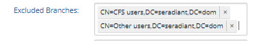 <br> If the changed entry DN contains a suffix that matches the excluded branches value, or is a change in the exact entry that is listed (e.g. CN=CFS users,DC=seradiant,DC=dom), this entry is not published by the connector. Otherwise, the entry is published. This can avoid publishing unwanted information.<br>**Note – if both included and excluded branches are used, an entry must satisfy the conditions defined in both settings to be included in the message. The included branches condition(s) is checked first. <br> If you set this value using the vdsconfig command line utility on Windows, separate the branches with a comma. E.g. C:\radiantone\vds\bin>vdsconfig.bat set-connector-property -connectorname o_sead_pcache_proxy__dc_seradiant_dc_dom__seradiantad -propertyid excludedBranches <br> -propertyvalue “[\"cn=users,dc=seradiant,dc=dom\",\"cn=domain groups,dc=seradiant,dc=dom\"]”** <br> This property is only applicable to Active Directory, LDAP and Persistent Search connectors. The default value is blank (no excluded branches). <br> If a change is made to this property while the connector is running, the new value is taken into account once the connector re-initializes (happens automatically every 20 seconds). 
Included Branches | To further condition the entries that are published, you can indicate branch(es) to include. In the Included Branches property, enter one or more suffixes associated with entries that should be published by the connector. Click “Enter” to accept the value and to be able to enter another suffix.  You can use the “x” next to the suffix to remove it. <br> 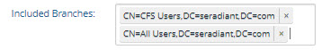 <br> If the changed entry DN contains a suffix that matches the included branches value, or is a change in the exact entry that is listed (e.g. CN=All Users,DC=seradiant,DC=com), this entry is published by the connector. Otherwise, the entry is not published. This can avoid publishing unwanted information. <br> **Note - if both included and excluded branches are used, an entry must satisfy the conditions defined in both settings to be included in the message. The included branches condition(s) is checked first. <br> If you set this value using the vdsconfig command line utility on Windows, separate the branches with a comma. E.g. C:\radiantone\vds\bin>vdsconfig.bat set-connector-property -connectorname o_sead_pcache_proxy__dc_seradiant_dc_dom__seradiantad -propertyid includedBranches -propertyvalue “[\"cn=users,dc=seradiant,dc=dom\",\"cn=domain groups,dc=seradiant,dc=dom\"]”** <br> This property is only applicable to Active Directory, LDAP and Persistent Search connectors. The default value is blank (no included branches). <br> If a change is made to this property while the connector is running, the new value is taken into account once the connector re-initializes (happens automatically every 20 seconds).
SQL Filter | SQL filter is a post filter used to evaluate entries captured by the connector. Only changes that match the filter are published by the connector. <br>A SQL filter is either a single expression or several single expressions joined by binary operators and brackets ( ). Possible binary operators are: <br>-	AND <br> - OR <br> -NOT <br> Some examples of valid SQL Filters are: <br>- ID='5' <br> - ID='5' AND NAME='ALLEN' <br> -	ID='5' AND NAME='ALLEN' OR CITY='SAN FRANCISCO' <br> -	ID='5' AND (NAME='ALLEN' OR CITY='SAN FRANCISCO') <br> - NAME LIKE 'AL%' <br> -	NAME LIKE 'ALLE_' <br> If the SQL Filter syntax entered into the property is not correct, an error is logged by the connector and it continues working without applying the SQL Filter (all changes are published). <br> This property is only applicable for the DB Changelog, DB Counter, and DB Timestamp connectors. The default value is blank (no specific filter).
Force Sequential Counters (true/false) | This property accepts a value of true or false and dictates how the connector treats entries it picks up from the LOG table that have non-sequential change IDs. The default is true meaning that if the connector detects a non-sequential change ID for an entry in the LOG table, it behaves as if there is an error (non-connection error) and the retry logic based on the Max Retries on Error and Retry Interval on Error properties takes effect. Sometimes rows in the log table are not written in the order of the change ID, and if the connector doesn’t wait for the entries to have sequential IDs, some changes could be missed. The connector waits for the length of time specified in the Retry Interval on Error property and then tries to get the changed entries in the database again. After the maximum number of retries (indicated in the Max Retries on Error property) is exhausted, if it still detects non-sequential change IDs, the connector stops. Set “Force Sequential Counters” to false before restarting the connector to have the connector ignore non-sequential change IDs. <br> If the connector should ignore non-sequential change IDs, and process all changes immediately, set the property to false.<br> This property is only applicable to the DB Changelog and DB Counter connectors. The default value is true.
Processing Delay | This property can be used if there is a need for a delay in the processing of changes by the connector. For example, if there are two or more processes that update the source table at the same time, and they take about 2 minutes each to run, the processing delay can be set at anywhere between 4-6 minutes. This delays the processing and makes sure the connector captures all changes coming from both processes. <br> The property value is in seconds, and the default value is 0. If the value is set to <=0, it means that the property is ignored by the connector. If the value is set to be more than 0, then only the entries between last_cursor and current_time – processing_delay are processed by the connector. If an invalid, non-numeric value is set for this property, the connector stops. <br> This property is only applicable to the DB Timestamp connector.
Skip catch-up process (true/false) | If this option is set to false, when the connector starts, it tries to pick up all changes that happened since the last time it successfully processed any changes (this information is maintained in the connector’s cursor file). This is based on changenumber. If this option is set to true, the connector sends out only the changes that happen after it has started. All changes that happened while the connector was stopped are ignored. <br> The property is applicable to the Persistent Search connector only. The default value is false.
Switch to Primary Server (in Polling Intervals)	| This option, working in conjunction with the Polling Interval property, allows you to configure how often, if at all, the connector attempts to switch back to the primary server after failover. To configure the connector to attempt to switch to the primary server, set Switch to Primary Server to a value of 4 or greater. You can set the value to less than 4, but attempting to connect back to the primary server can be time consuming and therefore not recommended to do frequently. For example, if this value is set to 1, the connector makes an attempt every polling interval. If the Switch to Primary Server value is 3, the connector makes an attempt every third polling interval. <br> To disable attempts to reconnect to the primary server, set this value to zero. This is the default value. <br> Changes made to this property’s value while the connector is running are immediately taken into account. When the connector starts or restarts and the property value is 1 or higher, the connector attempts to switch to the primary server immediately. <br> This property is applicable to the LDAP changelog connectors only.
Failover Algorithm [1-4] | This option is relevant for the LDAP changelog connector type.<br> When a failover happens, the changelog capture connector attempts to find a new cursor. Since this process is inexact, and changenumber sequence can vary across some replica servers, some events may be replayed or lost. The changelog connector maintains a cursor that indicates information related to the last change processed by the connector along with information about possible replica servers in case failover is needed. During failover, the connector searches the changelog of the replica servers and determines minimum and maximum changenumbers across them. Assume that the last processed changenumber stored by the connector is 100 and there are 2 replica servers defined for the backend. During failover, the connector determines the current changenumbers for each of the replicas by searching their changelogs. Assume that replica 1 has changenumber 99 and replica 2 has changenumber 97. When the connector needs to failover, it must decide whether to start processing changes using changenumber 100 (its current last processed change), 97 (changenumber from replica 2), or 99 (changenumber from replica 1). <br> The Failover Algorithm property allows you to determine how the cursor value gets set during failover, and ultimately determine the quantity of events that are replayed. The property supports values between 1 and 4. The meaning of each is outlined in the table below. <br> 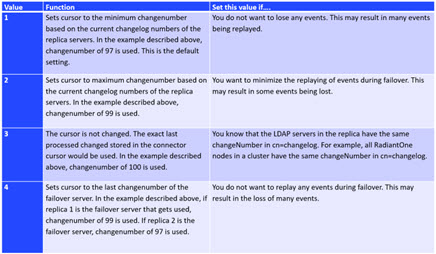
 
###### Resetting Connector Cursor – Detect New Only

Capture connectors use a cursor to maintain information about the last processed changes. This allows the connectors to capture only changes that have happened since the last time they checked for changes. When the real-time persistent cache refresh connectors start, they automatically attempt to capture all changes that have happened since the last time they checked.  If the real-time persistent cache refresh process has been stopped for an extended period of time, you might not want them to attempt to capture all changes since the last time they checked. In this case, you can reset the cursor for the connector. From the Main Control Panel > PCache Monitoring tab, select the real-time refresh topology and the topology displays. Click the icon representing the capture connector and the Runtime details are displayed on the right. Click **Reset Cursor** to clear the cursor value and trigger the connector to behave as if it is the first time connecting to the source to collect changes.

#### Persistent Cache Properties

Once a persistent cache is configured, properties can be managed from the Main Control Panel > Directory Namespace tab > Cache node. Select the configured persistent cache branch and the properties are available on the right.

##### Non-indexed Attributes

If the Indexed Attributes list is empty, all attributes are indexed by default (except binary ones). Also, the following “internal” ones won’t be indexed either: "creatorsName", "createTimestamp", "modifiersName", "modifyTimestamp", "cacheCreatorsName", "cacheCreateTimestamp", "cacheModifiersName", "cacheModifyTimestamp", "uuid", "vdsSyncState", "vdsSyncHist", "ds-sync-generation-id", "ds-sync-state", "ds-sync-hist", "vdsSyncCursor", "entryUUID", "userpassword”. Any additional attributes that you do not want indexed should be added to the Non Indexed Attributes list on the Properties tab for the selected persistent cache branch.

If you change the non-indexed attributes, you must re-build the index. You can do this from the Properties tab by clicking **Re-build Index**.

##### Storage Location

The default location for persistent cache data files is <RLI_HOME>\vds_server\data. To tune the local disk load, you can specify a different location on the file system. To define a storage location, follow the steps below.

1.	Deactivate the persistent cache store by unchecking the Active checkbox and click **Save**. 

2.	Click **Yes** to apply the change to the server.

3.	Enter the full path in the Storage Location parameter. 

4.	Click **Save** and then **Yes** to apply the change to the server. 

5.	Check **Active**. 

6.	Click **Save** and then **Yes** to apply the change to the server.

>[!warning] any data in the default location is lost if the storage location is changed. If you have data in the existing location that you want to keep, export it to an LDIF file and after the storage location is changed, import this LDIF file.

If RadiantOne is deployed in a cluster, the value of the storage location parameter is also assigned to all other nodes. The drive location indicated in the value must exist on the file system of each node. The nodes cannot leverage a single shared drive.

##### Sorted Attributes

This is a comma-separated list of attributes to be used in association with Virtual List Views (VLV) or sort control configured for RadiantOne. These sorted indexes are managed internally in the persistent cache and kept optimized for sorting. They are required if you need to sort the search result or to execute a VLV query on the persistent cache branch.

If you need to support VLV, the VLV/Sort control must be enabled in RadiantOne. For details on this control, please see the RadiantOne System Administration Guide.

If you change the sorted attributes, you must re-build the index. You can do this from the Properties tab by clicking **Re-build Index**.

##### Encrypted Attributes

Attribute encryption protects sensitive data while it is stored in RadiantOne. You can specify that certain attributes of an entry are stored in an encrypted format. This prevents data from being readable while stored in persistent cache, backup files, and exported LDIF files. Attribute values are encrypted before they are stored in persistent cache, and decrypted before being returned to the client, as long as the client is authorized to read the attribute (based on ACLs defined in RadiantOne), is connected to the RadiantOne service via SSL, and not a member of the special group containing members not allowed to get these attributes (e.g. cn=ClearAttributesOnly,cn=globalgroups,cn=config). For details on this special group, please see the RadiantOne System Administration Guide.

>[!warning] Define a security encryption key from the Main Control Panel > Settings Tab > Security section > Attribute Encryption prior to configuring encrypted attributes. For steps on defining key generation, see the RadiantOne System Administration Guide.

On the Properties Tab for the selected persistent cache, enter a comma-separated list of attributes to store encrypted in the Encrypted Attributes property. Attributes listed in the Encrypted Attributes property are added to the Non-indexed attribute list by default. This means these attributes are not searchable by default. Indexing encrypted attributes is generally not advised as the index itself is less secure than the attribute stored in the persistent cache. However, if you must be able to search on the encrypted attribute value, it must be indexed. Only “exact match/equality” index is supported for encrypted attributes. To make an encrypted attribute searchable, remove the attribute from the list of nonindexed attributes and then click **Re-build Index**.

##### Extension Attributes

Extension Attributes are new attributes (meaning these attributes don’t exist anywhere yet) that are associated with a cached virtual entry. This is primarily used to accommodate the storage of application-specific attributes that you want to store locally as opposed to the backend(s) you are virtualizing. Extension attributes should be used as an alternative to Extended Joins in scenarios where the virtual view is stored in persistent cache and then needs replicated out to RadiantOne Universal Directory stores in other clusters.

Extension attributes are stored locally and RadiantOne handles the lifecycle of these attributes accordingly.  Once a persistent cache is defined, list the attribute names (comma-separated) in the Extension Attributes property. The attribute names must be unique and not overlap with attributes coming from and being cached from existing backends. The example below has an extension attribute named lastLogin. Applications can write to this attribute and RadiantOne handles the write locally without delegating anything to the backend. 

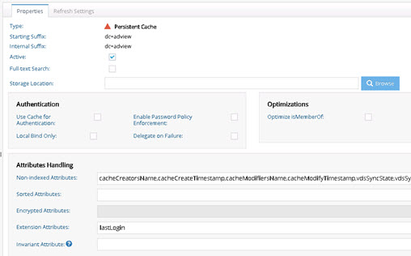

Figure 2.23: Extension Attributes for Persistent Cache

For consistency of the RadiantOne LDAP schema, define the extension attributes as part of the schema, generally associated with an auxiliary object class. For details on extending the schema, see the RadiantOne System Administration Guide.

Extension Attributes are replicated to other clusters in [deployment scenarios](07-deployment-architecture#backends-inaccessible-by-all-sites) where inter-cluster replication is enabled and a replica of a persistent cache is maintained as a RadiantOne Universal Directory store in the target cluster(s).

When using extension attributes for cached virtual views of LDAP directory backends, you must configure invariant attribute(s). See the following section for more details.

##### Invariant Attributes

To guarantee extension attributes are linked to their respective underlying entries and moved properly should modRDN/modDN events occur in the backend source, invariant attribute(s) must be defined. The invariant attribute is the unique identifier in the backend directory. Below are some invariant attributes used in common LDAP directories.

-	objectGUID (Active Directory)

-	entryUUID (Oracle Unified Directory, OpenDJ, unboundID) 

-	nsUniqueID (Sun/ODSEE)

-	ibm-entryUUID (IBM)

-	UUID (RadiantOne Universal Directory)

For the example shown below, the persistent cached view is from an Active Directory backend. RadiantOne manages the lifecycle of the attribute named lastLogin and this attribute is stored directly in the cache. The invariant attribute is set to objectGUID which is the unique identifier for the users in the backend Active Directory. If the entry in the backend is moved, the invariant attribute ensures RadiantOne handles the move of the associated cached extension attributes properly.


 
Figure 2.24: Invariant Attribute for Persistent Cache

##### Inter-cluster Replication

This option should be enabled if you want to support replication between this persistent cache branch and a RadiantOne Universal Directory store in a different cluster. 

If inter-cluster replication is enabled, a replication journal is used to store changes that happen on the persistent cache branch.  The replication journal is associated with the default LDAP data source defined as replicationjournal and root naming context named cn=replicationjournal. The RadiantOne leader node in the cluster associated with the persistent cache, publishes changes into the replication journal. The RadiantOne leader nodes in all other clusters (that are configured for inter-cluster replication) pick up changes from the replication journal to update their local replica. Persistent caches usually only publish changes into the replication journal (for other RadiantOne Universal Directory replicas in other clusters). There are some cases where persistent cache can accept changes from other clusters. For use cases where this option could be applicable, please see [Authoritative Backends Inaccessible by All Sites](07-deployment-architecture#backends-inaccessible-by-all-sites).

>[!warning] Changes that haven’t been picked up from the replicationjournal for 3 days are automatically purged.

##### Accept Changes from Replicas

For limited use cases where the only type of modify operations that client applications perform is updates to existing entries (no adds or deletes), the persistent cache can subscribe to these events. If the persistent cache should process attribute updates from RadiantOne Universal Directory replicas in other clusters, enable the Accept Changes from Replicas option and list the acceptable attributes in the Updateable Attributes from Replicas property.

>[!warning] Persistent Cache stores can only accept modification operations from RadiantOne Universal Directory replicas. Add and delete operations are currently not supported. Therefore, proper ACLs should be configured for the RadiantOne Universal Directory replicas to prevent the addition and deletion of entries.

>[!warning] This is an advanced setting, consult with a Radiant Logic Solution Architect to get assistance on the needed architecture and usage.

##### Updateable Attributes from Replicas

A comma-separated list of attribute names that the persistent cache should accept changes for. Only changes made to these attributes are processed by the persistent cache. All other changes published in the replication journal from the RadiantOne Universal Directory replicas are ignored by the persistent cache.  If an updateable attribute is associated with an extension attribute in the persistent cache, the attribute update is handled locally. If an updateable attribute is sourced from a backend data source, the update is forwarded to the appropriate backend and the cache image is refreshed after the backend update is successful. If the backend update fails, the current persistent cache image is considered the reference and is published to the replication journal to override the images in the RadiantOne Universal Directory replicas in all other clusters.

>[!warning] Persistent Cache stores can only accept modification operations from RadiantOne Universal Directory replicas. Add and delete operations are currently not supported. Therefore, proper ACLs should be configured for the RadiantOne Universal Directory replicas to prevent the addition and deletion of entries.

>[!warning]This is an advanced setting, consult with a Radiant Logic Solution Architect to get assistance on the needed architecture and usage.

##### Use Cache for Authentication

The default behavior of the RadiantOne service for processing bind requests for users located in a persistent cache branch is to delegate the credentials checking to the authoritative backend source. If the password in the backend is encrypted using one of the algorithms supported by RadiantOne, and the passwords are stored in the cache, you can configure the service to authenticate the user locally against the password in cache instead of delegating the credentials checking to the backend. To enable this behavior, check the Use Cache for Authentication option on the configured cache branch. This option is not applicable in scenarios where the passwords are not stored in the persistent cache. For an example use case where this option could be applicable, please see [Authoritative Backends Inaccessible by All Sites](07-deployment-architecture#backends-inaccessible-by-all-sites).

By default, if the Use Cache for Authentication option is enabled and the entry in persistent cache has a password, RadiantOne checks the password against the local value and the user is authenticated or not based on this comparison. If the entry in persistent cache doesn’t have a password, RadiantOne delegates the credentials checking to the backend data source. There are two options to override this default behavior: Local Bind Only or Delegate on Failure. 

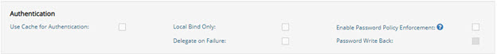

Figure 2.25: Authentication Options

Each option is described in more details below.

-	Local Bind Only – If this option is enabled and the user entry in cache either has no password or the bind fails, RadiantOne does not delegate the credentials checking to the backend. It determines if the user authentication fails based on the local comparison.

-	Delegate on Failure – If this option is enabled and the user entry in cache has a password but the local checking fails, RadiantOne delegates the credentials checking to the backend. If the credentials checking fails against the backend, an unsuccessful bind response is returned to the client. If the credentials checking succeeds against the backend, a successful bind response is returned to the client.

-	Enable Password Policy Enforcement - If you are storing user passwords in cache and you are using the cache for authentication, you can also choose to have RadiantOne enforce password policies (as opposed to delegating password checking to the backend directory and having it enforce password policies). Enable this option and then define the password policy to enforce. For details on password policies, see the RadiantOne System Administration Guide. 

-	When you enable the password policy enforcement on a persistent cache, the userPassword attribute is automatically added to the Extension Attribute property and you have the option to enable Password Write Back. If Password Write Back is enabled, and a modify request for the password is sent to RadiantOne, it tries to update the password in the backend. In some circumstances, having two levels of password policies can result in inconsistencies between the cache image and the underlying backend(s). These circumstances are outlined in the table below.

Password Change Event | Password Writeback Enabled?	| Expected Behavior
-|-|-
Password update via a Modify Request sent to RadiantOne	| No | The password is updated in the persistent cache if it complies with the persistent cache password policy. Otherwise the password update fails. <br> <br> The password update is not sent to the backend. If the update to the persistent cache succeeds, the password in the persistent cache will be different than the one in the backend.
Password update via a Modify Request sent to RadiantOne	| Yes | The password update is sent to the backend. If the password update fails in the backend, the password in the persistent cache is not updated. If the password update succeeds in the backend, the password is updated in the persistent cache. 
Password is updated directly in the backend (outside of RadiantOne) | N/A | Through the persistent cache refresh process, the password is updated in the persistent cache. If the account was locked in the persistent cache due to a password policy enforced at the cache layer, it will be unlocked by the cache refresh process after a successful password update in the backend. Password strength defined in the persistent cache password policy is not enforced since the password change originated from the backend.

###### Caching Active Directory Passwords

If your virtual view is from an Active Directory backend, passwords associated with the user entries are not a part of the view by default. When a user associated with this virtual view authenticates to RadiantOne, the credentials checking is delegated to the backend Active Directory. This is the behavior whether the virtual view is configured for persistent cache or not because RadiantOne does not have access to the Active Directory passwords. If you have the virtual view configured for persistent cache and you want RadiantOne to validate the passwords locally as opposed to delegating this to the backend Active Directory, you must cache the passwords from Active Directory. A computed attribute is required to get the hashed password to store in the persistent cache. Once the passwords are cached, you can use the Use Cache for Authentication option.

To cache user passwords, the virtual view of Active Directory needs a computed attribute named userPassword that is based on the function named getADPassword(). RadiantOne considers this computed attribute as the user’s password and the value of the computed attribute contains the user’s Active Directory password (encrypted as PBKDF2AD).

>[!warning] If you plan on using the persistent cache as a source image for synchronizing entries to a target Active Directory and you want to synchronize passwords, you must use the function named getADPasswordMD4() instead of getADPassword(). This is to ensure the password format can be handled properly by the target Active Directory.

To validate credentials, RadiantOne compares the value of the user’s cached userPassword attribute to the value that comes in the bind request. If it matches, the authentication is successful. If it doesn’t match, the authentication is unsuccessful. If the local authentication is unsuccessful, and you have the Delegate on Failure option checked, RadiantOne delegates the credentials checking to the backend Active Directory. The backend Active Directory is responsible in determining if the authentication is successful.

>[!note] The ability to get and cache passwords is supported for Active Directory 2008 R2(+) backends. Also, RadiantOne must be deployed on a Windows OS. All Windows updates should be applied to both the machine hosting RadiantOne and the backend Active Directory machine. The credentials configured in the Active Directory data source for RadiantOne must have the following permissions:
<br> Domain Level:
<br> Read, Replicating Directory Changes, Replicating Directory Changes All, Replicating Directory Changes in Filtered Set.
<br> Ou Level:
<br> Read all properties.

To leverage the Active Directory native replication mechanism to get the password, Microsoft recommends the following firewall ports are opened between the Active Directory server and the RadiantOne machine. Check with your Active Directory administrator to confirm these ports.

PORTS | PURPOSE
-|-
TCP 135 | RPC
TCP 139	| NetBIOS
TCP and UDP 389	| LDAP <br> *This could be used by RadiantOne to get the user information. Some other port may be used.
TCP and UDP 445 | SMB over IP
TCP and UDP 464	| Kerberos change/set password
TCP 636	| LDAPS <br> *This could be used by RadiantOne to get the user information. Some other port may be used.
TCP 3268 and TCP 3269 | Global Catalog non SSL and SSL <br> *This could be used by RadiantOne to get the user information. Some other port may be used.
TCP 49152 through 65535	| Dynamic ports

An example of a proxy view to an Active Directory backend, and the required steps to cache the user passwords associated with this view, are shown below.

1. Select the configured proxy view on the Main Control Panel > Directory Namespace tab.

2. Select the Attributes tab on the right.

3. Click **Add**.

4. Select unicodePwd from the Name drop-down list.

5. Enter a virtual name of userPassword.

6. Click **OK**.

7. Click **Save**.

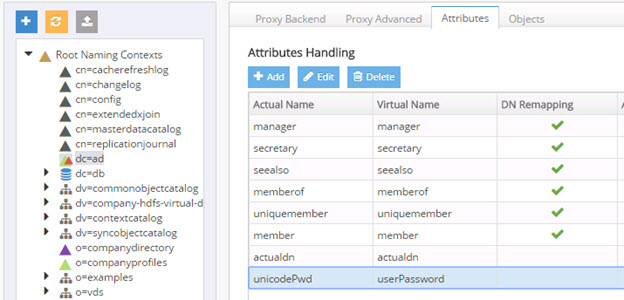
 
Figure 2.26: Mapping unicodePwd Attribute to a Virtual Name

Then, define a computed attribute named userPassword with the value based on the getADPassword( ) function. An example for a proxy view to an Active Directory backend is shown below.

1.	Select the configured proxy view on the Main Control Panel > Directory Namespace tab.

2.	Select the Objects tab on the right.

3.	In the Primary Objects section, click **Add**.

4.	Choose the User object class and click **OK**.

5.	Click **Edit** next to “Define Computed Attributes”.

6.	Click **Add**.

7.	Enter a value of userPassword as the Attribute Name.

8.	Click **Function**.

9.	Select the getADPassword() function and click **OK**.

10.	Click **Validate**.

11.	Click **OK**.

12.	Click **OK** to exit the computed attributes window.


 Figure 2.27: Computed Attribute Required to Store Active Directory Passwords in Persistent Cache

>[!warning] If your proxy view is using a Merged Tree configuration to merge another Active Directory view into the primary proxy view, you must have the userPassword computed attribute configured in both the primary proxy view and the merged view for passwords to be retrieved properly from both Active Directory backends.

Lastly a persistent cache on the virtual view can be configured and initialized. Afterwards, check the option to [Use Cache for Authentication](#use-cache-for-authentication). When this option is enabled, RadiantOne validates the credentials against the local cache as opposed to delegating the credentials checking to the backend Active Directory.


Figure 2.28: Using Persistent Cache for Authentication

##### Active

Check the Active option if you want to Activate this naming context. Uncheck the Active option to deactivate the cache. If a persistent cache is deactivated, RadiantOne issues queries to the backend(s) when processing client requests.

##### Full-text Search

Persistent cache branches can support full text searches. This offers additional flexibility for clients as they can search data in the RadiantOne namespace based on text (character) data. These types of searches are no longer linked to specific attributes as the characters requested could be found in any attribute value. An entry is returned if any attribute in the entry contains the character string(s) requested by the client.

Clients issue full text searches similar to the way they issue LDAP searches. The only difference is the filter contains (fulltext=<value>) where <value> would be the text they are interested in. As an example, if a client was interested in the text John Doe as an exact phrase, the search filter sent to RadiantOne would be (fulltext= “John Doe”) where the phrase is encapsulated in double quotes. If the phrase in the filter is not encapsulated in double quotes it means the client wants any entries that have attribute values that contain the character string John OR Doe. 

The part of the filter that contains the piece related to the full text search can also be combined with other “standard” LDAP operators. As an example, a filter could be something like (&(uid=sjones)(fulltext=”John Doe”)). This would return entries that contain a uid attribute with the value sjones AND any other attribute that contains the exact character string John Doe.

If you want the persistent cache to support full text searches, check the Full-Text Search option and click **Save**. If you add the support for full text searches, click **Re-build Index**.

##### Optimize Linked Attributes
Linked attributes are attributes that allow relationships between objects. A typical example would be isMemberOf/uniqueMember for user/groups objects. A group has members (uniqueMember attribute) which is the forward link relationship. Those members have an isMemberOf attribute which is the back link (to the group entry) relationship. Other examples of linked attributes are:

```
manager/directReports
altRecipient/altRecipientBL
dLMemRejectPerms/dLMemRejectPermsBL
dLMemSubmitPerms/dLMemSubmitPermsBL
msExchArchiveDatabaseLink/msExchArchiveDatabaseLinkBL
msExchDelegateListLink/msExchDelegateListBL
publicDelegates/publicDelegatesBL
owner/ownerBL
```

The most common back link/forward link relationship is between group and user objects. A list of groups a user is a member of can be calculated automatically by RadiantOne and returned in the membership attribute of the user entry. The most common back link attributes are in the drop-down list. However, you can manually enter any attribute name you want. This is configured on the Main Control Panel, click Settings > Interception > Special Attributes Handling > Linked Attributes setting (on the right).

If the Target Base DN (back link attribute location) and the Source Base DN (forward link attribute location) in the Linked Attributes setting is a persistent cached branch, the computation of the references can be optimized in order to return client requests for the back link attribute at high speed. To enable this optimization, follow the steps below.

>[!warning] If your linked attributes are for users and groups (both branches located in persistent cache), and you enable the Optimize Linked Attributes setting, and must support nested groups, only one user location per persistent cache store is supported. For example, in the Linked Attributes setting, having a Target Base DN location configured for ou=people1,dc=myhdap and ou=people2,dc=myhdap (both in the same dc=myhdap persistent cache store) is not supported. In this case, you should configure a single user location as dc=myhdap as a shared parent for both containers.

It is assumed you have configured and initialized your persistent cache, and configured the Linked Attributes in Special Attributes Handling. If you have not, please do so prior to continuing with the steps below.


Figure 2.29: Back Link Attribute Name in Special Attribute Handling

1. Select the Optimize Linked Attributes option on the Properties tab for the selected persistent cache branch on the Main Control Panel > Directory Namespace tab > Cache section. The defined linked attribute is added to the Extension Attributes List for the persistent cache.

2. Click **Save**. 

3. You can either rebuild the index, or reinitialize the persistent cache. Click **Re-build Index** or **Initialize**. The back link attribute is always returned to clients even when not requested unless Hide Operational Attributes is enabled in RadiantOne (in which case it is only returned when a client explicitly requests it). For details on the Hide Operational Attributes setting, please see the RadiantOne System Administration Guide. 

>[!warning] If a persistent cache has optimizations associated with it, deactivating it will interfere with queries associated with the linked attributes and they will not return properly. If you no longer need a cache, delete it instead of deactivating it.

#### Persistent Cache Universally Unique Identifier (UUID)

The Universally Unique Identifier (UUID) attribute is a reserved, internal attribute that is assigned to each entry and can guarantee uniqueness across space and time.

When adding entries into a persistent cache (LDAP ADD operations) from an LDIF file, if there are UUID attributes they are ignored by RadiantOne during import. RadiantOne generates a unique value for each entry based on the specifications in RFC 4122. 

When initializing with an LDIF file (LDIF INIT), if the entry has a UUID attribute, RadiantOne keeps it. If the entry does not have a UUID attribute, RadiantOne generates a unique value for each entry based on the specifications in RFC 4122.

UUID is an operational attribute meaning that if a client wants this attribute, they must explicitly ask for it in the search request sent to RadiantOne.

When exporting a persistent cache store to an LDIF file, you have the option to export the UUID attribute or not. The UUID attribute should be exported into LDIF if you plan on using this export to initialize a RadiantOne Universal Directory store, a replica for inter-cluster replication. Otherwise, the UUID attribute generally should not be exported. To export a persistent cache store and include the UUID attributes, check the Export for Replication option in the export window.

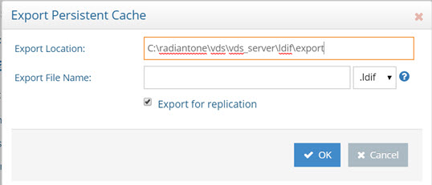
 
Figure 2.30:  Export Persistent Cache

#### Managing the Persistent Cache

##### Re-initializing a Persistent Cache 

Persistent cache should be re-initialized during off-peak hours, or during scheduled downtime, since it is a CPU-intensive process and during the initialization queries are delegated to the backend data sources which might not be able to handle the load.

Cache refresh connectors do not need to be stopped to re-initialize the persistent cache.

1.	Deactivate any inter-cluster replication on the cached branch prior to re-initializing. To do so, navigate to the cached branch on the Main Control Panel > Directory Namespace Tab and on the right side, uncheck “Inter-cluster Replication”, then click **Save**. Click **Yes** to apply the changes to the server.

2.	With the cached node selected, on the Refresh Settings tab, click **Initialize**.

3.	Choose to either initialize the cache by creating an LDIF file or from an existing LDIF file. Typically, you would always use the default option which is to create an LDIF file. The only time you could choose to use an existing file is if you already have an up-to-date LDIF file containing all of the needed entries.

4.	Click **OK**. A task is launched to re-initialize the persistent cache. The task can be monitored and managed from the Server Control Panel > Tasks Tab associated with the RadiantOne leader node.

5.	Click **OK** to exit the initialization wizard.

6.	Click **Save** in the upper right corner.

7.	Re-enable Inter-cluster Replication that was deactivated in step 1.

##### Re-building Index

If the cache has already been initialized, and the attribute list for sorted indexes changes (new attributes need to be indexed or removed from the index), you must rebuild the index. From the Main Control Panel -> Directory Namespace Tab, select the persistent cache branch below the Cache node. On the Properties tab on the right side, click the Re-build Index button.

##### Exporting the Cache

Exporting the cache generates an LDIF formatted file from the cache contents. This can be useful if you want to replicate this cache image across multiple RadiantOne clusters. To export the cached branch, from the Main Control Panel -> Directory Namespace Tab, select the persistent cache branch below the Cache node. On the Properties Tab on the right side, click the Export button. Enter a name, select a type of file (LDIF or LDIFZ which is a zipped and encrypted file) and click **OK**.

>[!warning] If exporting to an LDIFZ file, a security key must be configured. This key is the same as the one used for attribute encryption. Any target server (persistent cache or RadiantOne Universal Directory store) where you want to import this LDIFZ file must use the same security key value. The security key is defined from the Main Control Panel > Settings Tab > Security > Attribute Encryption section. If an LDIFZ encryption key is defined, only the ldifz file type is available when exporting to LDIF from the Main Control Panel > Directory Browser tab.


Figure 2.31: Exporting an LDIFZ file
 
##### Testing Persistent Cache Refresh Process

To test the persistent cache refresh process, use an LDAP command line utility like the one described below. If the connectors are running, suspend them from the Main Control Panel > PCache Monitoring tab.

The ldapsearch utility offered in the Sun Resource Kit can be used to force a refresh of the persistent cache based on a specific DN. The command would look similar to the following:

```
ldapsearch -h 10.11.12.91 -p 2389 -D "cn=directory manager" -w "secret" -b "action=synchronizecache,customers=ALFKI,dv=northwind,o=vds" -s base (objectclass=*)
```

The above command refreshes the single entry identified by the DN of customers=ALFKI,dv=northwind,o=vds. If you want to refresh multiple entries with a single command, you can use a ONE LEVEL or SUBTREE scope. If you wanted to refresh all entries below dv=northwind, the command would be:

```
ldapsearch -h 10.11.12.91 -p 2389 -D "cn=directory manager" -w "secret" -b "action=synchronizecache,dv=northwind,o=vds" -s one (objectclass=*)
```

Each parameter of the command is described below.

-h is the RadiantOne server name or IP address.

-p is the LDAP port RadiantOne is listening on.

-D is the user to connect to RadiantOne as.

-w is the password for the user you are connecting with.

-b is the DN for the entry in the persistent cache that you want refreshed (if a base scope). If a one level, or sub tree scope is used, then -b is the starting point in the persistent cache to start refreshing from.

-s is the scope of the search which should be base, one or sub.

(objectclass=*) is the filter.

Modify the above command to match your requirement.  Keep the following in mind.

- Always connect to RadiantOne as the directory manager

- Replace the DN with your own (always start with action=synchronizecache,)

To test, first modify the information in the underlying source. The persistent cache should not reflect any change. Next, execute the ldapsearch command mentioned above. Now, the persistent cache should reflect the new entry. Be sure to check all log files if the persistent cache did not get refreshed properly.

##### Starting/Stopping Real-time Refresh Agents

Generally, the real-time persistent cache refresh agents are started automatically by RadiantOne when needed. However, the following commands can be used to manually start and stop the refresh agents.

**Start:**
<br> <RLI_HOME>/bin/advanced/start_cacherefresh_realtime_agent.bat (start_cacherefresh_realtime_agent.sh on Linux)

**Stop:**
<br> <RLI_HOME>/bin/vdsconfig.bat stop-all-agents 
(vdsconfig.sh on Linux)

>[!note] you can use <RLI_HOME>/bin/vdsconfig.bat list-agents to list the running agents.

##### Logging Persistent Cache Refreshes

If the change log has been enabled for RadiantOne, then all changes affecting the persistent cache are logged there. Otherwise, all activity to the persistent cache is logged into a branch in the RadiantOne namespace with a root suffix of cn=cacherefreshlog. This branch only stores changes that affect persistent cache branches.

>[!warning] the cn=cacherefreshlog is stored in a local RadiantOne Universal Directory store, which means the entries are stored on disk in the directory of <RLI_HOME>/vds_server/data/cn_cacherefreshlog.  You must make sure you have sufficient disk space at the location. Running out of disk space (as changes are being made to the persistent cache) can cause data corruption and make the cn=cacherefeshlog inaccessible.

Logging of persistent cache changes into the cn=cacherefreshlog is always enabled and different log levels can be configured. The log level is set on the Main Control Panel > Settings Tab > Logs section > Changelog sub-section. Select the drop-down list next to the Persistent Cache Refresh Log option on the right side and choose a log level. The log levels are:

- Error – logs only errors that occur when trying to refresh the persistent cache. This is the default.

- Status – logs the status (and the DN that was refreshed) when refreshes are made to the persistent cache.

- All – logs all refreshes to the persistent cache including the changes that occurred.

Entries remain in the cn=cacherefreshlog for a default of 3 days. This is configurable and defined in the Main Control Panel > Settings Tab > Logs section > Changelog sub-section, Changelog and Journal Stores Max Age property. This property is shared by the following internal stores.

-	cn=changelog

-	cn=cacherefreshlog

-	cn=replicationjournal

-	cn=localjournal

-	cn=tombstone

-	cn=clustermonitor

-	cn=queue

-	cn=dlqueue

Typically, if the changelog has been enabled then error log level is used for the persistent cache refresh log. For more information, please see Persistent Cache Log Setting in the RadiantOne System Administration Guide.

##### Detecting Persistent Cache Update Errors

If an entry in the persistent cache fails to be updated, the entry in the cache refresh log is tagged with a status attribute of 2.

An example of a failed cache refresh log entry can be seen in the figure below.


 
Figure 2.32: Persistent Cache Refresh Log Entry

If the problem resulting in the update error has been fixed, you can manually reissue the update request with a base search on the entry using the targetDN attribute in the persistent cache refresh log. Using the example shown above, the entry in persistent cache is Employee=1,Category=employees,dc=csaa. Therefore, the command to refresh this entry in cache would look similar to the following:

ldapsearch -h 10.11.12.91 -p 2389 -D "cn=directory manager" -w "secret" -b "action=synchronizecache,Employee=1,Category=employees,dc=csaa" -s base (objectclass=*)

>[!warning] if there are many failed entries in the persistent cache refresh log, meaning that the cache image is significantly different than the backends, it might be more efficient to reinitialize the persistent cache as opposed to trying to fix the failed updates one at a time.

##### Deleting the Persistent Cache

To delete a persistent cache branch, uncheck the Active checkbox (on the Properties tab for the cached branch), then click Save to apply the changes to the server. Then click **Delete**.

##### Tuning the Persistent Cache Initialization

Initialization of a persistent cache happens in two phases. The first phase is to create an LDIF formatted file of the cache contents (if you already have an LDIF file, you have the option to use this existing file as opposed to generating a new one). If you choose to generate a new LDIF file during the initialization wizard, you can indicate a file location for it to be generated. The second phase is to initialize the cache with the LDIF file. 

After the first phase, RadiantOne prepares the LDIF file to initialize the cache. This could include re-ordering some entries to enforce parent-child relationships, re-formatting entries…etc. 
