# RadiantOne Monitoring and Reporting Guide

- [Chapter 1: Monitoring](01-monitoring.md)

<!-- 
- [Chapter 2: Auditing and Reporting](02-auditing-and-reporting.md)

-->

## Chapter 1 - Monitoring

Monitoring is one of the most important aspects of maintaining the health of RadiantOne. It is highly recommended that you monitor the RadiantOne components on a regular basis using the
methods and utilities discussed in this guide.

The RadiantOne components can be monitored from both the Main and Server Control Panels and command line scripts, in addition to using third party tools.

The key services to monitor are RadiantOne and ZooKeeper. There are default monitoring and alerts for these services. For RadiantOne, see [RadiantOne Availability](#radiantone-service-availability). For ZooKeeper, see
[ZooKeeper Write Failure](#zookeeper-write-failure).

### Expert Mode

Some settings in the Main Control Panel are accessible only in Expert Mode. To switch to Expert Mode, click the Logged in as, (username) drop-down menu and select Expert Mode.


>[!note] The Main Control Panel saves the last mode (Expert or Standard) it was in when you log out and returns to this mode automatically when you log back in. The mode is saved on a per-role basis.

### RadiantOne Built-in Monitoring and Alerts

RadiantOne includes built-in monitoring and alert capabilities and can also be monitored by external [third party monitoring tools](#external-monitoring-options-with-third-party-tools).

#### Monitoring from the Main Control Panel

The Main Control Panel provides a view of RadiantOne nodes deployed. When RadiantOne is deployed in a cluster, the state of services running on all nodes is visible in the Overview
section of the Dashboard tab. In the Intranode Health section you can see the connectivity across all nodes.

If RadiantOne is deployed in a classic active/active or active/passive architecture, the Intranode
Health section is irrelevant and only one node is shown in the Overview section.

The Replication Monitoring tab is relevant if inter-cluster replication is deployed or if you have
RadiantOne deployed in an active/active or active/passive architecture and are replicating HDAP stores across them.

##### Dashboard Tab

On the Dashboard Tab of the Main Control Panel, the Overview section displays information
about each cluster node. From here, you can see the status of all nodes. The cluster’s RadiantOne leader node is noted with a yellow-colored triangle beside the server name.

For each node, the Overview section displays the status of:

- Current CPU usage of the machine hosting RadiantOne.
- Current RadiantOne service memory usage.
- Current disk usage of the drive on the machine hosting RadiantOne.
- The RadiantOne service’s LDAP port
- The RadiantOne service’s LDAPS port
- The RadiantOne service’s HTTP port
- The RadiantOne service’s HTTPS port
- VRS (SQL) port
- VRS (SQL) SSL port
- ZooKeeper (ZK) on the node (in Node Component Status section). If ZooKeeper is running on a separate machine instead of on the same machine as the RadiantOne service, N/A is shown.
- Disk latency
- Up time – how long the RadiantOne service has been running on the node.
- Version of RadiantOne installed on the node


Figure 1. 1 : Example Monitoring of a RadiantOne Cluster Containing Two Nodes

If RadiantOne is deployed in a cluster, you can also use <RLI_HOME>/bin/advanced/cluster.bat list (cluster.sh on Linux) to monitor the status (ON/OFF) of each cluster node and see which one is the current RadiantOne service (VDS) leader and ZooKeeper (ZK) leader. Below is an example.

```sh
c:\radiantone\vds\bin\advanced>cluster.bat list

+----------------+--------------------------------------+------------+--------------------+--------------+

| SU-WINUD-E1N1* | cd96bcc3-40f9- 4286 - 810d-881f0aa10eb4 | ON | #1 |
ON |

| SU-WINUD-E1N2 | b40c196b- 5596 - 499d- 9855 - 1f8d3980fd1a | ON | #2** |
ON |

| SU-WINUD-E1N3 | 53df2 904 - 63b6-41f1-8de6-62c10369846a | ON | #3 |
ON |

+----------------+--------------------------------------+------------+--------------------+--------------+

*: VDS Leader

**: ZK Leader
```

The Internode Health section is applicable for cluster deployments only and displays a topology
of all nodes in the cluster and information about the connectivity between the nodes. If you
hover the mouse pointer over a node, the direction of connectivity is conditioned by this node
and more details are shown. By default, this includes the availability of the LDAP and LDAPS
ports for the RadiantOne service, and the ability to read and write to ZooKeeper on the target node. To toggle information about ZooKeeper or LDAP connectivity, check/uncheck the
corresponding box in the upper-left corner of the Internode Health section.


Figure 1. 2 : Internode Health Monitoring

A green checkmark means connectivity on the RadiantOne LDAP and/or LDAPS ports is fine and ZooKeeper can be read from and written to.

A red X means there is no connectivity on the LDAP and/or LDAPS ports for RadiantOne and/or
ZooKeeper cannot be read from or written to.

##### Replication Monitoring Tab

RadiantOne Universal Directory (HDAP) stores across multiple sites/data centers support multi-master replication. This type of replication is referred to as inter-cluster replication. The state of inter-cluster replication can be monitored from the Replication Monitoring Tab.

###### Central Journal Replication

The default, recommended replication model for RadiantOne Universal Directory stores is based on a publish-and-subscribe methodology. When writes occur on a site, the leader node
publishes the changes into a central journal. The leader nodes on all other sites pick up the changes from the central journal and update their local stores. These changes are then
automatically replicated out to follower/follower-only nodes within the cluster. For more details on inter-cluster replication, please see the RadiantOne Deployment and Tuning Guide.

If inter-cluster replication is enabled, the clusters that are participating in replication can be
viewed in the Central Journal Replication section. The topology depicts the connectivity
between the clusters and the cluster housing the replication journal. If a red line is visible, this
indicates a connection problem between a cluster and the replication journal.

An example is shown below.


|Column Name | Definition |
|------------|------------|
| HDAP Store | The root naming context that stores the entries to be replicated across all clusters. |
| Cluster Name | The cluster name, as defined during the RadiantOne installation. | 
| Changes Subscribed (Applied) | The number of changes replicated to this cluster. | 
| Changes Subscribed (Pending) | The number of changes waiting to be replicated to this cluster. | 
| Changes Published | This value is a total of the number of applied and pending changes. | 

More than one store per cluster can be participating in inter-cluster replication. The table shown in the Central Journal Replication section details for each store the clusters involved in replication. Then, for each cluster, the table shows:

- The number of changes subscribed to, are broken down into changes that have been
applied and changes that are pending.
- The number of changes published into the replication journal.

###### Push Mode Replication

To address a very small subset of use cases, namely where a global load balancer directs client
traffic across data centers/sites, where the inter-cluster replication architecture might be too
slow, you have the option to enable an additional, more real-time replication mode where changes can be pushed directly to intended targets. For example, an update made by a client to
one data center might not be replicated to other data centers in time for the client to immediately
read the change, if the read request it sent to a different data center than the update was. This
is generally not an ideal load distribution policy when working with distributed systems. Load
balancing is best deployed across multiple nodes within the same cluster on the same site/data
center.

In any event, to address scenarios like this, a push replication mode can be used to send the changes directly to the intended targets. The targets must be other RadiantOne servers defined
as LDAP data sources. For more details on Push Mode Replication, please see the RadiantOne Deployment and Tuning Guide.

If push mode replication is enabled, the clusters that are participating in replication can be
viewed in the table in the Push Mode Replication section. The table lists, for each store, the
clusters involved in replication. The source cluster, target cluster and connectivity status
between them is shown.

#### Monitoring from the Server Control Panels

The items that can be monitored from the Server Control Panels are described in this section.

Server Control Panels can be launched from the Dashboard tab in the Main Control Panel.

Locate the node and click the  button to launch the Server Control Panel.

>[!warning] when deploying RadiantOne in a cluster, the Main Control Panel
allows you to monitor certain aspects of all cluster nodes. Each node also has its own
Server Control Panel for monitoring other server-specific activities.

##### CPU, Memory, Disk Space, Disk Latency and Connection Usage

From the Server Control Panel -> Dashboard Tab, you can monitor the CPU, disk space and
latency on the machine hosting RadiantOne, and the RadiantOne service memory and
connections.

>[!warning] To use this feature, enable the cluster monitor at Main Control
Panel > Settings > Logs > Clustermonitor.


Figure 1. 3 : Monitoring Resources from the Server Control Panel

Alerts can be configured for memory, connections, disk space and disk latency from the Main
Control Panel > Settings tab > Monitoring > Standard Alerts.

To manage alerts:

1. In the Main Control Panel go to Settings Tab -> Monitoring section → Standard Alerts sub-section.
2. Define the memory threshold in the Memory section.
3. Define the connection threshold in the Connections section.
4. Define the disk space and disk latency thresholds in the Disk Alerts section.


Figure 1. 4 : Configuring Standard Alerts from the Main Control Panel

5. File alerts are enabled by default. If SMTP settings are configured in the Monitoring -> Email Alert Settings section you can also use the Email Alert output.
6. Click Save.

To invoke actions other than generating a file or sending an email, you can create a custom
script that is invoked when an alert is triggered.

To enable an alert script:

1. In the Main Control Panel go to Settings → Monitoring → Standard Alerts.
2. Expand the Advanced section.
3. In the Alert Script field, enter the pathname to your script file (.bat file on Windows, .sh on Unix systems).


Figure 1. 5 : Enabling an Alert Script from the Main Control Panel

4. Click Save.

To generate additional alert information, you can append your custom script mentioned above with the following four arguments.


| Argument | Description | Examples |
|----------|-------------|---------------------|
| 1 | Category | - “default_connections” <br> - “default_data_sources” <br> - "<node ID>" (for custom alerts)
| 2 | Status | - True=threshold exceeded. <br> - False=value below threshold. | 
| 3 | Name | - “connections in use...” <br> - “disk usage above...” <br> - “CPU usage above threshold” | 
| 4 | Registered value | This argument displays the registered value only if the associated alert is triggered. | 

To modify your custom script to output these alert descriptions:

1. Open your custom script in a text editor such as Notepad.
2. Append the script. The following example (Windows systems) calls for all four arguments and generates a text file called “alerts”.

```sh
echo %1 %2 %3 %4 >>C:\radiantone\vds\alerts.txt
```
3. Save the file.
4. Navigate in the file system to the file location and open the file. An example is shown below.

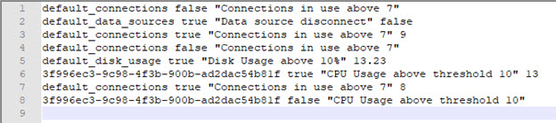

Figure 1.6 : Example Alert Descriptions

##### Connections and Operations

The Server Control Panel -> Usage & Activity Tab -> Usage Summary section, displays the total
number of connections made to the server (since startup), and the total number of operations
(since startup). The average per minute for each is calculated and displayed.

From the Current Connections section, you can also view the number of open connections to
RadiantOne including:


- Client IP/port that opened the connection
- Time the connection was opened
- How many operations have been performed on the connection
- Which user authenticated on the connection

The Processing Activity Details section shows how many operations are waiting to be
processed, how many operations are currently being executed in addition to the maximum
working threads available and peak worker threads used. This allows you to see the load on the
server in terms of working threads. If you are consistently seeing peak working threads close to
the max working threads number, you should possibly increase the max working threads or
number of processors (depending on the processing capabilities of the machine RadiantOne is
deployed on). This may also indicate that you need to scale out and deploy a new machine (e.g.
add a cluster node).

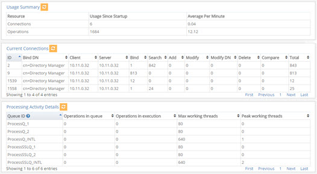

Figure 1. 7 : Monitoring Connections and Processing Activity from the Server Control Panel

##### RadiantOne Universal Directory (HDAP) Status

Store status (including number of entries, index size, revision, and search and write operations)
can be monitored from the Server Control Panel > Usage & Activity tab > Universal Directory Status section.

To filter the stores displayed, click on gear icon and then click Select Filters. Select the stores to
display and click OK. Click OK to exit the settings.

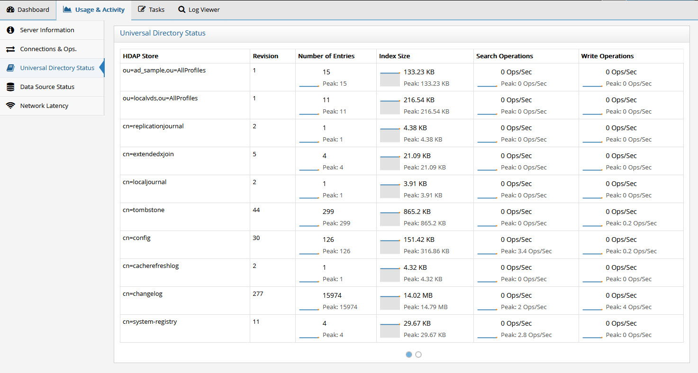

Figure 1. 8 : Monitoring RadiantOne Universal Directory Stores from the Server Control Panel

###### Resetting Peak Operations

To reset the peak operations without restarting the RadiantOne service, you can use the following (assuming the service is listening on LDAP port 2389 and the super user password is
“password”):

#ldapsearch -h host -p 2389 -D "cn=directory manager" -w "password" -b
"action=resethdapactivityinfos,cn=monitor" (objectclass=*)

###### Configuring RadiantOne Universal Directory Alerts

Alerts can be configured for RadiantOne Universal Directory stores. To configure store alerts

1. In the Main Control Panel go to Settings Tab > Monitoring section > Custom Alerts sub-section (requires [Expert Mode](#expert-mode)).
2. Click the Add button.
3. From the Template drop-down menu, select **Custom**.
4. From the Monitoring Source drop-down menu, select hdap-store. The page refreshes and displays the store information in the table at the bottom.
5. Configure other parameters as required.
6. Click **Save**.

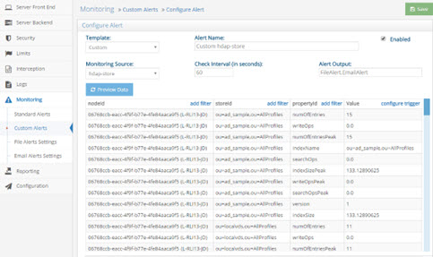

Figure 1. 9 : Configuring a RadiantOne Universal Directory Store Alert from the Main Control Panel

##### Data Source Status

The status of the RadiantOne service (data sources named vds and vdsha) and any backend can be monitored from the Server Control Panel > Usage & Activity Tab > Data Source Status section.


Figure 1. 10 : Monitoring Data Sources from the Server Control Panel

The status values are on, off, offline, and unavailable. The following table describes each status.


| Status | Description | 
|--------|---------------------------|
| On | RadiantOne can connect to the data source. | 
| Off | The connection test to the data source failed. | 
| Offline | The data source’s active property is set to false. | 
| Unavailable | No classname property is defined for the data source. | 

If a data source has failover servers configured, the URL in the message indicates which server the status applies to.

To configure alerts for data source availability:

1. In the Main Control Panel go to Settings Tab -> Monitoring section > Standard Alerts sub-section.
2. In the Data Sources section, there is the option to enable/disable alerts when a data source is disconnected (unreachable).

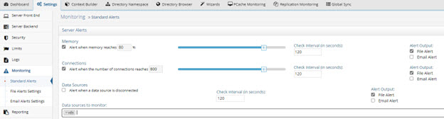

Figure 1. 11 : Configuring a Data Source Alert from the Main Control Panel

3. Define the interval to check the data source availability. The default is 120 seconds.
4. File alerts are enabled by default. If SMTP settings are configured in the Monitoring > Email Alert Settings section you can also use the Email Alert output.
5. Click the field next to “Data sources to monitor:” and select a data source from the drop-down menu. The vds data source is selected by default and is used to monitor the RadiantOne service and alert when the service is stopped or started.

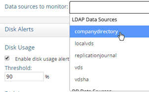

Figure 1. 12 : Selecting a Data Source to Monitor

6. Verify that the data source name is displayed in the “Data sources to monitor” field.
7. Click Save.


Figure 1. 13 : Example of a Data Source to Monitor

>[!note] To disable alerts for a data source, click the X next to the data source
name in the Data Source to monitor field, which removes it from the list.

##### Network Latency

If deployed in a cluster, the latency between RadiantOne nodes can be monitored from the
Server Control Panel -> Usage & Activity tab -> Network Latency section.

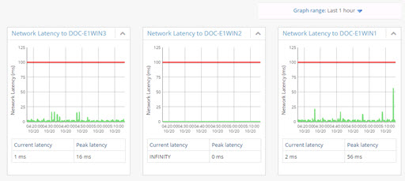

Figure 1. 14 : Monitoring Network Latency Between RadiantOne Nodes

#### Alerts

Alerts associated with activities monitored from the Control Panels are configured from the Main
Control Panel -> Settings tab -> Monitoring section and are tied to the Task Scheduler which
must be running. The status of the Task Scheduler can be seen on the Tasks tab in the Server
Control Panel associated with the current leader node.

>[!warning] For alerts that leverage data collectors, it is important to note
that some properties within data collectors require the RadiantOne service to be running to get status information. If you have configured custom alerts that use properties in a data collector that require the RadiantOne service to be running, andthe service stops, no alerts are sent. Be mindful of this when using data collectors in custom alerts.

RadiantOne offers standard alerts and custom alerts. Standard alerts cover the recommended
minimum monitoring for the RadiantOne components and are pre-configured by default. Custom
alerts allow you to define monitoring rules for all aspects of RadiantOne not addressed by a
standard alert. Custom alerts are highly specialized and require services from Radiant Logic to
setup. Please contact support@radiantlogic.com for details.

##### Standard Alerts

For standard alerts, the default alert output is a file, but you can easily add email alerts to the
configuration. When these alerts are activated, they are also displayed on the Main Control
Panel’s Dashboard tab.

This section describes the aspects addressed by standard alerts.

###### RadiantOne Service Memory Usage

A [file alert](#file-alert-settings), when the RadiantOne service’s memory usage reaches 90%, is enabled by default.
These settings can be changed from the Main Control Panel -> Settings tab -> Monitoring
section -> Standard Alerts. To change the memory threshold, slide the bar in the Memory
section to the needed amount. Define the interval to check the memory (default is 120 seconds).
The default alert output is File Alert, but if SMTP settings are configured in the Monitoring > Email Alert Settings section you can also use the Email Alert output. Click the Save button when
you are finished making changes.

###### Connections to RadiantOne

A [file alert](#file-alert-settings), when the number of connections to RadiantOne reaches 800 is enabled by default.
These settings can be changed from the Main Control Panel -> Settings tab -> Monitoring
section -> Standard Alerts. To change the connection threshold, slide the bar in the
Connections section to the needed amount. Define the interval to check the connections (default
is 120 seconds). The default alert output is File Alert, but if SMTP settings are configured in the
Monitoring -> Email Alert Settings section you can also use the Email Alert output. Click the
Save button when you are finished making changes.

###### Data Source Availability

An alert can be triggered when the availability of a backend data source changes. If the data
source has failover servers configured, the alert would only be triggered if all servers were
unavailable (alert would be in a triggered state), or in a scenario where all servers were
unavailable and then one or more of the servers comes back online (an alert would be issued
indicating the availability is back to normal). The setting can be changed from the Main Control
Panel > Settings tab > Monitoring section > Standard Alerts. Define the interval to check the
data source availability (default is 120 seconds). The default alert output is File Alert, but if
SMTP settings are configured in the Monitoring -> Email Alert Settings section you can also use
the Email Alert output. To enable alerts for data source availability, check the “Alert when a data
source is disconnected” option and select the Data Sources to Monitor from the drop-down list.
Click the Save button when you are finished.


###### Disk Usage

A file alert, when the disk usage on the RadiantOne machine reaches 90% of max capacity, is
enabled by default. These settings can be changed from the Main Control Panel > Settings tab > Monitoring section > Standard Alerts. To change the disk usage, enter a threshold. Define
the interval to check the data usage (default is 120 seconds). The default alert output is File
Alert, but if SMTP settings are configured in the Monitoring > Email Alert Settings section you can also use the Email Alert output. Click the Save button when you are finished.


>[!warning] closely monitoring disk space usage is extremely critical. If disk space is full, the RadiantOne service shuts down automatically.

###### Disk Latency

A file alert, when the disk latency on the RadiantOne machine reaches 100ms, is enabled by
default. These settings can be changed from the Main Control Panel -> Settings tab ->
Monitoring section -> Standard Alerts. To change the disk latency, enter a threshold (in
milliseconds). Define the interval to check the disk latency (default is 120 seconds). The default
alert output is File Alert, but if SMTP settings are configured in the Monitoring -> Email Alert
Settings section you can also check the Email Alert output. Click the Save button when you are
finished making changes.

###### Processing Load on RadiantOne

Alerts based on RadiantOne processing load are pre-configured, but not enabled by default. If
you would like to receive an alert when the RadiantOne processing queues reach a certain
threshold, from the Main Control Panel -> Settings tab -> Monitoring section -> Standard Alerts,
slide the bars for processing queues and internal queues to the threshold amount. Check the
“Enable processing queues alerts” option. Click the Save button when you are finished.

##### Custom Alerts

Custom alerts allow you to define monitoring rules for all aspects of RadiantOne not addressed
by a standard alert. The RadiantOne aspects that can be used in custom alerts are described in
[data collectors](#data-collectors). Custom alerts are highly specialized and generally require services from Radiant Logic to setup. Please contact support@radiantlogic.com for details. When these alerts
are activated, they are also displayed on the Main Control Panel’s Dashboard tab.

All custom alerts defined appear on the Main Control Panel > Settings tab > Monitoring section > Custom Alerts section.

The “Enabled” column/status indicates if the alert is active.

###### RadiantOne Service Availability

The RadiantOne service should be monitored. A default custom alert named “VDS Running
Check” is configured to monitor the state of the service. If RadiantOne is deployed in a cluster,
the state of the service on all nodes is monitored. To view the alert, navigate to the Main Control Panel > Settings Tab > Monitoring > Custom Alerts (requires [Expert Mode](#expert-mode)). Select the “VDS
Running Check” alert and click Edit.

This custom alert leverages the isVdsRunning property of the [node-monitor](#node-monitor) data collector to
trigger a [file alert](#file-alert-settings) if the RadiantOne service is not equal to true. If the value of the isVdsRunning
property is false or N/A, an alert is triggered.

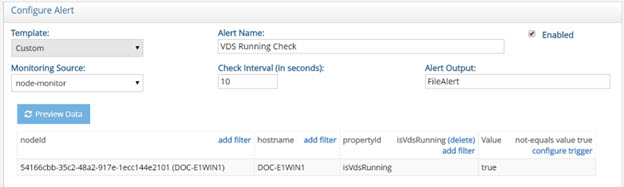

Figure 1.15 : Default Alert for the RadiantOne Service Availability

If you have RadiantOne deployed in a cluster, you can monitor each service independently to
have more granularity of alerts. For example, if one service stops in a cluster, the default “VDS
Running Check” alert will be triggered. If another RadiantOne service in the cluster stops, no
new alert is sent since the status is currently in a triggered state. Only when the RadiantOne
service on all nodes is running again is a new alert sent to indicate the status of the services is
back to normal. To be alerted about each RadiantOne service status change independently,
configure custom alerts for each node. To do this, create a custom alert for each node,
conditioning the alert by nodeId and/or hostname. The examples shown in the following screens
describe a three-node cluster. The node IDs are used in the filters conditioning each custom
alert.

Three custom alerts (shown below) can be used to monitor the RadiantOne service status on
each cluster node. The isVdsRunning property name is case sensitive.


Figure 1. 16 : Custom Alert for RadiantOne Node 1


Figure 1. 17 : Custom Alert for RadiantOne Node 2

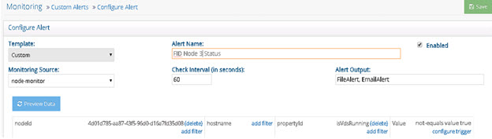

Figure 1. 18 : Custom Alert for RadiantOne Node 3

```sh
If all RadiantOne services are stopped, the alerts.log would contain something like the following,
related to the three custom alerts described above:

2018 - 10 - 11 14:55:47 Alert FID Node 1 Status TRIGGERED

+--------------------------------------+------------+--------------+-------+
| nodeId | hostname | propertyId | value |
+--------------------------------------+------------+--------------+-------+
| 170bd15f- 7950 - 4695 - 8d3d-d56da412e2fa | DOC-E1WIN1 | isVdsRunning | false |
+--------------------------------------+------------+--------------+-------+
Instance: vds_server
Alert ID: ac726962-e75d- 4737 - 895a-79aeb887abbd
2018 - 10 - 11 14:55:53 Alert FID Node 2 Status TRIGGERED
+--------------------------------------+------------+--------------+-------+
| nodeId | hostname | propertyId | value |
+--------------------------------------+------------+--------------+-------+
| 5d882413- 0480 - 4f07-a599-ad2a57097339 | DOC-E1WIN2 | isVdsRunning | false |
+--------------------------------------+------------+--------------+-------+

Instance: vds_server
Alert ID: 5824631f-7b02-423e-be0b-0e5dabc7ca1e
2018 - 10 - 11 14:55:55 Alert FID Node 3 Status TRIGGERED
+--------------------------------------+------------+--------------+-------+
| nodeId | hostname | propertyId | value |
+--------------------------------------+------------+--------------+-------+
| 4d01d785-aa87-43f5-96d0-d16a7fd35d08 | DOC-E1WIN3 | isVdsRunning | false |
+--------------------------------------+------------+--------------+-------+
Instance: vds_server
Alert ID: 15abdac2- 7040 - 4792 - 99cf-3d81369507e3
```

The default “VDS Running Check” alert would return the following in the alerts log under the same condition of all services were down:

```sh
2018 - 10 - 11 14:55:20 Alert VDS Running Check TRIGGERED
+--------------------------------------+------------+--------------+-------+
| nodeId | hostname | propertyId | value |
+--------------------------------------+------------+--------------+-------+
| 170bd15f- 7950 - 4695 - 8d3d-d56da412e2fa | DOC-E1WIN1 | isVdsRunning | false |
| 4d01d785-aa87-43f5-96d0-d16a7fd35d08 | DOC-E1WIN3 | isVdsRunning | false |
| 5d882413- 0480 - 4f07-a599-ad2a57097339 | DOC-E1WIN2 | isVdsRunning | false |
+--------------------------------------+------------+--------------+-------+
Instance: vds_server
Alert ID: default_vds_running
```

If one of the RadiantOne services is restarted, an alert related to the corresponding custom alert
is issued. An example of the alerts.log is shown below.

```sh
2018 - 10 - 11 15:00:44 Alert FID Node 1 Status BACK TO NORMAL
+--------------------------------------+------------+--------------+-------+
| nodeId | hostname | propertyId | value |
+--------------------------------------+------------+--------------+-------+
| 170bd15f- 7950 - 4695 - 8d3d-d56da412e2fa | DOC-E1WIN1 | isVdsRunning | true |
+--------------------------------------+------------+--------------+-------+
Instance: vds_server
Alert ID: ac726962-e75d- 4737 - 895a-79aeb887abbd
```

Whereas the default “VDS Running Check” alert would not send a new alert in this condition
because based on the status of all conditions in the alert configuration, it is still considered
“triggered” and the state hasn’t changed.

###### Persistent Cache Periodic Refresh Failure

To send an alert in the event of a persistent cache periodic refresh failure, configure a custom
alert.

1. Navigate to the Main Control Panel (of the current leader node if you have a cluster deployment) > Settings tab > Monitoring > Custom Alerts (requires [Expert Mode](#expert-mode)).
2. Select Custom from the Template drop-down menu.
3. Select event-log from the Monitoring Source drop-down menu.
4. Click Add Filter in the Event Type column, enter PCACHE for the value and click Add.
5. Click Add Filter in the namingDn column. Enter the cached naming context that you want
    to monitor periodic refreshes for and click Add.
6. Click Configure Trigger in the Value column.
7. Select “equals” from the Trigger Type drop-down list and enter a value of WARN.

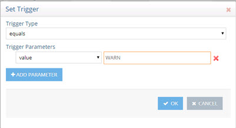

Figure 1. 19 : Configure Trigger for Custom Alert

8. Click OK.
9. If you want to only be alerted if the validation threshold has been exceeded, you can configure a Trigger with parameters above -1 like shown below instead of using (equals value WARN).

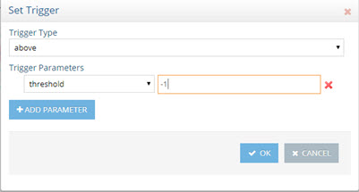

Figure 1. 20 : Configure Trigger for Custom Alert based on a Validation Threshold being Exceeded

10. Click Save.

When triggered, this alert displays on the Main Control Panel's Dashboard tab under Active
Alerts as "ALERT: <alert_name>” and triggers a [file alert](#file-alert-settings). If SMTP settings are configured, [email
alerts](#email-alerts) can be triggered as well by adding EmailAlert to the Alert Output setting (click save if you
modify the alert output).

###### ZooKeeper Write Failure

The ZooKeeper Write Check alert is enabled by default. This custom alert can be configured
from the Main Control Panel (of the current leader node if you have a cluster deployment) > Settings Tab > Monitoring > Custom Alerts (requires [Expert Mode](#expert-mode)). Select the ZooKeeper Write Check alert and click Edit.

This custom alert triggers a [file alert](#file-alert-settings) if clients cannot write to ZooKeeper. If SMTP settings are
configured, [email alerts](#email-alert-settings) can be triggered as well by adding EmailAlert to the Alert Output setting
(click Save if you modify the alert output).

###### Global Synchronization Capture Connector Stopped

To send an alert in the event of a global synchronization capture connector state change (e.g. a connector state changes from RUNNING to STOPPED), configure a custom alert.

1. Navigate to the Main Control Panel (of the current leader node if you have a cluster deployment) > Settings tab > Monitoring > Custom Alerts (requires [Expert Mode](#expert-mode)).
2. Select Custom from the Template drop-down menu.
3. Select pipeline from the Monitoring Source drop-down menu.
4. Click Add Filter in the sourceDn column. Enter the naming context corresponding to the source DN in your global sync topology and click Add.
5. Click Add Filter in the targetDn column. Enter the naming context corresponding to the target DN in your global sync topology and click Add.
6. Click Add Filter in the pipelineType column. Enter SYNC for the value and click Add.
7. Click Add Filter in the componentType column. Enter CAPTURE and click Add.
8. Click Add Filter in the propertyId column. Enter captureState and click Add.
9. Click Configure Trigger in the Value column.
10. Select “not-equals” from the Trigger Type drop-down list and enter a value of RUNNING. This means that if the capture connector state is not equal to RUNNING, an alert gets triggered.
11. Enter an Alert Name.
12. Click Save.


Figure 1. 21 : Custom Alert on Capture Connector

13. When triggered, this alert displays on the Main Control Panel's Dashboard tab under  Active Alerts as "ALERT: <alert_name>” and triggers a [file alert](#file-alert-settings). If SMTP settings are
    configured, [email alerts](#email-alert-settings) can be triggered as well by adding EmailAlert to the Alert Output
    setting (click save if you modify alert output).

###### Global Synchronization Queue Size

To send an alert in the event of a global synchronization queue growing, configure a custom
alert.

1. Navigate to the Main Control Panel (of the current leader node if you have a cluster deployment) > Settings tab > Monitoring > Custom Alerts (requires [Expert Mode](#expert-mode)).
2. Select Custom from the Template drop-down menu.
3. Select pipeline from the Monitoring Source drop-down menu.
4. Click Add Filter in the sourceDn column. Enter the naming context corresponding to the
    source DN in your global sync topology and click Add.
5. Click Add Filter in the targetDn column. Enter the naming context corresponding to the
    target DN in your global sync topology and click Add.
6. Click Add Filter in the pipelineType column. Enter SYNC for the value and click Add.
7. Click Add Filter in the propertyId column. Enter processorQueueSize and click Add.
8. Click Configure Trigger in the Value column.
9. Select “above” from the Trigger Type drop-down list and enter a threshold number indicating the number of events in the queue that should trigger the alert. In the example below, 50 is used. This means that if this queue contains more than 50 unprocessed
events, an alert is triggered.

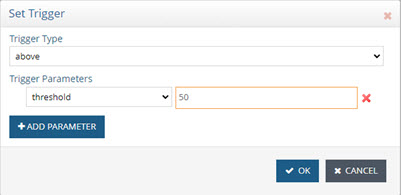

Figure 1. 22 : Configuring Alert Trigger

10. Enter an Alert Name.
11. Click Save.

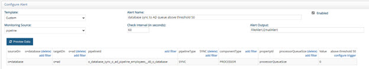

Figure 1. 23 : Custom Alert for Monitoring Global Sync Queue Size

12. When triggered, this alert displays on the Main Control Panel's Dashboard tab under Active Alerts as "ALERT: <alert_name>” and triggers a [file alert](#file-alert-settings). If SMTP settings are configured, [email alerts](#email-alert-settings) can be triggered as well by adding EmailAlert to the Alert Output setting (click save if you modify alert output).

#### Configuration Changes

To configure alerts when configuration changes are made from the Main Control Panel > Settings tab or using the command line configuration utility (vdsconfig), configure the following
custom alert.

1. Navigate to the Main Control Panel (of the current leader node if you have a cluster deployment) > Settings tab > Monitoring > Custom Alerts (requires [Expert Mode](#expert-mode)).
2. Click Add.
3. Select Custom from the Template drop-down menu.
4. Select config-change from the Monitoring Source drop-down menu.
5. Click Configure Trigger in the Value column.
6. Select equals from the drop-down list and enter a value of true.

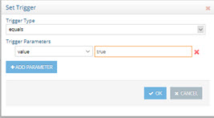

Figure 1. 24 : Setting Trigger Parameter (equals true)

7. Click OK.
8. Click Save.
9. When triggered, this alert displays on the Main Control Panel's Dashboard tab under Active Alerts as "ALERT: <alert_name>” and triggers a [file alert](#file-alert-settings). If SMTP settings are configured, [email alerts](#email-alert-settings) can be triggered as well by adding EmailAlert to the Alert Output setting (click save if you modify alert output).

#### File Descriptor Availability (Linux Only)

A file descriptor is an integer that uniquely represents an opened file. To ensure that the number
of file descriptors in use does not reach the maximum file descriptor limit, configure a custom
alert as follows.

1. Navigate to the Main Control Panel (of the current leader node if you have a cluster deployment) > Settings tab > Monitoring > Custom Alerts (requires [Expert Mode](#expert-mode)).
2. Click Add.
3. Select Custom from the Template drop-down menu.
4. Select node-monitor from the Monitoring Source drop-down menu.
5. Click Add Filter in the PropertyId column.
6. In the Collector Parameter Value field, enter systemOpenFileDescriptorsPercent and click Add.
7. Click Configure Trigger in the Value column.
8. Select "above" from the Trigger Type drop-down list and enter a value. In the following example, the trigger threshold is set to 60.

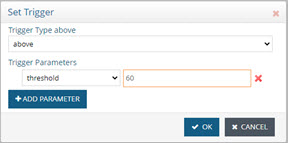

Figure 1. 25 : Setting a Trigger Threshold (above 60)

9. Click OK.
10. Click Save.

### Data Collectors

RadiantOne offers data collectors associated with various functions within the service. These data collectors can be used to configure custom alerts.

The names of data collectors are shown below.

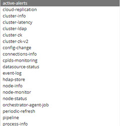

Figure 1. 26 : Data Collectors

Descriptions for each data collector can be found in the following sections. Some properties
within data collectors require the RadiantOne service to be running to get status information.
Each description in this section indicates if the RadiantOne service needs to be running. If you
have configured custom alerts that use properties in a data collector that require the
RadiantOne service to be running, and the service stops, no alerts are sent. Be mindful of this
when using data collectors in custom alerts.

#### Active-alerts

The active-alerts data collector returns information about all active alerts that are currently
triggered. If the response is empty, this means there are currently no alerts triggered.

>[!note] This data collector does not require a RadiantOne service to be running to return status information.

#### Cloud-replication

The cloud-replication data collector returns information and statistics about all configured inter-
cluster replication.

>[!note] This data collector requires a RadiantOne service to be running return status information.

A description of the properties is shown below.

- missingChanges – The number of pending changes that still need to be applied to the replicated domain on that server. This is calculated by finding the difference between the vdsSyncCursor on the domain on the target cluster and the number of changes in
the replication journal for that domain that weren't applied by that cluster.
- ensurePush – a value of true indicates that Ensured Push Mode is enabled for the replicated domain. A value of false indicates that Ensured Push Mode is not enabled for the replicated domain.
- serverId – The unique ID of the server associated with the replicated domain.

#### Cluster-info

The cluster-info data collector returns information and statistics about the RadiantOne cluster.

A description of the properties is shown below.

- upTime – the amount of time (in milliseconds) the RadiantOne service on the node
has been running. This property does NOT require a RadiantOne service to be
running to return information.
- zkEnsembleCanRead – the value is true if the ZooKeeper service on the node can be
read. This value is false if the ZooKeeper service on the node cannot be read.
- data – the combined index size (in KB) of all RadiantOne Universal Directory (HDAP)
stores in the cluster. This property requires a RadiantOne service to be running to
return information.
- vdsLeader – the cloud ID associated with the current RadiantOne FID leader node in
the cluster. This property requires an FID to be running to return information.
- zkEnsembleCanWrite – the value is true if the ZooKeeper service on the node can be
written to. This value is false if the ZooKeeper service on the node cannot be written
to.
- leaderSchedulerStarted - a value of true indicates the task scheduler is running on
the RadiantOne leader node. A value of false indicates the task scheduler is not
running on the leader node. This property does NOT require a RadiantOne service to
be running to return information.
- name – the name of the cluster the node is a member of. This property does NOT
require a RadiantOne service to be running to return information.
- storeCount – the number of RadiantOne Universal Directory stores on the node. This
property requires a RadiantOne service to be running to return information.
- nodeCount – the number of nodes in the cluster. This property does NOT require a
RadiantOne service to be running to return information.
- readOnly – the value is true if ZooKeeper on the node is in a read-only state. The
value is false if ZooKeeper on the node is a read-write state. This property does NOT
require a RadiantOne service to be running to return information.

#### Cluster-latency

The cluster-latency data collector returns information about the current network latency and
peak network latency both on the local node and between cluster nodes. The results indicate
the current and peak network latency between all nodes. The format of the result is as follows:

```sh
{

source-cloud-ID1 : {

target-cloud-ID1 : {

currentLatency : status,

peakLatency: status,

},

target-cloud-ID2 : {...},

},

source-cloud-ID2 : { ... }

}

```

- currentLatency– current network latency (in milliseconds). This property requires an
FID to be running in order to return information.
- peakLatency – peak network latency (in milliseconds), since the RadiantOne service
started. This property does NOT require a RadiantOne service to be running to return
information.

#### Cluster-LDAP

The cluster-ldap data collector returns information about the current LDAP/LDAPS connectivity
between RadiantOne cluster nodes. The results indicate the LDAP connectivity between all
nodes and include the status of the local connectivity. The format of the result is as follows:

```json
{

source-cloud-ID1 : {

target-cloud-ID1 : {

ldap-property : status,

ldaps-property: status,

errors: {

}

},

target-cloud-ID2 : {...},

},

source-cloud-ID2 : { ... }

}

```
- errors – if the RadiantOne LDAP service is running and there are problems connecting to the LDAP/LDAPS ports an error message is returned. Note – if the RadiantOne LDAP service isn’t running, the value of ldap/ldaps is NA and there is no error message. This property requires a RadiantOne service to be running to return information.
- ldap – a value of true indicates the ldap port of the RadiantOne service can be accessed successfully. A value of NA indicates connectivity to the LDAP port is unsuccessful because the RadiantOne LDAP service isn’t running. A value of false
indicates the RadiantOne service is running but a connection on the LDAP port cannot be established. This property requires a RadiantOne service to be running to return information.
- ldaps – a value of true indicates the ldaps port of the RadiantOne service can be
accessed successfully. A value of NA indicates connectivity to the LDAPS port is
unsuccessful because the RadiantOne LDAP service isn’t running. A value of false
indicates RadiantOne service is running but a connection on the LDAPS port cannot
be established. This property requires a RadiantOne service to be running to return
information.

#### Cluster-zk

The cluster-zk data collector returns information about the current ZooKeeper connectivity, both on the local node and between cluster nodes. The results indicate the ZooKeeper connectivity between all nodes and include the status of the local connectivity. The format of the result is as follows:

```sh
{

source-cloud-ID1 : {

target-cloud-ID1 : {

canRead-property : status,

canWrite-property: status,

errors: {

}

},

target-cloud-ID2 : {...},

},

source-cloud-ID2 : { ... }

}

```

- canRead – a value of OK indicates the read access to ZooKeeper is successful. This
property does NOT require a RadiantOne LDAP service to be running to return
information.
- canWrite – a value of OK indicates the write access to ZooKeeper is successful. This
property does NOT require a RadiantOne LDAP service to be running to return
information.
- errors – if there are problems with the connectivity to ZooKeeper the error message is
returned. This property does NOT require a RadiantOne LDAP service to be running
to return information.

#### Cluster-zk-v2

This is like the cluster-zk data collector, but it supports monitoring an external ZooKeeper
ensemble. If you have deployed ZooKeeper in a separate cluster than RadiantOne, use this
data collector to monitor ZooKeeper connectivity.

The following are the propertyID names and values:

- canRead – a value of OK indicates the read access to ZooKeeper is successful. This
property does NOT require a RadiantOne LDAP service to be running to return
information.
- canWrite – a value of OK indicates the write access to ZooKeeper is successful. This
property does NOT require a RadiantOne LDAP service to be running to return
information.

- errors – if there are problems with the connectivity to ZooKeeper the error message is returned. This property does NOT require a RadiantOne LDAP service to be running to return information.

#### Config-change

The config-change data collector returns information about configuration changes.

The following are the propertyID names and descriptions returned by this collector:

- commits – a value of OK indicates the read access to ZooKeeper is successful. This
property does NOT require a RadiantOne service to be running to return information.
- hasChange – Has a value of true or false indicating if any changes have been made
to the configuration since last polling. The value is true if there have been
configuration changes. Otherwise, the value is false.
- revision – Current ZooKeeper revision.

>[!note] This data collector does not require a RadiantOne service to be running to return information.

#### Connections-info

The connections-info data collector returns information about current connections for a given RadiantOne node.

>[!note] This data collector requires a RadiantOne service to be running to return information.

For each current connection, the following properties are returned.

- connBindDn – Bind DN associated with the client connection.
- connClientIp – client IP address that established the connection.
- connClientPort – port number the client established the connection from.
- connId – unique identifier associated with the client connection.
- connServerIp – IP address of the RadiantOne node the client is connected to.
- connServerPort – port that the client connection is accessing RadiantOne on.
- opCount - the total number of operations the RadiantOne node has processed for the
connection.

>[!note] The opCount for certain connections, used for internal operations, returns a value that is higher than the combined total of opCountAdd, opCountAbandon, opCountBind, opCountModify, opCountModifyDn, opCountCompare, and opCountDelete.
- opCountAbandon – number of abandon operations performed on this connection.
- opCountAdd – number of add operations performed on this connection.

- opCountBind – number of bind operations performed on this connection.
- opCountCompare – number of compare operations performed on this connection.
- opCountDelete – number of delete operations performed on this connection.
- opCountModify – number of modify operations performed on this connection.
- opCountModifyDn – number of modifyDN operations performed on this connection.
- opCountSearch – number of searches performed on this connection.

#### CPLDS-monitoring

The cplds-monitoring data collector returns information about the automatic synchronization
process from LDAP backends to RadiantOne Universal Directory stores.

>[!note] This data collector requires the RadiantOne service to be running to return information.

The following are the propertyID names and descriptions returned by this collector:

- source – the data source(s) where changes are detected and synchronized to
destination RadiantOne naming contexts.
- destination – target naming context.
- lastSyncTime – the last time synchronization was run.
- lastChangesTime – the last time synchronization was run and changes were detected and applied.
- numOfChanges – the number of changes applied in the last synchronization run.
- fileChangeTime – the creation time of the LDIF file from the data source. This file is
used by the change detection process to determine what data needs synchronized.

#### Datasource-status

The datasource-status data collector returns information about the data source and its status
based on if the RadiantOne node can connect to it.

>[!note] This data collector does NOT require the RadiantOne servcie to be running to return information.

For each data source, the following properties are returned.

- datasourceTypeInt – has a value of 1 for LDAP data sources, a value of 3 for JDBC
databases, and a value of 7 for custom data sources.
- datasourceUrl – the URL configured for the data source.
- status – a value of false indicates the RadiantOne service on the node cannot connect to the data source. A value of true indicates the RadiantOne service on the node can successfully connect to the data source. A value of N/A indicates the
connection cannot be tested, which is the case for custom data sources.

#### Event-log

The event-log data collector returns information about recent events (eventType) like persistent cache initialization failures and refresh events that fail for a given RadiantOne node (nodeId)
and naming context (namingDN). eventType has a value of PCACHE for persistent cache related events and SERVER for all other events.

>[!note] This data collector requires the RadiantOne service to be running to return information.

The following properties (propertyID) are returned for each periodic persistent cache refresh
event.

- date – timestamp providing the date and time the persistent cache refresh failure
occurred.
- syncDiffPct - The percentage of which the validation threshold has been exceeded. If
the failure was not due to a validation threshold, then the value is -1. In the example
shown below, the validation threshold was exceeded by 10%.
- levelName – RadiantOne log level associated with the error.
- message – the error message associated with a periodic persistent cache refresh
failure.
An example would be: [Storage Periodic Refresh - o=companyprofiles] Refresh failed:
javax.naming.PartialResultException: [LDAP: error code 9 - Error on xjoin inetOrgPerson -vdAPPHR: [LDAP: error code 1 - Exception occured on examples :
The request to acquire more resource failed: ABORTED: the access to the new resource server cannot go through.]]

Another example would be: [Storage Periodic Refresh - o=derby] Refresh failed:
java.lang.Exception: Threshold reached with -10% difference.

#### Hdap-store

The hdap-store data collector returns information and statistics about all RadiantOne Universal Directory (HDAP) stores and persistent cached branches for a given RadiantOne node (nodeID).

>[!note] This data collector requires the RadiantOne service to be running to return information.

For each store/persistent cache (storeId), the following properties are returned.

- numOfEntries – number of entries in the store/persistent cache. JSON sub-documents
are counted as separate entries to comprise this value.
- writeOps – write operations per second.

- numOfEntriesPeak – peak number of entries in the store/persistent cache since the
RadiantOne service started.
- indexName - internal name of the index associated with the store/persistent cache.
- numOfLDAPEntriesPeak – peak number of LDAP entries in the store/persistent cache
since the RadiantOne service started.
- folderSize – total size (in Bytes) of the file folder associated with the store/persistent
cache (index, tlogs).
- searchOpsPeak – search operations per second peak, since the RadiantOne service
started.
- version - current internal version of the store. This is used to manage replication.
- indexSize - current size of the index (in KB) for the store/persistent cache.
- searchOps – search operations per second.
- numOfLDAPEntries - number of LDAP entries in the store/persistent cache. JSON
sub-documents are not counted as separate entries. If an entry has sub-documents, it
is counted as a single LDAP entry.
- indexSizePeak - peak index size for the store/persistent cache since the RadiantOne
service started.
- writeOpsPeak – write operations per second.

#### Node-info

The node-info data collector returns general information about all RadiantOne cluster nodes. If
you pass a nodeId in the request, the information returned is applicable to that single node.

The response includes the following properties for each node:

- cloudId – the identifier of the RadiantOne node. This property does NOT require a RadiantOne service to be running to return information.
- createdTime – time when the RadiantOne node was created. This property does NOT
require the RadiantOne service to be running to return information.
- installPath – the product installation path. This property does NOT require the
RadiantOne service to be running to return information.
- ip - IP address of the machine. This property does NOT require the RadiantOne
service to be running to return information.
- isEnableSsl – has a value of “yes” when SSL is enabled for the RadiantOne service
and a value of “no” when it is not enabled. This property does NOT require the
RadiantOne service to be running to return information.
- javaHome – the installation location of Java. This property does NOT require the
RadiantOne service to be running to return information.
- javaVersion - Java version used in RadiantOne. This property does NOT require the
RadiantOne service to be running to return information.

- license – type of license associated with the installed RadiantOne product and the
email address of the person the RadiantOne product is licensed to. This property
requires the RadiantOne service to be running to return information.
- name – the friendly name of the machine where the RadiantOne node is installed.
This property does NOT require the RadiantOne service to be running to return
information.
- nodeType – has a value of READ_WRITE if the node is a core cluster node and a
value of READ_ONLY if the node is a follower-only type of cluster node. This property
does NOT require the RadiantOne service to be running to return information.
- port – the port number for LDAP access to RadiantOne. This property does NOT
require the RadiantOne service to be running to return information.
- portSsl – the port number for LDAPS access to RadiantOne. This property does NOT
require the RadiantOne service to be running to return information.
- product – the name of the RadiantOne product (license) installed. This property does
NOT require the RadiantOne service to be running to return information.
- startTime – time when the RadiantOne service was started on the node. This property
requires the RadiantOne service to be running to return information.
- vdsBuild – exact RadiantOne Build ID. This property does NOT require the
RadiantOne service to be running to return information.
- vdsVersion – version or RadiantOne installed. This property does NOT require the
RadiantOne service to be running to return information.

#### Node-monitor

The node-monitor data collector returns statistics about the RadiantOne nodes. Each cluster node is identified by a cloud ID.

The cloud_ID associated with a node can be seen from the Server Control panel > Usage & Activity > Server Information > Cloud ID.

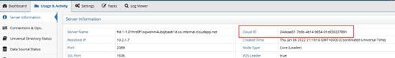

Figure 1.27 : Location to View Cloud ID Associated with a Cluster Node on Server Control Panel

The cloud_ID associated with a node can also be seen from the Main Control panel > Dashboard tab.

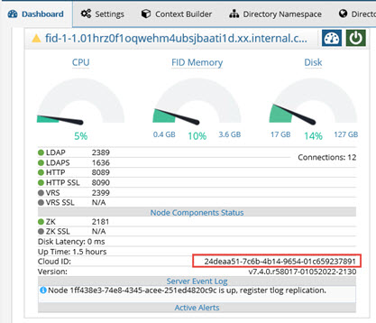

Figure 1. 28 : Location to View Cloud ID Associated with a Cluster Node on Main Control Panel

For each cluster node, the following properties are returned.

- activeConnections – number of current connections to the RadiantOne node. This
property requires the RadiantOne service to be running to return information.
- committedVirtualMemorySize - amount of virtual memory that is guaranteed to be available to the running process in bytes, or -1 if this operation is not supported. This property does NOT require the RadiantOne service to be running to return
information.
- connectionMax – number of maximum connections currently configured for RadiantOne. This property does NOT require the RadiantOne service to be running in
order to return information.
- connectionPeak - greatest number of connections at one time to RadiantOne in a 24-
hour timeframe. This property requires the RadiantOne service to be running in order
to return information.
- connectionPercent – current percentage of maximum connections in use. This
property requires the RadiantOne service to be running to return information.
- connectionTotal – total number of current connections to the RadiantOne node. This
property requires the RadiantOne service to be running to return information.
- cpu - current percentage of system CPU utilized. This property does NOT require the
RadiantOne service to be running to return information.
- cpuAvg -average percentage of system CPU utilized. This property does NOT require
the RadiantOne service to be running to return information.

- cpuPeak - highest percentage of system CPU utilized at one time in a 24-hour timeframe. This property does NOT require the RadiantOne service to be running to return information.

- disk - current amount of disk space (in bytes) being used on entire system. This property does NOT require the RadiantOne service to be running to return information.

- diskLatency - latency in milliseconds of a write to disk operation. This property does NOT require the RadiantOne service to be running to return information.

- diskLatencyPeak – the peak disk latency calculated during a 24-hour period. This property does NOT require the RadiantOne service to be running to return information.

- diskPeak - greatest amount of disk space (in bytes) used on the entire system in a 24-hour timeframe. This property does NOT require the RadiantOne service to be running to return information.

- diskPercent - percentage of disk space used on entire system. This property does NOT require the RadiantOne service to be running to return information.

- diskTotal – total amount of disk space (in bytes) on the machine storage device. This
property does NOT require the RadiantOne service to be running to return information.

- isControlPanelRunning – a value of true indicates that the Jetty web server hosting
the Control Panel is running. A value of false indicates that the Jetty web server is not
running. This property does NOT require the RadiantOne service to be running to return information.

- isSchedulerStarted - a value of true indicates the task scheduler is running on the node. A value of false indicates the task scheduler is not running on the node. This
property does NOT require the RadiantOne service to be running to return information.

- isVdsLeader – a value of true indicates the RadiantOne service running on the node
is the current cluster leader. A value of false indicates the RadiantOne service
running on the node is not the cluster leader. This property does NOT require the
RadiantOne service to be running to return information.

- isVdsRunning - a value of true indicates the RadiantOne LDAP service is running on the node. A value of false, indicates the RadiantOne LDAP service is not running on
the node. This property does NOT require the RadiantOne service to be running to return information.

- jvmThreadCount - current number of live threads including both daemon and non-
daemon threads. This property does NOT require the RadiantOne service to be
running to return information.

- memoryAlloc - amount of memory currently allocated by JVM in kilobytes. This property requires the RadiantOne service to be running to return information.

- memoryMax – maximum amount of memory (in KB) that the RadiantOne service JVM
is allowed to allocate. This property does NOT require the RadiantOne service to be running to return information.

- memoryPeak - greatest amount of memory used by the RadiantOne service’s JVM at one time in a 24-hour timeframe; value in kilobytes. This property requires the
RadiantOne service to be running to return information.
- memoryPercent – percentage of the RadiantOne service’s JVM max memory used.
This property requires the RadiantOne service to be running to return information.
- memoryUsed – amount of memory in use (in KB) by the RadiantOne service’s JVM.
This property requires the RadiantOne service to be running to return information.
- operationTotal - total amount of LDAP operations performed on the RadiantOne
service. This property requires the RadiantOne service to be running to return
information.
- systemLoadAverage - the system load average for the last minute. The system load
average is the sum of the number of runnable entities queued to the available
processors and the number of runnable entities running on the available processors
averaged over a period of time. The way in which the load average is calculated is
operating system specific but is typically a damped time-dependent average. This
property does NOT require the RadiantOne service to be running to return
information.
- systemOpenFileDescriptors – number of currently open file descriptors. This is only
applicable when RadiantOne is running Linux platforms. If RadiantOne is running on
Windows, the value of this property is n/a. This property does NOT require the
RadiantOne service to be running to return information.
- systemOpenFileDescriptorsPercent - current percentage of available open file descriptors in use. This is only applicable when RadiantOne is running Linux platforms. If RadiantOne is running on Windows, the value of this property is n/a. This
property does NOT require the RadiantOne service to be running to return information.
- systemUsedPhysicalMemory - amount of physical memory (in bytes) used by the
system. This property does NOT require the RadiantOne service to be running to
return information.
- systemUsedPhysicalMemoryPercent - percentage of physical memory used by
system. This property does NOT require the RadiantOne service to be running to
return information.
- systemUsedSwap - amount of used swap space in bytes. This property does NOT
require the RadiantOne service to be running to return information.
▪ systemUsedSwapPercent – percentage of system swap space used. This property
does NOT require the RadiantOne service to be running to return information.

#### Node-status

The node-status data collector returns an ON/OFF status for each RadiantOne service running
on each cluster node. If you pass a nodeId in the request, the information returned is applicable
to that single node.


- http_status – status of the RadiantOne service HTTP port. A value of ON means the RadiantOne service is listening on the HTTP port. A value of OFF indicates the RadiantOne service is not listening on the HTTP port. This property does NOT require
the RadiantOne service to be running to return information.
- https_status – status of the RadiantOne service HTTPS port. A value of ON means
the RadiantOne service is listening on the HTTPS (for SSL/TLS) port. A value of OFF
indicates the RadiantOne service is not listening on the HTTPS (for SSL/TLS) port.
This property does NOT require the RadiantOne service to be running to return
information.
- ldap_status – status of the RadiantOne service LDAP port. A value of ON means the
RadiantOne service is listening on the LDAP port. A value of OFF indicates the
RadiantOne service is not listening on the LDAP port. This property does NOT require
the RadiantOne service to be running to return information.
- ldap_ssl_status – status of the RadiantOne service LDAPS port. A value of ON means
the RadiantOne service is listening on the LDAPS (for SSL/TLS) port. A value of OFF
indicates the RadiantOne service is not listening on the LDAPS (for SSL/TLS) port.
This property does NOT require the RadiantOne service to be running to return
information.
- vrs_ssl_status – status of the RadiantOne service’s JDBC SSL port. A value of ON
means the RadiantOne service is listening on the JDBC SSL port. A value of OFF
indicates the RadiantOne service is not listening on the JDBC SSL port. This property
does NOT require the RadiantOne service to be running to return information.
- vrs_status – status of the RadiantOne service’s JDBC port. A value of ON means the
RadiantOne service is listening on the JDBC port. A value of OFF indicates the
RadiantOne service is not listening on the JDBC port. This property does NOT require
the RadiantOne service to be running to return information.
- zk_status – status of the ZooKeeper on the node. A value of ON means ZooKeeper is
running on the node. A value of OFF indicates ZooKeeper is not running on the node.
This property does NOT require the RadiantOne service to be running to returninformation.

#### Orchestrator-agent-job

The orchestrator-agent-job data collector returns information about the agents currently deployed in RadiantOne and their type. This data collector doesn't use traditional propertyId's.
Instead, it outputs the agent ID as the propertyId and its type as the value.

It also outputs any connector pcache ID's as the propertyId and any agents they are using it as
the value.


>[!note] This data collector requires the RadiantOne service to be running to return information.

For each agent, the following properties are returned:

- agentId/agentType – The agent ID is the property and the agent type is the value.
Shows what agents are running and their types. Available agent types: CPLDS,
PERIODIC_REFRESH, REAL_TIME

- connector ID/agentId - The connector ID is the property ID and the agent ID is the
value. This shows which connectors are using which agents.

#### Periodic-refresh

The periodic-refresh data collector returns information and statistics about persistent caches configured for periodic refresh.

>[!note] This data collector requires the RadiantOne service to be running to return information.

For each periodic refresh, the following properties are returned:

- inserted – number of inserted entries applied to the persistent cache.
- updated – number of updates applied to the persistent cache.
 deleted – number of deleted entries applied to the persistent cache.
- agentName – the agent name that is running the periodic refresh. If RadiantOne is
handling the periodic refresh (default), then an agent is not used and this property is
blank.

#### Pipeline

The pipeline data collector is for retrieving information about real-time persistent cache refresh
and/or global synchronization processes

>[!note] This data collector requires the RadiantOne service to be running to
return information.

For details on properties returned for pipelines associated with real-time persistent cache
refreshes, see Real-time Persistent Cache Refresh. For details on properties returned for
pipelines associated with global synchronization, see Global Synchronization.

#### Process-info

The process-info data collector returns information and statistics about the internal RadiantOne
processing queues.

>[!note] This data collector requires the RadiantOne service to be running to return information.

This is the same information that you can find on the Server Control Panel > Usage & Activity tab > Connections & Ops.

For each processing queue type, the following properties are returned:

- opThreadExecuting – Current number of operations being executed.
- opThreadPoolSizeMax - This is the number of threads the RadiantOne service uses for handling client requests. The default value is 16 worker threads allocated per processing queue (128 for internal queues). This amount is sufficient for most
deployments and should not be changed unless recommended by Radiant Logic.
- opThreadPoolSizePeak – Peak number of working threads.
- opWaitingInQueue – Number of operations in the queue waiting to be processed.
- waitingRatio - The ratio of threads that are waiting to be executed (opWaitingInQueue) to the thread pool max size (opThreadPoolSizeMax).

#### Server-event

The server-event data collector returns the last 15 entries (not lines) in the server event log file
(<RLI_HOME>/vds_server/logs/vds_events.log).

>[!note] This data collector requires the RadiantOne service to be running to return information.

### Email Alert Settings

If you would like to receive email alerts, configure the SMTP settings on the Main Control Panel
(associated with the leader node if deployed in a cluster) -> Settings Tab > Monitoring section > Email Alerts Settings.


Figure 1. 29 : Email Alert Settings

These properties are saved in Zookeeper at /radiantone/v1/cluster/config/monitoring.properties


Figure 1. 30 : Email Settings in the Monitoring.properties

These settings can be reused in log4j logging configurations by using the following properties:

${rli:alert.email.recipients}

${rli:alert.email.from}

${rli:alert.email.protocol}

${rli:alert.email.smtp.host}

${rli:alert.email.smtp.port}

${rli:alert.email.smtp.user}

${rli:alert.email.smtp.password}

An example of using these properties in a log4j configuration is shown below for the log
configuration of the scheduler.

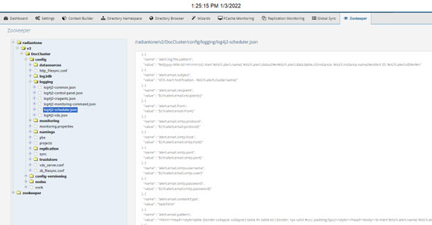

Figure 1.31 : Example of Leveraging Email Alert Settings in Log4J Configurations

After SMTP settings are configured, to enable email alerts for standard alerts, check the Email
Alert option and click Save.


Figure 1.32 : Standard Alert Output

To enable email alerts for custom alerts, enter a value of EmailAlert for the Alert Output setting
and click Save.


Figure 1.33 : Custom Alert Output

#### Customizing the Email Message

By default, email alerts send an HTML-formatted email with the following pattern:

```sh
<html><head><style>table {border-collapse: collapse;} table th, table td { border: 1px solid #ccc;
padding:5px;}</style></head><body><b>Alert %X{rli.alert.name}
%X{rli.alert.status}</b><br/>Server: %X{rli.node.hostname}<br/>Instance:
%X{rli.instance.name}<br/>%X{rli.alert.message}<br/>Collected
Data:<br/>%X{rli.alert.data.table.html}<br/>%d{yyyy-MM-dd HH:mm:ss}<br/>Alert ID:
%X{rli.alert.id}</body></html>
```

This pattern produces an email message that looks like the following:

```sh
------------------------------------
Alert Disk Usage above 90% TRIGGERED
Server: w-rli09-ben
Instance: vds_server
Collected Data:
nodeId
propertyId value 3124987d-63da-4bb7-9d88-9263664e9daf
diskPercent 96.19
2015 - 11 - 10 14:50:25
Alert ID: 00000000 - 0000 - 0000 - 0000 - 000000000002
------------------------------------
```

To customize the email message associated with email alerts:

1. From the Zookeeper tab in the Main Control Panel navigate to
    /radiantone/<version>/<clusterName>/config/logging/log4j2-scheduler.json.
2. On the right, click Edit Mode.
3. To customize the email subject, edit the alert.email.subject property and overwrite the
    default value.
4. To customize the email content type, locate the property named:
    alert.email.contentType.
5. Enter a value of text/plain or text/html (to send HTML emails).
6. To customize the email message, locate the property named: alert.email.pattern.
7. Enter the pattern that dictates the email message. In addition to the regular log4j2
    pattern elements, the following properties are available by using %X{property}:
    rli.alert.id - example "00000000- 0000 - 0000 - 0000 - 000000000002"
    rli.alert.name - name of the monitoring alert (for example "Alert Disk Usage above 90%")
    rli.alert.status - "TRIGGERED" or "BACK TO NORMAL"


```sh
rli.node.hostname
rli.instance.name
rli.alert.data.table.cli - The data that has been polled in the form of a CLI table
rli.alert.data.table.html - The data that has been polled in the form of an HTML table (for
HTML emails)
rli.alert.collector.id
rli.alert.collector.<parameter>
rli.alert.trigger
rli.alert.trigger.id
rli.alert.trigger.<parameter>
rli.alert.data.<prop1>.<prop2>...<propn> - allows you to fetch any value in the collected
data
```

The pattern can be as simple as:

%X{rli.alert.name} %X{rli.alert.status} at %d{yyyy-MM-dd HH:mm:ss}

Which produces an email message like:

------------------------------------

Alert Disk Usage above 90% TRIGGERED at 2015- 11 - 10 14:50:25

------------------------------------

### File Alert Settings

File output is used for all pre-configured standard alerts. The alerts are logged in a CSV
formatted file located at <RLI_HOME>/logs/alerts.log.

The default rollover size for the alert file is 100MB. The default number of log files to keep
archived is 10. The default archive location and file name is: <RLI_HOME>/logs/alerts-<number>.log. These settings can be changed from the Main Control Panel > Settings Tab >
Monitoring section > File Alerts Settings sub-section.


To change the alert file location and/or the archive location, expand the Advanced section (requires [Expert Mode](#expert-mode)) and change the value for alert.log.file and alert.log.file.archive respectively.


Figure 1. 34 : File Alerts Settings

## Monitoring and Alerts from the Command Line

A command-line script can monitor the status of the following items:

- The RadiantOne service’s [Memory](#radiantone-services-memory)
- [Connections](#connections-to-radiantone) to RadiantOne
- Status of the [RadiantOne LDAP service and LDAP Backend Data Sources](#status-of-radiantone-ldap-service-and-ldap-backend-data-sources)
- Status of [Database Backend Data Sources](#status-of-database-backend-data-sources)
- [Disk Space](#disk-space) on the machine where RadiantOne is installed
- Status of [Data sources (Backends)](#data-source-backends)

The script, monitoring.bat (monitoring.sh on Linux), is located in <RLI_HOME>/bin. This script
must run on the same machine as RadiantOne. If triggers are configured, the alert is triggered
when you first running the monitoring script (if a trigger condition is met) or when there is a
change of state for the property you are monitoring. If there is no change of state for a
monitored property, no alert is issued. To configure the alert to go to a file, edit the
<RLI_HOME>/bin/monitoring.bat (monitoring.sh on Linux) to add the following (below is an
example for the Linux script)

```sh
"${RLI_JHOME}/bin/java" -Dlog4j.configurationFile=file:/usr/local/apps/vds/config/logging/log4j2-
default-file.json -Drli.app.key=myalert ${RLI_JOPTS_EXTRA} ${RLI_JOPTS_DEFAULT_VM_SIZE} -cp "${RLI_ALL_CP}" com.rli.monitoring.MonitoringCommand "$@"
```

usage: < script > [-n < instance name >] -d < data collector key > [-p < data property >]

[-t <trigger type>] [-g <key:value>] [-i <seconds>]

- n,--instance <instance name> Which instance to use (optional), vds_server is the default if
nothing is specified.
- d,--data <data collector key> Which data to collect
- p,--data-param <data property> Which property of the data to collect
- t,--trigger <trigger type> Defines the type of the trigger to use
- g,--trigger-param <key:value> Trigger parameter (repeat the option for each parameter)
- i,--interval <seconds> Sets the monitoring polling interval

The possible data collector keys are described [here](#radiantone-memory-connections-connection-pools-and-processing-queues-with-a-search-against-cnmonitor).

List of available triggers:

- above(threshold)
- below(threshold)
- equals(value)
- always()

### RadiantOne Service’s Memory

The following example command shows how to monitor the RadiantOne service’s memory every 15 minutes (900 seconds) and trigger an alert when the memory reaches above 90% of
the allocated amount:

<RLI_HOME>/bin/monitoring.bat -d node-monitor -p propertyId:memoryPercent -t above -g threshold:90 -i 900

### Connections to RadiantOne

The following example command shows how to monitor connections to RadiantOne every 15 minutes (900 seconds) and trigger an alert when the connections reaches above 90% of the allocated amount:

<RLI_HOME>/bin/monitoring.bat -d node-monitor -p propertyId:connectionPercent -t above -g
threshold:90 -i 900

### Status of RadiantOne LDAP Service and LDAP Backend Data Sources

The following example command shows how to monitor an LDAP backend every 15 minutes
(900 seconds) and trigger an alert when the status changes, using monitoring.bat:

<RLI_HOME>/bin/monitoring.bat -d datasource-status -p datasourceId:sundirectory -p
propertyId:status -t equals -g value:false -i 900

### Status of Database Backend Data Sources

The following example command shows how to monitor a database backend every 15 minutes (900 seconds) and trigger an alert when the status changes, using monitoring.bat:

<RLI_HOME>/bin/monitoring.bat -d datasource-status -p datasourceId:sqlserver -p
propertyId:status -t equals -g value:false -i 900

#### Disk Space

The following example command shows how to monitor the available disk space every 15 minutes (900 seconds) on the machine where RadiantOne is installed and trigger an alert when
the disk space usage reaches above 90% of the available amount (meaning only 10% of the available disk space is left):

<RLI_HOME>/bin/monitoring.bat -d node-monitor -p propertyId:diskPercent -t above -g
threshold:90 -i 900

#### Data Source Backends

You can use the <RLI_HOME>/vds/advanced/checkDataSources.bat (.sh on Unix) script to check the status of all data sources (or only the ones listed in the command) and prints their
status either to the console or a specified file. The status is either “OK” (indicating that nothing was found to be wrong with accessing the data source) or “FAILED [specific error]” (indicating
that is something wrong with accessing the data source). Execute the command with? to find
out more about the command. Below are the possible parameters:

- n Name of the RadiantOne instance. If this is not specified, the default instance is used.
- l List of data sources (comma separated) to be checked. If not specified, all data sources are
checked.
- o Output file to store the status. If nothing is specified, the output is printed to the console.

The following example command checks the status of data sources named Sun ONE, AD, Oracle, and SQL_Server and writes the status of each data source in mystatus.log (which is
located in $RLI_HOME/bin since it is default path).

<RLI_HOME>/bin/advanced/checkdatasources.sh -l sunone, ad, oracle, sql_server -o mystatus.log

Example contents of the mystatus.log file:

- replicationjournal[LDAP]=OK
- log2db[JDBC]=OK
- remotevds[LDAP]=OK
- advworks[JDBC]=OK
- rli_client_db_datasource[JDBC]=OK

### Monitoring Real-time Persistent Cache Refresh and Global Sync Components

#### Monitoring Global Sync from the Control Panel

From the Main Control Panel -> Global Sync tab, you can select a topology and monitor the
activities of the capture, transform and apply processes associated with each pipeline.


Figure 1. 35 : Global Sync Monitoring

All topologies are listed on the left. Select a topology to view the sync pipelines. For each
running pipeline, a list of entries processed by the Capture, Transform and Apply components
are shown. For the Transform component, you see a number queued (messages in the queue
waiting to be processed) and a number processed (entries transformed).

From the Global Sync tab, you can stop the synchronization flows with **Stop**. Clicking stop, pauses the synchronization for all pipelines associated with the topology. Click **Start** to start synchronization for all pipelines. To resume synchronization for a specific pipeline, click CONFIGURE next to the apply, select the Apply component and click Start.


Figure 1. 36 : Resume Synchronization for a Specific Pipeline

Click **Configure** next to a pipeline to access the queue monitoring, alert settings, and logs
associated with the synchronization. In the Queue section, you can view the number of
messages processed, the current queue size, and some processing statistics (rate per sec and
peak processing times). You can also manage messages that failed to be applied by either
deleting them or manually resending them.


Figure 1. 37 : Queue Monitoring **–** Resending Failed Messages

#### Monitoring Real-time Persistent Cache Refresh from the Control Panel

From the Main Control Panel -> PCache Monitoring tab, you can select a real-time persistent
cache refresh configuration and monitor the activities of the capture and apply processes.


Figure 1. 38 : Persistent Cache Refresh Monitoring

#### Monitoring Real-time Persistent Cache Refresh and Global Sync Components from Command Line

You can use the <RLI_HOME>/bin/monitoring.bat (monitoring.sh on Unix) to monitor real-time
persistent cache refresh and global synchronization components from command line. This script must run on the same machine as the services you want to monitor. If triggers are configured, the default alert is a file alert: <RLI_HOME>/logs/alerts.log. Alerts associated with the monitoring command are configured on the Main Control Panel -> ZooKeeper tab (requires [Expert Mode](#expert-mode)). Navigate to /radiantone/v1/cluster/config/logging/log4j2-monitoring-
command.json and click EDIT MODE on the right.

The monitoring script offers a set of data collectors that retrieve information about specific
components of RadiantOne. The “pipeline” data collector is used for persistent cache refresh and Global Sync components. The syntax and properties supported are shown below.

```sh 
pipeline(sourceDn=*,targetDn=*,pipelineId=*,pipelineType=*,componentType=*,propertyId=*)
```

Run the monitoring script with the pipeline command to get a list of possible values for the
properties that can be passed in the command.

##### Real-time Persistent Cache Refresh

A high-level real-time persistent cache refresh architecture is shown below.

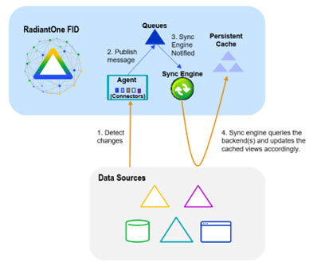

Figure 1.39 : Real-time Persistent Cache Refresh Architecture

Pipeline properties for real-time persistent cache refresh processes are described below.


- SourceDn and targetDn values are the same, and indicate the DN in the RadiantOne
namespace that is configured for real-time persistent cache refresh.
- The pipelineId is the identifier associated with the real-time persistent cache refresh.
- The pipelineType value is: PCACHE
- The componentType has one of the following values: APPLY, CAPTURE, PIPELINE,
PROCESSOR.
- The CAPTURE componentType, related to step 1 in Figure 1.30, has the following
properties (propertyId): captureCounter, captureHostname, captureMetaDn,
captureState, captureType. CaptureCounter indicates the number of changed entries
published by the connector.

        o CaptureHostname indicates the identifier of the machine where the agent process is running. The agent oversees managing the connector states.

        o CaptureMetaDn is an identifier for the virtual node that the connector listens for changes on.

        o CaptureState is the status of the capture connector. The captureState can have one of the following values: RUNNING, DEPLOYING, STOPPED, ERROR, WAITING_FOR_AGENT.

        o The captureType indicates the method used to capture changes. The captureType can have one of the following values: CHANGELOG, AD_DIRSYNC, AD_USN, AD_HYBRID, DB_TIMESTAMP, DB_COUNTER, DB_TRIGGER, SCIM2, SCIM1, GRAPHAPI, MGRAPH, OKTA, KAFKA, KAFKA_GG, PERSISTENT_SEARCH.
- The APPLY componentType, related to step 4 in Figure 1.30, has the following
property: appliedCounter. This indicates the number of changes processed to apply
to the persistent cache.
- The PIPELINE componentType has the following property: pipelineState, which indicates if the persistent cache refresh process is started. PipelineState can have
one of the following values: RUNNING, SUSPENDED, UPLOADING, ERROR,
DEPLOYING, WAITING_FOR_AGENT
- The PROCESSOR componentType has the following properties: processorCounter, processorHostname, processorQueueSize. The processor component logic is built into the Sync Engine shown in Figure 1.30 and is responsible for processing events
from the queues. ProcessorCounter is the number of events processed from the queue. ProcessorHostname is the machine name where this process is running. ProcessorQueueSize is the number of entries in the queue waiting to be processed.ProcessorQueueSize is a good candidate to configure custom alertsfor. If this number is growing, and the pipeline is fully  started, it is an indicator that events are being processed too slow. This could be due to errors while applying events, or just slow machine hardware or network.

##### Global Synchronization

A high-level Global Synchronization architecture is shown below.


Figure 1. 40 : Global Synchronization Architecture

Pipeline properties for global synchronization processes are described below.

- SourceDn is the DN in the RadiantOne namespace associated with the data source
where changes are captured.
- TargetDn is the DN in the RadiantOne namespace associated with the destination
data source where changes are to be applied.
- The pipelineId is the identifier associated with the synchronization pipeline.
- The pipelineType value is: SYNC
- The componentType has one of the following values: APPLY, CAPTURE, PIPELINE,
PROCESSOR.
- The CAPTURE componentType, related to step 1 in Figure 1.31, has the following
properties (propertyId): captureCounter, captureHostname, captureMetaDn, captureState, captureType.

        o CaptureCounter indicates the number of changed entries published by the connector.
        o CaptureHostname indicates the identifier of the machine where the agent process is running. The agent oversees managing the connector states.
        o CaptureMetaDn is an identifier for the virtual node that the connector listens for changes on.
        o CaptureState is the status of the capture connector. The captureState can have one of the following values: RUNNING, DEPLOYING, STOPPED, ERROR, WAITING_FOR_AGENT
        o The captureType indicates the method used to capture changes. The captureType can have one of the following values: CHANGELOG, AD_DIRSYNC, AD_USN, AD_HYBRID, DB_TIMESTAMP, DB_COUNTER, DB_TRIGGER, SCIM2, SCIM1, GRAPHAPI, MGRAPH, OKTA, KAFKA, KAFKA_GG, PERSISTENT_SEARCH
- The APPLY componentType, related to step 4 in Figure 1.31, has the following property (propertyId): appliedCounter. This indicates the number of changes applied on the target.
- The PIPELINE componentType has the following property (propertyId):
pipelineState, which indicates if the synchronization process is started. PipelineState
can have one of the following values: RUNNING, SUSPENDED, UPLOADING,
ERROR, DEPLOYING, WAITING_FOR_AGENT
- The PROCESSOR componentType, has the following properties (propertyId):
processorCounter, processorHostname, processorQueueSize. The processor component logic is built into the Sync Engine shown in Figure 1.31 and is responsible for processing events from the queues. ProcessorCounter is the number of events processed from the queue. ProcessorHostname is the machine name
where this process is running. ProcessorQueueSize is the number of entries in the queue waiting to be processed. ProcessorQueueSize is a good candidate to configure custom alerts for. If this number is growing, and the pipeline is fully
started, it is an indicator that events are being processed too slow. This could be due to errors while applying events, or just slow machine hardware or network.

## External Monitoring Options with Third Party Tools

Even though RadiantOne does not log activities directly to any third party/external monitoring tool by default, there are various methods available for these tools to get information about what they want to monitor. These methods are described below.

### Configure a Log4J Appender

RadiantOne logging leverages log4j format. Log4j offers many different appenders that can be utilized in RadiantOne, such as sysLog, SNMP trap and socket, among others. A list of
appenders supported for Log4J v2 can be found here:
https://logging.apache.org/log4j/2.x/manual/appenders.html

An example SNMP trap appender configuration can be found in the Radiant Logic online
knowledge base. [http://www.radiantlogic.com/support/knowledge-database/](http://www.radiantlogic.com/support/knowledge-database/)

The default log4j configurations are described in the table below:

| Service or Tool | Log4J Default Configuration |
|---------------|----------------------------------------|
| RadiantOne FID and Universal Directory |  In ZooKeeper at /radiantone/<version>/<cluster_name>/config/logging/log4j2-vds.json | 
| Task Scheduler | In ZooKeeper at /radiantone/<version>/<cluster_name>/config/logging/log4j2- scheduler.json | 
| Control Panels | In ZooKeeper at /radiantone/<version>/cluster_name>/config/logging/log4j2-control-panel.json | 
| Monitoring Script | In ZooKeeper at /radiantone/<version>/<cluster_name>/config/logging/log4j2-monitoring-command.json
| Agents used to manage capture connectors for real-time persistent cache refresh and global sync. | In ZooKeeper at /radiantone/<version>/<cluster_name>/config/logging/log4j2-cragents.json | 

To configure your own log4j appender:

>[!warning] Extreme caution should be used when configuring your own log4j appender. If this is done incorrectly, you could negatively impact the service that you are customizing the logging for. It is highly recommended you consult with Radiant Logic (support@radiantlogic.com) prior to modifying the default log4j configuration.

1. Make a backup of the existing Log4J configuration by navigating to the Main Control Panel -> ZooKeeper tab (requires [Expert Mode](#expert-mode)).
2. Browse to /radiantone/v1/cluster/config/logging.
3. Click Export on the right.
4. The ZooKeeper parent node should be /radiantone/v1/cluster/config/logging.
5. Enter a path to a directory to save the default log4j configuration and a file name.
    >[!note] This file can be imported on the ZooKeeper tab if you want to revert back to the default log4j configuration.
6. Click OK.


Figure 1. 41 : Exporting Default Log4J Configuration as a Backup

7. On the Zookeeper tab, navigate to the log4j configuration you want to configure your appender for. The service/tool and corresponding log4j configuration are described in the table above.
8. Click Edit Mode on the right and configure your appender.
9. Click Save.

### Control Panels - Delegated Administration Activity

Any user that can bind to RadiantOne can potentially administrator the server (if they belong to
the proper group). A user can belong to multiple groups. The following administration groups are
defined for RadiantOne:

- Directory Administrator Role
- Read Only Role
- Namespace Administrator Role
- Operator Role
- Schema Administrator Role
- ACI Administrator Role
- ICS Administrator Role
- ICS Operator Role

For details on the operations allowed for each user, please see the RadiantOne System Administration Guide.

When any user that is a member of one of the above delegated administration groups saves changes in the Main or Server Control Panel, this activity is logged into:
<RLI_HOME>/vds_server/logs/jetty/web_access.log. This is a CSV formatted log file with the delimiter being <TAB>. To configure the log output for the Control Panel, navigate to the Main
Control Panel > Settings tab > Logs > Log Settings section.

Select Control Panel – Access from the Log Settings to Configure drop-down list. Define the log level, rollover size and number of files to keep archived.

In the Advanced section (requires [Expert Mode](#expert-mode)), you can indicate the log file location/name
(default is <RLI_HOME>/logs/jetty/web_access.log) and the archive location/name.


Figure 1.42 : Main Control Panel Access Log Settings

For more fine-grained log configuration you must edit the configuration in ZooKeeper. From the
Main Control Panel -> ZooKeeper tab (requires [Expert Mode](#expert-mode)), navigate to
radiantone/<version>/<cluster_name>/config/logging/log4j2-control-panel.json. Click the Edit
Mode button on the right to make changes. Generally, these advanced settings should only be
changed if advised by Radiant Logic.

### Cluster State

You can use <RLI_HOME>/bin/advanced/cluster.bat (.sh on Linux) with the list option to return
a table of information about the cluster nodes. This includes the hostname, cloudID,
RadiantOne Service status (ON/OFF), RadiantOne node leader status (true for the leader node.
False indicates that the node is a follower), ZooKeeper server ID, ZooKeeper server status
(ON/OFF), ZooKeeper Server leader status (true for the ZooKeeper leader node. False for all
non-leader nodes). An example is shown below for a 3-node cluster.


To return just the table info, and avoid other logged output, pass RLI_CLI_VERBOSE=false
before the command, like shown below.


C:\radiantone\vds\bin\advanced>set RLI_CLI_VERBOSE=false
C:\radiantone\vds\bin\advanced>cluster.bat list

On Linux, the command is:
[admin@localhost advanced]$ RLI_CLI_VERBOSE=false ./cluster.sh list

To get the result in JSON format, use:

C:\radiantone\vds\bin\advanced>set RLI_CLI_FORMAT=JSON
C:\radiantone\vds\bin\advanced>cluster.bat list

```sh
{

"success" : true,

"data" : [ {

"Hostname" : "DOC-E1WIN1",

"CloudID" : "fbcd9ce3- 1648 - 43a5-bad4-4673f065814e",

"FIDServerStatus" : "ON",

"FIDServerLeader" : true,

"ZKServerId" : 1,

"ZKServerStatus" : "ON",

"ZKServerLeader" : false

}, {

"Hostname" : "DOC-E1WIN2",

"CloudID" : "32d06d7e-217a-4b8b-ade5-82fd281d5179",

"FIDServerStatus" : "ON",

"FIDServerLeader" : false,

"ZKServerId" : 3,

"ZKServerStatus" : "ON",

"ZKServerLeader" : true

}, {

"Hostname" : "DOC-E1WIN3",

"CloudID" : "2bddf61f-3e30-4e03-a845-10ee610f87cc",

"FIDServerStatus" : "ON",

"FIDServerLeader" : false,

"ZKServerId" : 2,

"ZKServerStatus" : "ON",

"ZKServerLeader" : false

} ]

}
```

###  RadiantOne Memory, Connections, Connection Pools, and Processing Queues with a Search Against CN=MONITOR

Certain information available for monitoring RadiantOne can be reached with an LDAP search request to the cn=monitor naming context. Searching this naming context provides live access
to some memory structures in RadiantOne.

>[!warning] when deploying RadiantOne in a cluster, you will have to query the cn=monitor branch at each node (as the stats are specific per node).

#### Memory and Connection Usage

If you perform a base search on the cn=monitor node, the following “live” server information is
available:

- connection: < conn-id >:< startTime >:< indUser >:< client-ip >:< client-port >@< server-ip>:< server-port>:< op-count>

    For example:
9:20140902225743.020Z:cn=Directory
Manager:10.11.0.236:53376@10.11.12.164:2389:23

    The above could be parsed as:
Connection number: 9
<br>Time the connection was established: 20140902225743.020Z
<br>Bind User associated with the connection: cn=Directory Manager
<br>Client IP address: 10.11.0.236
<br>Client Port: 53376
<br>RadiantOne IP address: 10.11.12.164
<br>RadiantOne LDAP Port: 2389
<br>Operation Count: 23

- connectionCount - the total (cumulative) number of connections established to
RadiantOne since last startup.
- connectionIdleTimeout – the value of the Idle Timeout property configured for
RadiantOne.
- connectionMax - the maximum concurrent connections allowed to RadiantOne.
- connectionPeak - the peak number of concurrent connections to RadiantOne since
last startup.
- currentConnections - the live number of concurrent connections to RadiantOne (will never be more than connectionMax). This number increases or decreases depending on new connections coming into RadiantOne or existing connections being closed.
- cpuPeak - highest percentage of system CPU utilized since server startup.
- cpuUsed – current amount of system CPU utilized.
- currentTime – the current time on the machine hosting RadiantOne.
- diskPeak - the peak amount of machine disk space used (in bytes) since startup.
- diskTotal – total amount of machine disk space (in bytes) on the machine storage
device.
- diskUsed – current amount of machine disk-space used (in bytes).
- lookThroughLimit – the value of the Look Through Limit property configured for
RadiantOne.
- memAllocated – the total amount of memory allocated for the RadiantOne node.
- memMax – maximum amount of memory (Java heap size) configured for the
instance.
- memUsed – the total amount of memory currently used by RadiantOne. This number
fluctuates (as the server is running) depending on how much memory it needs to
serve client requests and how fast the Garbage Collector (GC) can recycle the
discarded resources.
- memPeak - the peak memory usage of RadiantOne since last startup.
- opCount – the total number of operations RadiantOne has processed on the connection.
>[!note] The opCount for certain connections, used for internal operations,
returns a value that is higher than the combined total of opCountAdd,
opCountAbandon, opCountBind, opCountModify, opCountModifyDn,
opCountCompare, and opCountDelete.

- opPeak – the peak (the longest duration) operation info.

    For example:
2014 - 09 - 02 16:39:44,120 --> conn=45 op=5 SEARCH REQUEST Duration=1050

    The above could be parsed as:
<br>Operation Time: 2 014 - 09 - 02 16:39:44,120
<br>Connection number: 45
<br>Operation number: 5
<br>Type of operation: SEARCH REQUEST
<br>Length of operation to complete=1050 ms
<br>More information about the connection can be seen by navigating to cn=connection-
45,cn=monitor like shown below.


Figure 1. 43 : Sample of Querying cn=monitor Branch in RadiantOne

- readOPS – read (search, bind, or compare) rate (op/s) during the last 5 seconds.
- sizeLimit – the value of the Size Limit property configured for RadiantOne.
- startTime – the timestamp when the RadiantOne service started.
- timeLimit – the value of the Time Limit property configured for RadiantOne.
- version – the version of RadiantOne.
- writeOPS - write (add, delete, or modify) rate (op/s) during the last 5 seconds.

There is also a script that can be run that returns statistics about the memory usage and
connection usage for RadiantOne. This script is in the <RLI_HOME>/bin/advanced directory
and is named checkvds. When this script is run, the default RadiantOne instance is queried
(cn=monitor branch) and the following statistics are returned: memAllocated, memMax,
connectionMax, memUsed, currentConnections, memPeak, and connectionPeak.

##### Manually Resetting Connection and Memory Peak

RadiantOne supports special LDAP commands to reset the memory and connection peaks
without requiring the server to be restarted.

To reset these values, any LDAP client can be used. The examples below use an ldapsearch command line tool.

To reset the connection peak you can use the following (assuming RadiantOne is listening on
LDAP port 2389 and the super user password is “password”):

#ldapsearch -h host -p 2389 -D "cn=directory manager" -w "password" –b
"action=resetconnectionpeak" (objectclass=*)

To reset the memory peak, you can use the following (assuming RadiantOne is listening on
LDAP port 2389 and the super user password is “password”):

#ldapsearch -h host -p 2389 -D "cn=directory manager" -w "password" –b
"action=resetmempeak" (objectclass=*)

>[!warning] If you manually reset the connection peak, the Server Control Panel - > Dashboard tab associated with the node you’ve reset does not reflect the
current connection peak. This value on the Server Control Panel dashboard only refreshes every 24 hours.

#### Connection, Operation and Client Details

The sample in the screen shot below shows that there are currently eight connections made to
RadiantOne. Each entry represents a connection. The details pertaining to a specific connection
can be seen when selecting a specific entry (see the LDAP Browser client below).


Figure 1.44 : Example of Active Connection Information by Querying cn=monitor Branch

The value of opCount attribute indicates how many total operations have been performed by this connection.

>[!note] The opCount for certain connections, used for internal operations, returns a value that is higher than the combined total of opCountAdd, opCountAbandon, opCountBind, opCountModify, opCountModifyDn, opCountCompare, and opCountDelete.

The values for the following attributes indicate how many of each type of operation the connection has performed:

- opAdd ---- Add operations
- opModify ---- Modify operations
- opAbandon ---- Abandon operations
- opDelete ---- Delete operations
- opSearch ---- Search operations
- opCompare ---- Compare operations
- opBind ---- Bind operations

Details about which client opened the connection are described in the following attributes:

- clientPort
- clientIP
- startTime ---- when the client opened the connection
- bindDn ---- who the client authenticated with
- connectionID ---- unique identification allocated for the connection

Details about the server that the client connected to are detailed in the following attributes:

- serverPort
- serverIP

##### Manually Resetting Connection Operation Statistics

RadiantOne supports a special LDAP command to reset the operation statistics for connections without requiring the server to be restarted.

To reset the operations statistics for connections, any LDAP client can be used. The example below uses an ldapsearch command line tool.

To reset the number of operations (opAbandon, opAdd, opBind, opCompare, opCount, opDelete, opModify, opModifyDn, and opSearch) for all current connections (assuming RadiantOne is listening on LDAP port 2389 and the super user password is “password”):

#ldapsearch -h host -p 2389 -D "cn=directory manager" -w "password" -b
“action=resetconncounters" (objectclass=*)

#### Processing Activity of RadiantOne

The processing activity of RadiantOne can be retrieved below the cn=processor,cn=monitor
container. Here you can retrieve the properties associated with the processing queues (the ones
seen from the Server Control Panel -> Usage & Activity tab -> Connections & Operations
section).

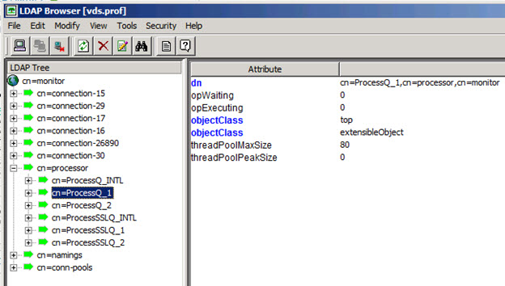

Figure 1. 45 : Example of Processing Activity by Querying cn=monitor Branch

- opWaiting – operations waiting in the queue (waiting to be processed by RadiantOne).
- opExecuting – operations currently being executed by RadiantOne.
- threadPoolMaxSize – the value of the Max Concurrent Working Threads property
configured for RadiantOne.
- threadPoolPeakSize – peak number of threads used by RadiantOne to process
requests.

#### Naming Context Activity

The amount of activity per naming context can be retrieved by selecting the naming context
below cn=namings,cn=monitor. An example is shown below.

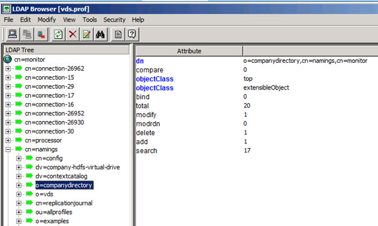

Figure 1. 46 : Example of Processing Activity for a given Naming Context

The values for the following attributes indicate how many of each type of operation the naming context has received.

- add ---- Add operations
- modify ---- Modify operations
- modrdn ---- Modify RDN operations
- delete ---- Delete operations
- search ---- Search operations
- compare ---- Compare operations
- bind ---- Bind operations
- total ---- Total number of operations

##### Manually Resetting Operation Statistics for a given Naming Context without Restarting the RadiantOne Service 

RadiantOne supports a special LDAP command to reset the operation statistics for a given naming context without requiring the server to be restarted.

To reset the operations statistics for a given naming context, any LDAP client can be used. The
example below uses an ldapsearch command line tool.

To reset the number of operations (compare, bind, modify, modrdn, delete, add and search) for a naming context of o=ad203 (assuming RadiantOne is listening on LDAP port 2389 and the
super user password is “password”):

#ldapsearch -h host -p 2389 -D "cn=directory manager" -w "password" -b
"action=resetnamingctxcounters,o=ad203,cn=namings,cn=monitor" (objectclass=*)

#### Connection Pools

Connection pool statistics related to connections between RadiantOne and the backend data
sources are logged into the cn=conn-pools,cn=monitor branch. You can retrieve these statistics
by querying this branch from any LDAP client.

>[!note] The values of the attributes for backend connection pooling are read
only.

Below the cn=conn-pools container, you will see information on the internal connection pool
(INTL), JNDI, LDAP and JDBC connections. The example below shows this information from the RadiantOne LDAP Browser.

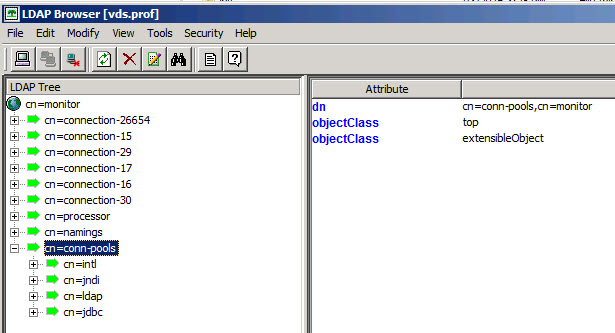

Figure 1.47: Example of Connecting Pooling Activity from the cn=monitor Branch

Details regarding the attributes available for each pool type are shown below.

##### Internal Connection Pool Attributes

Internal connection pooling is leveraged in scenarios where RadiantOne makes calls to itself. This can happen during authorization enforcement (e.g. checking group membership) or certain lookup functions used in an interception script.

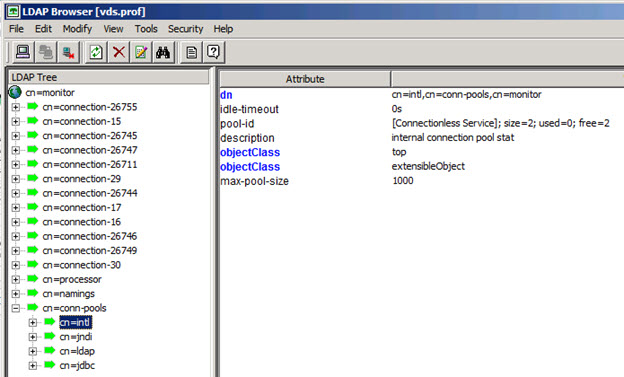

Figure 1.48: Example of Internal Connection Pool Activity

Max_Pool_Size: The maximum number of connections. When the number of connections reaches this value, further connections are refused.

Idle_Timeout: The length of time that a connection may remain idle before being removed from
the pool. A value of 0 (zero) means that the idle time is unlimited, so connections are never
timed out.

Current_Num_Of_Pools: Number of connections in the pool that are currently connected.

##### JNDI Connection Pool Attributes

JNDI connection pooling is leveraged for model-driven virtual views and join definitions from
directory backends.


Figure 1.49: Example of JNDI Connection Pool Activity

**Current pool size (anonymous)**: Number of connections in the pool that are currently
connected using authentication type “none”.

**Preferred pool size**: This is the optimal pool size. Idle connections are removed when the number of connections grows larger than this value. A value of zero means that there is no
preferred size, so the number of idle connections is unlimited.

**Authentication types**: Only these authentication types are allowed to connect to the directory server.

**Current pool size (digest)**: Number of JNDI connections in the pool that are currently
connected using authentication type “digest”

**Protocol types**: Only these protocol types are allowed to connect to the directory server.

**Initial pool size**: Number of JNDI connections created when initially connecting to the pool.

**Current pool size (simple)**: Number of JNDI connections in the pool that are currently
connected using authentication type “simple”.

**Idle time out**: The length of time that a JNDI connection may remain idle before being removed
from the pool. A value of 0 (zero) means that the idle time is unlimited, so connections will never
be timed out.

**Maximum pool size**: The maximum number of JNDI connections. When the number of connections reaches this value, further connections are refused. A value of 0 (zero) means that
the number of connections is unlimited.

##### LDAP Connection Pool Attributes

LDAP connection pooling is leveraged for proxy views of directory backends.


Figure 1. 50 : Example of LDAP Connection Pool Activity

**Connect_Timeout**: Number of seconds a request for a LDAP connection waits when there are
no connections available in the free pool and no new connections can be created.

**Max_Pool_Size**: The maximum number of LDAP connections. When the number of
connections reaches this value, further connections are refused.

**Idle_Timeout**: The length of time that an LDAP connection may remain idle before being
removed from the pool. A value of 0 (zero) means that the idle time is unlimited, so connections
are never timed out.

**Current_Num_Of_Pools**: Number of LDAP connections in the pool that are currently connected.

##### JDBC Connection Pool Attributes

JDBC connection pooling is leveraged for views from database backends.


Figure 1. 51 : Example of JDBC Connection Pool Activity

**Max_Pool_Size**: The maximum number of JDBC connections allowed. When the number of
connections reaches this value, further connections are refused.

**Idle_Timeout**: The length of time that a JDBC connection may remain idle before being removed from the pool. A value of 0 (zero) means that the idle time is unlimited, so connections
are never timed out.

**Current_Num_Of_Pools**: Number of JDBC connections in the pool that are currently connected.

##### Manually Resetting Connection Pools without Restarting the RadiantOne Service

RadiantOne supports a special LDAP command to reset the connection pools without requiring the server to be restarted.

To reset the connection pools, any LDAP client can be used. The example below uses an
ldapsearch command line tool to clear the LDAP connection pool.

#ldapsearch -h host -p 2389 -D "cn=directory manager" -w "password" -b
“action=clearldappool" (objectclass=*)

The example below uses an ldapsearch command line tool to clear the Database (JDBC)
connection pool.

#ldapsearch -h host -p 2389 -D "cn=directory manager" -w "password" -b
“action=clearjdbcpool" (objectclass=*)

### RadiantOne Service Status and Responsiveness – Heartbeat Check

To check if the RadiantOne service is up and responding, it is recommended to issue a periodic
LDAP search request against cn=config. In the request, bind with any user that has permissions
(stored locally in RadiantOne Universal Directory) to read cn=config. This indicates that
RadiantOne is listening on the LDAP port and is able to respond to requests. The default
RadiantOne ports are 2389/636 (LDAP/LDAPS) although you define the port you want during
the RadiantOne install.

>[!warning] when deploying RadiantOne in a cluster, issue the heartbeat check against each node.

When RadiantOne runs as a service on Windows platforms, you can also use System Center Operations Manager (SCOM) to monitor it. On LINUX platforms, Nagios (or some other daemon
service monitor) can be used.

### RadiantOne Logs and Error Messages to Monitor

The most important logs and error messages to monitor for RadiantOne are:

<RLI_HOME>/vds_server/logs/vds_server_access.log

- SearchResult {resultCode=53
- VDS_Server is shutting-down [Connection to ZooKeeper lost.]
- !!! Server Busy -- Maxmium TCP/IP connection limit(1000) reached

<RLI_HOME>/vds_server/logs/vds_server.log

The following errors indicate the server is shutting down or unable to accept more connections.

- Server is shutting down: VDS stop command invoked.
- Error in accepting an incoming connection: java.io.IOException: Too many open files

The following errors can indicate users are connecting to the server and attempting to perform
operations they are not authorized to.

- ??? Error in binding: Failed in passing security check point: IP address where the
ROOT_USER connected from is not listed.
- SearchResult {resultCode=50

The following errors indicate memory problems.

- java.lang.OutOfMemoryError: unable to create new native thread
- java.lang.OutOfMemoryError: GC overhead limit exceeded
- Root exception is java.net.SocketException: Too many open files

The following error indicates problems with ZooKeeper.

- Server is shutting down: VDS has been configured to stop if the connection to ZK is
not writable any more.
- VDS_Server is shutting-down [Connection to ZooKeeper lost.]
- ConnectionStateListener: ZK connection is not writable any more.
- ZooKeeper session has been lost. [vds_server]

RadiantOne logging is configured from the Main Control Panel -> ZooKeeper tab (requires [Expert Mode](#expert-mode)). Navigate to /radiantone/<version>/<cluster_name>/config/logging/log4j2-vds.json and click EDIT MODE on the right.

### Periodic Persistent Cache Refresh Threshold Failures

To monitor periodic persistent cache refresh failures due to thresholds being reached, monitor
the <RLI_HOME>\vds_server\logs\periodiccache.log for keywords: “Threshold reached”

For example, assume a 50% Add Threshold has been configured and during the next refresh
cycle, there are 85% more entries in the backend than there are in the persistent cache image.
This persistent cache refresh is aborted, and the following message can be found in the
periodiccache.log.

2021 - 04 - 20T11:44:59,487 ERROR - [Storage Periodic Refresh - o=sql] Refresh failed:
java.lang.Exception: Threshold reached with 85% difference for adds.

In the example above, a periodic persistent cache refresh is configured on the o=sql naming context.

### ZooKeeper Status – Heartbeat Check

To check if ZooKeeper is up, it is recommended to check that ports 2181 (this is the ZooKeeper
connection string defined during install and is the port for the cluster), 2888 (communication port
between ZooKeeper servers in the ensemble), and 3888 (ZooKeeper election port) are open.
Ports 2888 and 3888 are only applicable if you are deployed in a Cluster (of three nodes
running ZooKeeper in an ensemble). If more than a port check is desired, third-party tools that
support JMX can be used. Contact Radiant Logic Support (support@radiantlogic.com) to
discuss this option.

### ZooKeeper Logs and Error Messages to Monitor

The most important log to monitor for ZooKeeper is
<RLI_HOME>/logs/zookeeper/zookeeper.log. The following are critical error messages to monitor in this log:

- ERROR [ConnectionStateManager-0:ZooManager@?] - Connection lost. (local
zookeeper node no longer able to contact peers in ensemble)
- Non-optimial configuration, consider an odd number of servers.
- Could not add appenderMBean for [null]
- Unexpected exception causing shutdown while sock still open

### RadiantOne Activity – Check/Parse Access Log (CSV Format) Output

By default, CSV logging is enabled in the Main Control Panel > Settings tab > Log > Access Logs settings. On the right, check the CSV option in Output format and click Save.


Figure 1.52: Enabling CSV Log

For details on the columns in the CSV file, please see the RadiantOne Logging and Troubleshooting Guide.

#### RadiantOne Activity – Read Changes from a Database Table

The RadiantOne service logs all access to data in the vds_server_access.log by default as long
as the server log level is set to a minimum of ACCESS. This includes who accessed the data, when (day and time) and what operations they performed. This information can also be logged
into a database which allows for third-party reporting tools to easily create meaningful charts and graphs for compliance analysis. Logging to a database requires the [CSV log format output](#radiantone-activity--checkparse-access-log-csv-format-output)
enabled and running the Log2DB utility.

The database that houses the table which contains the log contents can be in any database
server you choose. These settings are located on the Main Control Panel > Settings Tab >
Reporting section > Log2DB Settings sub-section. The database associated with the “Database
Datasource” configured here must be running and accessible. To check which database this
data source points to, navigate to the Main Control Panel -> Settings Tab -> Server Backend > DB Data Sources.

>[!note] The default settings leverage a Derby database that is included with RadiantOne and can be started with <RLI_HOME>/bin/DerbyServer.exe.

Once RadiantOne is configured to log to CSV and the database hosting the log contents is
running, launch the Log2DB utility which is in charge of reading the CSV contents and writing
into your database table (table name configured in the Log2db Settings).

>[!warning] If RadiantOne is deployed in a cluster, the Log2DB utility must be running on each node.

Details about configuring and starting the Log2DB utility and the database columns (describing the log contents) can be found in the Logging and Troubleshooting Guide.

#### Check/Parse Alert File (CSV Format) Output or Emails Generated from Alerts enabled in Main Control Panel 

Output options and configuration are described in [Alerts](#alerts).

#### Legacy Monitoring Scripts

[Monitoring.bat](#monitoring-and-alerts-from-the-command-line) (monitoring.sh on Unix), consolidates the monitoring abilities of the legacy scripts: memoryMonitoring, ldapBackendMonitoring, connectionMonitoring, dbBackendMonitoring, checkDataSources, and diskSpaceMonitoring.

The legacy monitoring scripts can still be used and are in the <RLI_HOME>/bin/advanced directory. However, the default target log output for these scripts has changed (if you use -v true
and want the output to log to a file) because the rli.log has been deprecated. Refer to the description of the -v argument for details.

These scripts must run on the same machine as the RadiantOne service. Each is described in more details below.

>[!warning] when deploying RadiantOne in a cluster, the scripts must run on
each cluster node that you want to monitor.

##### Memory Monitor

The memoryMonitoring script is used to monitor the RadiantOne service memory usage.
Execute the command with? to find out more about the command. Below are the possible
parameters:

- n Name of the RadiantOne instance.
- i Poll Interval. How frequently to fetch the server statistics. Default is 30 seconds.
- t Percentage of memory reached -- when to start sending the alerts. Default is 90%.
- v Verbose settings -- true/false. Default is false. If this is set to true, the destination of the
output is console by default. If you want the output to go to a file, it can be defined in the script
prior to running it. To use the default log4j file configuration (defined in
<RLI_HOME>/config/logging.log4j2-default-file), edit the script and add the following:
- Dlog4j.configurationFile=$RLI_HOME/config/logging/log4j2-default-file.json
- Drli.app.key=<myScriptFileName if you don’t want it to go to the target associated with log4j2-
default-file>

An example is shown below:

```
"${RLI_JHOME}/bin/java" -Dlog4j.configurationFile=$RLI_HOME/config/logging/log4j2-default-file.json -Drli.app.key=memoryMonitoring -Xmx512m -Djava.awt.headless=true -cp "${RLI_ALL_CP}" com.rli.tools.vdsadmin.status.util.MemoryMonitoringUtility "$@"
```

The log level must be set to INFO or higher for this verbose option to work.

The following parameters are not required if you are using the instance name with -n because
the value is retrieved from the instance’s vds_server.conf file (which is stored in ZooKeeper). If
not using the -n property, then you must specify the following parameters.

- h RadiantOne host name to be monitored.
- p RadiantOne port to be monitored.
- D Super user DN.
- w Password for super user.
- s Use SSL to make the connection -- true/false. If both the regular LDAP port and the SSL port
have been enabled, the regular LDAP port is used by default. If you want the SSL port to be
used, you should use -s true in the command. If only the SSL port has been enabled, then it is
used by default.

SMTP settings (if the following parameters are not specified, the values configured in the Main
Control Panel -> Settings Tab -> Monitoring -> Email Alerts Settings are used):

- H host name of SMTP server.
- P SMTP port number. Default is 25.
- S Use SSL to make SMTP connection -- true/false.
- U SMTP user name (to connect to the SMTP server).
- W SMTP password (to connect to the SMTP server).
- T To email address...where alerts are sent.
- F From email address.

There is an example of using this script below. The default RadiantOne instance is named
“vds_server”. This example assumes that Email Alerts Settings have been configured in the
Main Control Panel, since the SMTP settings are not specified in the command.

<RLI_HOME>/bin/advanced/memoryMonitoring.sh -n vds_server -i 60 -t 75

This example command polls RadiantOne every 60 seconds and sends an email if the memory
usage goes over 75% of the JVM allocated memory and when the memory usage goes back to normal.

##### Connection Monitor

The connectionMonitoring script is used to monitor if the number of active connections to the RadiantOne exceeds the defined threshold. Execute the command with? to find out more about the command. Below are the possible parameters:

- n Name of the RadiantOne instance.
- i Poll interval. How frequently to fetch the server statistics. Default is 30 seconds.
- t Percentage of connections reached -- when to start sending the alerts. Default is 90%.
- v Verbose settings -- true/false. Default is false. If this is set to true, the destination of the
output is console by default. If you want the output to go to a file, it can be defined in the script
prior to running it. To use the default log4j file configuration (defined in <RLI_HOME>/config/logging.log4j2-default-file), edit the script and add the following:
- Dlog4j.configurationFile=$RLI_HOME/config/logging/log4j2-default-file.json
- Drli.app.key=<myScriptFileName if you don’t want it to go to the target associated with log4j2-
default-file>

An example is shown below:

```
"${RLI_JHOME}/bin/java" -Dlog4j.configurationFile=$RLI_HOME/config/logging/log4j2-default-
file.json -Drli.app.key=connectionMonitoring -Xmx512m -Djava.awt.headless=true -cp
"${RLI_ALL_CP}" com.rli.tools.vdsadmin.status.util.ConnectionMonitoringUtility "$@"
```

The log level must be set to INFO or higher for this verbose option to work.

The following parameter are not required if you are using the instance name with -n because the
value is retrieved from the instance’s vds_server.conf file. If not using the -n property, then you
must specify the following parameter.

- h RadiantOne FID host name to be monitored.
- p RadiantOne FID port to be monitored.
- D Super user DN.
- w Password for super user.
- s Use SSL to make the connection -- true/false. If both the regular LDAP port and the SSL
port have been enabled, the regular LDAP port is used by default. If you want the SSL port to be
used, you should use -s true in the command. If only the SSL port has been enabled, then it is
used by default.

SMTP settings (if the following parameters are not specified, the values configured in the Main
Control Panel > Settings Tab > Monitoring > Email Alerts Settings are used):

- H host name of SMTP server.
- P SMTP port number. Default is 25.
- S Use SSL to make SMTP connection -- true/false.
- U SMTP user name (to connect to the SMTP server).
- W SMTP password (to connect to the SMTP server).
- T To email address...where alerts are sent.
- F From email address.

There is an example of using this script below. By default the RadiantOne instance created is named “vds_server”. This example assumes that Email Alerts Settings have been configured in
the Main Control Panel, since the SMTP settings are not specified in the command.

<RLI_HOME>/bin/advanced/connectionMonitoring.sh -n vds_server -i 60 -t 75

This example command polls RadiantOne every 60 seconds and sends an email if the number of connections goes over 75% of the maximum number of connections allowed to the RadiantOne instance and when the number of connections goes back under the threshold.

##### RadiantOne LDAP Service and LDAP Backend Data Source Monitor

The ldapBackendMonitoring script monitors availability of the RadiantOne LDAP service, or one
of the configured LDAP backends. Execute the command with? to find out more about the
command. Below are the possible parameters:

- n Name of the RadiantOne instance.
- i How frequently to check the backend connection. Default is 30 seconds.
- b List of backend IDs. Comma separated. ID is vds_ldap.backend.x.storage_name property
from the vds_server.conf file.
- d A comma separated list of data source names that you want to monitor.
- h Host Name of RadiantOne (or specific LDAP backend) to monitor.
- p the RadiantOne service (or specific LDAP backend) port to monitor.
- D Bind DN of the server to monitor.
- w Bind password.
- s Use SSL to make the connection -- true/false.
- v Verbose settings -- true/false. Default is false. If this is set to true, the destination of the
output is console by default. If you want the output to go to a file, it can be defined in the script
prior to running it. To use the default log4j file configuration (defined in
<RLI_HOME>/config/logging.log4j2-default-file), edit the script and add the following:
- Dlog4j.configurationFile=$RLI_HOME/config/logging/log4j2-default-file.json
- Drli.app.key=<myScriptFileName if you don’t want it to go to the target associated with log4j2-
default-file>

An example is shown below:

```
"${RLI_JHOME}/bin/java" -Dlog4j.configurationFile=$RLI_HOME/config/logging/log4j2-default- file.json -Drli.app.key=ldapBackendMonitoring -Xmx512m -Djava.awt.headless=true -cp "${RLI_ALL_CP}" com.rli.tools.vdsadmin.status.util.LDAPBackendMonitoringUtility "$@"
```

The log level must be set to INFO or higher for this verbose option to work.

SMTP settings (if the following parameters are not specified, the values configured in the Main
Control Panel -> Settings Tab -> Monitoring -> Email Alerts Settings are used):

- H host name of SMTP server.
- P SMTP port number. Default is 25.
- S Use SSL to make SMTP connection -- true/false.
- U SMTP user name (to connect to the SMTP server).
- W SMTP password (to connect to the SMTP server).
- T To email address...where alerts are sent.
- F From email address.

There is an example of using this script below. By default the data source associated with the
RadiantOne service is named “vds”. If you wanted to monitor a backend, you would use the
data source name associated with that backend (in the -d parameter). This example assumes
that Email Alerts Settings have been configured in the Main Control Panel, since the SMTP
settings are not specified in the command.

<RLI_HOME>/bin/advanced/ldapBackendMonitoring.sh -d vds -i 60

This example command polls the RadiantOne service every 60 seconds and sends an email if it
is down.

##### Backend Database Data Source Monitor

The dbBackendMonitoring script is used to monitor if one of the configured database backends
are available or not. Execute the command with? to find out more about the command. Below
are the possible parameters:

- n Name of the RadiantOne instance.
- i How frequently (in seconds) to check the backend connection. Default is 30 seconds.
- d A comma separated list of data source names that you want to monitor.
- v Verbose settings -- true/false. Default is false. If this is set to true, the destination of the
output is console by default. If you want the output to go to a file, it can be defined in the script
prior to running it. To use the default log4j file configuration (defined in
<RLI_HOME>/config/logging.log4j2-default-file), edit the script and add the following:
- Dlog4j.configurationFile=$RLI_HOME/config/logging/log4j2-default-file.json
- Drli.app.key=<myScriptFileName if you don’t want it to go to the target associated with log4j2-
default-file>

An example is shown below:

```
"${RLI_JHOME}/bin/java" -Dlog4j.configurationFile=$RLI_HOME/config/logging/log4j2-default-file.json -Drli.app.key=dbBackendMonitoring -Xmx512m -Djava.awt.headless=true -cp "${RLI_ALL_CP}" com.rli.tools.vdsadmin.status.util.DBBackendMonitoringUtility "$@"
```

The log level must be set to INFO or higher for this verbose option to work.

SMTP settings (if the following parameters are not specified, the values configured in the Main
Control Panel > Settings Tab > Monitoring > Email Alerts Settings are used):

- H host name of SMTP server.
- P SMTP port number. Default is 25.
- S Use SSL to make SMTP connection -- true/false.
- U SMTP user name (to connect to the SMTP server).
- W SMTP password (to connect to the SMTP server).
- T To email address...where alerts are sent.
- F From email address.

There is an example of using this script below. Enter the name of the database backend data
source(s) in the -d parameter (comma separated list of there is more than one). This example
assumes that there are two database data sources that you want to monitor (oracle and sql) and
that Email Alerts Settings have been configured in the Main Control Panel, since the SMTP
settings are not specified in the command. These data sources are polled every 60 seconds and
an alert is emailed if either of them is unavailable.

<RLI_HOME>/bin/advanced/dbBackendMonitoring.sh -d oracle,sql -i 60

##### Data Source (Backends) Status

The checkDataSources script is used to check the status of all data sources (or only the ones
listed in the command) and prints their status either to the console or a specified file. The status
is either “OK” (indicating that nothing was found to be wrong with accessing the data source) or
“FAILED [specific error]” (indicating that is something wrong with accessing the data source).
Execute the command with? to find out more about the command. Below are the possible
parameters:

- n Name of the RadiantOne instance. If this is not specified, the default instance is used.
- l List of data sources (comma separated) to be checked. If not specified, all data sources are
checked.
- o Output file to store the status. If nothing is specified, the output is printed to the console.

There is an example of using this script below. The following command checks the status
of data sources named sunone, ad, oracle, and sql_server and writes the status of each data
source in mystatus.log (which will located in <RLI_HOME>/bin since it is the default path).

<RLI_HOME>/bin/advanced/checkdatasources.sh -l sunone, ad, oracle, sql_server -o mystatus.log

##### Disk Space Monitor

The diskSpaceMonitoring script is used to monitor the disk space by checking the available disk
space at every poll interval for a specific threshold. Once the threshold is reached the process
will send an email alert. The threshold is specified in % of disk space available. Below are the
possible parameters:

- i Poll interval. How frequently (in seconds) to check the disk space available. Default is 30
seconds. For disk space checking, 30 seconds is probably too short. Generally every 15- 30
minutes (or even longer) is more realistic.
- t Percentage of disk space used -- when to start sending the alerts. Default is 90%.
- v Verbose settings -- true/false. Default is false. If this is set to true, the destination of the
output is console by default. If you want the output to go to a file, it can be defined in the script
prior to running it. To use the default log4j file configuration (defined in
<RLI_HOME>/config/logging.log4j2-default-file), edit the script and add the following:
- Dlog4j.configurationFile=$RLI_HOME/config/logging/log4j2-default-file.json
- Drli.app.key=<myScriptFileName if you don’t want it to go to the target associated with log4j2-
default-file>

An example is shown below:

```
"${RLI_JHOME}/bin/java" -Dlog4j.configurationFile=$RLI_HOME/config/logging/log4j2-default-
file.json -Drli.app.key=diskspaceMonitoring -Xmx512m -Djava.awt.headless=true -cp
"${RLI_ALL_CP}" com.rli.tools.vdsadmin.status.util.DiskSpaceMonitoringUtility "$@"
```

The log level must be set to INFO or higher for this verbose option to work.

SMTP settings (if the following parameters are not specified, the values configured in the Main
Control Panel -> Settings Tab -> Monitoring -> Email Alerts Settings are used):

- H host name of SMTP server.
- P SMTP port number. Default is 25.
- S Use SSL to make SMTP connection -- true/false.
- U SMTP user name (to connect to the SMTP server).
- W SMTP password (to connect to the SMTP server).
- T To email address...where alerts are sent.
- F From email address.

There is an example of using this script below. The following command monitors the disk space
every 10 minutes and checks if the disk space is 90% full. If this threshold is met, an alert is
emailed. This example assumes that Email Alerts Settings have been configured in the Main
Control Panel, since the SMTP settings are not specified in the command

<RLI_HOME>/bin/advanced/diskspaceMonitoring.bat -i 600 -t 90

One of the tuning aspects of RadiantOne can involve disk space, which is affected by things like
the log archiving strategy (which frees up disk space). It is recommended to track the statistics
of the disk space for the first week of deploying RadiantOne in production to see how quickly
disk space is growing to adjust the environment accordingly (e.g. redirect log output to a bigger
disk, archive more frequently...etc.). To keep track of the statistics, run the diskspaceMonitoring
script and redirect the output (using >) to a file.
<RLI_HOME>/bin/advanced/diskspaceMonitoring.bat -i 600 -t 90 > diskspacestats.txt

Once disk space usage has been assessed, kill the diskspaceMonitoring script and relaunch
again without redirecting output to a file. At this time, you can also increase the checking interval.