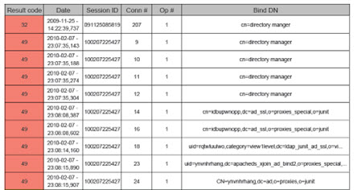
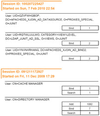

<!--
# Chapter 2: Auditing and Reporting

Reports are a key tool for monitoring the health of the RadiantOne service and should be
generated frequently to understand the performance and load on the server and audit the
activity (who is doing what and when). RadiantOne includes three default types of basic reports:
Access, Audit and Group Audit. This section describes the report settings, content of these
reports, and recommendations on report usage.

## Recommendations for Auditing and Reporting

There are four recommendations for auditing and reporting:

- To analyze/debug a problem
- To periodically monitor the health of the RadiantOne service
- To audit client activity of RadiantOne (who is connecting, doing what, and when)
- To audit configuration changes to RadiantOne

The following sections describe each recommendation in more details.

>[!warning] The scenarios provided below are general guidelines and entirely optional. You should generate reports as often as required for your deployment.

### Analyzing Problems

If consumers of the RadiantOne service are experiencing problems (time-consuming logins, expected information not being returned...etc.), the access report can be helpful in pinpointing what is happening on the server and diagnosing the problem.

The instructions in this section assume the following:

- The RadiantOne server log level has been set to a minimum of Info.
- The access log content is relevant (captures the period of time where consumers are seeing issues).
- All operations are configured to be included in the report.
- RadiantOne is configured to log to CSV (on the Settings Tab > Logs section > Server Logs, make sure the CSV Output format option is checked on the right side).

#### Starting the Log to Database Utility

The Log2DB settings can be managed from the Main Control Panel > Settings Tab > Reporting Section > Log2DB Settings sub-section.

After confirming the proper configuration, start the Log2DB Utility. On Windows platforms,
execute <RLI_HOME>/bin/runAccessLog2DB.bat <path to AccessLog2DBconfig.properties
file>. On UNIX platforms, execute runAccessLog2DB.sh <path to
AccessLog2DBconfig.properties file>. The AccessLog2DBconfig.properties file is in
<RLI_HOME>/config/log2db.

The Log2DB utility writes the access log information into a database. After, generate the Access Report from the Main Control Panel -> Settings Tab -> Reporting section -> Access Log Report sub-section. On the right side, click on the Generate Report button. The report can be found in the location indicated in the Output Location parameter which is <RLI_HOME>/reporting-birt/reports by default. If RadiantOne is deployed in a cluster, you can generate a single report that aggregates statistics from all nodes in the cluster. For more information on configuring and generating an Access Log report, see [Access Log Report Settings](#access-log-report-settings) and [Access Log Report](#access-log-report).

The summary section provides you with valuable information regarding how long operations are
taking and a summary of error codes found. In the detailed section of the report, you will find
specific entries from the log that match either a certain error code and/or exceed a response
time threshold. This information can be the starting point for further investigation and pinpoints
the location in the access log (by searching for the exact connection and operation numbers
associated with a specific operation) where the issue occurred. Sometimes, examining the
activity prior to an error can help in determining the cause of a problem.

### Monitoring the Health of the RadiantOne Service

It is typically recommended to monitor the health of the RadiantOne service over a one week period at least once a month. Pay close attention to the configured access log rotation schedule
to ensure no log content is missed (if applicable for your reports). The access log can be configured to roll over based on a configured size.

At the end of the reporting period, you can generate the Access Report from the Main Control Panel > Settings Tab > Reporting section > Access Log Report sub-section. On the right side,
click the Generate Report button. The report can be found in the location indicated in the Output Location parameter which is <RLI_HOME>/reporting-birt/reports by default.

The summary section provides you with valuable information regarding how long operations are
taking and a summary of error codes found. If these numbers are not as expected, they may
indicate areas where tuning is required. In the detailed section of the report, you will find specific
entries from the log that match either a certain error code and/or exceed a response time
threshold. With this information, you can search the exact log file location for more information
about the request that exceeded the response time. For example, if search operations are
consistently slow to respond against a certain branch in the RadiantOne namespace this could
indicate that a cache should be configured for this branch.

### Auditing RadiantOne Configuration Changes

To log configuration changes made through command line, using the vdsconfig utility, enable
config logging with the following steps:

>[!warning] these steps require downtime since all services must be stopped. If RadiantOne is deployed in a cluster, perform the following steps on each node.

1. Stop all RadiantOne services including ZooKeeper.
2. Edit <RLI_HOME>\config\advanced\features.properties and set:
    vdsconfig.logging.enabled=true
3. Restart ZooKeeper.
4. Restart all needed RadiantOne services.

Configuration changes are logged in: <RLI_HOME>/logs/vdsconfig.log

### Auditing RadiantOne Client Activity

It is typically recommended to audit RadiantOne client activity over a one-week period at least once a month.

Pay close attention to the configured access log rotation schedule to ensure no log content is missed (if applicable for your reports). The access log may be configured to roll over based on a
configured size.

You can generate the Audit Report from the Main Control Panel > Settings Tab > Reporting section > Audit Report sub-section. On the right side, click the Generate Report button. The
report can be found in the location indicated in the Output Location parameter which is <RLI_HOME>/reporting-birt/reports by default. If RadiantOne is deployed in a cluster, you can
generate a single report that aggregates statistics from all nodes in the cluster. For more information on configuring and generating an audit report, see [Audit Report Settings](#audit-report-settings) and [Audit Report](#audit-report).

>[!warning] you can also audit user activity and have the report sorted by
groups. The [Group Audit Report](#group-audit-report) is similar in output to the Audit Report. The only difference being the report categorizes user activity based on groups.

The session information is listed at the top of a section followed by the user DN that performed
the operations. Next to the user DN is a table consisting of all types of operations performed by
the user in addition to the total number of times that type of operation was performed. This
information allows you to monitor who is accessing the RadiantOne service and when, in
addition to what operations they are performing. This can help pinpoint undesirable access.

### Maintaining the Log Database

It is important to note that there is no built-in maintenance of the log database. The database
administrator responsible for the database chosen to store the log content should maintain the
database table as needed (the amount of log content stored in the database depends on
frequency the Log2DB utility is run and the activity against RadiantOne). This includes things
like sizing the table properly for log history it should store, clearing the old log content from the
table when it is no longer needed...etc.

>[!note] For assistance with establishing log maintenance and a reporting program, please contact Radiant Logic for professional services.

## Configuration

The reports are built on top of the capability of RadiantOne to store the access log content into a
database table. RadiantOne uses a separate utility named Log2DB to log into a database. There are four configuration settings that need to be considered. The [Log2DB settings](#log2db-settings), the [Access Report settings](#access-log-report-settings), the [Audit Report settings](#audit-report-settings), and the [Group Audit Report settings](#group-audit-report-settings). These are described in this section.

>[!warning] the database associated with the Log2DB settings must be running in order start the Log2DB Utility.

### Log2DB Settings

The database that houses the table which contains the RadiantOne access log content may be in any database server you choose. The default settings leverage a Derby database that is
included with RadiantOne. These settings are described below and are located on the Main Control Panel > Settings Tab > Reporting section > [Log2DB Settings](#log2db-settings) sub-section.

>[!warning] if you plan on using the RadiantOne [default report generation](#generating-reports),
then the log2db database must be Microsoft SQL Server, Oracle, Derby or PostgreSQL.

The default configuration file for logging to a database is:
<RLI_HOME>/config/log2db/AccessLog2DBconfig.properties

This properties file contains the connection information to the database where you want to store
the log table and the settings are described below.

Database Settings
The following settings are related to the database that stores the table containing the access log
contents.

- **Database Datasource**
 The name of the data source associated with the database server that will store the log content.
- Table Name
 The table name that will store the log contents.
- Mode (either Truncate or Append)
 When you start the log process, if you are in truncate mode, it empties the contents of the log table before anything new gets added. If you are using append mode, then the new log content is appended at the end of the table (rows are added).
- Table Creation
 Enter the appropriate create table syntax for the type of database you want to use. If you want to create the table on your own, then you can leave this parameter blank.

>[!warning] By default, the FILTER field in the table only allows 255 characters. If you are expecting client queries containing filters longer than 255 characters, edit the length accordingly in the create table statement and recreate the log table. Otherwise, any request from clients containing a filter longer than 255 characters is not logged into the database table by RadiantOne.

- Testing the Connection
 Click the Test Connection button to verify the connection to the database is working.
- Creating the Table
If the table that will store the access log content does not exist, use the Create Table Button to create it. Verify that the create table statement listed in the Table Creation parameter is accurate. You can also execute
<RLI_HOME>\bin\advanced\runCreateAccessLogTable.bat
(runCreateAccessLogTable.sh on UNIX) to create the log table in the database.
- Index Creation
 To create the indexes for the log table, click the Create Index button.
- Emptying the Table
 To delete the contents of the log table, click the Empty Table button.
- Dropping the Table
 To delete the log table itself, click the Drop Table button

Rules

The rules associated with logging to the database can be seen in the <RLI_HOME>/config/log2db/AccessLog2DBconfig.properties file and are based on regular expression.

- Mapping – indicates the format of the log that is parsed and reported on.
- Pattern – indicates the regular expression that is associated with the mapping.

Log Output Format

On the Main Control Panel > Settings tab > Logs section, select Access Logs. On the right side, check the CSV output format and click **Save**.

Figure 2. 1 : CSV Selected as Log Output Format

### Access Log Report Settings

The access log report settings are located on the Main Control Panel > Settings Tab > Reporting section -> Access Log Report sub-section. The default configuration file for the
access log report properties is: <RLI_HOME>/config/log2db/ReportConfig.properties. This properties file contains the information about what to include in the Access Report and the
settings are described below.

Type of Chart

These settings indicate the type of chart and logo to be used in the report. There are three types
of charts possible for the Access Report.

- Pie - A circular chart divided into triangular areas proportional to the percentages of
the whole.
- Bar - A chart with rectangular bars with lengths proportional to the values that they
represent.
- Line - Chart that displays information as a series of data points connected by straight segments.

Logo for Report

Browse to the picture that should be included at the top left corner of the report (if any).

Types of Operations

The operations that appear in the access report are: bind, base search, one level search, sub
tree search, add, modify, compare, and delete.

For each operation, you can set response time intervals, thresholds and error codes to report
on. Each of these parameters is described below. To set these parameters, select the type of
operation, and click the Edit button.

Response Time Intervals
Per operation type, you can specify the time intervals to be used as a basis for reporting
how long operations are taking to finish.

These values are in milliseconds (ms) and each interval is separated with a comma. There are five default intervals defined:
[0, 10], [11, 100], [101, 1000], [1001, 10000] and [10000, infinity].

For each interval, the report indicates how many operations (with the associated percentage) lasted between 0ms and 10ms, how many operations lasted between 11ms
and 100ms, how many operations lasted between 101ms and 1000ms, etc.

This is a good way to get an overall idea about the performance of the RadiantOne service
for handling specific types of operations.

Response Time Thresholds
Per operation type, you can specify that any operation that exceeds a specified response
time, is included in the report. Include the maximum amount of time (in milliseconds) that a
response should not exceed.

>[!note] If the check box is not checked for the Response Time Exceeding
parameter, then nothing is reported for this kind of operation.

Error Codes to Report
Per operation type you can indicate certain error codes to include in the report. Enter the
specific error codes you are concerned about.

>[!note] If the check box is not checked for the Error Codes to Report parameter,
then nothing is reported for this kind of operation.

### Audit Report Settings

The audit report settings are located on the Main Control Panel -> Settings Tab > Reporting section > Audit Report sub-section. The default configuration file for the audit report properties
is: <RLI_HOME>/config/log2db/AuditConfig.properties. This properties file contains the information about what to include in the Audit Report and the settings are described below.

Logo for Report

Browse to the picture that should be included at the top left corner of the report (if any).

Types of Operations

The types of operations to be included in the audit report should be checked. The options are as
follows:

- Bind – LDAP bind (authentication) requests received by RadiantOne.
- Add – Add entry requests received by RadiantOne.
- Modify – Update entry requests received by RadiantOne.
- Search – Search (base, one-level, sub-tree) requests received by RadiantOne.
- Delete – Delete requests received by RadiantOne.
- Compare – Compare requests received by RadiantOne.

### Group Audit Report Settings

The group audit report settings are located on the Main Control Panel > Settings Tab > Reporting section -> Group Audit Report sub-section. The default configuration file for the audit
report properties is: <RLI_HOME>/config/log2db/GroupAuditConfig.properties. This properties file contains the information about what to include in the Group Audit Report and the settings
are described below.

Logo for Report

Enter the path to the picture that should be included at the top left corner of the report (if any).

Types of Operations

The types of operations to be included in the group audit report should be checked. The options are as follows:

- Bind – LDAP bind (authentication) requests received by RadiantOne.
- Add – Add entry requests received by RadiantOne.
- Modify – Update entry requests received by RadiantOne.
- Search – Search (base, one-level, sub-tree) requests received by RadiantOne.
- Delete – Delete requests received by RadiantOne.
- Compare – Compare requests received by RadiantOne.

## Generating Reports

Details about how to generate reports and the contents of each are described in this section.

### Access Log Report

To generate the access log report:

1. Go to the Main Control Panel > Settings Tab > Reporting section > Access Log Report sub-section.
2. If needed, customize the parameters and click Save.
3. Click the Generate Report button. The Generate Access Log Report window opens.
4. You can specify a location for the reports to be stored in the Output Location field. The default location for generated reports is <RLI_HOME>/reporting-birt/reports. Alternatively, you can specify a network share path.
5. Indicate a time period the report should include (start and end dates and times).
6. To generate a report that aggregates statistics from all nodes in your RadiantOne clusterinto a single report, check the Global Report box.
7. To generate a report for a single node, indicate the server name in the Server Name field.
>[!warning] if RadiantOne is deployed in a cluster, the default behavior of the
Access Report generator is to create a report for each node. Values entered in the Server Name field override checking the Global Report Box.
8. You can specify a session ID if needed.

Figure 2. 2 : Generating an Access Log Report for a Single Node

9. Click the Generate button.

The access report consists of two main sections; a summary section followed by a detailed
section. The contents of each section are described below.

**Summary Section**

The summary appears first and starts off with two tables. The first table indicates the types of operations received by RadiantOne and the total number per operation. The second table indicates the various result codes that appear throughout the report, their meaning and the
number of times they appear. These tables are followed by sections dedicated for each type of operation (bind, base searches, one level searches, sub tree searches, add, modify, delete, and compare). These sections include a chart (line, bar or pie...depending on the configuration), in addition to two tables summarizing the results. One table details the duration intervals, the number of corresponding operations that occurred during the interval and the percentage of
these operations overall. The second table displays the result codes encountered for the
specific type of operation, their meaning and the number of times they appeared during the report.

Below is an example of the Bind Operations section from an Access Report.

Figure 2. 3 : Example of Bind Operations Summary in an Access Report using Pie Chart

If there are no operations of a certain type during a reporting period, the section allocated for the
operation has the word None in it.

**Detailed Section**

The detailed section of the report is based on what has been configured for the response time thresholds and error codes of interest. These parameters are configurable for each type of operation (bind, add, delete...etc.).

**Response Time Threshold**

If there is a response time threshold set for a specific operation, all events that exceed the
threshold appear in the detailed section of the report. The details for bind operations include
how long the operation took (in milliseconds), the date, session ID, connection #, operation #
and the Bind DN (user the operation was issued by). Below is an example of report details on
bind operations that exceed the configured threshold.

Figure 2.4 : Example of Report Details for Bind Operations Exceeding a Threshold

The details for base search operations include how long the operation took (in milliseconds), date, session ID, connection ID, operation ID, the Base DN (entry that was searched for) and the filter.

The details for one level search operations include how long the operation took (in milliseconds), date, session ID, connection ID, operation ID, the Base DN (entry where the one
level search started from) and the filter.

The details for sub tree search operations include how long the operation took (in milliseconds),
date, session ID, connection ID, operation ID, the Base DN (entry where the sub tree search
started from) and the filter.

The details for add operations include how long the operation took (in milliseconds), date,
session ID, connection ID, operation ID, the Entry (DN) to be added.

The details for modify operations include how long the operation took (in milliseconds), date,
session ID, connection ID, operation ID, the object (entry to be modified) and the modification
details.

The details for delete operations include how long the operation took (in milliseconds), date,
session ID, connection ID, operation ID, the Entry (DN) to be deleted.

The details for compare operations include how long the operation took (in milliseconds), date,
session ID, connection ID, operation ID, and information about the compare operation.

**Error Codes of Interest**

If specific error codes (or all error codes) associated with an operation type (bind, add, delete...etc.) have been configured for the report, they appear in the detailed section following the items that have exceeded the response time threshold. The details for bind operations
include the result code, date, session ID, connection ID, operation ID, and the Bind DN (user the operation was issued by). Below is an example of a report details for bind operations that return an error code of interest.

Figure 2. 5 : Example of Bind Operations Details in an Access Report

>[!note] If both the Response Time Exceeding and the Error Codes to Report options are unchecked for ALL operations (Bind, Base search, One Levelsearch, Sub Tree search, Add, Modify, Delete and Compare), the detailed part of the report is not generated. If both Response Time Exceeding and the ErrorCodes to Report options are unchecked just for a specific kind of operation, the corresponding part of the report designated for the operation is empty. However, if one of these options is enabled for a specific operation and no operations of the type are found, the part is empty, but it is still included in the detailed report.**

### Audit Report

To generate the audit report:

1. Go to the Main Control Panel > Settings Tab > Reporting section > Audit Report sub-section.
2. If needed, customize the parameters and click Save.
3. Click on the Generate Report button. The Generate Audit Report window opens.
4. You can specify a location for the reports to be stored in the Output Location field. The default location for generated reports is <RLI_HOME>\reporting-birt\reports. Alternatively, you can specify a network share path.
5. Indicate a time period the report should include (start and end dates and times)
6. To generate a report that aggregate statistics from all nodes in your RadiantOne cluster
    into a single report, check the Global Report box.
7. To generate a report for a single node, indicate the server name in the Server Name field.

>[!warning] if RadiantOne is deployed in a cluster, the default behavior of the
Audit Report generator is to create a report for each node. The values entered in the Server Name field override checking the Global Report box.

8. You can specify a session ID if needed.

Figure 2. 6 : Generating an Audit Report for a Single Node

9. Click the Generate button.

The audit report is comprised of a summary of all types of operations performed by a specific
user during a specific session.

The session information is listed at the top of a section followed by the user DN that performed
the operations. Next to the user DN is a table consisting of all types of operations performed by
the user in addition to the total number of times that type of operation was performed.

Figure 2. 7 : Example Contents of an Audit Report

### Group Audit Report

The Group Audit Report is similar in output to the Audit Report. The only difference being the
report categorizes user activity based on groups.

To generate the Group Audit report:

1. Go to the Main Control Panel > Settings Tab > Reporting section > Group Audit Report sub-section.
2. On the right side, click on the Generate Report button.
3. Specify a location for the reports to be stored.
4. Enter the groups location (use a semi-colon to separate the list of group location DNs).
5. Enter the attribute(s) containing the group members.
6. Indicate whether or not to show members without any activity in the report. If you want a report of a list of groups and the members of each group, you might not care if they have performed any requests to RadiantOne. For example, in the Group Audit Report shown below, all members of a group named Dynamic are shown in the report. Each member has N/A for their stats as they have not performed any activity during the reporting period defined.

Figure 2.8: Example Group Audit Report Containing Members with No Activity

7. Enter a time period the report should include (start and end dates).
8. Additional parameters like server name and session ID can also be included in the report if needed.
9. Click Generate.

The group audit report is comprised of a summary of all types of operations performed, grouped
by user, during a specific session.

The session information is listed at the top of a section followed by the user DN that performed
the operations. Next to the user DN is a table consisting of all types of operations performed by
the user in addition to the total number of times that type of operation was performed.

Figure 2. 9 : Example Contents of a Group Audit Report
-->