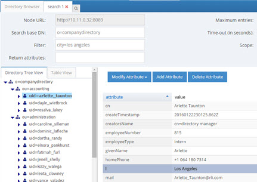
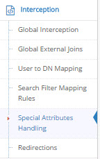
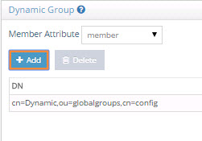
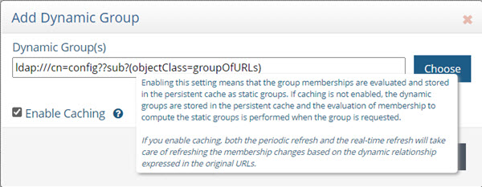
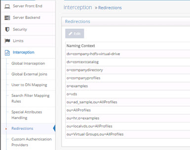
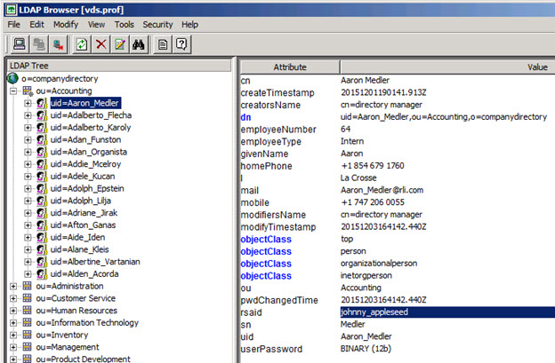

# Interception

The idea behind interception is that it allows you to customize and override the default processing of RadiantOne. In most cases, this is accomplished with interception scripts. However, there are also some built-in configuration capabilities that allow you to customize the behavior of RadiantOne within invoking a script. This section introduces Global Interception Scripts, User to DN Mapping and Search Filter Mapping Rules.

>[!note] This section is accessible only in [Expert Mode](introduction#expert-mode).

## Global Interception

For specific details, please see [Interception Scripts](concepts#interception-scripts) in the Concepts section. This section describes how to enable interception scripts at a global level (which are applicable to the entire RadiantOne namespace – all naming contexts).

To enable global interception:

1.	From the Main Control Panel > Settings Tab > Interception section > Global Interception sub section.

2.	On the right side, enable the operations you want to intercept. Save the settings and then you can edit the script. The script file is located at <RLI_HOME>\vds_server\custom\src\com\rli\scripts\intercept\globalIntercept.java


 
Figure 1: Global Interception Settings

3.	After your script has been customized, save the file and then rebuild the intercept.jar with ANT. On the RadiantOne machine, rebuild the fidsync.jar with ANT using the following syntax:
C:\radiantone\vds\vds_server\custom>c:\radiantone\vds\ant\bin\ant.bat buildjars

4.	Restart the RadiantOne service. Your script logic is now invoked for the operations you have enabled.

## Global External Joins	

A global join applies to all entries contained in any root naming context. Joins that you want to be global to RadiantOne can be configured using the Join Wizard accessed from the Global Join sub-tab. This wizard helps you configure the syntax.

For complete details on the usage and configuration of joins, please see the section titled [Joins](concepts#joins).

To configure a global join:

1.	From the Main Control Panel, go to the Settings tab > Interception section > Global External Joins.

2.	Click **Add**. The Join Wizard opens.

3.	Select Regular and click **Next**.

4.	Select an Object Class associated with the entries from the primary object that you want to join.

5.	Select the attribute you want to base the join condition on from the Join Attribute drop-down menu. Click Next.

6.	Select the data source that represents the location that contains the secondary objects you want to join with. This can be either RadiantOne or another LDAP server that has been defined as a [data source](concepts#data-source). If using RadiantOne as the secondary join source, select vds as the data source. If you want to join to some other LDAP, you must first configure the [data source](concepts#data-source) and then it appears in the drop-down list to select during this step. 

7.	Click **Browse** to locate the Base DN or enter the location yourself.

8.	Specify the scope of search to perform to find the entries to join with. The drop-down options are base, one, 
or sub.

10.	Select the specific object class associated with the secondary entries you want to join with in the Object Class parameter from the drop-down list. For information on schema extension, please see [Extending RadiantOne LDAP Schema](radiantone-ldap-schema#extending-the-radiantone-ldap-schema).

11.	Select the attribute from the secondary object that you want to base the join condition on from the Join Attribute drop-down menu. The value of this attribute should match the value of the primary source join attribute that you set in step above. The Join Condition parameter displays the attribute matching criteria for the join.

12.	Click **Next**.

13.	Decide if you would like all the possible attributes returned from the secondary object or if you would like to list the attributes to return. If you choose to list the attributes, click Add and enter the name of the attribute (or select from the drop-down list). You also can provide a virtual/mapped name (this is optional and is the name of the attribute that appears in the virtual entry). Click **OK** and repeat this process for each attribute you would like returned from the secondary object. Click **Next**.

14.	Enter a unique name for this join profile and click **Finish**.

15.	Click **Save**.

## User to DN Mapping

Typically, an LDAP client performs authentication first by searching RadiantOne for a specific user (based on configuration of the client to search for a specific attribute like cn, sAMAccountName, uid…etc.), and then issues a bind with the user DN returned in the search. These two steps are referred to as identification and credential checking respectively.

If this functionality is not implemented at the client level, RadiantOne can be configured to perform the identification step with user ID to DN mappings. This configuration describes how RadiantOne should find the user DN based on the ID that was received in the bind request.

Let’s look at the following examples to describe the difference.

In the diagrams below, the client is configured to search for the user account and then issue the bind.


Figure 2: Identification Step of Authentication


 
Figure 3: Credentials Checking Step of Authentication

If the client application is not configured (or cannot be configured) to issue a search and then bind, RadiantOne can be configured to perform the search (to find the DN). This is accomplished using User ID to DN mappings.


 
Figure 4: Authentication Process based on User ID to DN Mapping

### Manage Global User to DN Mapping

This location is just for configuring a global user ID to DN mapping. If you are configuring a mapping for [Kerberos](security#kerberos), [NTLM](security#ntlm), or [MD5](security#md5), the configuration is set in those sections located on the Main Control Panel > Settings Tab > Security section > Authentication Methods.

There are three different ways to determine the DN from the user ID (using regular expression syntax). Each is described below.

-	Setting a specific User ID to DN. In this example, if lcallahan were received in the authentication request, RadiantOne would base the authentication on the DN: cn=laura Callahan,cn=users,dc=mycompany,dc=com

```
    lcallahan (the user ID) -> (maps to) cn= laura Callahan, cn=users,dc=mycompany,dc=com
```

-	Specify a DN Suffix, replacing the $1 value with the User ID.

```
(.+) -> uid=$1,ou=people,ou=ssl,dc=com
(.+) represents the value coming in to RadiantOne. If it received a User ID of lcallahan, the DN used to issue the Bind to the underlying directory would be: uid=lcallahan,ou=people,ou=ssl,dc=com.
```

-	Specify a Base DN, scope of the search, and a search filter to search for the user based on the User ID received in the bind request.

```
(.+) -> dc=domain1,dc=com??sub?(sAMAccountName=$1)
```

If RadiantOne received a User ID of lcallahan, it would issue a search like:

```
dc=domain1,dc=com??sub?(sAMAccountName=lcallahan)
```

Then, a bind request is issued with the user DN that is returned.

For options 2 and 3 described above, multiple variables can be used (not just 1 as described in the examples). Let’s look at an example mapping that uses multiple variables:

```
(.+)@(.+).(.+).com -> ou=$2,dc=$3,dc=com??sub?(&(uid=$1)(dc=$3))
```

If RadiantOne received a user ID like laura_callahan@ny.radiant.com, the search that would be issued would look like:

```
ou=ny,dc=radiant,dc=com??sub?(&(uid=laura_callahan)(dc=radiant))
```

RadiantOne uses the DN returned in the search result to issue the Bind request to the backend directory.

### Processing Multiple Mapping Rules

Many User to DN Mapping rules can be configured. They are processed by RadiantOne in the order they appear.

If a single User ID is found with the first mapping rule, then no other rules are evaluated. If the credential is correct, the user is authenticated (by the underlying directory). If the credentials are not correct, the authentication fails. If the authentication fails, no other DN mapping rules are executed. Only if the user is not found using the first DN mapping rule or if multiple users are returned based on the first rule causing ambiguity, will the other rules be evaluated. 

For example, if Laura Callahan, with a login of laura_callahan, is in two sources and there are two DN Mapping rules configured:

```
dc=domain1,dc=com??sub?(sAMAccountName=$1)
uid=$1,ou=people,ou=ssl,dc=com
```

The first DN Mapping rule is evaluated (dc=domain1,dc=com??sub?(sAMAccountName=laura_callahan)

If Laura Callahan’s account is found from the search, a BIND request is issued using her DN. If the credentials don’t match what are in the underlying directory, the authentication fails. The second DN mapping rule is NOT evaluated. Only when the first DN mapping rule fails to find a user, or if multiple users are returned by the first rule (causing ambiguity), will the other DN mapping rules be used. If no other rules are defined, the authentication fails.

## Search Filter Mapping Rules

As an alternative to writing an interception script for modifying an incoming query search filter, you can configure search filter mapping rules. This allows you to translate an incoming search filter into an alternative filter. The translation is based on regular expression syntax and configurable from the Main Control Panel > Settings Tab > Interception section > Search Filter Mapping Rules sub-section. These mapping rules are invoked at a global level meaning that no matter what naming context/base DN a client indicates in their search request, these filter mapping/translation rules are applied.

The general syntax is to define incoming filter criterion that you want to intercept and then what you want to replace it with. Since an incoming LDAP filter can be quite complex and involve many attribute conditions, you could have a variable to translate each of these filter components. However, the filter pattern syntax indicated in the configuration always starts with a (.*) and end with a (.*). This indicates that everything in the filter prior to and every part of the filter after the components you want to translate should remain the same. For example, an incoming LDAP filter could be something like: (&(objectclass=user)(l=Novato)(title=Sales Manager)). Let’s assume you want to translate filters like this into (&(objectclass=user)(city=Novato)(title=Sales Manager)). Therefore, the incoming filter pattern would look something like this: (.*)\(l=(.+)\)(.*) meaning that every part of the filter before the component using the l attribute and every part of the filter after the component using the l attribute should remain the same, and the “l” component should be translated into “city”.

Below are some examples of search filter mappings.

For this example, if an LDAP search filter contains “city”, it is replaced by a search for the attribute “l”. Using regular expression, define that any filter with the pattern (.*)\(city=(.*) should be replaced by $1(l=$2), as shown below.


 
Figure 5: Sample Search Filter Mapping

If RadiantOne receives a request containing a filter of (city=Los Angeles), all entries with l=Los Angeles are returned. This is shown in the example below.


 
Figure 6: Sample Result of Search Filter Mapping

The (.*) before and after city in the filter pattern ensures all information before and after city in the incoming LDAP filter is not translated. For example, if the incoming filter is something like (&(city=Los Angeles)(employeeType=Manager)), while the filter component for city is replaced by “l”, the search for employeeType=Manager is not translated. Therefore, the search filter is processed as: (&(l=Los Angeles)(employeeType=Manager)). An example is shown below.


 
Figure 7: Sample Search Filter Mapping Result

The search filter mapping rules can also be used to replace more than one attribute condition in a single search. For example, assume you want all searches for city and title to be replaced by location (“l”) and employeetype, therefore, the filter pattern could be defined as: (.*)\(city=(.+)\)\(title=(.+)\)(.*) and the replacement pattern as $1(&(l=$2)(employeetype=$3))$4


 
Figure 8: Sample Search Filter Mapping

Now, as a runtime example, all searches containing a filter for (&(city=Los Angeles)(title=Manager)) will return a list of entries with l=Los Angeles and employeetype=Manager and this can be seen in the screen below.


 
Figure 9: Sample Search Filter Mapping Result

The translation rule isn’t limited to a one-to-one attribute mapping. You can also leverage a lookup based on the incoming filter to determine what the filter should be translated into. In the following example, a lookup will be performed against the vds data source (as indicated by the [vds] part of the LDAP URL used in the replacement pattern) on the o=companydirectory branch for entries containing an attribute of postalCode=<the value of the zipcode received in the incoming filter>. The “l” attribute for this entry is returned and passed in the filter for processing instead of the value of the zipcode. The incoming filter and replacement patterns are shown below:

Incoming Filter: (.*)\(zipcode=(.+)\)(.*)

Replacement: $1(l=`ldap://[vds]/o=companydirectory?ou?sub?(postalcode=$2)`)$3

>[!warning] in the replacement syntax, the LDAP URL is enclosed in backticks/grave accents (generally located below the tilde character on keyboards), not to be mistaken for single quotes.**


 
Figure 10: Sample Search Filter Mapping with Lookup

According to the filter pattern in this example, if the incoming filter included (zipcode=94949), it would be translated into a filter of l=Novato (lookup in vds data source where postalcode=94949 and returning the l attribute for this entry). Therefore, in this example, all entries with l=Novato are returned by the search and a sample can be seen below.


 
Figure 11: Sample Search Filter Mapping Result

## Special Attributes Handling

The Special Attributes Handling options allow you to perform the following functions: 

-	Configure the automatic relationship management between linked attributes
-	Configure Referential Integrity 
-	Configure Dynamic Groups
-	Configure Attribute Uniqueness
-	Configure unnesting of groups

### Linked Attributes

The Linked Attributes setting is only compatible with entries located in RadiantOne Universal Directory stores or persistent cache.

Linked attributes are attributes that allow relationships between objects. A typical example would be isMemberOf/uniqueMember for user/groups objects. A group has members (uniqueMember attribute) which is the forward link relationship. Those members have an isMemberOf attribute which is the back link (to the group entry) relationship. Other examples of linked attributes are:

```
manager/directReports
altRecipient/altRecipientBL
dLMemRejectPerms/dLMemRejectPermsBL
dLMemSubmitPerms/dLMemSubmitPermsBL
msExchArchiveDatabaseLink/msExchArchiveDatabaseLinkBL
msExchDelegateListLink/msExchDelegateListBL
publicDelegates/publicDelegatesBL
owner/ownerBL
```

The most common back link/forward link relationship is between group and user objects. A list of groups a user is a member of can be automatically calculated by RadiantOne and returned in the membership attribute of the user entry. The default attribute name for the back link attribute is isMemberOf. However, you can configure any attribute name (e.g. memberOf) you want. 

The back link attribute is returned only when explicitly requested by a client unless the back link location and forward link location are stored in a RadiantOne Universal Directory store or Persistent Cache and the Optimize Linked Attribute option is enabled, in which case the back link attribute is always returned even when not requested (unless [Hide Operational Attributes](settings-tab#hide-operational-attributes) is enabled). Also, if the groups returned in the backlink attribute (isMemberOf/memberOf) can be members of other groups (nested groups) and you want to un-nest/flatten these groups (return all the groups in isMemberOf/memberOf), you must check the option to [Enable Nested Groups](access-control#enable-nested-groups) on the Main Control Panel > Settings tab > Security section > Access Control sub-section. Users can also be members of dynamic groups (indicated in the criteria of the memberURL attribute of the group entry).

To configure rules for linked attributes, following the steps below:

1.	On the Main Control Panel, click Settings > Interception > Special Attributes Handling.


 
Figure 12: Special Attributes Handling

2.	Under the Linked Attributes section, click **Add**. The Configure Mapping window is displayed.

3.	Select a back link attribute name from the drop-down list. If you don’t find the attribute that matches your needs, manually enter the attribute name. This dictates which attribute name RadiantOne returns the back link attribute value as and is generally either memberOf or isMemberOf (for group/user linked attributes).

4.	Click **Choose** next to the Target Base DN field. The Choose your base DN window is displayed.

5.	Select a base DN containing the entries (e.g. users) for which the back link attributes should be managed. In the example below, ou=allprofiles is selected.

>[!warning] If your users and groups are in RadiantOne Universal Directory stores, and you plan on enabling the Optimize Linked Attribute setting and must support nested groups, only one user location per Universal Directory store is supported. For example, having a user location configured for ou=people1,dc=myhdap and ou=people2,dc=myhdap (both in the same dc=myhdap store) is not supported. In this case, you should configure a single user location as dc=myhdap as a shared parent for both user containers. For information about the Optimize Linked Attribute function for Universal Directory stores, see the Namespace Configuration Guide. For information about the Optimize Linked Attribute function for persistent cache stores, see the Deployment and Tuning Guide.


 
Figure 13: Selecting a Location for Users

6.	Click **OK**. You are returned to the Add Linked Attribute Mapping window.

7.	Under Source Base DNs, click **Add**. The Choose your base DN windows is displayed.

8.	Select a base DN containing the entries (e.g. groups) applicable for the objects (containing the forward link) matching what was defined in step 5 above and click **OK**. In the example below, ou=allprofiles is selected.

9.	In the source object class list, verify the list includes the class associated with your entries (e.g. groups). Add any missing object classes.

10.	If the Source Base DNs location is for group objects, and the groups can be nested (contain members that are groups), check the option to Enable Nested Relationships.

11.	Click **OK**. The configuration is displayed in the Linked Attributes section.


 
Figure 14: Linked Attributes Configuration Rules

12.	Click **Save** in the upper right corner.

13.	To view the results of the example used in this section, on the Directory Browser Tab, and expand the ou=allprofiles and then example the ou=ad_sample node.

14.	Select a user under ou=ad_sample (e.g. cn=Aggie_Newcombe) and select Search . The Search window is displayed.

15.	In the Return Attributes field enter ismemberof (assuming this is the back link attribute name configured for returning the groups).

16.	Select the Subtree option for Scope.

17.	Click **Search**. 

18.	In the Directory Tree View pane, click the user value. The results are displayed as shown below.


 
Figure 15: Example of isMemberOf Calculation

The user Aggie Newcombe is currently a member of groups named Global, Inside Sales and Sales as referenced by the values of the isMemberOf attribute returned for her entry. If she were removed from one of these groups, or added to a new group located below ou=allprofiles, her isMemberOf attribute would reflect this automatically.
 
### Referential Integrity

Referential integrity is the process of automatically maintaining consistent relationships among certain entries. This mechanism ensures that any references to an entry are updated whenever that entry is removed or altered. If it is configured, during every LDAP add, modify, delete, and rename operation, RadiantOne updates all necessary DN references (all other entries that refer to that entry). For example, if you remove a user's entry from the directory, and the user is a member of a group, the server also removes the user from the group. If referential integrity is not enabled, the user remains a member of the group until manually removed. Historically, referential integrity is primarily used to ensure that attributes with a distinguished name syntax (especially group membership attributes like member and uniqueMember) are properly maintained in the event of delete or modify DN operations. For a delete operation, any references to the target entry are removed. For modify DN operations, any references to the target entry are renamed accordingly.

The following referential integrity rules are supported by RadiantOne:

-	Disabled
Referential integrity is not enforced for the specified Base DN.
-	Enabled
Referential integrity applies to the member, uniquemember and manager attributes by default. Add any attribute that is of type DN syntax as needed (comma-separated if you need to list many attributes). Some examples are: owner and managedBy.


If referential integrity is enabled, and you want RadiantOne to ensure any values entered for member/uniquemember, or attribute in this list, references a valid DN in the Directory Information Tree (DIT), check the “Validate User Exists in DIT” checkbox. If this option is selected, and a value does not reference a valid Distinguished Name (DN) that is part of the current DIT, the modify operation will fail. Error code 19 will be returned indicating a referential integrity violation.

Referential integrity is only supported for Universal Directory stores and persistent cache. This means that the users and groups locations configured must point to a Universal Directory store or persistent cache.

>[!warning] If you cache entries from a directory backend that maintains referential integrity, and use a native change type for detecting changes for cache refresh (e.g. Changelog, Active Directory, DirSync), you must list all backlink attributes that need refreshed in the cache when a change is detected on the main object. For example, to update the directReports attribute in the persistent cache when a change is detected on a user entry, list the manager attribute in the List of Referential Integrity Attributes property. Some common related attributes typically found in Active Directory are listed below (this list is not exhaustive):
     member/memberOf
     manager/directReports
     owner/ownerBL
     altRecipient/altRecipientBL
     dLMemRejectPerms/dLMemSubmitPermsBL
     publicDelegates/publicDelegatesBL

Referential integrity is not enabled by default. To enable and configure it, following the steps below.

1.	From the Main Control Panel > Settings Tab > Interception section > Special Attributes Handling sub-section, locate the Referential Integrity section on the right side.

2.	Click **Add**.

3.	In the Groups Location section, click **Add**.

4.	Navigate to the container where group entries are located and click **OK**. Referential integrity is enforced for any group below this location. The groups must be in a Universal Directory store or persistent cache.

5.	In the Users Location section, click **Choose** and navigate to the location containing the possible members associated with the groups you defined in the previous step. The users must be in a Universal Directory store or persistent cache. If a user is moved or deleted from this location, all groups referencing this user entry are updated accordingly (the value is updated or deleted). Click **OK**.

6.	Select the applicable referential integrity rule (based on the descriptions above) and click **OK**.

7.	Click **Save** in the top right.

### Dynamic Groups

For dynamic groups, the membership is determined by search criteria using an LDAP URL as opposed to being maintained explicitly in a list. For example, suppose that you want a Sales group to contain every employee that has a title of Sales Manager. To do this, you create a dynamic group named Sales associated with the groupOfURLs objectclass. Then, instead of statically assigning member DNs as unique members (in the member or uniqueMember attribute), you define a memberURL attribute that contains the LDAP URL and criteria (seach base, scope and filter) to be used for determining members of the group. 

Dynamic groups are not enabled by default. Therefore, any groups in RadiantOne associated with the groupOfURLs objectclass will have their memberURL returned directly to clients as is. This group could be in a Universal Directory store, or virtualized from some LDAP backend. 

To enable support for dynamic groups, follow the steps below.

1.	From the Main Control Panel > Settings Tab > Interception section > Special Attributes Handling sub-section, locate the Dynamic Groups section on the right side.

2.	Select either member or uniquemember from the Member Attribute drop-down list. This will determine the attribute name that will contain the members of the dynamic groups.

3.	Click **Add**.

4.	Browse to the exact group entry that you like RadiantOne to automatically evaluate members for and click OK. To configure this logic for multiple groups located in the same container, just enter an LDAP URL that encompasses all groups instead of browsing to the exact group entry. E.g. ldap:///cn=config??sub?(objectClass=groupOfURLs) could be used to indicate all dynamic groups located below cn=config. If you are not knowledgeable about LDAP URL syntax, just browse to the container/parent node where all dynamic groups are located and the LDAP URL is automatically calculated for you.

Below is an example of a dynamic group indicating a memberURL of: ldap:///ou=ad_sample,ou=allprofiles??sub?(&(objectclass=*)(l=San Mateo)) and how this would be configured respectively.


 
Figure 16: Dynamic Group Example


 
Figure 17: Dynamic Group Configuration

5.	Repeat steps 3 and 4 to add all dynamic groups. 

6.	Click **Save** in the top right.

7.	If the group configured in step 4 above is in a proxy view of an LDAP backend (as opposed to located in an HDAP store), you must configure DN Remapping for the memberURL attribute. From the Directory Namespace tab, select the node where the proxy is mounted below the Root Naming Contexts section.

8.	On the Attributes tab on the right side, click **ADD**.

9.	Enter memberURL for the Name and Virtual Name properties.

10.	Check the DN Remapping option.

11.	Click **OK**.


Figure 18: Defining memberURL Attribute for DN Remapping

12.	Click **Save** in the upper right.

For groups defined in this section, RadiantOne automatically evaluates and computes the list of members based on the memberURL attribute indicated in the group. The group named “Dynamic” configured above would be returned by RadiantOne as a virtual static group like shown below (with the member list computed automatically based on the criteria indicated in the memberURL attribute). 


Figure 19: Example - Dynamic Group Translated into Virtual Static Group

>[!note] To avoid returning duplicate entries, when a dynamic group is queried in RadiantOne, if both member and memberURL are requested, the memberURL attribute is not returned.

#### Caching Dynamic Groups

If the dynamic groups are from a proxy view of an LDAP backend you can choose to cache the group entries. If the dynamic groups are in a Universal Directory store, you cannot cache them since persistent cache is not applicable for Universal Directory stores. 

The default and recommended behavior of RadiantOne for cached dynamic groups is to only cache the group entry with the memberURL attribute not computed. Based on requests from clients, RadiantOne computes the memberURL to return a static list of members as needed. 

If you require the group members to be cached as static group entries, check the Enable Caching option when you define the Dynamic Group in Special Attributes Handling. Enabling this setting means that the static groups are stored in the persistent cache (members are evaluated and cached in the member attribute) and refreshed as needed with either a periodic refresh or a real-time refresh. If caching is not enabled, the dynamic groups are stored in the cache, and the evaluation of membership to compute the static group is performed when the group is requested. 

>[!note] if the location of the dynamic group is already configured for persistent cache when you select to Enable Caching in the dynamic group setting, you must reindex the persistent cache to ensure the group members are also in the cache.



Figure 20: Cache Setting for Group Members

### Attribute Uniqueness

Attribute Uniqueness enforcement is applicable to RadiantOne Universal Directory stores only.

Certain attribute values (e.g. uid) should be unique across a given container or Directory Information Tree (DIT). The server stops any operation that tries to add an entry that contains an existing value for the given attribute. It also stops any operation that adds or modifies the attribute to a value that already exists in the directory.

Attribute uniqueness is not enabled by default. To define which attributes require unique values, follow the steps below.

1.	From the Main Control Panel > Settings tab > Interception section > Special Attributes Handling sub-section, locate the Attribute Uniqueness section on the right.

2.	In the Attribute Uniqueness section, click **Add** and enter the Base DN (location of a Universal Directory store) for which attribute uniqueness should be enforced. All entries below this point require unique values for the attributes indicated in the next step.

3.	Enter a list of comma-separated attributes that should contain unique values. In the example shown in the screen below, the attributes uid and mail must be unique across all entries located below o=local.


Figure 21: Attribute Uniqueness Example

4.	Click **Save** in the upper right corner.

Repeat these steps to configure attribute uniqueness checking for additional containers/branches.

#### Testing Attribute Uniqueness

To test attribute uniqueness, you must have an LDIF file containing all entries you want to check attribute uniqueness for.

To verify uniqueness of attribute values in an LDIF, you can use the Attribute Uniqueness function of the <RLI_HOME>/bin/advanced/ldif-utils utility. Once you have an LDIF file containing entries, pass the file name, path, and the name(s) of the attribute(s) to be verified. The usage is shown below. 

```
ldif-utils AttrUniqueness -f <ldif file path> -u <list of (comma-separated) attributes>
```

An example command analyzing values for the attributes givenName and telephonenumber is shown below. 

```
c:\radiantone\vds\bin\advanced>ldif-utils.bat AttrUniqueness -f c:\globaldirectory.ldif -u givenname,telephonenumber
```

If the utility returns the result, “Attribute Uniqueness check successful”, the values for the analyzed attribute(s) are unique. In this example, the utility returns the following at the end of completion of the command. 

```
Checking attribute uniqueness...
Attribute Uniqueness check successful.
Done in 9ms
```

In the following example command, the attributes givenName and facsimiletelephonenumber are analyzed.

```
c:\radiantone\vds\bin\advanced>ldif-utils.bat AttrUniqueness -f c:\globaldirectory.ldif -u givenname,facsimiletelephonenumber
```

If the utility returns the result, “Attribute Uniqueness check result false”, entries sharing the same value for at least one analyzed attribute were detected. In this example, the utility returns the following at the end of completion of the command.

```
Checking attribute uniqueness...
Attribute Uniqueness check result false. Entries with duplicates:
uid=bgreene,ou=users,o=globaldirectory
uid=cbaldwin,ou=users,o=globaldirectory
uid=fhostetler,ou=users,o=globaldirectory
uid=jhiggins,ou=users,o=globaldirectory
uid=kchung,ou=users,o=globaldirectory
uid=mhue,ou=users,o=globaldirectory
uid=mpoole,ou=users,o=globaldirectory
uid=owright,ou=users,o=globaldirectory
uid=ytanaka,ou=users,o=globaldirectory
Done in 12ms
```

### Unnest Groups

Some directory vendors, like Microsoft Active Directory, support nested groups where groups can be members of other groups. For clients that are unable to process nested groups, RadiantOne can flatten them and return all members in a single response. The unnest groups setting is applicable to proxy views or model-driven views (designed in Context Builder) that have been configured for persistent cache. Flattening nested groups adds processing overhead to RadiantOne, so persistent cache is required for optimal performance, and you must configure the unnest groups setting before initializing the persistent cache. The unnest group setting is not applicable to Universal Directory stores.

>[!note] Using a computed attribute in the virtual view to unnest groups is an alternative to using the unnest groups setting. However, the computed attribute approach does not support circular groups (GroupA is a member of GroupB and Group B is a member of GroupA) whereas the unnest groups setting does.**

The unnest groups setting is not enabled by default. To define a naming context that contains nested groups that RadiantOne should automatically flatten for client queries, follow the steps below.

1.	From the Main Control Panel > Settings tab > Interception section > Special Attributes Handling sub-section, locate the Unnest Groups section on the right.

2.	Click **Add**.

3.	Click **Add** and select the naming context that contains the nested groups.

4.	Click **OK**.

5.	Click **OK** to close the configuration window.

6.	Click **Save**.

7.	Configure the persistent cache for the virtual view containing the nested groups. For help with configuring persistent cache, see the RadiantOne Deployment and Tuning Guide.

## Redirections

By default, RadiantOne handles operations against a naming context associated with a Universal Directory (HDAP) store locally. However, in certain deployment scenarios (e.g. for performance or multi cluster deployments), not all stores should receive all types of operations. For each naming context representing a Universal Directory store, you can dictate whether write and bind operations should be redirected to another RadiantOne server. 

First, all RadiantOne servers must be defined as data sources in the Main Control Panel > Settings Tab > Server Backend section. Then, from the Settings Tab > Interception section > Redirections sub-section, select the naming context where you would like to redirect operations on the right side.

If you want to redirect write operations to another RadiantOne cluster, select a branch and click **EDIT**. In the “Redirect Write Operations (Add, Modify, Delete) To” drop-down list, select the data source representing the location where you want the writes to be sent.

For redirected writes, you also have the option to define the local write mode. This functionality requires Inter-Cluster replication to be enabled on the Universal Directory store. For details on Inter-Cluster replication, please see the RadiantOne Deployment and Tuning Guide. The options are as follow:

-	Write locally after reading from redirected source (default behavior).

    The write request is redirected and if it is successful the local store is written to after reading from the remote source. This functionality requires Inter-Cluster replication to be enabled on the Universal Directory store.

-	No local write.
<br>The write request is redirected to the remote data source. There is no immediate update made to the local store. This functionality requires Inter-Cluster replication to be enabled on the Universal Directory store.

-	Write locally based on the request.
<br>The write request is redirected and if it is successful the local store is also written to immediately. This functionality requires Inter-Cluster replication to be enabled on the Universal Directory store.

In all the above cases, the local entry is also updated later through inter-cluster replication.

You may also condition the write redirection based on attributes received in the modify request. Modifications to certain attributes, generally operational ones like pwdAccountLockedTime, pwdFailureTime…etc, should be handled locally and not redirected. List these conditional attributes (comma separated) in the Attributes Preventing Redirection on Write Operations property. Write operations are not redirected if any of the attributes defined in this property are present in the request.

If you want to redirect bind operations to another RadiantOne server, select a branch and click Edit. In the ‘Redirect Bind Operations To’ drop-down list, select the data source to direct bind operations to.

When you are finished, click **Save** in the top right corner.

For more examples of using redirects, please see the RadiantOne Deployment and Tuning Guide.



Figure 22: Operations Redirection Setting

## Custom Authentication Providers

RadiantOne includes a framework for calling custom authentication services like RSA SecurID and Yubicloud. This allows standard LDAP applications to benefit from stronger, multi-factor security without requiring any changes to their authentication logic. Users of the application can log in with their existing ID and password + tokencode/One Time Password (OTP). RadiantOne translates the standard LDAP authentication (bind) request into a validation of the user’s password to the authoritative source (whether that is local in RadiantOne namespace or some other authoritative backend) and a call to your specialized authentication service like RSA SecurID (or others) to validate the rest of the credentials. The custom authentication service may provide validation for the entire credentials (e.g. user’s password plus additional tokencode/pin/OTP) or just a portion of the credentials (e.g. just validate the tokencode/pin).

>[!note] Logic for Custom Authentication Providers is invoked like an interception script. As such, any global interception scripts defined in RadiantOne are executed before custom authentication providers.

RadiantOne includes sample scripts for RSA SecurID and Yubikey. For details on this configuration and how to test, please see the Custom Authentication Providers Guide.

### Configuring Custom Authentication Providers

Many different custom authentication providers can be defined, each configured for a specific naming context/branch in the RadiantOne namespace where you want this logic to be invoked.

>[!warning] RadiantOne includes code to call Yubicloud (yubikeys) or RSA SecurID. All other MFA solutions require customization. These customizations are typically implemented by the Radiant Logic Solution Integrator team via professional services. If the 2nd factor is a form of code/one-time password that can be appended to the password in the bind (by the client app) and RadiantOne can call a service to validate the code, then we should be able to support it. If you are interested in integrating with an MFA solution, contact your Radiant Logic Account Representative to discuss the use case.

The following configuration steps should be considered when defining a custom authentication provider. An example script named RsaRestAuthenticator.java is included in RadiantOne at <RLI_HOME>\vds_server\custom\src\com\rli\scripts\customobjects\rsa. 

1.	Using Java, define a class that implements com.rli.web.http.service.twofactor.UserDefinedAuthenticator to pass the parameters for leveraging your external authentication service. 

2.	The input parameters are:
    -	bindDN property, which always has the DN of the user sent in the bind request to RadiantOne.
    -	userID property, which has the ID of the user in the RadiantOne namespace as a result of the DN to ID setting in the [Custom Authentication Provider](#custom-authentication-providers). If the attribute does not exist in the virtual entry, or if the attribute is empty, the value passed to the script is blank.
    -	password property, which contains the full password is always passed.
    -	property PROP_PASSWORDXTRACT is the result of the regular expression defined for the password in the Custom Authentication Provider. If nothing is defined in the [Custom Authentication Provider](#custom-authentication-providers), this is blank.
    -	property PROP_TOKENXTRACT is the result of the regular expression defined for the pincode in the Custom Authentication Provider. If nothing is defined in the [Custom Authentication Provider](#custom-authentication-providers), this is blank.

3.	Save the script and rebuild the customobjects.jar file with ANT. An example using ANT is shown below. 
C:\radiantone\vds\vds_server\custom>c:\radiantone\vds\ant\bin\ant.bat buildjars

4.	Restart the RadiantOne service. If deployed in a cluster, restart the service on all nodes.

5.	Define a custom data source from the Main Control Panel > Settings tab > Server Backend section > Custom Data Sources with the required properties to connect to your authentication service.

6.	In Custom Data Sources, on the right, click **ADD**.

7.	Enter a unique data source name.

8.	In the Custom Properties section, click **Add**.

9.	Enter the property name and value required to connect to your external authentication service and click **OK**.

10.	Repeat steps 7-8 to add all required properties to connect to your external authentication service. One of the properties should be named classname and contain a value of the classname generated by your Java script created in step 1.

11.	Click **Save**.

12.	Navigate to the Main Control Panel > Settings tab > Interception section > Custom Authentication Providers.

13.	On the right, click **ADD**.

14.	Enter a unique name for the custom authentication provider.

15.	Enter the location/naming context in the virtual tree where the custom authentication should be invoked in the Base DN property.

16.	Using regular expression syntax, enter the criteria to extract the password part from the password value received in the LDAP bind request. This is optional and you may choose to do the parsing and handling of the password logic directly in the script instead.

17.	Using regular expression syntax, enter the criteria to extract the PIN/passcode part from the password value received in the LDAP bind request. This is optional and you may choose to do the parsing and handling of the password logic directly in the script instead.

18.	The DN to ID property is used by RadiantOne to lookup the user’s local entry and retrieve the attribute to identify the user in the external authentication service. In the DN to ID property, enter the attribute name in the virtual entry that stores the value of the user that uniquely identifies them in the external authentication service. In the example below, rsaid is the value entered in the DN to ID property. This means that the value of the rsaid in the user’s virtual entry is used to delegate the credentials checking to the external authentication service. 


 
Figure 23: Example Custom Authentication Provider

Continuing with this scenario, in the example shown below, the unique ID of johnny_appleseed is sent to the external authentication service when the user identified by a DN of uid=Aaron_Medler,ou=Accounting,o=companydirectory authenticates to RadiantOne.



Figure 24: Example Describing the Usage of the DN to ID Property

19.	In the Data Source Name property, enter the name of the custom data source you defined which contains the connection criteria for the custom authentication service. This was defined in steps 4-10 above.

20.	Select the EXTERNAL_REQUIRED mode. The EXTERNAL_IGNORE mode can be used to disable the call to the custom authenticator, in which case RadiantOne processes the bind request using the default behavior.

21.	Click **Save**.

22.	Restart the RadiantOne service. If a cluster is deployed, restart the service on all nodes.
