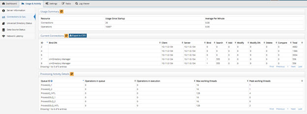
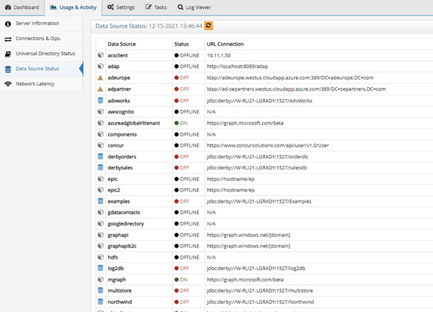
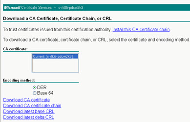
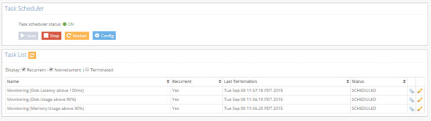

# Using the Server Control Panel

The Server Control Panel allows RadiantOne administrators to configure and monitor a specific RadiantOne node. If a cluster is deployed, all nodes can be monitored and some aspects can be managed from the Main Control Panel. However, there are some configurations that must be managed separately for each node like server certificates.

Node/server specific configuration is managed from the Server Control Panel. The Server Control Panel associated with each RadiantOne server can be launched from the Dashboard tab of the Main Control Panel.

The configuration and monitoring features described in this section are applicable to the Server Control Panel. Configuration and monitoring features associated with the Main Control Panel are described [here](radiantone-control-panels#using-the-main-control-panel).

## Dashboard Tab

A series of graphs are displayed on the Dashboard tab and allow for monitoring a variety of aspects related to a given RadiantOne node. The graphs display CPU usage, JVM memory usage, disk space usage, disk latency and number of client connections.

>[!warning] To use this feature, enable the cluster monitor at Main Control Panel > Settings > Logs > Clustermonitor.


Figure 1: Graphs Related to a Specific RadiantOne Node

In the upper right, you can indicate the time range the graphs should display. To indicate a time period of longer than 12 hours, choose the Custom option.


 
Figure 2: Graph Range

>[!warning] it is generally not recommended to expand the graph range beyond a 12-hour period since it causes a large amount of HTTP and LDAP requests to RadiantOne that is proportional in quantity to the length of the time period requested. For example, a 12-hour period generates ~100 requests.

## Usage & Activity Tab

From the Usage & Activity tab on the Server Control Panel, you can access information about the RadiantOne software version installed on the node, monitor the current connections and operations, view statistics for all Universal Directory (HDAP) stores and view network latency between nodes (only applicable to cluster deployments).

### Server Information

Specific product details associated with the node are shown in the Server Information section.


 
Figure 3: Server Information

**Server Name** – Indicates the machine name where RadiantOne is installed.

**Resolved IP** – The resolved IP address associated with the host name of the machine.

**Port** – Indicates the non-SSL (LDAP) port for the RadiantOne service.

**SSL Port** – Indicates the SSL (LDAPS) port for the RadiantOne service.

**SSL Enabled** – Indicates if SSL is enabled for the RadiantOne service. This is the LDAPS port.

**Installation Path** – Indicates the file system path where RadiantOne is installed.

**Java Home** – Indicates the location of Java in the environment being used by RadiantOne.

**Java Version** – Indicates the Java version used by RadiantOne.

**Server Startup Time** – Indicates the time the RadiantOne service was last started.

**Cloud ID** – The unique GUID associated with the RadiantOne node. 

**Created Time** – Indicates the time RadiantOne was installed.

**Node Type** – Indicates the type of node. If RadiantOne is deployed in a cluster, the value could be core (leader), core (follower) or follower only. If RadiantOne is deployed in a classic (active/active or active/passive) all servers are leaders.

**RadiantOne Leader** – Has a value of true if the RadiantOne node is the leader of the cluster. Otherwise the value is false, meaning it is a follower or follower only node in the cluster. If RadiantOne is deployed in a classic (active/active or active/passive) all servers are leaders.

**Product** - SKU associated with the RadiantOne version.

**Version** – Indicates the version of the RadiantOne.

**Build** – Indicates a specific build ID associated with RadiantOne.

**License Type** – Indicates the type of RadiantOne license used along with the email address and company name the license key was issued to.

## Connections & Operations

From the Connections & Ops section you can view the current usage summary in terms of connections and operations to RadiantOne.


 
Figure 4: Server Connections and Operations

In the Usage Summary section, you see connection usage since startup and average per minute. You all see operations since startup and average per minute.

In the Current Connections section, there is a summary of operation types per connection (including a total number of operations) and the bind user that established the connection. You will also see the Client IP address associated with the open connections. To export current connection data into a CSV-format report, click **Export to CSV**. The Select CSV File window opens. Specify a file location (within <RLI_HOME>) or keep the default (<RLI_HOME>/vds_server/logs). Specify a file name. Click **OK**. If you specify a location that contains a CSV with the same file name, you are asked if you want to overwrite the existing file.

The data used to calculate these numbers can be found by querying RadiantOne with a base DN of cn=monitor. When you query RadiantOne with a base DN of cn=monitor (from the RadiantOne LDAP Browser, or any other LDAP client), the result is 1 entry per established connection. Each entry includes how many operations the client has performed and what the operation was (bind, search, compare, delete, modify, or add). For details on the information available in cn=monitor, please see the RadiantOne Monitoring and Reporting Guide.

The Processing Activity Details section, shows how many operations are waiting to be processed, how many operations are currently being executed in addition to the maximum working threads available and peak worker threads used.

### RadiantOne Universal Directory (HDAP) Status

Statistics for the stores can be viewed from the Universal Directory Status section. To filter the stores displayed, click on  and then click Select Filters. Select the stores to display and click OK.


 
Figure 5: Tables to Display

For each store, you see total number of entries, index size, search operations per second and write operations per second.


 
Figure 6: RadiantOne Universal Directory Stores

### Data Source Status

In the Data Source Status you can see the status of all data sources defined in RadiantOne. A green dot in the Status column indicates that the data source is configured properly and running. A red dot in the Status column indicates that something is wrong with the data source configuration and RadiantOne cannot currently access it. There is a corresponding error message that states the main problem. If the error is due to incorrect connection information, update the data source on the Main Control Panel > Settings Tab > Server Backend section. Once the error has been corrected click on the refresh icon next to “Data Source Status” and the data source information refreshes to reflect your changes.



Figure 7: Data Source Status

The status values are on, off, offline, and unavailable. The following table describes each status. 

Status	| Definition
-|-
On	| RadiantOne can connect to the data source.
Off	| The connection test to the data source failed.
Offline	| The data source’s active property is set to false.
Unavailable	| No classname property is defined for the data source.

### Network Latency

The graphs in the Network Latency section display the network latency between nodes in a cluster in addition to the network latency on the local node. In the upper right, you can indicate the time range the graphs should display.

>[!warning] To use this feature, enable the cluster monitor at Main Control Panel > Settings > Logs > Clustermonitor.


 
Figure 8: Network Latency Graphs

## Settings Tab

To change the server name and manage server certificates, go to the Server Control Panel > Settings tab.

### Server Name

The hostname where the server is installed. By default this is set to the machine name.

This value can be seen in ZooKeeper from the Zookeeper tab in the Main Control Panel at: /radiantone/v1/cluster/shards/shard1/services/vds/registry/<unique ID assigned to the server>

If RadiantOne is running on a multi-homed machine, you can change this parameter to specify a single IP address (or host name). The value set here can work in conjunction with the Server Socket: Restrict to Host/IP specified in Multi Home settings and SSL Server socket: Restrict to Host/IP specified in [Multi Home settings](settings-tab#multi-home-settings) defined in the Main Control Panel > Settings tab > Server Front End section > Advanced sub-section.

Changing this value is a delicate operation that must be performed during off-peak hours generally during a maintenance window. You must have your original (unapplied) license key file from Radiant Logic and make sure that the RadiantOne service and Jetty (that hosts the Control Panel) are stopped. Then, follow the steps below.

1.	Save the original, unapplied license key into the <RLI_HOME>/vds_server folder (override the license.lic file that is there).

2.	Edit <RLI_HOME>/vds_server/conf/cloud.properties to set the zk.servers properties to match the new host name.

3.	Edit <RLI_HOME>/bin/openControlPanel.bat (or Linux equivalent) and update the value for: set URL=%PROTOCOL%://<YOUR_NEW_HOSTNAME>:%PORT%/

4.	Run openControlPanel.bat (or Linux equivalent) to launch the RadiantOne Main Control Panel. 

5.	From a command prompt, execute ./bin/advanced/cluster.bat update-hostname (or on linux: ./bin/advanced/cluster.sh update-hostname)

6.	Restart the machine. 

7.	Run openControlPanel.bat (this will start Jetty) to launch the RadiantOne Main Control Panel. 

8.	From the Settings tab > Server Back End > LDAP Data sources, edit replicationjournal and change the hostname to match the new value.

9.	Click **Save**. 

10.	From the Settings tab > Server Back End > LDAP Data sources, edit vdsha and change the hostname to match the new value.

11.	Click **Save**. 

12.	Start the RadiantOne service on all nodes.

### Manage Server Certificates

A server certificate used by RadiantOne uniquely identifies it to clients for establishing SSL/TLS and StartTLS connections. RadiantOne supports the JSSE standard provided by Java. RadiantOne is installed with a default self-signed certificate. If you have your own server certificate, please follow the steps listed below in the Replacing the Default Self-signed Certificate section.

>[!warning] Every time you change the RadiantOne server certificate, you must export the public key and import this public key into the [Client Certificate Truststore](client-certificate-trust-store) (unless the CA that signed the server certificate is already trusted). Also, the RadiantOne server certificate is shared by the Jetty server to support HTTPS access to the Control Panel(s). If you prefer HTTPS access to the Main Control Panel to use a different certificate, you must [manually update the settings for Jetty](#updating-certificate-settings-for-jetty-https-access-to-the-main-control-panel).

### Replacing the Default Self-Signed Certificate

During the RadiantOne installation, a default self-signed certificate is generated for RadiantOne. This self-signed certificate can be replaced with one assigned by a Certificate Authority (CA). Follow the steps below corresponding to your certificate type. If you require a certificate and RadiantOne configuration that is FIPS 140-2 compliant, skip the steps in this section and see the RadiantOneFIPS_Mode Guide.

>[!warning] if RadiantOne is deployed in a cluster, and each node has their own server certificate, the following steps must be performed on each node independently.

#### JKS Certificate

To replace the default installed self-signed certificate with a new JKS certificate type:

1.	Navigate in the file system to <RLI_HOME>/vds/vds_server/conf.

2.	In the file system, rename RLI.keystore.

3.	Open a command prompt and navigate to <RLI_HOME>/vds/jdk/jre/bin.

4.	Request a certificate from a certificate authority. The example below uses a Microsoft Certificate Authority. The following command generates the virtual directory server’s private key. In this scenario, this command creates the rli.keystore file.

```
C:\radiantone\vds\jdk\jre\bin>keytool -genkey -alias rli -keyalg RSA -keystore C:\radiantone\vds\vds_server\conf\rli.keystore -dname “cn=machine1,dc=novato,dc=radiantlogic,dc=com"
Enter keystore password: radiantlogic
Enter key password for <rli>
(RETURN if same as keystore password):
```

-	The rli.keystore must be located in <RLI_HOME>/<instance_name>/conf. The default keystore password is radiantlogic. The key password can be whatever you want. You must set this same password for the Server Certificate Password parameter on the Server Control Panel > Settings Tab. After setting the password here, remember to click **Save** and restart the RadiantOne service.

-	The -dname value is the name of the machine RadiantOne is running on.
-	The -alias value must be rli

>[!warning] This stores a new certificate in the rli.keystore as alias rli, and with common name:machine1.novato.radiantlogic.com. Machine1 in this case is the name to reference RadiantOne through TCP/IP, so make sure to enter a valid dname parameter matching the hostname of the machine where RadiantOne is running. At this point the certificate will be “self-signed”. Later, the certificate will be modified and signed by the CA.

5.	From the Server Control Panel -> Settings tab, click **View** next to View Server Certificate. The initial key has been generated. 

>[!note] The View button is enabled for JKS certificate types only. It is not applicable for another other certificate types.


Figure 9: SSL Server Certificate for RadiantOne

6.	Next, you can download the Root Certificate from the Microsoft CA. From a web browser, access the certificate server.
http://< IP address>/certsrv

7.	Select Download a CA Certificate, Certificate Chain, or CRL.


 
Figure 10: Certificates Services Console

8.	Select the certificate from the list and choose the encoding method DER.

9.	Click **Download CA certificate**.


 
Figure 11: Downloading a Root CA Certificate

10.	Click **Save** to save the certificate file.

11.	Navigate to <RLI_HOME>/<instance_name>/conf and save the certificate as certca.cer.

The file can be saved in any location. The location mentioned above is a suggestion.

12.	Import the certca.cert into rli.keystore with the following command:

```
C:\radiantone\vds\jdk\jre\bin>keytool -import -file c:\radiantone\vds\vds_server\conf\certca.cer -keystore c:\radiantone\vds\vds_server\conf\rli.keystore -alias rootca
Enter keystore password: radiantlogic
```

>[!warning] The Root CA certificate and any intermediary signing certificates must be imported into rli.keystore.

13.	Next, you can generate a certificate signing request. The next few steps describe how to generate a request file that will be sent to the Microsoft CA so it can sign the private key that was generated in step 3 above.

```
C:\radiantone\vds\jdk\jre\bin>keytool -certreq -alias rli -keystore C:\radiantone\vds\vds_server\conf\rli.keystore -file C:\radiantone\vds\vds_server\conf\vdsserver.csr
Enter keystore password: radiantlogic
```

14.	Navigate to <RLI_HOME>\<instance_name>\conf and open the file vdsserver.csr and you will find the certificate request (see sample below):

```
-----BEGIN NEW CERTIFICATE REQUEST-----
MIIBnzCCAQgCAQAwXzETMBEGCgmSJomT8ixkARkTA2NvbTEcMBoGCgmSJomT8ixkARkTDHJhZGlhbnRsb2dpYzEWMBQGCgmSJomT8ixkARkTBm5vdmF0bzESMBAGA1UEAxMJdmRzc2VydmVyMIGfMA0GCSqGSIb3DQEBAQUAA4GNADCBiQKBgQDIMfutW56qae899+rd/36URsy+J1E3fgKCpi6C00suVOhZfGf97wNGlJKA6sz++WFaAiy/HhLyd4+zevsKGAY7x6fKhz3cGFaU/2ICgeSVPrOx6zhYyUyFedJYTpel7GKoqsxIlTvNnBtDg6mVE81BTSBXX5LrIf1HD9Y1dHJXbwIDAQABoAAwDQYJKoZIhvcNAQEEBQADgYEAQVpuEtcxGXWr4eFNSlBzEkCSp70AZyn+6fl3cl3vZnnez7s6TL/Uqgm4lUCIdPUQeRkr0VHNut+j4uVahax+IKvJ6ZJB4kzQC8Qz2hZuMPafjlEzcttgleQZ6bAgaFjpD3vn3poaYmokzGkwhdnU7EfEJzOXGAPW8c5H3PDqick=
-----END NEW CERTIFICATE REQUEST-----
```

15.	Now, the certificate request that was generated in the last step needs to be submitted to the Microsoft CA for signing. From a web browser, access the certificate server.
http://<IP address>/certsrv

16.	Select Request a Certificate Option.

17.	Select Advanced Certificate Request.


Figure 12: Requesting a Certificate

18.	Choose Submit a certificate request by using a base-64-encoded CMC or PKCS #10 file, or submit a renewal request by using a base-64-encoded PKCS #7 file.


 
Figure 13: Advanced Certificate Request

19.	Paste the entire contents from the certificate request file that was generated previously.

20.	From the Certificate Template drop-down list, select Web Server.

21.	Click **Submit**.


 
Figure 14: Submitting the Certificate Request

22.	Choose the DER encoded option.

23.	Click **Download Certificate**.

 
 
Figure 15: Downloading the Certificate

24.	Click **Save**.

25.	Navigate to <RLI_HOME>/<instance_name>/conf and name the file vds.cer.

26.	Finally, you can import the signed server certificate into the RadiantOne keystore using the following command:

```
C:\radiantone\vds\jdk\jre\bin>keytool -import -file c:\radiantone\vds\vds_server\conf\vds.cer -keystore c:\radiantone\vds\vds_server\conf\rli.keystore -v -alias rli
Enter keystore password: radiantlogic
Certificate reply was installed in keystore
[Saving c:\radiantone\vds\vds_server\conf\rli.keystore]
```

>[!warning] this updates the server certificate that was created in Step 3. It will now be signed by the CA (and not self-signed anymore).

27.	Import the CA Root Certificate (e.g. certca.cer) into the RadiantOne client truststore from the Main Control Panel > Settings Tab > Security section > Client Certificate Truststore. On the right side, click IMPORT.

>[!warning] any client that needs to connect to the RadiantOne service via LDAPS or HTTPS (for the web service interface) must import this CA Root Certificate into their trust store (unless they already trust the CA who signed it).

28.	Enter an alias to uniquely identify the certificate in the truststore. Then, depending on the location of the certificate, choose to import the file from the server or the local box from where you are accessing the Control Panel from. After browsing to the certificate, click Open and then OK to exit the Import window.

29.	Click **Save**.

30.	From the Dashboard tab of the Main Control panel, launch the Server Control Panel associated with the node you configured the certificate for.

31.	On the Server Control Panel, go to the Settings Tab. 

32.	Set the Server Certificate Key Store to the keystore (e.g. c:\radiantone\vds\vds_server\conf\rli.keystore).

33.	Set the Server Certificate Key Type to JKS.

34.	Click **Change** next to the Server Certificate Password parameter. Enter the certificate password. Click **Save**. The Server Certificate Password must be the same value as the keystore password.

35.	If you made changes to the Server Certificate Key Store, Server Certificate Key Type or Server Certificate Password, restart the RadiantOne service. If RadiantOne is deployed in a cluster, each node has its own server certificate and must be updated independently.

>[!warning] if Jetty is configured to use the same server certificate as RadiantOne (jetty.ssl.useVDSSSLConfig=true in <RLI_HOME>/vds_server/conf/jetty/config.properties), and you modify the RadiantOne server certificate outside of the RadiantOne Main Control Panel (e.g. using command line utilities like keytool), you must [manually update the Jetty settings](#updating-certificate-settings-for-jetty-https-access-to-the-main-control-panel).

><span style="color:red">**If you use the RadiantOne SAML Attribute service, manually update the certificate keystore path in <RLI_HOME>/vds_server/conf/saml/server/AttributeService.properties.**

#### PKCS12 Certificate

For PKCS12 types of certificates (.pfx or .p12), make sure the certificate is created with ServerAuth extended key usage. The public key certificate associated with the PKCS12 certificate is also required. This can be the public key certificate of the intermediate signing CA or the public key certificate of the root CA who signed the intermediate CA.

1.	Place the server certificate (containing the private key) into <RLI_HOME>/<instance_name>/conf directory. The default instance is vds_server.

2.	Open the Server Control Panel -> Settings Tab. 

3.	Set the Server Certificate Key Store to the path to the certificate (containing the private key). E.g. c:\radiantone\vds\vds_server\conf\doce1win2.pfx. 

4.	Set the Server Certificate Key Type to PKCS12.

5.	Click **Change** next to the Server Certificate Password parameter. Enter the certificate password and click **Save**, then close. The Server Certificate Password must be the same value as the keystore password.

6.	Click **Save**.

7.	Restart the RadiantOne service.

8.	Now, the public key (this can be the public key certificate of the intermediate signing CA or the public key certificate of the root CA who signed the intermediate CA) must be added to the RadiantOne client truststore. Go to the Main Control Panelv> Settings tab. Go to Security > Client Certificate Truststore. On the right, click Import.

9.	Enter an alias to uniquely identify the certificate in the truststore. Then, depending on the location of the certificate, choose to import the file from the server or the local box from where you are accessing the Control Panel from. After browsing to the certificate, click Open and then OK to exit the Import window.

10.	Click **OK** to save the changes.

>[!warning] any client that needs to connect to the RadiantOne service via LDAPS or HTTPS (for the web service interface) must import this public key certificate into their trust store (unless they already trust the CA who signed it).

11.	Save the changes.

12.	Restart the RadiantOne service. If RadiantOne is deployed in a cluster, each node has its own server certificate and must be updated independently.

>[!warning] if Jetty is configured to use the same SSL certificate as RadiantOne (jetty.ssl.useVDSSSLConfig=true in <RLI_HOME>/vds_server/conf/jetty/config.properties), and you modify the RadiantOne server certificate outside of the RadiantOne Main Control Panel (e.g. using command line utilities like keytool), you must [manually update the Jetty settings](#updating-certificate-settings-for-jetty-https-access-to-the-main-control-panel).

If you use the RadiantOne SAML Attribute service, manually update the certificate keystore path in <RLI_HOME>/vds_server/conf/saml/server/AttributeService.properties.

#### PKCS11 Certificate

The Cryptographic Token Interface Standard, PKCS#11, is produced by RSA Security and defines native programming interfaces to cryptographic tokens, such as hardware cryptographic accelerators and Smartcards. The Sun PKCS#11 provider included in Java is used to facilitate the integration of native PKCS11 tokens. This provider enables RadiantOne to access native PKCS11 tokens. The Sun PKCS11 provider does not implement cryptographic algorithms, but instead acts as a bridge between the Java JCA and JCE APIs and the native PKCS11 cryptographic API, translating the calls between the two. Any cryptographic device (e.g. smartcards, hardware accelerators...etc.) that includes a PKCS11 implementation can be leveraged by RadiantOne. The Sun PCKS11 provider requires an implementation of PKCS11 v2.0 or later installed on the RadiantOne machine. This implementation is in the form of a shared-object library (.so file on Linux) or dynamic-link library (.dll on Windows).

>[!note] for an example of RadiantOne deployed with PKCS11 and an NSS Database, see the RadiantOneFIPS_Mode document included with your RadiantOne install.

1.	Before you can create a PKS11 provider in the JVM you need to create a configuration file. The configuration file is a text file containing key-value pairs for the configuration options. Although there are many options available (see the Oracle Java PKCS11 Reference Guide), the example used below is for NSS.

    A file named “/home/vdsuser/vds-fips/nss_fips.cfg” is created with the following contents:

    name = nss-fips
    nssLibraryDirectory = /usr/lib64
    nssSecmodDirectory = /home/vdsuser/vds-fips/nssdb
    nssModule = fips

    >[!note] “/usr/lib64” is the folder under which the NSS libraries reside and “/home/vdsuser/vds-fips/nssdb” is the NSS database.

2.	Edit the java.security configuration file located at <RLI_HOME>\jdk\jre\lib\security and add the following line (10 is the next sequential number available in this example):
security.provider.10=sun.security.pkcs11.SunPKCS11 /home/vdsuser/vds-fips/nss_fips.cfg

    >[!note] the new line adds the PKCS11 provider with the appropriate configuration file configured in the step above.

3.	Open the Server Control Panel > Settings Tab.

4.	For PKCS11 key types, the Server Certificate Key Store is irrelevant and not used, so you can leave the default value.

5.	Set the Server Certificate Key Type to PKCS11.

6.	Click **Change** next to the Server Certificate Password parameter. Enter the password associated with the certificate database and click **Save**. The Server Certificate Password must be the same value as the keystore password.

7.	Restart the RadiantOne service.

8.	Now, the public key associated with the new server certificate must be added to the RadiantOne client truststore. The following command uses certutil to export the public key and store it in a file named cacert.cer.

```
# certutil -L -d /home/vdsuser/vds-fips/nssdb/ -n "vds" -r > /home/vdsuser/vds-fips/cacert.cer
```

9.	Go to the Main Control Panel-> Settings tab. Go to Security -> Client Certificate Truststore. On the right, click **Import**.

10.	Enter an alias to uniquely identify the public key certificate in the truststore. Then, depending on the location of the certificate, choose to import the file from the server or the local box from where you are accessing the Control Panel from. After browsing to the certificate, click **Open** and then **OK** to exit the Import window.

>[!warning] any client that needs to connect to the RadiantOne service via LDAPS or HTTPS (for the web service interface) must import this public key certificate into their trust store (unless they already trust the CA who signed it).

11.	Save the changes.

12.	Restart the RadiantOne service. If RadiantOne is deployed in a cluster, each node has its own server certificate and must be updated independently.

>[!warning] if Jetty is configured to use the same SSL certificate as RadiantOne (jetty.ssl.useVDSSSLConfig=true in <RLI_HOME>/vds_server/conf/jetty/config.properties), and you modify the RadiantOne server certificate outside of the RadiantOne Main Control Panel (e.g. using command line utilities like keytool), you must [manually update the Jetty settings](#updating-certificate-settings-for-jetty-https-access-to-the-main-control-panel).

><span style="color:red">**If you use the RadiantOne SAML Attribute service, manually update the certificate keystore path in <RLI_HOME>/vds_server/conf/saml/server/AttributeService.properties.**

## Updating Certificate Settings for Jetty (HTTPS Access to the Main Control Panel) 

For HTTPS access to the Main Control Panel, the Jetty web server uses the RadiantOne SSL server certificate by default, but could be updated to use a different store/certificate. To modify the default behavior and configure a separate server certificate for Jetty, modify the <RLI_HOME>/vds_server/conf/jetty/config.properties file and set jetty.ssl.useVDSSSLConfig=false. Then, you can use the <RLI_HOME>/bin/advanced/updateControlPanelSSLConfig command line utility to configure the Jetty certificate properties. Below is an example of the command properties.

>[!warning] if Jetty is configured to use the same SSL certificate as RadiantOne (jetty.ssl.useVDSSSLConfig=true), and you modify the RadiantOne server certificate outside of the RadiantOne Main Control Panel (e.g. using command line utilities like keytool), you must use the tool mentioned below to manually update the Jetty settings.

C:\radiantone\vds\bin\advanced>updateControlPanelSSLConfig

Command line options:

-i, --instance <instance name>: required, the instance to configure. The default is vds_server.

-k, --keystorePassword <password>: optional, the keystore password. This must be the same as the server certificate key password.

-f, --keystore <file>: optional, the JKS Keystore location
Restart Jetty after making changes to the SSL configuration.

>[!warning] The certificate key password is expected to be the same as the keystore password.

## Tasks Tab

From the Server Control Panel > Tasks tab, you can start and stop the scheduler and manage defined tasks. When you perform various actions in the tools or wizards, a notification appears alerting you that the task has been defined and added to the scheduler. These tasks can be viewed and updated in the task list section of the Tasks tab. You can define a task as re-occurring in addition to setting the execution interval. You can also configure the JVM parameters for tasks that run inside their own dedicated JVM.


 
Figure 16: Tasks Tab

The following operations are considered tasks and generate an event in the Task Scheduler when they occur: 
-	Initializing a persistent cache 
-	Initializing a RadiantOne Universal Directory (HDAP) store 
-	Re-indexing a cache
-	Exporting entries to an LDIF file
-	Importing entries from an LDIF file
-	Login Analysis (initiated from the Global Identity Builder)
-	[Custom tasks](#custom-tasks) can be defined 

### Task Scheduler Configuration

Task Scheduler parameters can be modified by clicking **Config** in the Task Scheduler section. The Scheduler Configuration menu appears and allows you to modify the default JVM parameters and the lifespan of terminated tasks in the scheduler.


 
Figure 17: Task Scheduler Configuration

By default, each task executes in its own dedicated JVM. If the option “Dedicated JVM” is not checked in the specific task configuration, then the task executes inside the JVM of the scheduler. Users can customize the default JVM parameters to allow more memory, or change the performance settings. Users can customize the default JVM parameters to allow more memory to the virtual machine, or change the performance settings. However, tuning the JVM of the task scheduler is less important than tuning the dedicated JVM for the individual task. For a full list of possible behavioral and performance options, please see the link below.

http://www.oracle.com/technetwork/java/javase/tech/vmoptions-jsp-140102.html

You can specify the number of days that completed tasks are kept on the task list for users to see. For example, if you set the parameter to “10 days” then after 10 days all of the tasks with a status of “Finished” are deleted from the system. 

### Task List 

When operations are added as tasks, they appear in the Task List section, with information about the task displayed. Completed tasks by default are not displayed in the Task List unless the “Terminated” checkbox is checked. When there is a checked box by “Recurrent” this means that the task occurs more than once, on a regularly scheduled basis. The Last Termination date shows when the task was last executed.


 
Figure 18: Sample Task List

To edit an existing task, click the pencil icon. The Task Configuration menu displays all task components. The name and status are shown, but cannot be changed. To make the task non-recurring (the task no longer repeats) uncheck the “Recurrent” box, the task runs one final time and then the status automatically changes to “Finished.” The execution interval (the frequency at which the task is executed) can be modified by changing the hours, minutes, and second boxes.

By default, all tasks run in their own dedicated JVM and the memory allocated for the task automatically expands up to ¼ of the total machine memory. For example, if the machine where RadiantOne is installed has 16 GB of RAM, the task memory expands up to 4 GB to process a task. If you prefer, you can define a max Java heap size in the JVM parameters instead of leveraging this default expansion. Other custom settings can be entered in the JVM Parameters as well. For a full list of possible behavioral and performance options, please see the link below.

http://www.oracle.com/technetwork/java/javase/tech/vmoptions-jsp-140102.html

If the “Dedicated JVM” option is unchecked, the task runs inside the JVM of the Task Scheduler.

Users must click “Update Task” before closing out of the task configuration screen to save the changes.


 
Figure 19: Task Configuration

### Custom Tasks

Certain operations like initializing a persistent cache or RadiantOne Universal Directory store, re-indexing a persistent cache or RadiantOne Universal Directory store, exporting or importing an LDIF file, and login analysis, are performed as tasks. Custom tasks can also be configured. 

1.	Create a task in the com.rli.scripts.tasks package by extending one the abstract tasks in the com.rli.task package (e.g. KillableTask). 

2.	Use your preferred Java IDE to create a jar for the task by exporting it. Customize the script generate the JAR file. 

3.	Click Browse to navigate to <RLI_HOME>/lib/ and provide a jar file name (e.g. customTask.jar).

4.	Click **Finish**.

5.	Create a properties file (e.g. customTask.properties) with the information about the task. An example of the file contents is shown below. Save this file to: <RLI_HOME>\vds_server\conf\scheduler\<someName>.properties

```
#Wed Jun 02 16:36:30 PDT 2021
arguments="-p" "29148"
isvolatile=false
_exitstatus=0
newjvm=false
runonerror=true
exec.order=16
repeat.seconds=8
disabled=false
exec.queue=customTask
taskname=customTask
main.class=com.rli.scripts.tasks.CustomTask
jvmargs=
```

A brief description of each property is outlined in the table below.

Property | Value
-|-
arguments | Provides arguments for readArguments method of the task. -p is process id.
isvolatile | Has a value of true or false. If false, the task is not deleted after it runs. If true, the task is deleted after it runs.
_exitstatus	 | Returns the status when the task has completed.
newjvm	 | Has a value of true or false. If false, the task uses global task scheduler JVM to execute. If true, the task will start a new JVM to run the task in.
runonerror | Has a value of true or false. If false, the task will not execute if the previous task failed. If true, the task will run even if the previous task failed.
exec.order | Order of execution of the task within the queue.
repeat.seconds | Interval in seconds, to run the task. If 0, then it is non-recurrent and only runs once.
disabled | Has a value of true or false. If false, the task does not start when the RadiantOne process starts. If true, the task starts when the RadiantOne process starts.
exec.queue | Adds a task to queue with the name indicated in this property.
taskname | The value of this property is the name shown in the tasks list on the Tasks tab in the Server Control Panel.
main.class | The value of this property is the name of the custom task java package name.
jvmargs	 | Only applicable if newjvm=true. This property can be used to customize the Java arguments for the task. E.g. -Xms1024m -Xmx1024m

6.	Navigate to the Server Control Panel associated with the RadiantOne leader node and go to the Tasks tab.

7.	Click **Restart** (and Yes to confirm) to restart the Task Scheduler. After restart, the custom task should appear in the list of tasks. The task can be managed from here.


Figure 20: Task Scheduler and Tasks

>[!note] logs related to tasks are located in <RLI_HOME>/vds_server/logs/scheduler/task.<task_name>.log**

### Log Viewer Tab

On the Server Control Panel > Logs Viewer Tab, you will find the logging console.

>[!note] only users that belong to the Directory Administrators group have access to the Log Viewer tab.**

Select the log file from the drop-down list. You can also set a filter to limit your view of the log based on certain criteria (this only filters on the subset of log data visible in the log window), refresh the log view and/or choose to refresh continuously.


 
Figure 21: Log Viewer

>[!warning] if you change the log location of RadiantOne server log, the Log Viewer tab on the Server Control Panel cannot be used to view the log contents. A basic text viewer (like Notepad) must be used instead.

For complete details on logs and troubleshooting, please see the RadiantOne Logging and Troubleshooting Guide.
