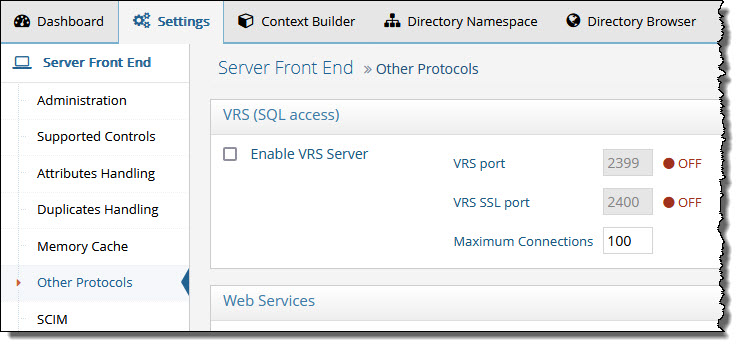

# VRS Settings

The Virtual Relational Server (VRS) is enabled from the Main Control Panel.

On the Settings Tab > Server Front End Settings > Other Protocols, on the right side, check the enable VRS server option. Enter a port, SSL port (optional) and set a maximum number of connections to allow to the server. Click Save and restart the RadiantOne service. If you have a cluster deployed, restart the service on all nodes.

Figure 1: VRS Settings
